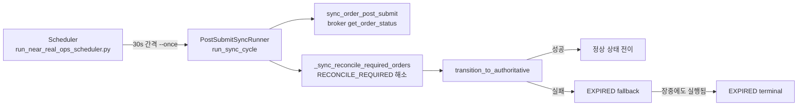
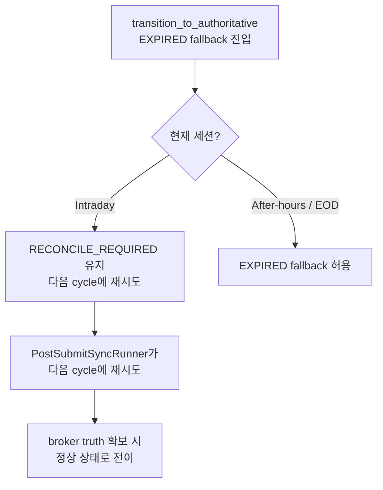

# 장중 미체결 주문 → EXPIRED 조기 전이 Root Cause 분석 및 수정 설계

**작성일**: 2026-05-20  
**상태**: 초안 (리뷰 필요)

---

## 1. 문제 요약

KIS 제출 주문 중 일부가 장중( market hours )에 실제로는 **미체결(open/unfilled)** 상태여야 하는데, 로컬 시스템에서 **EXPIRED(만료)**로 전이되는 문제가 발생합니다. 이는 단순 표시 오류가 아니라, EXPIRED는 terminal 상태이므로 이후 **취소/정정 주문 lifecycle**을 완전히 차단합니다.

---

## 2. 현재 동작 분석

### 2.1. 시스템 아키텍처 개요



### 2.2. Phase 타임라인 (KST)

| Phase | 시간 | post_submit_sync 실행? | RECONCILE_REQUIRED 해소? |
|-------|------|----------------------|--------------------------|
| Pre-market | 08:00 ~ 08:50 | ✅ 1회 | ✅ |
| Intraday | 08:50 ~ 15:30 | ✅ 30s 주기 | ✅ 매 cycle |
| EOD | 15:30 ~ | ✅ 1회 | ✅ |
| After-hours | 15:30+ (1h window) | ❌ 중단 | ❌ |

정의 위치: [`scripts/run_near_real_ops_scheduler.py`](../scripts/run_near_real_ops_scheduler.py:113)

### 2.3. EXPIRED로의 Fallback 경로

#### 경로 A: `resolve_unknown_state()` 예외 → EXPIRED

파일: [`src/agent_trading/services/order_sync_service.py:677-779`](../src/agent_trading/services/order_sync_service.py:677)

1. `transition_to_authoritative()` → `broker.resolve_unknown_state()` 호출
2. `resolve_unknown_state()`에서 예외 발생:
   - `BudgetExhaustedError` (INQUIRY + RECONCILIATION budget 모두 소진)
   - 네트워크/API 오류
   - Paper API에서 `inquire-daily-ccld`가 0 records 반환 + position 조회도 실패
3. SELL 주문인 경우 position-delta inference 시도 (1차 방어, line 691-735)
4. **SELL이 아니거나 inference 실패 시 → EXPIRED로 fallback (line 737-779)**

```python
# line 740-749
logger.warning(
    "Falling back to EXPIRED for order %s (broker=%s) "
    "[resolve_unknown_state failed: %s]",
    ...
)
updated_order = await self._try_transition(
    order, OrderStatus.EXPIRED,  # <-- 장중 EXPIRED로 전이
)
```

#### 경로 B: `resolve_unknown_state()` → `RECONCILE_REQUIRED` 반환 → EXPIRED

파일: [`src/agent_trading/services/order_sync_service.py:802-905`](../src/agent_trading/services/order_sync_service.py:802)

1. `resolve_unknown_state()`가 broker 일일결제/포지션에서 주문을 찾지 못함
   - `inquire-daily-ccld` (7일 범위) → 찾지 못함
   - `inquire_balance` (position 조회) → 찾지 못함
   - **← Paper API의 장중 한계: settle 전이라 ccld에 나타나지 않음**
2. [`_is_genuine_manual_reconciliation()`](../src/agent_trading/services/order_sync_service.py:1037) 판별
   - 24h 미만, broker_order_id 있음 → `False` 반환 (auto-resolve 대상)
3. SELL 주문 position-delta inference 시도 (line 817-861)
4. **BUY이거나 inference 실패 시 → EXPIRED로 fallback (line 863-895)**

```python
# line 872-875
updated_order = await self._try_transition(
    order, OrderStatus.EXPIRED,  # <-- 장중 EXPIRED로 전이
)
```

### 2.4. Paper API의 장중 한계

KIS paper API (`inquire-daily-ccld`)는 **실제 체결 내역이 settle된 후에만** 데이터를 반환합니다. 장중(08:50~15:30)에는 제출된 주문이 `inquire-daily-ccld`에 나타나지 않아 `resolve_unknown_state()`가 정상적인 미체결 주문을 찾지 못합니다.

실제 KIS [`resolve_unknown_state()`](../src/agent_trading/brokers/koreainvestment/rest_client.py:1585) 동작:
1. `inquire_daily_ccld(strt_dt=-7일)` → 0 records (장중) → not found
2. `inquire_balance` (position) → BUY 주문은 position에 반영 안 됨 → not found
3. `return OrderStatusResult(status=RECONCILE_REQUIRED)`

### 2.5. 상태 전이 규칙

[`_ALLOWED_TRANSITIONS`](../src/agent_trading/services/order_manager.py:65)에서:

```
RECONCILE_REQUIRED → {ACKNOWLEDGED, CANCELLED, REJECTED, EXPIRED}
```

- RECONCILE_REQUIRED → EXPIRED는 **허용된 전이**
- EXPIRED는 terminal 상태 → 이후 **어떤 전이도 불가능**

---

## 3. Five Questions 답변

### Q1. 현재 장중 미체결 주문이 EXPIRED로 조기 전이되는 직접 경로는 무엇인가?

**직접 경로는 두 가지이며, 둘 다 [`transition_to_authoritative()`](../src/agent_trading/services/order_sync_service.py:632)에서 발생합니다.**

1. **경로 A (예외 → EXPIRED)**: [`lines 737-779`](../src/agent_trading/services/order_sync_service.py:737) - `resolve_unknown_state()`가 예외를 던지면, SELL position inference 실패 후 EXPIRED로 fallback
2. **경로 B (broker 무응답 → EXPIRED)**: [`lines 863-895`](../src/agent_trading/services/order_sync_service.py:863) - `resolve_unknown_state()`가 RECONCILE_REQUIRED를 반환하고, position inference 실패 후 EXPIRED로 fallback

**트리거 조건**:
- Broker API가 장중에 정상적인 상태를 반환하지 못함 (paper API 한계, budget 소진, rate limit)
- SELL이 아닌 주문(BUY)은 position inference를 시도하지 않음 (lines 693, 817)
- SELL이어도 position snapshot이 없으면 inference 불가
- **market session을 전혀 고려하지 않음** → 장중/장마감 관계없이 동일한 EXPIRED fallback 실행

### Q2. 장중에는 어떤 상태로 유지하는 것이 가장 안전한가?

**`RECONCILE_REQUIRED` 상태 유지가 가장 안전합니다.**

이유:
- `RECONCILE_REQUIRED`는 **non-terminal** 상태
- 매 sync cycle마다 `_sync_reconcile_required_orders()`에서 재시도
- Broker truth가 확보되면 `ACKNOWLEDGED/FILLED/CANCELLED` 등으로 정상 전이 가능
- `_BUDGET_CONSUMING_STATUSES`에서 제외되어 있어 submit budget 소비로 간주되지 않음 (의도된 설계)

**차선책**: `ACKNOWLEDGED` — broker가 주문을 접수했으나 settle이 안 된 경우 적합. 단, broker truth 없이 ACKNOWLEDGED로 잘못 전이되면 위험.

### Q3. 장마감 전에는 EXPIRED 전이를 막아야 하는가?

**네, 막아야 합니다.**

- 장중(08:50~15:30)에는 broker API가 settle 전 데이터를 반환하지 못할 가능성이 높음
- 특히 **Paper 환경**에서 이 현상이 두드러짐
- 장마감 후(15:30~16:30) EOD phase에서 `after_hours=True`로 `inquire_daily_ccld` 호출 → settle 완료 후 데이터 확보 가능
- 따라서 EXPIRED fallback은 **장마감 후 after-hours에만** 허용하는 것이 안전

### Q4. 취소/정정 주문으로 이어지려면 어떤 상태를 유지해야 하는가?

**`ACKNOWLEDGED` 또는 `RECONCILE_REQUIRED` 상태여야 합니다.**

`_ALLOWED_TRANSITIONS` (`order_manager.py:65-104`) 기준:

| 현재 상태 | 취소 가능? | 정정 가능? |
|-----------|-----------|-----------|
| `SUBMITTED` | ❌ (RECONCILE_REQUIRED만 가능) | ❌ |
| `ACKNOWLEDGED` | ✅ (→ CANCELLED) | ✅ (→ PARTIALLY_FILLED → FILLED) |
| `RECONCILE_REQUIRED` | ✅ (→ CANCELLED) | ✅ (→ ACKNOWLEDGED) |
| `EXPIRED` | ❌ (terminal) | ❌ (terminal) |

**EXPIRED가 되면 lifecycle이 완전히 종료**되므로, 취소/정정 workflow가 불가능해집니다.

### Q5. 가장 작은 수정으로 장중 오표시를 막으려면 어디를 고쳐야 하는가?

**최소 수정 대상**: [`transition_to_authoritative()`](../src/agent_trading/services/order_sync_service.py:632)의 EXPIRED fallback 두 곳

- Lines 737-779: `resolve_unknown_state()` 예외 시 EXPIRED fallback
- Lines 863-895: `resolve_unknown_state()`가 RECONCILE_REQUIRED 반환 시 EXPIRED fallback

이 두 fallback에 **market session 가드**를 추가하여, 장중에는 EXPIRED로 전이하지 않고 `RECONCILE_REQUIRED`를 유지하도록 수정.

---

## 4. 수정 설계

### 4.1. 수정 방향

**정책**: Intraday (08:50~15:30 KST) 중에는 EXPIRED fallback 금지. 장마감 후 after-hours에만 허용.



### 4.2. 구체적 수정 사항

#### 수정 1: `transition_to_authoritative()`에 session 가드 추가

**파일**: [`src/agent_trading/services/order_sync_service.py`](../src/agent_trading/services/order_sync_service.py)

**변경 사항**:
- `transition_to_authoritative()`에 `is_after_hours: bool = False` 파라미터 추가
- EXPIRED fallback 두 곳(경로 A line 737, 경로 B line 863)에 가드 조건 추가
- `is_after_hours=False`(장중)이면 EXPIRED fallback 대신 logging + `None` 반환 (RECONCILE_REQUIRED 유지)

**상세 코드 변경**:

```python
async def transition_to_authoritative(
    self,
    account_ref: str,
    broker: BrokerAdapter,
    order: OrderRequestEntity,
    broker_order: BrokerOrderEntity,
    *,
    is_after_hours: bool = False,  # <-- 추가
) -> OrderStatusResult | None:
```

**경로 A (line 737) 수정**:

```python
# 기존 (line 737-779):
# resolve_unknown_state() 예외 시 → 무조건 EXPIRED fallback

# 수정 후:
if not is_after_hours:
    logger.warning(
        "Intraday: EXPIRED fallback suppressed for order %s "
        "[resolve_unknown_state failed: %s] — keeping RECONCILE_REQUIRED",
        broker_order.broker_order_id, exc,
    )
    return None  # RECONCILE_REQUIRED 유지, 다음 cycle에 재시도
# is_after_hours=True인 경우만 기존 EXPIRED fallback 실행
```

**경로 B (line 863) 수정**:

```python
# 기존 (line 863-895):
# broker 무응답 시 → 무조건 EXPIRED fallback

# 수정 후:
if not is_after_hours:
    logger.warning(
        "Intraday: EXPIRED fallback suppressed for order %s "
        "[broker has no record] — keeping RECONCILE_REQUIRED",
        broker_order.broker_order_id,
    )
    return None  # RECONCILE_REQUIRED 유지
# is_after_hours=True인 경우만 기존 EXPIRED fallback 실행
```

#### 수정 2: `_sync_reconcile_required_orders()`에 `is_after_hours` 전파

**파일**: [`src/agent_trading/services/order_sync_service.py`](../src/agent_trading/services/order_sync_service.py:546)

```python
async def _sync_reconcile_required_orders(
    self,
    account_ref: str,
    broker: BrokerAdapter,
    *,
    limit: int = 5,
    is_after_hours: bool = False,  # <-- 추가
) -> int:
```

```python
# line 602 (transition_to_authoritative 호출부):
result = await self.transition_to_authoritative(
    account_ref=account_ref,
    broker=broker,
    order=order,
    broker_order=bo,
    is_after_hours=is_after_hours,  # <-- 전달
)
```

#### 수정 3: `PostSubmitSyncRunner.run_sync_cycle()`에서 after-hours 정보 획득

**파일**: [`src/agent_trading/services/order_sync_service.py:1264-1286`](../src/agent_trading/services/order_sync_service.py:1264)

```python
# line 1270-1275 (run_sync_cycle에서 _sync_reconcile_required_orders 호출부)
resolved = await self.sync_service._sync_reconcile_required_orders(
    account_ref=resolved_account_ref,
    broker=self.broker,
    limit=50,
    is_after_hours=self._is_after_hours(),  # <-- 추가
)
```

`PostSubmitSyncRunner`에 after-hours 판별 메서드 추가:

```python
@staticmethod
def _is_after_hours() -> bool:
    """현재 시간이 KIS after-hours(15:30~)인지 판별."""
    kst = ZoneInfo("Asia/Seoul")
    now = datetime.now(kst)
    market_close = now.replace(hour=15, minute=30, second=0, microsecond=0)
    return now >= market_close
```

#### 수정 4: 스케줄러 EOD phase에서 `--after-hours` 플래그 전달

**파일**: [`scripts/run_post_submit_sync_loop.py`](../scripts/run_post_submit_sync_loop.py)

현재 `--after-hours` 플래그는 이미 snapshot sync에만 사용 중. post_submit_sync_loop에도 동일 플래그를 추가하고, `_run_one_cycle()`에서 `sync_service._sync_reconcile_required_orders()`에 전달.

```python
async def _run_one_cycle(
    settings: AppSettings,
    *,
    account_ref: str | None,
    after_hours: bool = False,  # <-- 추가
) -> SyncCycleResult:
```

```python
# PostSubmitSyncRunner 생성 시 after_hours 전달
runner = PostSubmitSyncRunner(
    repos=repos,
    sync_service=sync_service,
    broker=broker,
    snapshot_refresh_cb=refresh_cb,
    after_hours=after_hours,  # <-- 추가
)
```

### 4.3. 변경 영향 범위

| 파일 | 변경 내용 | 영향도 |
|------|---------|--------|
| `order_sync_service.py:632` | `transition_to_authoritative()`에 `is_after_hours` 파라미터 추가 | 중간 |
| `order_sync_service.py:737-779` | 경로 A EXPIRED fallback 가드 | **핵심** |
| `order_sync_service.py:863-895` | 경로 B EXPIRED fallback 가드 | **핵심** |
| `order_sync_service.py:546` | `_sync_reconcile_required_orders()`에 `is_after_hours` 전파 | 낮음 |
| `order_sync_service.py:1120` | `PostSubmitSyncRunner`에 after-hours 감지 메서드 추가 | 낮음 |
| `run_post_submit_sync_loop.py` | `--after-hours` 플래그 추가 | 낮음 |
| `run_near_real_ops_scheduler.py:761` | EOD post_submit_sync 실행 시 `--after-hours` 전달 | 낮음 |

### 4.4. 수정하지 않는 부분

- `_ALLOWED_TRANSITIONS` (`order_manager.py:65`) — 수정 불필요. RECONCILE_REQUIRED → EXPIRED는 after-hours에는 유효함.
- `resolve_unknown_state()` (`rest_client.py:1585`) — 수정 불필요. broker API 동작은 유지.
- `sync_order_post_submit()` — 수정 불필요. 정상 sync 경로는 영향 없음.
- Market session provider (`market_session.py`) — 수정 불필요. 현재 구현으로 충분.

---

## 5. 추가할 테스트 케이스

### 5.1. 단위 테스트 (Unit Tests)

**테스트 파일**: `tests/services/test_order_sync_service.py` (신규 또는 기존)

| # | 테스트명 | 설명 |
|---|---------|------|
| 1 | `test_transition_to_authoritative_intraday_suppress_expired_fallback_path_a` | 장중, 경로 A(예외)에서 EXPIRED fallback이 억제되고 RECONCILE_REQUIRED 유지 |
| 2 | `test_transition_to_authoritative_intraday_suppress_expired_fallback_path_b` | 장중, 경로 B(broker 무응답)에서 EXPIRED fallback 억제 |
| 3 | `test_transition_to_authoritative_after_hours_allows_expired_fallback_path_a` | After-hours, 경로 A에서 EXPIRED fallback 정상 동작 |
| 4 | `test_transition_to_authoritative_after_hours_allows_expired_fallback_path_b` | After-hours, 경로 B에서 EXPIRED fallback 정상 동작 |
| 5 | `test_transition_to_authoritative_intraday_sell_position_inference_still_works` | 장중에도 SELL position inference는 정상 동작 (현재 로직 유지) |
| 6 | `test_transition_to_authoritative_intraday_genuine_manual_keeps_reconcile` | 장중 genuine manual reconciliation은 RECONCILE_REQUIRED 유지 (변화 없음) |

### 5.2. 통합 테스트 (Integration Tests)

| # | 테스트명 | 설명 |
|---|---------|------|
| 7 | `test_post_submit_sync_cycle_intraday_keeps_reconcile_required` | `run_sync_cycle()` 장중 실행 시 RECONCILE_REQUIRED 주문이 EXPIRED로 전이되지 않음 |
| 8 | `test_post_submit_sync_cycle_after_hours_allows_expired` | `run_sync_cycle()` after-hours 실행 시 EXPIRED fallback 정상 동작 |
| 9 | `test_eod_phase_post_submit_sync_triggers_expired_fallback` | EOD phase의 post_submit_sync가 after-hours 모드로 EXPIRED fallback 허용 |

### 5.3. 테스트 환경 구성

```python
# pytest fixture 예시
@pytest.fixture
def order_sync_service(mock_repos, mock_order_manager):
    return OrderSyncService(
        repos=mock_repos,
        order_manager=mock_order_manager,
    )

@pytest.fixture
def reconcile_required_order():
    return OrderRequestEntity(
        order_request_id=uuid4(),
        status=OrderStatus.RECONCILE_REQUIRED,
        side=OrderSide.BUY,
        requested_quantity=Decimal("10"),
        ...
    )

@pytest.mark.asyncio
async def test_intraday_suppress_expired_fallback_path_a(
    order_sync_service, reconcile_required_order, mock_broker_order
):
    """장중 resolve_unknown_state 예외 → EXPIRED fallback 억제"""
    # given
    mock_broker = AsyncMock()
    mock_broker.resolve_unknown_state.side_effect = BudgetExhaustedError("no budget")
    
    # when
    result = await order_sync_service.transition_to_authoritative(
        account_ref="test",
        broker=mock_broker,
        order=reconcile_required_order,
        broker_order=mock_broker_order,
        is_after_hours=False,  # 장중
    )
    
    # then
    assert result is None  # RECONCILE_REQUIRED 유지
    mock_broker.resolve_unknown_state.assert_called_once()
    # _try_transition(EXPIRED)이 호출되지 않아야 함
```

---

## 6. 취소/정정 후속 연결 메모

### 6.1. 현재 취소/정정 Workflow

현재 시스템에서 cancel/modify path는 [`OrderManager`](../src/agent_trading/services/order_manager.py)를 통해 다음과 같이 동작합니다:

1. **Cancel**: `OrderManager.transition_to(order, OrderStatus.CANCEL_PENDING)` → broker 취소 요청 → `CANCELLED`
2. **Modify**: 신규 주문 생성 + 기존 주문 취소 (replace 패턴)

### 6.2. EXPIRED 조기 전이로 인한 단절

EXPIRED는 `_TERMINAL_STATES`에 포함되므로:
- `_validate_transition()`에서 terminal → any 전이 불가 (`order_manager.py:140-146`)
- `_SYNCABLE_STATUSES`에서 제외되어 sync 대상에서도 제외
- 결국 **운영자 수동 개입**만이 유일한 해결책

### 6.3. 향후 개선 방향

1. **Cancel during RECONCILE_REQUIRED**: `_ALLOWED_TRANSITIONS`에서 이미 허용됨 (RECONCILE_REQUIRED → CANCELLED). 문제는 broker truth 부재 시 취소 요청을 broker가 수용할지 여부.
2. **After-hours reconciliation 강화**: EOD 후 `after_hours=True` inquire로 settle 데이터를 확보하면 RECONCILE_REQUIRED 자연 해소 가능.
3. **WebSocket order event 도입**: 실시간 체결통보(WS)가 도입되면 broker truth를 장중에 실시간 확보 가능 → EXPIRED fallback 자체가 필요 없어짐.

---

## 7. 타임라인 및 우선순위

| 단계 | 작업 | 우선순위 | 의존성 |
|------|------|---------|--------|
| 1 | `transition_to_authoritative()` session 가드 추가 (수정 1) | **P0** | 없음 |
| 2 | `_sync_reconcile_required_orders()` 파라미터 전파 (수정 2) | **P0** | 단계 1 |
| 3 | `PostSubmitSyncRunner` after-hours 감지 (수정 3) | **P0** | 없음 |
| 4 | `run_post_submit_sync_loop.py` 플래그 추가 (수정 4) | **P1** | 단계 3 |
| 5 | 단위 테스트 작성 | **P0** | 단계 1-3 |
| 6 | 통합 테스트 작성 | **P1** | 단계 4 |
| 7 | 스케줄러 EOD phase에 after-hours 전달 | **P1** | 단계 4 |

---

## 8. 부록: 코드 라인 레퍼런스

| 파일 | 라인 | 내용 |
|------|------|------|
| `order_sync_service.py` | 632-905 | `transition_to_authoritative()` 전체 |
| `order_sync_service.py` | 677-779 | 경로 A: 예외 → EXPIRED fallback |
| `order_sync_service.py` | 802-905 | 경로 B: broker 무응답 → EXPIRED fallback |
| `order_sync_service.py` | 737-749 | 경로 A EXPIRED fallback 코드 (수정 대상) |
| `order_sync_service.py` | 863-895 | 경로 B EXPIRED fallback 코드 (수정 대상) |
| `order_sync_service.py` | 546-630 | `_sync_reconcile_required_orders()` |
| `order_sync_service.py` | 1264-1286 | `run_sync_cycle()` → reconcile 호출부 |
| `order_sync_service.py` | 1037-1071 | `_is_genuine_manual_reconciliation()` |
| `order_manager.py` | 65-104 | `_ALLOWED_TRANSITIONS` |
| `order_manager.py` | 106-113 | `_TERMINAL_STATES` (EXPIRED 포함) |
| `order_manager.py` | 115-123 | `_AUTHORITATIVE_REFLECTION_TARGETS` (EXPIRED 포함) |
| `rest_client.py` | 1585-1699 | `resolve_unknown_state()` 전체 |
| `rest_client.py` | 1623-1643 | `inquire_daily_ccld()` 7일 범위 조회 |
| `rest_client.py` | 1651-1688 | position inquiry fallback |
| `rest_client.py` | 1690-1699 | RECONCILE_REQUIRED 반환 |
| `enums.py` | 43-55 | `OrderStatus` enum |
| `run_near_real_ops_scheduler.py` | 113-116 | Phase 시간 상수 |
| `run_near_real_ops_scheduler.py` | 1528 | Intraday phase 조건 (`intraday_at <= now < market_close_at`) |
| `run_near_real_ops_scheduler.py` | 1545 | EOD phase 조건 (`now >= market_close_at`) |
| `run_near_real_ops_scheduler.py` | 740-779 | `_run_end_of_day()` (post_submit_sync 실행) |
