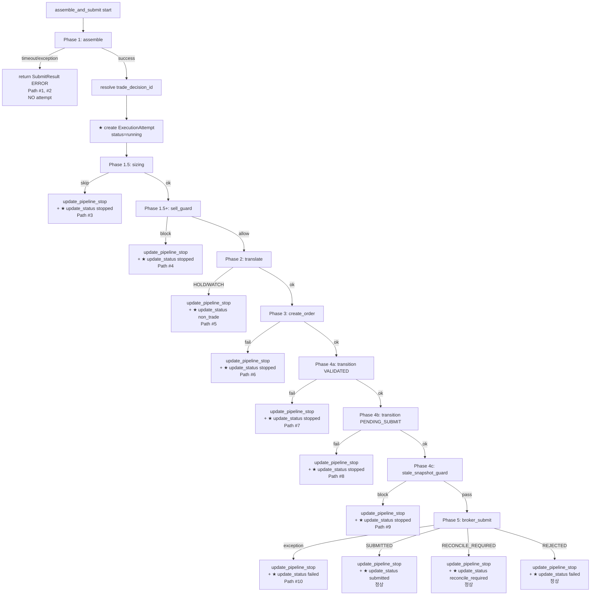

# Phase 3: `ExecutionAttempt` 엔티티 도입 설계 문서

> **날짜**: 2026-05-23
> **이전 단계**: Phase 1 (`execution_status` + `pipeline_stop_*` API 노출) 완료, Phase 2 (`phase_trace` DB 영속화) 완료
> **목표**: `trade_decision`과 실행 흐름을 명시적으로 분리하는 `ExecutionAttempt` 엔티티 도입

---

## 1. 왜 `ExecutionAttempt`가 필요한가

### 1.1 현재 구조의 문제점

현재 `assemble_and_submit()`의 실행 결과는 모두 [`TradeDecisionEntity`](src/agent_trading/domain/entities.py)에 bridge 컬럼으로 저장된다:

| Bridge 컬럼 | 저장 정보 |
|---|---|
| `pipeline_stop_phase` | 파이프라인이 중단된 phase 이름 |
| `pipeline_stop_reason` | 중단 사유 |
| `pipeline_stopped_at` | 중단 시각 |
| `phase_trace` (JSONB) | 각 phase 실행 추적 |

이는 **두 가지 책임(의사결정 + 실행 추적)이 하나의 테이블에 결합**된 상태다.

### 1.2 분리 필요성

1. **의사결정 Truth 유지**: `trade_decisions`는 AI의 판단 결과(decision_type, side, quantity, confidence, rationale 등)를 순수하게 보존해야 함
2. **실행 흐름의 독립적 관리**: 하나의 `trade_decision`에 대해 여러 실행 시도(재시도)가 발생할 수 있음 — 현재 구조에서는 단일 row로는 표현 불가
3. **향후 Decision Pipeline / Execution Pipeline 분리 기반**: 장기적으로 AI 판단 파이프라인과 브로커 실행 파이프라인을 물리적/논리적으로 분리할 때, 이 엔티티가 경계 역할을 함
4. **관측성 향상**: 실행 시도별로 `started_at`, `completed_at`, `stop_phase`, `stop_reason`, `phase_trace`를 독립적으로 관리 가능

### 1.3 용어 정리

| 용어 | 의미 |
|---|---|
| **ExecutionAttempt** | 하나의 `trade_decision`에 대한 1회 실행 시도 |
| **trade_decision** | AI의 의사결정 결과 (무엇을/얼마나/어떻게 살지/팔지) |
| **order_request** | 브로커에 제출된 실제 주문 (브로커 응답 포함) |
| **실행 흐름** | `assemble → size → sell_guard → translate → create_order → transition → submit` |

---

## 2. 엔티티 정의

### 2.1 Python Dataclass

[`src/agent_trading/domain/entities.py`](src/agent_trading/domain/entities.py)에 추가:

```python
@dataclass(slots=True, frozen=True)
class ExecutionAttemptEntity:
    execution_attempt_id: UUID                    # PK
    trade_decision_id: UUID                       # FK → trading.trade_decisions (NOT NULL)
    decision_context_id: UUID                     # FK → trading.decision_contexts (denormalized)
    status: str                                   # running | stopped | submitted | failed | non_trade | reconcile_required
    stop_phase: str | None = None
    stop_reason: str | None = None
    phase_trace: list[dict[str, object]] | None = None  # JSONB (Phase 2에서 저장한 구조물)
    order_request_id: UUID | None = None          # nullable FK → trading.order_requests
    started_at: datetime
    completed_at: datetime | None = None
    created_at: datetime | None = None
```

### 2.2 상태 모델 (6개 값)

```
                    ┌──→ stopped (SKIPPED/ERROR로 중단)
                    │
running ──────────┼──→ submitted (브로커 제출 성공)
                    │
                    ├──→ failed (브로커 REJECTED)
                    │
                    ├──→ reconcile_required (브로커 uncertain)
                    │
                    └──→ non_trade (HOLD/WATCH — 주문 미생성)
```

| 상태 | 의미 | 매핑 근거 |
|---|---|---|
| `running` | 생성 직후, 아직 완료되지 않음 | 생성 시점에 항상 `running` |
| `stopped` | 파이프라인이 SKIPPED/ERROR로 중단됨 | `SubmitResult.status in ("SKIPPED", "ERROR")`, 거래가 아닌 중단 |
| `submitted` | 브로커 제출 성공 | `SubmitResult.status == "SUBMITTED"` |
| `failed` | 브로커 제출 실패/거절 | `SubmitResult.status == "REJECTED"` |
| `reconcile_required` | 브로커가 uncertain 응답 | `SubmitResult.status == "RECONCILE_REQUIRED"` |
| `non_trade` | HOLD/WATCH로 주문 미생성 | `SubmitResult.status == "SKIPPED"` + `error_phase == "translation"` |

### 2.3 DB 테이블

**스키마**: `trading.execution_attempts`

| 컬럼 | 타입 | 제약조건 | 설명 |
|---|---|---|---|
| `execution_attempt_id` | `UUID` | PK | |
| `trade_decision_id` | `UUID` | NOT NULL, FK → `trading.trade_decisions` | |
| `decision_context_id` | `UUID` | NOT NULL, FK → `trading.decision_contexts` | denormalized for query convenience |
| `status` | `VARCHAR(32)` | NOT NULL, DEFAULT `'running'` | |
| `stop_phase` | `VARCHAR(64)` | NULLABLE | 중단된 phase명 |
| `stop_reason` | `TEXT` | NULLABLE | 중단 사유 |
| `phase_trace` | `JSONB` | NULLABLE | Phase 2 형식과 동일 |
| `order_request_id` | `UUID` | NULLABLE, FK → `trading.order_requests` | |
| `started_at` | `TIMESTAMPTZ` | NOT NULL | |
| `completed_at` | `TIMESTAMPTZ` | NULLABLE | |
| `created_at` | `TIMESTAMPTZ` | NOT NULL, DEFAULT `NOW()` | |

**인덱스**:

```sql
CREATE INDEX idx_execution_attempts_trade_decision_id
    ON trading.execution_attempts(trade_decision_id);
CREATE INDEX idx_execution_attempts_decision_context_id
    ON trading.execution_attempts(decision_context_id);
CREATE INDEX idx_execution_attempts_status
    ON trading.execution_attempts(status);
```

---

## 3. 변경 파일 목록과 구체적 변경 사항

### 3.1 파일 개요

| # | 파일 | 변경 유형 | 설명 |
|---|------|----------|------|
| 1 | [`db/migrations/0023_add_execution_attempts.sql`](db/migrations) | **신규** | `trading.execution_attempts` 테이블 생성 + 인덱스 |
| 2 | [`src/agent_trading/domain/entities.py`](src/agent_trading/domain/entities.py) | 수정 | `ExecutionAttemptEntity` dataclass 추가 |
| 3 | [`src/agent_trading/repositories/contracts.py`](src/agent_trading/repositories/contracts.py) | 수정 | `ExecutionAttemptRepository` protocol 추가 |
| 4 | [`src/agent_trading/repositories/postgres/execution_attempts.py`](src/agent_trading/repositories/postgres) | **신규** | Postgres 구현체 |
| 5 | [`src/agent_trading/repositories/memory.py`](src/agent_trading/repositories/memory.py) | 수정 | `InMemoryExecutionAttemptRepository` 구현체 추가 |
| 6 | [`src/agent_trading/repositories/container.py`](src/agent_trading/repositories/container.py) | 수정 | `execution_attempts: ExecutionAttemptRepository` 속성 추가 |
| 7 | [`src/agent_trading/repositories/bootstrap.py`](src/agent_trading/repositories/bootstrap.py) | 수정 | Memory container에 `execution_attempts` 등록 |
| 8 | [`src/agent_trading/repositories/postgres/bootstrap.py`](src/agent_trading/repositories/postgres/bootstrap.py) | 수정 | Postgres container에 `execution_attempts` 등록 |
| 9 | [`src/agent_trading/services/decision_orchestrator.py`](src/agent_trading/services/decision_orchestrator.py) | 수정 | `assemble_and_submit()`에 attempt 생성/업데이트 로직 추가 |
| 10 | [`src/agent_trading/api/schemas.py`](src/agent_trading/api/schemas.py) | 수정 | `ExecutionAttemptDetail` 스키마 추가 |
| 11 | [`src/agent_trading/api/routes/decisions.py`](src/agent_trading/api/routes/decisions.py) | 수정 | `GET /execution-attempts` read-only 엔드포인트 추가 |

### 3.2 파일별 상세 변경 사항

#### 3.2.1 [`db/migrations/0023_add_execution_attempts.sql`](db/migrations) (신규)

전체 SQL은 [8. Migration SQL](#8-migration-sql) 참조. 마이그레이션 번호는 기존 최신(`0022_add_phase_trace_to_trade_decisions.sql`)의 다음 번호.

#### 3.2.2 [`src/agent_trading/domain/entities.py`](src/agent_trading/domain/entities.py)

`TradeDecisionEntity` dataclass 정의 근처(예: ~L400)에 다음 dataclass 추가:

```python
@dataclass(slots=True, frozen=True)
class ExecutionAttemptEntity:
    execution_attempt_id: UUID
    trade_decision_id: UUID
    decision_context_id: UUID
    status: str
    stop_phase: str | None = None
    stop_reason: str | None = None
    phase_trace: list[dict[str, object]] | None = None
    order_request_id: UUID | None = None
    started_at: datetime
    completed_at: datetime | None = None
    created_at: datetime | None = None
```

#### 3.2.3 [`src/agent_trading/repositories/contracts.py`](src/agent_trading/repositories/contracts.py)

`TradeDecisionRepository` protocol 이후에 다음 protocol 추가:

```python
class ExecutionAttemptRepository(Protocol):
    async def add(
        self, attempt: ExecutionAttemptEntity
    ) -> ExecutionAttemptEntity:
        ...

    async def get(
        self, execution_attempt_id: UUID
    ) -> ExecutionAttemptEntity | None:
        ...

    async def update_status(
        self,
        execution_attempt_id: UUID,
        status: str,
        *,
        stop_phase: str | None = None,
        stop_reason: str | None = None,
        phase_trace: list[dict[str, object]] | None = None,
        order_request_id: UUID | None = None,
        completed_at: datetime | None = None,
    ) -> None:
        ...

    async def list_by_trade_decision(
        self, trade_decision_id: UUID
    ) -> Sequence[ExecutionAttemptEntity]:
        ...
```

#### 3.2.4 [`src/agent_trading/repositories/postgres/execution_attempts.py`](src/agent_trading/repositories/postgres) (신규)

```python
from __future__ import annotations

import json
from collections.abc import Sequence
from datetime import datetime
from uuid import UUID

from agent_trading.db.transaction import TransactionManager
from agent_trading.domain.entities import ExecutionAttemptEntity


class PostgresExecutionAttemptRepository:
    __slots__ = ("_tx",)

    def __init__(self, tx: TransactionManager) -> None:
        self._tx = tx

    async def add(
        self, attempt: ExecutionAttemptEntity
    ) -> ExecutionAttemptEntity:
        row = await self._tx.connection.fetchrow(
            """
            INSERT INTO trading.execution_attempts
                (execution_attempt_id, trade_decision_id,
                 decision_context_id, status,
                 stop_phase, stop_reason,
                 phase_trace, order_request_id,
                 started_at, completed_at, created_at)
            VALUES ($1, $2, $3, $4, $5, $6,
                    $7::jsonb, $8, $9, $10, $11)
            RETURNING *
            """,
            attempt.execution_attempt_id,
            attempt.trade_decision_id,
            attempt.decision_context_id,
            attempt.status,
            attempt.stop_phase,
            attempt.stop_reason,
            json.dumps(attempt.phase_trace) if attempt.phase_trace is not None else None,
            attempt.order_request_id,
            attempt.started_at,
            attempt.completed_at,
            attempt.created_at or datetime.now(timezone.utc),
        )
        return _row_to_entity(row)

    async def get(
        self, execution_attempt_id: UUID
    ) -> ExecutionAttemptEntity | None:
        row = await self._tx.connection.fetchrow(
            "SELECT * FROM trading.execution_attempts "
            "WHERE execution_attempt_id = $1",
            execution_attempt_id,
        )
        return _row_to_entity(row) if row else None

    async def update_status(
        self,
        execution_attempt_id: UUID,
        status: str,
        *,
        stop_phase: str | None = None,
        stop_reason: str | None = None,
        phase_trace: list[dict[str, object]] | None = None,
        order_request_id: UUID | None = None,
        completed_at: datetime | None = None,
    ) -> None:
        await self._tx.connection.execute(
            """
            UPDATE trading.execution_attempts
            SET status = $1,
                stop_phase = $2,
                stop_reason = $3,
                phase_trace = CASE WHEN $4::jsonb IS NOT NULL
                    THEN $4::jsonb ELSE phase_trace END,
                order_request_id = COALESCE($5, order_request_id),
                completed_at = COALESCE($6, completed_at)
            WHERE execution_attempt_id = $7
            """,
            status,
            stop_phase,
            stop_reason,
            json.dumps(phase_trace) if phase_trace is not None else None,
            order_request_id,
            completed_at,
            execution_attempt_id,
        )

    async def list_by_trade_decision(
        self, trade_decision_id: UUID
    ) -> Sequence[ExecutionAttemptEntity]:
        rows = await self._tx.connection.fetch(
            "SELECT * FROM trading.execution_attempts "
            "WHERE trade_decision_id = $1 "
            "ORDER BY started_at DESC",
            trade_decision_id,
        )
        return [_row_to_entity(r) for r in rows]


def _row_to_entity(row) -> ExecutionAttemptEntity:
    return ExecutionAttemptEntity(
        execution_attempt_id=row["execution_attempt_id"],
        trade_decision_id=row["trade_decision_id"],
        decision_context_id=row["decision_context_id"],
        status=row["status"],
        stop_phase=row.get("stop_phase"),
        stop_reason=row.get("stop_reason"),
        phase_trace=row.get("phase_trace"),
        order_request_id=row.get("order_request_id"),
        started_at=row["started_at"],
        completed_at=row.get("completed_at"),
        created_at=row.get("created_at"),
    )
```

#### 3.2.5 [`src/agent_trading/repositories/memory.py`](src/agent_trading/repositories/memory.py)

`InMemoryTradeDecisionRepository` 근처에 다음 클래스 추가:

```python
class InMemoryExecutionAttemptRepository:
    def __init__(self) -> None:
        self._items: dict[UUID, ExecutionAttemptEntity] = {}

    async def add(
        self, attempt: ExecutionAttemptEntity
    ) -> ExecutionAttemptEntity:
        self._items[attempt.execution_attempt_id] = attempt
        return attempt

    async def get(
        self, execution_attempt_id: UUID
    ) -> ExecutionAttemptEntity | None:
        return self._items.get(execution_attempt_id)

    async def update_status(
        self,
        execution_attempt_id: UUID,
        status: str,
        *,
        stop_phase: str | None = None,
        stop_reason: str | None = None,
        phase_trace: list[dict[str, object]] | None = None,
        order_request_id: UUID | None = None,
        completed_at: datetime | None = None,
    ) -> None:
        entity = self._items.get(execution_attempt_id)
        if entity is not None:
            object.__setattr__(entity, "status", status)
            if stop_phase is not None:
                object.__setattr__(entity, "stop_phase", stop_phase)
            if stop_reason is not None:
                object.__setattr__(entity, "stop_reason", stop_reason)
            if phase_trace is not None:
                object.__setattr__(entity, "phase_trace", phase_trace)
            if order_request_id is not None:
                object.__setattr__(entity, "order_request_id", order_request_id)
            if completed_at is not None:
                object.__setattr__(entity, "completed_at", completed_at)

    async def list_by_trade_decision(
        self, trade_decision_id: UUID
    ) -> Sequence[ExecutionAttemptEntity]:
        return tuple(
            item for item in self._items.values()
            if item.trade_decision_id == trade_decision_id
        )
```

#### 3.2.6 [`src/agent_trading/repositories/container.py`](src/agent_trading/repositories/container.py)

`RepositoryContainer`에 `execution_attempts` 속성 추가:

```python
from agent_trading.repositories.contracts import (
    ...
    ExecutionAttemptRepository,  # ← 추가
    ...
)

@dataclass(slots=True, frozen=True)
class RepositoryContainer:
    ...
    external_events: ExternalEventRepository
    market_session_repo: MarketSessionRepository
    execution_attempts: ExecutionAttemptRepository  # ← 추가
```

#### 3.2.7 [`src/agent_trading/repositories/bootstrap.py`](src/agent_trading/repositories/bootstrap.py)

Memory container 빌드 함수에 `execution_attempts` 등록:

```python
from agent_trading.repositories.memory import (
    ...
    InMemoryExecutionAttemptRepository,  # ← 추가
    ...
)

def build_in_memory_repositories() -> RepositoryContainer:
    repos = RepositoryContainer(
        ...
        market_session_repo=InMemoryMarketSessionRepository(),
        execution_attempts=InMemoryExecutionAttemptRepository(),  # ← 추가
    )
    ...
```

#### 3.2.8 [`src/agent_trading/repositories/postgres/bootstrap.py`](src/agent_trading/repositories/postgres/bootstrap.py)

Postgres container 빌드 함수에 `execution_attempts` 등록:

```python
from agent_trading.repositories.postgres.execution_attempts import (
    PostgresExecutionAttemptRepository,  # ← 추가
)

def build_postgres_repositories(tx: TransactionManager) -> RepositoryContainer:
    return RepositoryContainer(
        ...
        market_session_repo=PostgresMarketSessionRepository(tx),
        execution_attempts=PostgresExecutionAttemptRepository(tx),  # ← 추가
    )
```

#### 3.2.9 [`src/agent_trading/services/decision_orchestrator.py`](src/agent_trading/services/decision_orchestrator.py)

**변경 상세는 [4. Orchestrator 수정 상세](#4-orchestrator-수정-상세) 참조.**

주요 변경:
1. `_ensure_trade_decision()` 반환 직후 attempt 생성 로직 추가 (L2909 부근)
2. 각 terminal return path (7개)에서 `update_pipeline_stop()` 직후 `update_status()` 호출 추가
3. 정상 경로 (submit 성공/거절/정산필요)에서도 동일 패턴

#### 3.2.10 [`src/agent_trading/api/schemas.py`](src/agent_trading/api/schemas.py)

`ExecutionAttemptDetail` 스키마 추가:

```python
class ExecutionAttemptDetail(BaseModel):
    execution_attempt_id: str
    trade_decision_id: str
    decision_context_id: str
    status: str
    stop_phase: str | None = None
    stop_reason: str | None = None
    phase_trace: list[dict] | None = None
    order_request_id: str | None = None
    started_at: datetime
    completed_at: datetime | None = None
    created_at: datetime | None = None
```

#### 3.2.11 [`src/agent_trading/api/routes/decisions.py`](src/agent_trading/api/routes/decisions.py)

두 개의 read-only 엔드포인트 추가:

```python
@router.get(
    "/execution-attempts",
    response_model=ExecutionAttemptListResponse,
)
async def list_execution_attempts(
    trade_decision_id: str = Query(..., description="Filter by trade decision ID"),
    repos: RepositoryContainer = Depends(get_repos),
) -> ExecutionAttemptListResponse:
    try:
        td_id = UUID(trade_decision_id)
    except ValueError as exc:
        raise HTTPException(status_code=400, detail=f"Invalid UUID: {trade_decision_id}") from exc

    attempts = await repos.execution_attempts.list_by_trade_decision(td_id)
    return ExecutionAttemptListResponse(
        execution_attempts=[
            ExecutionAttemptDetail(
                execution_attempt_id=str(a.execution_attempt_id),
                trade_decision_id=str(a.trade_decision_id),
                decision_context_id=str(a.decision_context_id),
                status=a.status,
                stop_phase=a.stop_phase,
                stop_reason=a.stop_reason,
                phase_trace=a.phase_trace,
                order_request_id=str(a.order_request_id) if a.order_request_id else None,
                started_at=a.started_at,
                completed_at=a.completed_at,
                created_at=a.created_at,
            )
            for a in attempts
        ],
    )


@router.get(
    "/execution-attempts/{execution_attempt_id}",
    response_model=ExecutionAttemptDetail,
)
async def get_execution_attempt(
    execution_attempt_id: str,
    repos: RepositoryContainer = Depends(get_repos),
) -> ExecutionAttemptDetail:
    try:
        ea_id = UUID(execution_attempt_id)
    except ValueError as exc:
        raise HTTPException(status_code=400, detail=f"Invalid UUID: {execution_attempt_id}") from exc

    attempt = await repos.execution_attempts.get(ea_id)
    if attempt is None:
        raise HTTPException(status_code=404, detail=f"Execution attempt not found: {execution_attempt_id}")

    return ExecutionAttemptDetail(
        execution_attempt_id=str(attempt.execution_attempt_id),
        trade_decision_id=str(attempt.trade_decision_id),
        decision_context_id=str(attempt.decision_context_id),
        status=attempt.status,
        stop_phase=attempt.stop_phase,
        stop_reason=attempt.stop_reason,
        phase_trace=attempt.phase_trace,
        order_request_id=str(attempt.order_request_id) if attempt.order_request_id else None,
        started_at=attempt.started_at,
        completed_at=attempt.completed_at,
        created_at=attempt.created_at,
    )
```

응답 스키마도 `schemas.py`에 추가:

```python
class ExecutionAttemptListResponse(BaseModel):
    execution_attempts: list[ExecutionAttemptDetail]
```

---

## 4. Orchestrator 수정 상세

### 4.1 `assemble_and_submit()`의 11개 경로 분석

#### Path #1, #2: attempt 미생성 (Phase 1 timeout/exception)

```
L1024 return SubmitResult(status="ERROR", error_phase="ai_timeout")
L1036 return SubmitResult(status="ERROR", error_phase="ai")
```

이 두 경로는 `_ensure_trade_decision()` **이전**에 실패하므로 attempt를 생성할 `trade_decision_id`가 없다. → 기존 로직 유지, attempt 없음.

#### Path #3~#10 + 정상 경로: attempt 생성 대상

`_ensure_trade_decision()`이 성공적으로 `trade_decision_id`를 반환한 이후에만 실행된다.

### 4.2 Attempt 생성 위치

[`_ensure_trade_decision()`](src/agent_trading/services/decision_orchestrator.py:2810) 호출 직후 (~L2909):

```python
saved = await self._repos.trade_decisions.add(decision)
# ★ 신규: ExecutionAttempt 생성
try:
    attempt = ExecutionAttemptEntity(
        execution_attempt_id=uuid4(),
        trade_decision_id=saved.trade_decision_id,
        decision_context_id=decision_context_id,
        status="running",
        started_at=datetime.now(timezone.utc),
    )
    await self._repos.execution_attempts.add(attempt)
    _current_attempt_id = attempt.execution_attempt_id
except Exception:
    logger.warning(
        "ExecutionAttempt creation failed for trade_decision_id=%s",
        saved.trade_decision_id,
        exc_info=True,
    )
    _current_attempt_id = None
```

단, `_ensure_trade_decision()`은 `assemble()` 내부에서 호출되므로, `assemble_and_submit()`의 메인 메서드에서 attempt 생성이 필요하다. 설계상 다음 두 가지 접근 중 **접근 B를 권장**:

**접근 A — `assemble()` 내부에서 생성** (비권장):
- `assemble()`이 OrderIntent를 반환할 때 attempt_id를 함께 반환해야 함
- OrderIntent/AssembledContext 수정 필요 → 변경 범위 큼

**접근 B — `assemble_and_submit()` 메서드에서 생성** (권장):
- `assemble()` 호출 후 `_ensure_trade_decision()` 완료 시점의 `trade_decision_id`로 attempt 생성
- `assemble_and_submit()`의 L1044~L1053을 참고: 이미 `trade_decision_id` resolve 로직 존재

**구체적 구현 (접근 B)**:

`assemble_and_submit()` 내, intent 반환 후 ~~L1044~L1053 부근:

```python
# Resolve trade_decision_id from the intent for diagnostics.
trade_decision_id: UUID | None = None
_current_attempt_id: UUID | None = None
if intent.decision_context_id is not None:
    try:
        td = await self._repos.trade_decisions.get_by_context(
            intent.decision_context_id
        )
        if td is not None:
            trade_decision_id = td.trade_decision_id
            # ★ 신규: ExecutionAttempt 생성
            try:
                attempt = ExecutionAttemptEntity(
                    execution_attempt_id=uuid4(),
                    trade_decision_id=trade_decision_id,
                    decision_context_id=intent.decision_context_id,
                    status="running",
                    started_at=datetime.now(timezone.utc),
                )
                await self._repos.execution_attempts.add(attempt)
                _current_attempt_id = attempt.execution_attempt_id
            except Exception:
                logger.warning(
                    "Failed to create ExecutionAttempt for td=%s",
                    trade_decision_id,
                    exc_info=True,
                )
    except Exception:
        pass
```

### 4.3 Attempt 업데이트 위치 (각 terminal path)

각 terminal return path에서 `update_pipeline_stop()` 직후에 `execution_attempts.update_status()`를 추가한다.

다음은 각 경로별 매핑:

| Path | Phase | error_phase | pipeline_stop_phase | attempt status | 비고 |
|---|---|---|---|---|---|
| #3 (L1242) | sizing skip | `"sizing"` | `"sizing"` | `"stopped"` | |
| #4 (L1331) | sell_guard block | `"sell_guard"` | `"sell_guard"` | `"stopped"` | |
| #5 (L1414) | translation skip | `"translation"` | `"translation"` | `"non_trade"` | HOLD/WATCH |
| #6 (L1463) | order_create fail | `"order_create"` | `"order_create"` | `"stopped"` | |
| #7 (L1501) | transition VALIDATED fail | `"order_create"` | `"transition"` | `"stopped"` | |
| #8 (L1540) | transition PENDING_SUBMIT fail | `"order_create"` | `"transition"` | `"stopped"` | |
| #9 (L1659/L1745) | stale snapshot guard | `"stale_snapshot"` | `"stale_snapshot_guard"` | `"stopped"` | |
| #10 (L1849) | broker_submit exception | `"order_submit"` | `"broker_submit"` | `"failed"` | |
| 정상 (L1928) | SUBMITTED | - | `"completed"` | `"submitted"` | |
| 정상 (L1928) | RECONCILE_REQUIRED | - | `"completed"` | `"reconcile_required"` | |
| 정상 (L1928) | REJECTED | - | `"completed"` | `"failed"` | |

### 4.4 status 매핑 로직 (헬퍼 함수)

```python
def _map_submit_result_to_attempt_status(
    submit_status: str,
    error_phase: str | None = None,
) -> str:
    """Map SubmitResult status + error_phase to ExecutionAttempt status."""
    if submit_status == "SUBMITTED":
        return "submitted"
    if submit_status == "REJECTED":
        return "failed"
    if submit_status == "RECONCILE_REQUIRED":
        return "reconcile_required"
    if submit_status == "SKIPPED" and error_phase == "translation":
        return "non_trade"
    if submit_status == "SKIPPED":
        return "stopped"
    if submit_status == "ERROR":
        # broker_submit 에러 → failed, 나머지는 stopped
        if error_phase == "order_submit":
            return "failed"
        return "stopped"
    return "stopped"  # fallback
```

### 4.5 업데이트 호출 템플릿

```python
# 각 terminal path에서 update_pipeline_stop() 직후:
if trade_decision_id is not None:
    await self._repos.trade_decisions.update_pipeline_stop(
        trade_decision_id,
        stop_phase,
        stop_reason,
        datetime.now(timezone.utc),
        phase_trace=_phase_trace_to_dicts(_phase_trace),
    )
    # ★ 신규: ExecutionAttempt 상태 업데이트
    if _current_attempt_id is not None:
        await self._repos.execution_attempts.update_status(
            _current_attempt_id,
            _map_submit_result_to_attempt_status(
                SubmitResult(status="SKIPPED"|"ERROR", ...).status,
                error_phase="sizing"|"sell_guard"|...,
            ),
            stop_phase=stop_phase,
            stop_reason=stop_reason,
            phase_trace=_phase_trace_to_dicts(_phase_trace),
            order_request_id=order.order_request_id if order else None,
            completed_at=datetime.now(timezone.utc),
        )
```

### 4.6 상세 구현 가이드

#### Path #3: sizing skip (L1234~L1242 부근)

```python
# 기존
if trade_decision_id is not None:
    await self._repos.trade_decisions.update_pipeline_stop(
        trade_decision_id, "sizing", "sizing_rejected",
        datetime.now(timezone.utc),
        phase_trace=_phase_trace_to_dicts(_phase_trace),
    )
# ★ 신규
if _current_attempt_id is not None:
    await self._repos.execution_attempts.update_status(
        _current_attempt_id, "stopped",
        stop_phase="sizing",
        stop_reason="sizing_rejected",
        phase_trace=_phase_trace_to_dicts(_phase_trace),
        completed_at=datetime.now(timezone.utc),
    )

# return SubmitResult(status="SKIPPED", error_phase="sizing", ...)
```

#### Path #4: sell_guard block (L1323~L1342 부근)

```python
# 기존
if trade_decision_id is not None:
    await self._repos.trade_decisions.update_pipeline_stop(
        trade_decision_id, "sell_guard", "sell_guard_blocked",
        datetime.now(timezone.utc),
        phase_trace=_phase_trace_to_dicts(_phase_trace),
    )
# ★ 신규
if _current_attempt_id is not None:
    await self._repos.execution_attempts.update_status(
        _current_attempt_id, "stopped",
        stop_phase="sell_guard",
        stop_reason="sell_guard_blocked",
        phase_trace=_phase_trace_to_dicts(_phase_trace),
        completed_at=datetime.now(timezone.utc),
    )

# return SubmitResult(status="SKIPPED", error_phase="sell_guard", ...)
```

#### Path #5: translation skip HOLD/WATCH (L1405~L1425 부근)

```python
# 기존
if trade_decision_id is not None:
    reason = "decision_hold" if _dt == "HOLD" else "decision_watch"
    await self._repos.trade_decisions.update_pipeline_stop(
        trade_decision_id, "translation", reason,
        datetime.now(timezone.utc),
        phase_trace=_phase_trace_to_dicts(_phase_trace),
    )
# ★ 신규
if _current_attempt_id is not None:
    await self._repos.execution_attempts.update_status(
        _current_attempt_id, "non_trade",
        stop_phase="translation",
        stop_reason=reason,
        phase_trace=_phase_trace_to_dicts(_phase_trace),
        completed_at=datetime.now(timezone.utc),
    )

# return SubmitResult(status="SKIPPED", error_phase="translation", ...)
```

#### Path #6: order_create fail (L1455~L1471 부근)

```python
# 기존
if trade_decision_id is not None:
    await self._repos.trade_decisions.update_pipeline_stop(
        trade_decision_id, "order_create", "order_create_failed",
        datetime.now(timezone.utc),
        phase_trace=_phase_trace_to_dicts(_phase_trace),
    )
# ★ 신규
if _current_attempt_id is not None:
    await self._repos.execution_attempts.update_status(
        _current_attempt_id, "stopped",
        stop_phase="order_create",
        stop_reason="order_create_failed",
        phase_trace=_phase_trace_to_dicts(_phase_trace),
        completed_at=datetime.now(timezone.utc),
    )

# return SubmitResult(status="ERROR", error_phase="order_create", ...)
```

#### Path #7: transition VALIDATED fail (L1493~L1510 부근)

```python
# 기존
if trade_decision_id is not None:
    await self._repos.trade_decisions.update_pipeline_stop(
        trade_decision_id, "transition", "transition_failed",
        datetime.now(timezone.utc),
        phase_trace=_phase_trace_to_dicts(_phase_trace),
    )
# ★ 신규
if _current_attempt_id is not None:
    await self._repos.execution_attempts.update_status(
        _current_attempt_id, "stopped",
        stop_phase="transition",
        stop_reason="transition_failed",
        phase_trace=_phase_trace_to_dicts(_phase_trace),
        order_request_id=order.order_request_id,
        completed_at=datetime.now(timezone.utc),
    )

# return SubmitResult(status="ERROR", error_phase="order_create", ...)
```

#### Path #8: transition PENDING_SUBMIT fail (L1532~L1549 부근)

```python
# 기존
if trade_decision_id is not None:
    await self._repos.trade_decisions.update_pipeline_stop(
        trade_decision_id, "transition", "transition_failed",
        datetime.now(timezone.utc),
        phase_trace=_phase_trace_to_dicts(_phase_trace),
    )
# ★ 신규
if _current_attempt_id is not None:
    await self._repos.execution_attempts.update_status(
        _current_attempt_id, "stopped",
        stop_phase="transition",
        stop_reason="transition_failed",
        phase_trace=_phase_trace_to_dicts(_phase_trace),
        order_request_id=validated_order.order_request_id,
        completed_at=datetime.now(timezone.utc),
    )

# return SubmitResult(status="ERROR", error_phase="order_create", ...)
```

#### Path #9: stale snapshot guard (L1651~L1673, L1737~L1759 부근)

```python
# 기존
if trade_decision_id is not None:
    await self._repos.trade_decisions.update_pipeline_stop(
        trade_decision_id, "stale_snapshot_guard", "stale_snapshot",
        datetime.now(timezone.utc),
        phase_trace=_phase_trace_to_dicts(_phase_trace),
    )
# ★ 신규
if _current_attempt_id is not None:
    await self._repos.execution_attempts.update_status(
        _current_attempt_id, "stopped",
        stop_phase="stale_snapshot_guard",
        stop_reason="stale_snapshot",
        phase_trace=_phase_trace_to_dicts(_phase_trace),
        order_request_id=pending_order.order_request_id,
        completed_at=datetime.now(timezone.utc),
    )

# return SubmitResult(status="SKIPPED", error_phase="stale_snapshot", ...)
```

#### Path #10: broker_submit exception (L1841~L1858 부근)

```python
# 기존
if trade_decision_id is not None:
    await self._repos.trade_decisions.update_pipeline_stop(
        trade_decision_id, "broker_submit", "broker_submit_failed",
        datetime.now(timezone.utc),
        phase_trace=_phase_trace_to_dicts(_phase_trace),
    )
# ★ 신규
if _current_attempt_id is not None:
    await self._repos.execution_attempts.update_status(
        _current_attempt_id, "failed",
        stop_phase="broker_submit",
        stop_reason="broker_submit_failed",
        phase_trace=_phase_trace_to_dicts(_phase_trace),
        order_request_id=pending_order.order_request_id,
        completed_at=datetime.now(timezone.utc),
    )

# return SubmitResult(status="ERROR", error_phase="order_submit", ...)
```

#### 정상 경로: broker_submit 성공/거절/정산필요 (L1913~L1935 부근)

```python
# 기존
if trade_decision_id is not None:
    await self._repos.trade_decisions.update_pipeline_stop(
        trade_decision_id, "completed", "",
        datetime.now(timezone.utc),
        phase_trace=_phase_trace_to_dicts(_phase_trace),
    )
# ★ 신규: SubmitResult status에 따라 attempt 상태 결정
if _current_attempt_id is not None:
    if final_status == OrderStatus.SUBMITTED:
        _ea_status = "submitted"
    elif final_status == OrderStatus.RECONCILE_REQUIRED:
        _ea_status = "reconcile_required"
    elif final_status == OrderStatus.REJECTED:
        _ea_status = "failed"
    else:
        _ea_status = "submitted"  # fallback
    await self._repos.execution_attempts.update_status(
        _current_attempt_id, _ea_status,
        stop_phase="completed",
        phase_trace=_phase_trace_to_dicts(_phase_trace),
        order_request_id=submitted_order.order_request_id,
        completed_at=datetime.now(timezone.utc),
    )

# return SubmitResult(status=result_status, ...)
```

---

## 5. Bridge 전략

### 5.1 원칙

1. **기존 `trade_decisions.pipeline_stop_*` / `phase_trace` 유지**
   - 모든 terminal path에서 `update_pipeline_stop()` 호출을 그대로 유지
   - Dual-write: `update_pipeline_stop()` + `execution_attempts.update_status()`
2. **데이터 일관성**
   - 동일 `phase_trace` 데이터를 양쪽에 저장
   - 동일 `datetime.now(timezone.utc)`를 `stopped_at`과 `completed_at`에 사용
3. **Path #1, #2 예외**
   - Phase 1 timeout/exception은 `_ensure_trade_decision()` 이전 → attempt 없음
   - 기존 대로 `update_pipeline_stop()` 없이 `SubmitResult`만 반환

### 5.2 Dual-write 패턴

```python
# 모든 terminal path에서 공통 패턴:
if trade_decision_id is not None:
    # Bridge: 기존 trade_decisions 업데이트
    await self._repos.trade_decisions.update_pipeline_stop(
        trade_decision_id, phase, reason, now, phase_trace=phase_trace,
    )
    # 신규: execution_attempts 업데이트
    if _current_attempt_id is not None:
        await self._repos.execution_attempts.update_status(
            _current_attempt_id, status, stop_phase=phase,
            stop_reason=reason, phase_trace=phase_trace,
            order_request_id=...,
            completed_at=now,
        )
```

### 5.3 향후 턴에서 제거 검토

Phase 4+에서 `trade_decisions`의 bridge 컬럼(`pipeline_stop_phase`, `pipeline_stop_reason`, `pipeline_stopped_at`, `phase_trace`) 제거를 검토한다. 제거 조건:

- `ExecutionAttempt`가 모든 실행 흐름을 완전히 커버함을 확인
- Admin UI의 실행 추적 뷰가 `execution_attempts` 테이블을 기준으로 동작
- 기존 API 소비자(`TradeDecisionDetail`의 `pipeline_stop_*` 필드)가 마이그레이션 완료

### 5.4 의사결정 흐름 다이어그램



---

## 6. API read-only 엔드포인트

### 6.1 엔드포인트 명세

```
GET /execution-attempts?trade_decision_id=<uuid>
→ 200 { "execution_attempts": [ExecutionAttemptDetail, ...] }
→ 400 잘못된 UUID

GET /execution-attempts/<uuid>
→ 200 ExecutionAttemptDetail
→ 400 잘못된 UUID
→ 404 Not Found
```

### 6.2 `ExecutionAttemptDetail` 스키마

```python
class ExecutionAttemptDetail(BaseModel):
    execution_attempt_id: str
    trade_decision_id: str
    decision_context_id: str
    status: str
    stop_phase: str | None = None
    stop_reason: str | None = None
    phase_trace: list[dict] | None = None
    order_request_id: str | None = None
    started_at: datetime
    completed_at: datetime | None = None
    created_at: datetime | None = None
```

### 6.3 등록 라우터

[`src/agent_trading/api/routes/decisions.py`](src/agent_trading/api/routes/decisions.py)에 새로운 라우터 파일을 생성하거나 기존 `decisions.py`에 추가. 결정:

**권장**: 별도 파일 [`src/agent_trading/api/routes/execution_attempts.py`](src/agent_trading/api/routes)에 라우터 생성 (단일 책임 원칙)

```python
# src/agent_trading/api/routes/execution_attempts.py
from uuid import UUID

from fastapi import APIRouter, Depends, HTTPException, Query

from agent_trading.api.deps import get_repos
from agent_trading.api.schemas import (
    ExecutionAttemptDetail,
    ExecutionAttemptListResponse,
)
from agent_trading.repositories.container import RepositoryContainer

router = APIRouter(tags=["execution-attempts"])


@router.get("/execution-attempts", response_model=ExecutionAttemptListResponse)
async def list_execution_attempts(
    trade_decision_id: str = Query(..., description="Filter by trade decision ID"),
    repos: RepositoryContainer = Depends(get_repos),
) -> ExecutionAttemptListResponse:
    try:
        td_id = UUID(trade_decision_id)
    except ValueError as exc:
        raise HTTPException(status_code=400, detail=f"Invalid UUID: {trade_decision_id}") from exc

    attempts = await repos.execution_attempts.list_by_trade_decision(td_id)
    return ExecutionAttemptListResponse(
        execution_attempts=[
            ExecutionAttemptDetail(
                execution_attempt_id=str(a.execution_attempt_id),
                trade_decision_id=str(a.trade_decision_id),
                decision_context_id=str(a.decision_context_id),
                status=a.status,
                stop_phase=a.stop_phase,
                stop_reason=a.stop_reason,
                phase_trace=a.phase_trace,
                order_request_id=str(a.order_request_id) if a.order_request_id else None,
                started_at=a.started_at,
                completed_at=a.completed_at,
                created_at=a.created_at,
            )
            for a in attempts
        ],
    )


@router.get("/execution-attempts/{execution_attempt_id}", response_model=ExecutionAttemptDetail)
async def get_execution_attempt(
    execution_attempt_id: str,
    repos: RepositoryContainer = Depends(get_repos),
) -> ExecutionAttemptDetail:
    try:
        ea_id = UUID(execution_attempt_id)
    except ValueError as exc:
        raise HTTPException(status_code=400, detail=f"Invalid UUID: {execution_attempt_id}") from exc

    attempt = await repos.execution_attempts.get(ea_id)
    if attempt is None:
        raise HTTPException(status_code=404, detail=f"Execution attempt not found: {execution_attempt_id}")

    return ExecutionAttemptDetail(
        execution_attempt_id=str(attempt.execution_attempt_id),
        trade_decision_id=str(attempt.trade_decision_id),
        decision_context_id=str(attempt.decision_context_id),
        status=attempt.status,
        stop_phase=attempt.stop_phase,
        stop_reason=attempt.stop_reason,
        phase_trace=attempt.phase_trace,
        order_request_id=str(attempt.order_request_id) if attempt.order_request_id else None,
        started_at=attempt.started_at,
        completed_at=attempt.completed_at,
        created_at=attempt.created_at,
    )
```

`main.py`에서 라우터 등록:

```python
from agent_trading.api.routes.execution_attempts import router as execution_attempts_router

app.include_router(execution_attempts_router)
```

---

## 7. 테스트 계획

### 7.1 Repository CRUD (5개 테스트)

| 테스트명 | 검증 내용 | 파일 |
|---|---|---|
| `test_add_and_read` | 생성 후 조회 시 동일 데이터 반환 | `tests/repositories/test_execution_attempt_repo.py` |
| `test_get_not_found` | 존재하지 않는 ID 조회 시 `None` | 동일 |
| `test_update_status` | 상태 변경 + `completed_at` 설정 확인 | 동일 |
| `test_list_by_trade_decision` | 다중 attempt 조회 (최신순 정렬) | 동일 |
| `test_phase_trace_jsonb` | JSONB 데이터 저장/조회 | 동일 |

Postgres + InMemory 구현체 모두 테스트 (pytest fixture로 분기).

### 7.2 Orchestrator 생성/업데이트 (11개 테스트)

| # | 테스트명 | 검증 내용 |
|---|---|---|
| 1 | `test_creates_attempt_after_trade_decision` | `assemble_and_submit()` 정상 경로에서 attempt 생성 확인 |
| 2 | `test_path3_sizing_skip_sets_stopped` | sizing skip 시 `status="stopped"` |
| 3 | `test_path4_sell_guard_block_sets_stopped` | sell_guard block 시 `status="stopped"` |
| 4 | `test_path5_translation_hold_sets_non_trade` | HOLD → `status="non_trade"` |
| 5 | `test_path5_translation_watch_sets_non_trade` | WATCH → `status="non_trade"` |
| 6 | `test_path6_order_create_fail_sets_stopped` | order_create 실패 → `status="stopped"` |
| 7 | `test_path7_transition_validated_fail_sets_stopped` | VALIDATED 실패 → `status="stopped"` |
| 8 | `test_path8_transition_pending_submit_fail_sets_stopped` | PENDING_SUBMIT 실패 → `status="stopped"` |
| 9 | `test_path9_stale_snapshot_sets_stopped` | stale snapshot → `status="stopped"` |
| 10 | `test_path10_broker_submit_exception_sets_failed` | broker_submit 예외 → `status="failed"` |
| 11 | `test_normal_path_submitted` | SUBMITTED → `status="submitted"` |
| 12 | `test_normal_path_reconcile_required` | RECONCILE_REQUIRED → `status="reconcile_required"` |
| 13 | `test_normal_path_rejected` | REJECTED → `status="failed"` |
| 14 | `test_no_attempt_on_ai_error` | Path #1, #2에서 attempt 미생성 |

### 7.3 Bridge 회귀 (3개 테스트)

| 테스트명 | 검증 내용 |
|---|---|
| `test_bridge_pipeline_stop_still_recorded` | 기존 `update_pipeline_stop()` 호출 유지 확인 |
| `test_bridge_phase_trace_dual_write` | 동일 `phase_trace`가 양쪽에 기록됨 |
| `test_bridge_no_attempt_on_ai_error` | Path #1, #2에서 attempt 없이 기존 로직 유지 |

### 7.4 API read-only (4개 테스트)

| 테스트명 | 검증 내용 |
|---|---|
| `test_list_execution_attempts` | GET `/execution-attempts?trade_decision_id=...` |
| `test_list_empty` | 존재하지 않는 `trade_decision_id` → 빈 배열 |
| `test_get_execution_attempt` | GET `/execution-attempts/{id}` → 200 |
| `test_get_execution_attempt_not_found` | GET `/execution-attempts/{id}` → 404 |

---

## 8. Migration SQL

```sql
-- db/migrations/0023_add_execution_attempts.sql

CREATE TABLE trading.execution_attempts (
    execution_attempt_id UUID PRIMARY KEY,
    trade_decision_id UUID NOT NULL REFERENCES trading.trade_decisions(trade_decision_id),
    decision_context_id UUID NOT NULL REFERENCES trading.decision_contexts(decision_context_id),
    status VARCHAR(32) NOT NULL DEFAULT 'running',
    stop_phase VARCHAR(64),
    stop_reason TEXT,
    phase_trace JSONB,
    order_request_id UUID REFERENCES trading.order_requests(order_request_id),
    started_at TIMESTAMPTZ NOT NULL,
    completed_at TIMESTAMPTZ,
    created_at TIMESTAMPTZ NOT NULL DEFAULT NOW()
);

CREATE INDEX idx_execution_attempts_trade_decision_id
    ON trading.execution_attempts(trade_decision_id);
CREATE INDEX idx_execution_attempts_decision_context_id
    ON trading.execution_attempts(decision_context_id);
CREATE INDEX idx_execution_attempts_status
    ON trading.execution_attempts(status);

COMMENT ON TABLE trading.execution_attempts IS
    'trading.execution_attempts: 각 trade_decision의 1회 실행 시도를 추적.
     의사결정(trade_decisions)과 실행 흐름(phase progression, order 생성/제출)을
     명시적으로 분리한다. Phase 3 — 도입 설계 문서:
     plans/introduce_execution_attempt_entity_to_separate_decision_and_execution_flow_2026-05-23.md';

COMMENT ON COLUMN trading.execution_attempts.status IS
    'running | stopped | submitted | failed | non_trade | reconcile_required';
COMMENT ON COLUMN trading.execution_attempts.stop_phase IS
    '파이프라인이 중단된 phase 이름 (예: sizing, sell_guard, translation, ...)';
COMMENT ON COLUMN trading.execution_attempts.stop_reason IS
    '중단 사유 (예: sizing_rejected, sell_guard_blocked, decision_hold, ...)';
COMMENT ON COLUMN trading.execution_attempts.phase_trace IS
    'Phase 2 형식과 동일한 JSONB — 각 phase별 elapsed_ms/status 배열';
```

---

## 9. 변경 요약 및 영향도

### 9.1 신규 파일 (4개)

| 파일 | 라인 수 (추정) |
|---|---|
| `db/migrations/0023_add_execution_attempts.sql` | ~30 |
| `src/agent_trading/repositories/postgres/execution_attempts.py` | ~130 |
| `src/agent_trading/api/routes/execution_attempts.py` | ~100 |
| (테스트 파일) `tests/repositories/test_execution_attempt_repo.py` | ~200 |

### 9.2 수정 파일 (7개)

| 파일 | 변경 규모 |
|---|---|
| `src/agent_trading/domain/entities.py` | ~15줄 (dataclass 1개) |
| `src/agent_trading/repositories/contracts.py` | ~20줄 (Protocol 1개) |
| `src/agent_trading/repositories/memory.py` | ~60줄 (class 1개) |
| `src/agent_trading/repositories/container.py` | ~3줄 (import + field 1개) |
| `src/agent_trading/repositories/bootstrap.py` | ~3줄 (import + instance 1개) |
| `src/agent_trading/repositories/postgres/bootstrap.py` | ~3줄 (import + instance 1개) |
| `src/agent_trading/services/decision_orchestrator.py` | ~80줄 (attempt 생성 + 9개 update 호출) |

### 9.3 영향 없는 영역

- `.env` 변경 없음
- 기존 `trade_decisions.pipeline_stop_*` / `phase_trace` 제거 없음
- 기존 API 응답 스키마 변경 없음
- 기존 테스트 변경 불필요 (회귀 방지)

---

## 10. 구현 순서 (권장)

| 순서 | 작업 | 의존성 |
|---|---|---|
| 1 | Migration SQL 작성 (`0023_add_execution_attempts.sql`) | 없음 |
| 2 | `ExecutionAttemptEntity` dataclass 추가 (`entities.py`) | 없음 |
| 3 | `ExecutionAttemptRepository` protocol 추가 (`contracts.py`) | #2 |
| 4 | Postgres 구현체 작성 (`postgres/execution_attempts.py`) | #2, #3 |
| 5 | InMemory 구현체 추가 (`memory.py`) | #2, #3 |
| 6 | Container에 `execution_attempts` 등록 (`container.py`) | #3 |
| 7 | Bootstrap에 등록 (`bootstrap.py`, `postgres/bootstrap.py`) | #6 |
| 8 | API 스키마 + 엔드포인트 추가 (`schemas.py`, `routes/execution_attempts.py`) | #6 |
| 9 | Repository CRUD 테스트 | #4, #5 |
| 10 | Orchestrator attempt 생성/업데이트 로직 추가 (`decision_orchestrator.py`) | #7 |
| 11 | Orchestrator + Bridge 테스트 | #10 |
| 12 | API read-only 테스트 | #8 |

---

## 11. 위험 및 고려사항

### 11.1 Dual-write 일관성

`update_pipeline_stop()`과 `execution_attempts.update_status()`가 별도 트랜잭션에서 실행될 가능성 있음. 현재 `decision_orchestrator.py`는 단일 DB 커넥션에서 동작하므로, 두 호출은 동일 트랜잭션 내에서 실행됨. PostgresUnitOfWork가 commit 시점까지 지연하므로 트랜잭션 일관성은 확보됨.

### 11.2 Attempt 생성 실패 처리

attempt 생성 실패 시 orchestrator는 정상 진행해야 함 (`logger.warning` + `_current_attempt_id = None`). attempt 업데이트도 `_current_attempt_id is not None` 조건으로 보호.

### 11.3 frozen dataclass 제약

`ExecutionAttemptEntity`는 `frozen=True`이므로 `update_status()`에서는 `object.__setattr__`로 필드를 직접 설정 (InMemory)하거나 DB UPDATE (Postgres)를 사용. 새 객체를 생성하는 `replace()` 방식도 가능하나, InMemory 레퍼런스 유지를 위해 `object.__setattr__`를 채택.

### 11.4 기존 테스트 회귀

InMemory 구현체에 `InMemoryExecutionAttemptRepository`가 추가되므로, 기존 테스트에서 InMemory container 사용 시 `execution_attempts` 속성이 있어야 함. 만약 기존 테스트가 `build_in_memory_repositories()`를 사용한다면 자동으로 포함됨. 커스텀 container 생성 코드가 있다면 수정 필요.

---

## 12. 최종 구현 결과

### 12.1 작업 범위

Phase 3: `ExecutionAttempt` 엔티티 도입. 기존 `trade_decisions` 중심 관측 모델에서 실행 흐름을 별도 엔티티로 분리하는 1차 구조 작업.

### 12.2 `ExecutionAttemptEntity` 모델 (최종)

[`src/agent_trading/domain/entities.py`](src/agent_trading/domain/entities.py:531)에 정의된 최종 dataclass:

```python
@dataclass(slots=True, frozen=True)
class ExecutionAttemptEntity:
    execution_attempt_id: UUID       # PK
    trade_decision_id: UUID          # FK → trade_decisions
    decision_context_id: UUID        # FK → decision_contexts (denormalized)
    status: str                      # running | stopped | submitted | failed | non_trade | reconcile_required
    stop_phase: str | None = None
    stop_reason: str | None = None
    phase_trace: list[dict[str, object]] | None = None  # JSONB
    order_request_id: UUID | None = None
    started_at: datetime
    completed_at: datetime | None = None
    created_at: datetime | None = None
```

### 12.3 상태 모델 (6개 terminal 상태)

```
running ─┬─→ stopped     (SKIPPED/ERROR 중단 — sizing, sell_guard, order_create, transition, stale_snapshot)
          ├─→ submitted   (브로커 제출 성공 — SUBMITTED)
          ├─→ failed      (브로커 제출 실패/거절 — REJECTED, broker_submit ERROR)
          ├─→ reconcile_required (정산 필요 — RECONCILE_REQUIRED)
          └─→ non_trade   (HOLD/WATCH — translation skip)
```

### 12.4 변경 파일 목록 (16개 파일)

| # | 파일 | 작업 | 내용 |
|---|------|------|------|
| 1 | [`db/migrations/0023_add_execution_attempts.sql`](db/migrations/0023_add_execution_attempts.sql) | **신규** | `trading.execution_attempts` 테이블 + 3개 인덱스 |
| 2 | [`src/agent_trading/domain/entities.py`](src/agent_trading/domain/entities.py:531) | **수정** | `ExecutionAttemptEntity` dataclass 추가 |
| 3 | [`src/agent_trading/repositories/contracts.py`](src/agent_trading/repositories/contracts.py:871) | **수정** | `ExecutionAttemptRepository` protocol (add/get/update_status/list_by_trade_decision) |
| 4 | [`src/agent_trading/repositories/postgres/execution_attempts.py`](src/agent_trading/repositories/postgres/execution_attempts.py) | **신규** | Postgres 구현 (asyncpg, JSONB 역직렬화) |
| 5 | [`src/agent_trading/repositories/memory.py`](src/agent_trading/repositories/memory.py:1328) | **수정** | `InMemoryExecutionAttemptRepository` |
| 6 | [`src/agent_trading/repositories/container.py`](src/agent_trading/repositories/container.py:34) | **수정** | `execution_attempts` 속성 등록 |
| 7 | [`src/agent_trading/repositories/bootstrap.py`](src/agent_trading/repositories/bootstrap.py:71) | **수정** | In-memory bootstrap 등록 |
| 8 | [`src/agent_trading/repositories/postgres/bootstrap.py`](src/agent_trading/repositories/postgres/bootstrap.py:69) | **수정** | Postgres bootstrap 등록 |
| 9 | [`src/agent_trading/api/schemas.py`](src/agent_trading/api/schemas.py:1057) | **수정** | `ExecutionAttemptDetail`, `ExecutionAttemptListResponse` |
| 10 | [`src/agent_trading/api/routes/execution_attempts.py`](src/agent_trading/api/routes/execution_attempts.py) | **신규** | `GET /execution-attempts`, `GET /execution-attempts/{id}` |
| 11 | [`src/agent_trading/api/app.py`](src/agent_trading/api/app.py) | **수정** | Router 등록 |
| 12 | [`src/agent_trading/services/decision_orchestrator.py`](src/agent_trading/services/decision_orchestrator.py:1056) | **수정** | attempt 생성 + 10개 terminal path dual-write |
| 13 | [`admin_ui/src/types/api.ts`](admin_ui/src/types/api.ts:410) | **수정** | `ExecutionAttemptDetail` 인터페이스 |
| 14 | [`tests/repositories/test_postgres_execution_attempts.py`](tests/repositories/test_postgres_execution_attempts.py) | **신규** | Repository 5개 테스트 |
| 15 | [`tests/api/test_execution_attempts.py`](tests/api/test_execution_attempts.py) | **신규** | API 8개 테스트 |
| 16 | [`src/agent_trading/runtime/bootstrap.py`](src/agent_trading/runtime/bootstrap.py) | - | bootstrap→container 체인으로 자동 처리 (별도 수정 불필요) |

### 12.5 Bridge 전략

- 기존 `trade_decisions.pipeline_stop_*` / `phase_trace` 완전 유지
- 각 terminal path에서 dual-write: `update_pipeline_stop()` + `execution_attempts.update_status()`
- Path #1, #2 (Phase 1 timeout/exception): `_ensure_trade_decision()` 이전 실패 → attempt 미생성
- 향후 턴에서 bridge 컬럼 제거 검토

### 12.6 버그 수정 (4건)

1. **`ExecutionAttemptEntity` 필드 순서 오류** — `order_request_id`(default 있음)가 `started_at`(default 없음)보다 먼저 선언되어 dataclass 오류 발생. `started_at`을 optional 필드보다 앞으로 이동.

2. **Fixture cross-module 참조 불가** — `test_postgres_trade_decisions.py`의 fixture를 `test_postgres_execution_attempts.py`에서 참조 불가. 로컬 fixture 정의로 해결.

3. **`phase_trace` JSONB 문자열 미파싱** — asyncpg가 JSONB를 문자열로 반환 시 `_row_to_entity()`가 `json.loads()` 없이 raw string 전달. `isinstance(raw, str)` 체크 + `json.loads()` 역직렬화 추가.

4. **API 테스트 `coroutine was never awaited`** — 동기 테스트에서 `repos.broker_accounts.add()` 호출 시 `await` 누락. `_items` dict 직접 쓰기로 변경.

### 12.7 테스트 결과

| 테스트 파일 | 통과/실패 | 통과 수 |
|-------------|----------|---------|
| `test_postgres_execution_attempts.py` (신규) | ✅ 통과 | 5/5 |
| `test_execution_attempts.py` (신규) | ✅ 통과 | 8/8 |
| `test_decision_submit_pipeline.py` (회귀) | ✅ 통과 | 64/64 |
| `test_postgres_trade_decisions.py` (회귀) | ✅ 통과 | 19/19 |
| `test_inspection.py` (회귀) | ✅ 통과 | 56/56 |
| `test_postgres_inspection.py` (회귀) | ✅ 통과 | 14/14 |
| `test_agent_runs.py` (회귀) | ✅ 통과 | 8/8 |
| `test_health.py` (회귀) | ✅ 통과 | 15/15 |
| **통합** | ✅ | **189/189** |

### 12.8 Docker 재빌드 + Health Check

- `docker compose build --no-cache api`: ✅ 성공
- `docker compose up -d api`: ✅ 성공
- Migration `0023_add_execution_attempts.sql` 자동 적용: ✅
- `GET /health`: `{"status":"ok","database":"connected","runtime_mode":"postgres","healthy":true}` ✅
- `GET /execution-attempts`: 401 (route 정상, auth 필요) ✅
- DB `\d trading.execution_attempts`: 11개 컬럼, PK, FK 3개, 인덱스 3개 모두 정상 ✅

### 12.9 다음 단계 제안 (Pipeline 분리)

1. **UI 연결**: [`DecisionsView.tsx`](admin_ui/src/components/DecisionsView.tsx)에 ExecutionAttempt detail 패널 추가
2. **Decision Pipeline / Execution Pipeline 분리**: orchestrator에서 decision path와 execution path를 별도 서비스로 분리
3. **Bridge 컬럼 정리**: `trade_decisions.pipeline_stop_*` / `phase_trace` deprecated 후 제거
4. **재시도(re-try) 지원**: `execution_attempts` 테이블 활용한 re-try 로직
