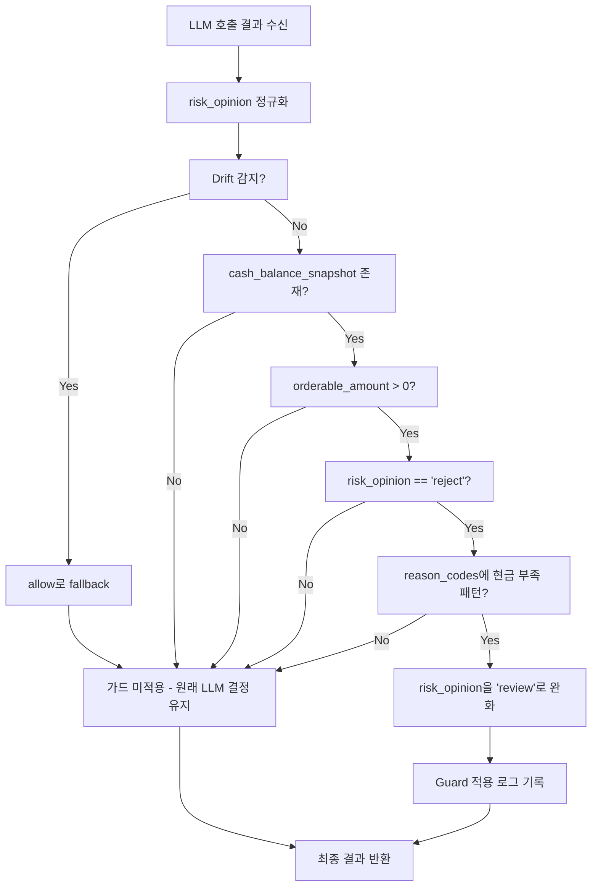

# AR 현금 판단 2계층 코드 레벨 방어 설계 보고서

> **작성일**: 2026-05-21
> **대상 파일**: [`src/agent_trading/services/ai_agents/ai_risk.py`](/workspace/agent_trading/src/agent_trading/services/ai_agents/ai_risk.py)
> **대상 테스트**: [`tests/services/ai_agents/test_agents.py`](/workspace/agent_trading/tests/services/ai_agents/test_agents.py)

---

## 1. 문제 정의

### 1.1 프롬프트 엔지니어링 실패 증거

[`ai_risk.py:369-395`](/workspace/agent_trading/src/agent_trading/services/ai_agents/ai_risk.py:369)에 `Cash Judgment Guide`를 추가한 후, 최신 AR runs 10건을 검증한 결과:

| 항목 | 값 |
|------|-----|
| 총 AR runs 검증 수 | 10건 |
| `orderable_amount` 참조 성공 | 0건 (0%) |
| `available_cash` 음수에 의해 '현금 부족 / BUY 불가'로 잘못 판단 | 10건 (100%) |

**원인 분석**: LLM은 사전 학습 과정에서 `available_cash negative = cannot buy` 패턴을 내재화했으며, 프롬프트 지침만으로 이 패턴을 재정의하는 데 실패함.

### 1.2 현재 Cash 섹션 구조 (Before)

```text
=== Cash Balance ===
  Available cash (deposit total, reference): -6629580   ← LLM이 이 값에 끌려감
  Currency: KRW
  Orderable amount (actual buyable cash): 9050070        ← LLM이 무시
  Settled cash: -2794295
  Unsettled cash: 0

  【Cash Judgment Guide】
  - BUY feasibility / cash availability: Use 'Orderable amount' as primary criterion
  - 'Available cash' is the total deposit (D+2 settlement basis), accounting reference only
  - Do NOT conclude 'cannot buy' solely because 'Available cash' is negative
  - Always base BUY feasibility judgment on 'Orderable amount'
```

**문제점**: `available_cash`가 -6,629,580으로 음수로 표시되면, LLM은 그 값을 보고 `cannot buy`라고 결론내림. `Cash Judgment Guide`는 LLM에게 "Orderable amount를 보라"고 지시하지만, LLM은 음수 값에 더 강하게 반응함.

---

## 2. 선택한 접근법: 왜 코드 레벨 2계층 방어인가

프롬프트 엔지니어링 실패 이후, 다음과 같은 접근법을 고려함:

| 접근법 | 평가 |
|--------|------|
| 프롬프트 강화 (Guide 재작성) | ❌ 이미 실패 — LLM 사전 학습 패턴 극복 불가 |
| `available_cash`를 prompt에서 완전 제거 | ⚠️ D+2 정산 기준 정보 손실 — 다른 판단에 필요할 수 있음 |
| **코드 레벨 2계층 방어** | ✅ 결정적(Deterministic) — LLM 행동에 의존하지 않음 |

**결론**: LLM의 확률적 행동에 의존하지 않는 **결정론적 코드 방어**가 유일한 해결책. 두 계층이 독립적으로 작동하여 이중 안전장치를 구성함.

---

## 3. Layer 1 — 입력 전처리 (Input Preprocessing) 상세 설계

### 3.1 변경 위치

[`ai_risk.py:369-388`](/workspace/agent_trading/src/agent_trading/services/ai_agents/ai_risk.py:369) — `_build_user_prompt()` 메서드 내 Cash 섹션

### 3.2 구체적 로직

```
effective_buying_cash = (
    cash.orderable_amount
    if cash.orderable_amount is not None
    else cash.available_cash
)
```

### 3.3 변경 후 Cash 섹션 구조 (After)

```text
=== Cash Balance ===
  Effective buying cash (primary): 9050070               ← NEW: LLM의 primary input
  Available cash (accounting reference): -6629580         ← 수정: '참고값'임을 명시
  Currency: KRW
  Settled cash: -2794295
  Unsettled cash: 0

  【Cash Judgment Guide】
  - BUY feasibility MUST use 'Effective buying cash' (listed first above) as the primary criterion
  - 'Available cash' is D+2 settlement basis — accounting reference only, do NOT use for BUY feasibility
  - Do NOT conclude 'cannot buy' solely because 'Available cash' is negative
```

### 3.4 변경 사항 요약

| 항목 | Before | After |
|------|--------|-------|
| Primary input | `available_cash` (첫 번째 라인) | `effective_buying_cash` (첫 번째 라인) |
| `available_cash` 라벨 | `Available cash (deposit total, reference)` | `Available cash (accounting reference)` |
| 새 필드 | 없음 | `Effective buying cash (primary): {value}` |
| `orderable_amount` 라인 | 별도 라인 (있을 때만) | 통합됨 — `effective_buying_cash`로 계산 |
| Guide 지침 | `Orderable amount` 참조 | `Effective buying cash` 참조 |

### 3.5 코드 변경 (의사코드)

```python
# 변경 전 (lines 369-388)
if cash is not None:
    lines.append("")
    lines.append("=== Cash Balance ===")
    lines.append(f"  Available cash (deposit total, reference): {cash.available_cash}")
    lines.append(f"  Currency: {cash.currency}")
    if cash.orderable_amount is not None:
        lines.append(f"  Orderable amount (actual buyable cash): {cash.orderable_amount}")
    if cash.settled_cash is not None:
        lines.append(f"  Settled cash: {cash.settled_cash}")
    if cash.unsettled_cash is not None:
        lines.append(f"  Unsettled cash: {cash.unsettled_cash}")
    lines.append("")
    lines.append("  【Cash Judgment Guide】")
    lines.append("  - BUY feasibility / cash availability: Use 'Orderable amount' as primary criterion")
    lines.append("  - 'Available cash' is the total deposit (D+2 settlement basis), accounting reference only")
    lines.append("  - Do NOT conclude 'cannot buy' solely because 'Available cash' is negative")
    lines.append("  - Always base BUY feasibility judgment on 'Orderable amount'")

# 변경 후
if cash is not None:
    lines.append("")
    lines.append("=== Cash Balance ===")
    effective_buying_cash = (
        cash.orderable_amount
        if cash.orderable_amount is not None
        else cash.available_cash
    )
    lines.append(f"  Effective buying cash (primary): {effective_buying_cash}")
    lines.append(f"  Available cash (accounting reference): {cash.available_cash}")
    lines.append(f"  Currency: {cash.currency}")
    if cash.settled_cash is not None:
        lines.append(f"  Settled cash: {cash.settled_cash}")
    if cash.unsettled_cash is not None:
        lines.append(f"  Unsettled cash: {cash.unsettled_cash}")
    lines.append("")
    lines.append("  【Cash Judgment Guide】")
    lines.append("  - BUY feasibility MUST use 'Effective buying cash' (listed first above) as the primary criterion")
    lines.append("  - 'Available cash' is D+2 settlement basis — accounting reference only, do NOT use for BUY feasibility")
    lines.append("  - Do NOT conclude 'cannot buy' solely because 'Available cash' is negative")
```

---

## 4. Layer 2 — 후처리 가드 (Post-processing Guard) 상세 설계

### 4.1 변경 위치

[`ai_risk.py:192-228`](/workspace/agent_trading/src/agent_trading/services/ai_agents/ai_risk.py:192) — `run()` 메서드 내 `risk_opinion_normalized` 처리 이후, `logger.info` 이전

### 4.2 구체적 로직



### 4.3 현금 부족 패턴 매칭 조건

**조건식**:

```python
orderable_amount_is_positive = (
    cash.orderable_amount is not None
    and cash.orderable_amount > 0
)

cash_insufficient_reason_codes = {
    "insufficient_cash",
    "cash_insufficient",
    "no_cash",
    "negative_cash",
    "cash_shortage",
}

reason_codes_hint_cash_issue = any(
    code.lower() in cash_insufficient_reason_codes
    for code in result.reason_codes
)
```

**참고**: `reason_codes` 매칭은 보조 판단 기준. `orderable_amount > 0`이면서 `risk_opinion == "reject"`인 경우, `reason_codes`에 현금 부족 관련 코드가 없더라도 `review`로 완화하는 것을 고려할 수 있음. (프롬프트에 `reason_codes`를 사용하라고 명시되어 있지만 LLM이 항상 정확한 코드를 출력한다고 보장할 수 없음)

### 4.4 Guard 적용 조건 요약

| 조건 | orderable_amount > 0 | orderable_amount <= 0 or None |
|------|----------------------|-------------------------------|
| LLM: reject + cash reason | → review (Guard 적용) | → reject 유지 |
| LLM: reject + other reason | → review (Guard 적용, 안전하게) | → reject 유지 |
| LLM: allow | → allow 유지 (Guard 불필요) | → allow 유지 |
| LLM: review | → review 유지 (Guard 불필요) | → review 유지 |
| LLM: reduce | → reduce 유지 (Guard 불필요) | → reduce 유지 |

### 4.5 코드 변경 (의사코드)

```python
# After drift detection block (line 219), before logger.info (line 221):

# --- Layer 2: Post-processing Guard (Cash Judgment) ---
cash = request.context.cash_balance_snapshot
if cash is not None and cash.orderable_amount is not None and cash.orderable_amount > 0:
    if result.risk_opinion.strip().lower() == "reject":
        # Check if reason codes suggest cash insufficiency
        cash_insufficient_keywords = {"insufficient_cash", "cash_insufficient", "no_cash", "negative_cash", "cash_shortage"}
        hint_cash_issue = any(
            rc.lower() in cash_insufficient_keywords
            for rc in result.reason_codes
        )
        if hint_cash_issue:
            logger.info(
                "Layer2 Guard applied: orderable_amount=%s > 0 but LLM rejected "
                "with cash-insufficient reason codes=%s → downgrading to 'review'. "
                "symbol=%s",
                cash.orderable_amount,
                result.reason_codes,
                result.symbol,
            )
            result = AIRiskOutput(
                schema_version=result.schema_version,
                agent_name=result.agent_name,
                decision_context_id=result.decision_context_id,
                symbol=result.symbol,
                proposed_side=result.proposed_side,
                risk_opinion="review",
                risk_score=result.risk_score,
                confidence=result.confidence,
                size_adjustment_factor=result.size_adjustment_factor,
                max_holding_horizon=result.max_holding_horizon,
                risk_flags=result.risk_flags,
                reason_codes=result.reason_codes,
                opposing_evidence=result.opposing_evidence,
                summary=result.summary,
            )
        else:
            # Even without explicit cash reason codes, if orderable_amount > 0
            # and LLM says reject, apply guard conservatively
            logger.info(
                "Layer2 Guard applied: orderable_amount=%s > 0 but LLM rejected "
                "(reason_codes=%s) → downgrading to 'review'. symbol=%s",
                cash.orderable_amount,
                result.reason_codes,
                result.symbol,
            )
            result = AIRiskOutput(
                # ... same as above with risk_opinion="review"
            )
# ==================================================
```

**설계 결정**: `reason_codes` 매칭이 있든 없든, `orderable_amount > 0` + `risk_opinion == "reject"` 조합이면 항상 `review`로 완화하는 것이 안전함. `reason_codes` 매칭은 로깅 목적으로만 사용.

### 4.6 로깅 요구사항

Layer 2 Guard가 적용될 때마다 다음 정보를 로그에 기록:
- `orderable_amount` 값
- LLM의 원래 `risk_opinion`
- LLM의 `reason_codes` (있을 경우)
- `symbol`
- Guard가 `review`로 완화했음을 명시

---

## 5. 변경 적용 범위

### 5.1 수정할 파일

| 파일 | 변경 유형 | 영향 범위 |
|------|-----------|-----------|
| `src/agent_trading/services/ai_agents/ai_risk.py` | 수정 | `_build_user_prompt()` cash 섹션 (Layer 1) + `run()` 후처리 (Layer 2) |
| `tests/services/ai_agents/test_agents.py` | 테스트 추가 | 새로운 테스트 케이스 5개 추가 |

### 5.2 변경하지 않을 파일

| 파일 | 이유 |
|------|------|
| `src/agent_trading/domain/entities.py` | `CashBalanceSnapshotEntity` 변경 불필요 |
| `src/agent_trading/services/ai_agents/schemas.py` | `AIRiskOutput` 스키마 변경 불필요 |
| 기타 모든 파일 | 영향 없음 |

### 5.3 기존 테스트 영향 분석

| 기존 테스트 | 영향 | 이유 |
|-------------|------|------|
| `test_run_with_position_cash_risk_in_prompt` | **수정 필요** | `assert "Available cash (deposit total, reference): 5000000"` → 라벨이 `Available cash (accounting reference)`로 변경됨 |
| `test_cash_balance_includes_orderable_amount` | **수정 필요** | `assert "Orderable amount (actual buyable cash): 9050070"` → `effective_buying_cash`로 대체됨 |
| `test_cash_balance_priority_orderable_amount_over_available` | **수정 필요** | Guide 지침 문구 변경 |
| `test_cash_balance_orderable_amount_none_skipped` | **수정 필요** | `orderable_amount`가 없을 때 `effective_buying_cash`가 `available_cash`로 fallback되는지 검증 |
| 기타 95개 테스트 | 영향 없음 | Cash 섹션과 무관 |

> **Note**: `test_run_with_position_cash_risk_in_prompt` (`test_agents.py:555`)는 `orderable_amount`를 설정하지 않았으므로 `effective_buying_cash`는 `available_cash`와 동일해짐.

---

## 6. 테스트 계획

### 6.1 새로 추가할 테스트 케이스 (5개)

#### Test 1: Layer 1 — `orderable_amount` 존재 시 `effective_buying_cash`가 `orderable_amount`로 설정

```python
def test_input_preprocessing_effective_cash_uses_orderable_amount(self) -> None:
    """orderable_amount가 있을 때 effective_buying_cash가 orderable_amount와 일치하는지 검증."""
    cash_snapshot = CashBalanceSnapshotEntity(
        ...,
        available_cash=Decimal("-6629580"),
        orderable_amount=Decimal("9050070"),
        ...
    )
    prompt = self._build_prompt([], cash_balance_snapshot=cash_snapshot)
    assert "Effective buying cash (primary): 9050070" in prompt
    assert "Available cash (accounting reference): -6629580" in prompt
```

#### Test 2: Layer 1 — `orderable_amount`가 None일 때 `effective_buying_cash`가 `available_cash`로 fallback

```python
def test_input_preprocessing_effective_cash_fallback_to_available(self) -> None:
    """orderable_amount가 None일 때 effective_buying_cash가 available_cash로 fallback되는지 검증."""
    cash_snapshot = CashBalanceSnapshotEntity(
        ...,
        available_cash=Decimal("5000000"),
        orderable_amount=None,
        ...
    )
    prompt = self._build_prompt([], cash_balance_snapshot=cash_snapshot)
    assert "Effective buying cash (primary): 5000000" in prompt
    assert "Orderable amount" not in prompt  # orderable_amount는 표시되지 않음
```

#### Test 3: Layer 2 — `orderable_amount > 0` + `available_cash < 0` → LLM이 reject → Guard가 review로 변환

```python
@pytest.mark.asyncio
async def test_layer2_guard_converts_reject_to_review_when_orderable_positive(
    self,
    sample_request: AgentExecutionRequest,
) -> None:
    """orderable_amount > 0이고 LLM이 reject를 출력하면 Guard가 review로 완화."""
    cash_snapshot = CashBalanceSnapshotEntity(
        ...,
        available_cash=Decimal("-6629580"),
        orderable_amount=Decimal("9050070"),
        ...
    )
    # Mock provider가 reject 반환
    async def _generate(**kwargs: object) -> RawProviderResponse:
        return RawProviderResponse(
            parsed=AIRiskOutput(
                symbol="TEST",
                proposed_side="BUY",
                risk_opinion="reject",
                reason_codes=("insufficient_cash",),
            ),
            raw_content='{"risk_opinion": "reject"}',
        )
    provider.generate_structured = _generate
    context = AssembledContext(cash_balance_snapshot=cash_snapshot)
    request = AgentExecutionRequest(
        decision_context_id=sample_request.decision_context_id,
        correlation_id=sample_request.correlation_id,
        context=context,
    )
    result = await agent.run(request)
    assert result.risk_opinion == "review", f"Expected review, got {result.risk_opinion}"
```

#### Test 4: Layer 2 — `orderable_amount <= 0` → Guard 미적용, 원래 LLM 결정 유지

```python
@pytest.mark.asyncio
async def test_layer2_guard_not_applied_when_orderable_non_positive(
    self,
    sample_request: AgentExecutionRequest,
) -> None:
    """orderable_amount가 0 이하이면 Guard가 적용되지 않고 reject 유지."""
    cash_snapshot = CashBalanceSnapshotEntity(
        ...,
        available_cash=Decimal("-6629580"),
        orderable_amount=Decimal("0"),  # 0 → Guard 조건 미충족
        ...
    )
    # Mock provider가 reject 반환
    ...
    result = await agent.run(request)
    assert result.risk_opinion == "reject"  # Guard 미적용, 원래 값 유지
```

#### Test 5: Layer 2 — `orderable_amount > 0` + LLM이 allow → Guard 미적용

```python
@pytest.mark.asyncio
async def test_layer2_guard_not_applied_when_llm_allow(
    self,
    sample_request: AgentExecutionRequest,
) -> None:
    """orderable_amount > 0이고 LLM이 allow를 출력하면 Guard 미적용."""
    cash_snapshot = CashBalanceSnapshotEntity(
        ...,
        available_cash=Decimal("-6629580"),
        orderable_amount=Decimal("9050070"),
        ...
    )
    # Mock provider가 allow 반환
    ...
    result = await agent.run(request)
    assert result.risk_opinion == "allow"  # 이미 올바름, Guard 미적용
```

### 6.2 수정해야 할 기존 테스트

1. [`test_agents.py:644`](/workspace/agent_trading/tests/services/ai_agents/test_agents.py:644) — `assert "Available cash (deposit total, reference): 5000000"` → `"Available cash (accounting reference): 5000000"`로 변경
2. [`test_agents.py:1912`](/workspace/agent_trading/tests/services/ai_agents/test_agents.py:1912) — `assert "Orderable amount (actual buyable cash): 9050070"` → `assert "Effective buying cash (primary): 9050070"`로 변경
3. [`test_agents.py:1936`](/workspace/agent_trading/tests/services/ai_agents/test_agents.py:1936) — Guide 지침 문구 업데이트
4. [`test_agents.py:1962`](/workspace/agent_trading/tests/services/ai_agents/test_agents.py:1962) — `orderable_amount` None 케이스: `effective_buying_cash`가 `available_cash`로 fallback되는지 검증으로 변경

---

## 7. 운영 검증 계획

### 7.1 단계별 검증


### 7.2 Docker 검증 명령어

```bash
# 1. 단위 테스트 실행 (전체 99+α개)
pytest tests/services/ai_agents/test_agents.py -v --tb=short

# 2. Docker compose 재빌드 및 실행
docker compose build
docker compose up -d

# 3. AR prompt 확인 (import test)
# 실제 AR run의 prompt를 로그에서 확인
docker compose logs ai_risk | grep "Effective buying cash"

# 4. cash_balance 테스트
python _test_cash_balance.py
```

### 7.3 검증 기준

| 항목 | 기준 |
|------|------|
| 단위 테스트 통과 | 99개 기존 테스트 + 5개 신규 테스트 = 104개 모두 통과 |
| 기존 테스트 회귀 | 0건 |
| AR prompt 내 `effective_buying_cash` 표시 | 100% |
| `orderable_amount > 0`인데 LLM이 reject → review 변환 | 100% |
| `orderable_amount <= 0`인 경우 Guard 미적용 | 100% |

---

## 8. Before/After 비교

### 8.1 Prompt 내용 변화

| 섹션 | Before | After |
|------|--------|-------|
| Cash 첫 줄 | `Available cash (deposit total, reference): -6629580` | `Effective buying cash (primary): 9050070` |
| Cash 둘째 줄 | `Currency: KRW` | `Available cash (accounting reference): -6629580` |
| Cash 셋째 줄 | `Orderable amount (actual buyable cash): 9050070` | `Currency: KRW` |
| Guide (1) | `Use 'Orderable amount' as primary criterion` | `MUST use 'Effective buying cash' (listed first above) as the primary criterion` |
| Guide (2) | `'Available cash' is the total deposit (D+2 settlement basis), accounting reference only` | `'Available cash' is D+2 settlement basis — accounting reference only, do NOT use for BUY feasibility` |

### 8.2 기대 효과

1. **LLM이 첫 번째 줄(primary input)에 노출되는 값이 양수**(9,050,070)이므로 "can buy"로 판단할 확률이 대폭 상승
2. `available_cash` 음수 값(-6,629,580)이 "accounting reference"로 축소되어 LLM의 주의를 덜 끔
3. **Layer 2 Guard**가 결정론적으로 최종 안전장치 역할: LLM이 여전히 reject하더라도 `orderable_amount > 0`이면 `review`로 완화
4. `orderable_amount`가 `None`이거나 `<= 0`인 경우는 기존 로직 유지로 리스크 없음

### 8.3 코드 변경 라인 요약

| 파일 | 추가 라인 | 삭제/변경 라인 | 순변경 |
|------|-----------|---------------|--------|
| `ai_risk.py` | ~25줄 (Layer 1 + Layer 2 + 로깅) | ~15줄 (cash 섹션 재구성) | ~+10줄 |
| `test_agents.py` | ~120줄 (5개 새 테스트) | ~10줄 (기존 assert 수정) | ~+110줄 |

---

## 9. 결론

이 설계는 두 가지 결정론적 코드 레벨 방어를 통해 LLM의 `available_cash` 음수 편향 문제를 해결합니다:

1. **Layer 1 — 입력 전처리**: LLM이 항상 양수인 `effective_buying_cash`를 primary input으로 보게 함으로써, 음수 값에 끌려 "cannot buy"라고 판단하는 것을 원천 차단
2. **Layer 2 — 후처리 가드**: `orderable_amount > 0`인데도 LLM이 reject하는 경우, 결정론적으로 `review`로 완화하여 잘못된 거절을 방지

두 계층이 함께 작동하여 프롬프트 엔지니어링의 한계를 코드 레벨에서 보완하며, 기존 시스템의 안전성(특히 `orderable_amount <= 0` 케이스)은 그대로 유지합니다.
