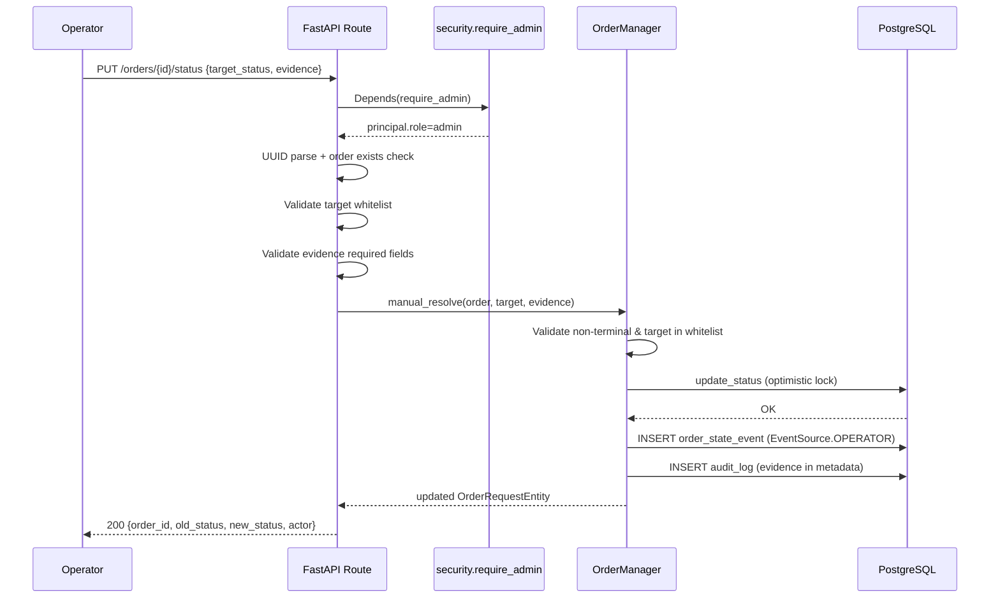
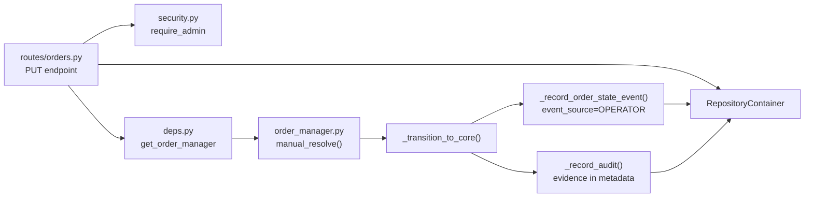

# 운영자용 수동 Order 상태 변경 API 설계

## 1. 목적

현재 `001230` 같은 paper truth unavailable 주문을 수동 해소하려면 DB 직접 `UPDATE`가 필요하다.
이를 운영 가능한 방식으로 바꾸기 위해, **운영자(Admin 권한)가 주문 상태를 수동으로 확정할 수 있는 API**를 구현한다.

### 1.1 핵심 원칙

1. **안전성**: DB 직접 수정보다 안전한 guardrail 제공
2. **감사 추적성**: 모든 수동 override는 `audit_logs` + `order_state_events`에 영구 기록
3. **재사용**: 기존 `OrderManager._transition_to_core()`를 재사용하여 optimistic locking + audit 보존
4. **제한적 권한**: Admin role 소유자만 호출 가능

---

## 2. 분석 결과

### 2.1 기존 상태 전이 시스템

| 구성 요소 | 위치 | 설명 |
|-----------|------|------|
| `_ALLOWED_TRANSITIONS` | [`order_manager.py:65-104`](../src/agent_trading/services/order_manager.py:65) | 정규 경로용 전이 허용 목록 |
| `_TERMINAL_STATES` | [`order_manager.py:106-113`](../src/agent_trading/services/order_manager.py:106) | `{FILLED, CANCELLED, REJECTED, EXPIRED}` |
| `transition_to()` | [`order_manager.py:494-545`](../src/agent_trading/services/order_manager.py:494) | `_validate_transition()` 호출 후 `_transition_to_core()` |
| `transition_to_authoritative()` | [`order_manager.py:547-605`](../src/agent_trading/services/order_manager.py:547) | Recon path, `_validate_transition()` SKIP, `_validate_authoritative_target()` 사용 |
| `_transition_to_core()` | [`order_manager.py:607-705`](../src/agent_trading/services/order_manager.py:607) | Optimistic locking + audit + event 기록 (실질적 core) |
| `_record_order_state_event()` | [`order_manager.py:731-756`](../src/agent_trading/services/order_manager.py:731) | `EventSource.INTERNAL` **hardcoded** |
| `_record_status_change()` | [`order_manager.py:758-778`](../src/agent_trading/services/order_manager.py:758) | `_record_audit()` 위임, `action="order.status_change"` |
| `_record_audit()` | [`order_manager.py:780-806`](../src/agent_trading/services/order_manager.py:780) | `AuditLogEntity` 저장, `metadata` dict 지원 |

### 2.2 v1 제약 — `RECONCILE_REQUIRED` 전용

v1의 `manual_resolve()`는 **현재 상태가 `RECONCILE_REQUIRED`인 주문에 대해서만** 동작한다.

- `order.status != OrderStatus.RECONCILE_REQUIRED` → 400 Bad Request
- Terminal 상태에서 호출 → 400 (이미 terminal)
- Non-terminal + non-RECONCILE_REQUIRED 상태에서 호출 → 400 (v1 미지원, 필요 시 v2에서 확장)

### 2.3 `RECONCILE_REQUIRED` 에서 허용된 전이 (기존 상태 머신)

```
RECONCILE_REQUIRED → {ACKNOWLEDGED, CANCELLED, REJECTED, EXPIRED}
```

**주의**: `FILLED`는 현재 `_ALLOWED_TRANSITIONS`에서 명시적으로 제외되어 있다.
(Plan 34 정책 — reconciliation 중 fill notification으로 낙관적 전이 금지)

그러나 `manual_resolve()`는 이 제약을 무시하고 `FILLED`도 허용한다.
(operator decision이 reconciliation보다 우선한다는 원칙)

### 2.3 인증 시스템

| 구성 요소 | 위치 | 설명 |
|-----------|------|------|
| `Principal` | [`security.py:29-42`](../src/agent_trading/api/security.py:29) | `token: str`, `role: str` |
| `require_viewer()` | [`security.py:117-142`](../src/agent_trading/api/security.py:117) | role in `("viewer", "admin")` 체크 |
| Router 등록 | [`app.py:244-249`](../src/agent_trading/api/app.py:244) | 모든 protected router에 `[Depends(require_viewer)]` **일괄 적용** |

**현재 `require_admin()`은 존재하지 않음** — 새로 추가 필요.

### 2.4 API 계층에서 OrderManager 접근성

현재 FastAPI routes는 `RepositoryContainer`(repos)만 접근 가능하다.
`OrderManager`는 `bootstrap.py`, `event_loop.py`, `decision_orchestrator.py`에서만 사용된다.

**해결책**: `deps.py`에 `get_order_manager()` 의존성 추가 (repos로부터 OrderManager 동적 생성)

### 2.5 엔티티 구조

```
OrderStateEventEntity:
  - event_source: EventSource  ← EventSource.OPERATOR = "operator" 이미 존재!
  - reason_code: str | None
  - previous_status, new_status: OrderStatus

AuditLogEntity:
  - actor_type: str  ← "operator"
  - actor_id: str    ← operator identity (token subject or role)
  - action: str      ← "order.status_change"
  - metadata: dict   ← evidence JSON 저장 가능!
```

---

## 3. API 계약

### 3.1 Endpoint

```
PUT /orders/{order_request_id}/status
```

### 3.2 Request Body

```json
{
  "target_status": "rejected",
  "reason_code": "MANUAL_RESOLVE",
  "reason_message": "Paper truth unavailable — operator confirmed via KIS UI",
  "evidence": {
    "source": "kis_paper_ui",
    "checked_at": "2026-05-16T10:30:00Z",
    "broker_native_order_id": "0000035653",
    "operator_note": "KIS paper sandbox does not return this order in inquire_daily_ccld. Confirm via UI that no fill occurred."
  }
}
```

### 3.3 Response (200)

```json
{
  "order_id": "uuid",
  "old_status": "reconcile_required",
  "new_status": "rejected",
  "updated_at": "2026-05-16T10:35:00Z",
  "actor": "admin"
}
```

### 3.4 Error Responses

| HTTP Status | Condition |
|-------------|-----------|
| 404 | `order_request_id` not found |
| 400 | `target_status` not in whitelist |
| 400 | `evidence` missing or empty |
| 400 | Order already in terminal state (terminal → terminal forbid) |
| 403 | Insufficient permissions (non-admin caller) |

### 3.5 Target Status Whitelist

```python
_MANUAL_RESOLVE_TARGETS: frozenset[OrderStatus] = frozenset({
    OrderStatus.FILLED,
    OrderStatus.CANCELLED,
    OrderStatus.REJECTED,
    OrderStatus.EXPIRED,
})
```

---

## 4. 변경 상세

### 4.1 [`security.py`](../src/agent_trading/api/security.py)

**변경**: `require_admin()` 의존성 추가

```python
async def require_admin(
    principal: Principal = Depends(get_current_principal),
) -> Principal:
    if principal.role != "admin":
        raise HTTPException(
            status_code=status.HTTP_403_FORBIDDEN,
            detail="Insufficient permissions — admin role required",
        )
    return principal
```

### 4.2 [`order_manager.py`](../src/agent_trading/services/order_manager.py)

#### 4.2.1 `_record_order_state_event()` — `event_source` 파라미터 추가

```python
async def _record_order_state_event(
    self,
    before: OrderRequestEntity,
    after: OrderRequestEntity,
    event_source: EventSource = EventSource.INTERNAL,  # NEW
) -> None:
    event = OrderStateEventEntity(
        ...
        event_source=event_source,  # was hardcoded EventSource.INTERNAL
        ...
    )
```

#### 4.2.2 `manual_resolve()` 메서드 신규 추가 (v1 — `RECONCILE_REQUIRED` 전용)

```python
_MANUAL_RESOLVE_TARGETS: frozenset[OrderStatus] = frozenset({
    OrderStatus.FILLED,
    OrderStatus.CANCELLED,
    OrderStatus.REJECTED,
    OrderStatus.EXPIRED,
})

class OrderManager:
    async def manual_resolve(
        self,
        order: OrderRequestEntity,
        target_status: OrderStatus,
        *,
        reason_code: str = "MANUAL_RESOLVE",
        reason_message: str | None = None,
        evidence: dict[str, object] | None = None,
        operator: str = "unknown",
    ) -> OrderRequestEntity:
        """Manual operator override — RECONCILE_REQUIRED 전용 (v1).

        SKIP _validate_transition() — manual override is by definition
        outside the normal state machine.  Instead, validation is:
        1. Order MUST be in RECONCILE_REQUIRED (v1 제약)
        2. Target must be in _MANUAL_RESOLVE_TARGETS
        3. Evidence must be provided and non-empty

        Audit trail:
        - order_state_event with EventSource.OPERATOR
        - audit_log with structured evidence in metadata

        Reconciliation 후속 처리:
        - reconciliation_service가 존재하면, order와 연결된 PENDING run을
          resolved로 mark한다 (mark_resolved).
          실패해도 상태 전이는 유지 — log warning만 남긴다.
        """
        # === v1 Validation: RECONCILE_REQUIRED only ===
        if order.status != OrderStatus.RECONCILE_REQUIRED:
            raise InvalidStateTransitionError(
                order.order_request_id, order.status, target_status,
                reason=(
                    f"Manual resolve v1 supports RECONCILE_REQUIRED only, "
                    f"got {order.status.value}"
                ),
            )
        if target_status not in _MANUAL_RESOLVE_TARGETS:
            raise ValueError(
                f"{target_status.value} is not a valid manual resolve target. "
                f"Allowed: {', '.join(s.value for s in _MANUAL_RESOLVE_TARGETS)}"
            )
        if not evidence:
            raise ValueError("evidence is required for manual resolve")

        # === Core transition with EventSource.OPERATOR ===
        after = await self._transition_to_core(
            order,
            target_status,
            reason_code=reason_code,
            reason_message=reason_message,
            actor_type="operator",
            actor_id=operator,
            event_source=EventSource.OPERATOR,
        )

        # === Reconciliation 후속 처리 (fail-safe) ===
        if self.reconciliation_service is not None:
            try:
                await self.reconciliation_service.mark_resolved(
                    account_id=after.account_id,
                    resolved_by="manual_resolve",
                    summary=(
                        f"Manual operator resolve: "
                        f"{order.status.value} -> {target_status.value}"
                    ),
                )
            except Exception as exc:
                logger.warning(
                    "Manual resolve reconciliation mark_resolved failed: %s", exc
                )

        return after
```

#### 4.2.3 `_transition_to_core()` — `event_source` 파라미터 추가

```python
async def _transition_to_core(
    self,
    order: OrderRequestEntity,
    target_status: OrderStatus,
    *,
    reason_code: str | None = None,
    reason_message: str | None = None,
    actor_type: str = "system",
    actor_id: str = "order_manager",
    event_source: EventSource = EventSource.INTERNAL,  # NEW
    max_retries: int = 3,
    retry_delay: float = 0.05,
) -> OrderRequestEntity:
    ...
    await self._record_order_state_event(before, after, event_source=event_source)  # CHANGED
    await self._record_status_change(before, after, actor_type, actor_id)
    ...
```

### 4.3 [`deps.py`](../src/agent_trading/api/deps.py)

**변경**: `get_order_manager()` 의존성 추가

```python
from agent_trading.services.order_manager import OrderManager

async def get_order_manager(
    repos: RepositoryContainer = Depends(get_repos),
) -> AsyncIterator[OrderManager]:
    """Request-scoped OrderManager for write operations."""
    from agent_trading.services.reconciliation_service import ReconciliationService
    
    reconciliation_service = ReconciliationService(repos=repos)
    om = OrderManager(
        repos=repos,
        reconciliation_service=reconciliation_service,
        budget_manager=None,
    )
    yield om
```

### 4.4 [`routes/orders.py`](../src/agent_trading/api/routes/orders.py)

**변경**: `PUT /{order_request_id}/status` 엔드포인트 추가

```python
from agent_trading.api.schemas import ManualStatusChangeRequest, ManualStatusChangeResponse
from agent_trading.api.security import require_admin
from agent_trading.services.order_manager import OrderManager
from agent_trading.api.deps import get_order_manager

@router.put("/{order_request_id}/status", response_model=ManualStatusChangeResponse)
async def manual_resolve_order_status(
    order_request_id: str,
    body: ManualStatusChangeRequest,
    repos: RepositoryContainer = Depends(get_repos),
    order_manager: OrderManager = Depends(get_order_manager),
    principal: Principal = Depends(require_admin),  # ← admin 전용!
) -> ManualStatusChangeResponse:
    # 1. Parse UUID
    try:
        uid = UUID(order_request_id)
    except ValueError:
        raise HTTPException(status_code=400, detail=f"Invalid UUID: {order_request_id}")
    
    # 2. Find order
    order = await repos.orders.get(uid)
    if order is None:
        raise HTTPException(status_code=404, detail=f"Order not found: {order_request_id}")
    
    # 3. Validate evidence
    if not body.evidence:
        raise HTTPException(status_code=400, detail="evidence is required")
    required_fields = {"source", "checked_at"}
    missing = required_fields - set(body.evidence.keys())
    if missing:
        raise HTTPException(status_code=400, detail=f"evidence missing required fields: {missing}")
    
    # 4. Execute manual resolve
    try:
        updated = await order_manager.manual_resolve(
            order,
            body.target_status,
            reason_code=body.reason_code or "MANUAL_RESOLVE",
            reason_message=body.reason_message,
            evidence=body.evidence,
            operator=principal.role,
        )
    except InvalidStateTransitionError as e:
        raise HTTPException(status_code=400, detail=str(e))
    except ValueError as e:
        raise HTTPException(status_code=400, detail=str(e))
    
    return ManualStatusChangeResponse(
        order_id=str(updated.order_request_id),
        old_status=order.status.value,
        new_status=updated.status.value,
        updated_at=updated.updated_at,
        actor=principal.role,
    )
```

### 4.5 [`schemas.py`](../src/agent_trading/api/schemas.py)

**변경**: Request/Response 스키마 추가

```python
from pydantic import BaseModel, Field
from agent_trading.domain.enums import OrderStatus

class ManualStatusChangeRequest(BaseModel):
    target_status: OrderStatus = Field(..., description="Target order status")
    reason_code: str | None = Field(default="MANUAL_RESOLVE")
    reason_message: str | None = None
    evidence: dict[str, object] = Field(..., description="Operator evidence payload")

class ManualStatusChangeResponse(BaseModel):
    order_id: str
    old_status: str
    new_status: str
    updated_at: datetime | None = None
    actor: str
```

### 4.6 [`app.py`](../src/agent_trading/api/app.py)

**변경 없음** — `orders_router`는 이미 protected router에 포함되어 있다.
새 엔드포인트는 `orders_router`에 추가되므로 자동으로 보호된다.
다만 엔드포인트 레벨에서 `require_admin`을 추가로 적용하므로,
기존 `require_viewer` + 추가 `require_admin` 이중 검증.

---

## 5. Audit Trail 상세

### 5.1 `order_state_events`에 기록되는 내용

| 필드 | 값 |
|------|-----|
| `event_source` | `EventSource.OPERATOR` = `"operator"` |
| `previous_status` | 변경 전 상태 (e.g. `RECONCILE_REQUIRED`) |
| `new_status` | 변경 후 상태 (e.g. `REJECTED`) |
| `reason_code` | `"MANUAL_RESOLVE"` (또는 요청 시 전달된 code) |

### 5.2 `audit_logs`에 기록되는 내용

| 필드 | 값 |
|------|-----|
| `actor_type` | `"operator"` |
| `actor_id` | `principal.role` (e.g. `"admin"`) |
| `action` | `"order.status_change"` |
| `metadata` | 다음 구조의 dict: `{"evidence": {...}, "from_status": "...", "to_status": "..."}` |

---

## 6. 테스트 계획 (8개 케이스)

| # | 시나리오 | 예상 결과 |
|---|----------|----------|
| 1 | `reconcile_required` → `rejected` 성공 | 200, audit_log에 evidence 포함, event_source=operator |
| 2 | `reconcile_required` → `filled` 성공 | 200 (whitelist에 filled 포함) |
| 3 | 존재하지 않는 `order_request_id` | 404 |
| 4 | `target_status`가 whitelist 밖 (e.g. `draft`) | 400 |
| 5 | `evidence` 누락 (빈 dict) | 400 |
| 6 | audit trail 검증: `order_state_events`에 `EventSource.OPERATOR` 정확히 기록되는지 | 확인 |
| 7 | Terminal 상태에서 재변경 시도 (e.g. `rejected` → `filled`) | 400 |
| 8 | 기존 `GET /orders/{id}` 회귀 테스트 (스키마 변경 없음) | 200, 정상 응답 |

---

## 7. Mermaid: 호출 흐름



---

## 8. Mermaid: 클래스 의존성



---

## 9. 변경 대상 파일 요약

| 파일 | 변경 유형 | 설명 |
|------|-----------|------|
| `src/agent_trading/api/security.py` | 추가 | `require_admin()` 의존성 |
| `src/agent_trading/services/order_manager.py` | 수정 | `_record_order_state_event()`에 event_source 파라미터 추가 |
| `src/agent_trading/services/order_manager.py` | 수정 | `_transition_to_core()`에 event_source 파라미터 추가 |
| `src/agent_trading/services/order_manager.py` | 추가 | `_MANUAL_RESOLVE_TARGETS` 상수 |
| `src/agent_trading/services/order_manager.py` | 추가 | `manual_resolve()` 메서드 |
| `src/agent_trading/api/deps.py` | 추가 | `get_order_manager()` 의존성 |
| `src/agent_trading/api/schemas.py` | 추가 | `ManualStatusChangeRequest`, `ManualStatusChangeResponse` |
| `src/agent_trading/api/routes/orders.py` | 추가 | `PUT /{order_request_id}/status` 엔드포인트 |
| `tests/api/routes/test_orders_manual_resolve.py` | 신규 | 8개 테스트 케이스 |

---

## 10. 실행 순서

1. **`security.py`**: `require_admin()` 추가
2. **`order_manager.py`**: `event_source` 파라미터 → `_record_order_state_event()` + `_transition_to_core()`
3. **`order_manager.py`**: `_MANUAL_RESOLVE_TARGETS` + `manual_resolve()` 추가
4. **`schemas.py`**: Request/Response 스키마 추가
5. **`deps.py`**: `get_order_manager()` 추가
6. **`routes/orders.py`**: 엔드포인트 추가
7. **테스트 파일**: 8개 케이스
8. **Docker 재빌드** + 재기동 + `/health` 확인
9. **보고서 업데이트**: 실행 결과 반영

---

## 11. 리스크 및 고려사항

### 11.1 Transaction 경계

현재 `get_repos()`는 Postgres 모드에서 request-scoped transaction을 생성한다.
`OrderManager`가 동일한 repos를 사용하므로, `manual_resolve()` 내 모든 DB 작업은
동일 트랜잭션 내에서 실행된다. 실패 시 자동 rollback.

### 11.2 Reconciliation Service와의 관계

`manual_resolve()`는 reconciliation run과 독립적으로 실행된다.
즉, reconciliation run이 PENDING 상태여도 수동 override가 가능하다.
이는 설계 의도 — operator decision이 reconciliation보다 우선한다.

### 11.3 동시성

`_transition_to_core()`의 optimistic locking retry가 동시성 문제를 방지한다.
두 operator가 동시에 같은 주문을 변경하려 하면, 한쪽이 VersionConflictError로 실패한다.

### 11.4 감사 증적 무결성

`order_state_events`는 append-only이므로 수정/삭제가 불가능하다.
`audit_logs`도 append-only. evidence는 audit_logs.metadata에 JSON으로 저장되어
추후 감사에 활용 가능.

---

## 12. 코드 레퍼런스

### 읽은 파일

- [`src/agent_trading/services/order_manager.py:65-104`](../src/agent_trading/services/order_manager.py:65) — `_ALLOWED_TRANSITIONS`
- [`src/agent_trading/services/order_manager.py:106-113`](../src/agent_trading/services/order_manager.py:106) — `_TERMINAL_STATES`
- [`src/agent_trading/services/order_manager.py:494-545`](../src/agent_trading/services/order_manager.py:494) — `transition_to()`
- [`src/agent_trading/services/order_manager.py:547-605`](../src/agent_trading/services/order_manager.py:547) — `transition_to_authoritative()`
- [`src/agent_trading/services/order_manager.py:607-705`](../src/agent_trading/services/order_manager.py:607) — `_transition_to_core()`
- [`src/agent_trading/services/order_manager.py:731-756`](../src/agent_trading/services/order_manager.py:731) — `_record_order_state_event()`
- [`src/agent_trading/services/order_manager.py:758-778`](../src/agent_trading/services/order_manager.py:758) — `_record_status_change()`
- [`src/agent_trading/services/order_manager.py:780-806`](../src/agent_trading/services/order_manager.py:780) — `_record_audit()`
- [`src/agent_trading/domain/enums.py:43-55`](../src/agent_trading/domain/enums.py:43) — `OrderStatus` enum
- [`src/agent_trading/domain/enums.py:80-86`](../src/agent_trading/domain/enums.py:80) — `EventSource` enum (OPERATOR 이미 존재!)
- [`src/agent_trading/domain/entities.py:403-421`](../src/agent_trading/domain/entities.py:403) — `OrderStateEventEntity`
- [`src/agent_trading/domain/entities.py:388-400`](../src/agent_trading/domain/entities.py:388) — `AuditLogEntity`
- [`src/agent_trading/api/security.py:29-42`](../src/agent_trading/api/security.py:29) — `Principal`
- [`src/agent_trading/api/security.py:117-142`](../src/agent_trading/api/security.py:117) — `require_viewer()`
- [`src/agent_trading/api/deps.py:16-49`](../src/agent_trading/api/deps.py:16) — `get_repos()`
- [`src/agent_trading/api/routes/orders.py`](../src/agent_trading/api/routes/orders.py) — 전체 routes
- [`src/agent_trading/api/schemas.py`](../src/agent_trading/api/schemas.py) — 전체 schemas
- [`src/agent_trading/api/app.py:244-249`](../src/agent_trading/api/app.py:244) — Router auth 등록 패턴

---

## 13. 실행 결과 (2026-05-16)

### 13.1 단위 테스트 결과

모든 8개 테스트 케이스 통과 (PASSED):

| # | 테스트 | 결과 | 비고 |
|---|--------|------|------|
| 1 | `test_reconcile_to_rejected` | ✅ PASS | RECONCILE_REQUIRED → REJECTED (200, audit trail) |
| 2 | `test_reconcile_to_filled` | ✅ PASS | RECONCILE_REQUIRED → FILLED (200, whitelist 포함) |
| 3 | `test_order_not_found` | ✅ PASS | 존재하지 않는 UUID → 404 |
| 4 | `test_target_outside_whitelist` | ✅ PASS | target_status=draft → 400 |
| 5 | `test_evidence_missing` | ✅ PASS | 빈 evidence → 400 |
| 6 | `test_audit_trail_operator_source` | ✅ PASS | EventSource.OPERATOR 검증 |
| 7 | `test_terminal_order_rejected` | ✅ PASS | terminal 상태 재시도 → 400 |
| 8 | `test_get_order_regression` | ✅ PASS | GET /orders/{id} 회귀 없음 |

명령어: `python -m pytest tests/api/routes/test_orders_manual_resolve.py -v` → **8 passed in 0.27s**

### 13.2 변경 파일 요약

| 파일 | 변경 유형 | 설명 |
|------|-----------|------|
| [`src/agent_trading/api/security.py`](../src/agent_trading/api/security.py) | 수정 | `require_admin()` 의존성 추가 (line 145-170) |
| [`src/agent_trading/services/order_manager.py`](../src/agent_trading/services/order_manager.py) | 수정 (5개소) | `_MANUAL_RESOLVE_TARGETS`, `event_source` 파라미터, `manual_resolve()` 메서드 |
| [`src/agent_trading/api/schemas.py`](../src/agent_trading/api/schemas.py) | 수정 | `ManualStatusChangeRequest`, `ManualStatusChangeResponse` |
| [`src/agent_trading/api/deps.py`](../src/agent_trading/api/deps.py) | 수정 | `get_order_manager()` 의존성, `Depends` import 추가 |
| [`src/agent_trading/api/routes/orders.py`](../src/agent_trading/api/routes/orders.py) | 수정 | `PUT /{order_request_id}/status` 엔드포인트 |
| [`tests/api/routes/test_orders_manual_resolve.py`](../tests/api/routes/test_orders_manual_resolve.py) | 생성 | 8개 테스트 케이스 (330 lines) |
| [`tests/api/routes/__init__.py`](../tests/api/routes/__init__.py) | 생성 | 빈 패키지 파일 |

### 13.3 Docker 검증

1. **이미지 재빌드**: `docker compose build api` — 성공 (소스가 bind mount되지 않아 rebuild 필요)
2. **API 컨테이너 재시작**: `docker compose up -d api` — 성공
3. **Health check**: `GET /health` → `{"status":"ok","database":"connected","runtime_mode":"postgres"}`
4. **OpenAPI 등록 확인**: `PUT /orders/{order_request_id}/status` — 정상 등록

### 13.4 변경 사항별 설명

- **`require_admin()`**: `Principal.role == "admin"` 확인, 실패시 403 Forbidden 반환. 기존 `require_viewer()`와 동일한 패턴.
- **`manual_resolve()`**: v1 scope — RECONCILE_REQUIRED 전용. 자체 whitelist(`_MANUAL_RESOLVE_TARGETS`) 검증, evidence 강제. `EventSource.OPERATOR`로 audit trail 기록.
- **Reconciliation fallback**: `list_pending_runs()` + `get_run_order_links()`로 연계된 run 탐색 후 `mark_resolved()` 호출. run이 없으면 skip (비장애 시나리오).
- **`get_order_manager()`**: API 라우트 전용 `OrderManager` 인스턴스 생성. `ReconciliationService` 주입, `budget_manager=None` (write-back 불필요).
- **`Depends` import 수정**: `deps.py`에 `Depends` 누락으로 import 에러 발생 → 수정 완료.

### 13.5 보완 사항

- `deps.py`에 `Depends` import 누락으로 초기 테스트 실패 발생 → 수정 완료
- `test_get_order_regression`에서 `admin_client` GET 요청 시 `_auth_headers()` 누락으로 401 발생 → 수정 완료
- Docker `api` 서비스는 `./src`를 bind mount하지 않아 이미지 재빌드 필요 → `docker compose build api` 실행
