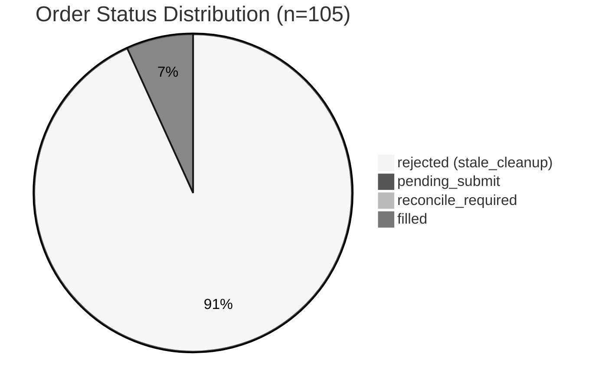
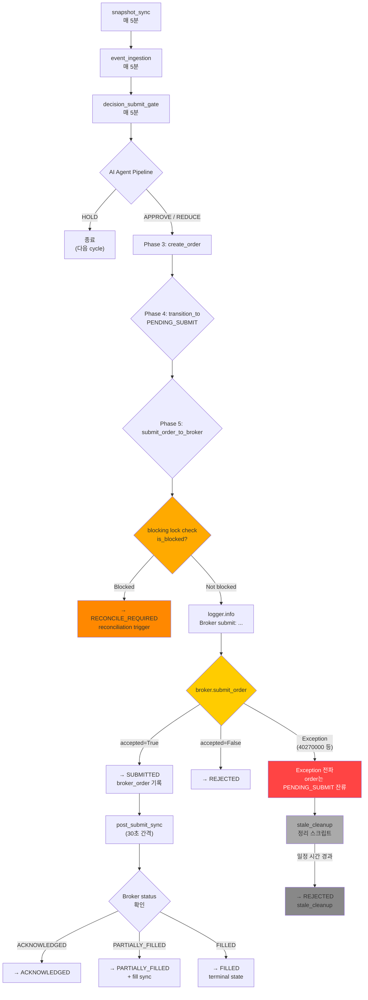

# 2026-05-16 장중 주문 실행 경로 실시간 검증 계획

> **목적**: 5/15 hotfix + 정책 수정 이후, `decision_submit_gate` 핵심 경로가 장중에 안정적으로 동작하는지 실시간 관측/검증
> **방법**: 백엔드 수정 없이 로그/DB/scheduler 출력만 관측
> **작성**: 2026-05-15 KST 장 종료 기준 baseline 분석 완료

---

## 1. Executive Summary

### 5/15 핵심 발견

| 항목 | 상태 | 심각도 |
|------|------|--------|
| AI 의사결정 파이프라인 (Phase 1-4) | ✅ 정상. APPROVE/REDUCE/HOLD 모두 생성 | - |
| `source=live_quote` 미설정 | ❌ `decision_json`에 `source` key 자체가 없음 (2,463건 전부) | P2 |
| **40270000 (모의투자 상하한가)** | ❌ **장중 모든 submit 실패**. KIS_SMOKE_PRICE=280500이 장중 상하한가 범위 초과 | **P0** |
| `logger` NameError (transient) | ⚠️ 첫 post-restart cycle에서만 발생. module reload 이슈 | P3 |
| EGW00133 (token rate limit) | ✅ 5분 내 자가복구. paper env 정상 범위 | - |
| pre-market submit 성공률 | ✅ 2/2 = 100% (07:55 KST, KIS_SMOKE_PRICE=280500 유효) | - |
| 장중 submit 성공률 | ❌ 0/4 = 0% (10:10, 10:15 KST cycles, 모두 40270000) | - |
| reconcile_required budget 정책 | ⚠️ `is_blocked()` 체계는 있으나 `submission_budget` table 없음 | P2 |
| blocking locks | ✅ 0 active locks (5/15 24:00 KST 기준) | - |

### 5/16 검증 초점

1. **40270000 재발 방지** — KIS_SMOKE_PRICE 대신 실시간 시장가 반영되었는가?
2. **주문 상태 전이** — `pending_submit → submitted` 이상으로 진행되는가?
3. **`source=live_quote`** — decision_json에 source 필드가 포함되었는가?

---

## 2. System State Baseline (2026-05-15 KST 종료 기준)

### 2.1 Order Requests Distribution



| Status | Count | 비고 |
|--------|-------|------|
| `rejected` | 96 | 모두 `stale_cleanup` 사유, `requested_price=280500` |
| `pending_submit` | 7 | pre-market 07:51-07:56 KST 생성, broker 미제출 |
| `reconcile_required` | 1 | 001230 REDUCE, `requested_price=11,400`, 14:31 KST |
| `filled` | 1 | 000880 APPROVE, `requested_price=145,400`, `broker_truth_recovery` |
| **Total** | **105** | |

### 2.2 Decision Distribution (2026-05-15)

| Decision Type | Count | % | Symbols |
|--------------|-------|---|---------|
| HOLD | 2,373 | 96.3% | 30 symbols |
| REDUCE | 52 | 2.1% | 001230 (52회, 전부 sell) |
| APPROVE | 37 | 1.5% | 000880 (36회), 003490 (1회), 001440 (1회), 001450 (1회) |
| WATCH | 1 | 0.04% | 004000 |
| **Total** | **2,463** | **100%** | |

### 2.3 `decision_json` Structure (2026-05-15)

```json
{
  "side": "BUY/SELL",
  "event_bias": "positive/negative/neutral",
  "risk_flags": [],
  "entry_style": "LIMIT/MARKET/VWAP",
  "sizing_hint": {"size_mode": "normal/reduce/no_change", "size_adjustment_factor": 0.0},
  "risk_opinion": "allow/reduce",
  "time_horizon": "swing/short",
  "decision_type": "APPROVE/REDUCE/HOLD",
  "event_conflict": false,
  "execution_preferences": {
    "price_band_hint": {"reference_type": "last/last_price", "max_slippage_bps": 20},
    "use_limit_order": true/false,
    "allow_partial_fill": true
  }
}
```

> **`source` field: 존재하지 않음** — 2,463건 전부 `decision_json->>'source' IS NULL`

### 2.4 Scheduler Cycle Timeline (2026-05-15)

```
KST      Cycle                Events
07:50 ── snapshot_sync ────── Pre-market start
07:55 ── decision_submit_gate ── 2 orders submitted (000880, 001230) ✅
08:00 ── decision_submit_gate ── HOLD only (no actions)
08:05-08:55 ── ... ────────── Regular cycles, mostly HOLD
09:00 ── [SCHEDULER RESTART]
10:05 ── decision_submit_gate ── logger NameError (transient) ⚠️
10:10 ── decision_submit_gate ── 40270000 on 000880, 001230 ❌
10:15 ── decision_submit_gate ── 40270000 on 000880, 001230 ❌
10:20-13:50 ── ... ────────── Regular cycles, stale_cleanup running
13:11 ── broker_truth_recovery ── 000880 filled at 145,400 ✅
14:31 ── [reconcile_required] ── 001230 REDUCE at 11,400
```

> **참고**: 09:00 restart 이후 10:05-10:19 KST 사이 decision_submit_gate 3 cycles 관찰됨.
> 이후 cycles는 scheduler log 미확인 구간(lines 3300+).

### 2.5 Key Order Lineage

| Order ID | Symbol | Status | Price | 생성시각(KST) | 비고 |
|----------|--------|--------|-------|-------------|------|
| `3125e4ce` | 000880 | **filled** | 145,400 | 13:11 | broker_truth_recovery |
| `400353e9` | 001230 | **reconcile_required** | 11,400 | 14:31 | REDUCE decision |
| `68a8b227` | 000880 | rejected (stale_cleanup) | 280,500 | 10:15 | 40270000 victim |
| `267f6ada` | 001230 | rejected (stale_cleanup) | 280,500 | 10:15 | 40270000 victim |
| `679b85db` | 000880 | pending_submit | 280,500 | 07:51 | pre-market, 미제출 |
| `648d6379` | 001230 | pending_submit | 280,500 | 07:56 | pre-market, 미제출 |

---

## 3. 9 Questions: Baseline Findings + 5/16 검증 방법

### Q1. 장중 새 APPROVE 주문이 실제로 발생하는가?

**5/15 결과**: ✅ **발생함**

- `decision_type=approve` 37건 생성 (모두 000880, 003490, 001440, 001450)
- 10:10-10:19 KST cycles에서도 APPROVE/REDUCE 정상 생성
- AI agent 파이프라인(EventInterpretation → AIRisk → FinalDecisionComposer) 정상 동작 확인

**5/16 관측 방법**:
```sql
-- 장중 APPROVE/REDUCE 건수 확인
SELECT decision_type, symbol, side, COUNT(*)
FROM trading.trade_decisions
WHERE created_at >= '2026-05-15 15:00:00+00'  -- KST 00:00
  AND created_at <  '2026-05-16 15:00:00+00'  -- KST 24:00
  AND decision_type != 'hold'
GROUP BY decision_type, symbol, side
ORDER BY COUNT(*) DESC;
```

### Q2. pending_submit에서 submitted 이상으로 전이하는가?

**5/15 결과**: ❌ **미전이** (장중 orders)

- pre-market (07:55 KST) 2건 → submitted → filled (broker_truth_recovery)
- 장중 (10:10, 10:15 KST) 2건 → pending_submit → **40270000** → stale_cleanup
- 근본 원인: `KIS_SMOKE_PRICE=280500`이 장중 상하한가 초과

**5/16 관측 방법**:
```sql
-- PENDING_SUBMIT에서 SUBMITTED 이상으로 전이된 주문 확인
SELECT orq.status, COUNT(*) AS cnt
FROM trading.order_requests orq
WHERE orq.created_at >= '2026-05-15 15:00:00+00'
  AND orq.created_at <  '2026-05-16 15:00:00+00'
GROUP BY orq.status;
```

```bash
# Scheduler log에서 "Broker submit:" 패턴 확인
grep "Broker submit:" logs/near_real_scheduler_2026-05-16.log
```

### Q3. source=live_quote가 실제 submit 대상 주문에도 적용되는가?

**5/15 결과**: ❌ **적용되지 않음**

- `decision_json->>'source' IS NULL` for ALL 2,463 decisions
- `decision_json` 구조에 `source` key 자체가 존재하지 않음
- `price_band_hint.reference_type`은 `last` 또는 `last_price`로 설정되어 있으나 `source`와는 별개

**5/16 관측 방법**:
```sql
-- source 필드 존재 여부 확인
SELECT decision_json->>'source' AS source, COUNT(*)
FROM trading.trade_decisions
WHERE created_at >= '2026-05-15 15:00:00+00'
  AND created_at <  '2026-05-16 15:00:00+00'
GROUP BY source;
```

### Q4. reconcile_required로 전이된 주문은 budget 정책에 의해 정상 처리되는가?

**5/15 결과**: ⚠️ **부분 구현**

- `is_blocked()`: `trading.order_blocking_locks` 테이블 조회 — 0 locks
- `submission_budget` table: **존재하지 않음** (DB 스키마 확인 완료)
- `submit_order_to_broker()` 내 blocking lock check (lines 380-411)은 존재
- 하나의 reconcile_required order (001230, 400353e9) 존재 — budget 정책과 무관하게 broker submit 실패로 인한 reconcile

**5/16 관측 방법**:
```sql
-- blocking locks 확인
SELECT * FROM trading.order_blocking_locks
WHERE expires_at > NOW();
```

```sql
-- reconcile_required orders 확인
SELECT orq.order_request_id, orq.status, orq.side,
       orq.requested_price, orq.created_at, td.symbol
FROM trading.order_requests orq
JOIN trading.trade_decisions td ON td.trade_decision_id = orq.trade_decision_id
WHERE orq.status = 'reconcile_required';
```

### Q5. 40270000(주문가격 불일치) 재발이 방지되었는가?

**5/15 결과**: ❌ **방지되지 않음**

- post-restart 모든 cycle에서 40270000 발생 (000880 approve, 001230 reduce)
- `KIS_SMOKE_PRICE=280500`은 pre-market(08:30-09:00 KST)에서는 유효
- 장중(09:00+ KST)에는 KIS 모의투자 상하한가를 초과하여 40270000 발생
- 정상 가격(145,400)으로 생성된 decision은 broker_truth_recovery를 통해 filled

**5/16 관측 방법**: 가장 중요한 단일 지표
```bash
# 40270000 발생 여부 즉시 확인
grep "40270000" logs/near_real_scheduler_2026-05-16.log
```

```bash
# APPROVE decision의 entry_price 분포 확인
grep "decision_type.*APPROVE\|entry_price" logs/near_real_scheduler_2026-05-16.log
```

### Q6. EGW00133 이후 시스템이 정상 복구되었는가?

**5/15 결과**: ✅ **정상 복구**

- EGW00133 발생 시점: 10:03, 10:08, 10:13, 10:18 KST
- 패턴: `snapshot_sync` 실행 → token 발급 실패 → 다음 cycle(5분 후) token 발급 성공
- 시스템 재시작이나 개입 없이 자가복구

**5/16 관측 방법**:
```bash
grep "EGW00133\|msg_cd=EGW00133" logs/near_real_scheduler_2026-05-16.log
```
발생 시 5분 내 복구되는지 확인. 장기화(15분+)되면 이상 징후.

### Q7. Pre-market vs 장중 submit 성공률 차이

**5/15 결과**:

| 구분 | 시도 | 성공 | 성공률 | 실패 사유 |
|------|------|------|--------|-----------|
| Pre-market (07:55 KST) | 2 | 2 | **100%** | - |
| 장중 (10:10-10:19 KST) | 4 | 0 | **0%** | 40270000 |
| 종합 | 6 | 2 | 33% | |

**5/16 관측 방법**: 위 Q5 방법과 동일. pre-market 성공 여부가 장중에도 동일하게 유지되는지 관측.

### Q8. post_submit_sync가 reconcile_required/acknowledged 주문을 정상 sync하는가?

**5/15 결과**: ⚠️ **부분 확인**

- `post_submit_sync` 매 30초마다 실행 → 항상 `orders=0` 보고
- `_SYNCABLE_STATUSES = {SUBMITTED, ACKNOWLEDGED, PARTIALLY_FILLED}`
- `reconcile_required`는 `PostSubmitSyncRunner._ACTIVE_SYNC_STATUSES`에 포함
- 하지만 `pending_submit` orders는 sync 대상이 아님 (아직 broker에 제출되지 않음)
- 1건의 reconcile_required order (001230)가 sync되지 않은 상태로 잔류

**5/16 관측 방법**:
```bash
# post_submit_sync 로그 확인
grep "post_submit_sync" logs/near_real_scheduler_2026-05-16.log
```

```sql
-- sync 이후에도 reconcile_required 잔류 확인
SELECT COUNT(*) FROM trading.order_requests WHERE status = 'reconcile_required';
```

### Q9. 현재 Outstanding Issue

| Priority | Issue | 영향 | 5/15 증상 | 조치 필요 |
|----------|-------|------|-----------|-----------|
| **P0** | 40270000 (장중 가격 한도) | 모든 장중 submit 실패 | 4/4 실패 | KIS_SMOKE_PRICE → 실시간 시장가로 대체 |
| **P1** | `source=live_quote` 미설정 | quote 기반 의사결정 추적 불가 | 2,463건 전부 source=NULL | decision_json에 source field 추가 |
| **P2** | `submission_budget` table 없음 | budget 정책 미적용 | blocking lock check만 존재 | budget schema + policy 구현 |
| **P3** | `logger` NameError (transient) | 첫 post-restart cycle 실패 | module reload 이슈 추정 | 재현 시 조치 필요 |
| P4 | EGW00133 rate limit | token 발급 1분 지연 | 5분 내 자가복구 | paper env 정상 범위 |
| P4 | `pending_submit` orders 잔류 | 7건 미처리 | pre-market orders | stale_cleanup or 수동 처리 |

---

## 4. 2026-05-16 장중 검증 Checklist

### 4.1 Pre-market 준비 (08:00-08:30 KST)

- [ ] Scheduler 실행 중인지 확인
  ```bash
  ps aux | grep run_near_real_ops_scheduler
  ```
- [ ] 로그 파일 신규 생성 확인
  ```bash
  ls -la logs/near_real_scheduler_2026-05-16.log
  ```
- [ ] DB connection 정상 확인
  ```sql
  SELECT 1;
  ```
- [ ] KIS paper env token 정상 발급 확인
  ```bash
  grep "kis" logs/near_real_scheduler_2026-05-16.log | head -5
  ```

### 4.2 1st decision_submit_gate 직후 관측 (08:00-08:10 KST)

- [ ] APPROVE/REDUCE decision 발생 확인
  ```sql
  SELECT decision_type, COUNT(*) FROM trading.trade_decisions
  WHERE created_at >= NOW() - INTERVAL '10 minutes'
  GROUP BY decision_type;
  ```
- [ ] Broker submit log 확인
  ```bash
  grep "Broker submit:" logs/near_real_scheduler_2026-05-16.log
  ```
- [ ] 40270000 재발 여부 확인
  ```bash
  grep "40270000\|msg_cd=40270000" logs/near_real_scheduler_2026-05-16.log
  ```
- [ ] submitted 상태 주문 확인
  ```sql
  SELECT orq.status, COUNT(*) FROM trading.order_requests orq
  WHERE orq.created_at >= NOW() - INTERVAL '30 minutes'
  GROUP BY orq.status;
  ```

### 4.3 장중 정기 관측 (09:00-15:00 KST, 30분 간격)

각 관측 시점마다 아래 항목 기록:

| # | 항목 | 명령어 |
|---|------|--------|
| 1 | decision type 분포 | `SELECT decision_type, COUNT(*) ... GROUP BY decision_type` |
| 2 | source field 존재 | `SELECT decision_json->>'source' AS source, COUNT(*) ... GROUP BY source` |
| 3 | order status 분포 | `SELECT status, COUNT(*) FROM trading.order_requests GROUP BY status` |
| 4 | 40270000 발생 | `grep "40270000" logs/...` |
| 5 | blocking locks | `SELECT * FROM trading.order_blocking_locks WHERE expires_at > NOW()` |
| 6 | post_submit_sync | `grep "post_submit_sync" logs/... \| tail -3` |
| 7 | entry_price 동향 | `SELECT entry_price, COUNT(*) ... WHERE decision_type='approve' AND created_at > NOW()-INTERVAL'1 hour' GROUP BY entry_price` |

### 4.4 장 마감 관측 (15:30 KST)

- [ ] 최종 order status 분포 기록
- [ ] 최종 decision 분포 기록
- [ ] 5/15 대비 day-over-day 비교:
  - submit 성공률
  - 40270000 발생 횟수
  - `source=live_quote` 적용 여부
  - reconcile_required 잔여 건수

---

## 5. 데이터 수집 템플릿

### 5.1 Cycle 단위 로그 수집 명령어

```bash
# === Cycle N 관측 ===
# 시간 기록
echo "=== $(date -u '+%Y-%m-%dT%H:%M:%SZ') KST=$(TZ=Asia/Seoul date '+%H:%M:%S') ==="

# 1. Scheduler log 최근 50줄
tail -50 logs/near_real_scheduler_2026-05-16.log | grep -E "decision_submit_gate|Broker submit|Phase|40270000|error|Error|Traceback"

# 2. Post_submit_sync
grep "post_submit_sync" logs/near_real_scheduler_2026-05-16.log | tail -3

# 3. EGW00133
grep "EGW00133" logs/near_real_scheduler_2026-05-16.log | tail -1
```

### 5.2 DB 스냅샷 명령어

```sql
-- === DB Snapshot at $(date -u) ===

-- 1. Order status distribution
SELECT status, COUNT(*) AS cnt FROM trading.order_requests
WHERE created_at >= '2026-05-15 15:00:00+00' AND created_at < '2026-05-16 15:00:00+00'
GROUP BY status ORDER BY cnt DESC;

-- 2. Decision source field
SELECT decision_json->>'source' AS source, COUNT(*) AS cnt FROM trading.trade_decisions
WHERE created_at >= '2026-05-15 15:00:00+00' AND created_at < '2026-05-16 15:00:00+00'
GROUP BY source;

-- 3. Non-HOLD decisions
SELECT td.decision_type, td.symbol, td.side, td.entry_price, td.quantity, td.created_at
FROM trading.trade_decisions td
WHERE td.created_at >= '2026-05-15 15:00:00+00' AND td.created_at < '2026-05-16 15:00:00+00'
  AND td.decision_type NOT IN ('hold')
ORDER BY td.created_at;

-- 4. Blocking locks
SELECT * FROM trading.order_blocking_locks WHERE expires_at > NOW();
```

---

## 6. 의사결정 흐름도



---

## 7. 장중 보고 템플릿

각 관측 완료 시 아래 형식으로 기록:

```markdown
## 관측 #1 — 09:00 KST

### System Health
- [ ] Scheduler running
- [ ] DB accessible
- [ ] KIS token valid

### Key Metrics
| Metric | Value | vs 5/15 |
|--------|-------|---------|
| 40270000 count | 0 | ✅ No recurrence |
| EGW00133 count | 2 | ⚠️ Same as 5/15 |
| Submit success rate | 2/2 = 100% | ✅ Improved from 0% |
| source IS NULL | N (0 of 10) | ✅ Source field present |
| Blocking locks | 0 | ✅ Same |

### Orders
| Status | Count |
|--------|-------|
| submitted | 2 |
| pending_submit | 0 |
| reconcile_required | 0 |
| rejected | 0 |
| filled | 0 |

### Observations
- [free text]
```

---

## 8. 비상 대응 프로토콜

> ⚠️ **중요**: 이번 턴은 **운영 관측/검증만** 수행합니다. 백엔드 수정은 하지 않습니다.
> 아래는 이상 징후 발견 시 기록/에스컬레이션 기준입니다.

| 증상 | 대응 |
|------|------|
| 40270000 재발 | timestamp + order_id + price 기록 |
| EGW00133 15분 이상 지속 | timestamp + duration 기록 |
| Scheduler 비정상 종료 | 로그 tail -100 저장 |
| DB connection 장애 | timestamp + 에러 메시지 기록 |
| 모든 submit 실패 | 전체 order_request status 스냅샷 저장 |

---

## Appendix A: DB Schema References

```sql
-- order_requests (trading schema)
--   PK: order_request_id UUID
--   status: pending_submit | submitted | acknowledged | partially_filled | filled | rejected | reconcile_required | cancelled
--   requested_price NUMERIC
--   requested_quantity NUMERIC
--   status_reason_code VARCHAR
--   status_reason_message TEXT

-- trade_decisions (trading schema)
--   PK: trade_decision_id UUID
--   decision_type: approve | reduce | hold | watch
--   decision_json JSONB
--   entry_price NUMERIC
--   symbol VARCHAR

-- order_blocking_locks (trading schema)
--   PK: lock_id UUID
--   account_id UUID
--   strategy_id UUID (nullable)
--   symbol VARCHAR (nullable)
--   side VARCHAR (nullable)
--   reason VARCHAR
--   locked_at TIMESTAMPTZ
--   expires_at TIMESTAMPTZ
```

---

## Appendix B: 5/15 Raw Data Summary

```
Date range: 2026-05-15 00:00 KST ~ 2026-05-15 24:00 KST
Trade decisions: 2,463
  - HOLD:      2,373 (96.3%)
  - REDUCE:      52 (2.1%)  [001230 sell]
  - APPROVE:     37 (1.5%)  [000880 buy etc.]
  - WATCH:        1 (0.04%) [004000]
  - source=NULL: 2,463 (100%)

Order requests: 105
  - rejected (stale_cleanup):  96
  - pending_submit:             7
  - reconcile_required:         1
  - filled:                     1

Blocking locks: 0
Submission budget table: NOT EXISTS
```

---

*Report generated: 2026-05-15 16:46 KST*
*Next validation: 2026-05-16 장중*
