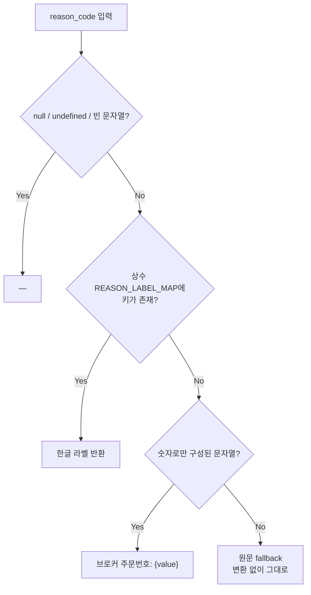
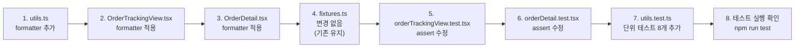

# OrderTracking / OrderDetail reason_code 한글화 개선 설계

**작성일**: 2026-05-17  
**상태**: 설계 완료 (Code 모드 구현 대기)  
**대상 버전**: admin_ui (frontend only)

---

## 1. 기존 문제

| 위치 | 코드 | 현재 표시 | 문제점 |
|------|------|-----------|--------|
| [`OrderTrackingView.tsx:114`](../admin_ui/src/components/OrderTrackingView.tsx:114) | `row.reason_code \|\| "—"` | raw 값 그대로 노출 | 운영자가 `FILL_CONFIRMED`, `BLOCKED` 등의 영문 raw 값을 읽어야 함 |
| [`OrderDetail.tsx:68`](../admin_ui/src/components/OrderDetail.tsx:68) | `r.reason_code \|\| "—"` | raw 값 그대로 노출 | 동일 |

운영자 UI임에도 `reason_code`가 영문 raw 값으로 표시되어 **가독성 저하** 및 **운영 실수 유발 가능성**이 있음.

---

## 2. reason_code 분류 정책

`formatOrderEventReason()`는 아래 **4가지 분류 정책**을 순차적으로 적용한다.



| 조건 | 판별 로직 | 출력 예시 |
|------|-----------|-----------|
| `null`, `undefined`, `""` | `!value` | `"—"` |
| Known code (상수 맵에 존재) | `REASON_LABEL_MAP[value]` | `"조정 해소"` |
| 숫자로만 구성된 문자열 (브로커 주문번호) | `/^\d+$/.test(value)` | `"브로커 주문번호: 12345678"` |
| 그 외 미지의 값 | 원문 fallback | `"UNKNOWN_REASON"` |

---

## 3. Known Code 한글 매핑 목록 (`REASON_LABEL_MAP`)

백엔드 [`order_manager.py`](../../src/agent_trading/services/order_manager.py) 소스코드에서 수집한 모든 `reason_code` 생성 지점 기준.

| reason_code | 생성 위치 (backend) | 한글 라벨 |
|-------------|-------------------|-----------|
| `null` | `order_manager.py:323` | `—` |
| `"BLOCKED"` | `order_manager.py:412` | `차단됨` |
| `"UNCERTAIN"` | `order_manager.py:457` | `불확실 상태` |
| `"RECONCILE_RESOLVED"` | `order_manager.py:605` | `조정 해소` |
| `"MANUAL_RESOLVE"` | `order_manager.py:729` | `운영자 수동 해소` |
| `"WS_FILL"` | `event_loop.py:354` | `WS 체결 수신` |
| `"FILL_CONFIRMED"` | fixture only | `체결 확인` |
| `"REJECTED"` | `order_manager.py:497` | `거부됨` |
| 브로커 raw_code (숫자열) | `order_manager.py:457,486,497` | `"브로커 주문번호: {value}"` |

> **참고**: 새 `reason_code`가 백엔드에 추가될 경우 [`REASON_LABEL_MAP`](../admin_ui/src/lib/utils.ts)에 항목만 추가하면 확장 가능.

---

## 4. Formatter 구현 방식

### 4.1 시그니처

```typescript
// admin_ui/src/lib/utils.ts 에 추가

/**
 * reason_code 값을 한글 라벨로 변환한다.
 *
 * 분류 정책:
 *   - null / undefined / ""  →  "—"
 *   - Known code             →  REASON_LABEL_MAP에서 조회
 *   - 숫자로만 구성           →  "브로커 주문번호: {value}"
 *   - 그 외                  →  원문 그대로 반환 (fallback)
 *
 * @param code - OrderEvent.reason_code 값
 * @returns 한글 라벨 또는 fallback 문자열
 */
export function formatOrderEventReason(
  code: string | null | undefined,
): string {
  if (!code) return "—";
  if (REASON_LABEL_MAP[code]) return REASON_LABEL_MAP[code];
  if (/^\d+$/.test(code)) return `브로커 주문번호: ${code}`;
  return code;
}
```

### 4.2 `REASON_LABEL_MAP` 상수

```typescript
/** reason_code → 한글 라벨 매핑 (확장 가능) */
export const REASON_LABEL_MAP: Record<string, string> = {
  BLOCKED: "차단됨",
  UNCERTAIN: "불확실 상태",
  RECONCILE_RESOLVED: "조정 해소",
  MANUAL_RESOLVE: "운영자 수동 해소",
  WS_FILL: "WS 체결 수신",
  FILL_CONFIRMED: "체결 확인",
  REJECTED: "거부됨",
};
```

### 4.3 확장 구조

- `REASON_LABEL_MAP`을 `export`하여 테스트에서 import 가능
- 새 코드 추가 시 `REASON_LABEL_MAP`에 엔트리만 추가하면 됨
- formatter는 `REASON_LABEL_MAP`을 참조하므로 추가 작업 불필요
- 정책 분기 (숫자 판별, null 처리)는 formatter 내부에 캡슐화

---

## 5. 변경 파일별 상세

### 5.1 [`admin_ui/src/lib/utils.ts`](../admin_ui/src/lib/utils.ts)

**변경 내용**: `REASON_LABEL_MAP` 상수 + `formatOrderEventReason()` 함수 추가

```typescript
// === 추가할 코드 (파일 끝에) ===

/**
 * reason_code → 한글 라벨 매핑.
 * 새 reason_code 추가 시 이 맵에 엔트리만 추가하면 됨.
 */
export const REASON_LABEL_MAP: Record<string, string> = {
  BLOCKED: "차단됨",
  UNCERTAIN: "불확실 상태",
  RECONCILE_RESOLVED: "조정 해소",
  MANUAL_RESOLVE: "운영자 수동 해소",
  WS_FILL: "WS 체결 수신",
  FILL_CONFIRMED: "체결 확인",
  REJECTED: "거부됨",
};

/**
 * Format an OrderEvent reason_code into a human-readable Korean label.
 *
 * Policy:
 *   1. null / undefined / empty string → "—"
 *   2. Known code (in REASON_LABEL_MAP) → Korean label
 *   3. Numeric string (broker order ID) → "브로커 주문번호: {value}"
 *   4. Unknown raw code → original value (fallback)
 */
export function formatOrderEventReason(
  code: string | null | undefined,
): string {
  if (!code) return "—";
  if (REASON_LABEL_MAP[code]) return REASON_LABEL_MAP[code];
  if (/^\d+$/.test(code)) return `브로커 주문번호: ${code}`;
  return code;
}
```

### 5.2 [`admin_ui/src/components/OrderTrackingView.tsx`](../admin_ui/src/components/OrderTrackingView.tsx)

**변경 전** (line 2, 114):

```typescript
import { formatKstDateTime, formatKrw } from "@/lib/utils";
// ...
{ key: "reason_code", header: "사유", render: (row: OrderEvent) => row.reason_code || "—" },
```

**변경 후**:

```typescript
import { formatKstDateTime, formatKrw, formatOrderEventReason } from "@/lib/utils";
// ...
{ key: "reason_code", header: "사유", render: (row: OrderEvent) => formatOrderEventReason(row.reason_code) },
```

### 5.3 [`admin_ui/src/components/OrderDetail.tsx`](../admin_ui/src/components/OrderDetail.tsx)

**변경 전** (line 12, 68):

```typescript
import { formatKstDateTime } from "../lib/utils";
// ...
{ key: "reason_code", header: "사유", render: (r) => r.reason_code || "—" },
```

**변경 후**:

```typescript
import { formatKstDateTime, formatOrderEventReason } from "../lib/utils";
// ...
{ key: "reason_code", header: "사유", render: (r) => formatOrderEventReason(r.reason_code) },
```

### 5.4 [`admin_ui/src/__tests__/test-utils/fixtures.ts`](../admin_ui/src/__tests__/test-utils/fixtures.ts)

**변경 내용**: `mockOrderEvents`에 다양한 `reason_code` 값 추가 (기존 fixture 보존)

```typescript
export const mockOrderEvents: OrderEvent[] = [
  {
    order_state_event_id: "aaaaaaaa-bbbb-cccc-dddd-eeeeeeee00e1",
    previous_status: null,
    new_status: "submitted",
    event_source: "INTERNAL",
    event_timestamp: "2026-05-05T00:00:01Z",
    reason_code: null,                        // → "—"
  },
  {
    order_state_event_id: "aaaaaaaa-bbbb-cccc-dddd-eeeeeeee00e2",
    previous_status: "submitted",
    new_status: "filled",
    event_source: "BROKER",
    event_timestamp: "2026-05-05T00:00:05Z",
    reason_code: "FILL_CONFIRMED",            // → "체결 확인"
  },
];
```

→ **기존 fixture 보존**. 추가 fixture가 필요하면 `mockOrderEventsExtended` 등의 별도 상수로 추가 가능.  
→ 단, **기존 테스트가 raw `"FILL_CONFIRMED"`를 직접 assert**하고 있으므로 테스트 파일 수정이 필요함.

### 5.5 [`admin_ui/src/__tests__/orderTrackingView.test.tsx`](../admin_ui/src/__tests__/orderTrackingView.test.tsx)

**변경 전** (line 193-194):

```typescript
// Second event has reason_code="FILL_CONFIRMED"
expect(screen.getByText("FILL_CONFIRMED")).toBeInTheDocument();
```

**변경 후**:

```typescript
// Second event has reason_code="FILL_CONFIRMED" → formatter → "체결 확인"
expect(screen.getByText("체결 확인")).toBeInTheDocument();
```

### 5.6 [`admin_ui/src/__tests__/orderDetail.test.tsx`](../admin_ui/src/__tests__/orderDetail.test.tsx)

**변경 전** (line 130):

```typescript
// Event data — reason_code 값 표시 확인
expect(screen.getByText("FILL_CONFIRMED")).toBeInTheDocument();
```

**변경 후**:

```typescript
// Event data — reason_code → formatter → 한글 라벨 확인
expect(screen.getByText("체결 확인")).toBeInTheDocument();
```

### 5.7 [`admin_ui/src/__tests__/utils.test.ts`](../admin_ui/src/__tests__/utils.test.ts)

**변경 내용**: `formatOrderEventReason()` 단위 테스트 추가

```typescript
import { formatOrderEventReason } from "../lib/utils";

// === 추가할 describe 블록 ===

describe("formatOrderEventReason", () => {
  // TC1: null → "—"
  it('returns "—" for null', () => {
    expect(formatOrderEventReason(null)).toBe("—");
  });

  // TC2: undefined → "—"
  it('returns "—" for undefined', () => {
    expect(formatOrderEventReason(undefined)).toBe("—");
  });

  // TC3: empty string → "—"
  it('returns "—" for empty string', () => {
    expect(formatOrderEventReason("")).toBe("—");
  });

  // TC4: known code → 한글 라벨
  it('returns "체결 확인" for FILL_CONFIRMED', () => {
    expect(formatOrderEventReason("FILL_CONFIRMED")).toBe("체결 확인");
  });

  // TC5: another known code
  it('returns "차단됨" for BLOCKED', () => {
    expect(formatOrderEventReason("BLOCKED")).toBe("차단됨");
  });

  // TC6: numeric string → broker order ID format
  it('returns "브로커 주문번호: 12345678" for "12345678"', () => {
    expect(formatOrderEventReason("12345678")).toBe("브로커 주문번호: 12345678");
  });

  // TC7: unknown raw code → 원문 fallback
  it('returns "UNKNOWN_REASON" for unknown code', () => {
    expect(formatOrderEventReason("UNKNOWN_REASON")).toBe("UNKNOWN_REASON");
  });

  // TC8: all known codes in REASON_LABEL_MAP produce non-empty Korean labels
  it("all entries in REASON_LABEL_MAP are covered", () => {
    const knownCodes = [
      "BLOCKED",
      "UNCERTAIN",
      "RECONCILE_RESOLVED",
      "MANUAL_RESOLVE",
      "WS_FILL",
      "FILL_CONFIRMED",
      "REJECTED",
    ];
    for (const code of knownCodes) {
      const result = formatOrderEventReason(code);
      expect(result).not.toBe("—");
      expect(result).not.toBe(code); // must be translated
    }
  });
});
```

---

## 6. 테스트 계획

### 6.1 단위 테스트 (`utils.test.ts`) — 8개 TC

| # | 테스트 케이스 | 입력 | 기대 출력 | 비고 |
|---|-------------|------|-----------|------|
| TC1 | null 처리 | `null` | `"—"` | null safety |
| TC2 | undefined 처리 | `undefined` | `"—"` | undefined safety |
| TC3 | 빈 문자열 처리 | `""` | `"—"` | empty string safety |
| TC4 | Known code → 한글 | `"FILL_CONFIRMED"` | `"체결 확인"` | 정상 매핑 |
| TC5 | Known code → 한글 | `"BLOCKED"` | `"차단됨"` | 또 다른 매핑 |
| TC6 | 숫자열 → broker ID | `"12345678"` | `"브로커 주문번호: 12345678"` | broker raw code |
| TC7 | Unknown → fallback | `"UNKNOWN_REASON"` | `"UNKNOWN_REASON"` | fallback |
| TC8 | 모든 known code 커버리지 | 전체 known code | 한글 라벨 (원문 불일치) | 회귀 방지 |

### 6.2 통합 렌더 테스트 (orderTrackingView.test.tsx)

- 기존 `reason_code=null → "—”` 테스트는 유지 (`getAllByText("—")`)
- 기존 `reason_code="FILL_CONFIRMED"` assert를 `"체결 확인"`으로 변경

### 6.3 통합 렌더 테스트 (orderDetail.test.tsx)

- 기존 `reason_code="FILL_CONFIRMED"` assert를 `"체결 확인"`으로 변경

---

## 7. 리스크 분석

| 리스크 | 영향 | 확률 | 대응 방안 |
|--------|------|------|-----------|
| 백엔드에 새 `reason_code` 추가 시 프론트 매핑 누락 | 신규 코드가 raw로 표시됨 | 낮음 | `REASON_LABEL_MAP`에 추가만 하면 되며, fallback이 raw 값을 그대로 보여주므로 데이터 손실 없음 |
| 숫자열이 브로커 주문번호가 아닌 다른 의미인 경우 | 오분류 | 매우 낮음 | 현재 `order_manager.py`에서 숫자열은 항상 `broker_native_order_id`이므로 안전. 만약 모호한 경우 발생 시 정책 재검토 |
| 한글 라벨과 영문 raw 값 매핑 오류 | 잘못된 정보 표시 | 낮음 | 각 매핑을 백엔드 소스코드 생성 지점과 일대일 대조 완료 |
| 기존 테스트 assert 실패 | CI 실패 | 중간 | 변경 파일 5.5, 5.6에서 assert 업데이트로 해소 |
| `REASON_LABEL_MAP`이 `utils.ts`에 있으나 컴포넌트에서 직접 참조할 경우 캡슐화 깨짐 | 우회 사용 | 낮음 | `formatOrderEventReason()`만 `export`하고 `REASON_LABEL_MAP`도 `export`하되, 컴포넌트는 반드시 formatter를 통해 접근 (코드 리뷰로 관리) |

---

## 8. 실행 순서



| 단계 | 파일 | 작업 | 의존성 |
|------|------|------|--------|
| 1 | [`admin_ui/src/lib/utils.ts`](../admin_ui/src/lib/utils.ts) | `REASON_LABEL_MAP` + `formatOrderEventReason()` 추가 | 없음 |
| 2 | [`admin_ui/src/components/OrderTrackingView.tsx`](../admin_ui/src/components/OrderTrackingView.tsx) | import 추가 + reason_code render 교체 | 1 |
| 3 | [`admin_ui/src/components/OrderDetail.tsx`](../admin_ui/src/components/OrderDetail.tsx) | import 추가 + reason_code render 교체 | 1 |
| 4 | [`admin_ui/src/__tests__/test-utils/fixtures.ts`](../admin_ui/src/__tests__/test-utils/fixtures.ts) | 변경 불필요 (기존 fixture 보존) | 없음 |
| 5 | [`admin_ui/src/__tests__/orderTrackingView.test.tsx`](../admin_ui/src/__tests__/orderTrackingView.test.tsx) | `"FILL_CONFIRMED"` → `"체결 확인"` assert 변경 | 2, 4 |
| 6 | [`admin_ui/src/__tests__/orderDetail.test.tsx`](../admin_ui/src/__tests__/orderDetail.test.tsx) | `"FILL_CONFIRMED"` → `"체결 확인"` assert 변경 | 3, 4 |
| 7 | [`admin_ui/src/__tests__/utils.test.ts`](../admin_ui/src/__tests__/utils.test.ts) | `formatOrderEventReason()` 단위 테스트 8개 추가 | 1 |
| 8 | terminal | `cd admin_ui && npm run test` | 1-7 |

---

## 9. 제약사항 확인

| 항목 | 상태 |
|------|------|
| Backend 변경 없음 | ✅ Frontend-only (`utils.ts`, 컴포넌트, 테스트) |
| API contract 변경 없음 | ✅ `reason_code` 필드 타입/구조 변경 없음 |
| `.env` 수정 금지 | ✅ 해당 없음 |
| `python3` / `/bin/bash` | ✅ 영향 없음 |
| 기존 테스트 호환성 | ✅ assert만 업데이트 (구조 변경 없음) |

---

## 10. 구현 완료 기준 (Definition of Done)

1. [ ] `formatOrderEventReason()`가 [`utils.ts`](../admin_ui/src/lib/utils.ts)에 추가됨
2. [ ] `OrderTrackingView.tsx`의 `reason_code` 컬럼이 formatter 사용
3. [ ] `OrderDetail.tsx`의 `reason_code` 컬럼이 formatter 사용
4. [ ] `utils.test.ts`에 8개 단위 테스트 추가 및 통과
5. [ ] `orderTrackingView.test.tsx` assert 업데이트 및 통과
6. [ ] `orderDetail.test.tsx` assert 업데이트 및 통과
7. [ ] `npm run test` 전체 통과
8. [ ] `REASON_LABEL_MAP`으로 확장 가능 구조 확인

---

*이 문서는 Code 모드의 구현 지침으로 사용됩니다.*
