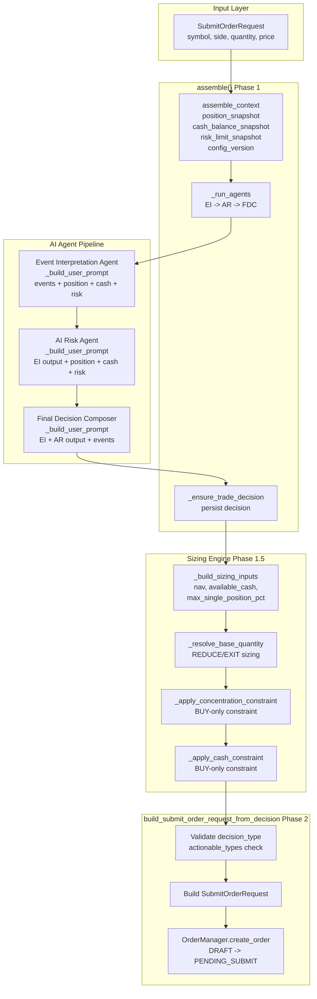
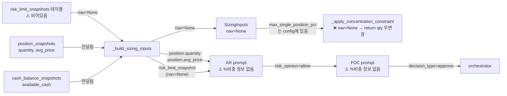
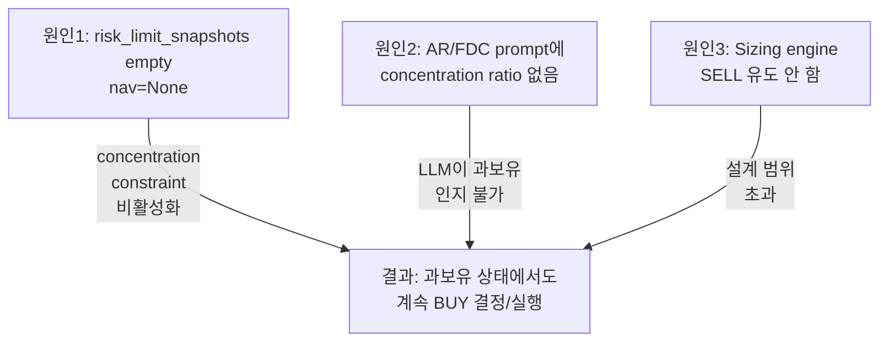
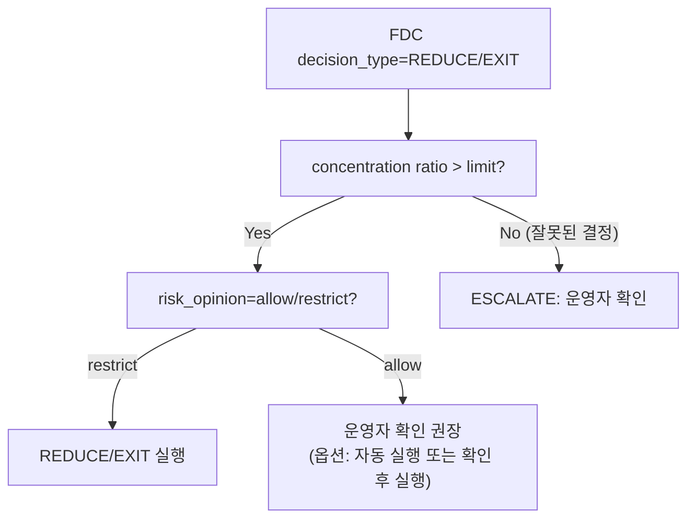

# 과보유 종목 자동 REDUCE/SELL 부재 진단 + NAV/주문가능금액 반영 여부 점검 보고서

**작성일**: 2026-05-18  
**대상 시스템**: agent_trading decision pipeline  
**진단 범위**: EI → AR → FDC → orchestrator → sizing engine 전 구간

---

## 1. 작업 개요

본 진단은 **포트폴리오 내 특정 종목의 비중이 과도하게 높을 때**(과보유 상태) 시스템이 자동으로 `REDUCE`(부분 축소) 또는 `SELL`(전량 청산) 결정을 내릴 수 있는지 점검하기 위해 수행되었다.

운영 데이터(`000150` 두산 사례)에서 position 대비 total asset이 매우 높음에도 불구하고 FDC가 계속 `approve`/`buy`를 출력하는 현상이 관찰되었고, 이에 대한 **3중 구조적 원인**을 규명하고 각 레이어별 수준에서의 개선 방안을 제시하는 것이 본 보고서의 목적이다.

---

## 2. 현재 구조 요약 (Mermaid 다이어그램 포함)

### 2.1 Decision Pipeline 전체 흐름



### 2.2 데이터 흐름 (NAV / concentration 정보)



### 2.3 핵심 레이어별 책임

| 레이어 | 클래스/함수 | 주요 책임 | REDUCE/SELL 관련 |
|--------|------------|-----------|-----------------|
| Decision Orchestrator | [`DecisionOrchestratorService.assemble()`](src/agent_trading/services/decision_orchestrator.py:370) | context 조립, AI agent 실행, TradeDecision persist | REDUCE/EXIT을 `actionable_types`에 포함 |
| Event Interpretation | [`EventInterpretationAgent._build_user_prompt()`](src/agent_trading/services/ai_agents/event_interpretation.py:234) | 뉴스/이벤트 해석 | 포트폴리오 비중 정보 미전달 |
| AI Risk | [`AIRiskAgent._build_user_prompt()`](src/agent_trading/services/ai_agents/ai_risk.py:273) | 리스크 평가, risk_opinion 결정 | 포트폴리오 비중 정보 미전달 |
| Final Decision Composer | [`FinalDecisionComposer._build_user_prompt()`](src/agent_trading/services/ai_agents/final_decision_composer.py:262) | 최종 결정 타입 결정 | 포트폴리오 비중 정보 미전달 |
| Sizing Engine | [`calculate_sizing()`](src/agent_trading/services/sizing_engine.py:411) | 결정된 타입에 따른 수량 계산 | `_base_qty_reduce`/`_base_qty_exit` 구현됨 |
| Concentration Constraint | [`_apply_concentration_constraint()`](src/agent_trading/services/sizing_engine.py:292) | NAV 대비 과도한 집중 방지 | **BUY만 억제, SELL 유도 안 함** |

---

## 3. REDUCE/SELL 가능 여부 분석

### 3.1 스키마/인프라 수준: ✅ 지원함

| 위치 | 항목 | 상태 |
|------|------|------|
| [`DecisionType`](src/agent_trading/domain/enums.py:106) | `REDUCE = "reduce"`, `EXIT = "exit"` 정의됨 | ✅ |
| [`FinalDecisionComposerOutput`](src/agent_trading/services/ai_agents/schemas.py:491) | docstring에 `"EXIT"`, `"REDUCE"` 명시 | ✅ |
| [`FDC prompt`](src/agent_trading/services/ai_agents/final_decision_composer.py:230) | `decision_type: one of ... EXIT, REDUCE` | ✅ |
| [`build_submit_order_request_from_decision()`](src/agent_trading/services/decision_orchestrator.py:2069) | `actionable_types`에 `REDUCE`, `EXIT` 포함 | ✅ |
| [`_resolve_base_quantity()`](src/agent_trading/services/sizing_engine.py:246-250) | `REDUCE` → `_base_qty_reduce()`, `EXIT` → `_base_qty_exit()` | ✅ |
| [`_base_qty_reduce()`](src/agent_trading/services/sizing_engine.py:196) | 현재 포지션 기반 reduction 로직 | ✅ |
| [`_base_qty_exit()`](src/agent_trading/services/sizing_engine.py:221) | 현재 포지션 전량 매도 로직 | ✅ |

### 3.2 실제 운영: ❌ 발생하지 않음

REDUCE/SELL이 발생하려면 FDC가 `decision_type`을 `REDUCE` 또는 `EXIT`로 결정해야 한다. 그러나 현재 구조에서는 **FDC가 과보유 상태를 인지할 수 있는 정보를 받지 못하므로** 이러한 결정이 나올 수 없다.

**핵심 원인**: FDC 프롬프트에 `position_snapshot`(수량/가격)은 전달되지만, **"이 종목이 NAV 대비 몇 %인지"** 에 대한 계산된 비중(concentration ratio) 정보가 없다.

---

## 4. 과보유 정보 전달 여부

### 4.1 AR 프롬프트 입력 분석

[`AIRiskAgent._build_user_prompt()`](src/agent_trading/services/ai_agents/ai_risk.py:273)에서 전달하는 정보:

```python
# === Position snapshot summary (line 356-366) ===
lines.append(f"  Quantity: {pos.quantity}")
lines.append(f"  Average price: {pos.average_price}")
lines.append(f"  Market price: {pos.market_price}")
lines.append(f"  Unrealised P&L: {pos.unrealized_pnl}")

# === Risk limit snapshot summary (line 382-403) ===
lines.append(f"  Kill switch active: {rl.kill_switch_active}")
lines.append(f"  Drawdown state: {rl.drawdown_state}")
lines.append(f"  Blocked reason codes: {', '.join(rl.blocked_reason_codes)}")
lines.append(f"  Daily loss: {rl.daily_loss_used_pct}% / {rl.max_daily_loss_limit_pct}% limit")
lines.append(f"  Gross exposure: {rl.gross_exposure_pct}%")
lines.append(f"  Net exposure: {rl.net_exposure_pct}%")
```

**❌ 빠진 정보**: `quantity × market_price / nav` 형태의 **concentration ratio**(NAV 대비 종목 비중 %)

### 4.2 FDC 프롬프트 입력 분석

[`FinalDecisionComposer._build_user_prompt()`](src/agent_trading/services/ai_agents/final_decision_composer.py:262)에서 전달하는 정보:

```python
# === Assembled Context Score (line 308-313) ===
# === Event Interpretation Output (line 316-349) ===
# === AI Risk Output (line 352-365) ===
# === Recent events (line 368-400) ===
```

**❌ 빠진 정보**:
- `position_snapshot` 정보 자체가 없음 (AR과 달리 FDC는 position 정보를 직접 전달받지 않음)
- `cash_balance_snapshot` 정보 없음
- `risk_limit_snapshot` 정보 없음
- **concentration ratio** 전달 없음

### 4.3 `risk_limit_snapshot.symbol_exposure_json` 활용 여부

[`RiskLimitSnapshotEntity`](src/agent_trading/domain/entities.py)에 `symbol_exposure_json` 필드가 존재할 수 있지만, 현재 AR/FDC 프롬프트에서 이 필드를 읽어 활용하는 코드는 **전혀 없다**.

---

## 5. NAV/주문가능금액 반영 여부

### 5.1 Sizing Engine으로의 전달

[`_build_sizing_inputs()`](src/agent_trading/services/decision_orchestrator.py:1151)에서:

```python
nav = ctx.risk_limit_snapshot.nav if ctx.risk_limit_snapshot else None   # line 1178
available_cash = ctx.cash_balance_snapshot.available_cash if ctx.cash_balance_snapshot else None  # line 1177
```

**NAV**: `risk_limit_snapshot.nav` → `SizingInputs.nav` → `_apply_concentration_constraint()`에서 사용  
**available_cash**: `cash_balance_snapshot.available_cash` → `SizingInputs.available_cash` → `_apply_cash_constraint()`에서 사용

### 5.2 `_apply_concentration_constraint()` 동작 조건

[`_apply_concentration_constraint()`](src/agent_trading/services/sizing_engine.py:292)는 다음 조건에서 **조기 반환**(constraint 비활성화)한다:

```python
if (
    nav is None          # ← risk_limit_snapshots 테이블이 비어 있으면 항상 None
    or nav <= 0
    or max_single_position_pct is None
    or max_single_position_pct <= 0
    or price is None
    or price <= 0
):
    return qty            # ← 아무 제약 없이 원래 수량 그대로 반환
```

### 5.3 ⚠️ `risk_limit_snapshots` 테이블이 비어 있음

**현재 `risk_limit_snapshots` 테이블에 데이터가 전혀 없어** `nav`가 항상 `None`이다. 이로 인해:

1. `_apply_concentration_constraint()`가 **사실상 비활성화**됨
2. `nav=None`이므로 `max_position_value` 계산 불가
3. 아무리 과보유 상태여도 sizing engine이 수량을 0으로 줄이지 못함

### 5.4 요약 매트릭스

| 입력 | 소스 테이블 | 전달 대상 | 현재 상태 |
|------|-----------|----------|----------|
| NAV | `risk_limit_snapshots.nav` | sizing engine (`SizingInputs.nav`) | ⚠️ 테이블 비어있음 → `None` |
| available_cash | `cash_balance_snapshots.available_cash` | sizing engine (`SizingInputs.available_cash`) | ✅ 정상 |
| position quantity | `position_snapshots.quantity` | sizing engine + AR prompt | ✅ 정상 |
| position avg_price | `position_snapshots.average_price` | sizing engine + AR prompt | ✅ 정상 |
| concentration ratio | 계산 필요 (quantity × price / nav) | **AR/FDC prompt에 미전달** | ❌ |
| symbol_exposure_json | `risk_limit_snapshots.symbol_exposure_json` | **어디서도 미활용** | ❌ |

---

## 6. 000150 사례 분석

### 6.1 Position 데이터

| 항목 | 값 |
|------|-----|
| Symbol | 000150 (두산) |
| 보유 수량 | 40주 |
| 평균 매입가 | 1,578,775원 |
| Position Value | 40 × 1,578,775 = **63,151,000원** |
| Total Asset (cash) | 약 29,600,000원 |

> 단순 계산 시 position value가 total asset을 초과하므로, 두산 비중은 **100%를 크게 상회**하는 과보유 상태로 추정된다. (단, total asset에는 다른 자산이나 미반영 평가손익이 포함될 수 있어 정확한 비중은 NAV 기준으로 계산되어야 함)

### 6.2 최근 Decision 패턴

| 구분 | 내용 |
|------|------|
| FDC 결정 | `approve`/`buy` (최근 4회 연속) |
| AR risk_opinion | `allow` (계속) |
| EI 영향 | events가 없거나 약한 신호 → HOLD/WATCH가 아닌 approve로 수렴 |

### 6.3 Concentration Ratio 계산 (가정)

NAV를 알 수 없지만 cash balance 기준으로 추정:

- 추정 NAV ≈ 29,600,000원 (cash만 고려)
- Position Value = 63,151,000원
- concentration ratio ≈ **213%** ← max_single_position_pct(일반적으로 10~20%)를 크게 초과

### 6.4 진단

1. **FDC는 과보유를 인지하지 못함** → concentration ratio 정보가 프롬프트에 없음
2. **AR은 계속 allow** → position 수량/가격만 보고 비중 인지 불가
3. **Sizing engine은 동작 안 함** → `nav=None`으로 concentration constraint 비활성화
4. 결과: **무한 매수 루프**에 가까운 상태로, cash만 허락하는 한 계속 BUY 결정

---

## 7. Root Cause 분석 (3중 구조적 원인)

### 원인 1: `risk_limit_snapshots` 테이블이 비어 있음 (P0)

```
risk_limit_snapshots (empty) → nav=None → concentration constraint 비활성화
```

- **영향도**: 가장 큼. sizing engine의 유일한 과보유 방어 메커니즘이 완전히 무력화됨
- **원인 추정**: Snapshot sync 로직(`run_snapshot_sync_loop.py`, `sync_snapshots.py`)이 `risk_limit_snapshots`를 생성/갱신하지 않거나, KIS API에서 NAV 데이터를 조회하지 못함
- **관련 코드**: [`_build_sizing_inputs()`](src/agent_trading/services/decision_orchestrator.py:1178)에서 `ctx.risk_limit_snapshot.nav` 조회

### 원인 2: AR/FDC 프롬프트에 concentration ratio 미전달 (P1)

```
AR prompt: position quantity/price O, concentration ratio X
FDC prompt: position 자체가 없음, concentration ratio X
→ LLM이 과보유를 인지하지 못함 → REDUCE/EXIT 결정 불가
```

- **영향도**: 중간. 설령 NAV가 있어도 LLM이 비중을 실시간 계산하지는 않음
- **현재 AR 전달 정보**: position quantity/avg_price/market_price/unrealized_pnl — 원시 데이터만 있고 가공된 비중 정보 없음
- **FDC는 position 정보 자체를 받지 않음** — AR output의 `reason_codes`나 `risk_opinion`에 의존

### 원인 3: Sizing engine이 SELL/REDUCE를 유도하지 않음 (P2)

```
_apply_concentration_constraint(): BUY 억제만 함, SELL 유도 신호 없음
→ 이미 과보유여도 sizing engine이 포지션 축소를 강제하지 않음
```

- **영향도**: 중간 (단, 원인 1이 해결되어야 의미 있음)
- **설계적 한계**: sizing engine은 `SizingInputs`를 받아 수량을 조정할 뿐, decision_type 자체를 변경하지 않음
- `_apply_concentration_constraint()`는 `remaining_capacity <= 0`일 때 `return Decimal("0")`으로 수량만 0으로 만듦

### 원인 상호 관계



---

## 8. 후속 구현 옵션 비교

### P0: `risk_limit_snapshots` 데이터 채우기

**목표**: NAV가 `None`이 아닌 실제 값이 되도록 snapshot sync 로직 수정

| 항목 | 내용 |
|------|------|
| **변경 대상** | [`sync_snapshots.py`](scripts/sync_snapshots.py) 또는 [`run_snapshot_sync_loop.py`](scripts/run_snapshot_sync_loop.py)의 `risk_limit_snapshot` 동기화 로직 |
| **난이도** | 중간 (KIS API에서 NAV 조회 endpoint 확인 필요) |
| **영향도** | 🔴 **매우 높음** — concentration constraint가 정상 동작하게 되는 선결 조건 |
| **리스크** | NAV 계산 방식에 따라 정확도 이슈 발생 가능 |
| **추정 작업량** | 1-2일 |

**상세**: KIS의 `inquire_account_balance` 또는 유사 API에서 `nav` 값을 추출해 `risk_limit_snapshots` 테이블에 저장하도록 스냅샷 sync 로직을 보강한다. `symbol_exposure_json`도 함께 채울 수 있다면 추가 활용 가능.

---

### P1: AR/FDC 프롬프트에 concentration ratio 추가

**목표**: LLM이 포트폴리오 내 종목 비중을 인지하고 REDUCE/EXIT 결정을 내릴 수 있도록 함

| 항목 | 내용 |
|------|------|
| **변경 대상** | [`ai_risk.py:_build_user_prompt()`](src/agent_trading/services/ai_agents/ai_risk.py:273), [`final_decision_composer.py:_build_user_prompt()`](src/agent_trading/services/ai_agents/final_decision_composer.py:262) |
| **난이도** | 낮음 (단순 계산 및 문자열 포맷) |
| **영향도** | 🟡 중간 — LLM이 정보를 받아도 항상 올바르게 판단하진 않음 |
| **리스크** | 프롬프트 길이 증가, 토큰 비용 소폭 증가 |
| **추정 작업량** | 0.5-1일 |

**상세**:
- AR 프롬프트: position snapshot 섹션에 `Concentration ratio: {position_value / nav * 100:.1f}% (limit: {max_single_position_pct}%)` 추가
- FDC 프롬프트: AR output 섹션 또는 별도 섹션에 concentration ratio 정보를 포함하도록 함
- P0이 선행되어야 `nav`가 유효함

**프롬프트 추가 예시**:
```
=== Position Concentration ===
  Current position value: 63,151,000 KRW
  Portfolio NAV: 29,600,000 KRW
  Concentration ratio: 213.3% (max: 20.0%)
  ⚠️ EXCEEDS limit — consider REDUCE or EXIT to reduce concentration
```

---

### P2: Sizing engine에 SELL-side concentration trigger 추가

**목표**: 결정된 decision_type이 `approve`/`buy`여도, concentration limit을 초과한 경우 sizing engine이 경고를 반환하거나 pipeline을 중단

| 항목 | 내용 |
|------|------|
| **변경 대상** | [`_apply_concentration_constraint()`](src/agent_trading/services/sizing_engine.py:292), [`calculate_sizing()`](src/agent_trading/services/sizing_engine.py:411) |
| **난이도** | 중간 (반환 타입 변경 가능성, pipeline 연동) |
| **영향도** | 🟡 중간 — 하드 세이프티 역할 |
| **리스크** | 과도한 개입으로 정상 매수 기회 손실 가능성 |
| **추정 작업량** | 1-2일 |

**상세**:
- `_apply_concentration_constraint()`가 BUY뿐 아니라 `current_position_value > max_position_value * 1.0`일 때 별도 신호(예: `constraints.append("overweight_sell_signal")`) 추가
- 또는 `calculate_sizing()` 반환값에 `suggested_action: Literal["none", "reduce", "exit"]` 필드 추가
- `assemble_and_submit()`에서 이 신호를 받아 FDC 재호출 또는 강제 REDUCE 실행

---

### P3: `assemble_and_submit()` pipeline을 실제 decision loop에 연결

**목표**: 현재 정의만 되어 있고 실제 호출되지 않는 `assemble_and_submit()`을 실제 decision loop(`run_paper_decision_loop.py` 등)에서 사용하도록 연결

| 항목 | 내용 |
|------|------|
| **변경 대상** | [`decision_orchestrator.py:assemble_and_submit()`](src/agent_trading/services/decision_orchestrator.py:667), [`run_paper_decision_loop.py`](scripts/run_paper_decision_loop.py) |
| **난이도** | 낮음~중간 (연결 자체는 단순, 영향도 분석 필요) |
| **영향도** | 🟢 낮음~중간 — P0~P2 이후에 의미 있음 |
| **리스크** | 현재 분리된 pipeline과 통합 시 회귀 버그 가능성 |
| **추정 작업량** | 0.5-1일 |

**상세**: 현재 decision loop는 `assemble()` → `build_submit_order_request_from_decision()` → `OrderManager.submit_order_to_broker()`를 개별 호출하고 있다. 이를 `assemble_and_submit()` 하나로 통합하면 sizing engine을 포함한 전체 pipeline이 일관되게 동작한다.

---

### 옵션 비교 표

| 우선순위 | 옵션 | 난이도 | 영향도 | 선행조건 | 효과 |
|---------|------|--------|-------|---------|------|
| **P0** | `risk_limit_snapshots` 데이터 채우기 | 중 | 🔴 매우 높음 | 없음 | concentration constraint 활성화 |
| **P1** | AR/FDC prompt에 concentration ratio 추가 | 낮 | 🟡 중 | P0 | LLM이 과보유 인지 가능 |
| **P2** | Sizing engine SELL-side trigger | 중 | 🟡 중 | P0 | 하드 세이프티 확보 |
| **P3** | `assemble_and_submit()` pipeline 연결 | 낮~중 | 🟢 낮~중 | P0~P2 | 전체 파이프라인 일관성 |

---

## 9. 추천 방향

### 최소 변경, 최대 효과 전략

**1순위: P0 — `risk_limit_snapshots` 데이터 채우기**

가장 작은 변경으로 가장 큰 효과를 볼 수 있다. `nav`만 제대로 들어와도 `_apply_concentration_constraint()`가 동작하여:
- 과보유 종목에 대한 추가 BUY 수량을 0으로 만듦
- 최소한 악화는 방지함

**2순위: P1 — AR/FDC 프롬프트에 concentration ratio 추가**

P0만으로는 BUY 억제만 가능하고 SELL 유도가 불가능하므로, LLM이 능동적으로 REDUCE/EXIT를 결정하도록 유도해야 한다. 변경량 자체는 매우 적고(프롬프트 문자열 몇 줄), LLM의 판단에 중요한 맥락을 제공한다.

**3순위: P2 — Sizing engine SELL-side trigger (선택적)**

P0+P1만으로도 대부분의 케이스가 커버된다. P2는 LLM이 실수할 경우를 대비한 **하드 세이프티** 성격이 강하므로, 운영 안정성에 민감하다면 추가를 고려한다.

**권장 실행 순서**:

```
1. P0 (risk_limit_snapshots 채우기) — 선결 조건
2. P1 (AR/FDC prompt에 ratio 추가) — LLM 레벨 개선
3. [선택] P2 (sizing SELL trigger) — 하드 세이프티
4. [추후] P3 (assemble_and_submit 연결) — 파이프라인 통합
```

---

## 10. REDUCE와 SELL 의미 차이 정리

| 구분 | REDUCE (부분 축소) | SELL / EXIT (전량 청산) |
|------|-------------------|----------------------|
| **의미** | 현재 포지션의 일부만 매도 | 현재 포지션 전량 매도 |
| **Sizing 함수** | [`_base_qty_reduce()`](src/agent_trading/services/sizing_engine.py:196) | [`_base_qty_exit()`](src/agent_trading/services/sizing_engine.py:221) |
| **수량 결정** | `min(base_qty, current_position_qty)` — AI hint 또는 requested_qty 기반 | `current_position_qty` — 전량 |
| **용도** | 과보유 비중 해소, 리스크 경감 | 포지션 종료, 손절/익절, 운용 전략 변경 |
| **FDC 결정 트리거** | "비중이 한도를 초과했지만 완전히 청산할 필요는 없음" | "이 종목을 더 이상 보유할 이유가 없음" |
| **실행 결과** | 포트폴리오 비중 감소, 일부 현금 확보 | 포트폴리오에서 완전 제거, 전량 현금화 |
| **현재 시스템 지원** | 스키마/인프라 ✅, 실제 발생 ❌ | 스키마/인프라 ✅, 실제 발생 ❌ |

**실무적 판단 기준**:
- **REDUCE가 적합한 경우**: 과보유 상태지만 해당 종목의 전망은 여전히 긍정적일 때. 비중만 `max_single_position_pct` 이하로 낮춤.
- **EXIT가 적합한 경우**: 펀더멘탈 악화, 손절 신호, 또는 운용 전략상 더 이상 보유 불필요 시.

현재 시스템에서는 두 결정 모두 LLM(FDC)의 판단에 의존한다. 따라서 **concentration ratio 정보가 FDC에 전달되어야** 적절한 결정이 가능하다.

---

## 11. Execution Safety 상 자동 매도 위험성 메모

### 11.1 자동 매도의 위험

시스템이 자동으로 SELL/REDUCE를 실행할 때 고려해야 할 위험:

| 위험 유형 | 설명 | 대응 방안 |
|-----------|------|----------|
| **원치 않은 청산** | LLM이 과도하게 보수적으로 판단해 수익 중인 포지션을 조기 청산 | REDUCE 결정에도 별도 승인 게이트 도입 고려 |
| **시장 충격** | 대량 매도 주문이 시장 가격에 영향 | REDUCE 수량 한도 설정, VWAP/TWAP 집행 |
| **오판에 의한 매도** | 잘못된 이벤트 해석으로 필요 없는 매도 | REDUCE/EXIT 결정에만 별도 threshold 적용 (예: risk_score < threshold) |
| **연속 매도** | 여러 decision cycle에 걸쳐 연속 REDUCE가 발생 → 과도한 축소 | 일일 최대 REDUCE 수량 제한, cooling period |

### 11.2 제안: REDUCE/EXIT 결정에 이중 확인 게이트



### 11.3 결론

자동 REDUCE/SELL은 **강력한 기능이지만 양날의 검**이다. P0/P1을 먼저 적용해 concentration constraint를 정상화하고 LLM에 정보를 제공한 후, 실제 REDUCE/EXIT가 발생하기 시작하면 모니터링을 강화하는 **점진적 접근**을 권장한다. 초기에는 REDUCE만 자동화하고 EXIT는 운영자 확인을 거치는 하이브리드 모드도 고려할 만하다.

---

## 부록: 참조 코드 위치

| 항목 | 파일 | 라인 |
|------|------|------|
| DecisionType enum | [`enums.py`](src/agent_trading/domain/enums.py) | 106-113 |
| FinalDecisionComposerOutput schema | [`schemas.py`](src/agent_trading/services/ai_agents/schemas.py) | 490-514 |
| FDC prompt | [`final_decision_composer.py`](src/agent_trading/services/ai_agents/final_decision_composer.py) | 222-260 |
| FDC _build_user_prompt | [`final_decision_composer.py`](src/agent_trading/services/ai_agents/final_decision_composer.py) | 262-402 |
| AR _build_user_prompt | [`ai_risk.py`](src/agent_trading/services/ai_agents/ai_risk.py) | 273-422 |
| orifice _build_sizing_inputs | [`decision_orchestrator.py`](src/agent_trading/services/decision_orchestrator.py) | 1151-1236 |
| sizing engine _apply_concentration_constraint | [`sizing_engine.py`](src/agent_trading/services/sizing_engine.py) | 292-349 |
| sizing engine _resolve_base_quantity | [`sizing_engine.py`](src/agent_trading/services/sizing_engine.py) | 233-258 |
| sizing engine _base_qty_reduce | [`sizing_engine.py`](src/agent_trading/services/sizing_engine.py) | 196-218 |
| sizing engine _base_qty_exit | [`sizing_engine.py`](src/agent_trading/services/sizing_engine.py) | 221-230 |
| build_submit_order_request_from_decision | [`decision_orchestrator.py`](src/agent_trading/services/decision_orchestrator.py) | 2028-2090 |
| assemble_and_submit | [`decision_orchestrator.py`](src/agent_trading/services/decision_orchestrator.py) | 667-809 |
| assemble | [`decision_orchestrator.py`](src/agent_trading/services/decision_orchestrator.py) | 370-661 |
