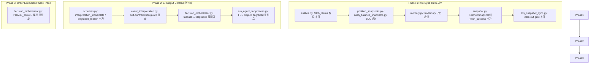

# 리팩토링 P0 Starter Pack — 구현 계획

> **작성일**: 2026-05-22  
> **대상 브랜치**: `main` (기존 코드베이스에 안전하게 overlay)  
> **참조 백로그**: [`order_execution_refactor_backlog_2026-05-22.md`](../plans/order_execution_refactor_backlog_2026-05-22.md)

---

## 분석 결과 요약 (5가지 질문)

### Q1. 첫 번째로 끊어야 할 구조적 결합은?

**KIS Sync zero-out ↔ PositionSnapshotRepository 간 결합.**

현재 [`kis_snapshot_sync.py:424-459`](../src/agent_trading/services/kis_snapshot_sync.py:424)의 zero-out 로직은 `PositionSnapshotRepository.list_latest_by_account()`를 호출해 KIS 응답에 없는 포지션을 `quantity=0`으로 INSERT한다. 문제는:

1. KIS API 호출이 실패해도 빈 리스트(`{}`)가 반환되면, DB에 있는 **모든 실제 포지션**이 quantity=0으로 덮어쓰여짐
2. `PositionSnapshotEntity`에 `fetch_status` 필드가 없어, 이 snapshot이 "실제 broker 응답에서 quantity=0"인지 "fetch 실패로 인한 기본값"인지 구분 불가
3. `source_of_truth`가 항상 `"broker"`로 고정 — fetch 실패 시에도 broker truth로 기록됨

**해결 방향**: zero-out을 fetch 성공이 확인된 경우에만 실행하도록 gate 추가. entity에 `fetch_status` 또는 `sync_status` 필드를 추가하여 각 스냅샷의 출처 상태를 명시적으로 저장.

### Q2. Zero-out 방지를 위한 최소 변경 범위

최소 변경으로 zero-out을 방지하려면:

1. **`kis_snapshot_sync.py`**: zero-out 블록(424-459) 진입 전에 `fetch_success` 플래그 체크 추가. KIS API가 정상 응답을 반환했을 때만 zero-out 실행.
2. **`snapshot.py`**: `KISSyncSnapshotProvider.fetch_snapshot()` 반환값(`FetchedSnapshot`)에 `fetch_success: bool` 또는 `fetch_error: str | None` 필드 추가. 현재는 `errors` 리스트만 있어 fetch 완전 실패와 부분 실패 구분이 모호함.
3. **`SnapshotSyncRunEntity`**: 현재 `status`는 run-level만 있음. per-position per-cash fetch status를 저장할 필드는 일단 미루되, run-level에서 "fetch_success=False 시 position skip" 정책을 적용.

### Q3. Symbol-level execution phase trace 구조

현재 [`SubmitResult`](../src/agent_trading/services/decision_orchestrator.py:287)는 `status`, `error_phase`, `error_message`만 있고 per-symbol trace가 없음.

**권장 구조 (SubmitResult 확장 또는 별도 PhaseTrace)**:

```python
@dataclass(slots=True, frozen=True)
class SymbolPhaseTrace:
    symbol: str
    """Symbol identifier"""
    phases: tuple[str, ...] = ()
    """List of completed phases (e.g. 'assemble', 'sizing', 'validate', 'order_created', 'submitted')"""
    current_phase: str = "pending"
    """Current phase of execution"""
    error: str | None = None
    """Error message if any phase failed"""
    duration_ms: int = 0
    """Total execution duration for this symbol"""

@dataclass(slots=True, frozen=True)
class SubmitResult:
    # ... existing fields ...
    symbol_traces: tuple[SymbolPhaseTrace, ...] = ()
    """Per-symbol phase execution trace (empty for single-symbol submissions)"""
```

단, **P0 범위에서는 phase trace를 SubmitResult에 추가하지 않고**, Phase 4a-4b 사이에 structured logging으로 대체. P1에서 도입.

### Q4. EI output contract: "이벤트 없음" vs "해석 불완전" 분리

현재 [`EventInterpretationOutput`](../src/agent_trading/services/ai_agents/schemas.py:246)은 세 가지 상태를 표현하지만 명시적이지 않음:

| 상태 | 현재 표현 | 문제 |
|------|----------|------|
| 정상 해석 완료 | `events=(...), event_count=N` | 정상 |
| 이벤트 없음 (정상) | `events=(), no_material_events=True` | 정상 |
| 해석 불완전 (timeout/fallback) | `events=(), event_count=N>0` | **모호함** — `_build_ei_summary()` case 2로만 감지 가능 |

**권장 변경**:

```python
@dataclass(slots=True, frozen=True)
class AggregateEventView:
    # ... existing fields ...
    interpretation_incomplete: bool = False
    """True when the agent could not complete interpretation (timeout, provider error, etc.)"""
    degraded_reason: str | None = None
    """Machine-readable reason for degradation: 'timeout' | 'provider_error' | 'self_contradiction_corrected' | None"""
```

그리고 [`EventInterpretationOutput`](../src/agent_trading/services/ai_agents/schemas.py:246)에:

```python
@dataclass(slots=True, frozen=True)
class EventInterpretationOutput:
    # ... existing fields ...
    @property
    def is_degraded(self) -> bool:
        """True when interpretation was incomplete or degraded."""
        return self.aggregate_view.interpretation_incomplete
```

### Q5. 이번 턴의 구현 범위 (Scope Boundary)

이번 P0 Starter Pack에서는 **세 가지 축 중 구조 변경이 적은 것부터** 우선 처리:

1. **KIS Sync Truth 보호 (SYNC-001, SYNC-002)** — zero-out 방지 + sync 상태 필드 추가
2. **EI Output Contract 명시화 (EI-001, EI-003)** — `interpretation_incomplete` + `degraded_reason` 필드 추가 + self-contradiction guard 강화
3. **Order Execution Phase Trace (EXE-002)** — SubmitResult가 아닌 structured logging으로 우회

**제외 (P1+)**:
- EXE-001 (quote hang): `quote_resolution` timeout 개선은 subprocess isolation으로 이미 해결됨
- EXE-003 (batch monitoring): scheduler-level retry/pacing은 별도 작업
- EXE-004 (quote fallback policy): sizing engine 수정 필요
- EXE-005A/B (batch/quote control): scheduler-level submit gate
- SYNC-004 (stale fallback): `SnapshotSyncHealthSummary` 기반 fallback 로직 추가는 P1
- `trade_decision.quantity` 리팩토링: entity 스키마 변경 필요

---

## A. KIS Sync Truth 보호

### A-1: Zero-out 방지 Gate

| 항목 | 내용 |
|------|------|
| **연결된 백로그** | SYNC-001 (zero-out prevention) |
| **변경 파일** | [`src/agent_trading/services/kis_snapshot_sync.py`](../src/agent_trading/services/kis_snapshot_sync.rs:176) |
| **변경 내용** | zero-out 블록(라인 424-459) 진입 전에 KIS API 응답 유효성 확인 gate 추가 |
| **변경 후 동작** | KIS API가 정상 응답을 반환했을 때만 zero-out 실행. fetch 실패 시 zero-out 생략하고 `logger.warning` 출력 |
| **위험도** | 낮음 — gate만 추가, 기존 로직 변경 없음 |

**상세 구현**:

```python
# sync_kis_account_snapshots() 함수 내, zero-out 블록(424) 직전
# ── 2b. Zero-out positions missing from KIS response ───────────────
# ★ P0: KIS API 응답이 유효할 때만 zero-out 실행
# fetch 실패(위치 353-362에서 포착) 시 positions는 빈 dict({})이므로
# zero-out을 실행하면 모든 실제 포지션이 quantity=0으로 덮어쓰여짐.
if _kis_response_had_actual_positions:  # ← P0 gate
    try:
        current_instrument_ids = set(pdno_to_instrument_id.values())
        latest_snapshots = await position_snapshot_repo.list_latest_by_account(account_id)
        for snap in latest_snapshots:
            if snap.quantity == Decimal("0"):
                continue
            if snap.instrument_id in current_instrument_ids:
                continue
            # ... zero-snapshot 생성 및 저장 ...
    except Exception:
        logger.warning(...)
else:
    logger.info(
        "Skipping zero-out for account=%s — KIS response had no actual "
        "positions (fetch may have failed or account is empty)",
        account_id,
    )
```

**gate 조건** (`_kis_response_had_actual_positions`):

```python
# KIS API 응답(raw)이 실제로 position 데이터를 포함했는지 확인
# 1) raw에서 position 키가 존재하고
# 2) 실제로 1건 이상의 position 데이터가 파싱되었으며
# 3) fetch 중 예외가 발생하지 않았음
had_actual = (
    len(pdno_to_instrument_id) > 0  # 실제로 position이 파싱됨
    or available_cash is not None   # cash balance도 확인 (KIS API 자체는 정상)
)
```

### A-2: Sync 상태 필드 추가 (entity + DB)

| 항목 | 내용 |
|------|------|
| **연결된 백로그** | SYNC-002 (state model) |
| **변경 파일** | [`src/agent_trading/domain/entities.py`](../src/agent_trading/domain/entities.rs:118), [`src/agent_trading/repositories/postgres/position_snapshots.py`](../src/agent_trading/repositories/postgres/position_snapshots.py:25), [`src/agent_trading/repositories/postgres/cash_balance_snapshots.py`](../src/agent_trading/repositories/postgres/cash_balance_snapshots.py:24) |
| **변경 내용** | `PositionSnapshotEntity`와 `CashBalanceSnapshotEntity`에 `fetch_status: str` 필드 추가 (`"success"`, `"partial"`, `"stale"`, `"fetch_failed"`) |
| **변경 후 동작** | fetch 실패 시 DB에 `fetch_status='fetch_failed'`로 기록되어 downstream(Phase 4c stale guard)에서 참조 가능 |
| **위험도** | 중간 — entity 변경으로 여러 consumer에 영향. 하지만 새로운 필드 추가이므로 기존 consumer는 무시 가능 |

**상세 변경**:

[`entities.py`](../src/agent_trading/domain/entities.py:118):
```python
@dataclass(slots=True, frozen=True)
class PositionSnapshotEntity:
    # ... 기존 필드 ...
    fetch_status: str = "success"
    """Status of this snapshot fetch: 'success' | 'partial' | 'stale' | 'fetch_failed' | 'zeroed_out'"""
```

[`entities.py`](../src/agent_trading/domain/entities.py:134):
```python
@dataclass(slots=True, frozen=True)
class CashBalanceSnapshotEntity:
    # ... 기존 필드 ...
    fetch_status: str = "success"
    """Status of this snapshot fetch: 'success' | 'stale' | 'fetch_failed'"""
```

Postgres INSERT 쿼리와 InMemoryRepository에도 반영. 새 컬럼은 `NOT NULL DEFAULT 'success'`로 추가하여 기존 row 호환성 유지.

### A-3: KIS Sync Provider fetch_success 명시화

| 항목 | 내용 |
|------|------|
| **연결된 백로그** | SYNC-001 (zero-out prevention, 간접) |
| **변경 파일** | [`src/agent_trading/brokers/koreainvestment/snapshot.py`](../src/agent_trading/brokers/koreainvestment/snapshot.py:66) |
| **변경 내용** | [`FetchedSnapshot`](../src/agent_trading/services/snapshot_sync.py) (가정: `snapshot_sync.py`에 정의됨)에 `fetch_success: bool` 또는 `fetch_error: str | None` 필드 추가 |
| **변경 후 동작** | 호출자(`sync_kis_account_snapshots`)가 fetch 성공 여부를 명시적으로 확인 가능 |
| **위험도** | 낮음 — 반환 타입에 필드 추가 |

---

## B. EI Output Contract 명시화

### B-1: `AggregateEventView`에 `interpretation_incomplete` 추가

| 항목 | 내용 |
|------|------|
| **연결된 백로그** | EI-001 (explicit degraded flag), EI-003 (self-contradiction guard) |
| **변경 파일** | [`src/agent_trading/services/ai_agents/schemas.py`](../src/agent_trading/services/ai_agents/schemas.rs:196) |
| **변경 내용** | `AggregateEventView`에 `interpretation_incomplete: bool = False`와 `degraded_reason: str | None = None` 필드 추가 |
| **변경 후 동작** | timeout/fallback/self-contradiction 시 명시적으로 `interpretation_incomplete=True`로 설정. `_build_ei_summary()`에서도 이 플래그를 참조하여 "해석 불완전" 메시지 생성 |
| **위험도** | 낮음 — 새로운 필드 추가. 기존 `__post_init__`과 호환됨 |

### B-2: Self-contradiction guard에 degraded 플래그 설정

| 항목 | 내용 |
|------|------|
| **연결된 백로그** | EI-003 (self-contradiction guard) |
| **변경 파일** | [`src/agent_trading/services/ai_agents/event_interpretation.py`](../src/agent_trading/services/ai_agents/event_interpretation.rs:274) |
| **변경 내용** | `EventInterpretationAgent.run()` 내 self-contradiction guard(270-300)에서 `interpretation_incomplete=True`, `degraded_reason='self_contradiction_corrected'` 설정 |
| **변경 후 동작** | EI output이 self-contradiction correction을 거친 경우 명시적 플래그로 기록됨 |
| **위험도** | 낮음 |

**상세 변경**:

```python
# event_interpretation.py, run() 메서드 내 self-contradiction guard
if (
    input_event_count > 0
    and output_event_count == 0
    and raw_event_count == 0
):
    logger.warning(...)
    # ★ P0: self-contradiction correction을 명시적으로 표시
    corrected_av = replace(
        aggregate_view,
        event_count=input_event_count,
        interpretation_incomplete=True,
        degraded_reason="self_contradiction_corrected",
    )
    object.__setattr__(self, "aggregate_view", corrected_av)
```

### B-3: Timeout/fallback 시 degraded 플래그 설정

| 항목 | 내용 |
|------|------|
| **연결된 백로그** | EI-001 |
| **변경 파일** | [`src/agent_trading/services/decision_orchestrator.py`](../src/agent_trading/services/decision_orchestrator.rs:2000) (`_run_agents()`) |
| **변경 내용** | EI timeout(라인 2076-2086) 및 exception fallback(2088-2097)에서 `EventInterpretationOutput()` 생성 후 `interpretation_incomplete=True`, `degraded_reason='timeout' | 'provider_error'` 설정 |
| **변경 후 동작** | fallback EI output에도 degraded 상태가 명시적으로 기록됨 |
| **위험도** | 낮음 |

**상세 변경**:

```python
# _run_agents(), TimeoutError 처리
except asyncio.TimeoutError:
    event_output = EventInterpretationOutput()
    object.__setattr__(event_output, "summary", _build_ei_summary(event_output))
    # ★ P0: timeout 시 degraded 플래그 설정
    degraded_av = replace(
        event_output.aggregate_view,
        interpretation_incomplete=True,
        degraded_reason="timeout",
    )
    object.__setattr__(event_output, "aggregate_view", degraded_av)

# Exception fallback도 동일하게 degraded_reason="provider_error"
```

### B-4: Subprocess fallback에서도 degraded 플래그 설정

| 항목 | 내용 |
|------|------|
| **연결된 백로그** | EI-001 |
| **변경 파일** | [`scripts/run_agent_subprocess.py`](../scripts/run_agent_subprocess.py) (FDC skip 조건), [`src/agent_trading/services/decision_orchestrator.py`](../src/agent_trading/services/decision_orchestrator.rs:2789) (`_build_fallback_bundle()`) |
| **변경 내용** | fallback bundle 생성 시에도 `interpretation_incomplete=True` 설정 |
| **변경 후 동작** | subprocess timeout으로 인한 fallback도 명시적 degraded 상태로 기록 |
| **위험도** | 낮음 |

---

## C. Order Execution Phase Trace (Structured Logging 우회)

### C-1: PHASE_TRACE key-value 로깅 표준화

| 항목 | 내용 |
|------|------|
| **연결된 백로그** | EXE-002 (phase trace) |
| **변경 파일** | [`src/agent_trading/services/decision_orchestrator.py`](../src/agent_trading/services/decision_orchestrator.rs:894) (`assemble_and_submit()`) |
| **변경 내용** | 주요 phase 경계마다 `PHASE_TRACE` 로그 라인 추가 (symbol, phase_name, elapsed_ms, status) |
| **변경 후 동작** | 로그 기반으로 per-symbol phase trace를 재구성 가능 |
| **위험도** | 낮음 — 로그만 추가, 비즈니스 로직 변경 없음 |

**로깅 형식**:

```python
logger.info(
    "PHASE_TRACE symbol=%s phase=%s elapsed_ms=%d status=%s",
    symbol, "sizing", int(elapsed * 1000), "ok" if success else "fail",
)
```

**Phase 식별자 목록**:
- `assemble_start`, `assemble_done`
- `sizing_start`, `sizing_done`, `sizing_skip_held_position`
- `sell_guard_start`, `sell_guard_done`
- `validate_start`, `validate_skip_hold_watch`, `validate_done`
- `order_create_start`, `order_create_done`
- `transition_start`, `transition_done`
- `stale_snapshot_guard_start`, `stale_snapshot_guard_blocked`, `stale_snapshot_guard_passed`
- `submit_start`, `submit_done`, `submit_timeout`
- `post_submit_sync_start`, `post_submit_sync_done`

### C-2: SubmitResult 확장 (선택적, P0에서 결정 필요)

| 항목 | 내용 |
|------|------|
| **연결된 백로그** | EXE-002 (일부) |
| **변경 파일** | [`src/agent_trading/services/decision_orchestrator.py`](../src/agent_trading/services/decision_orchestrator.rs:287) |
| **변경 내용** | `SubmitResult`에 `symbol_phases: dict[str, list[str]]` 또는 `SymbolPhaseTrace` 튜플 추가 |
| **변경 후 동작** | API 응답에서 per-symbol phase 조회 가능 |
| **위험도** | 중간 — SubmitResult consumer 영향 있음 |

**권장**: P0에서는 **로깅만 추가**하고, P1에서 `SubmitResult` 확장.

---

## D. 변경 파일 요약

| 파일 | 변경 유형 | 위험도 | 비고 |
|------|----------|--------|------|
| [`kis_snapshot_sync.py`](../src/agent_trading/services/kis_snapshot_sync.py) | 로직 변경 | 낮음 | zero-out gate 추가 |
| [`snapshot.py`](../src/agent_trading/brokers/koreainvestment/snapshot.py) | 인터페이스 변경 | 낮음 | `fetch_success` 필드 추가 |
| [`entities.py`](../src/agent_trading/domain/entities.py) | 스키마 변경 | 중간 | `fetch_status` 필드 추가 |
| [`position_snapshots.py`](../src/agent_trading/repositories/postgres/position_snapshots.py) | SQL 변경 | 낮음 | 새 컬럼 INSERT 반영 |
| [`cash_balance_snapshots.py`](../src/agent_trading/repositories/postgres/cash_balance_snapshots.py) | SQL 변경 | 낮음 | 새 컬럼 INSERT 반영 |
| [`memory.py`](../src/agent_trading/repositories/memory.py) | 구현 변경 | 낮음 | 새 필드 반영 |
| [`schemas.py`](../src/agent_trading/services/ai_agents/schemas.py) | 스키마 변경 | 낮음 | `interpretation_incomplete`, `degraded_reason` 추가 |
| [`event_interpretation.py`](../src/agent_trading/services/ai_agents/event_interpretation.py) | 로직 변경 | 낮음 | self-contradiction guard에 degraded 플래그 설정 |
| [`decision_orchestrator.py`](../src/agent_trading/services/decision_orchestrator.py) | 로직 + 로깅 변경 | 낮음 | fallback 시 degraded 플래그 + PHASE_TRACE 로깅 |
| [`run_agent_subprocess.py`](../scripts/run_agent_subprocess.py) | 로직 변경 | 낮음 | FDC skip 시 degraded 플래그 |

---

## E. 구현 순서 (Execution Order)



### Step-by-step 작업 목록

1. **`entities.py`** — `PositionSnapshotEntity`와 `CashBalanceSnapshotEntity`에 `fetch_status: str = "success"` 필드 추가
2. **`position_snapshots.py`** — Postgres INSERT 쿼리에 `fetch_status` 컬럼 추가
3. **`cash_balance_snapshots.py`** — Postgres INSERT 쿼리에 `fetch_status` 컬럼 추가
4. **`memory.py`** — InMemoryPositionSnapshotRepository / InMemoryCashBalanceSnapshotRepository에 새 필드 반영
5. **`snapshot.py`** — `KISSyncSnapshotProvider.fetch_snapshot()` 반환에 `fetch_success: bool` 추가 (또는 `FetchedSnapshot` 확장)
6. **`kis_snapshot_sync.py`** — zero-out gate 추가 + fetch_status를 각 snapshot에 설정
7. **`schemas.py`** — `AggregateEventView`에 `interpretation_incomplete` + `degraded_reason` 필드 추가
8. **`event_interpretation.py`** — self-contradiction guard에서 `interpretation_incomplete=True` 설정
9. **`decision_orchestrator.py`** — EI timeout/exception fallback에서 degraded 플래그 설정 + `_build_fallback_bundle()`에서도 설정
10. **`decision_orchestrator.py`** — `assemble_and_submit()` 주요 phase에 PHASE_TRACE 로깅 추가
11. **`run_agent_subprocess.py`** — FDC skip 조건에서도 degraded 플래그 설정

---

## F. 테스트 전략

### 검증 대상 시나리오

| 시나리오 | 현재 동작 | 기대 동작 | 검증 방법 |
|----------|----------|----------|----------|
| KIS API timeout (fetch 실패) | 모든 position이 quantity=0으로 zero-out | zero-out 생략, `fetch_status='fetch_failed'`로 기록 | Unit test: mock KIS 응답 → empty dict |
| KIS API 정상 (일부 position만 반환) | 없는 position만 zero-out | 동일 (변화 없음) | Regression test |
| EI timeout | `EventInterpretationOutput()` fallback | `interpretation_incomplete=True` | Unit test: `_run_agents()` mock |
| EI self-contradiction | event_count 보정 | `interpretation_incomplete=True, degraded_reason='self_contradiction_corrected'` | Unit test: provider stub |
| 정상 EI (이벤트 없음) | `no_material_events=True` | 동일 (변화 없음) | Regression test |
| PHASE_TRACE 로깅 | 없음 | 주요 phase마다 로그 출력 | Integration test: 로그 capture |

### 변경 영향도

- **fetch_status 필드 추가**: Postgres에 새 컬럼 추가 (DEFAULT 'success'로 기존 호환성 유지)
- **interpretation_incomplete 필드 추가**: 기존 consumer 영향 없음 (기본값=False)
- **zero-out gate**: 실패 시 zero-out 건너뛰는 것만 변경 — 기존 정상 동작에 영향 없음
- **PHASE_TRACE 로깅**: 로그만 추가, 비즈니스 로직 변경 없음

---

## G. 롤백 계획

각 변경은 독립적으로 rollback 가능:

1. **zero-out gate**: gate 조건만 제거하면 원복
2. **fetch_status 필드**: entity 필드는 제거해도 DB 컬럼은 `NOT NULL DEFAULT 'success'`로 잔류 (하위 호환)
3. **interpretation_incomplete 필드**: entity 필드 제거 (DB 없음, 메모리 객체만)
4. **PHASE_TRACE 로깅**: 로그 라인 제거

---

## H. 미해결 이슈 / 논의 필요 사항

1. **DB migration 전략**: `fetch_status` 컬럼 추가를 위한 migration SQL 필요. `ALTER TABLE ... ADD COLUMN fetch_status VARCHAR(20) NOT NULL DEFAULT 'success'`
2. **`SubmissionResult.symbol_phases`**: P0에서 구조화된 phase trace를 SubmitResult에 포함할지, 로깅으로만 대체할지 결정 필요
3. **`FetchedSnapshot` 위치**: `snapshot_sync.py`에 정의된 것으로 추정되나 정확한 위치 확인 필요
4. **Phase 4c stale guard**: `fetch_status`를 stale guard에서 참조할지 여부는 P1으로 연기
