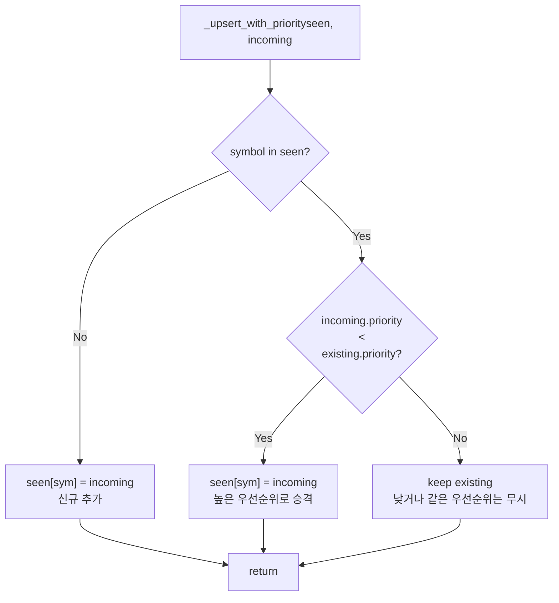
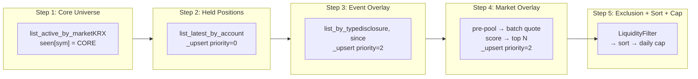

# P2 Backend Bugfix Plan — Priority Overwrite + Event Lookback + pytest Warning

## 발견된 버그 3건

### 버그 1: Event overlay lookback (`since=now`)

**현재 코드** — [`scripts/run_paper_decision_loop.py:275-277`](scripts/run_paper_decision_loop.py:275)

```python
ctx = CompositionContext(
    account_id=account_id,
    since=datetime.now(timezone.utc),  # BUG: 현재 시각 이후 이벤트만 조회
    ...
)
```

[`ExternalEventRepository.list_by_type()`](src/agent_trading/repositories/contracts.py:544)는 `published_at >= since` 조건으로 필터링.
`since=datetime.now(timezone.utc)`면 **현재 시각 이후에 발행된 이벤트만** 조회 → 실질적으로 이벤트 overlay가 **영원히 동작하지 않음**.

**수정**: 상수 `DEFAULT_EVENT_LOOKBACK_HOURS = 24`를 선언하고,
`since = datetime.now(timezone.utc) - timedelta(hours=DEFAULT_EVENT_LOOKBACK_HOURS)`로 변경.

**상수 위치**: `scripts/run_paper_decision_loop.py` 상단, 다른 기본값 상수 옆.

---

### 버그 2: Source priority overwrite (무조건 덮어쓰기)

**현재 코드** — [`src/agent_trading/services/universe_selection.py`](src/agent_trading/services/universe_selection.py)

`compose()` 실행 순서: **core → held → event → market**

각 `_add_*` 메서드가 `seen[sym] = SelectedSymbol(...)`으로 **무조건 덮어씀**.

| 단계 | 코드 위치 | 문제 |
|------|-----------|------|
| `_add_held_positions()` | line 397 | held가 가장 먼저 실행되므로 현재는 문제 없음 |
| `_add_event_overlay()` | line 418 | **held가 event로 덮어짐** → `HELD_POSITION` semantics 붕괴 |
| `_add_market_overlay()` | line 512 | **held/event가 market으로 덮어짐** → priority 무시 |

**Priority 값** ([`SourceType`](src/agent_trading/services/universe_selection_types.py:23)):
| SourceType | priority | 설명 |
|------------|----------|------|
| HELD_POSITION | 0 | 최우선 (mandatory) |
| MANUAL | 1 | 향후 사용 |
| EVENT_OVERLAY | 2 | high severity 이벤트 |
| MARKET_OVERLAY | 2 | 동일 priority |
| CORE | 3 | 최하위 (baseline) |

*(낮을수록 높은 우선순위)*

**수정**: `_upsert_with_priority(seen, incoming)` static helper 도입

**Merge 규칙**: `incoming.priority < existing.priority`일 때만 덮어씀.
- 동일 priority → 먼저 들어온(first-writer) 유지 (EVENT가 MARKET보다 우선)

| 시나리오 | existing.p | incoming.p | 덮어씀? | 결과 |
|----------|-----------|-----------|---------|------|
| HELD(0) over CORE(3) | 3 | 0 | ✅ YES | HELD 유지 |
| EVENT(2) over HELD(0) | 0 | 2 | ❌ NO | HELD 보호 |
| EVENT(2) over CORE(3) | 3 | 2 | ✅ YES | EVENT 승격 |
| MARKET(2) over HELD(0) | 0 | 2 | ❌ NO | HELD 보호 |
| MARKET(2) over EVENT(2) | 2 | 2 | ❌ NO | EVENT 유지 (first-writer) |
| MARKET(2) over CORE(3) | 3 | 2 | ✅ YES | MARKET 승격 |

**변경할 메서드** (3개):
1. `_add_held_positions()` — line 397: `seen[sym] = ...` → `_upsert_with_priority(seen, ...)`
2. `_add_event_overlay()` — line 418: `seen[sym] = ...` → `_upsert_with_priority(seen, ...)`
3. `_add_market_overlay()` — line 512: `seen[sym] = ...` → `_upsert_with_priority(seen, ...)`

`_add_core_universe()`는 이미 `if sym not in seen` 조건이 있어 변경 불필요.

---

### 버그 3: pytest warning — `coroutine was never awaited`

**현재 코드** — [`tests/scripts/test_run_paper_decision_loop.py:694-698`](tests/scripts/test_run_paper_decision_loop.py:694)

```python
@asynccontextmanager
async def _mock_postgres_runtime_error(
    run_migrations: bool = False,
) -> AsyncIterator[dict[str, Any]]:
    raise RuntimeError("Runtime unavailable")
```

`@asynccontextmanager`가 `raise`(yield 없음)를 감싸면서 **미소비 코루틴**이 생성됨.

**수정**: `@asynccontextmanager` 제거 → class-based async context manager 사용:

```python
class _MockRuntimeError:
    """Async context manager that raises on enter."""
    async def __aenter__(self) -> dict[str, Any]:
        raise RuntimeError("Runtime unavailable")
    async def __aexit__(self, *args: object) -> None:
        pass
```

---

## 파일별 변경 요약

| 파일 | 변경 내용 |
|------|----------|
| [`src/agent_trading/services/universe_selection.py`](src/agent_trading/services/universe_selection.py) | `_upsert_with_priority()` helper 추가 + 3개 `_add_*` 메서드에서 직접 할당 대신 helper 사용 |
| [`scripts/run_paper_decision_loop.py`](scripts/run_paper_decision_loop.py) | `DEFAULT_EVENT_LOOKBACK_HOURS = 24` 상수 추가 + `since` 계산에 `timedelta(hours=...)` 적용 |
| [`tests/services/test_universe_selection.py`](tests/services/test_universe_selection.py) | 신규 테스트 7개 추가 |
| [`tests/scripts/test_run_paper_decision_loop.py`](tests/scripts/test_run_paper_decision_loop.py) | `_mock_postgres_runtime_error`를 class-based context manager로 변경 |

---

## 추가/수정 테스트 목록

### [`tests/services/test_universe_selection.py`](tests/services/test_universe_selection.py)

**신규 클래스: `TestSourcePriorityOverwrite`**

| # | 테스트 | 설명 |
|---|--------|------|
| 1 | `test_held_not_overwritten_by_event` | held(0) + event(2) → 최종 source_type = `HELD_POSITION` |
| 2 | `test_core_promoted_by_event` | core(3) + event(2) → 최종 source_type = `EVENT_OVERLAY` |
| 3 | `test_core_promoted_by_market` | core(3) + market(2) → 최종 source_type = `MARKET_OVERLAY` |
| 4 | `test_event_not_overwritten_by_market` | event(2) + market(2) → 최종 source_type = `EVENT_OVERLAY` (first-writer) |

**신규 클래스: `TestEventLookback`**

| # | 테스트 | 설명 |
|---|--------|------|
| 5 | `test_recent_event_included` | lookback 내 이벤트 → `EVENT_OVERLAY`로 포함 |
| 6 | `test_old_event_excluded` | lookback 밖 이벤트 → CORE 유지 (promotion 없음) |

### [`tests/scripts/test_run_paper_decision_loop.py`](tests/scripts/test_run_paper_decision_loop.py)

| # | 테스트 | 설명 |
|---|--------|------|
| 7 | 기존 `test_universe_selection_service_error_fallback` | warning 없이 통과 확인 (mock 구조 변경) |

---

## 구현 순서

### Step 1: `_upsert_with_priority()` helper 구현

**파일**: [`src/agent_trading/services/universe_selection.py`](src/agent_trading/services/universe_selection.py)

`UniverseSelectionService` 내에 static method로 추가 (기존 `_apply_cap` 옆):

```python
@staticmethod
def _upsert_with_priority(
    seen: dict[str, SelectedSymbol],
    incoming: SelectedSymbol,
) -> None:
    """Add or update ``seen`` only if ``incoming`` has strictly higher priority.

    Merge rule: ``incoming.priority < existing.priority`` → overwrite.
    Equal or lower priority → keep existing (first-writer wins).
    """
    existing = seen.get(incoming.symbol)
    if existing is None or incoming.priority < existing.priority:
        seen[incoming.symbol] = incoming
```

### Step 2: 3개 `_add_*` 메서드에서 helper 사용

1. `_add_held_positions()` — line 395-402:
   ```python
   # Before:
   seen[sym] = SelectedSymbol(...)
   # After:
   self._upsert_with_priority(seen, SelectedSymbol(...))
   ```

2. `_add_event_overlay()` — line 418:
   ```python
   self._upsert_with_priority(seen, SelectedSymbol(...))
   ```

3. `_add_market_overlay()` — line 512:
   ```python
   self._upsert_with_priority(seen, SelectedSymbol(...))
   ```

### Step 3: Event lookback 수정

**파일**: [`scripts/run_paper_decision_loop.py`](scripts/run_paper_decision_loop.py)

1. 상수 추가 (line 60-70 영역):
   ```python
   DEFAULT_EVENT_LOOKBACK_HOURS: int = 24
   """Events ingested within this many hours before ``now`` are considered
   for event-driven overlay in ``UniverseSelectionService``."""
   ```

2. `since` 계산 변경 (line 277):
   ```python
   # Before:
   since=datetime.now(timezone.utc),
   # After:
   since=datetime.now(timezone.utc) - timedelta(hours=DEFAULT_EVENT_LOOKBACK_HOURS),
   ```

3. `timedelta` import 확인 (`from datetime import datetime, timezone` → `from datetime import datetime, timedelta, timezone`)

### Step 4: pytest warning 수정

**파일**: [`tests/scripts/test_run_paper_decision_loop.py`](tests/scripts/test_run_paper_decision_loop.py:694)

Replace `@asynccontextmanager` function with class-based context manager:

```python
class _MockRuntimeError:
    """Async context manager that raises on __aenter__."""
    async def __aenter__(self) -> dict[str, Any]:
        raise RuntimeError("Runtime unavailable")
    async def __aexit__(self, *args: object) -> None:
        pass
```

Then in the patch:
```python
with patch(
    "scripts.run_paper_decision_loop.postgres_runtime",
    new=_MockRuntimeError,
):
```

### Step 5: 테스트 추가

**파일**: [`tests/services/test_universe_selection.py`](tests/services/test_universe_selection.py)

`TestSourcePriorityOverwrite` 클래스 추가 (기존 `TestCompositionContextP2` 뒤):

```python
# ---------------------------------------------------------------------------
# P2 bugfix: Source priority overwrite
# ---------------------------------------------------------------------------

class TestSourcePriorityOverwrite:
    """``_upsert_with_priority()`` — priority 기반 merge 정확성."""

    @pytest.mark.asyncio
    async def test_held_not_overwritten_by_event(self) -> None:
        """HELD_POSITION은 EVENT_OVERLAY로 덮어쓰면 안 됨."""
        repos = build_in_memory_repositories()
        inst = _make_instrument("005930")
        await repos.instruments.add(inst)
        # Held position
        pos = _make_position(instrument_id=inst.instrument_id, quantity=Decimal("10"))
        await repos.position_snapshots.add(pos)
        # High-severity event on same symbol
        await repos.external_events.add(_make_event("005930", severity="high"))

        svc = UniverseSelectionService(repos)
        ctx = CompositionContext(account_id=ACCOUNT_ID, since=NOW)
        result = await svc.compose(ctx)

        selected = next(s for s in result if s.symbol == "005930")
        assert selected.source_type == SourceType.HELD_POSITION

    @pytest.mark.asyncio
    async def test_core_promoted_by_event(self) -> None:
        """CORE는 EVENT_OVERLAY로 승격 가능."""
        repos = build_in_memory_repositories()
        await repos.instruments.add(_make_instrument("005930"))
        await repos.external_events.add(_make_event("005930", severity="high"))

        svc = UniverseSelectionService(repos)
        ctx = CompositionContext(account_id=FALLBACK_ACCOUNT_ID, since=NOW)
        result = await svc.compose(ctx)

        selected = next(s for s in result if s.symbol == "005930")
        assert selected.source_type == SourceType.EVENT_OVERLAY

    @pytest.mark.asyncio
    async def test_core_promoted_by_market(self) -> None:
        """CORE는 MARKET_OVERLAY로 승격 가능."""
        repos = build_in_memory_repositories()
        await repos.instruments.add(_make_instrument("005930"))

        # Mock KIS client
        class _MockKIS:
            async def get_quotes_batch(self, symbols, **kwargs):
                return {sym: {"output": {"stck_prpr": "50000", "prdy_ctrt": "2.5",
                                         "acml_tr_pbmn": "500000000000",
                                         "stck_hgpr": "55000", "stck_lwpr": "48000",
                                         "stck_oprc": "49000"}} for sym in symbols}

        svc = UniverseSelectionService(repos, kis_client=_MockKIS())
        ctx = CompositionContext(
            account_id=FALLBACK_ACCOUNT_ID, since=NOW,
            market_overlay_cap=5, pre_pool_size=50,
        )
        result = await svc.compose(ctx)

        selected = next(s for s in result if s.symbol == "005930")
        assert selected.source_type == SourceType.MARKET_OVERLAY

    @pytest.mark.asyncio
    async def test_event_not_overwritten_by_market(self) -> None:
        """EVENT_OVERLAY는 MARKET_OVERLAY로 덮어쓰면 안 됨 (first-writer)."""
        repos = build_in_memory_repositories()
        await repos.instruments.add(_make_instrument("005930"))
        await repos.external_events.add(_make_event("005930", severity="high"))

        # Mock KIS client (returns data for same symbol)
        class _MockKIS:
            async def get_quotes_batch(self, symbols, **kwargs):
                return {sym: {"output": {"stck_prpr": "50000", "prdy_ctrt": "2.5",
                                         "acml_tr_pbmn": "500000000000",
                                         "stck_hgpr": "55000", "stck_lwpr": "48000",
                                         "stck_oprc": "49000"}} for sym in symbols}

        svc = UniverseSelectionService(repos, kis_client=_MockKIS())
        ctx = CompositionContext(
            account_id=FALLBACK_ACCOUNT_ID, since=NOW,
            market_overlay_cap=5, pre_pool_size=50,
        )
        result = await svc.compose(ctx)

        selected = next(s for s in result if s.symbol == "005930")
        assert selected.source_type == SourceType.EVENT_OVERLAY  # first-writer wins
```

`TestEventLookback` 클래스 추가:

```python
class TestEventLookback:
    """``CompositionContext.since`` — lookback window로 이벤트 필터링."""

    @pytest.mark.asyncio
    async def test_recent_event_included(self) -> None:
        """최근 이벤트 (lookback 내) → EVENT_OVERLAY promotion."""
        repos = build_in_memory_repositories()
        await repos.instruments.add(_make_instrument("005930"))

        from datetime import timedelta
        from agent_trading.domain.entities import ExternalEventEntity

        recent_event = ExternalEventEntity(
            event_id=uuid4(), symbol="005930", market="KRX",
            source_name="opendart", event_type="disclosure",
            severity="high", headline="Recent event",
            published_at=NOW - timedelta(hours=1),  # 1시간 전
            ingested_at=NOW,
            dedup_key_hash="hash-recent",
        )
        await repos.external_events.add(recent_event)

        svc = UniverseSelectionService(repos)
        # lookback 2시간 = 최근 1시간 전 이벤트 포함
        ctx = CompositionContext(
            account_id=FALLBACK_ACCOUNT_ID,
            since=NOW - timedelta(hours=2),
        )
        result = await svc.compose(ctx)

        selected = next(s for s in result if s.symbol == "005930")
        assert selected.source_type == SourceType.EVENT_OVERLAY

    @pytest.mark.asyncio
    async def test_old_event_excluded(self) -> None:
        """오래된 이벤트 (lookback 밖) → CORE 유지."""
        repos = build_in_memory_repositories()
        await repos.instruments.add(_make_instrument("005930"))

        from datetime import timedelta
        from agent_trading.domain.entities import ExternalEventEntity

        old_event = ExternalEventEntity(
            event_id=uuid4(), symbol="005930", market="KRX",
            source_name="opendart", event_type="disclosure",
            severity="high", headline="Old event",
            published_at=NOW - timedelta(hours=48),  # 48시간 전
            ingested_at=NOW,
            dedup_key_hash="hash-old",
        )
        await repos.external_events.add(old_event)

        svc = UniverseSelectionService(repos)
        # lookback 24시간 = 48시간 전 이벤트 제외
        ctx = CompositionContext(
            account_id=FALLBACK_ACCOUNT_ID,
            since=NOW - timedelta(hours=24),
        )
        result = await svc.compose(ctx)

        selected = next(s for s in result if s.symbol == "005930")
        assert selected.source_type == SourceType.CORE  # promotion되지 않음
```

### Step 6: pytest 실행 및 검증

```bash
python3 -m pytest -q tests/services/test_universe_selection.py tests/scripts/test_run_paper_decision_loop.py
```

- warning 0건 확인
- 77 passed + α (기존 70 + 신규 7)

### Step 7: Docker 재빌드 및 헬스 확인

```bash
cd /workspace/agent_trading
docker compose build api worker
docker compose up -d api worker
docker compose ps
# API health check
curl -f http://localhost:8000/health
# Worker log 확인 (import/runtime error 없는지)
docker compose logs --tail=20 worker
```

---

## Mermaid: `_upsert_with_priority` merge decision flow



---

## Mermaid: 전체 compose 흐름 (수정 후)



---

## 파일별 상세 변경 diff

### [`src/agent_trading/services/universe_selection.py`](src/agent_trading/services/universe_selection.py)

**추가**: `_upsert_with_priority()` static method (기존 `_apply_cap` 옆, ~560 line)

```python
@staticmethod
def _upsert_with_priority(
    seen: dict[str, SelectedSymbol],
    incoming: SelectedSymbol,
) -> None:
    """Add or update ``seen`` respecting source-type priority hierarchy.

    Priority hierarchy (lower number = higher priority):
        HELD_POSITION(0) > EVENT_OVERLAY(1) > MARKET_OVERLAY(2) > MANUAL(3) > CORE(4)
        - HELD_POSITION(0): highest — never overwritten (mandatory override).
        - EVENT_OVERLAY(1) > MARKET_OVERLAY(2): event wins over market on same symbol.
        - MARKET_OVERLAY(2) > MANUAL(3): market signal beats manual inclusion.
        - MANUAL(3): reserved for future operator override; current precedence
          follows ``SourceType.priority()``.
        - CORE(4): lowest — always eligible for promotion.

    Rule: ``incoming.priority < existing.priority`` → overwrite.
    Equal or lower priority → keep existing (first-writer wins).
    """
    existing = seen.get(incoming.symbol)
    if existing is None or incoming.priority < existing.priority:
        seen[incoming.symbol] = incoming
```

**변경**: `_add_held_positions()` line 397 — `seen[sym] = ...` → `self._upsert_with_priority(...)`

**변경**: `_add_event_overlay()` line 418 — `seen[sym] = ...` → `self._upsert_with_priority(...)`

**변경**: `_add_market_overlay()` line 512 — `seen[sym] = ...` → `self._upsert_with_priority(...)`

### [`scripts/run_paper_decision_loop.py`](scripts/run_paper_decision_loop.py)

**추가**: line 60-70 영역
```python
DEFAULT_EVENT_LOOKBACK_HOURS: int = 24
"""Event lookback window (hours).  Calendar 24h proxy — not trading-session-aware.
장 시작 직후/휴장일 경계에서는 실제 '1거래일'과 다를 수 있음.
P2.1+에서 trading calendar 기반 lookback으로 개선 필요."""
```

**변경**: `from datetime import datetime, timezone` → `from datetime import datetime, timedelta, timezone`

**변경**: line 277
```python
# Before:
since=datetime.now(timezone.utc),
# After:
since=datetime.now(timezone.utc) - timedelta(hours=DEFAULT_EVENT_LOOKBACK_HOURS),
```

### [`tests/scripts/test_run_paper_decision_loop.py`](tests/scripts/test_run_paper_decision_loop.py:694)

**변경**: `_mock_postgres_runtime_error` → class-based `_MockRuntimeError`

### [`tests/services/test_universe_selection.py`](tests/services/test_universe_selection.py)

**추가**: `TestSourcePriorityOverwrite` (4 tests)
**추가**: `TestEventLookback` (2 tests)

---

## 위험 및 주의사항

1. **`_upsert_with_priority`와 기존 `test_priority_sorting` 테스트**: 기존 테스트는 `005930`이 event overlay로, `000660`이 held position으로 각각 다른 symbol이므로 기존 로직과 helper 모두 동일한 결과를 냄. 회귀 없음.
2. **`test_market_overlay_stub_noop`**: KIS client 없이 MARKET_OVERLAY가 추가되지 않는지 검증. helper 변경과 무관.
3. **`test_event_overlay_promotion`**: core → event promotion 검증. `incoming.priority(2) < existing.priority(3)`이므로 helper에서도 정상 승격.
4. **Event lookback 변경 후 테스트**: 기존 테스트들은 `since=NOW`를 사용하므로 (published_at >= NOW 조건), `_make_event`가 `published_at=NOW`로 생성되어 항상 포함됨. 신규 lookback 테스트만 `since=NOW - timedelta(...)`를 사용.
