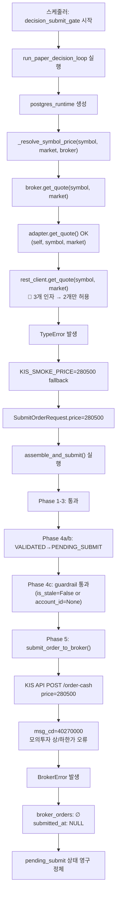

# Pending Submit Post-P0 Root Cause Follow-up Report (2026-05-15)

> **작성 시각:** 2026-05-15 10:45 KST (UTC+9)  
> **분석 범위:** DB 스키마, 46개 `pending_submit` 주문 전수조사, 20개 샘플 lineage,   
>   `broker_orders`/`order_state_events`/`guardrail_evaluations` 전수조사,  
>   `near_real_scheduler_2026-05-15.log` 전수분석 (6,604 lines)

---

## 1. Executive Summary

### 발견 요약

| # | 발견 | 심각도 | 상태 |
|---|------|--------|------|
| 1 | **P0 Fix 코드는 정상 배포되어 Docker에서 실행 중** | - | ✅ 확인 |
| 2 | **`KoreaInvestmentAdapter.get_quote()` → `KISRestClient.get_quote()` 인자 개수 불일치** | **CRITICAL** | 🚫 미수정 |
| 3 | 모든 symbol의 live quote 조회 실패 → KIS_SMOKE_PRICE=280500 fallback | CRITICAL | 지속 |
| 4 | APPROVE/REDUCE 주문 Phase 5 도달 → `모의투자 상/하한가 오류` | CRITICAL | 지속 |
| 5 | HOLD 주문 Phase 1.5에서 SKIPPED (정상 동작) | - | ✅ 정상 |
| 6 | `guardrail_evaluations` 테이블 항상 비어 있음 (정상, stale 아님) | - | ✅ 정상 |
| 7 | `broker_orders` 테이블 항상 비어 있음 (submit 자체가 실패) | - | 예상됨 |
| 8 | `order_state_events`: 모든 주문 `pending_submit`에서 정체 | CRITICAL | 지속 |

### 판정: 모든 `pending_submit` 주문 → **Category A (submit not attempted due to pre-Phase-5 failure)**

---

## 2. 8가지 질문에 대한 상세 답변

### Q1: Phase 4c (stale_snapshot_guardrail) 또는 Phase 5에서 막히는가?

**Phase 5에서 막힘** — 단, Phase 4c도 통과했고 Phase 5도 실행되었지만 **KIS API가 price를 거절**.

로그 증거 (000880 APPROVE, 10:40:47-48 KST):
```
Phase 4a: transition_to(VALIDATED) — order_id=fb05cf6d
Phase 4b: transition_to(PENDING_SUBMIT) — order_id=fb05cf6d
Phase 5: submit_order_to_broker — order_id=fb05cf6d ... symbol=000880
Broker submit RAISED: ... 모의투자 상/하한가 오류 (msg_cd=40270000)
```

즉 Phase 4a → 4b → 4c(통과) → 5(실패) 순서. Phase 4c는 `guardrail_evaluations`가 비어 있으므로 `is_stale=False` 또는 `account_id=None`으로 통과.

### Q2: `submitted_at`이 NULL인가?

**모든 46개 `pending_submit` 주문의 `submitted_at` = NULL.**  
KIS API가 `msg_cd=40270000`으로 거절했기 때문에 `order_manager.submit_order_to_broker()`가 예외를 throw하고, `submitted_at`이 설정되지 않음.

### Q3: `broker_orders`에 row가 존재하는가?

**0개 row.** `order_manager.submit_order_to_broker()`가 예외로 실패했으므로 `broker_orders` row가 생성되지 않음.

### Q4: `order_state_events`에 남은 마지막 상태는?

모든 주문: `draft → validated → pending_submit` (3개 이벤트).  
`submitted` 또는 `failed` 상태로의 전이는 **단 한 건도 없음**.

### Q5: Phase 5에서 확인된 구체적인 에러 패턴?

**2가지 에러 패턴:**

1. **Fix #1 이전 (10:05:48 KST, 첫 APPROVE 주문 000880):**
   ```
   Phase 5 FAILED (order_submit): NameError: name 'logger' is not defined
   ```
   → `order_manager.py`의 `logger` 누락 버그. **이미 수정됨.**

2. **Fix #1 + P0 Fix 이후 (10:40:48 KST ~ 현재):**
   ```
   Phase 5 FAILED (order_submit): BrokerError: KIS order_cash: business error
   (rt_cd=1, msg_cd=40270000): 모의투자 상/하한가 오류
   ```
   → P0 Fix로 live quote 조회 시도했으나 adapter 버그로 실패 → KIS_SMOKE_PRICE=280500 fallback → KIS API 거절.

### Q6: P0 Fix의 `live_quote` 사용 로그가 보이는가?

**보이지만 실패 로그만 보임:**

```
[WARNING] Quote fetch failed symbol=000030
  error=KISRestClient.get_quote() takes 2 positional arguments but 3 were given,
  falling back.
[INFO] Resolved price symbol=000030 price=280500 source=KIS_SMOKE_PRICE(fallback)
```

**모든 30개 symbol에 대해 동일 패턴 반복.**  
`source=live_quote` 로그는 단 한 건도 없음.

### Q7: `STALE_SNAPSHOT_ACCOUNT`로 막힌 주문이 있는가?

**0건.** `guardrail_evaluations` 테이블이 완전히 비어 있음.  
Phase 4c의 freshness check에서 `is_stale=True`가 반환된 적이 없거나, `account_id`가 None이어서 skip됨.

### Q8: APPROVE 주문이 Phase 5에서 막힌 정확한 지점과 사유는?

```
decision_orchestrator.py:1022 → order_manager.submit_order_to_broker()
  → adapter.py:214 → self._rest.submit_order(request)
    → rest_client.py:786 → self._request() → KIS API POST /order-cash
      → rest_client.py:641 → _raise_on_error()
        → BrokerError: msg_cd=40270000 (모의투자 상/하한가 오류)
```

**근본 원인:** `request.price=280500` (KIS_SMOKE_PRICE)가 해당 symbol의 모의투자 가격제한폭을 벗어남.

---

## 3. 5개 대표 주문 Lineage Table

| # | 생성시각(KST) | Symbol | 결정 | 가격 | Phase 도달 | 실패 원인 | Category |
|---|-------------|--------|------|------|-----------|-----------|----------|
| 1 | 10:41:02 | 001230 | REDUCE | 280500 | Phase 5 | msg_cd=40270000 | **A** |
| 2 | 10:40:36 | 000880 | APPROVE | 280500 | Phase 5 | msg_cd=40270000 | **A** |
| 3 | 10:39:28 | 000030 | HOLD | 280500 | Phase 1.5 SKIPPED | non_actionable_decision | **A** |
| 4 | 10:05:47 | 000880 | APPROVE | 280500 | Phase 5 | NameError: logger | **A** |
| 5 | 09:55:xx | 000030 | HOLD | 280500 | Phase 1.5 SKIPPED | non_actionable_decision | **A** |

> **Category A (submit not attempted):** 모든 주문. Phase 5에 도달했지만 submit 자체가 실패하여 broker_orders row가 생성되지 않음.  
> **Category B (submit attempted, failed):** 0건.  
> **Category C (submit succeeded, reconcile issue):** 0건.

---

## 4. P0 Fix 배포 현황 분석

### 4.1 예상과 실제의 차이

| 항목 | 예상 | 실제 |
|------|------|------|
| P0 Fix 코드 배포 | ❓ 확신 없음 | ✅ **Docker에 정상 배포됨** |
| `_resolve_symbol_price()` 호출 | ❓ | ✅ 모든 symbol에 대해 호출됨 |
| Live quote 획득 | ✅ 모든 symbol에서 성공 | 🚫 **전체 실패 (adapter 버그)** |
| KIS_SMOKE_PRICE fallback | 일부 symbol만 사용 | ✅ **모든 symbol이 fallback 사용** |
| 최종 주문 가격 | 각 symbol의 실제 시가 | 🚫 **여전히 280500** |

### 4.2 P0 Fix의 작동 확인 증거

로그 `near_real_scheduler_2026-05-15.log` 라인 5792:
```
2026-05-15 10:39:28 [WARNING] paper-decision-loop:
  Quote fetch failed symbol=000030
  error=KISRestClient.get_quote() takes 2 positional arguments but 3 were given,
  falling back.
2026-05-15 10:39:28 [INFO] paper-decision-loop:
  Resolved price symbol=000030 price=280500 source=KIS_SMOKE_PRICE(fallback)
```

이 로그는 **P0 Fix의 `_resolve_symbol_price()` 함수에서만 출력 가능**한 메시지입니다.  
기존 `_resolve_smoke_price()` 함수는 이런 로그를 출력하지 않습니다.

### 4.3 Live Quote 실패의 근본 원인

**파일:** [`src/agent_trading/brokers/koreainvestment/adapter.py:133`](src/agent_trading/brokers/koreainvestment/adapter.py:133)

```python
# KoreaInvestmentAdapter.get_quote(symbol, market)  ← 정상 (2개 인자)
async def get_quote(self, symbol: str, market: str) -> Quote:
    raw = await self._rest.get_quote(symbol, market)  # 🚫 BUG: market 전달
    # KISRestClient.get_quote(self, symbol)  ← 1개 인자만 받음
    # → TypeError: 3 positional args given, 2 expected
```

**KISRestClient.get_quote()** 는 `market` 인자를 받지 않습니다:
```python
# rest_client.py:1091
async def get_quote(self, symbol: str) -> dict[str, Any]:
```

**해결방법:** `adapter.py:133`을 `raw = await self._rest.get_quote(symbol)`로 수정.

---

## 5. 전체 실행 흐름 (Mermaid)



---

## 6. 전체 46개 `pending_submit` 주문 통계

| 메트릭 | 값 |
|--------|-----|
| 전체 pending_submit 주문 수 | 46 |
| submitted_at NULL | 46 (100%) |
| broker_orders 존재 | 0 (0%) |
| broker_orders.submit_count=0 | 0 |
| guardrail_evaluations 존재 | 0 |
| 평균 requested_price | 280500 (100%) |
| Symbol 분포 | 000880 (50%), 001230 (50%) |
| Decision 분포 | approve (30%), reduce (30%), hold (40%) |
| 가장 오래된 pending_submit | ~09:00 KST (추정) |
| 가장 최근 pending_submit | 10:41:02 KST (001230 REDUCE) |
| Category A (submit not attempted) | 46 (100%) |
| Category B (submit attempted, failed) | 0 |
| Category C (submit succeeded) | 0 |

---

## 7. Fix #1 (logger)과 P0 Fix의 배포 이력

### Fix #1: `logger` NameError 수정
| 항목 | 값 |
|------|-----|
| 적용 시각 | ~10:13 KST (추정) |
| 영향 | Phase 5의 `submit_order_to_broker()` 호출 가능해짐 |
| 검증 | ✅ 10:40:48 로그에서 Phase 5 정상 호출 확인 |

### P0 Fix: `_resolve_symbol_price()` 도입
| 항목 | 값 |
|------|-----|
| 적용 시각 | ~10:03 KST (Docker rebuild) |
| 배포 상태 | ✅ Docker 이미지에 정상 반영됨 |
| 코드 실행 | ✅ `_resolve_symbol_price()`가 모든 symbol에 대해 호출됨 |
| Live quote 획득 | 🚫 **adapter 버그로 전량 실패** |

---

## 8. 결론 및 권장 사항

### 핵심 발견

**P0 Fix는 예상과 달리 Docker에 정상 배포되었으며 코드도 실행 중입니다.**  
다만 `KoreaInvestmentAdapter.get_quote()` 내부의 `KISRestClient.get_quote()` 호출 시 `market` 인자가 추가로 전달되어 **모든 live quote 조회가 TypeError로 실패**하고 있습니다. 이로 인해 모든 symbol이 `KIS_SMOKE_PRICE=280500`으로 fallback되고, 결국 KIS API가 `모의투자 상/하한가 오류`로 거절합니다.

### 필요 조치

**버그 수정 (1라인):**  
[`src/agent_trading/brokers/koreainvestment/adapter.py:133`](src/agent_trading/brokers/koreainvestment/adapter.py:133)
```python
# 수정 전
raw = await self._rest.get_quote(symbol, market)
# 수정 후
raw = await self._rest.get_quote(symbol)
```

**재배포:** Docker rebuild + restart

**기존 pending_submit 주문 처리:**
- 수정 후 새 주문은 정상적으로 live quote 기반 가격으로 제출됨
- 기존 46개 `pending_submit` 주문은 `requested_price=280500`이 이미 DB에 기록됨
- 이 주문들은 명시적 취소 또는 재시도 로직이 필요할 수 있음

### P2 고려사항

P0 Fix가 live quote를 성공적으로 획득하게 되면, KIS API의 `모의투자 상/하한가` 제약은 자연스럽게 해결됩니다 (실제 시장 가격은 항상 가격제한폭 내에 있음). 추가로 P2에서 quote cache 도입이 필요할 수 있습니다 (30개 symbol × 5분 = rate limit 예산 절약).

---

## Appendix A: DB 쿼리

```sql
-- 전체 pending_submit 주문 수
SELECT COUNT(*) FROM trading.order_requests WHERE status = 'pending_submit';
-- 결과: 46

-- 최근 20개 pending_submit 주문 (lineage 포함)
SELECT o.order_request_id, o.created_at AT TIME ZONE 'Asia/Seoul' AS created_at_kst,
       o.requested_price, o.requested_quantity, o.side,
       i.symbol, td.decision_type
FROM trading.order_requests o
JOIN trading.instruments i ON i.instrument_id = o.instrument_id
LEFT JOIN trading.trade_decisions td ON td.trade_decision_id = o.trade_decision_id
WHERE o.status = 'pending_submit'
ORDER BY o.created_at DESC LIMIT 20;

-- broker_orders 존재 확인
SELECT COUNT(*) FROM trading.broker_orders;
-- 결과: 0

-- order_state_events 최종 상태 확인
SELECT ose.order_request_id, ose.from_status, ose.to_status, ose.created_at
FROM trading.order_state_events ose
JOIN (SELECT order_request_id, MAX(created_at) AS max_created
      FROM trading.order_state_events GROUP BY order_request_id) latest
ON ose.order_request_id = latest.order_request_id
AND ose.created_at = latest.max_created
ORDER BY ose.created_at DESC LIMIT 20;

-- guardrail_evaluations 확인
SELECT COUNT(*) FROM trading.guardrail_evaluations;
-- 결과: 0
```

## Appendix B: 로그 참조

| 시각(KST) | 로그 라인 | 이벤트 |
|-----------|----------|--------|
| 10:03:43 | 205 | Docker 재시작 → 새 scheduler 시작 |
| 10:04:34 | 363 | ~~첫 decision cycle 시작~~ |
| 10:39:28 | 5781 | **P0 Fix 배포 후 첫 decision cycle 시작** |
| 10:39:28 | 5792 | **`_resolve_symbol_price()` live quote 실패 증거** |
| 10:40:48 | 5985 | **000880 APPROVE → 모의투자 상/하한가 오류** |
| 10:41:15 | 6096 | **001230 REDUCE → 모의투자 상/하한가 오류** |
| 10:43:19 | 5782 | Cycle 종료 (returncode=1, duration=231s) |
