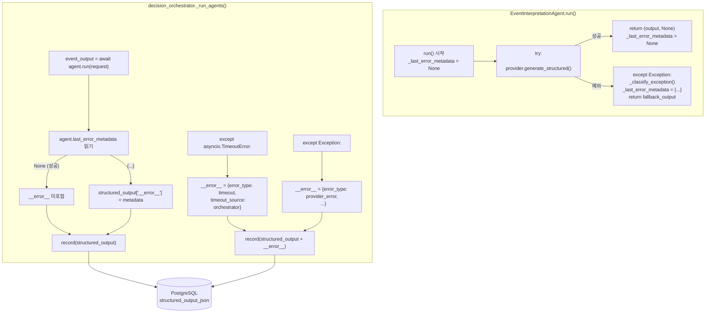

# EI ProviderError Failure Metadata 저장/노출 설계 v2

## 1. 문제 정의

현재 Event Interpretation Agent 실패 시 `degraded_reason`이 `"provider_error"`라는 **generic label**로만 저장. 운영자는 실제 원인이 timeout / HTTP 4xx/5xx / rate limit (429) / JSON decode failure / schema parse failure 인지 **DB/API 기준으로 구분 불가**.

## 2. 설계 원칙

1. **DB 마이그레이션 불필요** — 기존 `trading.agent_runs.structured_output_json` (JSONB) 컬럼 활용
2. **기존 Entity/API/Schema 변경 불필요** — `AgentRunEntity`, `AgentRunResponse`, `EventInterpretationOutput` 그대로 사용 (하위 호환성 100%)
3. **저장 위치**: `structured_output_json["__error__"]` 키 (기존 run에는 이 키가 없으므로 완벽한 backward compatibility)
4. **저장 금지 정보**: API key, 전체 prompt, 전체 raw response (`raw_content`)
5. **성공 run 계약**: 성공 경로에서는 `__error__` 키가 절대 `structured_output_json`에 포함되지 않음. `__error__`는 실패한 run에서만 존재
6. **기존 degraded_reason 값 유지**: `aggregate_view.degraded_reason`은 `"timeout"` / `"provider_error"` / `"self_contradiction_corrected"` 그대로 유지. `__error__`는 보충 메타데이터

## 3. 저장 구조 (`structured_output_json["__error__"]`)

### 최상위 구조

```json
{
  "error_type": "timeout",
  "error_message": "read timed out after 30s",
  "http_status": null,
  "retryable": true,
  "timeout_source": "provider_client"
}
```

### 필드 상세

| 필드 | 타입 | 필수 | 설명 |
|------|------|------|------|
| `error_type` | `str` | ✅ | `"timeout"` \| `"http_error"` \| `"parse_failure"` \| `"provider_error"` |
| `error_message` | `str` | ✅ | 사람이 읽을 수 있는 메시지 (API key, 전체 prompt **제외**) |
| `http_status` | `int \| null` | ✅ | HTTP 4xx/5xx 상태 코드 (http_error인 경우). 429 포함. 그 외 `null` |
| `retryable` | `bool \| null` | ✅ | 재시도 가능 여부. `null` = 판단 불가 |
| `timeout_source` | `str \| null` | ✅ | timeout 발생 위치. `"orchestrator"` \| `"provider_client"` \| `null` |

### `error_type` 분류 기준

| 예외 타입 | `error_type` | `http_status` | `retryable` | `timeout_source` |
|-----------|-------------|---------------|-------------|-------------------|
| `httpx.TimeoutException` | `"timeout"` | `null` | `true` | `"provider_client"` |
| `httpx.HTTPStatusError` (429) | `"http_error"` | `429` | `true` | `null` |
| `httpx.HTTPStatusError` (5xx) | `"http_error"` | `5xx` | `true` | `null` |
| `httpx.HTTPStatusError` (4xx≠429) | `"http_error"` | `4xx` | `false` | `null` |
| `json.JSONDecodeError` | `"parse_failure"` | `null` | `false` | `null` |
| `TypeError` / `ValueError` | `"parse_failure"` | `null` | `false` | `null` |
| 기타 `Exception` | `"provider_error"` | `null` | `null` | `null` |
| `asyncio.TimeoutError` (orchestrator) | `"timeout"` | `null` | `true` | `"orchestrator"` |
| Subprocess/Unexpected (orchestrator) | `"provider_error"` | `null` | `null` | `null` |

## 4. 데이터 흐름



### Contract: `_last_error_metadata` 생명주기

```
┌─────────────────────────────────────────────────────────────────┐
│ Contract for `EventInterpretationAgent._last_error_metadata`    │
│                                                                 │
│ 1. Reset to `None` at the START of every `run()` call          │
│    → 이전 호출의 error metadata가 새 호출로 누출되지 않음       │
│ 2. Set to a dict ONLY when an exception is caught inside run() │
│ 3. Caller MUST read this property immediately after run()      │
│    returns, within the same async task, before any subsequent   │
│    call to run() on the same instance.                          │
│ 4. NOT thread-safe (single-threaded async context only).        │
│ 5. 성공 경로: run() 정상 종료 → _last_error_metadata = None    │
│    → __error__가 structured_output_json에 저장되지 않음         │
└─────────────────────────────────────────────────────────────────┘
```

## 5. 변경 대상 파일

### 5.1 `src/agent_trading/services/ai_agents/event_interpretation.py`

**변경 사항**:
1. `import sys, httpx` 추가
2. `_classify_exception() -> dict[str, object]` 모듈 레벨 함수 추가 (예외 타입별 분류 + retryable 계산)
3. `EventInterpretationAgent.__init__()`: `self._last_error_metadata: dict[str, object] | None = None`
4. `EventInterpretationAgent.last_error_metadata` property 추가 (읽기 전용, contract docstring 포함)
5. `run()` 메서드 시작: `self._last_error_metadata = None`
6. `except Exception` 블록: `self._last_error_metadata = _classify_exception()` 저장

### 5.2 `src/agent_trading/services/decision_orchestrator.py`

**변경 사항**:
1. `_run_agents()` 메서드 — EI 블록 (line 1298-1355):
   - `ei_error_metadata: dict[str, object] | None = None` 변수 추가
   - **성공 경로**: `ei_error_metadata = self._event_interpretation_agent.last_error_metadata` 읽기
   - **`asyncio.TimeoutError` 경로**: `ei_error_metadata = {"error_type": "timeout", "timeout_source": "orchestrator", "http_status": None, "retryable": True}` 구성
   - **`except Exception` 경로**: `ei_error_metadata = {"error_type": "provider_error", "error_message": str(e), "http_status": None, "retryable": None}` 구성
   - recorder 호출 전: `structured_output = _dataclass_to_dict(event_output)` 후 `ei_error_metadata`가 None이 아니면 `structured_output["__error__"] = ei_error_metadata`
   
2. `_run_agents_in_subprocess()` 메서드 — subprocess 실패 시 (line 1693-1715):
   - `_build_fallback_bundle()` 후 EI agent run record() 호출 시 `__error__` 포함
   - `error_metadata = {"error_type": "provider_error", "error_message": "Subprocess failed", "http_status": None, "retryable": None}`

### 5.3 `tests/services/ai_agents/test_agents.py`

**변경 사항** (신규 테스트 5개, 기존 테스트 수정 불필요):

| 테스트 | 시나리오 | 검증 |
|--------|---------|------|
| `test_ei_fallback_stores_error_metadata_on_provider_error` | `RuntimeError` | `_last_error_metadata.error_type == "provider_error"` |
| `test_ei_fallback_stores_error_metadata_on_parse_error` | `ValueError` | `_last_error_metadata.error_type == "parse_failure"` |
| `test_ei_fallback_stores_error_metadata_on_timeout` | `httpx.TimeoutException` | `_last_error_metadata.error_type == "timeout"`, `timeout_source == "provider_client"` |
| `test_ei_fallback_stores_error_metadata_on_http_error_429` | `httpx.HTTPStatusError(429)` | `_last_error_metadata.error_type == "http_error"`, `http_status == 429`, `retryable == True` |
| `test_ei_success_path_no_error_metadata` | 정상 provider 응답 | `_last_error_metadata is None` |

## 6. `_classify_exception()` 함수 상세

```python
def _classify_exception() -> dict[str, object]:
    """현재 예외 컨텍스트(sys.exc_info)에서 구조화된 에러 메타데이터 반환.
    
    Returns
    -------
    dict[str, object]
        절대 ``None``을 반환하지 않음. 항상 최소한 ``error_type``과
        ``error_message``를 포함한 dict를 반환.
        성공 경로에서 호출되지 않음 (``except`` 블록 내부에서만 호출).
    """
    import sys
    exc_type, exc_value, _ = sys.exc_info()
    if exc_type is None or exc_value is None:
        return {"error_type": "unknown", "error_message": "No exception info",
                "http_status": None, "retryable": None, "timeout_source": None}

    exc_msg = str(exc_value) or (exc_type.__name__)

    base = {"error_message": exc_msg, "timeout_source": None}

    if isinstance(exc_value, httpx.TimeoutException):
        return {**base, "error_type": "timeout", "http_status": None,
                "retryable": True, "timeout_source": "provider_client"}

    if isinstance(exc_value, httpx.HTTPStatusError):
        http_status = exc_value.response.status_code
        retryable: bool | None
        if http_status == 429:
            retryable = True   # rate limit — retry after backoff
        elif 500 <= http_status < 600:
            retryable = True   # server error — may be transient
        else:
            retryable = False  # client error — likely permanent
        return {**base, "error_type": "http_error", "http_status": http_status,
                "retryable": retryable}

    if isinstance(exc_value, json.JSONDecodeError):
        return {**base, "error_type": "parse_failure", "http_status": None,
                "retryable": False}

    if isinstance(exc_value, (TypeError, ValueError)):
        return {**base, "error_type": "parse_failure", "http_status": None,
                "retryable": False}

    return {**base, "error_type": "provider_error", "http_status": None,
            "retryable": None}
```

## 7. 변경 제외 대상

| 파일 | 이유 |
|------|------|
| `provider_client.py` | `generate_structured()`는 계속 예외를 발생시킴 (기존 동작 유지). 분류는 `event_interpretation.py`에서 `sys.exc_info()`로 수행 |
| `base.py` | `RawProviderResponse`, `AIProviderClient` 프로토콜 변경 불필요 |
| `schemas.py` | `EventInterpretationOutput`, `AggregateEventView` 변경 불필요 |
| `recorder.py` | `record()` 시그니처 변경 불필요. `structured_output` dict에 이미 `__error__` 포함 가능 |
| `entities.py` | `AgentRunEntity` 변경 불필요 |
| `api/schemas.py` | `AgentRunResponse` 변경 불필요 (자동 노출) |
| `api/routes/agent_runs.py` | 변경 불필요 |
| `repositories/postgres/agent_runs.py` | 변경 불필요 |
| `db/migrations/` | 변경 불필요 (JSONB 컬럼 활용) |

## 8. 검증 절차

1. **pytest**: 신규 테스트 5개 + 기존 테스트 전체 통과 확인
2. **Docker rebuild + restart**: `docker compose build snapshot-sync && docker compose up -d`
3. **/health 확인**: `/health` 엔드포인트 정상 응답
4. **EI 실패 유발 시나리오**: 의도적으로 provider 중단 → `structured_output_json["__error__"]` 저장 확인
5. **API 조회**: `GET /agent-runs/{id}` 응답에 `__error__` 포함 확인
6. **기존 run 호환성**: `__error__` 없는 기존 run도 정상 조회 확인

## 9. 리스크 및 고려사항

1. **`_last_error_metadata` 동시성**: 단일 async task에서 순차 호출 + `run()` 시작 시 `None` 리셋으로 안전
2. **Agent 인스턴스 재사용**: `run()` 시작 시 `_last_error_metadata = None` 리셋으로 이전 호출 오염 방지
3. **Subprocess 경로**: subprocess 실패 시 stderr 메시지 추출은 v1에서 제외. v1은 generic `__error__`만 설정
4. **메시지 크기**: `error_message`는 예외 메시지만 포함 (전체 prompt/response 제외) → JSONB 크기 영향 미미
5. **`httpx` import 추가**: `event_interpretation.py`에 `httpx` import 추가 필요 (현재 없음)
