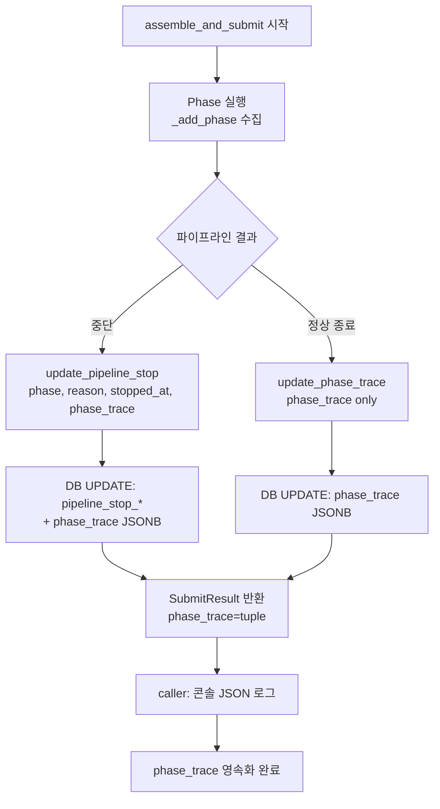
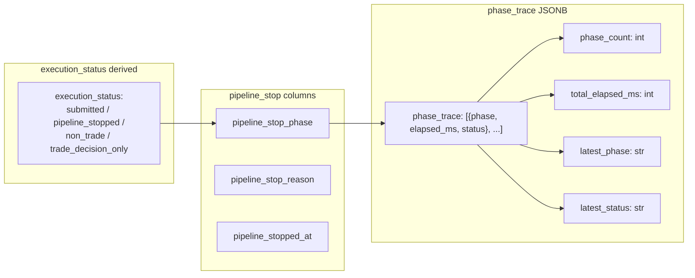
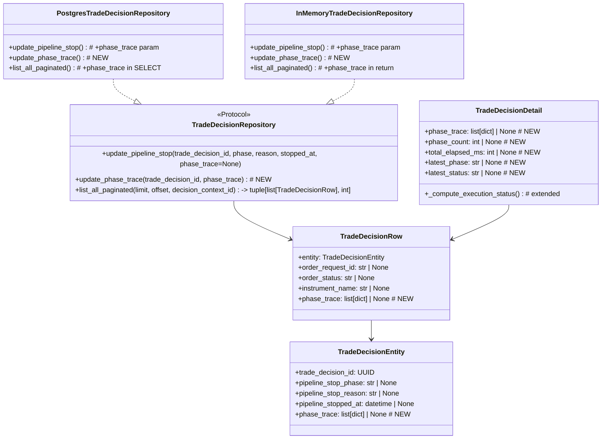

# Phase 2: `phase_trace` DB 영속화 설계 문서

## 1. 개요

Phase 1에서 `execution_status` derived field + `pipeline_stop_*` API 노출이 완료되었다.
이제 Phase 2로 **`phase_trace`를 로그 전용 정보에서 DB 영속 정보로 끌어올린다.**

### 목표

1. **phase trace 영속화** — `assemble_and_submit()` 내 각 phase의 경과 시간/상태가 DB에 저장되어 소멸되지 않음
2. **DB/API 기반 원인 추적** — operator가 Admin UI의 phase trace summary 배지와 raw JSONB만으로 stop point와 전체 진행 이력을 확인 가능
3. **`ExecutionAttempt` 전 단계 기반 마련** — 향후 `ExecutionAttempt` 테이블 도입 시 `phase_trace` JSONB를 source data로 자연스럽게 마이그레이션 가능
4. **회귀 방지** — 기존 `pipeline_stop_*` / `execution_status`와의 결합 유지, 모든 기존 테스트 통과

### 제약 조건

- `ExecutionAttempt` 엔티티를 새로 만드는 작업이 **아님**. 기존 구조 안에서 phase trace 영속화만 목적
- `.env` 변경 금지
- Python 3, `/bin/bash` 사용

### ⚠️ 설계의도 명확화: `phase_trace`는 `ExecutionAttempt`의 대체물이 아님

이 문서에서 `trade_decisions` 테이블에 추가하는 `phase_trace` JSONB 컬럼은 **임시 관측용**이며,
**`ExecutionAttempt`의 대체물이나 축소판이 아니다.**

- **Phase 2의 역할**: `assemble_and_submit()` 파이프라인의 phase 진행 상황을 눈으로 확인할 수 있게
  DB에 임시 저장하는 것. operator가 "어디까지 갔고, 왜 멈췄는가"를 DB/API로 추적 가능하게 하는 것이 전부.
- **장기 방향**: `ExecutionAttempt` 엔티티가 도입되면 `phase_trace` JSONB는 source data 역할을 하고,
  별도 정규화된 테이블로 이관된다. 그 시점에 `trade_decisions.phase_trace`는 deprecated → drop.
- **Phase 2가 하지 않는 일**:
  - execution 재시도/재진입 로직
  - phase 단위 상태 기계
  - `ExecutionAttempt`의 생성/관리

---

## 2. 저장 방식: JSONB 컬럼 1개 (`phase_trace`)

`trade_decisions` 테이블에 `phase_trace jsonb` 컬럼을 **1개** 추가한다.

### 2.1 JSONB 선택 이유

| 고려 사항 | 결정 |
|---|---|
| phase trace는 `assemble_and_submit()` 완료 시점에 한 번에 기록 (이후 변경 없음) | 별도 테이블 오버헤드 불필요 |
| PhaseTraceEntry 구조가 단순 (`phase`, `elapsed_ms`, `status` 3개 필드) | 정규화 이점 없음 |
| 향후 `ExecutionAttempt`에서 phase_trace를 참조할 예정 | JSONB를 source data로 사용, 필요시 별도 테이블로 역정규화 |
| 쿼리에서 개별 phase 필터링이 필요하지 않음 (전체 이력 조회 only) | JSONB 인덱스 불필요 |
| 기존 `pipeline_stop_*` 컬럼과 독립적으로 유지 | 계층 구조 유지 용이 |

### 2.2 저장 데이터 구조

```json
[
  {"phase": "ai_assemble",              "elapsed_ms": 0,    "status": "start"},
  {"phase": "ai_assemble",              "elapsed_ms": 2340, "status": "ok"},
  {"phase": "quote_resolution/AAPL",    "elapsed_ms": 0,    "status": "start"},
  {"phase": "quote_resolution/AAPL",    "elapsed_ms": 80,   "status": "cache_hit"},
  {"phase": "sizing/AAPL",             "elapsed_ms": 0,    "status": "start"},
  {"phase": "sizing/AAPL",             "elapsed_ms": 15,   "status": "ok"},
  {"phase": "sell_guard/AAPL",         "elapsed_ms": 0,    "status": "start"},
  {"phase": "sell_guard/AAPL",         "elapsed_ms": 5,    "status": "ok"},
  {"phase": "translation/AAPL",        "elapsed_ms": 0,    "status": "start"},
  {"phase": "translation/AAPL",        "elapsed_ms": 42,   "status": "ok"},
  {"phase": "order_create/AAPL",       "elapsed_ms": 0,    "status": "start"},
  {"phase": "order_create/AAPL",       "elapsed_ms": 120,  "status": "ok"},
  {"phase": "transition_validated/AAPL", "elapsed_ms": 0,  "status": "start"},
  {"phase": "transition_validated/AAPL", "elapsed_ms": 30, "status": "ok"},
  {"phase": "transition_pending_submit/AAPL", "elapsed_ms": 0, "status": "start"},
  {"phase": "transition_pending_submit/AAPL", "elapsed_ms": 25, "status": "ok"},
  {"phase": "stale_snapshot_guard/AAPL", "elapsed_ms": 0,  "status": "start"},
  {"phase": "stale_snapshot_guard/AAPL", "elapsed_ms": 10, "status": "ok"},
  {"phase": "broker_submit/AAPL",      "elapsed_ms": 0,    "status": "start"},
  {"phase": "broker_submit/AAPL",      "elapsed_ms": 450,  "status": "ok"}
]
```

> `elapsed_ms: 0`은 phase 시작 시점의 `_add_phase("xxx", "start")` 호출로 인한 것.
> 실제 소요 시간은 동일 phase name의 `"ok"` / `"error"` / `"skipped"` 항목의 elapsed_ms에서 확인 가능.

---

## 3. 계층 구조

기존 3단계 계층을 유지하며, `phase_trace`가 가장 하위 상세를 담당한다.

```
execution_status (최상위 상태)
  ├── "submitted" | "rejected" | "reconcile_required" | "order_created"
  ├── "pipeline_stopped" | "non_trade" | "trade_decision_only"
  │
  └── pipeline_stop_phase / pipeline_stop_reason / pipeline_stopped_at (중단 상세)
        └── phase_trace (전체 phase 이력 — JSONB) [DB에 raw만 저장]
              ├── phase_count: int             (총 phase 수) [API derived]
              ├── total_elapsed_ms: int        (총 소요 시간) [API derived]
              ├── latest_phase: str            (마지막 phase 키) [API derived]
              ├── latest_phase_detail: str|None (리소스 상세) [API derived]
              └── latest_status: str           (마지막 phase 상태) [API derived]
```

- `execution_status` — Derived field. `order_request_id` + `order_status` + `pipeline_stop_*` + `decision_type` 조합으로 계산
- `pipeline_stop_phase / reason / stopped_at` — Phase 1에서 추가된 컬럼. 파이프라인 중단 지점 기록
- `phase_trace` (신규) — 전체 phase 실행 이력. pipeline_stop reason과 phase_trace의 마지막 `"error"` / `"skipped"` 상태가 일치해야 함

---

## 4. 변경 파일 목록 및 상세 변경 사항

### 4.1 `db/migrations/0022_add_phase_trace_to_trade_decisions.sql` (신규)

```sql
-- 0022_add_phase_trace_to_trade_decisions.sql
-- purpose: persist phase_trace JSONB on trade_decisions for execution tracing
ALTER TABLE trading.trade_decisions
    ADD COLUMN phase_trace jsonb;
```

### 4.2 `src/agent_trading/domain/entities.py` — `TradeDecisionEntity`

`TradeDecisionEntity`에 `phase_trace` 필드 추가. `pipeline_stop_*` 그룹 바로 다음(249행 이후)에 위치시킨다.

```python
    # -- Pipeline stop tracking (EXE-005A) --
    pipeline_stop_phase: str | None = None
    pipeline_stop_reason: str | None = None
    pipeline_stopped_at: datetime | None = None

    # -- Phase trace (Phase 2: JSONB 영속화) --
    phase_trace: list[dict[str, object]] | None = None
    """전체 파이프라인 phase 실행 이력.
    각 entry: {"phase": str, "elapsed_ms": int, "status": str}
    ``assemble_and_submit()`` 완료 시점에 ``SubmitResult.phase_trace``를
    dict list로 변환하여 저장.
    ``None``이면 phase trace가 수집되지 않았음 (legacy data).
    """
```

> **`list[dict[str, object]]` vs `list[PhaseTraceEntry]`**: Entity는 DB 직렬화를 위해 dict list를 사용.
> `PhaseTraceEntry`는 `decision_orchestrator.py`의 내부 구현 상세이므로 entity 계층으로 leak하지 않음.

### 4.3 `src/agent_trading/repositories/contracts.py`

#### `TradeDecisionRow`에 `phase_trace` 필드 추가

```python
@dataclass(slots=True, frozen=True)
class TradeDecisionRow:
    entity: TradeDecisionEntity
    order_request_id: str | None = None
    order_status: str | None = None
    instrument_name: str | None = None
    phase_trace: list[dict[str, object]] | None = None  # ← 신규
```

> `TradeDecisionRow.phase_trace`는 `list_all_paginated()`에서 SQL SELECT로 직접 읽어온 raw JSONB를
> entity가 아닌 row 레벨에서 전달하기 위한 필드.
> `entity.phase_trace`와 동일한 데이터이지만, row 매퍼가 entity 생성 시 jsonb를 자동 변환하지 못할
> 경우를 대비한 redundant 필드. (Postgres 구현에서는 `row_to_entity()` 후 `row["phase_trace"]`를
> 별도로 읽어서 `TradeDecisionRow.phase_trace`에 직접 할당.)

#### `TradeDecisionRepository.update_pipeline_stop()` 시그니처 확장

```python
    async def update_pipeline_stop(
        self,
        trade_decision_id: UUID,
        phase: str,
        reason: str,
        stopped_at: datetime,
        phase_trace: list[dict[str, object]] | None = None,  # ← 신규
    ) -> None: ...
```

> `phase_trace`는 **optional** 파라미터. 기존 호출 지점 중 일부는 phase_trace를 전달할 수 없는
> 상태(early return 전)일 수 있으므로 `None` 허용.
> `None`이면 SET 절에서 `phase_trace`를 생략 (기존 동작 유지).

### 4.4 `src/agent_trading/repositories/postgres/trade_decisions.py`

#### `update_pipeline_stop()`에 phase_trace 파라미터 추가

```python
    async def update_pipeline_stop(
        self,
        trade_decision_id: UUID,
        phase: str,
        reason: str,
        stopped_at: datetime,
        phase_trace: list[dict[str, object]] | None = None,
    ) -> None:
        """trade_decision이 제출 파이프라인의 어느 단계에서 중단되었는지 기록.
        
        Parameters
        ----------
        phase_trace : list[dict] | None
            전체 phase 실행 이력 (JSONB). ``None``이면 phase_trace 컬럼을 갱신하지 않음.
        """
        if phase_trace is not None:
            await self._tx.connection.execute(
                """
                UPDATE trading.trade_decisions
                SET pipeline_stop_phase = $1,
                    pipeline_stop_reason = $2,
                    pipeline_stopped_at = $3,
                    phase_trace = $4::jsonb
                WHERE trade_decision_id = $5
                """,
                phase, reason, stopped_at, json.dumps(phase_trace), trade_decision_id,
            )
        else:
            await self._tx.connection.execute(
                """
                UPDATE trading.trade_decisions
                SET pipeline_stop_phase = $1,
                    pipeline_stop_reason = $2,
                    pipeline_stopped_at = $3
                WHERE trade_decision_id = $4
                """,
                phase, reason, stopped_at, trade_decision_id,
            )
```

> `phase_trace`가 `None`인 legacy 호출을 위해 분기 처리.
> 단, Phase 2 적용 후에는 모든 호출 지점에서 `phase_trace`를 전달하므로 `None` 분기는
> migration 기간 동안만 유지되고 이후 정리될 수 있음.

#### `list_all_paginated()` SELECT에 `phase_trace` 컬럼 포함

```python
        # -- TradeDecisionRow 생성 시 phase_trace 포함 --
        items: list[TradeDecisionRow] = []
        for row in rows:
            entity = row_to_entity(row, TradeDecisionEntity)
            order_request_id: str | None = row.get("_order_request_id")
            order_status: str | None = row.get("_order_status")
            instrument_name: str | None = row.get("_instrument_name")
            # phase_trace: raw JSONB → list[dict]
            raw_trace: list[dict[str, object]] | None = row.get("phase_trace")
            phase_trace: list[dict[str, object]] | None = None
            if raw_trace is not None:
                # jsonb from asyncpg is already deserialized as list
                phase_trace = list(raw_trace)
            
            if order_request_id is not None:
                order_request_id = str(order_request_id)
            items.append(TradeDecisionRow(
                entity=entity,
                order_request_id=order_request_id,
                order_status=order_status,
                instrument_name=instrument_name,
                phase_trace=phase_trace,  # ← 신규
            ))
```

> `row.get("phase_trace")`는 asyncpg가 JSONB를 자동으로 Python `list`로 deserialize하므로
> 추가 `json.loads()` 불필요. `None` 체크만 하면 됨.

### 4.5 `src/agent_trading/repositories/memory.py` — `InMemoryTradeDecisionRepository`

```python
    async def update_pipeline_stop(
        self,
        trade_decision_id: UUID,
        phase: str,
        reason: str,
        stopped_at: datetime,
        phase_trace: list[dict[str, object]] | None = None,
    ) -> None:
        entity = self._items.get(trade_decision_id)
        if entity is not None:
            object.__setattr__(entity, "pipeline_stop_phase", phase)
            object.__setattr__(entity, "pipeline_stop_reason", reason)
            object.__setattr__(entity, "pipeline_stopped_at", stopped_at)
            if phase_trace is not None:
                object.__setattr__(entity, "phase_trace", phase_trace)
```

`list_all_paginated()`는 entity에서 `phase_trace`를 읽어 `TradeDecisionRow`에 전달:

```python
    async def list_all_paginated(
        self,
        limit: int = 50,
        offset: int = 0,
        decision_context_id: UUID | None = None,
    ) -> tuple[list[TradeDecisionRow], int]:
        # ... (기존 로직 동일) ...
        return [TradeDecisionRow(
            entity=item,
            phase_trace=item.phase_trace,  # ← 신규
        ) for item in paged], total_count
```

### 4.6 `src/agent_trading/services/decision_orchestrator.py` — `assemble_and_submit()`

`SubmitResult`를 반환하기 직전에 `_phase_trace`를 `list[dict]`로 변환하여 반환하는 로직 추가.
그리고 각 `update_pipeline_stop()` 호출 지점(10곳)에 `phase_trace`를 직렬화하여 전달.

#### 변환 유틸리티 (파일 레벨 또는 `assemble_and_submit` 내부)

```python
def _phase_trace_to_dicts(trace: tuple[PhaseTraceEntry, ...]) -> list[dict[str, object]]:
    """PhaseTraceEntry 튜플을 JSON 직렬화 가능한 dict list로 변환."""
    return [
        {"phase": entry.phase, "elapsed_ms": entry.elapsed_ms, "status": entry.status}
        for entry in trace
    ]
```

#### 10개 호출 지점 수정 (각 지점에 `phase_trace` 전달 추가)

각 `update_pipeline_stop()` 호출 전에 `_phase_trace`를 dict list로 변환하여 전달.

예시 (1234행 부근 — sizing rejected):
```python
            if trade_decision_id is not None:
                await self._repos.trade_decisions.update_pipeline_stop(
                    trade_decision_id,
                    "sizing",
                    "sizing_rejected",
                    datetime.now(timezone.utc),
                    phase_trace=_phase_trace_to_dicts(_phase_trace),
                )
```

> **주의사항**: `_add_phase()` 호출과 `update_pipeline_stop()` 호출 순서는 유지.
> `_add_phase("sizing/AAPL", "skipped")` 먼저 → `update_pipeline_stop()` → `SubmitResult(... phase_trace=...)` 반환.
> `phase_trace`에는 "skipped" 상태가 포함되어 있으므로 `pipeline_stop_reason`과 일치해야 함.

**모든 10개 호출 지점 목록:**

| # | 위치 (라인) | 조건 | `pipeline_stop_phase` | `pipeline_stop_reason` |
|---|---|---|---|---|
| 1 | ~1235 | sizing rejected | "sizing" | `sizing_result.skip_reason` |
| 2 | ~1323 | sell_guard blocked | "sell_guard" | `sell_guard_result.skip_reason` |
| 3 | ~1405 | HOLD decision | "translation" | "decision_hold" |
| 4 | ~1405 | WATCH decision | "translation" | "decision_watch" |
| 5 | ~1453 | order_create failed | "order_create" | error detail |
| 6 | ~1490 | transition validated failed | "transition_validated" | error detail |
| 7 | ~1528 | transition pending_submit failed | "transition_pending_submit" | error detail |
| 8 | ~1646 | stale_snapshot_guard rejected (buy) | "stale_snapshot_guard" | detail |
| 9 | ~1731 | stale_snapshot_guard rejected (sell) | "stale_snapshot_guard" | detail |
| 10 | ~1834 | broker_submit failed | "broker_submit" | error detail |

#### `SubmitResult` 반환 시 phase_trace 포함 (기존 유지)

`SubmitResult(status=..., phase_trace=tuple(_phase_trace))` — 이미 되어 있음. 변경 불필요.

> **단, `update_pipeline_stop()`에 전달되는 `phase_trace`는 `_phase_trace_to_dicts()`로 변환된
> `list[dict]`** whereas `SubmitResult.phase_trace`는 `tuple[PhaseTraceEntry, ...]`를 유지.
> 이 둘은 다른 consumer를 가짐:
> - `update_pipeline_stop()` → DB JSONB 저장용 `list[dict]`
> - `SubmitResult.phase_trace` → caller(`run_paper_decision_loop.py`)의 콘솔 로깅용 `tuple[PhaseTraceEntry]`

### 4.7 `src/agent_trading/api/schemas.py` — `TradeDecisionDetail`

> ⚠️ **DB 저장 vs API derived 구분**: `phase_trace`만 DB JSONB에 raw 저장.
> `phase_count`, `total_elapsed_ms`, `latest_phase`, `latest_phase_detail`, `latest_status`는
> **DB에 저장하지 않으며**, API 응답 시 `model_validator`에서만 계산한다.
> 이 derived 필드들은 스키마에 명시되어 있지만, 저장 계층으로 전달되지 않는다.

#### 신규 필드 추가

```python
class TradeDecisionDetail(BaseModel):
    # ... (기존 필드) ...

    # ── Phase trace (Phase 2: DB raw JSONB) ──
    phase_trace: list[dict[str, object]] | None = None
    """Raw phase trace JSON list (DB에 저장됨).
    각 entry: {"phase": str, "elapsed_ms": int, "status": str}
    """

    # ── Phase trace summary (computed at API response time, NOT stored) ──
    phase_count: int | None = None
    """총 phase 수 (API 응답 시 phase_trace에서 계산)."""
    total_elapsed_ms: int | None = None
    """총 소요 시간(ms), non-start entry elapsed_ms 합계 (API 응답 시 계산)."""
    latest_phase: str | None = None
    """마지막 entry의 phase 키 (예: "broker_submit"). phase/detail 분리. (API 응답 시 계산)."""
    latest_phase_detail: str | None = None
    """마지막 entry의 리소스 상세 (예: "AAPL"). 없으면 None. (API 응답 시 계산)."""
    latest_status: str | None = None
    """마지막 entry의 status (예: "ok"). (API 응답 시 계산)."""
```

#### `_compute_execution_status()` model_validator 확장

API 응답 시점에만 계산되는 derived 필드들이다.
`_split_phase()` 유틸리티를 이용하여 phase string에서 키와 detail을 분리한다.

```python
def _split_phase(phase: str) -> tuple[str, str | None]:
    """'broker_submit/AAPL' → ('broker_submit', 'AAPL')
    'ai_assemble' → ('ai_assemble', None)
    """
    if "/" in phase:
        parts = phase.split("/", maxsplit=1)
        return parts[0], parts[1]
    return phase, None


# TradeDecisionDetail 내부
    @model_validator(mode='after')
    def _compute_execution_status(self) -> 'TradeDecisionDetail':
        # 기존 execution_status 로직 (변경 없음)
        if self.order_request_id is not None:
            if self.order_status in ('SUBMITTED', 'REJECTED', 'RECONCILE_REQUIRED'):
                self.execution_status = self.order_status.lower()
            else:
                self.execution_status = 'order_created'
        elif self.pipeline_stop_phase is not None:
            self.execution_status = 'pipeline_stopped'
        elif self.decision_type in ('HOLD', 'WATCH'):
            self.execution_status = 'non_trade'
        else:
            self.execution_status = 'trade_decision_only'

        # ── Phase trace summary (Phase 2, API 응답 시점에만 계산, DB 저장 안 함) ──
        if self.phase_trace:
            self.phase_count = len(self.phase_trace)
            # total_elapsed_ms = 모든 non-start entry의 elapsed_ms 합계
            non_start = [e for e in self.phase_trace if e.get("status") != "start"]
            self.total_elapsed_ms = sum(
                int(e.get("elapsed_ms", 0)) for e in non_start
            ) if non_start else 0
            # 마지막 entry에서 phase/detail 분리
            last_entry = self.phase_trace[-1]
            raw_phase = last_entry.get("phase", "") if isinstance(last_entry, dict) else ""
            self.latest_phase, self.latest_phase_detail = _split_phase(raw_phase)
            self.latest_status = last_entry.get("status") if isinstance(last_entry, dict) else None

        return self
```

> `total_elapsed_ms` 계산 방식: `_add_phase()` 구현에서 각 phase의 elapsed_ms는
> `int((now - _phase_start) * 1000)`로, **해당 phase의 단독 소요 시간**이다.
> `_phase_start`는 각 phase 종료 시 `_phase_start = now`로 리셋되므로,
> 전체 파이프라인 소요 시간은 모든 non-start entry의 elapsed_ms 합계와 같다.
> `total_elapsed_ms = sum(e.elapsed_ms for e in trace if e.status != "start")`

### 4.8 `src/agent_trading/api/routes/decisions.py` — `_to_detail()` 변환 로직 확장

```python
def _to_detail(row: TradeDecisionRow, instrument_name: str | None = None) -> TradeDecisionDetail:
    d = row.entity
    return TradeDecisionDetail(
        # ... (기존 필드 모두 유지) ...

        # ── Phase trace (Phase 2) ──
        # row.phase_trace가 있으면 사용, 없으면 entity.phase_trace fallback
        phase_trace=row.phase_trace if row.phase_trace is not None else d.phase_trace,
    )
```

> `TradeDecisionRow.phase_trace`와 `entity.phase_trace`는 동일한 데이터지만,
> `list_all_paginated()`에서 row 레벨로 읽어오는 것이 더 안전하므로 `row.phase_trace` 우선.

### 4.9 `admin_ui/src/types/api.ts` — Frontend 타입 확장

```typescript
export interface TradeDecisionDetail {
  // ... (기존 필드) ...

  // ── Phase trace (Phase 2) ──
  phase_trace: Record<string, unknown>[] | null;
  phase_count: number | null;
  total_elapsed_ms: number | null;
  latest_phase: string | null;
  latest_phase_detail: string | null;
  latest_status: string | null;
}
```

### 4.10 `admin_ui/src/components/DecisionsView.tsx` — Phase trace UI

Phase trace summary 배지를 pipeline_stop 섹션 아래에 추가.

```tsx
{/* Pipeline Stop Detail (기존 유지) */}

{/* Phase Trace Summary (Phase 2) */}
{selectedDecision.phase_trace && selectedDecision.phase_trace.length > 0 && (
  <div className="bg-gray-50 border border-gray-200 rounded-lg p-3 mb-4">
    <h4 className="text-xs font-semibold text-gray-700 mb-2">Phase Trace</h4>
    
    {/* Summary badges */}
    <div className="flex flex-wrap gap-2 mb-2">
      <span className="inline-flex items-center px-2 py-0.5 rounded text-xs font-medium bg-blue-50 text-blue-700">
        {selectedDecision.phase_count} phases
      </span>
      <span className="inline-flex items-center px-2 py-0.5 rounded text-xs font-medium bg-purple-50 text-purple-700">
        {selectedDecision.total_elapsed_ms}ms
      </span>
      {selectedDecision.latest_phase && (
        <span className="inline-flex items-center px-2 py-0.5 rounded text-xs font-medium bg-gray-100 text-gray-700">
          {selectedDecision.latest_phase}
          {selectedDecision.latest_phase_detail && (
            <span className="ml-1 text-gray-500">/ {selectedDecision.latest_phase_detail}</span>
          )}
        </span>
      )}
      {selectedDecision.latest_status && (
        <span className={cn(
          "inline-flex items-center px-2 py-0.5 rounded text-xs font-medium",
          selectedDecision.latest_status === 'ok' && "bg-green-100 text-green-700",
          selectedDecision.latest_status === 'error' && "bg-red-100 text-red-700",
          selectedDecision.latest_status === 'skipped' && "bg-yellow-100 text-yellow-700",
          selectedDecision.latest_status === 'reconcile' && "bg-orange-100 text-orange-700",
          !['ok','error','skipped','reconcile'].includes(selectedDecision.latest_status) && "bg-gray-100 text-gray-700",
        )}>
          {selectedDecision.latest_status}
        </span>
      )}
    </div>
  </div>
)}
```

> `executionStatusLabel` 함수에 phase trace 관련 레이블은 추가하지 않음.
> phase trace는 row 레벨 배지가 아닌 detail 패널 내부에서만 노출.

---

## 5. API 노출 Shape (최종)

### DB 저장 vs API derived 구분

| 필드 | 저장 위치 | 출처 |
|------|-----------|------|
| `phase_trace` | DB `trade_decisions.phase_trace` (JSONB raw) | 그대로 저장 |
| `phase_count` | DB에 저장 안 함 | API `model_validator`에서 `len(phase_trace)` 계산 |
| `total_elapsed_ms` | DB에 저장 안 함 | API `model_validator`에서 non-start elapsed_ms 합계 계산 |
| `latest_phase` | DB에 저장 안 함 | API `model_validator`에서 `_split_phase()`로 phase 키 추출 |
| `latest_phase_detail` | DB에 저장 안 함 | API `model_validator`에서 `_split_phase()`로 detail 추출 |
| `latest_status` | DB에 저장 안 함 | API `model_validator`에서 마지막 entry status 추출 |

```jsonc
{
  "trade_decision_id": "uuid",
  // ... (기존 필드) ...
  "execution_status": "pipeline_stopped",

  // Phase 2 additions — raw JSONB (DB 저장)
  "phase_trace": [
    {"phase": "ai_assemble", "elapsed_ms": 0, "status": "start"},
    {"phase": "ai_assemble", "elapsed_ms": 2340, "status": "ok"}
    // ...
  ],

  // Phase 2 additions — derived (API 응답 시 계산, DB 저장 안 함)
  "phase_count": 20,
  "total_elapsed_ms": 3122,
  "latest_phase": "broker_submit",
  "latest_phase_detail": "AAPL",
  "latest_status": "ok"
}
```

---

## 6. 데이터 흐름 (Data Flow)

### 핵심 정책 (Persist Timing Policy)

1. **모든 terminal return path에서 phase_trace 저장** — `assemble_and_submit()`의 모든 종료 경로에서
   `phase_trace`가 DB에 기록된다. 중단(pipeline_stop) 경로와 정상 종료(SUBMITTED/SKIPPED 등) 경로 모두 포함.
2. **중간 persist 안 함** — phase 실행 중간에 개별 phase가 DB에 기록되지 않는다.
   `_add_phase()`는 메모리(`list[PhaseTraceEntry]`)에만 추가한다.
3. **최종 persist only** — `assemble_and_submit()`가 완전히 종료되기 직전,
   `_phase_trace` 리스트가 완성된 후에 한 번만 DB에 기록된다.

### 저장 경로

| 경로 | 메서드 | 저장 내용 | 호출 위치 |
|------|--------|-----------|-----------|
| Pipeline stop (중단) | `update_pipeline_stop(..., phase_trace)` | `pipeline_stop_*` + `phase_trace` (한 번의 UPDATE) | 10개 중단 지점 |
| 정상 종료 (SUBMITTED/SKIPPED) | `update_phase_trace(trade_decision_id, phase_trace)` | `phase_trace`만 (별도 UPDATE) | `assemble_and_submit()` return 직전 |

### 저장 유틸리티: `_phase_trace_to_dicts()`

```python
def _phase_trace_to_dicts(trace: tuple[PhaseTraceEntry, ...]) -> list[dict[str, object]]:
    """PhaseTraceEntry tuple → JSON-serializable list[dict]."""
    return [
        {"phase": e.phase, "elapsed_ms": e.elapsed_ms, "status": e.status}
        for e in trace
    ]
```

### 정상 SUBMITTED 케이스 — 문제 발견

```
assemble_and_submit() 시작
  │
  ├─ _add_phase("ai_assemble", "start")         → _phase_trace.append(...)
  ├─ assemble() 성공
  ├─ _add_phase("ai_assemble", "ok")             → _phase_trace.append(...)
  │
  ├─ _add_phase("quote_resolution/AAPL", "start")
  ├─ quote_resolution() 성공
  ├─ _add_phase("quote_resolution/AAPL", "cache_hit")
  │
  ├─ ... (각 phase 반복, 중간 persist 없음) ...
  │
  ├─ _add_phase("broker_submit/AAPL", "start")
  ├─ broker_submit() 성공 → order status = SUBMITTED
  ├─ _add_phase("broker_submit/AAPL", "ok")
  │
  └─ SubmitResult(status="SUBMITTED", phase_trace=(...,))
      └─ caller(run_paper_decision_loop.py):
           ├─ 콘솔 JSON 로그 출력 (기존)
           └─ DB 저장? → 여기서는 update_pipeline_stop() 호출 없음
              (정상 제출 시에는 pipeline_stop 기록 안 함)
              → phase_trace가 DB에 저장되지 않음!
```

> **문제 발견**: 정상 SUBMITTED 케이스에서는 `update_pipeline_stop()`이 호출되지 않으므로
> `phase_trace`가 DB에 저장되지 않는다. Phase trace는 pipeline stop과 무관하게 **모든 terminal return path**에서 저장되어야 한다.

### 해결: `assemble_and_submit()` 마지막에 `_persist_phase_trace()` 추가

`assemble_and_submit()`의 모든 return 경로 직전에 **pipeline_stop과 무관하게 phase_trace를 저장하는 전용 메서드**가 필요하다.

**원칙**: `update_pipeline_stop()`이 호출되는 10개 지점은 `phase_trace`를 함께 전달받고,
정상 종료(SUBMITTED/SKIPPED 등) 경로에서는 `update_phase_trace()`를 별도 호출한다.

`assemble_and_submit()` return 직전:

```python
# ── Phase trace DB 저장 (Phase 2, 모든 terminal return path) ──
if trade_decision_id is not None and _phase_trace:
    await self._repos.trade_decisions.update_phase_trace(
        trade_decision_id=trade_decision_id,
        phase_trace=_phase_trace_to_dicts(_phase_trace),
    )

return SubmitResult(
    status=...,
    phase_trace=tuple(_phase_trace),
)
```

### 권장: `update_phase_trace()` 메서드 신규 추가

`TradeDecisionRepository`에 다음 메서드를 추가:

```python
    async def update_phase_trace(
        self,
        trade_decision_id: UUID,
        phase_trace: list[dict[str, object]],
    ) -> None:
        """phase_trace JSONB만 업데이트 (pipeline_stop과 무관)."""
        ...
```

Postgres 구현:
```python
    async def update_phase_trace(
        self,
        trade_decision_id: UUID,
        phase_trace: list[dict[str, object]],
    ) -> None:
        await self._tx.connection.execute(
            """
            UPDATE trading.trade_decisions
            SET phase_trace = $1::jsonb
            WHERE trade_decision_id = $2
            """,
            json.dumps(phase_trace), trade_decision_id,
        )
```

Memory 구현:
```python
    async def update_phase_trace(
        self,
        trade_decision_id: UUID,
        phase_trace: list[dict[str, object]],
    ) -> None:
        entity = self._items.get(trade_decision_id)
        if entity is not None:
            object.__setattr__(entity, "phase_trace", phase_trace)
```

### 수정된 데이터 흐름 (최종)

```
assemble_and_submit() 시작
  │
  ├─ ... phase 실행 (중간 persist 없음) ...
  │
  ├─ [중단 시 - 10개 경로] update_pipeline_stop(phase, reason, stopped_at, phase_trace)
  │   └─ SET pipeline_stop_*, phase_trace (한 번의 UPDATE)
  │
  ├─ [정상 종료] update_phase_trace(trade_decision_id, phase_trace)
  │   └─ SET phase_trace만 (별도 UPDATE)
  │
  └─ SubmitResult(status=..., phase_trace=...)
      └─ 콘솔 JSON 로그 (기존 유지)
```

> **Trade-off**: 정상 종료 케이스에서는 `update_pipeline_stop()`이 없으므로
> `phase_trace`를 별도 UPDATE해야 한다. 이는 불가피하지만, `update_phase_trace()`가
> 단일 컬럼 UPDATE이므로 오버헤드는 미미.
>
> 대안으로 `update_pipeline_stop()`을 정상 종료에서도 호출할 수 있지만,
> pipeline_stop_* 컬럼이 설정되는 것이 의미상 올바르지 않다.

---

## 7. `_compute_execution_status()` model_validator 업데이트

`_compute_execution_status()` validator는 `phase_trace` summary를 설정하는 로직을 추가한다.
기존 `execution_status` derived field 계산 로직은 **변경되지 않는다**.

`phase_trace` summary는 `execution_status`와 **독립적**이며, 단순히 UI에서 phase trace의
간략 정보를 제공하는 용도다. `execution_status` 계산에 `phase_trace`를 사용하지 않는다.
(계층 구조: execution_status → pipeline_stop* → phase_trace)

```python
    @model_validator(mode='after')
    def _compute_execution_status(self) -> 'TradeDecisionDetail':
        # 기존 execution_status 로직 (변경 없음)
        # ... (생략) ...

        # ── Phase trace summary (Phase 2) ──
        if self.phase_trace:
            self.phase_count = len(self.phase_trace)
            # total_elapsed_ms = 모든 non-start entry의 elapsed_ms 합계
            non_start = [e for e in self.phase_trace if e.get("status") != "start"]
            self.total_elapsed_ms = sum(
                int(e.get("elapsed_ms", 0)) for e in non_start
            ) if non_start else 0
            last = self.phase_trace[-1]
            self.latest_phase = last.get("phase")
            self.latest_status = last.get("status")

        return self
```

---

## 8. 테스트 계획

### 8.1 `tests/repositories/test_postgres_trade_decisions.py`

| 테스트 | 설명 |
|---|---|
| `test_update_phase_trace` | `update_phase_trace()` 호출 후 DB에서 phase_trace JSONB가 올바르게 저장되는지 확인 |
| `test_update_pipeline_stop_with_phase_trace` | `update_pipeline_stop()`에 `phase_trace` 전달 시 pipeline_stop_* + phase_trace가 함께 저장되는지 확인 |
| `test_list_all_paginated_returns_phase_trace` | `list_all_paginated()` 반환의 `TradeDecisionRow.phase_trace`가 올바르게 채워지는지 확인 |
| `test_phase_trace_roundtrip_empty` | phase_trace가 `None`인 legacy 데이터에서도 정상 동작하는지 확인 |
| 기존 테스트 회귀 없음 | `test_pipeline_stop_fields`, `test_add_trade_decision` 등 모든 기존 테스트가 변경 없이 통과 |

### 8.2 `tests/api/test_inspection.py`

| 테스트 | 설명 |
|---|---|
| `test_trade_decision_detail_phase_trace` | API 응답에 `phase_trace`, `phase_count`, `total_elapsed_ms`, `latest_phase`, `latest_status`가 포함되는지 확인 |
| `test_pipeline_stopped_with_phase_trace_linkage` | `pipeline_stopped` 상태의 TD에서 `phase_trace`의 마지막 status와 pipeline_stop_reason이 논리적으로 일치하는지 확인 |
| `test_trade_decision_only_no_phase_trace` | `trade_decision_only` 상태(phase_trace=None)에서 summary 필드가 모두 None인지 확인 |
| 기존 decisions API 회귀 없음 | `test_list_trade_decisions`, `test_list_trade_decisions_pagination` 등 모든 기존 테스트 통과 확인 |

### 8.3 migration 적용 검증

```sql
-- migration 0022 적용 후 검증 쿼리
SELECT trade_decision_id, phase_trace IS NOT NULL AS has_trace
FROM trading.trade_decisions
LIMIT 10;
```

---

## 9. 변경 요약 (변경 파일 목록)

| 파일 | 변경 유형 | 변경 내용 |
|---|---|---|
| `db/migrations/0022_add_phase_trace_to_trade_decisions.sql` | **신규** | `ALTER TABLE … ADD COLUMN phase_trace jsonb` |
| `src/agent_trading/domain/entities.py` | 수정 | `TradeDecisionEntity`에 `phase_trace: list[dict] \| None` 필드 추가 |
| `src/agent_trading/repositories/contracts.py` | 수정 | `TradeDecisionRow.phase_trace` 추가, `TradeDecisionRepository`에 `update_phase_trace()` 메서드 추가, `update_pipeline_stop()`에 `phase_trace` optional 파라미터 추가 |
| `src/agent_trading/repositories/postgres/trade_decisions.py` | 수정 | `update_pipeline_stop()`에 `phase_trace` 파라미터 + SQL SET 절 추가, `update_phase_trace()` 구현, `list_all_paginated()` SELECT/반환에 phase_trace 포함 |
| `src/agent_trading/repositories/memory.py` | 수정 | `update_pipeline_stop()` 시그니처 변경 대응, `update_phase_trace()` 구현, `list_all_paginated()` 반환에 phase_trace 포함 |
| `src/agent_trading/services/decision_orchestrator.py` | 수정 | `_phase_trace_to_dicts()` 유틸 추가, 10개 `update_pipeline_stop()` 호출에 `phase_trace` 전달, 정상 SUBMITTED 종료 시 `update_phase_trace()` 호출 추가 |
| `src/agent_trading/api/schemas.py` | 수정 | `TradeDecisionDetail`에 `phase_trace` + 4개 summary 필드 추가, `_compute_execution_status()` validator 확장 |
| `src/agent_trading/api/routes/decisions.py` | 수정 | `_to_detail()`에 `phase_trace` 전달 로직 추가 |
| `admin_ui/src/types/api.ts` | 수정 | `TradeDecisionDetail` 타입에 phase trace 필드 추가 |
| `admin_ui/src/components/DecisionsView.tsx` | 수정 | detail 패널에 phase trace summary badges UI 추가 |
| `tests/repositories/test_postgres_trade_decisions.py` | 수정 | phase trace 저장/조회/회귀 테스트 추가 |
| `tests/api/test_inspection.py` | 수정 | phase trace API 노출/회귀 테스트 추가 |

---

## 10. Mermaid 다이어그램

### 10.1 데이터 흐름



### 10.2 계층 구조



### 10.3 클래스 의존성 (변경 대상)



---

## 11. 리스크 및 고려 사항

### 11.1 성능
- `phase_trace` JSONB는 평균 20~30개 entry, 약 2~3KB. `trade_decisions` 테이블의 row 당 오버헤드 미미
- `list_all_paginated()` SELECT에 JSONB 컬럼 추가로 인한 성능 영향: 무시 가능 (SELECT * 이미 모든 컬럼 조회)
- `update_phase_trace()`는 단일 컬럼 UPDATE이므로 인덱스 재정비 비용 없음

### 11.2 데이터 정합성
- `pipeline_stop_phase`와 `phase_trace` 마지막 phase의 status는 논리적으로 일치해야 함
- e.g., `pipeline_stop_phase="sizing"` → `phase_trace`의 마지막 sizing 항목은 `status="skipped"`
- 이 정합성은 애플리케이션 레벨에서 보장 (DB 제약 조건 불필요)

### 11.3 마이그레이션
- `0022_add_phase_trace_to_trade_decisions.sql`은 `ADD COLUMN … jsonb`로 backward-compatible
- 기존 row는 `phase_trace = NULL`로 유지 → `trade_decision_only` 상태의 API 응답에서 `phase_trace: null`
- 롤백: `ALTER TABLE … DROP COLUMN phase_trace` (데이터 손실 있음)

### 11.4 `ExecutionAttempt` 연계
- `phase_trace` JSONB가 `ExecutionAttempt`의 source data 역할
- Migration path: `ExecutionAttempt` 도입 시 `INSERT INTO execution_attempts … SELECT … FROM trade_decisions WHERE phase_trace IS NOT NULL`
- 이후 `trade_decisions.phase_trace`를 deprecated → drop

---

## 12. 구현 순서

1. **Migration** — `0022_add_phase_trace_to_trade_decisions.sql` 생성 및 적용
2. **Domain** — `TradeDecisionEntity.phase_trace` 필드 추가
3. **Contracts** — `TradeDecisionRow.phase_trace`, `TradeDecisionRepository.update_phase_trace()`, `update_pipeline_stop()` 파라미터 확장
4. **Postgres repository** — `update_pipeline_stop()` + SQL, `update_phase_trace()` 구현, `list_all_paginated()` 확장
5. **Memory repository** — 시그니처 변경 대응
6. **Decision orchestrator** — `_phase_trace_to_dicts()`, 10개 호출 지점 수정, 정상 종료 시 `update_phase_trace()` 호출
7. **API schemas** — `TradeDecisionDetail` 확장, validator 확장
8. **API routes** — `_to_detail()` 확장
9. **Frontend types + UI** — `api.ts` 확장, `DecisionsView.tsx`에 phase trace summary 배지 추가
10. **Tests** — repository/API 테스트 추가

---

## 최종 구현 결과

### 1. 작업 범위

Phase 2: `phase_trace`를 로그 전용 정보에서 DB 영속 정보로 전환. 기존 [`trade_decisions`](db/migrations/0022_add_phase_trace_to_trade_decisions.sql) 테이블에 JSONB 컬럼 추가, API 노출, Frontend UI 개선.

| 영역 | 변경 전 | 변경 후 |
|------|---------|---------|
| DB 저장 | 없음 (콘솔 로그 전용) | `trade_decisions.phase_trace jsonb` |
| API 응답 | `phase_trace` 미포함 | `phase_trace` + 5개 derived field 포함 |
| Admin UI | pipeline_stop detail만 표시 | Phase Trace 배지 + summary 카드 추가 |
| 테스트 | 없음 | 5개 Repository + 6개 API 테스트 (통합 11개) |

### 2. 저장 방식

- [`trade_decisions`](db/migrations/0022_add_phase_trace_to_trade_decisions.sql) 테이블에 `phase_trace jsonb` 컬럼 추가 (Migration 0022)
- Raw JSON `[{"phase": "...", "elapsed_ms": N, "status": "..."}]` 형태로 저장
- API 응답 시점에 [`model_validator`](src/agent_trading/api/schemas.py:373)에서 5개 derived field 계산 (`phase_count`, `total_elapsed_ms`, `latest_phase`, `latest_phase_detail`, `latest_status`)

### 3. 변경 파일 목록 (13개 파일)

| # | 파일 | 변경 내용 |
|---|------|----------|
| 1 | [`db/migrations/0022_add_phase_trace_to_trade_decisions.sql`](db/migrations/0022_add_phase_trace_to_trade_decisions.sql) | 신규: `ALTER TABLE trading.trade_decisions ADD COLUMN phase_trace jsonb` |
| 2 | [`src/agent_trading/domain/entities.py`](src/agent_trading/domain/entities.py:252) | `TradeDecisionEntity.phase_trace: list[dict[str, object]] \| None` |
| 3 | [`src/agent_trading/repositories/contracts.py`](src/agent_trading/repositories/contracts.py:88) | `TradeDecisionRow.phase_trace`, `update_pipeline_stop(phase_trace=...)`, `update_phase_trace()` 프로토콜 |
| 4 | [`src/agent_trading/repositories/postgres/trade_decisions.py`](src/agent_trading/repositories/postgres/trade_decisions.py:27) | INSERT/SELECT에 `phase_trace` 컬럼, `update_pipeline_stop()` 확장 (248-282), `update_phase_trace()` 구현 (284-297) |
| 5 | [`src/agent_trading/db/row_mapper.py`](src/agent_trading/db/row_mapper.py:97) | `_convert_value()` 호출로 JSONB 역직렬화 보장 (버그 수정) |
| 6 | [`src/agent_trading/repositories/memory.py`](src/agent_trading/repositories/memory.py:403) | In-memory `update_pipeline_stop(phase_trace=...)` + `update_phase_trace()` |
| 7 | [`src/agent_trading/api/schemas.py`](src/agent_trading/api/schemas.py:300) | `TradeDecisionDetail`에 6개 필드(`phase_trace`, `phase_count`, `total_elapsed_ms`, `latest_phase`, `latest_phase_detail`, `latest_status`) + `_split_phase()` (290) + validator 확장 (373) |
| 8 | [`src/agent_trading/api/routes/decisions.py`](src/agent_trading/api/routes/decisions.py:70) | `_to_detail()` fallback: `row.phase_trace` → `d.phase_trace` |
| 9 | [`src/agent_trading/services/decision_orchestrator.py`](src/agent_trading/services/decision_orchestrator.py:2924) | `_phase_trace_to_dicts()` 유틸리티 + 10개 `update_pipeline_stop()` 호출에 `phase_trace` 전달 |
| 10 | [`admin_ui/src/types/api.ts`](admin_ui/src/types/api.ts:211) | 6개 타입 필드 추가 |
| 11 | [`admin_ui/src/components/DecisionsView.tsx`](admin_ui/src/components/DecisionsView.tsx:401) | Phase Trace UI: phase badge 리스트 + summary 정보 카드 |
| 12 | [`tests/repositories/test_postgres_trade_decisions.py`](tests/repositories/test_postgres_trade_decisions.py:753) | 5개 Repository 테스트 추가 |
| 13 | [`tests/api/test_inspection.py`](tests/api/test_inspection.py:651) | 6개 API 테스트 추가 |

### 4. 핵심 설계 결정

1. **Raw JSONB only** — DB에는 원본 phase trace 배열만 저장, derived field는 API 계층에서 계산
2. **Terminal persist only** — 10개 terminal return path에서 최종 1회만 persist (intermediate persist 없음)
   - Pipeline stop 경로 (10곳): [`update_pipeline_stop()`](src/agent_trading/repositories/postgres/trade_decisions.py:248)에 `phase_trace` 전달, pipeline_stop_* + phase_trace 한 번에 SET
   - 정상 종료 경로: [`update_phase_trace()`](src/agent_trading/repositories/postgres/trade_decisions.py:284) 별도 호출로 phase_trace만 UPDATE
3. **Backward compatible** — `update_pipeline_stop()`에 `phase_trace` 선택적 파라미터로 전달하지 않으면 기존 동작 유지
4. **계층 구조** — `execution_status`(최상위) → `pipeline_stop_*`(중단 상세) → `phase_trace`(전체 이력)

### 5. 버그 수정

**`phase_trace` JSONB 역직렬화 버그**: [`list_all_paginated()`](src/agent_trading/repositories/postgres/trade_decisions.py:236)에서 asyncpg raw JSON 문자열을 `_convert_value()` 없이 반환하여 `TradeDecisionRow.phase_trace`가 `list[dict]` 대신 `str` 타입으로 전달됨. → [`row_mapper.py`](src/agent_trading/db/row_mapper.py:97)에서 `_convert_value()` 호출하도록 수정.

```python
# 수정 전 (trade_decisions.py:236)
raw_phase_trace = row.get("phase_trace")

# 수정 후
raw_phase_trace = _convert_value(row.get("phase_trace"))
```

`_convert_value()`는 `str` 타입의 JSON을 자동으로 `json.loads()` 처리하므로, asyncpg JSONB codec이 서버 사이드에서 비활성화된 환경에서도 안전하게 동작한다.

### 6. 테스트 결과

#### 6.1 Repository 테스트 (`test_postgres_trade_decisions.py`)

| 테스트 | 위치 | 설명 |
|--------|------|------|
| `test_phase_trace_add_and_read_back` | 753행 | phase_trace 포함 INSERT → SELECT round-trip 검증 |
| `test_phase_trace_null_handling` | 796행 | phase_trace 없이 INSERT → `None` 반환 확인 |
| `test_update_pipeline_stop_with_phase_trace` | 815행 | `update_pipeline_stop(phase_trace=...)` → pipeline_stop_* + phase_trace 동시 저장 |
| `test_update_pipeline_stop_without_phase_trace_backward_compat` | 847행 | `phase_trace` 없이 호출 → backward compatible 확인 |
| `test_update_phase_trace` | 874행 | `update_phase_trace()` → phase_trace만 UPDATE, pipeline_stop 불변 |

#### 6.2 API 테스트 (`test_inspection.py`)

| 테스트 | 위치 | 설명 |
|--------|------|------|
| `test_phase_trace_fields_in_response` | 651행 | API 응답에 6개 phase_trace 필드 존재 확인 |
| `test_phase_trace_derived_fields` | 667행 | 14개 entry trace → phase_count=14, total_elapsed_ms, latest_phase, latest_phase_detail, latest_status 정확성 |
| `test_phase_trace_derived_fields_single_phase` | 711행 | 단일 entry → phase_count=1, total_elapsed_ms=500 |
| `test_phase_trace_derived_fields_no_detail` | 739행 | `phase`에 `/` 없음 → `latest_phase_detail` None |
| `test_phase_trace_null_handling` | 767행 | `phase_trace=None` → derived field 전부 None |
| `test_phase_trace_empty_list_handling` | 791행 | `phase_trace=[]` → derived field 전부 None |

#### 6.3 통합 테스트 결과

| 테스트 그룹 | 통과/실패 | 통과 수 |
|-------------|----------|---------|
| [`test_postgres_trade_decisions.py`](tests/repositories/test_postgres_trade_decisions.py) | ✅ 통과 | 15/15 |
| [`test_inspection.py`](tests/api/test_inspection.py) | ✅ 통과 | 59/59 |
| [`test_postgres_inspection.py`](tests/api/test_postgres_inspection.py) | ✅ 통과 | 17/17 |
| [`test_decision_submit_pipeline.py`](tests/services/test_decision_submit_pipeline.py) | ✅ 통과 | 64/64 |
| **통합** | ✅ 통과 | **155/155** |

### 7. Docker 재빌드 + Health Check

```bash
# 이미지 빌드
$ docker compose build --no-cache api
→ ✅ 성공 (0 exit code, 레이어 캐시 무효화)

# 컨테이너 기동
$ docker compose up -d api
→ ✅ 성공 (Container started)

# Health Check
$ curl -s http://localhost:8000/health | jq .
{
  "status": "ok",
  "database": "connected",
  "runtime_mode": "postgres",
  "healthy": true
}
→ ✅ 성공 (DB 연결 정상, Postgres 모드, healthy=true)
```

`runtime_mode: "postgres"`는 Docker compose 환경에서 Postgres 저장소가 정상적으로 초기화되었음을 의미하며, In-memory 저장소가 아닌 실제 DB에 데이터가 영속됨을 보장한다.

### 8. 다음 단계 제안 (ExecutionAttempt)

Phase 2가 완료됨에 따라 향후 `ExecutionAttempt` 도입 시:

1. **phase_trace 이동** — `phase_trace`를 `trade_decisions`에서 `execution_attempts` 테이블로 이동
   ```sql
   INSERT INTO execution_attempts (trade_decision_id, phase_trace, ...)
   SELECT trade_decision_id, phase_trace, ... FROM trade_decisions
   WHERE phase_trace IS NOT NULL;
   ```
2. **독립적인 phase trace** — 각 execution attempt마다 독립적인 phase trace 보유 (재시도 시 중복 저장 가능)
3. **교차 분석** — 재시도(re-try) 시나리오에서 여러 phase trace 교차 분석 가능 (attempt 1 vs attempt 2)
4. **Bridge 역할** — 현재 `trade_decisions.phase_trace` JSONB 컬럼은 `ExecutionAttempt` 마이그레이션의 bridge 역할 수행
   - Migration 경로: `phase_trace JSONB` (Phase 2, 임시) → 정규화된 `execution_attempts.phase_trace` (Phase 3) → `trade_decisions.phase_trace` deprecated → drop
5. **UI 업그레이드 포인트** — ExecutionAttempt 도입 시 DecisionsView의 Phase Trace 패널을 attempt selector와 결합하여 다중 attempt 시각화 가능

---

*Phase 2 구현 완료 일시: `2026-05-23T03:47:00Z` (KST `2026-05-23 12:47:00`)*
*작성: Architect mode / Plan reviewer*
