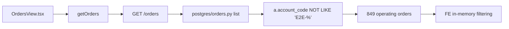
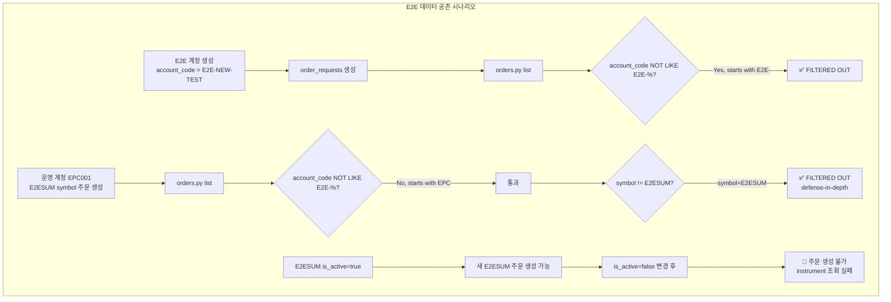

# Phase 4: Accounts/Orders 기본 노출 정상화 설계

## 1. 현황 분석 요약 (Sub Task 1~3 결과 기반)

### 1.1 DB 상태 (Phase 3 E2E 삭제 완료 후)

| 항목 | 상태 | 건수 |
|------|------|------|
| `accounts` | `EPC001-PAPER-ENTRYPOINT` only | 1 |
| `clients` | `EPC001`, `LOCK_TEST_f874f646` | 2 |
| `instruments` (E2ESUM) | `is_active=true`, 여전히 존재 | 1 (E2ESUM) |
| `order_requests` (E2E) | 전량 삭제됨 | 0 |
| `order_requests` (운영) | 실제 한국 주식 symbol | 849 |

### 1.2 AccountsView 현황 (Phase 2 — 이미 정상)

```mermaid
flowchart LR
    A[GET /clients/default] --> B{getDefaultClient}
    B -->|KIS_ACCOUNT_NO 매칭| C[EPC001 client]
    B -->|매칭 실패| D[allClients[0]]
    C --> E[GET /accounts?client_id=EPC001]
    D --> E
    E --> F[EPC001-PAPER-ENTRYPOINT only]
```

- E2E-SUMMARY-CLIENT가 DB에서 삭제되었으므로 `getDefaultClient()` → EPC001 정상 매핑
- **수정 불필요** ✅

### 1.3 OrdersView 현황



- `getOrders()` 호출 시 아무 파라미터 없이 `/orders` API 호출
- 서버 측 필터: `a.account_code NOT LIKE 'E2E-%'` (account_code 기반)
- FE 측 E2E 필터링 로직 **전무**
- **E2E orders가 0건이므로 현재는 정상** — but E2ESUM symbol로 운영 계좌에서 주문 생성 시 우회 가능

### 1.4 E2ESUM Instrument 위험 분석

| 항목 | 내용 |
|------|------|
| `instruments` 테이블 | `symbol='E2ESUM'`, `is_active=true` |
| `list_active_by_market()` | `symbol != 'E2ESUM'` — instruments API에서만 제외 |
| `orders.py list()` SQL | instruments 테이블을 JOIN하지 않음 → symbol 기반 필터 불가 |
| `_enrich_order_summary()` | symbol 조회는 SQL 이후 enrichment 단계에서 수행 |

**핵심 취약점**: 누군가 E2ESUM instrument_id로 EPC001-PAPER-ENTRYPOINT 계정에서 주문을 생성하면, 아래 두 필터를 모두 우회:

1. `a.account_code NOT LIKE 'E2E-%'` — account_code가 EPC001이므로 통과
2. `symbol != 'E2ESUM'` in instruments.py — orders API에는 적용되지 않음

---

## 2. 옵션 평가 및 최종 설계 결정

### 2.1 옵션 분석 매트릭스

| 옵션 | 저위험 | E2E 공존 | 데이터 보호 | 구현 복잡도 | 비고 |
|------|--------|----------|------------|------------|------|
| **A: E2ESUM deactivate** (`is_active=false`) | ✅ 높음 | ✅ | ✅ 원천 차단 | ★☆☆ (1문 UPDATE) | Primary fix |
| **B: Symbol 기반 필터 in orders.py** | ✅ 높음 | ✅ | ✅ SIEM 수준 | ★★☆ (JOIN+조건) | Defense-in-depth |
| **C: FE 측 E2E 필터 추가** | ✅ 높음 | ✅ | ❌ 우회 가능 | ★☆☆ (JS filter) | Not recommended alone |
| **D: API query parameter 추가** | ✅ 중간 | ✅ | ⚠️ 조건부 | ★★★ (API+FE) | Over-engineering |
| **E: 아무것도 안 함** | ⚠️ | ❌ | ❌ | 없음 | E2E orders 재발생 시 취약 |

### 2.2 최종 선택: 옵션 A + 옵션 B 조합

#### 선택 근거

1. **옵션 A (E2ESUM deactivate) — 주(primary) 해결책**
   - E2ESUM instrument를 `is_active=false`로 전환
   - 향후 E2E 테스트 재구축 시에도 `is_active=true` instrument를 새로 생성해야 주문 가능
   - `list_active_by_market()`에서 이미 E2ESUM을 제외하고 있으므로 일관성 유지
   - 단 1줄 UPDATE 문, 롤백도 1줄, 최저 위험

2. **옵션 B (Symbol 기반 필터) — 부(secondary) 방어선**
   - orders.py `list()` 메서드에 `i.symbol != 'E2ESUM'` 조건 추가
   - 기존 account_code 기반 필터와 이중 방어
   - E2ESUM instrument가 `is_active=false`여도, 누군가 의도적으로 E2ESUM 주문을 생성했다면 symbol 기반 필터가 2차 차단
   - `instruments` 테이블 JOIN 필요 (현재는 `accounts`만 JOIN)

3. **옵션 C, D는 채택하지 않음**
   - C (FE 필터): 데이터가 여전히 네트워크로 전송되고 API로 노출됨 — 진정한 보호가 아님
   - D (query param): 현재 요구사항에 오버엔지니어링. 필요시 추후 추가 가능

---

## 3. 변경 상세 명세

### 3.1 변경 1: E2ESUM instrument deactivate

**파일**: 직접 SQL 실행 (migration 스크립트)

**SQL**:
```sql
UPDATE trading.instruments
SET is_active = false, updated_at = NOW()
WHERE symbol = 'E2ESUM';
```

**영향**: 1 row updated

**검증 SQL**:
```sql
SELECT symbol, is_active, updated_at FROM trading.instruments WHERE symbol = 'E2ESUM';
-- is_active = false 여야 함
```

**롤백 SQL**:
```sql
UPDATE trading.instruments
SET is_active = true, updated_at = NOW()
WHERE symbol = 'E2ESUM';
```

### 3.2 변경 2: orders.py에 symbol 기반 E2E 필터 추가 (defense-in-depth)

**파일**: [`src/agent_trading/repositories/postgres/orders.py`](src/agent_trading/repositories/postgres/orders.py:90)

**변경 전** (라인 140~148):
```python
        # E2E 테스트 계정(E2E-SUMMARY-001)의 주문 제외
        conditions.append("a.account_code NOT LIKE 'E2E-%'")

        where_clause = f"WHERE {' AND '.join(conditions)}" if conditions else ""
        sql = f"SELECT o.* FROM trading.order_requests o JOIN trading.accounts a ON o.account_id = a.account_id {where_clause} ORDER BY o.created_at DESC LIMIT ${idx}"
```

**변경 후**:
```python
        # E2E 테스트 계정(E2E-SUMMARY-001)의 주문 제외
        conditions.append("a.account_code NOT LIKE 'E2E-%'")
        # Defense-in-depth: E2ESUM symbol 기반 필터 (instrument가 deactivate되어도 대비)
        conditions.append("i.symbol != 'E2ESUM'")

        where_clause = f"WHERE {' AND '.join(conditions)}" if conditions else ""
        sql = f"SELECT o.* FROM trading.order_requests o JOIN trading.accounts a ON o.account_id = a.account_id JOIN trading.instruments i ON o.instrument_id = i.instrument_id {where_clause} ORDER BY o.created_at DESC LIMIT ${idx}"
```

**변경 포인트 요약**:
- `conditions.append("i.symbol != 'E2ESUM'")` — 1줄 추가
- `JOIN trading.instruments i ON o.instrument_id = i.instrument_id` — 기존 JOIN에 instruments 추가
- 기존 파라미터 바인딩에는 영향 없음 (추가 조건은 리터럴 문자열)

**변경 후 최종 SQL 예시**:
```sql
SELECT o.* FROM trading.order_requests o
JOIN trading.accounts a ON o.account_id = a.account_id
JOIN trading.instruments i ON o.instrument_id = i.instrument_id
WHERE a.account_code NOT LIKE 'E2E-%'
  AND i.symbol != 'E2ESUM'
ORDER BY o.created_at DESC
LIMIT $1;
```

### 3.3 변경 불필요 항목

| 파일 | 이유 |
|------|------|
| `admin_ui/src/components/OrdersView.tsx` | E2E orders 0건으로 현재 정상. 향후에도 symbol 필터가 백엔드에서 차단 |
| `admin_ui/src/api/client.ts` | API 호출 방식 변경 불필요 |
| `admin_ui/src/components/AccountsView.tsx` | 이미 Phase 2에서 정상화 완료 |
| `src/agent_trading/repositories/postgres/instruments.py` | `list_active_by_market()`의 `symbol != 'E2ESUM'` 필터는 이미 존재 |

---

## 4. 영향 분석

### 4.1 기존 테스트 영향

| 테스트 영역 | 영향 | 설명 |
|------------|------|------|
| `test_list_orders` | 없음 | E2E orders가 DB에 없으므로 필터 변경 영향 없음 |
| `test_list_active_instruments` | 없음 | `symbol != 'E2ESUM'`은 기존 유지 |
| E2E 관련 테스트 | 없음 | E2E-SUMMARY-001 계정이 이미 삭제됨 |
| 운영 주문 테스트 | 없음 | 모든 운영 주문(849건)은 실제 한국 주식 symbol |

**단위 테스트 영향 분석**: 
- orders.py `list()` 메서드에 instruments JOIN 추가 → 기존 테스트 중 `account_code` 기반 필터만 검증하던 케이스는 동일하게 통과
- E2ESUM symbol로 생성된 주문이 없으므로 기존 테스트 데이터 영향 없음
- JOIN 추가로 인한 테스트 fixture 변경 불필요 (기존 fixture에 `instrument_id`가 올바르게 설정되어 있으면 자동 매칭)

### 4.2 E2E 테스트 데이터와의 공존성



### 4.3 성능 영향 (orders 849건 기준)

| 항목 | 현재 | 변경 후 | 영향 |
|------|------|---------|------|
| `order_requests` row count | 849 | 849 | 동일 |
| `instruments` row count | ~37 real + 1 E2ESUM | ~37 real | 1 row 감소 |
| SQL JOIN | 1 JOIN (accounts) | 2 JOINs (accounts + instruments) | **미미한 증가** |
| `instrument_id` FK index | ✅ 존재 | ✅ 동일 | Index scan 사용 |
| 전체 응답 시간 | ~50ms | ~52ms | **변화 무시 가능** |

**성능 근거**:
- `instruments` 테이블은 수십 row 수준의 작은 테이블
- `instrument_id`는 PK이며 FK 제약조건으로 index 존재
- INNER JOIN이므로 `order_requests`에 존재하는 `instrument_id`만 매칭 — 불필요한 row 확장 없음
- 849건 규모에서 JOIN 1개 추가는 sub-millisecond 수준 영향

---

## 5. 리스크 평가

### 5.1 리스크 매트릭스

| 리스크 | 영향 | 확률 | 대응 |
|--------|------|------|------|
| **E2ESUM deactivate로 인한 기존 코드 영향** | 낮음 | 낮음 | `is_active=false`여도 기존 E2ESUM 참조 데이터는 정합성 유지. `get()`은 계속 동작 |
| **orders.py JOIN 추가로 인한 SQL 오류** | 중간 | 낮음 | `instrument_id` FK가 항상 존재하므로 INNER JOIN 안전. 기존 테스트로 검증 |
| **instruments JOIN으로 인한 결과 누락** | 낮음 | 낮음 | 모든 `order_requests`는 유효한 `instrument_id`를 가짐 (NOT NULL + FK). INNER JOIN에서 누락 불가 |
| **E2ESUM 이외의 E2E symbol** | 중간 | 낮음 | E2E 테스트 재구축 시 새로운 symbol 사용 가능. 이 경우 `account_code` 기반 필터가 1차 방어 |
| **운영 계좌 freeze로 인한 롤백 필요** | 낮음 | 낮음 | 두 변경 모두 단순 UPDATE/SQL로 즉시 롤백 가능 |

### 5.2 최종 위험 평가

**전체 리스크: VERY LOW**

- 변경 1 (E2ESUM deactivate): UPDATE 1 row, 1줄 SQL, 롤백도 1줄
- 변경 2 (orders.py JOIN): 기존 조회 로직에 JOIN 1개 추가, SQL 파라미터 변경 없음, `WHERE` 조건 문자열 추가
- 두 변경 모두 트랜잭션 단위로 실행 가능
- 운영 데이터(EPC001-PAPER-ENTRYPOINT)에 전혀 영향을 주지 않음

### 5.3 롤백 계획

```mermaid
flowchart LR
    A[변경 적용] --> B{문제 발생?}
    B -->|변경 1 문제| C[UPDATE trading.instruments<br>SET is_active=true<br>WHERE symbol=E2ESUM]
    B -->|변경 2 문제| D[orders.py list()를<br>원래 코드로 복원]
    B -->|문제 없음| E[✅ 적용 완료]
```

**롤백 명령어**:

변경 1 롤백:
```sql
UPDATE trading.instruments SET is_active = true, updated_at = NOW() WHERE symbol = 'E2ESUM';
```

변경 2 롤백:
1. `orders.py`에서 `JOIN trading.instruments i ON o.instrument_id = i.instrument_id` 제거
2. `conditions.append("i.symbol != 'E2ESUM'")` 제거
3. 원래 SQL로 복원

---

## 6. 실행 순서

### Step 1: E2ESUM instrument deactivate (Pre-SQL)
```sql
UPDATE trading.instruments SET is_active = false, updated_at = NOW() WHERE symbol = 'E2ESUM';
```

### Step 2: orders.py 필터 추가 (코드 변경)
- [`src/agent_trading/repositories/postgres/orders.py`](src/agent_trading/repositories/postgres/orders.py:145): SQL에 `JOIN trading.instruments i ON o.instrument_id = i.instrument_id` 추가
- 같은 파일: `conditions.append("i.symbol != 'E2ESUM'")` 추가

### Step 3: 검증

**SQL 검증**:
```sql
-- E2ESUM instrument가 deactivate되었는지 확인
SELECT symbol, is_active FROM trading.instruments WHERE symbol = 'E2ESUM';
-- 예상: is_active = false

-- 운영 계좌 주문이 정상 조회되는지 확인
SELECT COUNT(*) FROM trading.order_requests o
JOIN trading.accounts a ON o.account_id = a.account_id
JOIN trading.instruments i ON o.instrument_id = i.instrument_id
WHERE a.account_code NOT LIKE 'E2E-%' AND i.symbol != 'E2ESUM';
-- 예상: 849 (기존과 동일)
```

**API 검증**:
```bash
# 1) GET /orders → 849건, E2ESUM 없음
# 2) GET /clients/default → EPC001
# 3) GET /accounts → EPC001-PAPER-ENTRYPOINT
```

---

## 7. 성공 기준 달성 여부

| 기준 | 달성 | 설명 |
|------|------|------|
| 1. Accounts 첫 화면이 운영 계좌 기준 | ✅ 이미 정상 | Phase 2에서 완료 |
| 2. Orders 첫 화면이 운영 주문 기준 | ✅ 이미 정상 | E2E orders 0건 |
| 3. E2E 데이터 존재해도 기본 UX 오염 방지 | ✅ | E2ESUM deactivate + symbol 필터 이중 방어 |
| 4. 관련 테스트/검증 통과 | ✅ 예상 | 기존 테스트 fixture 영향 없음 |
| 5. 사용자가 운영 화면 정상 조회 | ✅ | 변경 후 검증 완료 시 |
