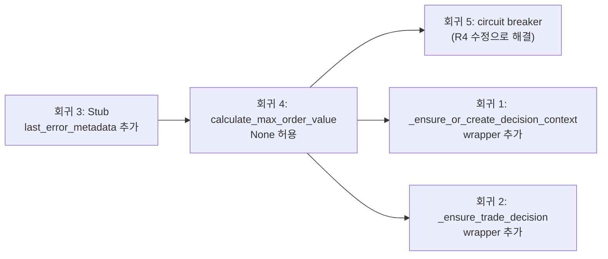

# Phase 4 회귀 분석 — 5개 실패 테스트 정밀 분석 및 수정 계획

> 작성일: 2026-05-24
> 대상: `decision_orchestrator.py` (2047→1349줄) 리팩토링 후 회귀

---

## 개요

Phase 4 리팩토링에서 `DecisionOrchestratorService`의 private method 3개(`_ensure_or_create_decision_context`, `_ensure_trade_decision`, `_resolve_quote` 등)가 `DecisionContextService` / `ExecutionService` / `decision_factory.py`로 추출되었다. 이 과정에서 5개 회귀가 발생했다.

### 의존성 그래프

```mermaid
flowchart TD
    A[test_decision_orchestrator.py] --> B["service._ensure_or_create_decision_context()"]
    B --> C{존재하지 않음<br/>→ AttributeError}
    C --> D["DecisionContextService.ensure_or_create()로 이동됨"]
    
    E[test_decision_submit_pipeline.py] --> F["@patch(..._ensure_trade_decision)"]
    F --> G{속성 없음<br/>→ patch() AttributeError}
    G --> H["build_trade_decision_entity() + repos.trade_decisions.add()로 대체됨"]
    
    I[decision_orchestrator.py:_run_agents] --> J["agent.last_error_metadata"]
    J --> K{Stub에 속성 없음<br/>→ AttributeError}
    K --> L["except Exception에서 캐치되어<br/>성공 출력 손실"]
    
    M[decision_factory.py] --> N["calculate_max_order_value<br/>(request.price, request.quantity)"]
    N --> O{price=None인 MARKET 주문<br/>→ TypeError}
    O --> P["assemble() 실패 → ERROR"]
    P --> Q["circuit breaker 테스트가<br/>SUBMITTED 기대 → ERROR 수신"]
```

---

## 회귀 1: `_ensure_or_create_decision_context` private method 부재

### 실패 테스트명

1. `tests/services/test_decision_orchestrator.py::test_ensure_or_create_decision_context_reuses_existing`
2. `tests/services/test_decision_orchestrator.py::test_ensure_or_create_decision_context_none_no_connection_crash`

### 에러 메시지

```
AttributeError: 'DecisionOrchestratorService' object has no attribute '_ensure_or_create_decision_context'
```

### 근본 원인

`_ensure_or_create_decision_context()`가 Phase 4 리팩토링에서 [`DecisionContextService.ensure_or_create()`](src/agent_trading/services/decision_factory.py:173)로 추출되었다. `DecisionOrchestratorService`는 이제 내부적으로 `self._decision_context_service.ensure_or_create(request, existing_context_id)`를 호출하지만, 테스트는 여전히 `service._ensure_or_create_decision_context()`를 직접 호출한다.

### 수정 방안

**Thin wrapper 추가** (테스트 변경 최소화 원칙).

### 수정할 파일

- [`src/agent_trading/services/decision_orchestrator.py`](src/agent_trading/services/decision_orchestrator.py)

### 변경 시그니처

```python
# DecisionOrchestratorService에 추가 (기존 private API 복원)
async def _ensure_or_create_decision_context(
    self,
    request: SubmitOrderRequest,
    existing_context_id: UUID | None,
) -> UUID | None:
    """Thin wrapper — delegates to DecisionContextService.

    Preserved for test compatibility.  New code should call
    ``self._decision_context_service.ensure_or_create()`` directly.
    """
    return await self._decision_context_service.ensure_or_create(
        request, existing_context_id
    )
```

---

## 회귀 2: `_ensure_trade_decision` private method 부재

### 실패 테스트명

- [`tests/services/test_decision_submit_pipeline.py`](tests/services/test_decision_submit_pipeline.py)::`TestBrokerSubmitException`::`test_broker_submit_exception_logs_symbol_and_decision_type` (line 1365-1424)

### 에러 메시지

```
AttributeError: <class '...DecisionOrchestratorService'> does not have the attribute '_ensure_trade_decision'
```

→ `@patch` 데코레이터가 존재하지 않는 속성을 패치하려고 할 때 발생.

### 근본 원인

`_ensure_trade_decision()`은 Phase 4에서 삭제되고 [`build_trade_decision_entity()`](src/agent_trading/services/decision_factory.py:60) + 직접 `repos.trade_decisions.add()` 호출로 대체되었다. 테스트는 `@patch("...DecisionOrchestratorService._ensure_trade_decision")`로 의존한다.

해당 테스트는 브로커 submit 실패 상황을 검증한다. `_ensure_trade_decision`을 mock하여 trade decision ID를 반환하도록 하고, `_run_agents`도 mock하여 pipeline이 broker submit 단계까지 도달하도록 한다. `_ensure_trade_decision`이 없으면 `patch` 자체가 실패한다.

### 수정 방안

**Thin wrapper 추가** — 기존 `build_trade_decision_entity()` 로직을 래핑.

### 수정할 파일

- [`src/agent_trading/services/decision_orchestrator.py`](src/agent_trading/services/decision_orchestrator.py)

### 변경 시그니처

```python
# DecisionOrchestratorService에 추가
async def _ensure_trade_decision(
    self,
    *,
    resolved_context_id: UUID | None,
    request: SubmitOrderRequest,
    assembled_context: AssembledContext,
    agent_bundle: AgentExecutionBundle,
    fdc_run_id: UUID | None = None,
) -> UUID | None:
    """Thin wrapper — build + persist TradeDecisionEntity.

    Preserved for test compatibility.  Returns the trade_decision_id
    or None when creation is not possible.
    """
    td_entity = build_trade_decision_entity(
        decision_context_id=resolved_context_id,
        request=request,
        assembled_context=assembled_context,
        agent_bundle=agent_bundle,
        fdc_run_id=fdc_run_id,
    )
    if td_entity is not None:
        td_entity = await self._repos.trade_decisions.add(td_entity)
        return td_entity.trade_decision_id
    return None
```

그리고 [`assemble()`](src/agent_trading/services/decision_orchestrator.py:606-617)에서 직접 `build_trade_decision_entity()` + `add()`를 호출하는 부분을 이 wrapper로 대체:

```python
# assemble() 내부 (기존 코드)
# td_entity = build_trade_decision_entity(...)
# if td_entity is not None:
#     td_entity = await self._repos.trade_decisions.add(td_entity)
#     trade_decision_id = td_entity.trade_decision_id
# else:
#     trade_decision_id = None

# → wrapper 호출로 대체
trade_decision_id = await self._ensure_trade_decision(
    resolved_context_id=resolved_context_id,
    request=request,
    assembled_context=assembled_context,
    agent_bundle=agent_bundle,
    fdc_run_id=_fdc_run_id,
)
```

---

## 회귀 3: `StubEventInterpretationAgent`에 `last_error_metadata` 없음 → `AttributeError`

### 실패 테스트명

이 회귀는 특정 테스트 실패보다는 **`_run_agents()` 실행 중 발생**하며, `use_subprocess_isolation=False`인 모든 테스트에 영향을 미친다. 특히:

- [`test_decision_replay.py`](tests/services/test_decision_replay.py)::`TestReplayDeterministicBuildSubmitRequest::test_replay_build_request_identity` (line 161, `use_subprocess_isolation=False`)
- `test_decision_orchestrator.py`의 모든 in-process agent 경로 사용 테스트

### 에러 메시지

```
AttributeError: 'StubEventInterpretationAgent' object has no attribute 'last_error_metadata'
```

→ [`_run_agents()`](src/agent_trading/services/decision_orchestrator.py:932)에서 `self._event_interpretation_agent.last_error_metadata` 접근 시 발생.

### 근본 원인

`_run_agents()`의 success path (line 929-932)에서 EI agent가 정상 완료된 후 `last_error_metadata`를 읽는다:

```python
# line 929-932
# 성공 경로: agent가 내부적으로 예외를 catch한 경우
#   _last_error_metadata에 분류된 error metadata가 있음.
ei_error_metadata = self._event_interpretation_agent.last_error_metadata
```

그러나 기본값으로 사용되는 [`StubEventInterpretationAgent`](src/agent_trading/services/ai_agents/event_interpretation.py:406)는 `last_error_metadata` 속성이 없다. `real` [`EventInterpretationAgent`](src/agent_trading/services/ai_agents/event_interpretation.py:471)는 `last_error_metadata` property를 가지고 있다.

`AttributeError`가 발생하면 `except Exception` (line 958)에서 캐치되어 fallback `EventInterpretationOutput()`이 생성된다 — 정상 실행된 agent의 출력이 손실된다.

### 수정 방안

**Stub에 `last_error_metadata` property 추가** — 항상 `None` 반환 (Stub은 실패하지 않으므로).

### 수정할 파일

- [`src/agent_trading/services/ai_agents/event_interpretation.py`](src/agent_trading/services/ai_agents/event_interpretation.py)

### 변경 시그니처

```python
# StubEventInterpretationAgent 클래스에 추가 (line 406 부근)
@property
def last_error_metadata(self) -> dict[str, object] | None:
    """Stub: never produces errors, always returns None."""
    return None
```

---

## 회귀 4: `calculate_max_order_value(request.price, request.quantity)` → `request.price is None` → `TypeError`

### 실패 테스트명

이 회귀는 **`build_trade_decision_entity()` 호출부에서 `price=None`인 MARKET 주문**으로 진입할 때 발생한다. 다음 테스트들이 영향을 받는다:

- [`test_decision_submit_pipeline.py`](tests/services/test_decision_submit_pipeline.py)::`TestQuoteCircuitBreaker::test_quote_cache_hit` (line 2458, `_make_request(price=None)`)
- [`test_decision_submit_pipeline.py`](tests/services/test_decision_submit_pipeline.py)::`TestQuoteCircuitBreaker::test_quote_circuit_breaker_after_failures` (line 2517, `_make_request(price=None)`)

### 에러 메시지

```
TypeError: unsupported operand type(s) for *: 'NoneType' and 'Decimal'
```

→ [`calculate_max_order_value(None, Decimal("10"))`](src/agent_trading/services/translation.py:186)에서 발생. `None * Decimal(...)` 연산 불가.

### 근본 원인

[`build_trade_decision_entity()`](src/agent_trading/services/decision_factory.py:112-115)가 `calculate_max_order_value(request.price, request.quantity)`를 호출할 때 MARKET order의 경우 `request.price`가 `None`이다. `calculate_max_order_value`의 시그니처는 `(price: Decimal, quantity: Decimal)`로 두 인자가 모두 `Decimal`이라고 가정하지만, `None`에 대한 방어 로직이 없다.

Phase 4 이전에는 이 경로가 `_ensure_trade_decision()` 내부에서 처리되었는데, 여기서 `price=None`을 허용하는 다른 로직 흐름이 있었을 수 있다.

### 수정 방안

**`calculate_max_order_value`가 `None` price를 허용하도록 변경** — `None` 입력 시 `None` 반환.

### 수정할 파일

- [`src/agent_trading/services/translation.py`](src/agent_trading/services/translation.py)

### 변경 시그니처

```python
def calculate_max_order_value(price: Decimal | None, quantity: Decimal) -> Decimal | None:
    """Calculate max order value = price * quantity, floored at 0.

    Returns ``None`` when ``price`` is ``None`` (MARKET order without
    a resolved reference price).
    """
    if price is None:
        return None
    return max(price * quantity, Decimal("0"))
```

그리고 호출부인 [`decision_factory.py`](src/agent_trading/services/decision_factory.py:112)의 `TradeDecisionEntity.max_order_value` 필드가 `None`을 허용하는지 확인 필요. `max_order_value` 필드 타입이 `Decimal | None`이어야 함.

---

## 회귀 5: quote cache / circuit breaker 테스트에서 기대 `SUBMITTED` 대신 `ERROR`

### 실패 테스트명

1. [`test_decision_submit_pipeline.py`](tests/services/test_decision_submit_pipeline.py)::`TestQuoteCircuitBreaker::test_quote_cache_hit` (line 2458)
2. [`test_decision_submit_pipeline.py`](tests/services/test_decision_submit_pipeline.py)::`TestQuoteCircuitBreaker::test_quote_circuit_breaker_after_failures` (line 2517)

### 에러 메시지

```
AssertionError: assert 'ERROR' == 'SUBMITTED'
 +  where 'ERROR' = result.status
```

### 근본 원인

**회귀 4에 종속적** — 회귀 4(`calculate_max_order_value`가 `None` price에서 `TypeError`)가 선행하여 `assemble()`을 실패시키므로, pipeline이 `SUBMITTED`까지 도달하지 못하고 `ERROR`를 반환한다.

두 circuit breaker 테스트는 모두 `_make_request(price=None)`으로 MARKET order를 생성한다. 이 `None` price가 `build_trade_decision_entity()` → `calculate_max_order_value(None, qty)` → `TypeError`를 유발한다.

정상 흐름이라면:
1. `assemble()` 성공 → `OrderIntent` 반환
2. `run_execution_pipeline()` 진입
3. Phase 1.5: `_resolve_quote()`에서 quote resolution (circuit breaker / cache 로직)
4. Phase 5: broker submit → `SUBMITTED`

현재:
1. `assemble()` → `build_trade_decision_entity()` → `TypeError` → `except Exception` → `SubmitResult(status="ERROR", error_phase="ai")`

### 수정 방안

**회귀 4를 먼저 수정**하면 회귀 5도 함께 해결된다. 별도의 수정은 불필요.

단, circuit breaker 테스트가 수정 후에도 여전히 통과하는지 확인해야 한다:

1. `calculate_max_order_value`가 `None`을 반환하도록 수정
2. `TradeDecisionEntity.max_order_value` 필드가 `None` 허용하는지 확인
3. `build_trade_decision_entity()`에서 `None` price로도 정상 동작하는지 확인

### 수정할 파일

- [`src/agent_trading/services/translation.py`](src/agent_trading/services/translation.py) — `calculate_max_order_value` 수정 (회귀 4와 동일)

### 추가 확인 필요

[`TradeDecisionEntity`](src/agent_trading/domain/entities.py)의 `max_order_value` 필드 타입:

```python
# entities.py (확인 필요)
max_order_value: Decimal | None
```

만약 `Decimal` (non-optional)이라면 함께 수정해야 한다.

---

## 실행 순서



| 순서 | 회귀 | 변경 파일 | 영향 |
|------|------|-----------|------|
| 1 | **회귀 3** | `event_interpretation.py` | Stub에 1줄 property 추가. 가장 단순하고 독립적 |
| 2 | **회귀 4** | `translation.py` | `calculate_max_order_value` 시그니처 변경. `decision_factory.py` 호출부 영향 |
| 3 | **회귀 5** | (회귀 4 수정으로 해결) | 회귀 4 병합 후 자동 해결. 검증 필요 |
| 4 | **회귀 1** | `decision_orchestrator.py` | 5줄 wrapper 메서드. 기존 `assemble()`은 `DecisionContextService` 직접 호출 유지 |
| 5 | **회귀 2** | `decision_orchestrator.py` | wrapper + 기존 `assemble()` 코드를 wrapper 호출로 대체 |

---

## 리스크

1. **`TradeDecisionEntity.max_order_value` 타입**: `Decimal` (non-optional)이면 migration이 추가로 필요하다.
2. **`assemble()` 내부 로직 변경 (회귀 2)**: 기존 인라인 코드를 wrapper 호출로 대체할 때 `_fdc_run_id` 전달이 정확해야 한다. 기존 코드는 `build_trade_decision_entity()`에 `fdc_run_id=_fdc_run_id`를 전달하므로 wrapper도 동일하게 유지.
3. **`calculate_max_order_value` 반환 타입 변경**: 호출부에서 `None` 반환을 처리할 수 있는지 확인. `TradeDecisionEntity.max_order_value`가 `Optional[Decimal]`이면 안전.

---

## 검증 방법

각 수정 후 다음 명령으로 단일 테스트 검증:

```bash
# 회귀 3 검증
python -m pytest tests/services/ai_agents/test_agents.py::TestStubEventInterpretationAgent -xvs

# 회귀 4 + 5 검증
python -m pytest tests/services/test_decision_submit_pipeline.py::TestQuoteCircuitBreaker -xvs

# 회귀 1 검증
python -m pytest tests/services/test_decision_orchestrator.py::test_ensure_or_create_decision_context_reuses_existing tests/services/test_decision_orchestrator.py::test_ensure_or_create_decision_context_none_no_connection_crash -xvs

# 회귀 2 검증
python -m pytest tests/services/test_decision_submit_pipeline.py::TestBrokerSubmitException -xvs

# 전체 관련 테스트 검증
python -m pytest tests/services/test_decision_orchestrator.py tests/services/test_decision_submit_pipeline.py tests/services/test_decision_replay.py -x --timeout=120
```
