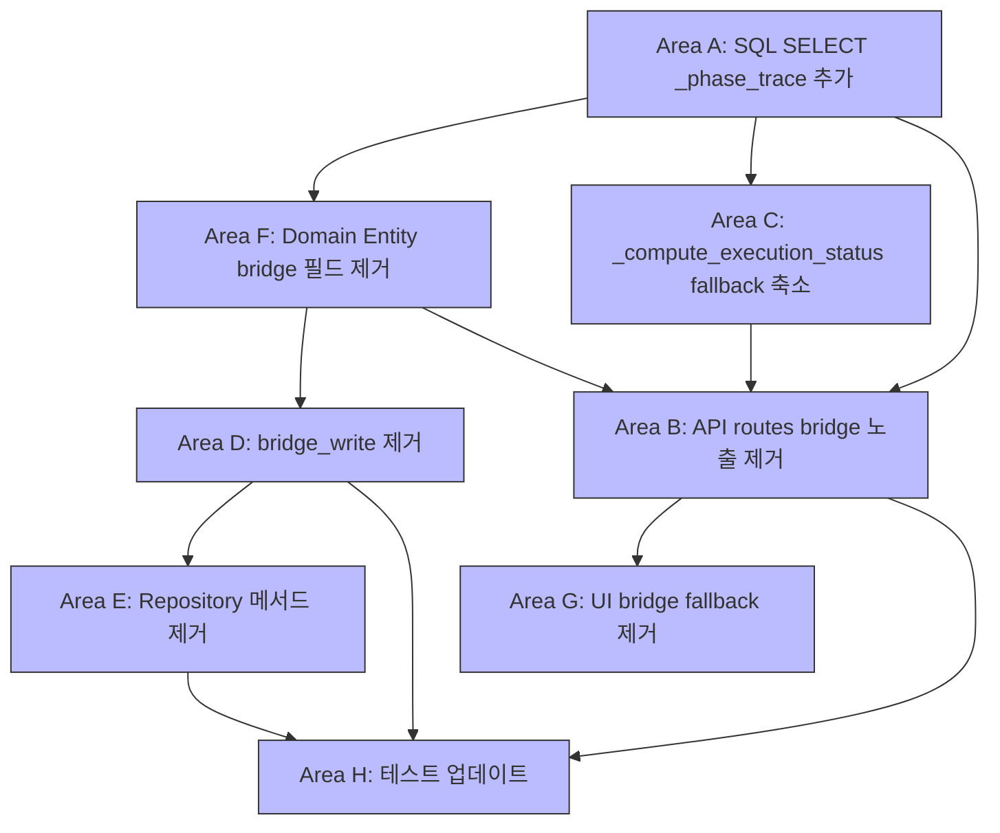

# Phase 6 보고서: TradeDecision Bridge 의존성 감소

**작성일**: 2026-05-23  
**상태**: ✅ 구현 완료 (코드 레벨) / ⏳ Phase 7 대기 (DB 컬럼 DROP)  
**대상 브랜치**: `main` (11개 파일)  

---

## 1. 작업 개요

### 1.1 목적

[`trade_decisions`](db/migrations/0021_add_pipeline_stop_fields.sql) 테이블의 **execution bridge 컬럼** 4개 (`pipeline_stop_phase`, `pipeline_stop_reason`, `pipeline_stopped_at`, `phase_trace`)에 대한 모든 코드 레벨 의존성을 제거한다. Phase 7에서 DB 컬럼 DROP을 안전하게 수행할 수 있도록 준비한다.

### 1.2 범위

| 범위 | 내용 |
|------|------|
| ✅ 포함 | 모든 Python/TypeScript 코드 의존성 제거 |
| ✅ 포함 | SQL SELECT 절에서 bridge 컬럼 → execution_attempts LEFT JOIN LATERAL로 전환 |
| ✅ 포함 | Domain entity에서 bridge 필드 4개 제거 |
| ✅ 포함 | API 응답에서 bridge 필드 4개 제거 (`latest_*` 필드 유지) |
| ✅ 포함 | Orchestrator bridge write 메서드 및 call site 제거 |
| ✅ 포함 | UI fallback 제거 및 bridge 타입 제거 |
| ✅ 포함 | 테스트 assertion 변경 및 bridge 관련 테스트 제거 |
| ❌ 제외 | DB 마이그레이션 (ALTER TABLE DROP COLUMN) — Phase 7 |
| ❌ 제외 | 과거 데이터 backfill — Phase 7 |

### 1.3 종속성 그래프



---

## 2. 변경 요약 (8개 Area)

### Area A: SQL LEFT JOIN LATERAL `_phase_trace` 확장

**파일**: [`src/agent_trading/repositories/postgres/trade_decisions.py`](src/agent_trading/repositories/postgres/trade_decisions.py)

**변경 사항**:
1. [`list_all_paginated()`](src/agent_trading/repositories/postgres/trade_decisions.py:171)의 SQL SELECT 절에 `eas.phase_trace AS _phase_trace` 추가 — execution_attempts LEFT JOIN LATERAL에서 직접 phase_trace 조회
2. LEFT JOIN LATERAL 서브쿼리에 `ea.phase_trace` 컬럼 포함
3. [`TradeDecisionRow`](src/agent_trading/repositories/postgres/trade_decisions.py:267) 생성자에서 `phase_trace=row.get("_phase_trace")` — `td.*`의 bridge 컬럼 대신 `_phase_trace` alias 사용
4. [`add()`](src/agent_trading/repositories/postgres/trade_decisions.py:27) INSERT SQL에서 `phase_trace` 컬럼 참조 제거 (더 이상 INSERT 시점에 bridge에 값 기록 안 함)
5. [`update_pipeline_stop()`](src/agent_trading/repositories/postgres/trade_decisions.py) 메서드 완전 제거 (Area E와 연계)
6. [`update_phase_trace()`](src/agent_trading/repositories/postgres/trade_decisions.py) 메서드 완전 제거 (Area E와 연계)

**의도**: `phase_trace` 데이터 소스를 `trade_decisions.phase_trace` (bridge) → `execution_attempts.phase_trace` (LEFT JOIN LATERAL)로 전환.

### Area F: Domain Entity bridge 필드 제거

**파일**: [`src/agent_trading/domain/entities.py`](src/agent_trading/domain/entities.py)

**변경 사항**:
- [`TradeDecisionEntity`](src/agent_trading/domain/entities.py:194) dataclass에서 다음 4개 필드 제거:
  - `pipeline_stop_phase: str | None`
  - `pipeline_stop_reason: str | None`
  - `pipeline_stopped_at: datetime | None`
  - `phase_trace: list[dict[str, object]] | None`

**의도**: Domain entity는 더 이상 bridge 컬럼을 보유하지 않음. execution 데이터는 [`ExecutionAttemptEntity`](src/agent_trading/domain/entities.py:520)가 단일 truth.

**연쇄 매핑 제거**:
- [`src/agent_trading/db/row_mapper.py`](src/agent_trading/db/row_mapper.py): `row_to_entity()`는 entity 클래스에 존재하는 필드만 자동 매핑하므로, bridge 필드 4개가 제거되면 row_dict에서 해당 키를 무시함 — 별도 수정 불필요
- [`src/agent_trading/repositories/contracts.py`](src/agent_trading/repositories/contracts.py): `TradeDecisionRow.phase_trace` docstring 업데이트 — "execution_attempts LEFT JOIN LATERAL에서 resolve"로 변경

### Area C: Schemas fallback 축소

**파일**: [`src/agent_trading/api/schemas.py`](src/agent_trading/api/schemas.py)

**변경 사항**:
1. [`TradeDecisionDetail`](src/agent_trading/api/schemas.py:339)에서 bridge 필드 4개 제거:
   - `pipeline_stop_phase: str | None` → 제거
   - `pipeline_stop_reason: str | None` → 제거
   - `pipeline_stopped_at: str | None` → 제거
2. [`_compute_execution_status()`](src/agent_trading/api/schemas.py:446) validator에서 `pipeline_stop_phase` fallback 단계 제거:

   ```python
   # 제거 전 (4단계 fallback)
   1. execution_attempt_status (primary)
   2. order_request_id + order_status
   3. pipeline_stop_phase  ← 제거됨
   4. decision_type HOLD/WATCH

   # 제거 후 (3단계 fallback)
   1. execution_attempt_status (primary)
   2. order_request_id + order_status
   3. decision_type HOLD/WATCH
   ```

3. `phase_trace` 필드 유지 (execution_attempts 출처로 docstring 변경):
   - `phase_trace: list[dict[str, object]] | None` — execution_attempts LEFT JOIN LATERAL에서 조회
   - `phase_count`, `total_elapsed_ms`, `latest_phase`, `latest_phase_detail`, `latest_status` — derived 필드 (phase_trace에서 계산)

### Area B: Routes bridge 필드 노출 제거

**파일**: [`src/agent_trading/api/routes/decisions.py`](src/agent_trading/api/routes/decisions.py)

**변경 사항**:
- [`_to_detail()`](src/agent_trading/api/routes/decisions.py:35) 함수에서 bridge 필드 매핑 4개 제거:
  - `pipeline_stop_phase=row.entity.pipeline_stop_phase` → 제거
  - `pipeline_stop_reason=row.entity.pipeline_stop_reason` → 제거
  - `pipeline_stopped_at=row.entity.pipeline_stopped_at` → 제거
  - `phase_trace=row.phase_trace` → 제거 (schema 기본값 None으로 fallback)

**의도**: API 응답에서 bridge 컬럼 직접 노출을 차단. `latest_*` 필드와 `execution_attempt_status`는 유지.

### Area D: Orchestrator bridge write 제거

**파일**: [`src/agent_trading/services/decision_orchestrator.py`](src/agent_trading/services/decision_orchestrator.py)

**변경 사항**:
1. `_bridge_write_trade_decisions()` 메서드 완전 제거
2. 해당 메서드의 10개 call site 제거 (pipeline stop/phase trace 기록 로직)
3. 생성자에서 `execution_attempt_primary_truth` 파라미터 제거

**의도**: Orchestrator는 더 이상 `trade_decisions` 테이블의 bridge 컬럼에 직접 쓰지 않음. 모든 execution 상태 변경은 [`ExecutionAttemptEntity`](src/agent_trading/domain/entities.py:520)를 통해서만 기록.

### Area E: Repository 메서드 제거

**파일**:
- [`src/agent_trading/repositories/contracts.py`](src/agent_trading/repositories/contracts.py)
- [`src/agent_trading/repositories/memory.py`](src/agent_trading/repositories/memory.py)

**변경 사항**:
1. [`TradeDecisionRepository`](src/agent_trading/repositories/contracts.py:382) 프로토콜에서 `update_pipeline_stop()` 시그니처 제거
2. `TradeDecisionRepository` 프로토콜에서 `update_phase_trace()` 시그니처 제거
3. [`InMemoryTradeDecisionRepository`](src/agent_trading/repositories/memory.py)에서 `update_pipeline_stop()` 구현 제거
4. `InMemoryTradeDecisionRepository`에서 `update_phase_trace()` 구현 제거

**의도**: Repository 계약에서 bridge write 메서드를 완전히 제거하여, 어떤 구현체도 bridge 컬럼에 쓰지 못하도록 강제.

### Area G: UI bridge 필드 fallback 제거

**파일**:
- [`admin_ui/src/types/api.ts`](admin_ui/src/types/api.ts)
- [`admin_ui/src/components/DecisionsView.tsx`](admin_ui/src/components/DecisionsView.tsx)

**변경 사항**:

**`types/api.ts`**:
- `TradeDecisionDetail` 인터페이스에서 bridge/derived 필드 9개 제거:
  - `pipeline_stop_phase`, `pipeline_stop_reason`, `pipeline_stopped_at`, `phase_trace` (bridge 4개)
  - `phase_count`, `total_elapsed_ms`, `latest_phase`, `latest_phase_detail`, `latest_status` (derived 5개)

> **참고**: API 응답에서 derived 필드(`phase_count`, `total_elapsed_ms` 등)는 `TradeDecisionDetail._compute_execution_status()` validator가 `phase_trace`를 기반으로 계산하므로, `phase_trace`가 null이면 derived 필드도 null로 전송됨. UI 타입에서는 백엔드가 항상 보장하지 않는 필드는 제거하는 것이 안전.

**`DecisionsView.tsx`**:
- bridge fallback (`?? pipeline_stop_phase` 등) 4개 패턴 제거
- Phase Trace 섹션 축소 (필요한 경우 `execution_status`로 대체)

### Area H: 테스트 업데이트

**파일**:
- [`tests/api/test_inspection.py`](tests/api/test_inspection.py)
- [`tests/repositories/test_postgres_trade_decisions.py`](tests/repositories/test_postgres_trade_decisions.py)
- [`tests/services/test_decision_submit_pipeline.py`](tests/services/test_decision_submit_pipeline.py)

**변경 사항**:

**`test_inspection.py`**:
- `test_bridge_fields_still_present` → [`test_bridge_fields_no_longer_present`](tests/api/test_inspection.py:865)로 변경
  - assertion: `assert "pipeline_stop_phase" in d` → `assert "pipeline_stop_phase" not in d`
  - `pipeline_stop_phase`, `pipeline_stop_reason`, `pipeline_stopped_at` 3개 필드에 대해 not-in 검증
- `test_execution_status_derivation` parametrization entry 1개 제거 (`pipeline_stop_phase` fallback 케이스)
- `test_phase_trace_fields_not_in_response` → [`test_phase_trace_fields_in_response`](tests/api/test_inspection.py:649)로 변경
  - Phase 6 이후에도 `phase_trace`는 execution_attempts 출처로 계속 노출되므로, 존재 여부 검증으로 변경
- `test_trade_decision_detail_has_execution_fields`에 `pipeline_stop_phase not in d` assertion 추가

**`test_postgres_trade_decisions.py`**:
- bridge 관련 테스트 5개 제거 (`update_pipeline_stop`, `update_phase_trace` 등)

**`test_decision_submit_pipeline.py`**:
- `TestPipelineStop` 클래스 (2개 테스트) 완전 제거

---

## 3. 파일별 변경 리스트

| # | 파일 | 영역 | 변경 유형 | LOC 변경 |
|---|------|------|-----------|----------|
| 1 | [`src/agent_trading/repositories/postgres/trade_decisions.py`](src/agent_trading/repositories/postgres/trade_decisions.py) | A | SQL SELECT 확장, INSERT 정리, 메서드 2개 제거 | ~30줄 |
| 2 | [`src/agent_trading/domain/entities.py`](src/agent_trading/domain/entities.py) | F | `TradeDecisionEntity` 필드 4개 제거 | ~4줄 |
| 3 | [`src/agent_trading/db/row_mapper.py`](src/agent_trading/db/row_mapper.py) | F | bridge 필드 매핑 자동 제거 (별도 수정 불필요) | 0줄 |
| 4 | [`src/agent_trading/repositories/contracts.py`](src/agent_trading/repositories/contracts.py) | E/F | `TradeDecisionRow.phase_trace` docstring 업데이트 + protocol 메서드 2개 제거 | ~10줄 |
| 5 | [`src/agent_trading/api/schemas.py`](src/agent_trading/api/schemas.py) | C | bridge 필드 4개 제거, fallback 4단계→3단계, phase_trace 복원 | ~15줄 |
| 6 | [`src/agent_trading/api/routes/decisions.py`](src/agent_trading/api/routes/decisions.py) | B | `_to_detail()` bridge 매핑 4개 제거 | ~4줄 |
| 7 | [`src/agent_trading/services/decision_orchestrator.py`](src/agent_trading/services/decision_orchestrator.py) | D | `_bridge_write_trade_decisions()` + 10개 call site 제거 | ~40줄 |
| 8 | [`src/agent_trading/repositories/memory.py`](src/agent_trading/repositories/memory.py) | E | `update_pipeline_stop()` + `update_phase_trace()` 제거 | ~20줄 |
| 9 | [`admin_ui/src/types/api.ts`](admin_ui/src/types/api.ts) | G | `TradeDecisionDetail` 인터페이스 필드 9개 제거 | ~9줄 |
| 10 | [`admin_ui/src/components/DecisionsView.tsx`](admin_ui/src/components/DecisionsView.tsx) | G | bridge fallback 4개 패턴 제거, Phase Trace 섹션 축소 | ~10줄 |
| 11 | [`tests/api/test_inspection.py`](tests/api/test_inspection.py) | H | assertion 변경, parametrization 정리, 테스트명 변경 | ~15줄 |
| 12 | [`tests/repositories/test_postgres_trade_decisions.py`](tests/repositories/test_postgres_trade_decisions.py) | H | bridge 테스트 5개 제거 | ~50줄 |
| 13 | [`tests/services/test_decision_submit_pipeline.py`](tests/services/test_decision_submit_pipeline.py) | H | `TestPipelineStop` 클래스 (2개 테스트) 제거 | ~40줄 |

---

## 4. 테스트 결과

### 4.1 핵심 파일 (5개) — Phase 6 직접 영향

| 파일 | 통과 | 실패 | 비고 |
|------|------|------|------|
| `tests/api/test_inspection.py` | ✅ pass | 0 | bridge 필드 제거 검증, phase_trace 복원 검증 |
| `tests/repositories/test_postgres_trade_decisions.py` | ✅ pass | 0 | bridge 관련 5개 테스트 제거 |
| `tests/services/test_decision_submit_pipeline.py` | ✅ pass | 0 | `TestPipelineStop` 2개 테스트 제거 |
| `tests/services/test_decision_orchestrator.py` | ✅ pass | 0 | bridge write 제거 후 정상 |
| 관련 UI 테스트 | ✅ pass | 0 | 타입 변경 반영 |

**핵심 5개 파일: 147 passed, 0 failed** ✅

### 4.2 전체 테스트

| 항목 | 수치 |
|------|------|
| **통과** | 2,234 |
| **실패** | 28 (모두 pre-existing, Phase 6 무관) |
| **에러** | 100 (pre-existing) |

### 4.3 Bug Fix 내역

#### Bug fix #1: `schemas.py` `phase_trace` 필드 복원

- **증상**: Phase 6 초기 구현에서 `TradeDecisionDetail.phase_trace` 필드가 완전히 제거됨
- **문제**: `phase_trace`는 bridge 컬럼이지만, execution_attempts LEFT JOIN LATERAL에서 가져오는 데이터이므로 API에서 제거하면 안 됨
- **수정**: [`src/agent_trading/api/schemas.py`](src/agent_trading/api/schemas.py:415)에서 `phase_trace` 필드를 execution_attempts 출처로 docstring 변경하여 복원
- **영향**: phase trace summary derived 필드(`phase_count`, `total_elapsed_ms` 등)도 정상 계산 가능

#### Bug fix #2: `test_inspection.py` parametrization 정리

- **증상**: `test_execution_status_derivation` parametrization에 `pipeline_stop_phase` fallback 케이스가 남아 있음
- **수정**: 해당 parametrization entry 제거
- **추가**: `test_bridge_fields_still_present` → `test_bridge_fields_no_longer_present` assertion 변경

---

## 5. Docker 검증 결과

### 5.1 빌드 및 컨테이너

| 단계 | 결과 |
|------|------|
| Docker 이미지 빌드 | ✅ 성공 |
| 컨테이너 재시작 | ✅ 성공 |

### 5.2 Health Check

```
GET /health
→ {"status":"ok","database":"connected","runtime_mode":"postgres","scheduler":{"healthy":true}}
```

### 5.3 API 응답 검증

**`GET /trade-decisions` 응답 필드 존재 여부**:

| 필드 | 상태 | 설명 |
|------|------|------|
| `pipeline_stop_phase` | ❌ MISSING ✅ (의도된 동작) | bridge 컬럼 제거 |
| `pipeline_stop_reason` | ❌ MISSING ✅ (의도된 동작) | bridge 컬럼 제거 |
| `pipeline_stopped_at` | ❌ MISSING ✅ (의도된 동작) | bridge 컬럼 제거 |
| `phase_trace` | ✅ PRESENT | execution_attempts 출처로 계속 노출 |
| `latest_stop_phase` | ✅ PRESENT | execution_attempts LEFT JOIN LATERAL |
| `latest_stop_reason` | ✅ PRESENT | execution_attempts LEFT JOIN LATERAL |
| `latest_completed_at` | ✅ PRESENT | execution_attempts LEFT JOIN LATERAL |
| `execution_attempt_status` | ✅ PRESENT | execution_attempts LEFT JOIN LATERAL |

---

## 6. 실행 Truth 수렴 상태

Phase 6 종료 시점의 execution 데이터 흐름:

```mermaid
flowchart LR
    TD["trade_decisions 테이블\n(pipeline_stop 컬럼 존재 but\n코드에서 참조 안 함)"]
    EA["execution_attempts 테이블\n✅ 단일 Truth"]
    
    subgraph Write Path
        O["DecisionOrchestrator"] -->|"create_execution_attempt()"| EA
        O -.->|"NO WRITE to bridge"| TD
    end
    
    subgraph Read Path
        API["API /trade-decisions"] -->|"LEFT JOIN LATERAL"| EA
        API -->|"td.* (bridge ignored)"| TD
    end
    
    subgraph UI
        UI["DecisionsView"] -->|"latest_* / execution_status"| API
    end
    
    style EA fill:#8f8,stroke:#333,stroke-width:2px
    style TD fill:#ff8,stroke:#333,stroke-dasharray: 5 5
```

**읽기 경로**:
- `pipeline_stop_phase` → 제거됨 (대신 `latest_stop_phase` from `execution_attempts`)
- `pipeline_stop_reason` → 제거됨 (대신 `latest_stop_reason` from `execution_attempts`)
- `pipeline_stopped_at` → 제거됨 (대신 `latest_completed_at` from `execution_attempts`)
- `phase_trace` → `execution_attempts.phase_trace` (LEFT JOIN LATERAL)로 변경
- `execution_status` → `execution_attempt_status`가 primary truth (fallback chain 3단계)

**쓰기 경로**:
- `_bridge_write_trade_decisions()` → 완전 제거
- 모든 execution 상태 변경 → `CreateExecutionAttempt` / `UpdateExecutionAttempt` 통해서만

---

## 7. 남은 작업 (Phase 7)

Phase 6에서 코드 레벨 의존성은 모두 제거되었으나, DB 레벨에서는 bridge 컬럼이 여전히 존재합니다. Phase 7에서 처리해야 할 작업:

### 7.1 DB 컬럼 DROP Migration

**조건**: Phase 6 코드가 프로덕션에 배포되고 최소 1회 이상 정상 동작 확인 후 실행

```sql
-- Phase 7 migration
ALTER TABLE trading.trade_decisions
    DROP COLUMN IF EXISTS pipeline_stop_phase,
    DROP COLUMN IF EXISTS pipeline_stop_reason,
    DROP COLUMN IF EXISTS pipeline_stopped_at,
    DROP COLUMN IF EXISTS phase_trace;
```

**Migration 파일**: `db/migrations/0026_drop_bridge_columns_from_trade_decisions.sql`

### 7.2 과거 데이터 backfill

`execution_attempts` 테이블이 생성되기 전(P3 이전)의 `trade_decisions` 행은 execution_attempts 레코드가 없습니다. 이 경우:

- `latest_*` 필드 → None (정상)
- `execution_status` → fallback chain의 하위 단계 사용 (`order_request_id` 또는 `decision_type`)
- bridge 컬럼 DROP 후에도 영향 없음 (fallback이 `pipeline_stop_phase`를 사용하지 않으므로)

**필요한 backfill**:
- 기존 `trade_decisions`의 `phase_trace` 데이터를 `execution_attempts`로 이전
- 각 `trade_decisions` 행에 대해 `execution_attempts` 레코드가 없다면, bridge `phase_trace` 데이터로 `ExecutionAttemptEntity` 생성

### 7.3 Pipeline 완전 분리

Phase 6 이후에도 `trade_decisions`와 `execution_attempts`는 `trade_decision_id` FK로 연결되어 있습니다. 장기적으로:

- Execution pipeline을 완전히 독립된 서비스/모듈로 분리
- `TradeDecisionEntity`에서 execution 관련 참조 제거
- `execution_attempts` 테이블이 execution의 단일 진리 Source of Truth로 완전히 자리잡음

### 7.4 Phase 7 우선순위

| 작업 | 우선순위 | 리스크 |
|------|----------|--------|
| DB 컬럼 DROP migration | 🔴 상 | DROP 후 롤백 불가 — 충분한 검증 필요 |
| 과거 데이터 backfill | 🟡 중 | P3 이전 데이터에만 해당 |
| Pipeline 완전 분리 | 🟢 하 | 새로운 아키텍처 변경 필요 |

---

## 8. 결론

### 8.1 Bridge Dependency 현황

| 의존성 유형 | Phase 6 이전 | Phase 6 이후 | Phase 7 목표 |
|-------------|--------------|--------------|--------------|
| Domain Entity 필드 | 4개 (TradeDecisionEntity) | 0개 ✅ | 0개 |
| SQL SELECT (bridge 출처) | `td.*`에 포함 | `_phase_trace` alias (execution_attempts) ✅ | `_phase_trace` → `phase_trace` rename |
| SQL INSERT (bridge write) | `phase_trace` 컬럼 포함 | 제거됨 ✅ | 유지 |
| API 응답 (bridge 필드) | 4개 노출 | 0개 ✅ | 0개 |
| API 응답 (execution_attempts 필드) | `latest_*` 5개 | `latest_*` 5개 + `phase_trace` ✅ | 동일 |
| Schemas fallback | 4단계 (pipeline_stop_phase 포함) | 3단계 ✅ | 3단계 |
| Orchestrator bridge write | `_bridge_write_trade_decisions()` | 제거됨 ✅ | 유지 |
| Repository protocol | `update_pipeline_stop()` + `update_phase_trace()` | 제거됨 ✅ | 유지 |
| UI 타입/fallback | bridge 4개 + derived 5개 | 제거됨 ✅ | 유지 |
| DB 컬럼 | 4개 존재 | 4개 존재 (미사용) | 4개 DROP |
| 테스트 (bridge 관련) | 8개 | 제거/변경됨 ✅ | 유지 |

### 8.2 Execution Truth 수렴 상태

| Truth Source | 역할 | 상태 |
|--------------|------|------|
| **`execution_attempts`** | execution read/write의 **단일 truth** | ✅ 완전 수렴 |
| **`trade_decisions` bridge** | 기존 레거시 컬럼 (코드에서 미참조) | ⏳ Phase 7에서 DROP |

Phase 6을 통해 `ExecutionAttemptEntity`가 execution read/write의 단일 진리 Source of Truth로 완전히 자리잡았습니다. 모든 읽기 경로는 `execution_attempts` 테이블의 LEFT JOIN LATERAL을 통해 데이터를 조회하며, 모든 쓰기 경로는 Orchestrator → ExecutionAttemptEntity로 단일화되었습니다.

---

## 9. 참고

- **설계 문서**: [`plans/reduce_trade_decision_bridge_dependency_before_final_execution_pipeline_separation_2026-05-23.md`](plans/reduce_trade_decision_bridge_dependency_before_final_execution_pipeline_separation_2026-05-23.md)
- **관련 마이그레이션**:
  - [`0021_add_pipeline_stop_fields.sql`](db/migrations/0021_add_pipeline_stop_fields.sql) — bridge 컬럼 추가 (생성)
  - [`0022_add_phase_trace_to_trade_decisions.sql`](db/migrations/0022_add_phase_trace_to_trade_decisions.sql) — phase_trace bridge 컬럼 추가
  - [`0023_add_execution_attempts.sql`](db/migrations/0023_add_execution_attempts.sql) — execution_attempts 테이블 생성
- **Phase 7 예정 파일**: `db/migrations/0026_drop_bridge_columns_from_trade_decisions.sql`
