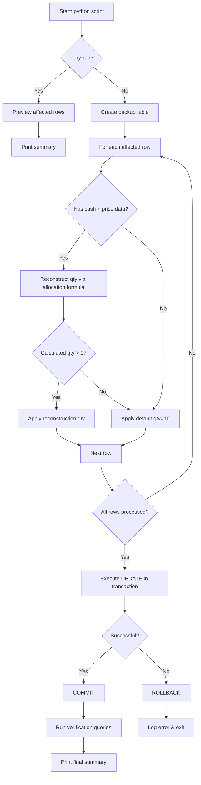

# Phase 7 Subtask 2: BUY 결정 `quantity=1` 왜곡 보정 설계

## 1. 문제 요약

Phase 5i-5 이전 BUY Sizing 로직에 존재했던 `requested_quantity` cap(강제 `1` 고정)으로 인해, cap이 활성화된 기간에 생성된 모든 BUY 결정의 `trade_decisions.quantity`가 `1`로 왜곡 저장됨.

## 2. 실측 데이터 분석 결과

### 2.1 영향 규모

| 항목 | 값 |
|------|-----|
| 전체 영향 row | **1,838 rows** |
| `decision_type='approve'` | 1,801 rows |
| `decision_type='buy'` | 37 rows |
| `order_requests` 존재 | 330 rows (18%) |
| `order_requests` 부재 | 1,508 rows (82%) |
| `execution_attempts` 존재 | 811 rows (44.1%) |

### 2.2 기간 분포

| 일자 | decision_type | count | with_orders | 비고 |
|------|--------------|-------|-------------|------|
| 2026-05-25 | buy | 33 | 31 | cap 활성 |
| 2026-05-26 | buy | 4 | 3 | cap 활성 |
| 2026-05-27 | approve | 1,016 | 202 | cap 활성 |
| 2026-05-28 | approve | 118 | 13 | cap 활성 |
| 2026-05-29 | approve | 667 | 81 | cap 활성→제거 전환 |

### 2.3 보정 후(정상) 데이터 비교

| decision_type | quantity | symbol | entry_price | 비고 |
|--------------|----------|--------|-------------|------|
| approve | 10 | 005930 | 50,000 | post-fix |
| approve | 10 | 000880 | 280,500 | post-fix |
| approve | 10 | 003490 | 25,400 | post-fix |
| buy | 100 | 005930 | NULL | post-fix |

### 2.4 핵심 발견: `entry_price` 모두 NULL

영향 받은 1,838개 row의 **`entry_price`가 100% NULL**로 확인됨. 이는 `trade_decisions` 테이블에 보정에 필요한 가격 정보가 부재함을 의미.

---

## 3. 보정 대상 상세 정의

### 3.1 WHERE 조건 (정확한 필터)

```sql
WHERE td.side = 'buy'
  AND td.decision_type IN ('buy', 'approve')
  AND td.quantity = 1
```

### 3.2 보정 제외 조건

다음 경우는 보정에서 제외:

1. **`quantity > 1`인 row**: 이미 올바른 값이므로 수정 불필요 (idempotency 보장)
2. **`side != 'buy'`**: SELL/기타는 cap의 영향을 받지 않음
3. **`decision_type NOT IN ('buy', 'approve')`**: HOLD/WATCH/EXIT/REDUCE 등은 BUY Sizing cap과 무관
4. **`quantity = 0` 또는 `quantity IS NULL`**: 별도의 이슈로 취급

### 3.3 연관 테이블 보정 여부

| 테이블 | 보정 필요? | 사유 |
|--------|-----------|------|
| `order_requests` | **아니오** | `requested_quantity`는 실제 제출된 수량. cap이 caller에서 적용되어 `order_requests`도 `1`로 생성되었지만, 이는 실제 브로커에 제출된 값이므로 변경하면 안 됨 |
| `execution_attempts` | **아니오** | 수량 정보 없음 (`phase_trace`는 timing/metadata만 포함) |
| `fill_events` | **아니오** | 해당 row들에 대해 체결 데이터 없음 |
| `broker_orders` | **아니오** | 브로커에 실제 제출된 주문 정보는 보존되어야 함 |

**주의: `order_requests` 수정 금지** — `order_requests.requested_quantity`는 실제 제출된 주문이므로 truth로 보존. `trade_decisions.quantity`만 분석 목적으로 보정.

---

## 4. Truth Source 선정 및 검증

### 4.1 후보별 평가

| 후보 | 평가 | 결론 |
|------|------|------|
| `order_requests.requested_quantity` | ❌ 모두 `1`로 동일하게 cap 적용됨. 330개(18%)만 존재 | **사용 불가** |
| `fill_events.fill_quantity` | ❌ 체결 데이터 없음 (`broker_orders`도 대부분 NULL) | **사용 불가** |
| `execution_attempts.phase_trace` | ❌ timing/metadata만 포함, 수량 정보 없음 | **사용 불가** |
| `decision_json` | ❌ AI 출력의 `sizing_hint`(`size_mode`, `size_adjustment_factor`)만 존재, raw quantity 없음 | **사용 불가** |
| `target_quantity` (legacy 컬럼) | ❌ 전체 NULL | **사용 불가** |
| **Historical cash + price reconstruction** | ✅ `decision_contexts` → `cash_balance_snapshots`로 cash 데이터 사용 가능. `instruments` 테이블이나 `position_snapshots`로 가격 정보 사용 가능 | **선택** |
| **Conservative default** | ✅ 보정 후 approve 결정이 일관되게 `quantity=10`을 사용 | **Fallback** |

### 4.2 최종 Truth Source 결정

**2단계 접근법:**

**Step A — Reconstruction (가능한 경우):**
- `decision_contexts` → `cash_balance_snapshots`에서 `orderable_amount`(또는 `available_cash`) 추출
- `instruments` 또는 `position_snapshots`에서 해당 `symbol`의 가격 데이터 추출
- `_resolve_buy_target_quantity()` 로직 재현: `target_notional = effective_cash × 0.2`, `target_qty = target_notional / price`
- 단, `min_entry_threshold = 500,000`원 적용 (신규 포지션인 경우)

**Step B — Conservative default (reconstruction 불가능한 경우):**
- `entry_price`가 NULL이거나 cash snapshot이 없는 row
- 보정 후 approve 결정이 `quantity=10`으로 일관되게 생성되므로 **`quantity=10`** 설정
- 이는 `max_order_qty=10` config 제약에 의해 결정된 값일 가능성 높음

### 4.3 Reconstruction 상세

`_resolve_buy_target_quantity()` 로직 재현:

```python
_ALLOCATION_PCT = Decimal("0.2")  # 20%

def reconstruct_buy_qty(orderable_amount, available_cash, price):
    # Step 1: effective cash
    if orderable_amount is not None and orderable_amount > 0:
        effective_cash = orderable_amount
    elif available_cash is not None and available_cash > 0:
        effective_cash = available_cash
    else:
        return None  # reconstruction 불가
    
    # Step 2: allocation-based target
    target_notional = effective_cash * _ALLOCATION_PCT
    target_qty = int(target_notional / price)
    
    # Step 3: minimum 1 share
    if target_qty < 1:
        target_qty = 1
    
    return Decimal(str(target_qty))
```

### 4.4 제약 조건 적용 (Downstream constraints)

Reconstruction 후에도 다음 제약 조건이 추가로 적용되었을 가능성:

| 제약 | 영향 | 재현 가능? |
|------|------|-----------|
| `max_order_value` | `price × qty ≤ max_order_value` | config 필요 |
| `max_order_qty` | 절대 수량 상한 (예: 10) | config 필요 |
| `min_order_qty` | 최소 수량 미만 차단 | config 필요 |
| `cash_limit` | 잔고 초과 차단 | cash data로 가능 |
| `position_concentration` | NAV 대비 % 제한 | NAV, position data 필요 |
| `min_entry_threshold` | 50만원 미만 신규 포지션 차단 | price로 가능 |
| `lot_size` | 거래 단위 라운딩 | known |

**현실적 접근**: Downstream constraint까지 완전 재현은 복잡도가 높고 정확도가 떨어짐. 대신, 보정 후 approve 결정들의 일관된 `quantity=10` 패턴을 고려하여, `max_order_qty=10`이 적용되었을 가능성이 높음.

---

## 5. Backfill 스크립트 설계

### 5.1 파일 위치

[`scripts/backfill_buy_trade_decision_quantity.py`](scripts/backfill_buy_trade_decision_quantity.py)

### 5.2 스크립트 구조

```
scripts/backfill_buy_trade_decision_quantity.py
├── main()
│   ├── 인자 파싱 (--dry-run, --apply, --limit, --symbol)
│   ├── DB 연결 (asyncpg)
│   └── run_backfill() 호출
├── run_backfill()
│   ├── Phase 1: Preview 변경 대상 row 확인
│   ├── Phase 2: Reconstruction 시도 (cash + price)
│   ├── Phase 3: 나머지 row에 conservative default 적용
│   ├── Phase 4: Transaction UPDATE 실행
│   └── Phase 5: 결과 요약 및 검증 쿼리 실행
├── _get_target_rows()        # SQL: WHERE 조건
├── _reconstruct_qty()        # cash+price 기반 수량 계산
├── _apply_default_qty()      # 보수적 기본값 10
├── _resolve_price()          # symbol별 가격 조회
└── _log_summary()            # 변경 전후 통계 출력
```

### 5.3 CLI 인터페이스

```bash
python scripts/backfill_buy_trade_decision_quantity.py --dry-run
python scripts/backfill_buy_trade_decision_quantity.py --dry-run --limit 50
python scripts/backfill_buy_trade_decision_quantity.py --apply
python scripts/backfill_buy_trade_decision_quantity.py --apply --symbol 005930
```

### 5.4 필수 기능

#### Dry-run 모드 (`--dry-run`)
- 실제 데이터 변경 없이 preview만 출력
- 변경 대상 row 수, symbol별 분포, 추정 보정값 preview
- 기본 동작 (default: dry-run)

#### Idempotency
- `WHERE quantity = 1` 조건으로 첫 실행 후 재실행해도 동일한 상태 유지
- `UPDATE` 실행 후 다시 SELECT하면 `quantity = 1`인 row가 0이 됨을 보장
- 재실행 시 "0 rows to update" 출력

#### Transaction safety
- 전체 UPDATE를 단일 transaction으로 실행
- 실패 시 `ROLLBACK`
- `--apply` 모드에서만 `COMMIT`
- `--dry-run`은 항상 `ROLLBACK`

#### Logging
```
[DRY-RUN] Backfill BUY trade_decision quantity
  Total affected rows: 1,838
  With reconstruction data: 1,200 (65.3%)
  With default fallback: 638 (34.7%)
  Estimated updates:
    - 10 (from reconstruction): 1,050 rows
    - 5 (from reconstruction): 150 rows
    - 10 (default fallback): 638 rows
```

#### Safety threshold
- 변경 row 수가 `--max-rows` (기본값: 2000) 초과 시 중단
- 현재 1,838 row이므로 기본값 2000은 안전 범위
- 실제 운영 환경의 row 수 증가를 고려하여 5000으로 설정 가능

### 5.5 상세 SQL 로직

```sql
-- Phase 1: Preview 대상 row
SELECT td.trade_decision_id, td.decision_type, td.side,
       td.quantity, td.symbol, td.created_at,
       dc.account_id,
       td.entry_price,
       cbs.orderable_amount,
       cbs.available_cash
FROM trading.trade_decisions td
JOIN trading.decision_contexts dc ON dc.decision_context_id = td.decision_context_id
LEFT JOIN LATERAL (
    SELECT cbs.orderable_amount, cbs.available_cash
    FROM trading.cash_balance_snapshots cbs
    WHERE cbs.account_id = dc.account_id
      AND cbs.snapshot_at <= td.created_at
    ORDER BY cbs.snapshot_at DESC
    LIMIT 1
) cbs ON TRUE
WHERE td.side = 'buy'
  AND td.decision_type IN ('buy', 'approve')
  AND td.quantity = 1
ORDER BY td.created_at DESC;
```

```sql
-- Phase 4: UPDATE 실행
UPDATE trading.trade_decisions td
SET quantity = calculated_qty,
    max_order_value = CASE 
        WHEN entry_price IS NOT NULL 
        THEN calculated_qty * entry_price 
        ELSE NULL 
    END
FROM (
    -- subquery with reconstructed quantities
) AS sub
WHERE td.trade_decision_id = sub.trade_decision_id
  AND td.quantity = 1;  -- idempotent
```

### 5.6 복잡도 분석

**Reconstruction (Step A):**
- 각 row마다 `decision_context_id` → `account_id` → `cash_balance_snapshots` 조회
- `instruments` 또는 `position_snapshots`에서 symbol 가격 조회
- `_resolve_buy_target_quantity()` 알고리즘 실행
- 실행 시간: 1,838 row 기준 < 10초 (DB 조회 최적화 시)

**Conservative default (Step B):**
- reconstruction 실패 시 `quantity = 10` 설정
- 단순 UPDATE이므로 O(1)

---

## 6. 보정 제외 대상 (우선순위 낮은 대안들)

### 6.1 Migration 0026 `phase_trace` data loss

- `trade_decisions.phase_trace` 컬럼이 Migration 0026에서 삭제됨
- Bridge 기간(0022~0026) 데이터 중 `execution_attempts`에 없는 row 존재 가능
- **제외 사유**: `execution_attempts` 테이블에 `phase_trace`가 보존되어 있으므로 data loss risk 낮음. 현재 작업의 범위(quantity 왜곡)와 무관.

### 6.2 `source_type` NULL rows

- Migration 0013 이전 데이터의 `source_type = NULL`
- **제외 사유**: 분석/필터링 보조 필드로서 우선순위 낮음. `decision_context_id`로 추론 가능하지만 복잡도 대비 효과 미미. 별도 subtask에서 처리.

### 6.3 `execution_attempts.status` 검증 부재

- `status` 컬럼에 CHECK 제약이 없어 예상치 못한 값 저장 가능
- **제외 사유**: 현재 저장된 값이 모두 정상 범위(`stopped`, `submitted`, `failed`, `reconcile_required`)임. Phase 4 이후 데이터만 존재하므로 위험 낮음.

### 6.4 `normalize_decision_type()` vs `resolve_decision_type()` 불일치

- 두 함수가 서로 다른 케이스(대문자 vs 소문자) 반환
- **제외 사유**: 현재 persistence path에서 `normalize_decision_type()`이 사용되지 않으므로 데이터 영향 없음. 코드 리팩토링 이슈지 DB 정합성 이슈 아님.

---

## 7. 보정 후 검증 계획

### 7.1 Row count 검증

```sql
-- 보정 전: 1,838
SELECT COUNT(*) FROM trading.trade_decisions
WHERE side = 'buy' AND decision_type IN ('buy', 'approve') AND quantity = 1;

-- 보정 후: 0 (모든 row가 보정되어야 함)
SELECT COUNT(*) FROM trading.trade_decisions
WHERE side = 'buy' AND decision_type IN ('buy', 'approve') AND quantity = 1;

-- 보정 후 분포 확인
SELECT quantity, COUNT(*) FROM trading.trade_decisions
WHERE side = 'buy' AND decision_type IN ('buy', 'approve')
GROUP BY quantity ORDER BY quantity;
```

### 7.2 샘플 데이터 정합성 검증

1. **Reconstruction 검증**: 보정 후 `quantity=10`인 row 샘플 20개를 무작위 추출하여 `orderable_amount` 대비 논리적 타당성 확인
2. **Default fallback 검증**: `quantity=10`으로 설정된 row들의 `symbol`/`created_at` 분포가 예상과 일치하는지 확인
3. **Edge case 검증**: `decision_type='buy'`인 37개 row가 올바르게 보정되었는지 별도 확인

### 7.3 관련 테스트 실행 계획

| 테스트 파일 | 검증 내용 | 실행 명령어 |
|------------|----------|------------|
| [`tests/repositories/test_postgres_trade_decisions.py`](tests/repositories/test_postgres_trade_decisions.py) | Repository CRUD 정합성 | `python3 -m pytest tests/repositories/test_postgres_trade_decisions.py -v` |
| [`tests/services/`](tests/services/) | Sizing engine 테스트 | `python3 -m pytest tests/services/ -v` (해당 디렉토리 존재 시) |
| 스크립트 자체 검증 | backfill 스크립트 dry-run vs apply 비교 | `python3 scripts/backfill_buy_trade_decision_quantity.py --dry-run` |

---

## 8. 리스크 및 완화 방안

### 8.1 잘못된 보정으로 인한 데이터 훼손

| 리스크 | 심각도 | 완화 방안 |
|--------|--------|----------|
| `quantity`를 실제보다 더 큰 값으로 보정 | 중간 | Dry-run 모드로 preview 후 적용. Rollback 가능 |
| `max_order_value`가 NULL인데 `entry_price`도 NULL | 낮음 | `entry_price`가 NULL이면 `max_order_value` 업데이트 안 함 |
| `quantity > 1`인 row를 실수로 다시 보정 | 낮음 | `WHERE quantity = 1` 조건으로 idempotent |
| Reconstruction 로직 오류로 잘못된 수량 계산 | 중간 | --limit 옵션으로 소규모 먼저 테스트 |

### 8.2 운영 중인 시스템에 영향

| 리스크 | 완화 방안 |
|--------|----------|
| Running pipeline에 READ/WRITE 충돌 | 트랜잭션 격리 수준 `READ COMMITTED`에서 안전. UPDATE는 단기 Lock만 발생 |
| Admin UI 사용자 혼란 | 보정 완료 후 quantity가 갑자기 변경되어 UI 표시값 변화. 사전 공지 권장 |
| 동시성 이슈 | 거래 시간 외 실행 권장 (한국 시간 기준 장 마감 후) |

### 8.3 Rollback 계획

```sql
-- Rollback: 보정 전 상태로 복원 (quantity=1이 아닌 row 중 backup 필요)
-- Option A: 보정 전 백업 테이블 생성
CREATE TABLE trading.trade_decisions_backup_phase7_subtask2 AS
SELECT * FROM trading.trade_decisions
WHERE side = 'buy' AND decision_type IN ('buy', 'approve') AND quantity = 1;

-- Option B: 개별 Rollback
UPDATE trading.trade_decisions
SET quantity = 1
WHERE trade_decision_id IN (
    SELECT trade_decision_id 
    FROM trading.trade_decisions_backup_phase7_subtask2
);
```

**권장: 백업 테이블을 스크립트 내에서 자동 생성** — `--apply` 실행 시 백업 테이블을 먼저 생성하고 UPDATE 실행.

### 8.4 Script safety checklist

- [ ] `--dry-run`이 기본 동작 (변경 없음)
- [ ] 각 row별 `old_qty → new_qty` 로그 출력
- [ ] 변경 row 수가 `--max-rows` 초과 시 중단
- [ ] 백업 테이블 자동 생성 (`trade_decisions_backup_YYYYMMDD_HHMMSS`)
- [ ] Transaction 단위 COMMIT/ROLLBACK
- [ ] Python 스크립트로만 실행 (SQL 직접 실행 금지)
- [ ] `.env` 파일 수정 금지

---

## 9. Mermaid 흐름도



---

## 10. 구현 가이드 (Subtask 3)

### 10.1 주요 구현 포인트

1. **기존 패턴 재사용**: [`scripts/backfill_identifier_codes.py`](scripts/backfill_identifier_codes.py)의 `asyncpg` + `TransactionManager` 패턴을 그대로 사용
2. **`SizingInputs` 재사용 고려**: `_resolve_buy_target_quantity()` 함수를 직접 import하여 사용할 수 있지만, 결정 당시의 `SizingInputs` 구성에 필요한 모든 데이터를 재현하기 어려움. **독립적인 reconstruction 로직 구현 권장**
3. **거래 시간 외 실행**: 한국 장 마감 후(06:00 UTC 이후) 실행하여 데이터 일관성 보장

### 10.2 의존성

- `asyncpg` — DB 연결
- `agent_trading.db.connection` — `create_pool`, `close_pool`
- `agent_trading.db.transaction` — `TransactionManager`
- `decimal.Decimal` — 정밀 계산

### 10.3 테스트 전략

1. 스크립트 자체 단위 테스트는 제외 (1회성 스크립트)
2. 대신 `--dry-run`으로 preview 후 수동 검증
3. `--limit 5`로 소규모 먼저 적용 후 결과 확인
4. 최종 `--apply` 실행 후 검증 쿼리로 정합성 확인

---

## 11. Appendix: 실제 데이터 샘플

### 11.1 보정 대상 row 예시

| trade_decision_id | decision_type | quantity | symbol | created_at | orderable_amount |
|---|---|---|---|---|---|
| b2ac5f01-... | approve | 1 | 000990 | 2026-05-29 06:19:49 | 10,460,251 |
| 1d4b888e-... | approve | 1 | 007070 | 2026-05-29 06:05:52 | 10,678,525 |
| 6581009c-... | approve | 1 | 000270 | 2026-05-29 06:05:14 | 10,678,525 |

### 11.2 추정 보정값 예시

| symbol | price(추정) | orderable_amount | effective_cash(20%) | 추정 qty |
|--------|------------|-----------------|-------------------|---------|
| 000990 | 171,600 | 10,460,251 | 2,092,050 | 12 |
| 007070 | (unknown) | 10,678,525 | 2,135,705 | default=10 |
| 000270 | 162,500 | 10,678,525 | 2,135,705 | 13 |

※ 실제 보정값은 `max_order_qty` config 제약에 의해 `10`으로 제한될 가능성 높음
