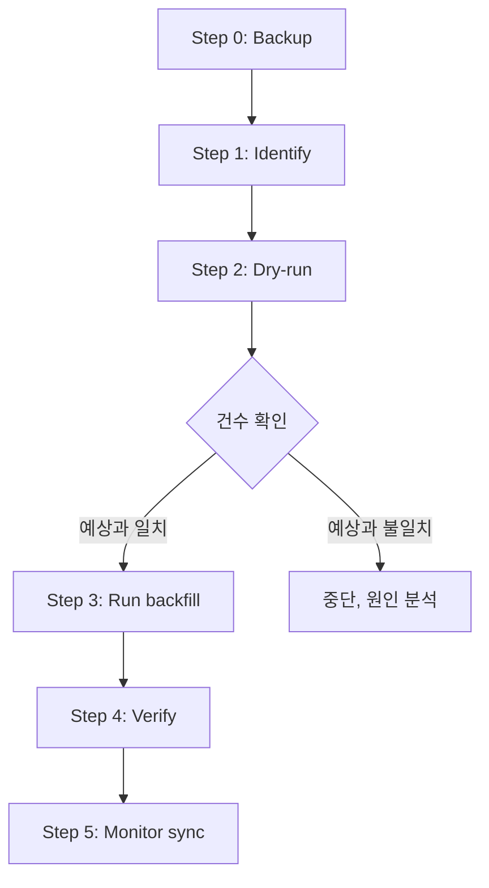
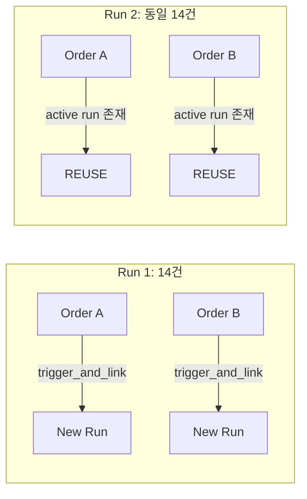

# Phase 7c Subtask 2: 28일~29일 `order_requests` 상태 정리 — 정리 대상 선택 및 설계

> 작성일: 2026-05-30 KST  
> 참조: [`plans/phase7c_subtask1_status_reclassification.md`](plans/phase7c_subtask1_status_reclassification.md)

---

## 1. DB 추가 조회 결과

### 1.1 비정상 expired (broker_status=reconcile_required + order=expired) 30건 — 상세

| 항목 | 값 |
|------|------|
| **총 건수** | 30건 |
| **Side** | **ALL BUY** (SELL 0건) |
| **Order type** | ALL market |
| **broker_native_order_id** | ALL 존재 |
| **생성 시간 범위** | 2026-05-28 02:11 UTC ~ 2026-05-29 05:50 UTC (KST 11:11~14:50) |

**중요 발견:** 기존 [`backfill_expired_market_sell_orders.py`](scripts/backfill_expired_market_sell_orders.py)는 **SELL 전용** (`recover_expired_sell_by_position()`). BUY 주문에 대한 position-delta 기반 복구 메커니즘이 존재하지 않음. BUY position increase는 다른 주문의 체결과 구분 불가능.

### 1.2 reconcile_required 14건 — 상세

| 항목 | 값 |
|------|------|
| **총 건수** | 14건 |
| **Side** | BUY 12건, SELL 2건 |
| **Order type** | ALL market |
| **broker_native_order_id** | ALL 존재 |
| **broker_status** | ALL reconcile_required |
| **status_reason_code** | ALL NULL |

---

## 2. 후보 평가

### Candidate A: 비정상 expired 30건 복구

| 평가 항목 | 판단 |
|-----------|------|
| Side 분포 | **ALL BUY** (SELL 0건) |
| 복구 메커니즘 | position-delta 기반 복구는 SELL 전용, BUY에는 적용 불가 |
| 대안 | expired→reconcile_required로 **상태 롤백** 필요 |
| 상태 전이 제약 | [`_ALLOWED_TRANSITIONS`](src/agent_trading/services/order_manager.py:65)에서 `EXPIRED → RECONCILE_REQUIRED`가 **명시적으로 허용되지 않음** (EXPIRED는 FILLED/PARTIALLY_FILLED만 허용) |
| 우회 방안 | `order_manager.transition_to()` 실패 → 직접 DB UPDATE 필요 (bypass 상태 머신) |
| **위험도** | **🔴 HIGH** — 상태 머신 우회, BUY 체결 여부 불확실 |

### Candidate B: reconcile_required 14건 처리 ✅ **선택**

| 평가 항목 | 판단 |
|-----------|------|
| 복구 메커니즘 | [`backfill_reconcile_required_orders.py`](scripts/backfill_reconcile_required_orders.py) — **이미 테스트 완료, production-ready** |
| 테스트 커버리지 | [`test_backfill_reconcile_required.py`](tests/scripts/test_backfill_reconcile_required.py) — idempotency, dry-run, limit, filter 전부 검증 |
| 상태 전이 | **변경 없음** — reconciliation run 생성만 함, order 상태는 유지 |
| Idempotency | Active run 존재 시 REUSE (중복 생성 방지) |
| **위험도** | **🟢 LOW** — 기존 검증된 스크립트, order 상태 미변경, dry-run 지원 |

### Candidate C: sync loop 로직 개선

| 평가 항목 | 판단 |
|-----------|------|
| 영향 범위 | 코드 수정 + 테스트 + 배포 필요 |
| 즉시 효과 | 없음 (미래 재발 방지) |
| **위험도** | **🟡 MEDIUM** — 코드 변경 필요 |

---

## 3. 최종 선택: Candidate B — reconcile_required 14건 처리

### 선택 근거

1. **상태 전이 제약 해결**: expired→reconcile_required가 `_ALLOWED_TRANSITIONS`에 없어서 Candidate A는 직접 DB UPDATE가 필요함 → 위험
2. **기존 검증된 도구**: `backfill_reconcile_required_orders.py`는 idempotency, dry-run, 필터링까지 모두 검증 완료
3. **Zero order state change**: reconciliation run 생성만 하므로 order의 status/version이 변경되지 않음
4. **즉시 실행 가능**: 추가 개발 없이 CLI 명령어로 바로 실행
5. **저위험**: dry-run → 실제 실행 순서로 안전하게 진행 가능

### 선택하지 않은 이유

| 후보 | 배제 이유 |
|------|-----------|
| Candidate A | ALL BUY라 position-delta 복구 불가, 상태 머신 우회 필요, 1순위로는 위험 |
| Candidate C | 코드 변경 필요, 즉시 효과 없음, Phase 7c 이후 별도 이슈로 분리 |

### 잔여 리스크 (향후 처리 필요)

1. **비정상 expired 30건 (BUY)**: `_ALLOWED_TRANSITIONS` 수정 후 별도 스크립트로 처리 필요 또는 직접 DB UPDATE
2. **sync loop 개선**: Paper API 대응 로직은 별도 이슈로 분리

---

## 4. 정리 방식 상세 설계

### 4.1 전체 워크플로우



### 4.2 Step-by-step 실행 계획

#### Step 0: 백업 (Pre-flight)

```sql
-- reconcile_required 14건 백업
CREATE TABLE backup_order_requests_20260530 AS
SELECT * FROM trading.order_requests
WHERE status = 'reconcile_required'
  AND created_at >= '2026-05-27 15:00:00+00'
  AND created_at < '2026-05-29 15:00:00+00';

-- 관련 broker_orders 백업
CREATE TABLE backup_broker_orders_20260530 AS
SELECT bo.* FROM trading.broker_orders bo
JOIN trading.order_requests o ON o.order_request_id = bo.order_request_id
WHERE o.status = 'reconcile_required'
  AND o.created_at >= '2026-05-27 15:00:00+00'
  AND o.created_at < '2026-05-29 15:00:00+00';
```

#### Step 1: 대상 식별

```bash
# reconcile_required 상태 주문 전체 조회 (14건 확인)
python scripts/backfill_reconcile_required_orders.py --dry-run
```

#### Step 2: Dry-run (영향 평가)

```bash
# 상세 로그로 각 주문의 broker_native_order_id 확인
python scripts/backfill_reconcile_required_orders.py --dry-run --verbose
```

예상 출력 포맷:
```
DRY-RUN order=<uuid> account=<uuid> broker_native_ids=['...']
(would trigger trigger_type=requires_reconciliation symbol=005930 side=buy)
```

#### Step 3: 실제 실행

```bash
# 14건 전체 처리 (idempotency 보장)
python scripts/backfill_reconcile_required_orders.py --verbose
```

또는 단계적 실행 (선호):
```bash
# 1차: 5건만 처리
python scripts/backfill_reconcile_required_orders.py --limit 5 --verbose

# 2차: 나머지 9건 처리
python scripts/backfill_reconcile_required_orders.py --limit 14 --verbose
```

#### Step 4: 검증

```sql
-- reconciliation run 생성 확인
SELECT rr.reconciliation_run_id, rr.account_id, rr.trigger_type,
       rr.status, rr.started_at, rr.created_at,
       rro.order_request_id
FROM trading.reconciliation_runs rr
LEFT JOIN trading.reconciliation_run_orders rro
    ON rro.reconciliation_run_id = rr.reconciliation_run_id
WHERE rr.created_at >= NOW() - INTERVAL '1 hour'
  AND rr.trigger_type = 'requires_reconciliation'
ORDER BY rr.created_at DESC;
```

예상 결과: 14건의 reconciliation run이 생성됨 (또는 동일 계정 내 idempotency로 인해 더 적은 수).

#### Step 5: 모니터링

```bash
# sync loop 로그 확인 (reconciliation worker가 run 처리)
# 또는 reconciliation worker 수동 실행
python scripts/run_reconciliation_worker.py --once
```

### 4.3 idempotency 동작



- 첫 번째 실행: 14건 각각에 대해 reconciliation run 생성 (동일 계정은 1개 run으로 통합)
- 두 번째 실행: active reconciliation run이 이미 존재하므로 전부 REUSE (skip)

### 4.4 복구 시나리오 (롤백)

문제 발생 시:
```sql
-- 백업 테이블에서 복원
DELETE FROM trading.reconciliation_run_orders
WHERE reconciliation_run_id IN (
    SELECT reconciliation_run_id
    FROM trading.reconciliation_runs
    WHERE created_at >= NOW() - INTERVAL '1 hour'
      AND trigger_type = 'requires_reconciliation'
);

DELETE FROM trading.reconciliation_runs
WHERE created_at >= NOW() - INTERVAL '1 hour'
  AND trigger_type = 'requires_reconciliation';

-- (선택) 백업 확인 후 백업 테이블 정리
DROP TABLE IF EXISTS backup_order_requests_20260530;
DROP TABLE IF EXISTS backup_broker_orders_20260530;
```

---

## 5. 저위험성 검토

### 5.1 위험 매트릭스

| 위험 | 영향 | 발생 확률 | 대응 |
|------|------|-----------|------|
| Reconciliation run 중복 생성 | 낮음 (idempotent) | 낮음 | REUSE 메커니즘으로 방지 |
| order 상태 변경 | 없음 | 0% | reconciliation run은 order 상태를 변경하지 않음 |
| broker API 호출 증가 | 낮음 | 낮음 | trigger_and_link는 broker API 미호출 (DB only) |
| Transaction commit 실패 | 중간 | 낮음 | --dry-run으로 사전 검증, 백업으로 복구 가능 |
| Version conflict | 낮음 | 낮음 | reconciliation run 생성은 order와 독립적 |

### 5.2 안전장치

1. **Dry-run 모드**: 실제 DB 변경 없이 영향 평가
2. **Idempotency**: active reconciliation run 존재 시 REUSE (중복 생성 방지)
3. **Limit 인자**: `--limit N`으로 단계적 실행 가능
4. **Order ID 필터**: `--order-id`로 특정 주문만 선택적 처리
5. **Account ID 필터**: `--account-id`로 특정 계정만 처리
6. **DB 백업**: 실행 전 전체 백업으로 복구 가능
7. **Order 상태 무변경**: reconciliation run 생성만 수행

### 5.3 모니터링 지표

| 지표 | 정상 범위 | 이상 징후 |
|------|-----------|-----------|
| scanned | 14 | 0 또는 14 초과 |
| triggered | 14 | 0 (모두 REUSE는 정상, active run이 이미 있을 수 있음) |
| reused | 0 | 14 (모두 reused면 이미 처리된 상태) |
| failed | 0 | 1 이상이면 로그 확인 필요 |

---

## 6. 실행 명령어 요약

```bash
# 1. 백업 (DB 커넥션 필요)
# 위 SQL 실행 (Step 0)

# 2. Dry-run
python scripts/backfill_reconcile_required_orders.py --dry-run --verbose

# 3. 실제 실행
python scripts/backfill_reconcile_required_orders.py --verbose

# 4. 검증
# 위 검증 SQL 실행 (Step 4)
```

---

## 7. 잔여 리스크 및 향후 과제

### 7.1 비정상 expired 30건 (BUY)

Candidate A가 선택되지 않았으므로, 30건의 BUY expired 주문은 현재 상태로 남음.

**향후 처리 방안:**

| 접근법 | 설명 | 위험도 |
|--------|------|--------|
| A1. expired→reconcile_required DB 직접 UPDATE | 상태 머신 우회, `_ALLOWED_TRANSITIONS`에 `RECONCILE_REQUIRED` 추가 후 transition 사용 | 🟡 MEDIUM |
| A2. position-snapshot delta로 BUY 체결 확인 | pre→post position increase 확인, 단 동시 주문 효과와 구분 필요 | 🔴 HIGH |
| A3. 현재 상태 유지 (expired) + 모니터링 | position tracking 오차는 paper 환경에서 허용 가능 | 🟢 LOW |

**권장: A1 + A3 혼합**
- `_ALLOWED_TRANSITIONS`에 `EXPIRED → RECONCILE_REQUIRED`를 추가하고
- transition_to()를 통해 상태 복구
- position 확인은 생략 (paper 환경, position 오차 허용)

### 7.2 sync loop 개선 (Paper API 대응)

별도 이슈로 분리 권장:
- `_is_genuine_manual_reconciliation()`에서 Paper 환경 감지 시 24시간 규칙 완화
- `inquire-daily-ccld` 한계를 고려한 fallback 강화
- reason_code 누락 수정 (RECONCILE_REQUIRED 상태 설정 시에도 reason_code 기록)

---

## 8. 결론

| 항목 | 내용 |
|------|------|
| **선택 대상** | **Candidate B**: reconcile_required 14건 |
| **처리 방식** | [`backfill_reconcile_required_orders.py`](scripts/backfill_reconcile_required_orders.py) 실행 |
| **위험도** | 🟢 LOW — 기존 검증된 스크립트, order 상태 무변경, dry-run/idempotent/backup 지원 |
| **실행 순서** | Backup → Dry-run → Run → Verify → Monitor |
| **잔여 리스크** | 비정상 expired 30건 (BUY)는 향후 Phase 7c Subtask 3에서 처리 |
