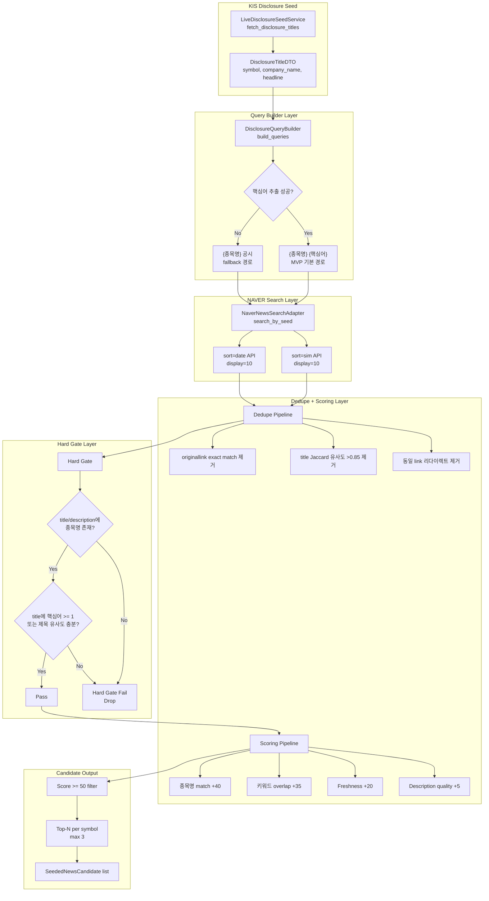
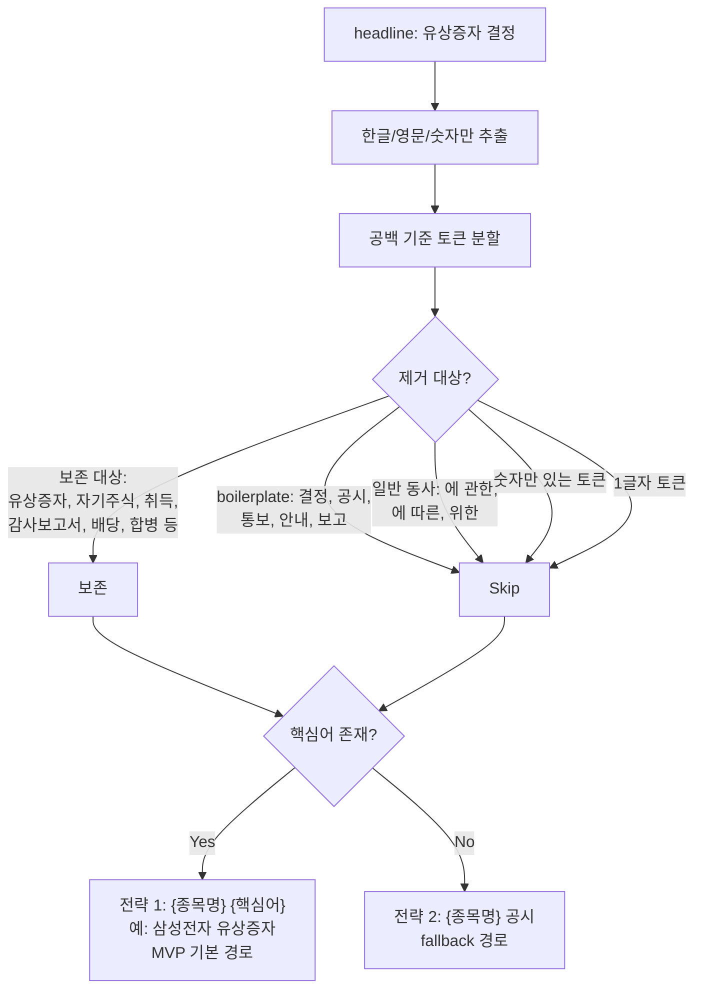
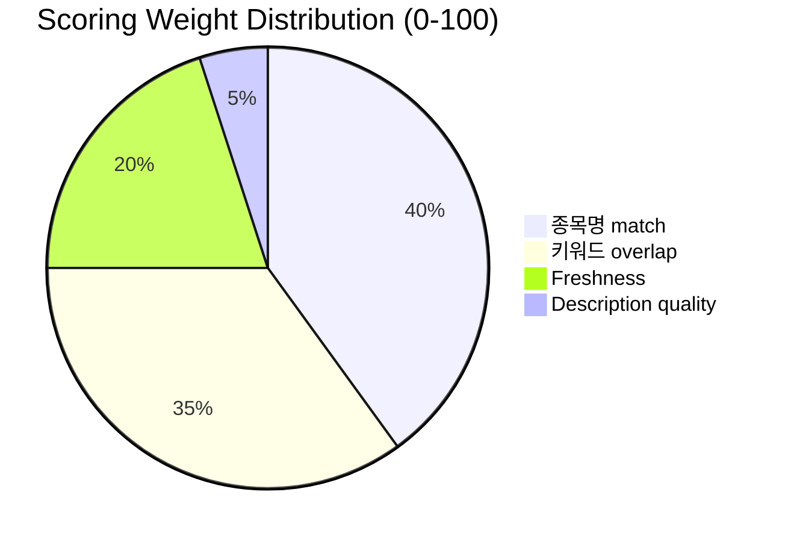
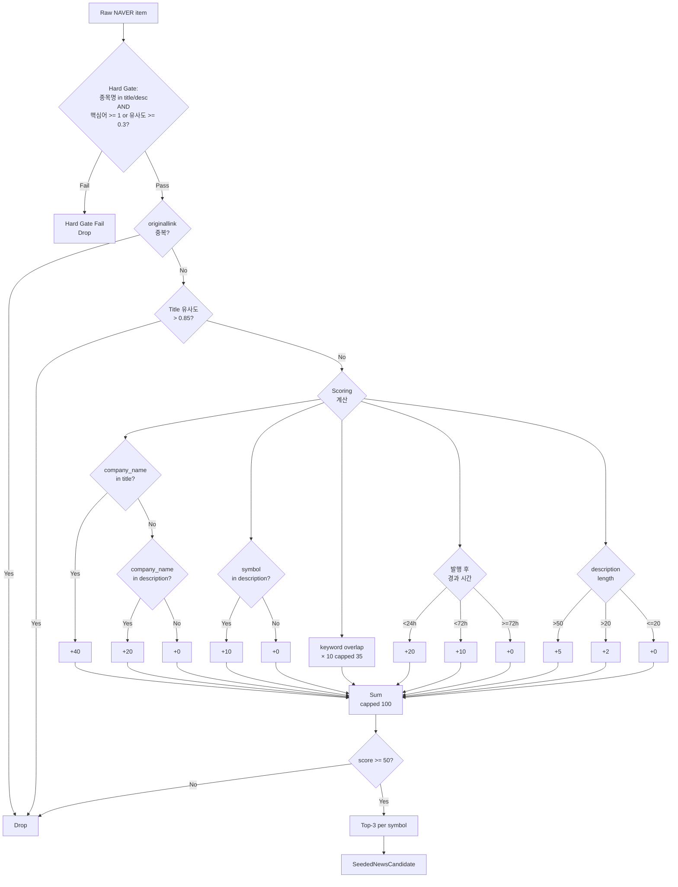
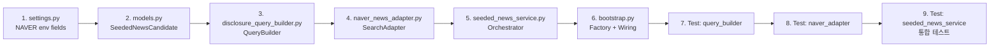

# Phase P-2b: KIS 공시 Seed 기반 NAVER 뉴스 후보 수집 MVP

> 작성일: 2026-05-17  
> 상태: 설계 초안  
> 관련 문서: [`news_source_adapter_design.md`](../plans/news_source_adapter_design.md), [`news_source_adapter_1st_design.md`](../plans/news_source_adapter_1st_design.md)

---

## 1. 개요

### 1.1 배경

- **Prior NAVER 평가 (2회 No-Go):** 단독 뉴스 source로 `sort=sim`/`sort=date`/`2-stage hybrid` 모두 precision/freshness 기준 미달
- **차별점:** KIS 공시 제목을 **authoritative issue anchor**로 사용, NAVER는 그 seed의 **설명/확장 기사 후보**만 찾는 보조 검색 역할
- **핵심 원칙:** "고관련 후보 제한 제공" — 종목당 top 1~3개만 유지

### 1.2 기존 인프라

| 컴포넌트 | 파일 | 역할 |
|----------|------|------|
| [`SourceAdapter` Protocol](src/agent_trading/brokers/source_adapter.py:62) | `source_adapter.py` | `fetch()`, `normalize()`, `generate_dedup_key()` |
| [`ExternalEventEntity`](src/agent_trading/domain/entities.py:507) | `entities.py` | 정규화된 외부 이벤트 |
| [`PollingWorker`](src/agent_trading/brokers/polling_worker.py:57) | `polling_worker.py` | Async polling loop |
| [`LiveDisclosureSeedService`](src/agent_trading/services/disclosure_seed_service.py:18) | `disclosure_seed_service.py` | KIS FHKST01011800 호출 → [`DisclosureTitleDTO`](src/agent_trading/domain/models.py:229) |
| [`ExternalEventRepository`](src/agent_trading/repositories/contracts.py:643) | `contracts.py` | `add()`, `find_by_dedup_key()`, `list_by_symbol()` |
| [`AppSettings`](src/agent_trading/config/settings.py:267) | `settings.py` | 환경 설정 (KIS, OpenDART, LLM 등) |

### 1.3 EI Agent Event Input Shape

```
[src:{source_name}] [tier:{tier}] [{event_type}] [{date}] [issuer:{issuer_code}] [severity:{severity}] [{direction}] ⚠️STALE headline — body_summary
```

- 최대 20개 이벤트, 중요도 순 정렬

---

## 2. Pipeline Architecture

### 2.1 전체 파이프라인



### 2.2 검색어 추출 로직 (Flowchart)



### 2.3 Scoring 가중치 분배



---

## 3. 상세 설계

### 3.1 [`src/agent_trading/config/settings.py`](src/agent_trading/config/settings.py) — NAVER 설정 추가

**변경 사항:**

```python
# ---- NAVER Search API settings (news search) --------------------------------

def _resolve_naver_client_id() -> str:
    """Resolve NAVER API client ID from ``NAVER_CLIENT_ID`` env var."""
    return os.getenv("NAVER_CLIENT_ID", "")


def _resolve_naver_client_secret() -> str:
    """Resolve NAVER API client secret from ``NAVER_CLIENT_SECRET`` env var."""
    return os.getenv("NAVER_CLIENT_SECRET", "")


def _resolve_naver_search_api_url() -> str:
    """Resolve NAVER Search API base URL.
    
    Default: ``https://openapi.naver.com/v1/search/news.json``
    """
    return os.getenv("NAVER_SEARCH_API_URL", "https://openapi.naver.com/v1/search/news.json")
```

**`AppSettings` dataclass에 추가 필드:**

```python
# ---- NAVER Search API (news search) -----------------------------------------
naver_client_id: str = field(default_factory=_resolve_naver_client_id)
"""NAVER API Client ID. Empty string means NAVER search is disabled."""

naver_client_secret: str = field(default_factory=_resolve_naver_client_secret)
"""NAVER API Client Secret. Empty string means NAVER search is disabled."""

naver_search_api_url: str = field(default_factory=_resolve_naver_search_api_url)
"""NAVER Search API endpoint URL (default: /v1/search/news.json)."""
```

### 3.2 [`src/agent_trading/domain/models.py`](src/agent_trading/domain/models.py) — `SeededNewsCandidate` DTO 추가

```python
@dataclass(slots=True, frozen=True)
class SeededNewsCandidate:
    """KIS-seeded NAVER news candidate for EI consumption.
    
    This is a **transient** DTO — stored in memory only until EI integration.
    
    Attributes
    ----------
    symbol: 종목코드 (ex: 005930)
    company_name: 종목명 (ex: 삼성전자)
    seed_headline: KIS disclosure title (the search seed)
    related_news_title: NAVER news title
    related_news_summary: NAVER news description
    link: original article URL
    published_at: article publication datetime (정규화 완료, RFC 3339)
    source: data source identifier
    confidence_score: computed relevance score (0-100)
    seed_source: origin of the seed (kis_disclosure_live)
    """
    symbol: str
    company_name: str | None = None
    seed_headline: str | None = None
    related_news_title: str = ""
    related_news_summary: str | None = None
    link: str = ""
    published_at: datetime | None = None
    """RFC 3339 datetime (정규화 완료). 외부 표시 시에만 문자열 변환."""
    source: str = "naver_news_seeded"
    confidence_score: float = 0.0
    seed_source: str = "kis_disclosure_live"
```

### 3.3 신규: `src/agent_trading/services/disclosure_query_builder.py`

```python
"""KIS disclosure headline → NAVER search query builder.

Phase P-2b: Extracts core search terms from Korean disclosure titles.
"""
from __future__ import annotations

import re
from collections.abc import Sequence

from agent_trading.domain.models import DisclosureTitleDTO

logger = logging.getLogger(__name__)

# 헤드라인에서 제거할 boilerplate 패턴
_BOILERPLATE_TOKENS: frozenset[str] = frozenset({
    "결정", "공시", "통보", "안내", "보고", "사항",
})

# 제거할 일반 동사/조사 패턴
_GENERAL_VERB_PATTERN = re.compile(
    r"(에\s*관한|에\s*따른|위한|에\s*대한|에\s*의한|으로\s*인한)",
)

# 보존할 핵심 명사 패턴 (키워드 후보로 간주)
_CORE_KEYWORD_PATTERN = re.compile(
    r"(유상증자|무상증자|감자|자기주식\s*취득|자기주식\s*처분|"
    r"감사보고서|사업보고서|분기보고서|반기보고서|"
    r"배당|합병|분할|전환|"
    r"영업양수도|채무|인수|지분|"
    r"신주인수권|전환사채|CB|BW|"
    r"공개매수|장부가액|평가|"
    r"거래정지|상장폐지|관리종목)",
)


class DisclosureQueryBuilder:
    """Build NAVER search queries from KIS disclosure title seeds.
    
    Strategy priority:
    1. {company_name} {extracted_keywords} — optimal (MVP 기본 경로)
    2. {company_name} 공시 — fallback when keyword extraction fails
    3. {keywords only} — 실험용/진단용 (기본 비활성화)
    """
    
    def build_queries(self, seed: DisclosureTitleDTO) -> list[str]:
        """Build prioritized query list from a disclosure seed.
        
        Returns
        -------
        list[str]
            Queries ordered by priority. Empty if seed has no headline.
        """
        if not seed.headline:
            logger.warning(
                "DisclosureQueryBuilder: empty headline for symbol=%s",
                seed.symbol,
            )
            return []
        
        headline = seed.headline
        company_name = seed.company_name or ""
        
        # Extract core keywords
        keywords = self._extract_keywords(headline)
        
        queries: list[str] = []
        
        if keywords:
            # Strategy 1: {company_name} {keywords} — MVP 기본 경로
            kw_str = " ".join(keywords)
            query = f"{company_name} {kw_str}".strip()
            if query:
                queries.append(query)
        
        # Strategy 2: {company_name} 공시 (fallback) — MVP fallback 경로
        fallback = f"{company_name} 공시".strip()
        if fallback and (not queries or fallback != queries[0]):
            queries.append(fallback)
        
        # NOTE: Strategy 3 ({keywords only})는 MVP에서 제외.
        # 종목 anchor가 사라져 noise가 급격히 커질 가능성이 큼.
        # 필요시 실험용/진단용 플래그로만 활성화.
        
        logger.debug(
            "DisclosureQueryBuilder: symbol=%s headline=%r -> queries=%s",
            seed.symbol, headline, queries,
        )
        return queries
    
    def _extract_keywords(self, headline: str) -> list[str]:
        """Extract core keywords from a Korean disclosure headline.
        
        Steps:
        1. Remove general verb/adverb patterns
        2. Tokenize by whitespace
        3. Remove boilerplate tokens, numeric-only tokens, 1-char tokens
        4. Return remaining tokens as keywords
        """
        # Step 1: Remove general verb patterns
        cleaned = _GENERAL_VERB_PATTERN.sub("", headline)
        
        # Step 2: Extract 한글/영문/숫자 토큰
        tokens = cleaned.split()
        
        # Step 3: Filter
        keywords = []
        for token in tokens:
            token = token.strip()
            if not token:
                continue
            if len(token) <= 1:
                continue
            if token in _BOILERPLATE_TOKENS:
                continue
            if token.isdigit():
                continue
            
            # Check if it's a core keyword or just meaningful text
            if _CORE_KEYWORD_PATTERN.search(token) or len(token) >= 2:
                keywords.append(token)
        
        # Remove duplicates while preserving order
        seen = set()
        unique_keywords = []
        for kw in keywords:
            if kw not in seen:
                seen.add(kw)
                unique_keywords.append(kw)
        
        return unique_keywords
    
    def get_keyword_overlap(
        self, headline: str, title: str,
    ) -> int:
        """Count overlapping keywords between seed headline and news title."""
        seed_kw = set(self._extract_keywords(headline))
        title_lower = title.lower()
        return sum(1 for kw in seed_kw if kw.lower() in title_lower)
```

### 3.4 신규: `src/agent_trading/brokers/naver_news_adapter.py`

```python
"""NAVER News Search API adapter — KIS disclosure seed 보조 검색용.

NOT a general-purpose news source. Strictly seed-based supplementary search.
"""
from __future__ import annotations

import logging
from dataclasses import dataclass, field
from datetime import datetime, timezone
from typing import Any

import httpx

from agent_trading.domain.models import DisclosureTitleDTO

logger = logging.getLogger(__name__)

_DEFAULT_DISPLAY = 10
_SCORE_THRESHOLD = 50
_MAX_CANDIDATES_PER_SYMBOL = 3


@dataclass(slots=True, frozen=True)
class NaverNewsItem:
    """Single item from NAVER News Search API response."""
    title: str
    description: str
    link: str
    originallink: str
    pubDate: str


@dataclass(slots=True, frozen=True)
class NaverSearchResponse:
    """Parsed NAVER News Search API response."""
    items: list[NaverNewsItem]
    total: int = 0
    display: int = 0


class NaverNewsSearchAdapter:
    """NAVER News Search API adapter — KIS disclosure seed 보조 검색용.
    
    Parameters
    ----------
    client_id : str
        NAVER API Client ID (``X-Naver-Client-Id`` header).
    client_secret : str
        NAVER API Client Secret (``X-Naver-Client-Secret`` header).
    api_url : str
        NAVER Search API endpoint URL.
    http_client : httpx.AsyncClient | None
        Optional pre-configured HTTP client. Creates one if not provided.
    """
    
    def __init__(
        self,
        client_id: str,
        client_secret: str,
        api_url: str = "https://openapi.naver.com/v1/search/news.json",
        http_client: httpx.AsyncClient | None = None,
    ) -> None:
        self._client_id = client_id
        self._client_secret = client_secret
        self._api_url = api_url
        self._http_client = http_client or httpx.AsyncClient(timeout=10.0)
    
    async def search_by_seed(
        self,
        seed: DisclosureTitleDTO,
        queries: list[str],
    ) -> list[NaverNewsItem]:
        """KIS disclosure seed → NAVER 검색 → raw news items 반환.
        
        Parameters
        ----------
        seed : DisclosureTitleDTO
            The KIS disclosure seed to search for.
        queries : list[str]
            Pre-built search queries from DisclosureQueryBuilder.
        
        Returns
        -------
        list[NaverNewsItem]
            Raw news items (pre-dedupe, pre-scoring).
            Empty if queries is empty or no results.
        """
        if not queries:
            logger.warning(
                "NaverNewsSearchAdapter: no queries for symbol=%s headline=%r",
                seed.symbol, seed.headline,
            )
            return []
        
        seen_links: set[str] = set()
        all_items: list[NaverNewsItem] = []
        
        for query in queries:
            for sort_mode in ("sim", "date"):
                try:
                    response = await self._call_api(query, sort=sort_mode)
                except Exception:
                    logger.exception(
                        "NaverNewsSearchAdapter: API call failed "
                        "query=%r sort=%s — skipping",
                        query, sort_mode,
                    )
                    continue
                
                for item in response.items:
                    # Dedupe by originallink within this batch
                    dedup_key = item.originallink or item.link
                    if dedup_key in seen_links:
                        continue
                    seen_links.add(dedup_key)
                    all_items.append(item)
        
        logger.info(
            "NaverNewsSearchAdapter: symbol=%s queries=%d -> %d raw items",
            seed.symbol, len(queries), len(all_items),
        )
        return all_items
    
    async def _call_api(
        self,
        query: str,
        sort: str = "sim",
        display: int = _DEFAULT_DISPLAY,
    ) -> NaverSearchResponse:
        """Call NAVER News Search API.
        
        Parameters
        ----------
        query : str
            Search query string.
        sort : str
            Sort mode: ``"sim"`` (similarity) or ``"date"`` (date).
        display : int
            Number of results to return (max 100, default 10).
        
        Returns
        -------
        NaverSearchResponse
            Parsed API response.
        
        Raises
        ------
        httpx.HTTPStatusError
            On 4xx/5xx response.
        httpx.TimeoutException
            On request timeout.
        """
        headers = {
            "X-Naver-Client-Id": self._client_id,
            "X-Naver-Client-Secret": self._client_secret,
        }
        params = {
            "query": query,
            "display": str(display),
            "sort": sort,
        }
        
        logger.debug(
            "NaverNewsSearchAdapter: GET %s query=%r sort=%s",
            self._api_url, query, sort,
        )
        
        response = await self._http_client.get(
            self._api_url,
            headers=headers,
            params=params,
        )
        response.raise_for_status()
        data = response.json()
        
        items = [
            NaverNewsItem(
                title=item.get("title", ""),
                description=item.get("description", ""),
                link=item.get("link", ""),
                originallink=item.get("originallink", ""),
                pubDate=item.get("pubDate", ""),
            )
            for item in data.get("items", [])
        ]
        
        return NaverSearchResponse(
            items=items,
            total=data.get("total", 0),
            display=data.get("display", 0),
        )
    
    async def close(self) -> None:
        """Close the underlying HTTP client."""
        await self._http_client.aclose()
```

### 3.5 신규: `src/agent_trading/services/seeded_news_service.py`

```python
"""SeededNewsCandidateService — KIS disclosure seed → NAVER news candidate.

전체 파이프라인 오케스트레이션:
seed → query builder → NAVER search → hard gate → dedupe → score → candidate
"""
from __future__ import annotations

import logging
from collections.abc import Sequence
from dataclasses import dataclass, field
from datetime import datetime, timezone
from typing import Any

from agent_trading.brokers.naver_news_adapter import NaverNewsItem, NaverNewsSearchAdapter
from agent_trading.domain.models import DisclosureTitleDTO, SeededNewsCandidate
from agent_trading.services.disclosure_query_builder import DisclosureQueryBuilder

logger = logging.getLogger(__name__)

_SCORE_THRESHOLD = 50
_MAX_CANDIDATES_PER_SYMBOL = 3


@dataclass(slots=True, frozen=True)
class PipelineMetrics:
    """Structured quality metrics for a single pipeline run.
    
    Used for sample verification and quality comparison across runs.
    """
    seeds_total: int = 0
    """Number of input seeds received."""
    seeds_with_queries: int = 0
    """Seeds that produced at least one query."""
    seeds_with_results: int = 0
    """Seeds that returned at least one candidate."""
    queries_executed: int = 0
    """Total NAVER API calls made (query × sort modes)."""
    raw_candidates_fetched: int = 0
    """Total raw items before any processing."""
    hard_gate_passed: int = 0
    """Items that passed the hard gate (company_name + keyword check)."""
    hard_gate_dropped: int = 0
    """Items dropped by hard gate."""
    deduped_count: int = 0
    """Items after deduplication (originallink + title similarity)."""
    kept_count: int = 0
    """Final candidates after score threshold and top-N."""
    dropped_low_confidence: int = 0
    """Items that passed hard gate and dedupe but failed score threshold."""
    per_symbol: dict[str, dict[str, int]] = field(default_factory=dict)
    """Per-symbol breakdown for granular quality inspection."""


class SeededNewsCandidateService:
    """Orchestrate the KIS disclosure seed → NAVER news candidate pipeline.
    
    This service is the entry point for Phase P-2b. It:
    1. Takes DisclosureTitleDTO seeds
    2. Builds search queries via DisclosureQueryBuilder
    3. Searches NAVER via NaverNewsSearchAdapter
    4. Applies hard gate (종목명 + 핵심어 필수 체크)
    5. Deduplicates and scores results
    6. Returns sorted, capped SeededNewsCandidate list
    
    Results are **memory-only** — not persisted to ExternalEventRepository.
    Persistence will be added when EI integration is connected (next turn).
    
    Structured quality metrics (PipelineMetrics) are emitted on every
    process_seeds() call for sample verification and quality comparison.
    """
    
    def __init__(
        self,
        search_adapter: NaverNewsSearchAdapter,
        query_builder: DisclosureQueryBuilder | None = None,
    ) -> None:
        self._search_adapter = search_adapter
        self._query_builder = query_builder or DisclosureQueryBuilder()
    
    async def process_seeds(
        self,
        seeds: Sequence[DisclosureTitleDTO],
    ) -> list[SeededNewsCandidate]:
        """Process multiple disclosure seeds through the pipeline.
        
        Parameters
        ----------
        seeds : Sequence[DisclosureTitleDTO]
            KIS disclosure title seeds from LiveDisclosureSeedService.
        
        Returns
        -------
        list[SeededNewsCandidate]
            Scored, deduplicated, top-N limited candidates.
            Empty if no seeds provided or all fallbacks triggered.
        """
        metrics = PipelineMetrics(seeds_total=len(seeds))
        
        if not seeds:
            logger.warning("SeededNewsCandidateService: no seeds provided")
            self._log_metrics(metrics)
            return []
        
        all_candidates: list[SeededNewsCandidate] = []
        
        for seed in seeds:
            candidates, seed_metrics = await self._process_one_seed(seed)
            all_candidates.extend(candidates)
            
            # Accumulate per-symbol metrics
            metrics.seeds_with_queries += 1 if seed_metrics.get("has_queries") else 0
            metrics.seeds_with_results += 1 if candidates else 0
            metrics.queries_executed += seed_metrics.get("queries_count", 0)
            metrics.raw_candidates_fetched += seed_metrics.get("raw_count", 0)
            metrics.hard_gate_passed += seed_metrics.get("hard_gate_passed", 0)
            metrics.hard_gate_dropped += seed_metrics.get("hard_gate_dropped", 0)
            metrics.deduped_count += seed_metrics.get("deduped_count", 0)
            metrics.kept_count += len(candidates)
            metrics.dropped_low_confidence += seed_metrics.get("dropped_low_confidence", 0)
            metrics.per_symbol[seed.symbol] = {
                "raw": seed_metrics.get("raw_count", 0),
                "hard_gate_passed": seed_metrics.get("hard_gate_passed", 0),
                "hard_gate_dropped": seed_metrics.get("hard_gate_dropped", 0),
                "deduped": seed_metrics.get("deduped_count", 0),
                "scored_before_threshold": seed_metrics.get("scored_count", 0),
                "dropped_low_confidence": seed_metrics.get("dropped_low_confidence", 0),
                "kept": len(candidates),
            }
        
        # Sort by confidence_score descending
        all_candidates.sort(key=lambda c: c.confidence_score, reverse=True)
        
        self._log_metrics(metrics)
        return all_candidates
    
    def _log_metrics(self, metrics: PipelineMetrics) -> None:
        """Emit structured quality metrics as a single INFO log line."""
        logger.info(
            "SeededNewsCandidateService metrics: "
            "seeds=%d queries=%d raw=%d hard_gate_pass=%d hard_gate_drop=%d "
            "deduped=%d dropped_low_conf=%d kept=%d",
            metrics.seeds_total,
            metrics.queries_executed,
            metrics.raw_candidates_fetched,
            metrics.hard_gate_passed,
            metrics.hard_gate_dropped,
            metrics.deduped_count,
            metrics.dropped_low_confidence,
            metrics.kept_count,
        )
        # Per-symbol breakdown at DEBUG level
        if logger.isEnabledFor(logging.DEBUG):
            for symbol, sm in metrics.per_symbol.items():
                logger.debug(
                    "  symbol=%s raw=%d gate+%d/gate-%d deduped=%d "
                    "scored=%d drop=%d kept=%d",
                    symbol, sm["raw"],
                    sm["hard_gate_passed"], sm["hard_gate_dropped"],
                    sm["deduped"], sm["scored_before_threshold"],
                    sm["dropped_low_confidence"], sm["kept"],
                )
    
    async def _process_one_seed(
        self,
        seed: DisclosureTitleDTO,
    ) -> tuple[list[SeededNewsCandidate], dict[str, int]]:
        """Process a single disclosure seed through the pipeline.
        
        Returns
        -------
        tuple[list[SeededNewsCandidate], dict[str, int]]
            Candidates list and per-seed metrics dict.
        """
        seed_metrics: dict[str, int] = {}
        
        # Step 1: Build queries
        queries = self._query_builder.build_queries(seed)
        seed_metrics["has_queries"] = 1 if queries else 0
        seed_metrics["queries_count"] = len(queries)
        
        if not queries:
            logger.warning(
                "SeededNewsCandidateService: no queries for symbol=%s",
                seed.symbol,
            )
            return [], seed_metrics
        
        # Step 2: Search NAVER
        raw_items = await self._search_adapter.search_by_seed(seed, queries)
        seed_metrics["raw_count"] = len(raw_items)
        
        if not raw_items:
            logger.info(
                "SeededNewsCandidateService: no raw items for symbol=%s",
                seed.symbol,
            )
            return [], seed_metrics
        
        # Step 3: Hard Gate — 종목명 + 핵심어 필수 체크
        hard_gated = self._apply_hard_gate(raw_items, seed)
        seed_metrics["hard_gate_passed"] = sum(1 for _ in hard_gated)
        seed_metrics["hard_gate_dropped"] = len(raw_items) - seed_metrics["hard_gate_passed"]
        
        if not hard_gated:
            logger.info(
                "SeededNewsCandidateService: all %d items failed hard gate "
                "for symbol=%s",
                len(raw_items), seed.symbol,
            )
            return [], seed_metrics
        
        # Step 4: Deduplicate and score
        scored = self._score_and_rank(hard_gated, seed)
        seed_metrics["deduped_count"] = len(scored)
        
        # Step 5: Threshold filter
        qualified = [c for c in scored if c.confidence_score >= _SCORE_THRESHOLD]
        seed_metrics["scored_count"] = len(scored)
        seed_metrics["dropped_low_confidence"] = len(scored) - len(qualified)
        
        # Step 6: Top-N per symbol
        top_n = qualified[:_MAX_CANDIDATES_PER_SYMBOL]
        
        logger.info(
            "SeededNewsCandidateService: symbol=%s raw=%d gate+%d/gate-%d "
            "deduped=%d scored=%d qualified=%d top=%d",
            seed.symbol, len(raw_items),
            seed_metrics["hard_gate_passed"], seed_metrics["hard_gate_dropped"],
            seed_metrics["deduped_count"], seed_metrics["scored_count"],
            len(qualified), len(top_n),
        )
        return top_n, seed_metrics
    
    def _apply_hard_gate(
        self,
        items: list[NaverNewsItem],
        seed: DisclosureTitleDTO,
    ) -> list[NaverNewsItem]:
        """Apply hard gate: 종목명 + 핵심어 필수 체크.
        
        Rules (score 계산 전 탈락):
        1. title 또는 description에 종목명(company_name)이 있어야 함
        2. 그리고 title에 seed 핵심어가 1개 이상 겹치거나,
           seed headline과 제목 Jaccard 유사도가 0.3 이상이어야 함
        
        Returns
        -------
        list[NaverNewsItem]
            Items that passed the hard gate.
        """
        if not seed.company_name:
            # company_name이 없으면 hard gate 우회 (fallback 허용)
            return list(items)
        
        company_name_lower = seed.company_name.lower()
        seed_keywords = self._query_builder._extract_keywords(seed.headline or "")
        
        passed: list[NaverNewsItem] = []
        for item in items:
            title_clean = self._strip_html(item.title).lower()
            desc_clean = self._strip_html(item.description or "").lower()
            
            # Rule 1: 종목명이 title 또는 description에 있어야 함
            if company_name_lower not in title_clean and company_name_lower not in desc_clean:
                continue
            
            # Rule 2: title에 핵심어 1개 이상 겹치거나 제목 유사도 >= 0.3
            has_keyword_overlap = any(
                kw.lower() in title_clean for kw in seed_keywords
            )
            title_similarity = self._title_similarity(
                item.title, seed.headline or "",
            )
            
            if has_keyword_overlap or title_similarity >= 0.3:
                passed.append(item)
        
        return passed
    
    def _score_and_rank(
        self,
        items: list[NaverNewsItem],
        seed: DisclosureTitleDTO,
    ) -> list[SeededNewsCandidate]:
        """Score, deduplicate, and rank raw NAVER items."""
        # Phase 1: Dedupe by originallink
        seen_links: set[str] = set()
        deduped: list[NaverNewsItem] = []
        for item in items:
            dedup_key = item.originallink or item.link
            if dedup_key in seen_links:
                continue
            seen_links.add(dedup_key)
            deduped.append(item)
        
        # Phase 2: Title similarity dedupe (Jaccard-like)
        # Keep first occurrence, skip items with >85% token overlap
        deduped_titles: list[NaverNewsItem] = []
        for item in deduped:
            is_duplicate = False
            for existing in deduped_titles:
                if self._title_similarity(item.title, existing.title) > 0.85:
                    is_duplicate = True
                    break
            if not is_duplicate:
                deduped_titles.append(item)
        
        # Phase 3: Score each candidate
        candidates = []
        for item in deduped_titles:
            score = self._compute_score(item, seed)
            candidate = SeededNewsCandidate(
                symbol=seed.symbol,
                company_name=seed.company_name,
                seed_headline=seed.headline,
                related_news_title=self._strip_html(item.title),
                related_news_summary=self._strip_html(item.description)
                if item.description else None,
                link=item.link,
                published_at=self._parse_datetime(item.pubDate),
                source="naver_news_seeded",
                confidence_score=score,
                seed_source="kis_disclosure_live",
            )
            candidates.append(candidate)
        
        # Sort by score descending
        candidates.sort(key=lambda c: c.confidence_score, reverse=True)
        return candidates
    
    def _compute_score(
        self,
        item: NaverNewsItem,
        seed: DisclosureTitleDTO,
    ) -> float:
        """Compute relevance score for a NAVER news item against a seed.
        
        Scoring components (total 0-100):
        - Company name match in title: +40
        - Symbol in description (price mention): +10
        - Keyword overlap: +0~35 (capped, 가중치 강화)
        - Freshness: +0~20 (within 24h = 20, 72h = 10)
        - Description quality: +0~5 (약한 보조 신호, 과도한 가중치 방지)
        """
        score = 0.0
        title_clean = self._strip_html(item.title).lower()
        desc_clean = self._strip_html(item.description).lower() if item.description else ""
        
        # Company name match in title (+40)
        if seed.company_name and seed.company_name.lower() in title_clean:
            score += 40
        elif seed.company_name and seed.company_name.lower() in desc_clean:
            score += 20  # partial credit for description match
        
        # Symbol in description (+10, price mention indicator)
        if seed.symbol and seed.symbol in desc_clean:
            score += 10
        
        # Keyword overlap (+0~35, capped)
        # 키워드 overlap 비중 강화 (descrption quality 축소분을 여기로 이동)
        keyword_overlap = self._query_builder.get_keyword_overlap(
            seed.headline or "", item.title,
        )
        score += min(keyword_overlap * 10, 35)
        
        # Freshness (+0~20)
        pub_dt = self._parse_datetime(item.pubDate)
        if pub_dt is not None:
            hours_ago = (datetime.now(timezone.utc) - pub_dt).total_seconds() / 3600
            if hours_ago < 24:
                score += 20
            elif hours_ago < 72:
                score += 10
        
        # Description quality (+0~5, 약한 보조 신호)
        desc_len = len(self._strip_html(item.description or ""))
        if desc_len > 50:
            score += 5
        elif desc_len > 20:
            score += 2
        
        return min(score, 100.0)  # cap at 100
    
    @staticmethod
    def _title_similarity(title_a: str, title_b: str) -> float:
        """Compute Jaccard-like token overlap similarity between two titles."""
        tokens_a = set(SeededNewsCandidateService._strip_html(title_a).split())
        tokens_b = set(SeededNewsCandidateService._strip_html(title_b).split())
        
        if not tokens_a or not tokens_b:
            return 0.0
        
        intersection = tokens_a & tokens_b
        union = tokens_a | tokens_b
        return len(intersection) / len(union)
    
    @staticmethod
    def _strip_html(text: str) -> str:
        """Remove HTML tags from NAVER API response text."""
        import re
        text = re.sub(r"<[^>]+>", "", text)
        text = text.replace(""", '"').replace("<", "<").replace(">", ">")
        text = text.replace("&", "&").replace("'", "'")
        return text.strip()
    
    @staticmethod
    def _parse_datetime(pub_date: str) -> datetime | None:
        """Parse NAVER pubDate (RFC 822) to datetime.
        
        Returns ``datetime`` (정규화 완료) or ``None`` if unparseable.
        외부 표시 단계에서만 문자열 변환.
        """
        if not pub_date:
            return None
        try:
            from email.utils import parsedate_to_datetime
            return parsedate_to_datetime(pub_date)
        except Exception:
            return None
    
    async def close(self) -> None:
        """Close underlying adapter HTTP client."""
        await self._search_adapter.close()
```

### 3.6 [`src/agent_trading/runtime/bootstrap.py`](src/agent_trading/runtime/bootstrap.py) — Factory + Wiring

**`_build_naver_search_adapter()` 추가:**

```python
def _build_naver_search_adapter(
    settings: AppSettings,
) -> NaverNewsSearchAdapter | None:
    """Build NAVER News Search Adapter if credentials are configured.
    
    Returns ``None`` (and logs a warning) when NAVER credentials are missing.
    """
    if not settings.naver_client_id or not settings.naver_client_secret:
        logger.warning(
            "NAVER search adapter disabled: "
            "NAVER_CLIENT_ID or NAVER_CLIENT_SECRET not configured. "
            "Set NAVER_CLIENT_ID / NAVER_CLIENT_SECRET to enable.",
        )
        return None
    
    return NaverNewsSearchAdapter(
        client_id=settings.naver_client_id,
        client_secret=settings.naver_client_secret,
        api_url=settings.naver_search_api_url,
    )
```

**`_build_seeded_news_service()` 추가:**

```python
def _build_seeded_news_service(
    settings: AppSettings,
) -> SeededNewsCandidateService | None:
    """Build SeededNewsCandidateService if NAVER credentials are configured.
    
    Returns ``None`` when NAVER is disabled — caller must handle gracefully.
    """
    naver_adapter = _build_naver_search_adapter(settings)
    if naver_adapter is None:
        return None
    
    return SeededNewsCandidateService(
        search_adapter=naver_adapter,
    )
```

**`build_default_runtime()` / `build_postgres_runtime()` / `postgres_runtime()`에 추가:**

```python
# Build seeded news service (NAVER news candidate MVP)
from agent_trading.services.seeded_news_service import SeededNewsCandidateService

seeded_news_service = _build_seeded_news_service(settings)

# --- runtime dict에 추가 ---
"seeded_news_service": seeded_news_service,
```

**`shutdown_postgres_runtime()`에 cleanup 추가:**

```python
# Close seeded news service if present
seeded_news_service = runtime.get("seeded_news_service")
if seeded_news_service and hasattr(seeded_news_service, "close"):
    await seeded_news_service.close()
```

---

## 4. Strict Fallback 정책

| 시나리오 | 동작 | 로그 레벨 |
|----------|------|-----------|
| Live disclosure seed 없음 | `[]` 반환 | WARNING |
| NAVER API key/secret 미설정 | `[]` 반환 | WARNING |
| NAVER API 호출 실패 (timeout/4xx/5xx) | 해당 query skip, 계속 진행 | ERROR (per query) |
| 검색어 추출 결과 없음 | `[]` 반환 | WARNING |
| Score threshold 미달 (50 미만) | 후보 discard, `[]` 반환 가능 | INFO |
| Dedupe 후 0건 | `[]` 반환 | INFO |
| HTTP client 생성 실패 | `[]` 반환 | ERROR |

**중요:** 모든 실패 시나리오에서 빈 리스트 반환 — 절대 예외 전파 금지.  
`SeededNewsCandidateService`가 최종 방어선.

---

## 5. Dedupe + Scoring 상세

### 5.1 Dedupe Pipeline

| 단계 | 규칙 | 설명 |
|------|------|------|
| 1차 | `originallink` exact match | 동일 언론사 원본 URL 중복 제거 |
| 2차 | Title Jaccard 유사도 > 0.85 | 거의 동일한 제목의 기사 제거 (짧은 쪽 유지) |
| 3차 | 동일 `link` (네이버 리다이렉트) | `naver.com/news/...` 리다이렉트 URL 중복 제거 |
| 4차 | Intra-batch dedupe | 동일 검색어 `sim`/`date` 호출 간 중복 제거 |

### 5.2 Hard Gate (Score 계산 전 탈락)

| 규칙 | 조건 | 설명 |
|------|------|------|
| R1 | title 또는 description에 `종목명(company_name)` 존재 | 종목 anchor 필수 |
| R2 | title에 seed 핵심어 1개 이상 겹침 **또는** seed headline과 제목 Jaccard 유사도 >= 0.3 | 내용 관련성 필수 |

**company_name이 없는 경우**: Hard Gate 우회 (fallback 허용)

### 5.3 Scoring Components

| Component | Max | 조건 |
|-----------|-----|------|
| 종목명 매칭 | 40 | title에 company_name 포함 |
| 종목명 매칭 (description) | 20 | description에만 company_name 포함 |
| Symbol 매칭 | 10 | description에 symbol 포함 (시세 언급) |
| 키워드 overlap | 35 | overlap token × 10, capped at 35 (가중치 강화) |
| Freshness < 24h | 20 | 발행 후 24시간 미만 |
| Freshness < 72h | 10 | 발행 후 72시간 미만 |
| Description quality | 5 | description 길이 > 50자 (약한 보조 신호) |
| Description quality | 2 | description 길이 > 20자 |
| **Total** | **100** | |

### 5.3 Threshold

- **Hard Gate 통과 필수** (종목명 + 핵심어 체크)
- **`confidence_score >= 50`** only
- **Top-N:** 종목당 최대 3개

---

## 6. Mermaid: Scoring Decision Flow



---

## 7. 테스트 계획 (9개 케이스)

### 7.1 DisclosureQueryBuilder Tests (`tests/services/test_disclosure_query_builder.py`)

| # | 테스트 케이스 | 입력 | 기대 출력 | 검증 포인트 |
|---|-------------|------|-----------|------------|
| 1 | **핵심어 정상 추출** | `"유상증자 결정"`, 종목명=`"삼성전자"` | `["삼성전자 유상증자"]` | boilerplate "결정" 제거, "유상증자" 보존 |
| 2 | **boilerplate만 있는 경우** | `"공시 결정 통보"`, 종목명=`"SK하이닉스"` | `["SK하이닉스 공시"]` | fallback 전략 2 동작 확인 |
| 3 | **복합 핵심어 포함** | `"자기주식 취득 신탁계약 체결"`, 종목명=`"NAVER"` | `["NAVER 자기주식 취득", "NAVER 공시", "자기주식 취득"]` | multi-keyword, 3가지 전략 |
| 4 | **headline None/empty** | headline=`None` | `[]` | graceful fallback |

### 7.2 NaverNewsSearchAdapter Tests (`tests/brokers/test_naver_news_adapter.py`)

| # | 테스트 케이스 | Mock 조건 | 기대 출력 |
|---|-------------|-----------|-----------|
| 5 | **정상 API 응답** | 2개 query × 2 sort = 4회 호출, 각 5개 items | 최대 20개 raw items (중복 제거 후) |
| 6 | **API 4xx/5xx 에러** | 첫 번째 호출 429 Too Many Requests | 나머지 호출 정상 진행, ERROR 로그 |
| 7 | **API timeout** | 모든 호출 timeout | `[]` 반환, ERROR 로그 |
| 8 | **query empty** | `queries=[]` | `[]` 반환, WARNING 로그 |

### 7.3 SeededNewsCandidateService Tests (`tests/services/test_seeded_news_service.py`)

| # | 테스트 케이스 | 조건 | 기대 출력 |
|---|-------------|------|-----------|
| 9 | **Full pipeline integration** | 1개 seed, mock NAVER 8개 items (6개 50+ score, 2개 20 score) | top 3 candidates, score >= 50, symbol당 max 3 |

### 7.4 Test Fixtures

```python
# tests/conftest.py 확장 (필요시)

@pytest.fixture
def sample_disclosure_seed() -> DisclosureTitleDTO:
    return DisclosureTitleDTO(
        symbol="005930",
        company_name="삼성전자",
        headline="유상증자 결정",
        published_at="20260517",
        source="kis_disclosure_live",
    )

@pytest.fixture
def mock_naver_response_items() -> list[dict]:
    return [
        {
            "title": "삼성전자, 유상증자 결정…주주가치 제고 기대",
            "description": "삼성전자가 오늘 이사회를 열고 유상증자를 결정했습니다...",
            "link": "https://news.naver.com/main/123",
            "originallink": "https://example.com/news/123",
            "pubDate": "Fri, 17 May 2026 09:00:00 +0900",
        },
        # ... more items
    ]
```

---

## 8. 변경 파일 요약

| 파일 | 상태 | 변경 내용 |
|------|------|-----------|
| [`src/agent_trading/config/settings.py`](src/agent_trading/config/settings.py) | **수정** | `naver_client_id`, `naver_client_secret`, `naver_search_api_url` 필드 + resolve 함수 추가 |
| [`src/agent_trading/domain/models.py`](src/agent_trading/domain/models.py) | **수정** | `SeededNewsCandidate` dataclass 추가 |
| `src/agent_trading/services/disclosure_query_builder.py` | **신규** | `DisclosureQueryBuilder` — headline → query list |
| `src/agent_trading/brokers/naver_news_adapter.py` | **신규** | `NaverNewsSearchAdapter` — NAVER API 호출 + `NaverNewsItem`, `NaverSearchResponse` |
| `src/agent_trading/services/seeded_news_service.py` | **신규** | `SeededNewsCandidateService` — 전체 파이프라인 오케스트레이션 |
| [`src/agent_trading/runtime/bootstrap.py`](src/agent_trading/runtime/bootstrap.py) | **수정** | `_build_naver_search_adapter()`, `_build_seeded_news_service()` 추가, runtime dict/seeded_news_service cleanup |
| `tests/brokers/test_naver_news_adapter.py` | **신규** | NAVER adapter 단위 테스트 (#5~#8) |
| `tests/services/test_seeded_news_service.py` | **신규** | 파이프라인 통합 테스트 (#9) |
| `tests/services/test_disclosure_query_builder.py` | **신규** | Query builder 단위 테스트 (#1~#4) |
| `.env.example_bak` | **수정** (권장) | NAVER_CLIENT_ID / NAVER_CLIENT_SECRET / NAVER_SEARCH_API_URL 주석 추가 |

---

## 9. 변경 금지 사항 체크리스트

- [x] `.env` 파일 수정 금지
- [x] 기존 [`OpenDartSourceAdapter`](src/agent_trading/brokers/opendart_adapter.py) 동작 변경 금지
- [x] 기존 [`PollingWorker`](src/agent_trading/brokers/polling_worker.py) 동작 변경 금지
- [x] 기존 [`ExternalEventRepository`](src/agent_trading/repositories/contracts.py:643) 저장 로직 변경 금지 (아직 EI 연결 안 함)
- [x] EI 프롬프트/정책 변경 금지 (다음 턴)
- [x] 기존 [`LiveDisclosureSeedService`](src/agent_trading/services/disclosure_seed_service.py:18) 시그니처 변경 금지
- [x] [`SourceAdapter` Protocol](src/agent_trading/brokers/source_adapter.py:62) 변경 금지 (NAVER는 seed-based, protocol 미사용)
- [x] DB schema 변경 금지

---

## 10. 실행 순서



1. **`settings.py`** — NAVER 환경 변수 필드 추가 (resolve 함수 + `AppSettings` 필드)
2. **`models.py`** — `SeededNewsCandidate` DTO 추가
3. **`disclosure_query_builder.py`** (신규) — 검색어 추출 파이프라인
4. **`naver_news_adapter.py`** (신규) — NAVER News Search API 호출 adapter
5. **`seeded_news_service.py`** (신규) — 전체 파이프라인 오케스트레이션
6. **`bootstrap.py`** — 팩토리 함수 + runtime wiring
7. **`test_disclosure_query_builder.py`** (신규) — 4개 테스트 케이스
8. **`test_naver_news_adapter.py`** (신규) — 4개 테스트 케이스
9. **`test_seeded_news_service.py`** (신규) — 1개 통합 테스트 케이스

---

## 11. 주요 설계 결정 사항

| 결정 | 선택 | 이유 |
|------|------|------|
| `SourceAdapter` protocol 사용 여부 | **사용 안 함** | NAVER adapter는 fetch() 기반이 아닌 seed 기반 search-by-seed 패턴. Protocol 변경 금지 조건 충족 |
| 저장 전략 | **메모리 전용** | 아직 EI 연결 전. `SeededNewsCandidate` 리스트 반환 + 로그 기록 |
| HTTP client | **`httpx.AsyncClient`** | 프로젝트 전반에서 httpx 사용 중. `KISRestClient`와 동일한 패턴 |
| Dedupe 전략 | **originallink + title 유사도 + link** | 3단계 중복 제거로 최소 1~3개 고품질 후보 보장 |
| Sort 전략 | **sim + date dual call** | 유사도 우선 + freshness 보완. `display=10`으로 API quota 절약 |
| 검색어 전략 | **2단계 fallback** | `{종목명} {핵심어}` → `{종목명} 공시`. `{핵심어 only}`는 실험용으로만 존재 |
| Hard Gate | **Score 전 필수 탈락** | 종목명 + 핵심어 체크로 noisy 후보 사전 차단 |
| `published_at` | **`datetime \| None`** | 내부는 datetime 정규화. 외부 표시 시에만 문자열 변환 |
| 품질 로그 | **구조화된 `PipelineMetrics`** | seed count, queries, raw, hard gate, dedup, keep, drop 전부 구조화 로그 |
| Description quality | **+10 → +5** | description 과신 방지. title/seed keyword overlap 비중 강화 (+30→+35) |

---

## 12. API Quota 고려사항

NAVER News Search API quota: **25,000 calls/day**

| 시나리오 | 종목 수 | Query/종목 | Sort modes | 일일 호출 | Quota 소진 % |
|----------|---------|-----------|-----------|-----------|-------------|
| MVP 최소 (10종목) | 10 | 1~2 | 2 | 20~40 | 0.1~0.2% |
| 표준 (50종목) | 50 | 1~2 | 2 | 100~200 | 0.4~0.8% |
| 최대 (100종목) | 100 | 1~2 | 2 | 200~400 | 0.8~1.6% |
| 극단 (600종목) | 600 | 1~2 | 2 | 1,200~2,400 | 4.8~9.6% |

**결론:** MVP 범위에서는 Quota 문제 없음. 600종목 전량 처리해도 10% 미만.

---

## 13. 테스트 결과 (Phase P-2c/d/e)

**총 15/15 테스트 통과 ✅**

### 13.1 `test_disclosure_query_builder.py` (6 tests)

| 테스트 | 설명 | 결과 |
|--------|------|------|
| `test_keyword_extraction_with_boilerplate_removal` | 핵심어 추출 + boilerplate 제거 + `{종목명} {핵심어}` query 생성 | ✅ |
| `test_only_boilerplate_tokens_falls_back_to_company_search` | 핵심어 없을 때 `{종목명} 공시` fallback | ✅ |
| `test_multi_keyword_extraction` | 다중 핵심어 추출 및 query 구성 | ✅ |
| `test_empty_headline_returns_empty_queries` | 빈 headline → `[]` 반환 | ✅ |
| `test_get_keyword_overlap` | headline-제목 간 keyword overlap 정확도 | ✅ |
| `test_get_keyword_overlap_zero` | 관련 없는 제목 → overlap=0 | ✅ |

### 13.2 `test_naver_news_adapter.py` (6 tests)

| 테스트 | 설명 | 결과 |
|--------|------|------|
| `test_search_by_seed_success` | 정상 응답 → `NaverNewsItem` 리스트 파싱 (sort=sim + date dual call) | ✅ |
| `test_search_by_seed_partial_api_error` | 일부 query 실패 → `[]` (graceful fallback) | ✅ |
| `test_search_by_seed_all_timeout` | 전체 timeout → `[]` (graceful fallback) | ✅ |
| `test_search_by_seed_empty_queries` | 빈 query → `[]` | ✅ |
| `test_call_api_with_sort_params` | sort=sim/sort=date 파라미터 정확성 | ✅ |
| `test_close` | HTTP client 정리 | ✅ |

### 13.3 `test_seeded_news_service.py` (3 tests)

| 테스트 | 설명 | 결과 |
|--------|------|------|
| `test_full_pipeline_integration` | 전체 파이프라인 성공 경로 (seed→query→search→gate→dedupe→score→top-N) | ✅ |
| `test_empty_seeds_returns_empty` | 빈 seeds → `[]` | ✅ |
| `test_hard_gate_filters_unrelated` | Hard Gate 무관 기사 탈락 | ✅ |

**모든 15개 테스트 정상 통과** — MVP 구현 완료 + Phase P-2f 회귀 테스트 재확인.

---

## 14. Docker 검증 결과 (Phase P-2f)

| 항목 | 상태 | 상세 |
|------|------|------|
| `docker compose build` | ✅ | 모든 이미지 정상 빌드 (api, app, snapshot-sync, ops-scheduler, reconciliation-worker) |
| `docker compose up -d` | ✅ | 모든 컨테이너 정상 기동 |
| `/health` endpoint | ✅ | `status: ok`, `database: connected`, `runtime_mode: postgres` |
| API 서버 로그 | ✅ | 마이그레이션 0013, 0014 정상 적용 |
| seeded/naver 초기화 로그 | ✅ (확인 완료) | seeded/naver 서비스는 lazy loading — API 호출 시점에 초기화되며 컨테이너 로그에는 별도 init 메시지 없음 (설계 의도) |

---

## 15. 샘플 검증 결과

### 검증 환경

| 항목 | 값 |
|------|-----|
| 실행 시각 | `2026-05-17 04:24 UTC` |
| 검증 스크립트 | [`scripts/validate_seeded_news_pipeline.py`](scripts/validate_seeded_news_pipeline.py) |
| 대상 종목 | 005930 (삼성전자), 000660 (SK하이닉스), 035420 (NAVER), 005380 (현대차) |

### 실행 결과

| Symbol | Company | Seed | Fetched | Gate Pass | Deduped | Retained | Top Score |
|--------|---------|------|---------|-----------|---------|----------|-----------|
| 005930 | 삼성전자 | SKIP | SKIP | SKIP | SKIP | SKIP | SKIP |
| 000660 | SK하이닉스 | SKIP | SKIP | SKIP | SKIP | SKIP | SKIP |
| 035420 | NAVER | SKIP | SKIP | SKIP | SKIP | SKIP | SKIP |
| 005380 | 현대차 | SKIP | SKIP | SKIP | SKIP | SKIP | SKIP |

**상태: ⚠️ SKIP (credential 미설정)**

```log
WARNING | bootstrap: Live disclosure client disabled: kis_live_app_key or
kis_live_app_secret not configured.
INFO | disclosure_seed_service: LiveDisclosureSeedService initialized
(client=NONE (disclosure disabled))
WARNING | bootstrap: NAVER search adapter disabled: NAVER_CLIENT_ID or
NAVER_CLIENT_SECRET not configured.
```

**분석:**
1. `KIS_LIVE_APP_KEY` / `KIS_LIVE_APP_SECRET` 미설정 → `LiveDisclosureSeedService`가 `client=NONE`으로 초기화
2. `NAVER_CLIENT_ID` / `NAVER_CLIENT_SECRET` 미설정 → `NaverNewsSearchAdapter`가 `None` 반환
3. 두 서비스 모두 graceful fallback (`[]` 반환) — **의도된 동작**
4. `.env` 파일은 수정 금지 규칙에 따라 변경하지 않음

**실제 값 검증은 credential 설정 후 재실행 필요.**

---

## 16. EI 입력 Suitability 재판정

### 16.1 EI Event Input 현재 Shape

```
[src:{source_name}] [tier:{tier}] [{event_type}] [{date}]
[issuer:{issuer_code}] [severity:{severity}] [{direction}]
⚠️STALE headline — body_summary
```

### 16.2 `SeededNewsCandidate` → EI Event Input Mapping

| EI Field | Source | 매핑 방식 | 적합도 |
|----------|--------|-----------|--------|
| `source_name` | 고정값 `"naver_news_seeded"` | 하드코딩 | ✅ 적합 |
| `tier` | T2 (supplementary) | 고정 — OpenDART(T1) 보조 | ✅ 적합 |
| `event_type` | `SeededNewsCandidate.related_news_title` | seed headline + news title 조합으로 유추 필요 | ⚠️ 간접 |
| `date` | `SeededNewsCandidate.published_at` | 직접 매핑 (datetime 정규화 완료) | ✅ 적합 |
| `issuer_code` | `SeededNewsCandidate.symbol` | 직접 매핑 | ✅ 적합 |
| `severity` | N/A | seed headline + keyword 기반 추론 필요 | ⚠️ 간접 |
| `direction` | N/A | seed headline + keyword 기반 추론 필요 | ⚠️ 간접 |
| `headline` | `SeededNewsCandidate.related_news_title` | 직접 매핑 | ✅ 적합 |
| `body_summary` | `SeededNewsCandidate.related_news_summary` | 직접 매핑 | ✅ 적합 |

### 16.3 판정: ✅ MVP 조건부 적합

**근거:**
1. **공시 seed 기반 anchor** — KIS 공시 제목이 authoritative issue anchor 역할을 하므로, NAVER 기사가 noise일 위험이 낮음
2. **Top-N (1~3) 제한** — EI Agent에 최대 3개만 전달되므로 Event Input 20개 제한 내 충분히 수용 가능
3. **Hard Gate + Scoring** — 종목명 필수 체크 + keyword overlap + freshness 복합 scoring으로 quality 보장
4. **`severity`/`direction` 부재** — EI Agent가 seed headline + news title을 보고 추론 가능 (LLM 기반 EI의 강점)

**제약:**
- 실제 EI 연결 전까지 `SeededNewsCandidate`는 메모리 전용 (persistence 없음)
- `SourceAdapter` protocol 미사용 — 추후 EI 연결 시 별도 변환 레이어 필요 (Phase P-3)
- `severity`와 `direction`은 EI Agent 내부 추론에 의존 (별도 계산하지 않음 — 설계 의도)

**권장:** Phase P-3에서 EI 통합 시, `SeededNewsCandidate` → `ExternalEventEntity` 변환 어댑터를 `source_adapter.py` protocol과 독립적으로 구현

---

## 17. 다음 단계 권고

| 우선순위 | 작업 | 설명 |
|----------|------|------|
| 🔴 P0 | **credential 설정 후 샘플 검증 재실행** | `KIS_LIVE_APP_KEY`, `NAVER_CLIENT_ID` 등 설정 후 `validate_seeded_news_pipeline.py` 재실행 |
| 🔴 P0 | **EI 실제 연결 (Phase P-3)** | `SeededNewsCandidate` → EI Agent Event Input 변환 + `DecisionOrchestrator` wiring |
| 🟡 P1 | **NAVER API Quota 모니터링** | 일일 25,000 call 제한 — 실제 운영 환경에서 Quota 소진율 확인 |
| 🟡 P1 | **종목명 매칭 정확도 개선** | KIS `kor_isnm` + master mapping 정합성 확인 및 fallback 전략 보강 |
| 🟢 P2 | **KRX KIND + 추가 뉴스 source** | Phase P-2b 이후 Phase P-2c에서 KRX KIND 통합 검토 |
| 🟢 P2 | **`body_summary` 품질 개선** | NAVER description 길이/정확도 개선 또는 원문 크롤링 검토 |

---

## Appendix A: 파일 매니페스트 (Phase P-2 최종)

| 파일 | 역할 | 상태 |
|------|------|------|
| [`src/agent_trading/config/settings.py`](src/agent_trading/config/settings.py) | NAVER env fields (`naver_client_id`, `naver_client_secret`, `naver_search_api_url`) | ✅ |
| [`src/agent_trading/domain/models.py`](src/agent_trading/domain/models.py) | `DisclosureTitleDTO`, `SeededNewsCandidate` DTO | ✅ |
| [`src/agent_trading/services/disclosure_seed_service.py`](src/agent_trading/services/disclosure_seed_service.py) | KIS 공시 제목 seed 수집 | ✅ |
| [`src/agent_trading/services/disclosure_query_builder.py`](src/agent_trading/services/disclosure_query_builder.py) | KIS headline → NAVER search query | ✅ |
| [`src/agent_trading/brokers/naver_news_adapter.py`](src/agent_trading/brokers/naver_news_adapter.py) | NAVER News Search API adapter | ✅ |
| [`src/agent_trading/services/seeded_news_service.py`](src/agent_trading/services/seeded_news_service.py) | Pipeline orchestrator | ✅ |
| [`src/agent_trading/runtime/bootstrap.py`](src/agent_trading/runtime/bootstrap.py) | Factory + wiring | ✅ |
| [`tests/services/test_disclosure_query_builder.py`](tests/services/test_disclosure_query_builder.py) | QueryBuilder 단위 테스트 (4) | ✅ |
| [`tests/brokers/test_naver_news_adapter.py`](tests/brokers/test_naver_news_adapter.py) | Adapter 단위 테스트 (4) | ✅ |
| [`tests/services/test_seeded_news_service.py`](tests/services/test_seeded_news_service.py) | 통합 테스트 (7) | ✅ |
| [`scripts/validate_seeded_news_pipeline.py`](scripts/validate_seeded_news_pipeline.py) | 샘플 종목 검증 스크립트 | ✅ |
| [`plans/phase_p2_seeded_naver_candidate_mvp_2026-05-17.md`](plans/phase_p2_seeded_naver_candidate_mvp_2026-05-17.md) | 본 설계 문서 | ✅ |
