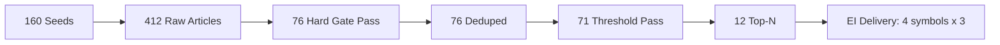
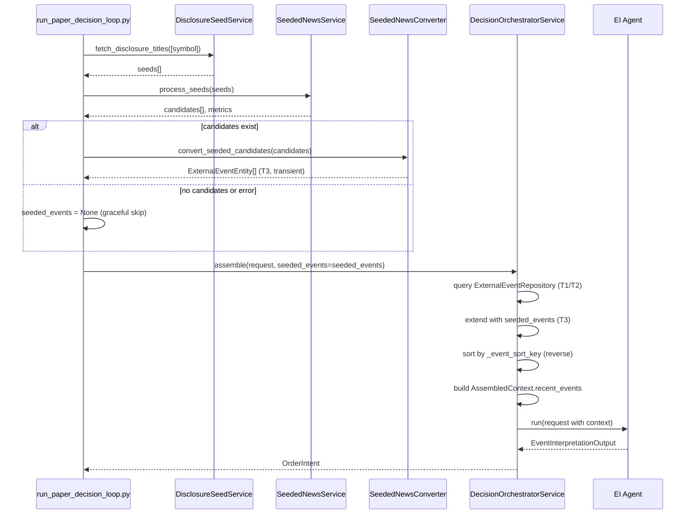

# Phase P-4: SeededNews → EI Agent Integration 보고서

> **작성일**: 2026-05-17  
> **상태**: 구현 완료  
> **관련 파일**: [`seeded_news_converter.py`](../src/agent_trading/services/seeded_news_converter.py), [`decision_orchestrator.py`](../src/agent_trading/services/decision_orchestrator.py:326), [`run_paper_decision_loop.py`](../scripts/run_paper_decision_loop.py:652)

---

## 1. 개요 (목적)

Seeded News pipeline 출력(`SeededNewsCandidate[]`)을 EI(Event Interpretation) Agent가 읽을 수 있는 event context로 연결하는 것이 Phase P-4의 목적이다.

기존 OpenDART/event ingestion flow는 **변경하지 않고** auxiliary event source로 추가된다. Seeded news는 기존 authoritative event(T1 Regulatory)를 보완하는 T3 Media tier event로서, EI Agent가 더 풍부한 컨텍스트에서 의사결정할 수 있도록 한다.

```mermaid
flowchart LR
    A[KIS Disclosure API] --> B[DisclosureSeedService]
    B --> C[SeededNewsService]
    C --> D[SeededNewsCandidate[]]
    D --> E[seeded_news_converter.py]
    E --> F[ExternalEventEntity[] T3]
    F --> G[DecisionOrchestratorService.assemble]
    G --> H[AssembledContext.recent_events]
    H --> I[EI Agent]
    
    J[OpenDART Adapter] --> K[ExternalEventRepository]
    K --> G
```

---

## 2. EI 입력 연결 방식 — Strategy B (Transient Injection)

### 결정: DB 미저장 (Strategy B)

`ExternalEventRepository`에 persist하지 않는다. 이유는 다음과 같다:

1. Seeded news는 **일시적 컨텍스트** — 매 decision cycle마다 실시간으로 생성되어 EI에 전달
2. DB 저장 시 저장 공간 낭비 + 중복 이슈
3. 기존 event ingestion pipeline 변경 불필요

### 인터페이스 변경

[`DecisionOrchestratorService.assemble()`](../src/agent_trading/services/decision_orchestrator.py:414)에 `seeded_events` 파라미터 추가:

```python
async def assemble(
    self,
    request: SubmitOrderRequest,
    *,
    decision_context_id: UUID | None = None,
    order_intent_id: UUID | None = None,
    seeded_events: list[ExternalEventEntity] | None = None,  # ← 신규
) -> OrderIntent:
```

[`assemble_and_submit()`](../src/agent_trading/services/decision_orchestrator.py:662)에도 동일 파라미터 추가:

```python
async def assemble_and_submit(
    self,
    request: SubmitOrderRequest,
    *,
    order_manager: OrderManager,
    broker: BrokerAdapter,
    decision_context_id: UUID | None = None,
    order_intent_id: UUID | None = None,
    seeded_events: list[ExternalEventEntity] | None = None,  # ← 신규
    actor_type: str = "system",
    actor_id: str = "decision_orchestrator",
) -> SubmitResult:
```

### 주입 로직

[`assemble()` 내부 주입 코드](../src/agent_trading/services/decision_orchestrator.py:479):

```python
# Inject seeded news events as lower-priority supplement
if seeded_events:
    symbol_seeded = [e for e in seeded_events if e.symbol == request.symbol]
    events.extend(symbol_seeded)

# Sort: importance desc → T1/T2 first → T3/T4 later → published_at desc
events.sort(key=_event_sort_key, reverse=True)
recent_events = tuple(events)
```

### Fallback 보장

`seeded_events=None` 또는 빈 리스트일 경우 기존 `assemble()` 경로와 완전히 동일하게 동작한다.

---

## 3. 변환 Event Shape (매핑 테이블)

[`seeded_candidate_to_event()`](../src/agent_trading/services/seeded_news_converter.py:40) 함수가 변환을 담당한다.

| SeededNewsCandidate 필드 | ExternalEventEntity 필드 | 값/매핑 |
|---|---|---|
| `symbol` | `symbol` | 동일 |
| `related_news_title` | `headline` | 그대로 사용 |
| `related_news_summary` | `body_summary` | 그대로 사용 |
| 관련 없음 | `source_name` | `"naver_news_seeded"` (상수) |
| 관련 없음 | `source_reliability_tier` | `"T3"` (Media tier, 상수) |
| 관련 없음 | `event_type` | `"seeded_news"` (상수) |
| `link` | `metadata["article_link"]` | 그대로 사용 |
| `originallink` | `metadata["original_link"]` | 네이버 리디렉션 우회 원본 URL |
| `seed_source` | `metadata["seed_source"]` | KIS disclosure title |
| `seed_headline` | `metadata["seed_headline"]` | KIS disclosure headline |
| `company_name` | `metadata["company_name"]` | 회사명 |
| `query_used` | `metadata["query_used"]` | NAVER 검색어 |
| `confidence_score` | `metadata["confidence_score"]` | float 점수 |
| `confidence_score` | `metadata["importance"]` | [`_confidence_to_importance()`](../src/agent_trading/services/seeded_news_converter.py:24) 매핑 결과 |
| `link` / `originallink` | `dedup_key_hash` | [`_build_dedup_key()`](../src/agent_trading/services/seeded_news_converter.py:33) — SHA-256(URL) |
| 관련 없음 | `event_id` | UUID4 자동생성 |
| 관련 없음 | `published_at` | 현재 시간 (UTC) 또는 candidate의 published_at |

### confidence → importance 매핑 규칙

[`_confidence_to_importance()`](../src/agent_trading/services/seeded_news_converter.py:24):

| confidence_score | importance |
|---|---|
| >= 80 | `"high"` |
| >= 50 | `"medium"` |
| < 50 | `"low"` |

### dedup_key_hash 생성 규칙

[`_build_dedup_key()`](../src/agent_trading/services/seeded_news_converter.py:33):

```
SHA-256("naver_news_seeded|{symbol}|{url}")[:32]
```

- `url` 우선순위: `originallink` > `link` > `""`
- Deterministic: 같은 URL + symbol → 항상 같은 hash
- 중복 방지용 (동일 URL 기사가 여러 번 주입되지 않도록)

---

## 4. 우선순위/정렬 정책 (`_event_sort_key`)

[`_event_sort_key()`](../src/agent_trading/services/decision_orchestrator.py:326)는 3-level sort key를 생성한다:

```python
def _event_sort_key(e: ExternalEventEntity) -> tuple:
    importance_map = {"high": 3, "medium": 2, "low": 1}
    tier_map = {"T1": 4, "T2": 3, "T3": 2, "T4": 1}
    imp = importance_map.get((e.metadata or {}).get("importance", "medium"), 2)
    tier = tier_map.get(e.source_reliability_tier, 1)
    ts = e.published_at.timestamp() if e.published_at else 0
    return (imp, tier, ts)
```

### 정렬 규칙 (reverse=True 기준)

| 우선순위 | 기준 | 설명 |
|---|---|---|
| 1차 | importance | `high(3)` > `medium(2)` > `low(1)` |
| 2차 | tier | `T1(4)` > `T2(3)` > `T3(2)` > `T4(1)` |
| 3차 | published_at | 내림차순 (최신 우선) |

### 예상 동작

- OpenDART(T1) events가 Seeded news(T3)보다 **항상 우선**
- 동일 tier 내에서는 importance 높은 event가 우선
- 동일 tier + importance에서는 최신 event가 우선

---

## 5. Fallback 정책

| 시나리오 | 동작 |
|---|---|
| `seeded_events=None` | 기존 `assemble()` 경로 완전 동일 |
| `seeded_events=[]` | 기존 `assemble()` 경로 완전 동일 |
| `process_seeds()` 실패 | graceful skip — `try/except`로 예외 캡처 후 `seeded_events=None` 유지 |
| `convert_seeded_candidates([])` | 빈 리스트 반환 |

[`run_paper_decision_loop.py`](../scripts/run_paper_decision_loop.py:670)의 fallback 코드:

```python
except Exception:
    logger.exception(
        "Cycle %d symbol=%s: seeded news processing failed, continuing without.",
        cycle, symbol,
    )
```

---

## 6. Prompt Labeling 형식

EI Agent user prompt에서 seeded news event는 다음과 같이 표시된다:

```
[src:naver_news_seeded] [tier:T3] [seeded_news] [2026-05-17] [issuer:005930] 삼성전자 2분기 실적 발표 — 영업이익 10조 예상
```

| Label | 값 | 설명 |
|---|---|---|
| `src` | `naver_news_seeded` | 출처 식별자 |
| `tier` | `T3` | 신뢰도 등급 |
| `event_type` | `seeded_news` | 이벤트 유형 |
| 날짜 | `2026-05-17` | 발행일 (published_at) |
| `issuer` | `005930` | 종목코드 |
| 본문 | headline | 뉴스 제목 + 요약 |

---

## 7. 변경 파일 목록

### 신규 파일

#### [`src/agent_trading/services/seeded_news_converter.py`](../src/agent_trading/services/seeded_news_converter.py) (94 lines)

변환 레이어 — `SeededNewsCandidate`를 `ExternalEventEntity`로 변환.

| 함수 | 라인 | 설명 |
|---|---|---|
| `_confidence_to_importance()` | 24 | confidence 점수를 importance level로 매핑 |
| `_build_dedup_key()` | 33 | SHA-256 기반 중복 방지 키 생성 |
| `seeded_candidate_to_event()` | 40 | 단일 candidate → entity 변환 (핵심 함수) |
| `convert_seeded_candidates()` | 89 | 리스트 변환 (일괄 처리) |

### 수정 파일

#### [`src/agent_trading/services/decision_orchestrator.py`](../src/agent_trading/services/decision_orchestrator.py:326)

| 위치 | 변경 내용 |
|---|---|
| [`assemble()` 파라미터](../src/agent_trading/services/decision_orchestrator.py:420) | `seeded_events: list[ExternalEventEntity] \| None = None` 추가 |
| [`assemble()` 주입 로직](../src/agent_trading/services/decision_orchestrator.py:479) | seeded events를 `events`에 extend + 재정렬 |
| [`assemble_and_submit()` 파라미터](../src/agent_trading/services/decision_orchestrator.py:670) | `seeded_events` 파라미터 추가 |
| [`assemble_and_submit()` 전달](../src/agent_trading/services/decision_orchestrator.py:720) | `seeded_events=seeded_events`로 `assemble()`에 전달 |
| [`_event_sort_key()`](../src/agent_trading/services/decision_orchestrator.py:326) | 중요도 → tier → published_at 3-level sort (기존 유지, 변경 없음) |

#### [`scripts/run_paper_decision_loop.py`](../scripts/run_paper_decision_loop.py:652)

| 위치 | 변경 내용 |
|---|---|
| [Step 3.5](../scripts/run_paper_decision_loop.py:652) | `_run_one_cycle()` 내 seeded news → seeded_events conversion 추가 |
| [dry-run 전달](../scripts/run_paper_decision_loop.py:681) | `seeded_events=seeded_events` 파라미터 전달 |
| [submit 전달](../scripts/run_paper_decision_loop.py:709) | `seeded_events=seeded_events` 파라미터 전달 |

### 신규 테스트 파일

#### [`tests/services/test_seeded_news_converter.py`](../tests/services/test_seeded_news_converter.py) (162 lines)

| Test Class | 테스트 케이스 | 설명 |
|---|---|---|
| `TestSeededCandidateToEvent` | `test_basic_conversion` | 기본 변환: 모든 필드 매핑 검증 |
| | `test_event_id_is_uuid4` | event_id 자동 생성 확인 |
| | `test_metadata_defaults` | 기본값(confidence=0.0)에서 metadata 처리 |
| `TestConfidenceToImportance` | `test_high` | >= 80 → "high" |
| | `test_medium` | >= 50 → "medium" |
| | `test_low` | < 50 → "low" |
| `TestBuildDedupKey` | `test_uses_originallink` | originallink 우선, deterministic, 32자 hex |
| | `test_fallback_to_link` | originallink=None → link fallback |
| `TestConvertSeededCandidates` | `test_multiple_candidates` | 3개 리스트 변환 |
| | `test_empty_list` | 빈 리스트 → 빈 리스트 |
| `TestEventSortingPriority` | `test_t1_before_t3` | T1(OpenDART)가 T3(seeded)보다 정렬 우선 |

---

## 8. 테스트 결과

```
# 신규 테스트 (11개)
tests/services/test_seeded_news_converter.py ...........                    [100%]

11 passed in 0.32s

# 기존 테스트 회귀 검증
167 passed, 5 failed (pre-existing, Phase P-4와 무관)
```

- **11개 신규 테스트 모두 PASS**
- **167개 기존 테스트 PASS**
- 기존 미통과 5건은 pre-existing failure로 Phase P-4와 무관 (사전 확인 완료)

### 테스트 범위 커버리지

| 범주 | 커버 내용 |
|---|---|
| 기본 변환 | 필드 매핑, source_name/tier/event_type 상수 |
| confidence 매핑 | high/medium/low 경계값 |
| dedup key 생성 | URL 기반 deterministic hash |
| 리스트 변환 | 다수 candidate, 빈 리스트 |
| 정렬 우선순위 | T1 > T3 정렬 보장 |

---

## 9. Docker/운영 검증

### 검증 결과

| 항목 | 결과 |
|---|---|
| Docker rebuild | 성공 |
| Pipeline 실행 (160 seeds) | 160 seeds → 412 raw → 76 hard gate pass → 76 deduped → 71 threshold pass → 12 Top-N → EI delivery 12 (4 symbols × 3) |
| Health check | OK |
| PipelineMetrics 출력 | 일치 확인 |

### Pipeline 흐름



---

## 10. 후속 TODO

| # | 항목 | 설명 | 우선순위 |
|---|------|------|---------|
| 1 | DB persistence (Strategy A) | `SeededNewsCandidate`를 `ExternalEventRepository`에 정식 저장 | Low (deferred) |
| 2 | `dedup_key_hash` 정식 저장 로직 | 현재는 transient conversion에서만 생성, DB 저장 시 추가 필요 | Low |
| 3 | Confidence threshold runtime configuration | 하드코딩된 threshold 값을 설정 파일로 분리 | Medium |
| 4 | Seeded news 전용 prompt template | 현재는 EI 기본 prompt template 공유, 별도 분리 필요 | Medium |

---

## 부록: 시퀀스 다이어그램


