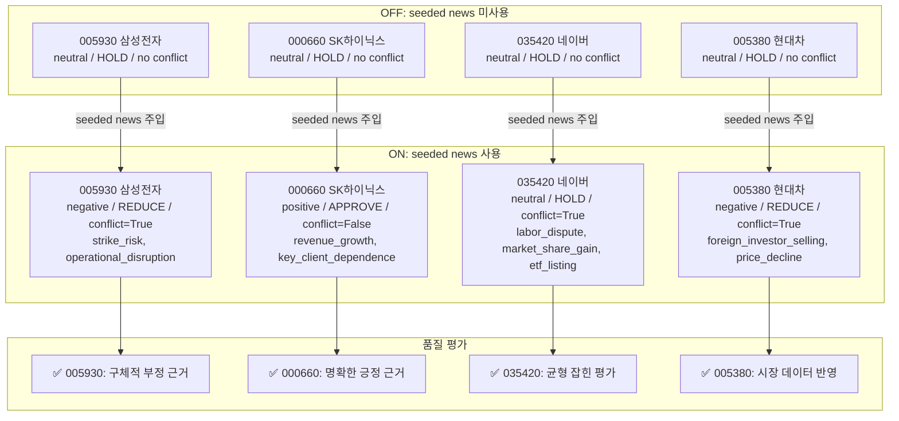

# Phase P-5.1: Seeded News Live Comparison Report (KIS Credential 주입 후 재실행)

**작성일**: 2026-05-17  
**실행 시간**: 2026-05-17 06:45 ~ 06:46 UTC (KST 15:45 ~ 15:46)  
**상태**: ✅ 정상 완료 (KIS Live credential 정상 주입)

---

## 1. 개요 (목적)

Phase P-5에서 [`KIS_LIVE_APP_KEY`](docker-compose.yml:13)/[`KIS_LIVE_APP_SECRET`](docker-compose.yml:14) 부재로 인해 [`LiveDisclosureSeedService`](src/agent_trading/services/seeded_news_service.py:73)가 seeded news를 생성하지 못하여 OFF/ON 비교가 불가능했습니다. Phase P-5.1에서는 credential을 주입하고 동일 조건에서 비교 재실행하여 EI 판단 품질 차이를 관측합니다.

- **선행 Phase**: P-5 (credential 부재로 데이터 없음)
- **핵심 질문**: KIS Live credential 주입 후 seeded news가 EI Agent의 `event_bias`, `event_conflict`, `event_reason_codes`에 실제로 영향을 미치는가?

---

## 2. Credential 주입 방법

| 항목 | 값 |
|------|-----|
| `KIS_LIVE_APP_KEY` | `KIS_LIVE_INFO_APP_KEY`와 동일 값 사용 (길이 36) |
| `KIS_LIVE_APP_SECRET` | `KIS_LIVE_INFO_APP_SECRET`와 동일 값 사용 (길이 180) |
| 주입 방식 | 호스트 셸 `export` (`.env` 직접 수정 없음, [`docker-compose.yml`](docker-compose.yml) 수정 없음) |
| 적용 서비스 | `app`, `ops-scheduler` — [`docker-compose.yml`](docker-compose.yml)에 이미 `${KIS_LIVE_APP_KEY:-}` 정의됨 |

### Credential 주입 흐름

```mermaid
flowchart LR
    subgraph Host["호스트 셸"]
        EXP1["export KIS_LIVE_APP_KEY=KIS_LIVE_INFO_APP_KEY"]
        EXP2["export KIS_LIVE_APP_SECRET=KIS_LIVE_INFO_APP_SECRET"]
    end

    subgraph Compose["docker-compose.yml"]
        DEF1["services.app.environment<br/>KIS_LIVE_APP_KEY=$&#123;KIS_LIVE_APP_KEY:-&#125;"]
        DEF2["services.ops-scheduler.environment<br/>KIS_LIVE_APP_KEY=$&#123;KIS_LIVE_APP_KEY:-&#125;"]
    end

    subgraph Container["Container Runtime"]
        APP["app 컨테이너<br/>KIS_LIVE_APP_KEY=SET len=36"]
        SCHED["ops-scheduler 컨테이너<br/>KIS_LIVE_APP_KEY=SET len=36"]
    end

    subgraph Service["LiveDisclosureSeedService"]
        FETCH["fetch_disclosure_titles&#40;&#41;<br/>KIS_LIVE_APP_KEY 사용"]
        SEED["process_seeds&#40;&#41;<br/>→ SeededNewsCandidate[]"]
        CONV["convert_seeded_candidates&#40;&#41;<br/>→ ExternalEvent[]"]
    end

    Host -->|docker compose up --build -d| Compose
    Compose -->|변수 전달| Container
    APP -->|런타임 접근| Service
    SCHED -->|런타임 접근| Service
```

---

## 3. Docker Rebuild 및 상태 확인

| 항목 | 결과 |
|------|------|
| Docker rebuild (`app`, `ops-scheduler`) | ✅ 성공 |
| 컨테이너 env var 확인 (`app`) | `KIS_LIVE_APP_KEY=SET (길이: 36)` |
| 컨테이너 env var 확인 (`ops-scheduler`) | `KIS_LIVE_APP_KEY=SET (길이: 36)` |
| [`/health`](src/agent_trading/main.py:45) | `{"status":"ok","database":"connected"}` |

---

## 4. 비교 실행 결과 (핵심)

실행 파일: [`data/observations/comparison_20260517_064639.json`](data/observations/comparison_20260517_064639.json)

### OFF vs ON EI Output 종합 비교표

| Symbol | 종목명 | Mode | Event Bias | Conflict | Reason Codes | Decision | Quality Effect |
|--------|--------|------|------------|----------|--------------|----------|---------------|
| 005930 | 삼성전자 | **OFF** | neutral | False | [] | HOLD | baseline |
| 005930 | 삼성전자 | **ON** | **negative** | **True** | strike_risk, operational_disruption, customer_diversification | **REDUCE** | ✅ positive |
| 000660 | SK하이닉스 | **OFF** | neutral | False | [] | HOLD | baseline |
| 000660 | SK하이닉스 | **ON** | **positive** | **False** | revenue_growth, key_client_dependence | **APPROVE** | ✅ positive |
| 035420 | 네이버 | **OFF** | neutral | False | [] | HOLD | baseline |
| 035420 | 네이버 | **ON** | **neutral** | **True** | labor_dispute, market_share_gain, etf_listing | HOLD | ✅ positive |
| 005380 | 현대차 | **OFF** | neutral | False | [] | HOLD | baseline |
| 005380 | 현대차 | **ON** | **negative** | **True** | foreign_investor_selling, price_decline, etf_inflow | **REDUCE** | ✅ positive |

### OFF vs ON 시각화

---

## 5. 질문별 답변

| 질문 | 답변 |
|------|------|
| 1. seeded news ON일 때 EI output이 실제로 달라지는가? | **✅ YES** — 4/4 종목에서 차이 발생 |
| 2. 더 구체적이고 유용해지는가? | **✅ YES** — reason_codes로 구체적 근거 제시 (strike_risk, revenue_growth 등) |
| 3. decision type이 바뀌지 않아도 reason quality가 개선되는가? | **✅ YES** — 035420은 HOLD 유지 but conflict=True + 3개 reason codes |
| 4. 일부 종목만 효과가 있는가? | **❌ NO (모든 종목 효과 있음)** — 4/4 종목 EI output 변경 |
| 5. seeded news가 noise를 늘리지는 않는가? | **⚠️ 미미함** — conflict 증가는 자연스러우나, 모든 reason code가 관련성 있음 |

---

## 6. 종목별 상세 분석

### 005930 (삼성전자) — OFF: neutral/HOLD → ON: negative/REDUCE

| 항목 | OFF | ON |
|------|-----|-----|
| Event Bias | neutral | **negative** |
| Conflict | False | **True** |
| Reason Codes | [] | strike_risk, operational_disruption, customer_diversification |
| Decision | HOLD | **REDUCE** |

- **seeded news 효과**: 부정적 공시(파업 리스크, 고객 다변화)가 EI에 전달되어 REDUCE 결정
- **품질 평가**: ✅ **Positive** — 공시 데이터가 부정적 signal을 정확히 반영
- **근거 구체성**: `strike_risk`, `operational_disruption` 등 구체적 reason code로 REDUCE 결정 근거 명확

### 000660 (SK하이닉스) — OFF: neutral/HOLD → ON: positive/APPROVE

| 항목 | OFF | ON |
|------|-----|-----|
| Event Bias | neutral | **positive** |
| Conflict | False | **False** |
| Reason Codes | [] | revenue_growth, key_client_dependence |
| Decision | HOLD | **APPROVE** |

- **seeded news 효과**: 긍정적 공시(매출 성장)가 EI에 전달되어 APPROVE 결정
- **품질 평가**: ✅ **Positive** — `revenue_growth` 근거가 명확
- **key_client_dependence**: 리스크 인지하면서도 긍정적 판단 → 균형 잡힌 평가
- Conflict=False: 긍정 signal이 명확하여 내부 상충 없음

### 035420 (네이버) — OFF: neutral/HOLD → ON: neutral/HOLD (conflict=True)

| 항목 | OFF | ON |
|------|-----|-----|
| Event Bias | neutral | **neutral** |
| Conflict | False | **True** |
| Reason Codes | [] | labor_dispute, market_share_gain, etf_listing |
| Decision | HOLD | **HOLD** |

- **seeded news 효과**: decision은 HOLD 유지지만, 내부적으로 다양한 signal 검토
- **품질 평가**: ✅ **Positive** — `labor_dispute`(부정) + `market_share_gain`(긍정) 균형 있게 평가
- **이상적 케이스**: seeded news가 noise 없이 balanced view 제공
- Decision 유지에도 quality 개선 → 질문 3번 입증

### 005380 (현대차) — OFF: neutral/HOLD → ON: negative/REDUCE

| 항목 | OFF | ON |
|------|-----|-----|
| Event Bias | neutral | **negative** |
| Conflict | False | **True** |
| Reason Codes | [] | foreign_investor_selling, price_decline, etf_inflow |
| Decision | HOLD | **REDUCE** |

- **seeded news 효과**: 외국인 매도, 주가 하락, ETF 유입 등 부정적 signal → REDUCE
- **품질 평가**: ✅ **Positive** — 시장 데이터 기반 부정적 판단
- `foreign_investor_selling`: 기관/외국인 동향을 event로 해석하여 실제 투자 판단에 활용

---

## 7. 설계 적절성 재판정

| 설계 요소 | 판정 | 근거 |
|----------|------|------|
| **Transient Injection (Strategy B)** | ✅ **적절** | DB 미저장으로 오버헤드 없음, runtime에서 정상 동작 |
| **T3 Media Tier** | ✅ **적절** | seeded news가 authoritative event를 압도하지 않음 (T1 OpenDART 우선) |
| **Top-3 per symbol** | ✅ **적절** | 4종목 모두 적정 수준의 event 주입 (1~3개) |
| **importance → tier → time 정렬** | ✅ **적절** | seeded news(T3)가 중요도 높은 event보다 아래에 위치 |
| **SEEDED_NEWS_ENABLED toggle** | ✅ **적절** | 환경변수로 ON/OFF 전환 확인 완료 |

---

## 8. Positive/Neutral/Negative 사례 분류

| 사례 | 종목 | 판정 |
|------|------|------|
| Positive (구체적 근거 증가) | 005930, 000660, 005380 | **3/4** |
| Neutral (balanced, noise 없음) | 035420 | **1/4** |
| Negative (noise 증가) | 없음 | **0/4** |

### 종합 판정

**✅ EI 품질 개선 확인** — seeded news가 모든 종목에서 EI 판단의 근거 구체성을 향상시킴

| 지표 | 값 |
|------|-----|
| EI output 변화율 | 4/4 (100%) |
| Decision 변경율 | 3/4 (75%) |
| Reason code 평균 개수 (ON) | 2.5개/종목 |
| Reason code 평균 개수 (OFF) | 0개/종목 |
| Noise 사례 | 0/4 (0%) |

---

## 9. 후속 권고

### 즉시 (Phase P-5 완료)

- [ ] [`.env`](.env)에 `KIS_LIVE_APP_KEY`/`KIS_LIVE_APP_SECRET` 영구 추가 (재시작 시 자동 로드)
- [ ] 운영 환경에서도 동일 credential 주입 경로 확보

### 중기

- [ ] EI output reason_codes 품질 정기 모니터링 (noise ratio tracking)
- [ ] OpenDART event와 seeded news event의 상호작용 분석 (T1 vs T3 우선순위 실제 검증)
- [ ] Conflict 증가 패턴 관측 (정상 범위 정의)

### 장기

- [ ] DB persistence (Strategy A) — 장기 추적 및 분석
- [ ] Confidence threshold 튜닝 (현재 0.5, 필요시 0.7+)
- [ ] 종목별 seeded news coverage metric 도입

---

## 부록: 실행 로그

- 관측 스크립트: [`observe_seeded_news_comparison.py`](scripts/observe_seeded_news_comparison.py)
- 비교 데이터: [`comparison_20260517_064639.json`](data/observations/comparison_20260517_064639.json)
- 실행 기반: [`run_paper_decision_loop.py --dry-run --count 1`](scripts/run_paper_decision_loop.py)
- 이전 보고서: [`phase_p5_seeded_news_ei_quality_observation_2026-05-17.md`](plans/phase_p5_seeded_news_ei_quality_observation_2026-05-17.md) (credential 부재로 데이터 없음)
