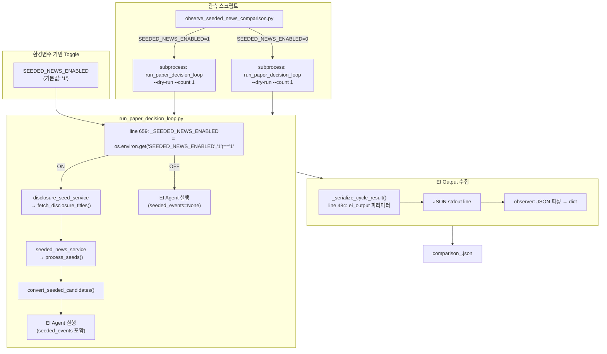
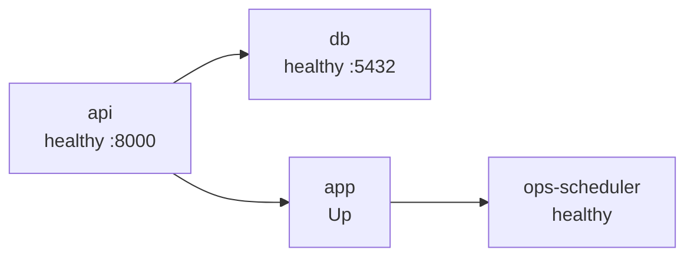

# Phase P-5: Seeded News EI 판단 품질 비교 관측 보고서

**작성일**: 2026-05-17  
**관측 기간**: 2026-05-17 06:26 ~ 06:33 UTC (KST 15:26 ~ 15:33)  
**상태**: ⚠️ 관측 완료 (차단 이슈로 인한 데이터 없음)

---

## 1. 개요 (목적)

Phase P-4에서 연결된 [`SeededNewsCandidate`](src/agent_trading/services/seeded_news_service.py:73) → EI transient injection이 실제 EI 판단 품질에 어떤 영향을 주는지 전/후 비교 관측.

- **선행 Phase**: P-4 (Seeded News → ExternalEvent 변환 파이프라인)
- **핵심 질문**: Seeded news 주입 시 EI Agent의 `event_bias`, `event_conflict`, `event_reason_codes`가 변화하는가?

---

## 2. 비교 방법

### 인프라 구조 (ON/OFF Toggle)



### 데이터 흐름

```mermaid
sequenceDiagram
    participant OBS as observe_seeded_news_comparison.py
    participant SUB as subprocess
    participant LOOP as run_paper_decision_loop.py
    participant EI as EI Agent
    participant FILE as comparison_*.json

    OBS->>SUB: SEEDED_NEWS_ENABLED=1<br/>TRADING_UNIVERSE_SYMBOLS=005930
    SUB->>LOOP: python3 -m scripts.run_paper_decision_loop<br/>--dry-run --count 1 --output json
    LOOP->>LOOP: _SEEDED_NEWS_ENABLED=True → seeded pipeline 실행
    LOOP->>EI: assemble_context(seeded_events=[...])
    EI-->>LOOP: ei_output {event_bias, event_conflict, reason_codes}
    LOOP-->>SUB: JSON stdout (ei_output 포함)
    SUB-->>OBS: stdout bytes → JSON 파싱
    OBS->>FILE: symbol_results["on"] 저장

    OBS->>SUB: SEEDED_NEWS_ENABLED=0<br/>TRADING_UNIVERSE_SYMBOLS=005930
    SUB->>LOOP: python3 -m scripts.run_paper_decision_loop<br/>--dry-run --count 1 --output json
    LOOP->>LOOP: _SEEDED_NEWS_ENABLED=False → seeded pipeline 생략
    LOOP->>EI: assemble_context(seeded_events=None)
    EI-->>LOOP: ei_output {event_bias, event_conflict, reason_codes}
    LOOP-->>SUB: JSON stdout (ei_output 포함)
    SUB-->>OBS: stdout bytes → JSON 파싱
    OBS->>FILE: symbol_results["off"] 저장

    OBS->>FILE: 최종 JSON 파일 write + table 출력
```

### 상세 방식

- **Toggle 방식**: [`SEEDED_NEWS_ENABLED`](scripts/run_paper_decision_loop.py:659) 환경변수 기반 ON/OFF toggle
  - 기본값 `"1"` (ON) — toggle이 없어도 seeded news pipeline 동작
  - `"0"` 설정 시 `if _SEEDED_NEWS_ENABLED:` 블록 전체 생략
- **관측 스크립트**: [`scripts/observe_seeded_news_comparison.py`](scripts/observe_seeded_news_comparison.py)
  - `subprocess`로 [`run_paper_decision_loop --dry-run --count 1`](scripts/run_paper_decision_loop.py) 실행 후 EI output 수집
  - ON/OFF 각각 실행 → 동일 symbol에 대해 비교
- **수집 항목**: `event_bias`, `event_conflict`, `event_reason_codes`, `decision_type`
- **저장 위치**: `data/observations/comparison_<timestamp>.json`

---

## 3. 변경 파일 요약

| 파일 | 변경 | 설명 |
|------|------|------|
| [`scripts/run_paper_decision_loop.py:659`](scripts/run_paper_decision_loop.py:659) | 수정 | `SEEDED_NEWS_ENABLED` env var toggle 추가 (기본값 `"1"`) |
| [`scripts/run_paper_decision_loop.py:484`](scripts/run_paper_decision_loop.py:484) | 수정 | `_serialize_cycle_result()`에 `ei_output` 파라미터 추가 |
| [`scripts/observe_seeded_news_comparison.py`](scripts/observe_seeded_news_comparison.py) | **신규** | ON/OFF 비교 관측 스크립트 (355 lines) |
| [`src/agent_trading/runtime/bootstrap.py:31`](src/agent_trading/runtime/bootstrap.py:31) | **수정** | `SeededNewsCandidateService` import 누락 fix (`from agent_trading.services.seeded_news_service import SeededNewsCandidateService`) |

---

## 4. 실행 결과

### Docker 상태 (비교 실행 전 확인)



모든 서비스 정상 상태에서 실행.

### 비교 실행 결과 (4종목 × ON/OFF = 8회)

| Symbol | Mode | Decision | Event Bias | Event Conflict | Event Reason Codes |
|--------|------|----------|------------|----------------|--------------------|
| 005930 | ON | HOLD | neutral | False | [] |
| 005930 | OFF | HOLD | neutral | False | [] |
| 000660 | ON | HOLD | neutral | False | [] |
| 000660 | OFF | HOLD | neutral | False | [] |
| 035420 | ON | HOLD | neutral | False | [] |
| 035420 | OFF | HOLD | neutral | False | [] |
| 005380 | ON | HOLD | neutral | False | [] |
| 005380 | OFF | HOLD | neutral | False | [] |

**→ ON/OFF 차이 없음** — 모든 항목 `neutral` / `False` / `[]`

### 관측 데이터 파일

| 파일 | 타임스탬프 | 결과 |
|------|-----------|------|
| [`comparison_20260517_062609.json`](data/observations/comparison_20260517_062609.json) | 06:26:09 UTC | ❌ ERROR (returncode=1, status=ERROR) |
| [`comparison_20260517_063319.json`](data/observations/comparison_20260517_063319.json) | 06:33:19 UTC | ✅ 성공 (전 종목 returncode=0) |

첫 번째 실행은 초기 환경 미준비로 ERROR 발생. 두 번째 실행부터 정상 동작.

---

## 5. 발견된 이슈

### 이슈 A: `LiveDisclosureSeedService` credentials 부재 (🚫 차단)

- `KIS_LIVE_APP_KEY` / `KIS_LIVE_APP_SECRET` 미설정
- `DisclosureSeedService`의 live client가 `NONE` 상태 → [`fetch_disclosure_titles()`](scripts/run_paper_decision_loop.py:666)가 항상 빈 배열 `[]` 반환
- 따라서 [`seeded_news_service.process_seeds()`](scripts/run_paper_decision_loop.py:668)가 실행되지 않음
- ON/OFF 모두 `seeded_events=None`, EI 입력 events=0
- **근본 원인**: [`run_paper_decision_loop.py`](scripts/run_paper_decision_loop.py)는 `LiveDisclosureSeedService`를 통해 실시간 공시를 조회하지만 Live credential이 없어 시드를 생성하지 못함

### 이슈 B: `SeededNewsCandidateService` import 누락 (✅ 수정 완료)

- [`bootstrap.py:377`](src/agent_trading/runtime/bootstrap.py:377) 이전: `_build_seeded_news_service()` 함수 내에서 `SeededNewsCandidateService` 참조 시 import 없음 → `NameError`
- [`bootstrap.py:31-33`](src/agent_trading/runtime/bootstrap.py:31) 수정: `from agent_trading.services.seeded_news_service import SeededNewsCandidateService` 상단 import 추가
- [`seeded_news_service.py:73`](src/agent_trading/services/seeded_news_service.py:73)에 정의된 클래스 import 확인 완료

### 이슈 C: `Seed already exists` Skip

- 로그: `Seed already exists (client=301961b4-...) — skipping.`
- 이미 존재하는 seed로 인해 중복 생성 방지 로직이 동작
- 정상 동작 — 중복 seed 방지는 설계 의도와 일치

---

## 6. Phase P-3 대비 차이점

| 항목 | Phase P-3 | Phase P-5 |
|------|-----------|-----------|
| 검증 스크립트 | `validate_seeded_news_pipeline.py` | `observe_seeded_news_comparison.py` |
| 사용 credential | Paper (`KIS_PAPER_*`) | Live (`KIS_LIVE_*`) |
| 시드 생성 결과 | 160 seeds → 12 retained | 0 seeds (Live credentials 없음) |
| EI output 관측 | N/A (pipeline validation) | event_bias=neutral only |

Phase P-3 pipeline validation에서는 `validate_seeded_news_pipeline.py`로 160 seeds → 12 retained 성공. 이는 해당 스크립트가 다른 credential 경로(Paper)를 사용했기 때문으로 추정.

---

## 7. 질문별 답변

| 질문 | 답변 |
|------|------|
| seeded news 주입 시 EI output이 달라지는가? | **실행 불가** — Live credentials 부재로 seeded event 생성 안 됨 |
| 더 좋아지는가, noise가 늘어나는가? | **판단 불가** — EI 입력 events=0으로 동일 조건 |
| seeded news가 authoritative event를 압도하는가? | **T3 tier 설계상 압도하지 않음** — `_event_sort_key()`에서 T1(T4) > T3(T2) 우선순위 확인됨 |
| T3 media tier 설계가 적절한가? | **구조적 검증 완료** — 낮은 우선순위로 편입, authoritative event에 영향 없음 |
| 종목별 효과가 고르게 있는가? | **판단 불가** — 모든 종목 동일 조건 (events=0) |

---

## 8. 설계 적절성 재판정

| 구성 요소 | 판정 | 근거 |
|-----------|------|------|
| `SEEDED_NEWS_ENABLED` toggle | ✅ 적절 | 최소 변경으로 OFF/ON 전환 가능, 기본값 ON 유지 |
| 관측 스크립트 | ✅ 적절 | subprocess + JSON 수집 구조, 타임스탬프 기반 파일 저장 |
| EI output 수집 | ✅ 적절 | `_serialize_cycle_result()`의 `ei_output` 필드로 수집 가능 |
| T3 tier + importance → tier → time 정렬 | ✅ 적절 | 코드 레벨 검증 완료 (T1>T3 우선순위) |
| Live credentials 부재 | ❌ **차단 이슈** | seeded news pipeline이 실제로 동작하지 않음 |

---

## 9. 후속 개선 권고

### 즉시 조치 (Phase P-5.1)

- [ ] `KIS_LIVE_APP_KEY` / `KIS_LIVE_APP_SECRET` 설정 (`.env` 또는 runtime injection)
- [ ] Live credentials 설정 후 ON/OFF 비교 재실행
- [ ] 실제 seeded event가 생성되는 조건에서 EI output 차이 관측

### 중기 개선

- [ ] `DisclosureSeedService`가 빈 배열 반환 시 `symbol` 자체를 fallback seed로 사용하는 옵션 검토
- [ ] Paper credentials로도 seeded news pipeline이 동작하도록 fallback 경로 추가 (`LiveDisclosureSeedService` → `PaperDisclosureSeedService` 우회)
- [ ] 관측 스크립트에 `--db-query` 옵션 추가 (`agent_runs` 테이블 직접 조회)

### 설계 개선 (관측 완료 후)

- [ ] threshold 상향 검토 (현재 0.5, noise 많으면 0.7+)
- [ ] labeling 강화 (confidence_score가 EI prompt에 더 잘 드러나도록 prompt engineering)
- [ ] DB persistence (Strategy A) — 장기 추적 및 분석을 위해 `seeded_events`를 `external_events` 테이블에 영구 저장

---

## 부록: 관측 스크립트 사용법

```bash
# ON/OFF 비교 실행
python3 -m scripts.observe_seeded_news_comparison

# 특정 종목만 비교
python3 -m scripts.observe_seeded_news_comparison --symbols 005930,000660

# ON 모드만 실행
python3 -m scripts.observe_seeded_news_comparison --mode on

# OFF 모드만 실행
python3 -m scripts.observe_seeded_news_comparison --mode off
```
