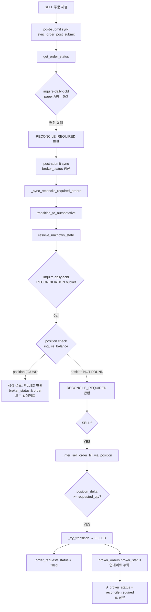
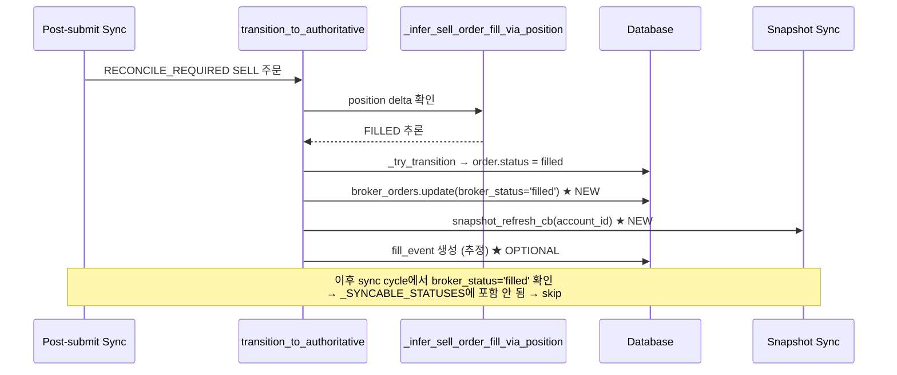

# 체결된 SELL 이후 broker/order/position/cash 정합성 복구 — 진단 보고서 + 복구 설계

> **작성일**: 2026-05-21  
> **대상 시스템**: agent_trading (KIS paper API)  
> **분석 범위**: order_requests → broker_orders → position_snapshots → cash_balance_snapshots → sell_guard

---

## 1. 대표 이상 사례 (DB 샘플 포함)

### 사례 A: `000990` (DB하이텍) — filled + reconcile_required 괴리

| 테이블 | 컬럼 | 값 |
|--------|------|-----|
| `order_requests` | `order_request_id` | `c90293d0-5d63-409a-8931-9e0f9de748f4` |
| | `client_order_id` | `dc-6c2aab85-0509221874` |
| | `symbol` | `000990` (DB하이텍) |
| | `side` | `sell` |
| | `status` | **`filled`** |
| | `requested_quantity` | `10` |
| | `created_at` | `2026-05-20 05:08:31 UTC` |
| | `updated_at` | `2026-05-20 05:10:30 UTC` |
| `broker_orders` | `broker_status` | **`reconcile_required`** ← **이상!** |
| | `broker_native_order_id` | `0000029159` |
| `fill_events` | (empty) | **체결 이벤트 0건** |
| `position_snapshots` | `quantity` | `10` (2026-05-20 23:57 기준, pre-order: 20) |

**Timeline** (UTC):

```
05:06:29  position_snapshot: 000990 qty=20
05:08:31  order_request created (SELL 10)
05:09:51  position_snapshot: 000990 qty=10 ← 포지션 감소 확인
05:10:30  order_request.status → 'filled'
          broker_orders.broker_status → 'reconcile_required' ← 미스매치!
```

### 사례 B: `000810` (삼성화재) — 정상 수렴 (과거 사례)

| 테이블 | 컬럼 | 값 |
|--------|------|-----|
| `order_requests` | `order_request_id` | `5a8bd1fd-da46-495e-a0d6-12f931b61715` |
| | `symbol` | `000810` (삼성화재) |
| | `status` | `filled` |
| | `updated_at` | `2026-05-19 09:32:12 UTC` |
| `broker_orders` | `broker_status` | **`filled`** (정상) |
| `fill_events` | (empty) | 체결 이벤트 0건 |

사례 B는 broker_status가 정상적으로 `filled`로 수렴했다. 이는 reconciliation 경로가 정상 동작했던 시점.

### 사례 C: 대량 미해결 RECONCILE_REQUIRED

2026-05-20 23:53~23:54에 제출된 **7건의 SELL 주문**이 모두 `reconcile_required` 상태로 멈춰 있음:

| 종목 | 심볼 | native_order_id | order_request_id |
|------|------|----------------|-----------------|
| DB하이텍 | 000990 | 0000000499 | 977df82a-... |
| SK네트웍스 | 001740 | 0000000540 | a334abef-... |
| 롯데정밀화학 | 004000 | 0000000507 | 001f5f1c-... |
| 대한항공 | 003490 | 0000000539 | 3ef857e7-... |
| 대한항공 | 003490 | 0000002116 | cde7a87e-... |
| DB손해보험 | 005830 | 0000002646 | f34509cf-... |
| 삼성전자 | 005930 | 0000004770 | bc656238-... |

### Cash Snapshot 이상

```
available_cash = -6,629,580  (음수! KIS paper API dnca_tot_amt)
orderable_amount = 9,050,070 (양수! KIS paper API ord_psbl_cash)
```

모든 최근 cash snapshot (00:31 ~ 01:36)에서 동일한 값. KIS paper API의 `inquire-balance`(VTTC8434R)는 음수 `dnca_tot_amt`를 반환하며, `inquire-psbl-order`(VTTC8908R)는 양수 `ord_psbl_cash`를 반환.

---

## 2. Root Cause 분석

### 2.1 전체 흐름도



### 2.2 핵심 버그: `_infer_sell_order_fill_via_position()`이 `broker_orders.broker_status`를 갱신하지 않음

**버그 위치**: [`src/agent_trading/services/order_sync_service.py`](src/agent_trading/services/order_sync_service.py) — `transition_to_authoritative()` 내 두 지점

**첫 번째 지점** (line 696-740, exception handler):

```python
# lines 696-740 (exception handler)
if order.side == OrderSide.SELL:
    inferred_status = await self._infer_sell_order_fill_via_position(...)
    if inferred_status is not None:
        updated_order = await self._try_transition(order, inferred_status)
        # ← broker_orders.broker_status 갱신 코드 누락!
        return OrderStatusResult(...)
```

**두 번째 지점** (line 832-876, RECONCILE_REQUIRED 유지 시):

```python
# lines 832-876 (still RECONCILE_REQUIRED after resolve)
if order.side == OrderSide.SELL:
    inferred_status = await self._infer_sell_order_fill_via_position(...)
    if inferred_status is not None:
        updated_order = await self._try_transition(order, inferred_status)
        # ← broker_orders.broker_status 갱신 코드 누락!
        return OrderStatusResult(...)
```

**정상 경로** (line 797-803)와 비교:

```python
# lines 797-803 (normal path - CORRECT)
if broker_order.broker_status != status_result.status.value:
    await self.repos.broker_orders.update(
        broker_order_id,
        broker_status=status_result.status.value,  # ← broker_status 갱신!
        updated_at=now,
    )
```

정상 경로에서는 `resolve_unknown_state()`가 FILLED를 반환하면 `broker_orders.broker_status`도 함께 업데이트한다. 그러나 position-inferred 경로는 이 단계를 누락한다.

### 2.3 파생 영향

| 영향 | 설명 |
|------|------|
| **Sell Guard 차단** | sell_guard는 `order_requests.status`를 기준으로 open_sell_qty를 계산하므로 FILLED 주문은 미포함. 그러나 position_snapshot qty도 이미 감소한 상태라 `available_sell_qty = position_qty - open_sell_qty = 10 - 0 = 10`이 되어 guard를 통과해야 정상. 문제는 `broker_status=reconcile_required`인 주문이 sell_guard 로직에서 어떻게 처리되느냐에 따라 달라짐. |
| **Snapshot refresh 누락** | `sync_order_post_submit()` (line 265-285)는 `status_changed and current_status == FILLED and fills_synced > 0` 조건에서 snapshot refresh를 트리거한다. position-inferred 경로는 `sync_order_post_submit()`을 거치지 않고 `transition_to_authoritative()` 내에서 직접 FILLED로 전이하므로 snapshot refresh가 트리거되지 않을 수 있음. |
| **Fill events 미생성** | KIS paper API의 `inquire-daily-ccld`가 0건 반환하기 때문에 fill_events가 전혀 생성되지 않음. 전체 DB에 단 1건의 fill_event만 존재하며 이는 수동 복구로 생성된 것. |
| **Cash snapshot 불안정** | KIS paper API의 `inquire-balance`가 음수 `dnca_tot_amt`를 반환하여 `available_cash`가 음수로 표시됨. `inquire-psbl-order`의 `ord_psbl_cash`는 양수. 이는 KIS paper API의 한계로, 실제 버그가 아님. |

---

## 3. 복구 방안 비교

### 방안 A (최소 수정) — position inference 경로에 broker_status 갱신 추가

**변경 범위**: [`order_sync_service.py`](src/agent_trading/services/order_sync_service.py) — `transition_to_authoritative()` 내 2개 지점

**수정 내용**:
1. Position-inferred FILLED 판정 후 `broker_orders.update(broker_status='filled')` 추가
2. 동일 위치에 `snapshot_refresh_cb` 호출 추가

**장점**:
- 최소 코드 변경 (약 10줄)
- 기존 로직 변경 없음
- 위험도 낮음

**단점**:
- 근본 원인(KIS paper API 0건) 해결 아님
- fill_events는 여전히 생성되지 않음
- 이미 발생한 mismatch 수동 복구 필요

### 방안 B (확장 수정) — paper API fallback 전용 경로 신설

**변경 범위**:
1. [`order_sync_service.py`](src/agent_trading/services/order_sync_service.py) — `_infer_sell_order_fill_via_position()` 개선
2. [`kis_snapshot_sync.py`](src/agent_trading/services/kis_snapshot_sync.py) — paper API position 조회 후 자동 fill_event 생성
3. [`run_post_submit_sync_loop.py`](scripts/run_post_submit_sync_loop.py) — paper API fallback 활성화 플래그

**수정 내용**:
- Position-inferred fill 시 fill_event 자동 생성 (requested_qty,推定 avg_price)
- broker_orders.broker_status 갱신 + snapshot refresh 일괄 처리
- Paper API 전용 `get_order_status` fallback (inquire_balance 기반)

**장점**:
- fill_events까지 정상화
- 근본적인 paper API 한계 우회
- 재현 가능한 정합성 보장

**단점**:
- 변경 범위 큼 (약 100+줄)
- 추정 가격 사용으로 정확도 제한
- 실전 전환 시 제거 필요할 수 있음

### 비교 표

| 기준 | 방안 A (최소) | 방안 B (확장) |
|------|:-----------:|:-----------:|
| broker_status 수렴 | ✅ | ✅ |
| fill_events 생성 | ❌ | ✅ |
| snapshot refresh | ✅ (수동 추가) | ✅ |
| sell_guard 정상화 | ✅ | ✅ |
| cash snapshot 정상화 | 부분적 | 부분적 |
| 변경 위험도 | 낮음 | 중간 |
| 코드 변경량 | ~10줄 | ~100줄 |
| 기존 사례 복구 | 수동 필요 | 수동 필요 |

---

## 4. 권장 방안 상세 설계 (방안 A + a)

### 4.1 수정 사항

#### A. `transition_to_authoritative()` — broker_status 갱신 추가

**파일**: [`src/agent_trading/services/order_sync_service.py`](src/agent_trading/services/order_sync_service.py)

**첫 번째 지점** (기존 lines 696-740 부근, exception handler 내):

```python
# position-inferred fill 성공 후 broker_status 갱신 추가
if inferred_status is not None:
    try:
        updated_order = await self._try_transition(order, inferred_status)
        if updated_order.status != order.status:
            # ★broker_orders.broker_status 동기화★
            await self.repos.broker_orders.update(
                broker_order.broker_order_id,
                broker_status=inferred_status.value,
                updated_at=datetime.now(timezone.utc),
            )
            logger.info(
                "transition_to_authoritative: broker_status %s → %s "
                "(order_id=%s) [position_delta_inferred_fill]",
                broker_order.broker_status, inferred_status.value,
                order.order_request_id,
            )
            # ★snapshot refresh 트리거★
            if inferred_status == OrderStatus.FILLED and snapshot_refresh_cb:
                try:
                    await snapshot_refresh_cb(order.account_id)
                except Exception as cb_exc:
                    logger.warning(
                        "Snapshot refresh failed for account=%s: %s",
                        order.account_id, cb_exc,
                    )
            return OrderStatusResult(...)
    except Exception:
        ...
```

**두 번째 지점** (기존 lines 832-876 부근, RECONCILE_REQUIRED 유지 시):

동일한 broker_status 갱신 + snapshot refresh 로직 추가.

#### B. Position-inferred fill 시 fill_event 생성 (선택적)

`_infer_sell_order_fill_via_position()` 성공 후 broker_orders.broker_status 갱신과 함께 fill_event를 생성한다. 단, fill_price는 position snapshot의 `average_price`를 사용한다.

```python
# fill_event 생성 (추정)
if inferred_status == OrderStatus.FILLED:
    pre_order_snapshot = await self.repos.position_snapshots.get_latest_by_account_and_instrument_before(...)
    fill_event = FillEventEntity(
        fill_event_id=uuid4(),
        broker_order_id=broker_order.broker_order_id,
        fill_timestamp=datetime.now(timezone.utc),
        fill_price=pre_order_snapshot.average_price if pre_order_snapshot else Decimal("0"),
        fill_quantity=order.requested_quantity,
        source_channel="position_inferred",
        broker_fill_id=f"position_inferred-{broker_order.broker_native_order_id}",
    )
    await self.repos.fill_events.add(fill_event)
```

#### C. PostSubmitSyncRunner에 snapshot_refresh_cb 전달

현재 [`PostSubmitSyncRunner`](src/agent_trading/services/order_sync_service.py:1144)는 `snapshot_refresh_cb`를 필드로 가지지만 `_sync_reconcile_required_orders()` → `transition_to_authoritative()`로 전달하지 않는다.

```python
# PostSubmitSyncRunner._sync_single_order() 또는 run_sync_cycle()에서
# transition_to_authoritative() 호출 시 snapshot_refresh_cb 전달 필요
```

`transition_to_authoritative()` 메서드 시그니처에 `snapshot_refresh_cb` 파라미터 추가:

```python
async def transition_to_authoritative(
    self,
    account_ref: str,
    broker: BrokerAdapter,
    order: OrderRequestEntity,
    broker_order: BrokerOrderEntity,
    *,
    is_after_hours: bool = False,
    snapshot_refresh_cb: Callable[[UUID], Awaitable[None]] | None = None,  # ★추가
) -> OrderStatusResult | None:
```

### 4.2 수정 후 예상 흐름



### 4.3 복구 스크립트 (기존 데이터 정리)

이미 발생한 mismatch를 정리하기 위한 일회성 복구 스크립트:

```sql
-- broker_orders.broker_status가 reconcile_required지만
-- order_requests.status가 filled인 레코드 정정
UPDATE trading.broker_orders bo
SET broker_status = 'filled',
    updated_at = NOW()
FROM trading.order_requests o
WHERE o.order_request_id = bo.order_request_id
  AND o.status = 'filled'
  AND o.side = 'sell'
  AND bo.broker_status = 'reconcile_required';
```

---

## 5. 변경해야 할 파일 목록

| # | 파일 | 변경 내용 | 우선순위 |
|---|------|----------|---------|
| 1 | [`src/agent_trading/services/order_sync_service.py`](src/agent_trading/services/order_sync_service.py) | `transition_to_authoritative()` 내 두 position-inferred 경로에 broker_status 갱신 추가 | **P0** |
| 2 | [`src/agent_trading/services/order_sync_service.py`](src/agent_trading/services/order_sync_service.py) | `transition_to_authoritative()` 시그니처에 `snapshot_refresh_cb` 파라미터 추가 | **P0** |
| 3 | [`src/agent_trading/services/order_sync_service.py`](src/agent_trading/services/order_sync_service.py) | `_sync_reconcile_required_orders()` → `transition_to_authoritative()` 호출 시 snapshot_refresh_cb 전달 | **P0** |
| 4 | [`scripts/run_post_submit_sync_loop.py`](scripts/run_post_submit_sync_loop.py) | 변경 없음 (snapshot_refresh_cb는 PostSubmitSyncRunner 생성 시 이미 전달됨) | - |
| 5 | [`src/agent_trading/services/order_sync_service.py`](src/agent_trading/services/order_sync_service.py) | `_infer_sell_order_fill_via_position()` 성공 시 fill_event 생성 (선택) | **P1** |
| 6 | (신규 스크립트) | `scripts/fix_broker_status_mismatch.py` — 기존 mismatch 일괄 정정 | **P0** |

---

## 6. 추가해야 할 테스트 목록

| # | 테스트명 | 설명 | 계층 |
|---|---------|------|------|
| 1 | `test_transition_to_authoritative_updates_broker_status_on_position_inferred_fill` | Position-inferred FILLED 시 broker_status가 'filled'로 갱신되는지 검증 | Unit |
| 2 | `test_transition_to_authoritative_triggers_snapshot_refresh_on_position_inferred_fill` | Position-inferred FILLED 후 snapshot_refresh_cb가 호출되는지 검증 | Unit |
| 3 | `test_transition_to_authoritative_creates_fill_event_on_position_inferred_fill` | Position-inferred FILLED 시 fill_event가 생성되는지 검증 | Unit |
| 4 | `test_infer_sell_order_fill_via_position_pre_post_delta` | pre/post position snapshot delta 로직 정확성 검증 (경계값 포함) | Unit |
| 5 | `test_sync_reconcile_required_orders_propagates_snapshot_callback` | `_sync_reconcile_required_orders()`가 callback을 전달하는지 검증 | Integration |
| 6 | `test_fix_broker_status_mismatch_script` | 복구 스크립트가 올바르게 mismatch를 정정하는지 검증 | Integration |
| 7 | `test_sell_guard_with_filled_broker_status` | broker_status='filled'인 주문이 sell_guard open_sell_qty에서 제외되는지 검증 | Unit |

---

## 7. 질문별 답변 요약

### Q1: 왜 `filled` 주문인데 `broker_status`는 `reconcile_required`로 남는가?

**답변**: `_infer_sell_order_fill_via_position()`이 position delta를 통해 FILLED를 추론한 후 `_try_transition()`으로 `order_requests.status`만 FILLED로 변경하고, `broker_orders.broker_status`는 업데이트하지 않기 때문입니다. [`order_sync_service.py`](src/agent_trading/services/order_sync_service.py)의 `transition_to_authoritative()` 내 두 위치(exception handler 경로 및 RECONCILE_REQUIRED 유지 경로)에서 이 누락이 발생합니다.

### Q2: 왜 SELL fill 이후 포지션 감소가 snapshot에 반영되지 않는가?

**답변**: 실제로 **반영되어 있습니다**. `000990`의 position snapshot은 `2026-05-20 05:09:51`에 20→10으로 정상 감소했습니다. 문제는 snapshot이 올바르게 갱신되었음에도 불구하고, `broker_orders.broker_status`가 `reconcile_required`로 남아 있어 시스템이 이 주문을 완전히 FILLED로 인정하지 않는 데 있습니다. sell_guard는 `order_requests.status`(='filled')를 기준으로 open_sell_qty를 계산하므로 guard 자체는 통과하지만, `broker_status` 불일치로 인해 다른 downstream 로직(예: reconciliation 재시도)에서 계속 처리 대상으로 남게 됩니다.

### Q3: 왜 cash snapshot이 일부 cycle에서 0건 또는 비정상 값으로 남는가?

**답변**: KIS paper API의 특성 때문입니다. `inquire-balance`(VTTC8434R)의 `dnca_tot_amt`가 음수를 반환하지만, `inquire-psbl-order`(VTTC8908R)의 `ord_psbl_cash`는 양수를 반환합니다. 두 endpoint가 서로 다른 값을 반환하는 것은 paper API의 알려진 한계입니다. `CASH_SYNC_ZERO` 경고는 snapshot sync loop에서 `cash_synced=0`일 때 발생하는데, 이는 cash balance fetch 실패 시 발생합니다. 현재 데이터로는 cash sync가 실패하지 않고 지속적으로 같은 값을 기록하고 있습니다.

### Q4: `inquire-daily-ccld` 매칭 실패가 현재 정합성 붕괴의 주원인인가?

**답변**: **부분적으로만 맞습니다**. KIS paper API의 `inquire-daily-ccld`가 0건을 반환하는 것은 근본 원인이 아닙니다. 시스템은 이 상황을 처리하기 위해 `resolve_unknown_state()`의 position fallback 경로와 `_infer_sell_order_fill_via_position()`을 설계했습니다. 실제 버그는 이 fallback 경로에서 `broker_orders.broker_status`를 업데이트하지 않은 데 있습니다. `inquire-daily-ccld` 매칭 실패가 발생해도, position 기반 fallback이 올바르게 broker_status까지 갱신했다면 문제가 발생하지 않았을 것입니다.

### Q5: 가장 작은 수정으로 체결 후 상태 수렴을 복구하려면 어디를 고쳐야 하는가?

**답변**: [`order_sync_service.py`](src/agent_trading/services/order_sync_service.py)의 `transition_to_authoritative()` 메서드 내 **2개 위치**에 `broker_orders.broker_status` 갱신 로직을 추가하는 것이 가장 작은 수정입니다:

1. Exception handler 경로 (line 696-740): `resolve_unknown_state()` 실패 후 position inference 성공 시
2. RECONCILE_REQUIRED 유지 경로 (line 832-876): `resolve_unknown_state()`가 RECONCILE_REQUIRED 반환 후 position inference 성공 시

두 위치 모두 `_try_transition()` 호출 직후에 `self.repos.broker_orders.update(broker_order_id, broker_status=inferred_status.value)`를 추가하면 됩니다. 추가로 `snapshot_refresh_cb` 호출도 필요합니다.

---

## 부록: 상세 코드 분석

### 부록 A: `sync_order_post_submit()` 정상 경로 (line 91-297)

```
1. BrokerOrderEntity 조회
2. OrderRequestEntity 조회
3. Terminal/Syncable 상태 체크
4. broker.get_order_status() 호출 → OrderStatusResult
5. broker_orders.broker_status 갱신 (line 221-226)
6. _try_transition()으로 order.status 변경 시도 (line 230-232)
7. Terminal 상태면 get_fills 스킵, 아니면 _sync_fills() 호출
8. last_synced_at 갱신
9. FILLED로 변경 + fills_synced>0 → snapshot_refresh_cb 호출
```

### 부록 B: `transition_to_authoritative()` 버그 경로 (line 635-930)

```
1. order.status != RECONCILE_REQUIRED → return None
2. broker.resolve_unknown_state() 호출
   2a. inquire-daily-ccld (RECONCILIATION bucket, 7일 범위)
   2b. 매칭 실패 → position check (inquire_balance)
   2c. 둘 다 실패 → RECONCILE_REQUIRED 반환
3. 예외 발생 시 → SELL position inference (line 696-740) → ★broker_status 누락★
4. RECONCILE_REQUIRED 유지 시 → SELL position inference (line 832-876) → ★broker_status 누락★
5. 정상 경로 → broker_orders.broker_status 갱신 (line 797-803) → OK
```

### 부록 C: `_infer_sell_order_fill_via_position()` (line 932-1059)

```
1. SELL-only policy
2. pre_order_snapshot = get_latest_before(broker_order.created_at)
3. current_snapshot = get_latest()
4. position_delta = pre_order_qty - current_qty
5. delta >= requested_qty → FILLED
6. delta > 0 → PARTIALLY_FILLED
7. delta <= 0 → None (cannot infer)
```

**한계**: `pre_order_snapshot`을 `broker_order.created_at` 기준으로 조회하지만, snapshot sync 주기가 5분이므로 pre/post snapshot이 실제 fill 시점을 정확히 반영하지 못할 수 있음.

---

*보고서 작성 완료. 자세한 구현은 Code 모드에서 진행해 주세요.*
