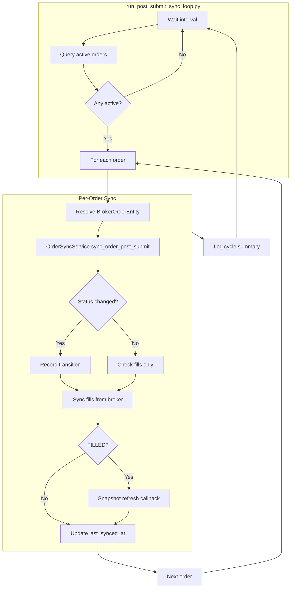

# Post-Submit Sync Scheduler Loop — 설계

## 1. Problem

[`OrderSyncService.sync_order_post_submit()`](src/agent_trading/services/order_sync_service.py)는 단일 주문에 대해 broker 상태/체결 조회를 수행한다. 하지만 이 서비스를 **반복 실행하는 운영용 loop가 없어** SUBMITTED / ACKNOWLEDGED / PARTIALLY_FILLED 상태의 주문이 자동으로 최종 상태(FILLED / CANCELLED / REJECTED)로 수렴되지 않는다.

BACKLOG #17 이 해결해야 할 문제:
> "Scheduler 기반 정기 Post-Submit Sync: `OrderSyncService`를 주기적으로 실행하는 scheduler loop. 미체결/부분체결 주기적 polling으로 상태 최신성 유지"

## 2. 현재 상태 (As-Is)

```
┌────────────────────────────────────────┐
│  assemble_and_submit()                  │
│  Phase 1-5: decision → submit          │
└──────────────┬─────────────────────────┘
               │ SUBMITTED / ACKNOWLEDGED / PARTIALLY_FILLED
               ▼
        ┌──────────────┐
        │  OrderSyncService.sync_order_post_submit()
        │  (단일 주문, 수동 호출만 가능)
        └──────────────┘
               │ FILLED (terminal)
               ▼
        ┌──────────────┐
        │  snapshot refresh callback
        │  (optional, caller가 제공해야 함)
        └──────────────┘
```

## 3. 대상 상태 (To-Be)

```
┌────────────────────────────────────────┐
│  run_post_submit_sync_loop.py          │
│  (scheduler, configurable interval)    │
└──────────────┬─────────────────────────┘
               │ 매 cycle:
               ▼
        ┌──────────────────────────────────┐
        │  1. Query active orders           │
        │     (SUBMITTED / ACKNOWLEDGED /   │
        │      PARTIALLY_FILLED)            │
        ├──────────────────────────────────┤
        │  2. For each:                     │
        │     resolve broker_order          │
        │     sync_order_post_submit()      │
        ├──────────────────────────────────┤
        │  3. Cycle summary log             │
        │     total / updated / filled /    │
        │     errors                        │
        └──────────────────────────────────┘
```

## 4. 변경 사항 요약

| # | 파일 | 변경 유형 | 설명 |
|---|------|----------|------|
| 1 | [`src/agent_trading/repositories/filters.py`](src/agent_trading/repositories/filters.py) | 수정 | `OrderQuery`에 `statuses` 필드 추가 (multi-status filter) |
| 2 | [`src/agent_trading/repositories/memory.py`](src/agent_trading/repositories/memory.py) | 수정 | `InMemoryOrderRepository.list()`에 `statuses` 필터 지원 |
| 3 | [`src/agent_trading/repositories/postgres/orders.py`](src/agent_trading/repositories/postgres/orders.py) | 수정 | `PostgresOrderRepository.list()`에 `statuses` SQL 필터 추가 |
| 4 | [`src/agent_trading/services/order_sync_service.py`](src/agent_trading/services/order_sync_service.py) | 수정 | `PostSubmitSyncRunner` 클래스 추가 (batch sync runner) |
| 5 | [`scripts/run_post_submit_sync_loop.py`](scripts/run_post_submit_sync_loop.py) | **신규** | Scheduler loop script |
| 6 | [`tests/services/test_order_sync_service.py`](tests/services/test_order_sync_service.py) | 수정 | `PostSubmitSyncRunner` 테스트 추가 |
| 7 | [`plans/[BACKLOG] backlog.md`](plans/[BACKLOG]%20backlog.md) | 수정 | Item 17 승격, 후속 정리 |

## 5. 상세 설계

### 5.1 OrderQuery 확장

[`filters.py`](src/agent_trading/repositories/filters.py):

```python
@dataclass(slots=True, frozen=True)
class OrderQuery:
    account_id: UUID | None = None
    client_order_id: str | None = None
    correlation_id: str | None = None
    status: OrderStatus | None = None          # 단일 status (기존, 하위호환)
    statuses: Sequence[OrderStatus] | None = None  # ← 신규: multi-status
    trade_decision_id: UUID | None = None
    decision_context_id: UUID | None = None
    submitted_from: datetime | None = None
    submitted_to: datetime | None = None
    limit: int = 100
```

**InMemory** (`memory.py`): `query.statuses`가 None이 아니면 `item.status in query.statuses` 체크 추가.

**Postgres** (`postgres/orders.py`): `query.statuses`가 None이 아니면 `status IN ($idx, $idx+1, ...)` 조건 추가. `any()`로 SQL IN clause 생성.

### 5.2 PostSubmitSyncRunner

[`order_sync_service.py`](src/agent_trading/services/order_sync_service.py) 하단에 추가:

```python
@dataclass(slots=True, frozen=True)
class SyncCycleResult:
    """결과 요약 of a single sync cycle."""
    total_orders: int
    updated: int          # status_changed=True
    filled: int           # terminal=FILLED
    partial: int          # terminal=False (아직 진행 중)
    errors: list[str]     # error가 있는 주문들

@dataclass(slots=True)
class PostSubmitSyncRunner:
    """Batch runner that discovers active orders and syncs them."""

    repos: RepositoryContainer
    sync_service: OrderSyncService
    broker: BrokerAdapter
    snapshot_refresh_cb: Callable[[UUID], Awaitable[None]] | None = None

    async def run_sync_cycle(
        self,
        account_ref: str | None = None,
    ) -> SyncCycleResult:
        """1. Query active orders (SUBMITTED, ACKNOWLEDGED, PARTIALLY_FILLED).
           2. For each, resolve broker_order and call sync_order_post_submit().
           3. Return summary.
        """
```

**Flow**:

```
run_sync_cycle()
├── 1. Query active orders
│     repos.orders.list(OrderQuery(
│         statuses=[SUBMITTED, ACKNOWLEDGED, PARTIALLY_FILLED]
│     ))
│     → list[OrderRequestEntity]
│
├── 2. For each order:
│   ├── broker_orders = repos.broker_orders.list_by_order_request(order.order_request_id)
│   ├── For each broker_order:
│   │   ├── result = await sync_service.sync_order_post_submit(
│   │   │       account_ref=account_ref or resolved_account_ref,
│   │   │       broker=broker,
│   │   │       broker_order_id=broker_order.broker_order_id,
│   │   │       snapshot_refresh_cb=self.snapshot_refresh_cb,
│   │   │   )
│   │   └── Accumulate result
│   └── (주문 하나 실패해도 계속 진행)
│
└── 3. Return SyncCycleResult
```

**account_ref resolution**:
- Runner가 명시적 `account_ref`를 받으면 그대로 사용
- 받지 않으면 `OrderRequestEntity.account_id` → `AccountRepository.find_one()` → `BrokerAccountRepository`로 ref 조회

하지만 복잡성을 줄이기 위해 **scheduler script에서 직접 account_ref를 받아 전달**하는 방식을 우선한다.

### 5.3 Scheduler Script

[`scripts/run_post_submit_sync_loop.py`](scripts/run_post_submit_sync_loop.py):

`run_snapshot_sync_loop.py` 패턴을 그대로 따름:

```python
# Usage
python scripts/run_post_submit_sync_loop.py                          # 기본 interval (30s)
POST_SUBMIT_SYNC_INTERVAL_SECONDS=10 python scripts/run_post_submit_sync_loop.py
python scripts/run_post_submit_sync_loop.py --once                   # 1회 실행 후 종료
python scripts/run_post_submit_sync_loop.py --account-ref "account_ref"  # 특정 계좌만
```

**주요 특징**:
- Interval: `POST_SUBMIT_SYNC_INTERVAL_SECONDS` env (default 30s)
- `--once` / `--count N` 모드
- `--account-ref` 옵션 (default: settings.kis_account_number)
- Graceful shutdown (SIGINT/SIGTERM)
- Cycle summary 로그 (total / updated / filled / partial / errors)
- Snapshot refresh: `sync_kis_account_snapshots()`를 callback으로 연결

### 5.4 Snapshot Refresh Hook

스크립트에서 snapshot refresh callback을 다음과 같이 구성:

```python
async def _refresh_snapshot(account_id: UUID, repos, rest_client) -> None:
    """Snapshot refresh callback: sync single account."""
    try:
        await sync_kis_account_snapshots(
            rest_client=rest_client,
            instrument_repo=repos.instruments,
            position_snapshot_repo=repos.position_snapshots,
            cash_balance_snapshot_repo=repos.cash_balance_snapshots,
            account_id=account_id,
        )
    except Exception as exc:
        logger.warning("Snapshot refresh failed for account=%s: %s", account_id, exc)
```

**실패 정책**: snapshot refresh 실패는 전체 sync cycle을 중단시키지 않음. `OrderSyncService` 내부에서 예외를 catch하고 `snapshot_triggered=False`로 처리.

### 5.5 Error Handling

| 실패 지점 | 영향 범위 | 처리 |
|-----------|----------|------|
| `OrderSyncService.sync_order_post_submit()` 예외 | 해당 주문만 | 에러 로그, `errors` 리스트에 추가, 다음 주문 계속 |
| Snapshot refresh 예외 | 해당 계좌만 | 경고 로그, cycle은 정상 진행 |
| Active order query 예외 | 전체 cycle 실패 | cycle 에러 로그, 다음 cycle 재시도 |
| Broker adapter auth 실패 | 전체 cycle 실패 | cycle 에러 로그, 다음 cycle 재시도 |

### 5.6 Observable Cycle Summary

각 cycle 종료 시 structured log:

```
post-submit-sync-cycle  orders=5 (updated=2 filled=1 partial=3 errors=0)
```

에러 발생 시 개별 로그:
```
post-submit-sync-error  broker_order=<uuid> error=get_order_status failed: timeout
```

## 6. Mermaid Diagram



## 7. 구현 순서

### Step 1: OrderQuery에 statuses 필드 추가
- [`src/agent_trading/repositories/filters.py`](src/agent_trading/repositories/filters.py): `statuses` 추가
- [`src/agent_trading/repositories/memory.py`](src/agent_trading/repositories/memory.py): InMemory 필터 로직 추가
- [`src/agent_trading/repositories/postgres/orders.py`](src/agent_trading/repositories/postgres/orders.py): SQL `IN` clause 추가

### Step 2: PostSubmitSyncRunner 구현
- [`src/agent_trading/services/order_sync_service.py`](src/agent_trading/services/order_sync_service.py): `SyncCycleResult` + `PostSubmitSyncRunner` 추가

### Step 3: Scheduler script 생성
- [`scripts/run_post_submit_sync_loop.py`](scripts/run_post_submit_sync_loop.py): snapshot sync loop 패턴 기반

### Step 4: 테스트
- [`tests/services/test_order_sync_service.py`](tests/services/test_order_sync_service.py): `PostSubmitSyncRunner` 테스트 추가

### Step 5: Backlog 정리
- [`plans/[BACKLOG] backlog.md`](plans/[BACKLOG]%20backlog.md): Item 17 승격, 후속 등록

## 8. 테스트 계획

| # | 테스트 | 검증 내용 |
|---|-------|----------|
| 1 | `test_runner_only_active_orders` | SUBMITTED/ACKNOWLEDGED/PARTIALLY_FILLED만 polling 대상 |
| 2 | `test_runner_excludes_terminal` | FILLED/REJECTED/CANCELLED는 제외 |
| 3 | `test_runner_excludes_reconcile_required` | RECONCILE_REQUIRED는 제외 |
| 4 | `test_runner_partial_to_filled` | PARTIALLY_FILLED → FILLED 수렴 |
| 5 | `test_runner_filled_triggers_snapshot` | FILLED 시 snapshot refresh callback 호출 |
| 6 | `test_runner_one_failure_does_not_block_others` | 단일 주문 실패 → 다른 주문 계속 polling |
| 7 | `test_runner_empty_cycle` | active order 없음 → empty summary |
| 8 | `test_runner_multiple_broker_orders_per_request` | 하나의 order에 여러 broker_order 존재 |

## 9. 변경 파일 목록 (상세)

### 9.1 filters.py - statuses 필드 추가

```python
# 추가되는 필드
statuses: Sequence[OrderStatus] | None = None
```

### 9.2 memory.py - list() 확장

```python
# InMemoryOrderRepository.list()에 추가
if query.statuses is not None and item.status not in query.statuses:
    continue
```

### 9.3 postgres/orders.py - list() 확장

```python
# PostgresOrderRepository.list()에 추가
if query.statuses is not None:
    placeholders = ",".join(f"${idx + i}" for i in range(len(query.statuses)))
    conditions.append(f"status IN ({placeholders})")
    params.extend(s.value for s in query.statuses)
    idx += len(query.statuses)
```

### 9.4 order_sync_service.py - PostSubmitSyncRunner

```python
@dataclass(slots=True, frozen=True)
class SyncCycleResult:
    total_orders: int
    updated: int
    filled: int
    partial: int
    errors: list[str]

@dataclass(slots=True)
class PostSubmitSyncRunner:
    repos: RepositoryContainer
    sync_service: OrderSyncService
    broker: BrokerAdapter
    snapshot_refresh_cb: Callable[[UUID], Awaitable[None]] | None = None

    async def run_sync_cycle(
        self,
        account_ref: str | None = None,
    ) -> SyncCycleResult:
        ...
```

### 9.5 scripts/run_post_submit_sync_loop.py

`run_snapshot_sync_loop.py`를 템플릿으로 사용. 주요 차이점:
- 브로커 adapter는 `build_snapshot_sync_components`가 아닌 직접 생성 (KIS adapter)
- 각 cycle에서 `PostSubmitSyncRunner.run_sync_cycle()` 호출
- Interval 기본값 30초 (snapshot sync의 300초보다 짧음)

## 10. Backlog 후속

| # | 항목 | 설명 |
|---|------|------|
| 18 | **FillEvent에 broker_fill_id 필드 추가** | Dedup 정밀화 |
| 19 | **WS 기반 실시간 order event 수신** | Polling → 실시간 전환 |
| 20 | **Pipeline Phase 5.5 연동** | `assemble_and_submit()`에서 첫 1회 sync |
| 21 | **Snapshot refresh 직접 통합** | Callback 위임 대신 직접 호출 |
