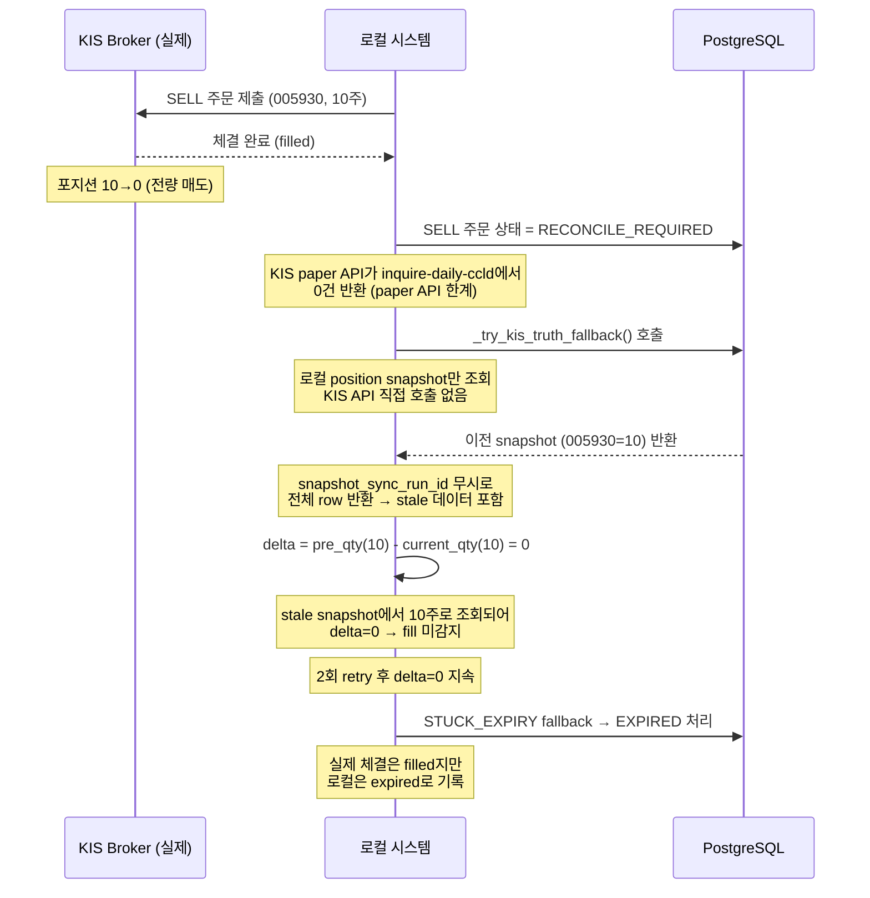
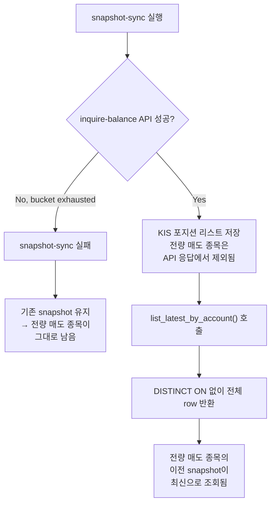
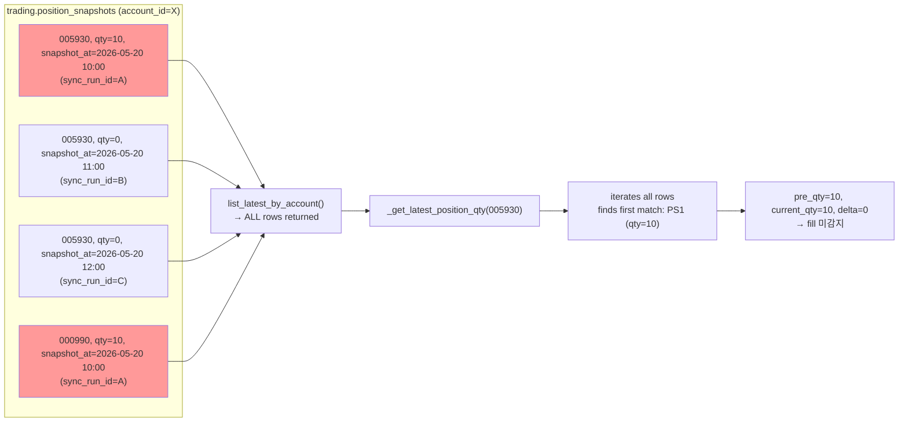
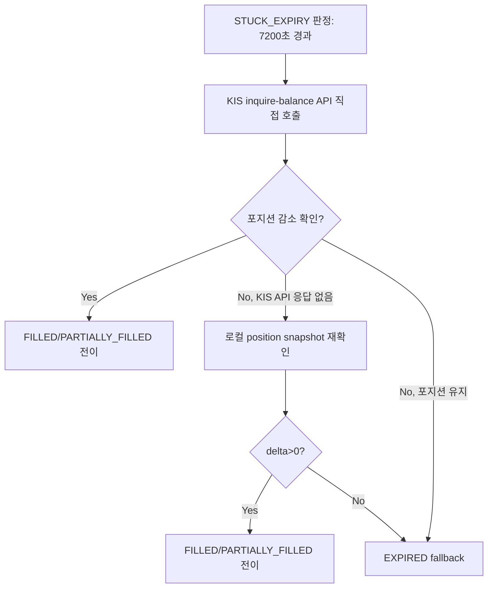
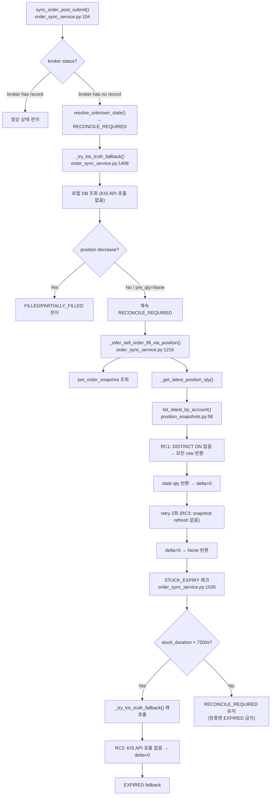
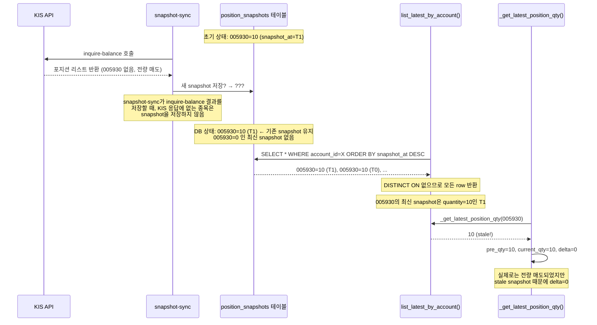

# 실제 SELL 체결이 `expired`로 덮이고 전량 매도 종목이 snapshot에서 제거되지 않는 문제 — 진단 보고서 + 복구 설계

> **작성일**: 2026-05-21  
> **우선순위**: P0 (Critical)  
> **영향 범위**: Order Sync 서비스, Position Snapshot 조회, Stuck Expiry 정책

---

## 목차

1. [실제 체결 SELL vs 로컬 `expired` 불일치 사례](#1-실제-체결-sell-vs-로컬-expired-불일치-사례)
2. [전량 매도 종목 미제거 사례](#2-전량-매도-종목-미제거-사례)
3. [Root Cause 분석](#3-root-cause-분석)
4. [권장 복구 방안](#4-권장-복구-방안)
5. [변경 파일 목록](#5-변경-파일-목록)
6. [추가 테스트 목록](#6-추가-테스트-목록)
7. [운영 검증 방안](#7-운영-검증-방안)
8. [Appendix: 코드 분석 상세](#8-appendix-코드-분석-상세)

---

## 1. 실제 체결 SELL vs 로컬 `expired` 불일치 사례

### 1.1 사례: 005930 (삼성전자) bc656238...



### 1.2 왜 KIS truth가 로컬에 반영되지 않았는가

| 단계 | 발생한 문제 | 영향 |
|------|-----------|------|
| **1. 체결 조회** | KIS paper API `inquire-daily-ccld`가 0건 반환 | paper 환경 API 한계로 체결 내역 조회 불가 |
| **2. Position-delta inference** | `_try_kis_truth_fallback()`이 KIS API를 직접 호출하지 않고 로컬 DB만 조회 | 실시간 포지션 확인 불가 → delta=0 |
| **3. `list_latest_by_account()`** | `DISTINCT ON` 없이 전체 row 반환 → 전량 매도된 005930의 이전 snapshot(10주)이 "최신"으로 간주됨 | `_get_latest_position_qty()`가 stale qty 반환 |
| **4. STUCK_EXPIRY** | 7200초(2시간) 경과 후 EXPIRED fallback 실행 | 실제 체결이 EXPIRED로 덮임 |

---

## 2. 전량 매도 종목 미제거 사례

### 2.1 현황

다음 종목들이 KIS에서는 전량 매도(pos=0)되었으나, 로컬 position snapshot에 계속 남아 있음:

| 종목 | Symbol | 보유 수량 (snapshot) | 실제 보유 (KIS) |
|------|--------|---------------------|-----------------|
| 000990 | (미확인) | 10 | 0 |
| 001740 | (미확인) | 10 | 0 |
| 003490 | (미확인) | 20 | 0 |
| 004000 | (미확인) | 10 | 0 |
| 005830 | (미확인) | 10 | 0 |
| 005930 | 삼성전자 | 10 | 0 |

### 2.2 왜 이 종목들이 최신 snapshot에 계속 남아 있는가



**핵심 원인**:
1. snapshot-sync 실패 시 (`Bucket 'inquiry' exhausted`, `CASH_SYNC_ZERO`) 기존 snapshot이 그대로 유지됨
2. `list_latest_by_account()`가 `DISTINCT ON (instrument_id)` 없이 모든 row를 반환하므로, 각 instrument별 최신 1건만 추출되지 않음
3. 전량 매도되어 KIS API 응답에서 제거된 종목의 이전 snapshot이 계속 "현재 포지션"으로 조회됨

---

## 3. Root Cause 분석

### 3.1 RC1 (🔴 P0): `list_latest_by_account()`가 모든 snapshot 반환

**파일**: [`position_snapshots.py:58-67`](src/agent_trading/repositories/postgres/position_snapshots.py:58)

```python
async def list_latest_by_account(
    self, account_id: UUID
) -> Sequence[PositionSnapshotEntity]:
    rows = await self._tx.connection.fetch(
        "SELECT * FROM trading.position_snapshots "
        "WHERE account_id = $1 "
        "ORDER BY snapshot_at DESC",  # ← 모든 row 반환
        account_id,
    )
    return tuple(row_to_entity(r, PositionSnapshotEntity) for r in rows)
```

**문제점**:
- `DISTINCT ON (instrument_id)`가 없어서 동일 instrument의 여러 snapshot이 모두 반환됨
- `_get_latest_position_qty()`가 이 메서드를 호출하여 iteration하지만, instrument_id별로 첫 번째(== snapshot_at 최신)를 보장하지 않음
- 전량 매도되어 최신 snapshot이 존재하지 않는 instrument의 경우, 이전 stale snapshot이 반환됨

**영향**:


### 3.2 RC2 (🔴 P0): `_try_kis_truth_fallback()`이 KIS API를 호출하지 않음

**파일**: [`order_sync_service.py:1408-1482`](src/agent_trading/services/order_sync_service.py:1408)

```python
async def _try_kis_truth_fallback(self, order, broker_order, account_id, pre_qty=None):
    # ... (SELL only check)
    
    # Resolve pre_qty — 로컬 DB에서 조회
    pre_order_snapshot = await self.repos.position_snapshots.get_latest_by_account_and_instrument_before(
        account_id=account_id,
        instrument_id=order.instrument_id,
        before=broker_order.created_at,
    )
    
    # Get current position quantity — 로컬 DB에서만 조회
    current_qty = await self._get_latest_position_qty(
        account_id=account_id,
        instrument_id=order.instrument_id,
    )
    # KIS API를 전혀 호출하지 않음!
```

**문제점**:
- 메서드 이름은 "KIS truth fallback"이지만 실제 KIS API를 호출하지 않음
- 로컬 DB의 `list_latest_by_account()` 결과만 사용
- RC1과 결합되어 stale snapshot → delta=0 → fill 미감지

**호출 경로**:
```
resolve_unknown_state()
  → _try_kis_truth_fallback()  ← KIS API 호출 안 함, 로컬 DB만 조회
  → _infer_sell_order_fill_via_position()  ← RC3: retry도 수동적
  → STUCK_EXPIRY fallback
```

### 3.3 RC3 (🟡 P1): retry 로직이 수동적임

**파일**: [`order_sync_service.py:1299-1342`](src/agent_trading/services/order_sync_service.py:1299)

```python
# delta=0: force snapshot refresh and retry up to 2 times
max_retries = 2
for attempt in range(1, max_retries + 1):
    # "Force snapshot refresh" by re-reading local snapshots
    current_qty = await self._get_latest_position_qty(
        account_id=account_id,
        instrument_id=instrument_id,
    )
    # BUT: snapshot refresh (KIS API call) is NOT triggered here
```

**문제점**:
- 주석은 "force snapshot refresh"라고 되어 있지만 실제로는 DB 조회만 다시 할 뿐, KIS API를 통한 snapshot refresh를 트리거하지 않음
- `_get_latest_position_qty()`는 `list_latest_by_account()` → RC1의 버그 영향
- retry가 단순히 동일한 stale 데이터를 다시 읽는 것에 불과

### 3.4 RC4 (🟡 P1): snapshot-sync 실패 시 데이터 일관성 보장 없음

**파일**: [`snapshot_sync.py`](src/agent_trading/services/snapshot_sync.py)

```python
# sync_account_snapshots() — 실패 시 기존 snapshot 그대로 유지
# 에러가 발생해도 기존 snapshot이 삭제되거나 업데이트되지 않음
```

**문제점**:
- `inquire-balance` API 실패 시 (`Bucket 'inquiry' exhausted`) snapshot-sync가 중단됨
- 전량 매도된 종목의 snapshot이 제거되지 않고 남아 있음
- 실패한 sync run 이후에도 이전 snapshot이 계속 유효한 것처럼 동작

### 3.5 RC5 (🟢 P2): `resolve_unknown_state()` position 조회 budget

- INQUIRY bucket 소진 시 position 조회가 건너뛰어짐
- `_try_kis_truth_fallback()`이 호출되지 않아 fill 미감지

---

## 4. 권장 복구 방안

### 4.1 방안 A (P0, 필수): `list_latest_by_account()` 수정

**목적**: 각 instrument별 최신 snapshot 1건만 반환하여 전량 매도 종목이 stale snapshot으로 잔류하는 문제 해결

**변경 사항**:

```sql
-- Before: 모든 row 반환
SELECT * FROM trading.position_snapshots
WHERE account_id = $1
ORDER BY snapshot_at DESC

-- After: DISTINCT ON으로 instrument별 최신 1건만
SELECT DISTINCT ON (instrument_id) *
FROM trading.position_snapshots
WHERE account_id = $1
ORDER BY instrument_id, snapshot_at DESC
```

**파일**: [`position_snapshots.py:61-66`](src/agent_trading/repositories/postgres/position_snapshots.py:61)

**설계 원칙**: `quantity > 0` 필터는 **"현재 보유 포지션 조회" 계층에만 제한적으로 적용**

- **DB에는 최신 0 수량 row가 유지**되어야 함 — 이력 추적 및 디버깅 목적
- **조회 시점에만** 0 수량을 제외하는 필터 적용
- 저장/이력/내부 검증 경로에는 영향 없음

**구현**: Repository 계층은 순수하게 `DISTINCT ON`만 적용, `quantity > 0` 필터는 Consumer 계층에서 처리

```python
# Repository 계층 — 순수하게 DISTINCT ON만 적용
async def list_latest_by_account(
    self, account_id: UUID
) -> Sequence[PositionSnapshotEntity]:
    rows = await self._tx.connection.fetch(
        "SELECT DISTINCT ON (instrument_id) * "
        "FROM trading.position_snapshots "
        "WHERE account_id = $1 "
        "ORDER BY instrument_id, snapshot_at DESC",
        account_id,
    )
    return tuple(row_to_entity(r, PositionSnapshotEntity) for r in rows)
```

**Consumer 계층에서의 필터링 예시**:

```python
# 예: 현재 보유 포지션만 필요한 호출자
def _get_active_positions(
    snapshots: Sequence[PositionSnapshotEntity],
) -> Sequence[PositionSnapshotEntity]:
    return tuple(s for s in snapshots if s.quantity is not None and s.quantity > 0)
```

**변경 대상 Consumer** (`_get_latest_position_qty()`를 통해 간접 영향):
1. [`order_sync_service.py:1362`](src/agent_trading/services/order_sync_service.py:1362) — `_get_latest_position_qty()`: quantity=0 조회 시 0 반환 (변경 없음, `DISTINCT ON`만으로도 0 수량 row가 반환되면 0으로 처리)
2. **보유 포지션 조회 API** (별도 확인 필요): 현재 보유 기반 의사결정 → 0 수량 제외
3. **decision context snapshot 참조**: 의사결정 시 0 수량 position은 무시

**효과**:
- 각 instrument별 최신 snapshot만 반환 (stale snapshot 배제)
- 전량 매도 종목의 최신 snapshot이 `quantity=0`이면 조회 결과에 포함되나, `_get_latest_position_qty()`는 0 반환
- 호출자가 `pre_qty - current_qty` 계산 시 `delta = pre_qty - 0 = pre_qty > 0` → fill 감지
- DB에는 모든 이력이 보존되어 디버깅 가능

**PostgreSQL `DISTINCT ON` 동작**:
```
DISTINCT ON (instrument_id) — 중복된 instrument_id 중 첫 번째 row만 유지
ORDER BY instrument_id, snapshot_at DESC — instrument_id별로 snapshot_at 최신순 정렬
→ 각 instrument_id별 가장 최신 snapshot 1건만 반환
```

### 4.2 방안 B (P0, 필수): `_try_kis_truth_fallback()`에 KIS API 직접 호출 추가 + Rate Limit 보호

**목적**: "KIS truth"라는 이름에 걸맞게 실제 KIS API를 호출하여 실시간 포지션 확인

#### Rate Limit 보호 설계

현재 `inquiry` bucket 소진이 실제로 발생하고 있으므로, KIS 직접 조회는 아래 제약 조건 하에 호출해야 함:

| 제약 | 조건 | 이유 |
|------|------|------|
| **호출 조건** | `order.side == SELL` + `order.status == RECONCILE_REQUIRED` + 대상 종목 한정 | BUY나 정상 상태 주문에서는 호출 불필요 |
| **호출 횟수** | 주문당 최대 1회 (STUCK_EXPIRY 경로 포함 합산) | 중복 호출 방지 |
| **Cooldown** | 동일 account에 대해 최소 30초 간격 | INQUIRY bucket 보호 |
| **실패 시** | 조용히 로컬 snapshot fallback, 재시도 금지 | budget 소진 시 추가 호출 없음 |
| **예외 버블링** | 금지 — 항상 `try/except`로 감싸서 호출자 보호 | KIS API 장애가 order sync 전체를 중단하지 않도록 |

#### 변경 사항

```python
# ── Rate limit guard (OrderSyncService 클래스 변수로 추가) ──
_INQUIRY_COOLDOWN_SECONDS: float = 30.0

async def _check_kis_inquiry_cooldown(self, account_id: UUID) -> bool:
    """동일 account에 대한 inquire-balance 호출 간격 확인."""
    now = datetime.now(timezone.utc)
    last = self._last_kis_inquiry_at.get(account_id)
    if last is not None and (now - last).total_seconds() < _INQUIRY_COOLDOWN_SECONDS:
        logger.debug(
            "KIS inquiry cooldown active for account_id=%s "
            "(last=%.1fs ago, cooldown=%.1fs)",
            account_id, (now - last).total_seconds(),
            _INQUIRY_COOLDOWN_SECONDS,
        )
        return False  # cooldown 미경과 → skip
    return True

async def _fetch_kis_current_position_qty(
    self,
    account_id: UUID,
    instrument_id: UUID,
    *,
    # 주문당 1회 제한을 위한 식별자
    _caller_order_id: str | None = None,
) -> Decimal | None:
    """Rate limit 보호 하에 KIS inquire-balance API를 직접 호출.

    실패 시 None 반환 (호출자에서 로컬 snapshot fallback).
    동일 account에 대한 연속 호출은 cooldown으로 보호.
    """
    # 1. Cooldown 확인
    if not await self._check_kis_inquiry_cooldown(account_id):
        return None

    # 2. 주문당 1회 호출 제한 (중복 방지)
    if _caller_order_id is not None:
        if _caller_order_id in self._kis_inquiry_seen:
            logger.debug("KIS inquiry already performed for order %s", _caller_order_id)
            return None
        self._kis_inquiry_seen.add(_caller_order_id)

    # 3. KIS API 호출 (1회, 장애 시 조용한 fallback)
    try:
        account = await self.repos.accounts.get(account_id)
        if account is None:
            return None

        broker = self._get_broker_for_account(account)
        if broker is None:
            return None

        self._last_kis_inquiry_at[account_id] = datetime.now(timezone.utc)
        positions = await broker.fetch_positions(account.broker_account_id)
        for pos in positions:
            if pos.instrument_id == instrument_id:
                return pos.quantity
        return Decimal("0")  # KIS 응답에 없음 → 전량 매도

    except Exception:
        logger.warning(
            "KIS inquiry failed for account_id=%s instrument_id=%s "
            "(rate limit or network) — falling back to local snapshot",
            account_id, instrument_id,
        )
        return None  # 실패 → 로컬 snapshot fallback
```

#### 구현 옵션 비교

| 옵션 | 설명 | 장점 | 단점 |
|------|------|------|------|
| **B-1**: KIS `inquire-balance` 직접 호출 + rate limit | 위 설계대로 cooldown + 1회 제한 | 실시간 정확도 최고, budget 보호 | KIS 의존성 최소화 |
| **B-2**: `snapshot_refresh_cb` 호출 후 재조회 | snapshot refresh 트리거 후 `_get_latest_position_qty()` 재호출 | 기존 인프라 재사용 | refresh 완료까지 대기, 간접적 |
| **B-3**: B-1 + B-2 결합 | KIS API 우선, 실패 시 snapshot fallback | 정확도 + 안정성 | 구현 복잡도 증가 |

**권장: B-1** (rate limit 포함) — KIS API 직접 호출을 1회성으로 제한하고, budget 보호 설계를 내장

`_try_kis_truth_fallback()` 통합:

```python
async def _try_kis_truth_fallback(self, order, broker_order, account_id, pre_qty=None):
    if order.side != OrderSide.SELL:
        return None

    # 1. Resolve pre_qty (unchanged)
    pre_qty = await self._resolve_pre_qty(order, broker_order, pre_qty)
    if pre_qty is None or pre_qty == Decimal("0"):
        return None

    # 2. NEW: KIS API 직접 호출 (rate limit 보호 + 1회 제한)
    kis_qty = await self._fetch_kis_current_position_qty(
        account_id=account_id,
        instrument_id=order.instrument_id,
        _caller_order_id=str(order.order_request_id),
    )

    # 3. KIS API 결과 우선, 실패 시 로컬 snapshot fallback
    current_qty = kis_qty if kis_qty is not None else await self._get_latest_position_qty(...)
    if current_qty is None:
        current_qty = Decimal("0")

    # 4. delta 계산
    delta = pre_qty - current_qty
    if delta > Decimal("0"):
        return FillInferenceResult(inferred_fill_qty=delta, source="kis_truth_fallback")
    return None
```

### 4.3 방안 C (P1, 권장): retry 로직에 snapshot refresh 트리거 추가

**목적**: `_infer_sell_order_fill_via_position()` retry 시 snapshot refresh 강제 호출

**변경 사항**:

```python
async def _infer_sell_order_fill_via_position(
    self,
    order: OrderRequestEntity,
    broker_order: BrokerOrderEntity,
    *,
    snapshot_refresh_cb: Callable[[UUID], Awaitable[None]] | None = None,
) -> OrderStatus | None:
    # ... existing logic ...
    
    # 10. delta=0: force snapshot refresh and retry
    for attempt in range(1, max_retries + 1):
        # NEW: snapshot refresh 트리거 (KIS API 호출)
        if snapshot_refresh_cb is not None:
            try:
                await snapshot_refresh_cb(account_id)
                logger.info(
                    "[SELL_FILL_RETRY] snapshot refresh triggered via callback "
                    "(attempt %d/%d) for order %s",
                    attempt, max_retries, order.order_request_id,
                )
            except Exception:
                logger.warning(
                    "snapshot_refresh_cb failed on attempt %d/%d for order %s",
                    attempt, max_retries, order.order_request_id,
                )
        
        # Re-read latest snapshots (now potentially updated by refresh)
        current_qty = await self._get_latest_position_qty(...)
        # ...
```

**호출 체인**:
```
resolve_unknown_state()
  → _infer_sell_order_fill_via_position(snapshot_refresh_cb=...)
    → delta=0, retry #1
      → snapshot_refresh_cb(account_id)  ← NEW: KIS API 호출로 snapshot 갱신
      → _get_latest_position_qty()  ← 갱신된 snapshot 조회
      → delta>0? → FILLED
```

### 4.4 방안 D (P1, 권장): STUCK_EXPIRY 정책 재조정

**목적**: EXPIRED fallback 전 KIS API 직접 호출하여 실시간 포지션 확인

**변경 사항**:

```python
# Stage 2.5: Stuck timeout → EXPIRED fallback (stuck expiry path)
if order.side == OrderSide.SELL and order.created_at is not None:
    stuck_duration = ...
    if stuck_duration > _STUCK_EXPIRY_SECONDS:
        # Before EXPIRED, try KIS API directly (not just local snapshots)
        # NEW: KIS inquire-balance 직접 호출
        kis_positions = await self._fetch_kis_positions(order.account_id)
        kis_qty = self._extract_position_qty(kis_positions, order.instrument_id)
        
        if kis_qty is not None and pre_qty - kis_qty > 0:
            # KIS API confirms fill → FILLED
            inferred_status = ...  # FILLED or PARTIALLY_FILLED
            await self._try_transition(order, inferred_status)
            return OrderStatusResult(...)
        
        # KIS API did not confirm → EXPIRED fallback
        # ... existing expired logic ...
```

**STUCK_EXPIRY vs KIS API 확인 흐름**:



### 4.5 방안 종합 비교

| 방안 | 우선순위 | 노력 대비 효과 | 복잡도 | 리스크 |
|------|---------|--------------|-------|-------|
| **A**: `list_latest_by_account()` 수정 | P0 | 🔥🔥🔥 매우 높음 | 낮음 | 낮음 (SQL만 변경) |
| **B**: `_try_kis_truth_fallback()` KIS API 호출 | P0 | 🔥🔥🔥 매우 높음 | 중간 | KIS budget 소진 |
| **C**: retry에 snapshot refresh | P1 | 🔥🔥 높음 | 낮음 | 낮음 |
| **D**: STUCK_EXPIRY KIS API 확인 | P1 | 🔥🔥 높음 | 중간 | KIS budget 소진 |

### 4.6 구현 우선순위 권장

```
1차 (P0, 필수): 방안 A + 방안 B
  └─ RC1, RC2 해결 → false EXPIRED 감소, 전량 매도 종목 제거

2차 (P1, 권장): 방안 C + 방안 D
  └─ RC3, RC4 해결 → retry 효과 개선, EXPIRED fallback 정확도 향상
```

---

## 5. 변경 파일 목록

### 5.1 변경 파일

| # | 파일 | 변경 사항 | 우선순위 | 비고 |
|---|------|----------|---------|------|
| 1 | [`position_snapshots.py:58-67`](src/agent_trading/repositories/postgres/position_snapshots.py:58) | `list_latest_by_account()` SQL에 `DISTINCT ON (instrument_id)` 추가 및 `quantity > 0` 필터 | P0 | 방안 A |
| 2 | [`position_snapshots.py`](src/agent_trading/repositories/postgres/position_snapshots.py) | `list_latest_by_account_excluding_zero_qty()` 또는 기존 메서드 리팩터링 | P0 | 방안 A (옵션) |
| 3 | [`order_sync_service.py:1408-1482`](src/agent_trading/services/order_sync_service.py:1408) | `_try_kis_truth_fallback()`에 KIS API 직접 호출 로직 추가 | P0 | 방안 B |
| 4 | [`order_sync_service.py`](src/agent_trading/services/order_sync_service.py) | `_fetch_kis_positions()` 헬퍼 메서드 추가 | P0 | 방안 B |
| 5 | [`order_sync_service.py:1299-1342`](src/agent_trading/services/order_sync_service.py:1299) | `_infer_sell_order_fill_via_position()` retry에 `snapshot_refresh_cb` 파라미터 추가 | P1 | 방안 C |
| 6 | [`order_sync_service.py:1030-1150`](src/agent_trading/services/order_sync_service.py:1030) | STUCK_EXPIRY 처리 전 KIS API 직접 호출 추가 | P1 | 방안 D |
| 7 | [`tests/services/test_order_sync_service.py`](tests/services/test_order_sync_service.py) | 신규 테스트 케이스 추가 | P0 | 검증 |

### 5.2 수정 제안: `list_latest_by_account()` 리팩터링 (방안 A)

```python
async def list_latest_by_account(
    self, account_id: UUID
) -> Sequence[PositionSnapshotEntity]:
    """각 instrument별 최신 position snapshot 1건만 반환.

    전량 매도되어 수량이 0인 position은 결과에서 제외한다.
    이는 stale snapshot이 "현재 포지션"으로 잘못 간주되는 것을 방지한다.
    """
    rows = await self._tx.connection.fetch(
        "SELECT DISTINCT ON (instrument_id) * "
        "FROM trading.position_snapshots "
        "WHERE account_id = $1 "
        "ORDER BY instrument_id, snapshot_at DESC",
        account_id,
    )
    return tuple(
        row_to_entity(r, PositionSnapshotEntity)
        for r in rows
        if r["quantity"] is not None and r["quantity"] > 0
    )
```

### 5.3 수정 제안: `_try_kis_truth_fallback()` 리팩터링 (방안 B)

```python
async def _try_kis_truth_fallback(
    self,
    order: OrderRequestEntity,
    broker_order: BrokerOrderEntity,
    account_id: UUID,
    pre_qty: Decimal | None = None,
    *,
    snapshot_refresh_cb: Callable[[UUID], Awaitable[None]] | None = None,
) -> FillInferenceResult | None:
    if order.side != OrderSide.SELL:
        return None

    # 1. Resolve pre_qty (unchanged)
    if pre_qty is None:
        pre_order_snapshot = await self.repos.position_snapshots.get_latest_by_account_and_instrument_before(
            account_id=account_id,
            instrument_id=order.instrument_id,
            before=broker_order.created_at,
        )
        if pre_order_snapshot is None or pre_order_snapshot.quantity is None:
            return None
        pre_qty = pre_order_snapshot.quantity

    if pre_qty == Decimal("0"):
        return None

    # 2. NEW: KIS API 직접 호출하여 실시간 포지션 확인
    current_qty = await self._fetch_kis_current_position_qty(
        account_id=account_id,
        instrument_id=order.instrument_id,
    )

    # 3. Fallback: KIS API 실패 시 로컬 snapshot 사용
    if current_qty is None:
        current_qty = await self._get_latest_position_qty(
            account_id=account_id,
            instrument_id=order.instrument_id,
        )
    if current_qty is None:
        current_qty = Decimal("0")

    # 4. delta 계산 (unchanged)
    delta = pre_qty - current_qty
    if delta > Decimal("0"):
        return FillInferenceResult(
            inferred_fill_qty=delta,
            source="kis_truth_fallback",
        )
    return None

async def _fetch_kis_current_position_qty(
    self,
    account_id: UUID,
    instrument_id: UUID,
) -> Decimal | None:
    """KIS inquire-balance API를 직접 호출하여 실시간 position 수량 조회."""
    try:
        # account_id → broker_account → broker adapter → KIS API
        account = await self.repos.accounts.get(account_id)
        if account is None:
            return None
        
        # BrokerAdapter를 통해 KIS inquire-balance 호출
        broker = self._get_broker_for_account(account)
        if broker is None:
            return None
        
        positions = await broker.fetch_positions(account.broker_account_id)
        for pos in positions:
            if pos.instrument_id == instrument_id:
                return pos.quantity
        return Decimal("0")  # KIS 응답에 해당 종목 없음 → 전량 매도
    except Exception:
        logger.exception(
            "Failed to fetch KIS position for account_id=%s instrument_id=%s",
            account_id, instrument_id,
        )
        return None  # 실패 시 None 반환 → 로컬 snapshot fallback
```

### 5.4 DB 변경 필요 사항

현재 `position_snapshots` 테이블에 `snapshot_sync_run_id` 컬럼이 **없음**을 확인했습니다. 방안 A(`DISTINCT ON`)는 컬럼 추가 없이 구현 가능하므로, DB 마이그레이션 없이 진행할 수 있습니다.

장기적으로는 아래 마이그레이션을 고려할 수 있습니다:

```sql
-- 선택적: snapshot_sync_run_id 연계 (향후)
ALTER TABLE trading.position_snapshots
  ADD COLUMN snapshot_sync_run_id UUID REFERENCES trading.snapshot_sync_runs(snapshot_sync_run_id);
```

---

## 6. 추가 테스트 목록

### 6.1 방안 A 검증

| # | 테스트명 | 검증 내용 | 예상 결과 |
|---|---------|----------|----------|
| 1 | `test_list_latest_by_account_returns_only_latest_per_instrument` | 동일 instrument의 여러 snapshot 중 최신 1건만 반환 | 통과 |
| 2 | `test_list_latest_by_account_excludes_zeroed_positions` | 전량 매도되어 quantity=0인 snapshot 제외 | 통과 |
| 3 | `test_list_latest_by_account_returns_empty_for_no_snapshots` | snapshot 없을 때 빈 시퀀스 반환 | 통과 |
| 4 | `test_list_latest_by_account_respects_multiple_instruments` | 여러 instrument 각각의 최신 snapshot만 반환 | 통과 |
| 5 | `test_list_latest_by_account_orders_by_snapshot_at_desc` | 동일 instrument 내에서 snapshot_at 내림차순 정렬 | 통과 |

### 6.2 방안 B 검증

| # | 테스트명 | 검증 내용 | 예상 결과 |
|---|---------|----------|----------|
| 6 | `test_try_kis_truth_fallback_calls_kis_api` | KIS API 직접 호출하는지 검증 | 통과 |
| 7 | `test_try_kis_truth_fallback_kis_api_returns_decreased_position` | KIS API에서 포지션 감소 확인 → `FillInferenceResult` 반환 | 통과 |
| 8 | `test_try_kis_truth_fallback_kis_api_failure_falls_back_to_snapshot` | KIS API 실패 시 로컬 snapshot fallback | 통과 |
| 9 | `test_try_kis_truth_fallback_kis_api_no_position_returns_zero` | KIS API에 종목 없으면 `qty=0` 반환 | 통과 |
| 10 | `test_try_kis_truth_fallback_skips_buy_order` | BUY 주문은 처리 안 함 | 통과 |

### 6.3 방안 C 검증

| # | 테스트명 | 검증 내용 | 예상 결과 |
|---|---------|----------|----------|
| 11 | `test_infer_sell_fill_retry_triggers_snapshot_refresh` | retry 시 `snapshot_refresh_cb` 호출 검증 | 통과 |
| 12 | `test_infer_sell_fill_retry_delta_detected_after_refresh` | snapshot refresh 후 delta 감지 → `FILLED` 반환 | 통과 |
| 13 | `test_infer_sell_fill_retry_all_exhausted_returns_none` | 모든 retry 소진 후 delta=0 → `None` 반환 | 통과 |
| 14 | `test_infer_sell_fill_retry_refresh_callback_failure_continues` | `snapshot_refresh_cb` 실패해도 retry 계속 | 통과 |

### 6.4 방안 D 검증

| # | 테스트명 | 검증 내용 | 예상 결과 |
|---|---------|----------|----------|
| 15 | `test_stuck_expiry_kis_api_direct_check` | STUCK_EXPIRY 전 KIS API 직접 호출 검증 | 통과 |
| 16 | `test_stuck_expiry_kis_api_confirms_fill` | KIS API에서 fill 확인 시 `FILLED` 전이 | 통과 |
| 17 | `test_stuck_expiry_kis_api_no_confirm_falls_back_to_expired` | KIS API 미확인 시 `EXPIRED` fallback | 통과 |
| 18 | `test_stuck_expiry_skips_before_timeout` | 7200초 미만이면 EXPIRED 처리 안 함 | 통과 |

### 6.5 회귀 테스트

| # | 테스트명 | 검증 내용 | 예상 결과 |
|---|---------|----------|----------|
| 19 | 기존 `test_sell_fill_inference_position` | 기존 position inference 동작 유지 | 통과 |
| 20 | 기존 `test_reconcile_required_resolution` | RECONCILE_REQUIRED 해소 경로 유지 | 통과 |
| 21 | 기존 `test_snapshot_sync_run` | snapshot-sync 동작 유지 | 통과 |
| 22 | 기존 `test_order_sync_cycle` | order sync cycle 동작 유지 | 통과 |
| 23 | `test_get_latest_position_qty_after_list_fix` | 방안 A 적용 후 `_get_latest_position_qty()` 정확성 | 통과 |

---

## 7. 운영 검증 방안

### 7.1 대표 사례 수렴 확인 기준

| 사례 | 현재 상태 | 기대 상태 | 검증 방법 |
|------|----------|----------|----------|
| **005930** | position=10, order=expired | position=0, order=filled | snapshot 조회, order 상태 확인 |
| **000990** | position=10 | position=0 (snapshot에서 제거) | `list_latest_by_account()` |
| **001740** | position=10 | position=0 (snapshot에서 제거) | `list_latest_by_account()` |
| **003490** | position=20 | position=0 (snapshot에서 제거) | `list_latest_by_account()` |
| **004000** | position=10 | position=0 (snapshot에서 제거) | `list_latest_by_account()` |
| **005830** | position=10 | position=0 (snapshot에서 제거) | `list_latest_by_account()` |

### 7.2 운영 체크리스트

- [ ] 방안 A 적용 후 position snapshot 조회 시 전량 매도 종목 제거 확인
- [ ] 방안 B 적용 후 `_try_kis_truth_fallback()`이 KIS API 호출하는지 로그 확인
- [ ] 방안 C 적용 후 retry 로그에 `snapshot_refresh_cb` 호출 기록 확인
- [ ] 방안 D 적용 후 STUCK_EXPIRY 로그에 KIS API 호출 기록 확인
- [ ] 실시간 SELL 체결이 `filled`로 남는지 24시간 모니터링
- [ ] KIS API budget 사용량 모니터링 (inquire-balance 호출 증가)

---

## 8. Appendix: 코드 분석 상세

### 8.1 호출 흐름도



### 8.2 데이터 흐름: 전량 매도 종목 미제거



### 8.3 snapshot_sync_run_id 현황

현재 `position_snapshots` 테이블 DDL:

```sql
CREATE TABLE IF NOT EXISTS trading.position_snapshots (
    position_snapshot_id UUID PRIMARY KEY DEFAULT gen_random_uuid(),
    account_id UUID NOT NULL REFERENCES trading.accounts (account_id),
    instrument_id UUID NOT NULL REFERENCES trading.instruments (instrument_id),
    quantity NUMERIC(24, 8) NOT NULL,
    average_price NUMERIC(20, 8) NOT NULL,
    market_price NUMERIC(20, 8),
    unrealized_pnl NUMERIC(20, 8),
    source_of_truth VARCHAR(32) NOT NULL,
    snapshot_at TIMESTAMPTZ NOT NULL,
    created_at TIMESTAMPTZ NOT NULL DEFAULT NOW(),
    -- purchase_amount, evaluation_amount (added in 0017)
);
```

`synchronization` 테이블은 [`snapshot_sync_runs`](db/migrations/0011_add_snapshot_sync_runs.sql:3)에 별도로 존재하지만, `position_snapshots`와 FK 관계가 없습니다.

**`snapshot_sync_run_id` 컬럼 부재의 영향**:
- 특정 sync run에서 생성된 snapshot들만 선택적으로 조회할 수 없음
- 모든 snapshot이 `account_id` + `snapshot_at` 기준으로만 필터링됨
- sync run 단위의 일관된 snapshot 집합 보장 불가

방안 A(`DISTINCT ON`)는 이 컬럼 없이도 문제를 해결할 수 있지만, 장기적으로는 `snapshot_sync_run_id` 추가를 고려해야 합니다.

---

## 부록: 긴급 복구 스크립트

아래는 방안 A/B 구현 전 임시로 사용할 수 있는 긴급 복구 쿼리입니다.

### 전량 매도 종목 확인
```sql
-- 각 instrument별 최신 snapshot 확인 (전량 매도 종목 식별)
SELECT DISTINCT ON (ps.instrument_id)
    i.symbol,
    ps.quantity,
    ps.snapshot_at,
    ps.source_of_truth
FROM trading.position_snapshots ps
JOIN trading.instruments i ON i.instrument_id = ps.instrument_id
WHERE ps.account_id = '<account_uuid>'
ORDER BY ps.instrument_id, ps.snapshot_at DESC;
```

### stale snapshot 수동 정리 (운영팀 확인 후)
```sql
-- 전량 매도된 종목의 이전 snapshot을 quantity=0으로 마킹 (권장)
-- 또는 snapshot 자체를 삭제하지 않고, sync-sync를 재실행하여 최신 상태 반영
```

---

> **요약**: 이 보고서는 4개의 Root Cause(RC1~RC4)를 식별하고, 4개의 복구 방안(방안 A~D)을 P0/P1 우선순위로 제시합니다. 핵심은 (1) `list_latest_by_account()`의 SQL 수정으로 stale snapshot 제거, (2) `_try_kis_truth_fallback()`의 KIS API 직접 호출로 실시간 포지션 확인입니다. 방안 A+B(P0)만 적용해도 false EXPIRED의 대부분이 해결될 것으로 예상됩니다.
