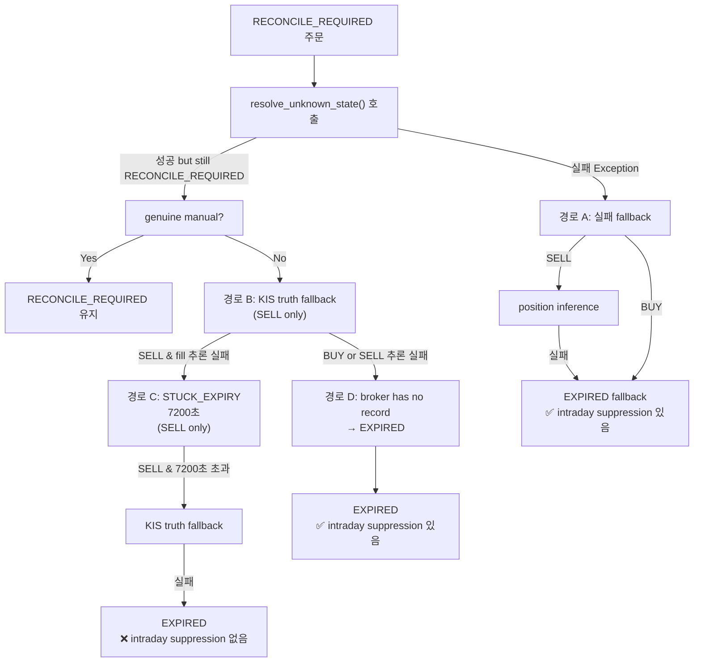
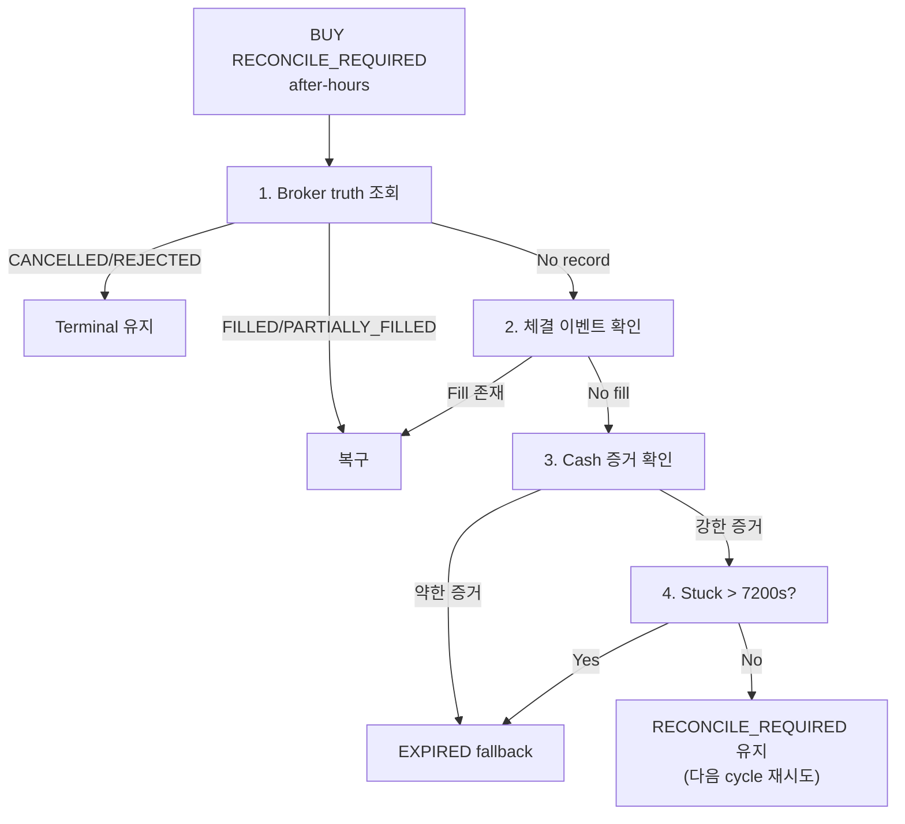

# 장중 BUY/SELL False EXPIRED 방지 및 After-Hours 최종 만료 + 후행 복구 설계

> **버전**: v2 (2026-05-21) — 사용자 피드백 반영: EXPIRED 복구 안전 조건, BUY after-hours 근거 우선순위, 재조회 범위 제한

## 1. Executive Summary

현재 `transition_to_authoritative()`에는 **4개의 EXPIRED fallback 경로**가 존재하지만, 장중 intraday(08:50~15:30 KST)에 BUY/SELL 모두 fallback 기반 EXPIRED 전이를 완전히 차단하지 못하는 갭이 있다. 특히 **STUCK_EXPIRY 경로(경로 C)는 SELL 전용이고 intraday suppression이 없어** 장중 false EXPIRED 위험이 있다. 또한 **BUY는 STUCK_EXPIRY 경로 자체가 없어** after-hours에도 EXPIRED 처리가 불가능하다. **EXPIRED → FILLED 후행 복구 경로도 없다.**

이 문서는 다음 3가지 작업 범위를 설계한다:
1. **장중 BUY/SELL 모두 fallback 기반 EXPIRED 전이 금지** (명시적 broker reject/cancel은 예외)
2. **After-hours (15:30 KST~) 최종 만료: BUY/SELL 모두 EXPIRED 허용**
3. **후행 복구: 실제 체결 신호 수신 시 EXPIRED → FILLED/PARTIALLY_FILLED 복구**

---

## 2. 현재 EXPIRED 전이 경로 분석

### 2.1 `transition_to_authoritative()` — 4개 EXPIRED Fallback 경로



### 2.2 경로별 BUY/SELL 차이

| 경로 | 위치 (line) | SELL | BUY | Intraday Suppression | 문제 |
|------|------------|------|-----|---------------------|------|
| **A**: resolve_unknown_state() 실패 | 708-846 | position inference 후 EXPIRED | 바로 EXPIRED 검사 | ✅ 있음 (line 797-805) | 없음 |
| **B**: KIS truth fallback (broker RECONCILE_REQUIRED) | 883-959 | KIS truth + position inference | 해당 없음 (skip) | N/A (SELL only) | BUY는 KIS truth 확인 불가 |
| **C**: STUCK_EXPIRY (7200s) | 1039-1174 | **SELL 전용** (line 1043-1044) | **해당 없음** | **❌ 없음** | SELL 장중 EXPIRED 위험, BUY는 after-hours에도 EXPIRED 불가 |
| **D**: broker has no record | 1176-1228 | 적용 | 적용 | ✅ 있음 (line 1180-1186) | 없음 |

### 2.3 문제점 요약

**문제 1: STUCK_EXPIRY 경로 C에 intraday suppression 부재**
- `order.side == OrderSide.SELL` 조건 (line 1043-1044)
- `is_after_hours` 체크 없음 → 장중(08:50~15:30 KST)에도 SELL이 7200초 stuck 시 EXPIRED fallback 실행됨
- 사용자 요구사항 위반: 장중에는 BUY/SELL 모두 EXPIRED 금지

**문제 2: BUY STUCK_EXPIRY 경로 부재**
- 경로 C 자체가 `SELL` 조건 (line 1043): `if order.side == OrderSide.SELL`
- BUY는 position inference 대상이 아님 (`_infer_sell_order_fill_via_position()`도 SELL 전용)
- BUY는 경로 A(실패 시)와 경로 D(broker has no record)에서만 EXPIRED 가능
- after-hours(15:30~)가 되어도 STUCK_EXPIRY가 없으면 BUY는 RECONCILE_REQUIRED에 stuck

**문제 3: EXPIRED → FILLED 후행 복구 불가**
- `_ALLOWED_TRANSITIONS` (file: [`src/agent_trading/services/order_manager.py`](src/agent_trading/services/order_manager.py:65-104)): `EXPIRED`에서 출발하는 전이가 **없음**
- `_TERMINAL_STATES` (line 106-113): EXPIRED 포함 → terminal 상태로 간주되어 재처리 제외
- `sync_order_post_submit()` (file: [`src/agent_trading/services/order_sync_service.py`](src/agent_trading/services/order_sync_service.py:186-199)): terminal 상태면 broker truth 재조회 없이 즉시 return

**문제 4: After-hours 최종 만료가 BUY에 적용되지 않음**
- BUY가 경로 D(broker has no record)를 통해서만 after-hours EXPIRED 가능
- 7200초 stuck 체크 없이 바로 경로 D로 가야 함 → 경로 D 도달 조건이 복잡함

---

## 3. 5개 질문에 대한 답변

### Q1: `transition_to_authoritative()` 내 EXPIRED 전이 경로와 BUY/SELL 차이

**답변**: 4개 경로(위 2.2 표 참조) 중 경로 C(STUCK_EXPIRY)가 SELL 전용이고 intraday suppression이 없음. 경로 A와 D는 BUY/SELL 공통이며 intraday suppression이 정상 동작함. 경로 B(KIS truth fallback)는 SELL 전용.

### Q2: `PostSubmitSyncRunner._is_after_hours()` 판별 로직

**답변**: [`KST 15:30`](src/agent_trading/services/order_sync_service.py:1746-1751) 기준. `datetime.now(ZoneInfo("Asia/Seoul"))`의 시각이 15:30 이상이면 after-hours로 판별. `run_sync_cycle()`의 `after_hours` 파라미터가 `None`이면 자동 감지, 명시적 값이면 그대로 사용.

### Q3: BUY/SELL별 현재 expired 전이 경로 차이

**답변**: 
- SELL: 4개 경로 모두 존재 + `_infer_sell_order_fill_via_position()` + `_try_kis_truth_fallback()` 모두 사용 가능
- BUY: 경로 A(실패 시) + 경로 D(broker has no record)만 존재. position inference 불가, KIS truth fallback 불가. STUCK_EXPIRY 없음.
- SELL의 STUCK_EXPIRY는 intraday suppression이 없어 장중 false EXPIRED 위험 있음.

### Q4: 장중/after-hours 판별의 near_real_ops_scheduler 전달 방법

**답변**: 
- [`_post_submit_command(after_hours=True)`](scripts/run_near_real_ops_scheduler.py:660-664)가 `--after-hours` CLI 플래그를 추가
- [`end-of-day sync`](scripts/run_near_real_ops_scheduler.py:795-796): `_post_submit_command(after_hours=True)` 호출
- [`pre-market sync`](scripts/run_near_real_ops_scheduler.py:762-763): `_post_submit_command()` (기본값 False)
- [`intraday due tasks`](scripts/run_near_real_ops_scheduler.py:942-943): `_post_submit_command()` (기본값 False)
- CLI 전달 체인: `_run_loop(after_hours=...)` → `_run_one_cycle(after_hours=...)` → `runner.run_sync_cycle(after_hours=...)`

### Q5: expired 상태 주문의 후행 복구 가능성

**답변**: 현재 **불가능**. `_ALLOWED_TRANSITIONS`에 EXPIRED에서 다른 상태로의 전이가 없고, `sync_order_post_submit()`이 terminal 상태를 skip하기 때문. 수정 필요 사항:
1. `_ALLOWED_TRANSITIONS`에 `EXPIRED → FILLED` 및 `EXPIRED → PARTIALLY_FILLED` 추가
2. `sync_order_post_submit()` 또는 전용 복구 함수에서 EXPIRED 상태 주문도 broker truth 재조회
3. `transition_to_authoritative()`에 EXPIRED 복구 경로 추가

---

## 4. 설계: 수정 사항

### 4.1 수정 1: STUCK_EXPIRY 경로 C에 intraday suppression 추가 + BUY 지원

**대상 파일**: [`src/agent_trading/services/order_sync_service.py`](src/agent_trading/services/order_sync_service.py:1039-1174)

**변경 사항**:
1. `is_after_hours` 파라미터를 STUCK_EXPIRY 블록 상단에서 체크
2. `order.side == OrderSide.SELL` 조건을 `order.side in (OrderSide.BUY, OrderSide.SELL)`로 확장

**의사 코드**:
```python
# Stage 2.5: Stuck timeout → EXPIRED fallback (intraday override)
# BUY/SELL 모두 적용. 장중 intraday(08:50~15:30 KST)에는 EXPIRED 금지.
if order.created_at is not None:
    stuck_duration = (datetime.now(timezone.utc) - order.created_at).total_seconds()
    if stuck_duration > _STUCK_EXPIRY_SECONDS:
        # Intraday: EXPIRED fallback 금지
        if not is_after_hours:
            logger.warning(
                "Intraday: STUCK_EXPIRY suppressed for order %s side=%s "
                "[stuck=%.0fs] — keeping RECONCILE_REQUIRED",
                broker_order.broker_order_id, order.side.value, stuck_duration,
            )
            return None  # 다음 sync cycle에서 재시도
        
        # After-hours: KIS truth fallback 시도 (SELL only)
        if order.side == OrderSide.SELL:
            kis_fill = await self._try_kis_truth_fallback(...)
            if kis_fill is not None and kis_fill.inferred_fill_qty > Decimal("0"):
                # KIS truth confirms fill → FILLED/PARTIALLY_FILLED
                ...
                return OrderStatusResult(...)
        
        # After-hours: KIS truth 미확인 → EXPIRED fallback
        # BUY도 이 경로로 EXPIRED 가능
        updated_order = await self._try_transition(order, OrderStatus.EXPIRED)
        ...
        return OrderStatusResult(...)
```

### 4.2 수정 2: `_ALLOWED_TRANSITIONS`에 EXPIRED → FILLED/PARTIALLY_FILLED 추가 (조건부)

**대상 파일**: [`src/agent_trading/services/order_manager.py`](src/agent_trading/services/order_manager.py:65-104)

**변경 사항**:
```python
_ALLOWED_TRANSITIONS: dict[OrderStatus, set[OrderStatus]] = {
    ...
    OrderStatus.EXPIRED: {
        OrderStatus.FILLED,
        OrderStatus.PARTIALLY_FILLED,
    },
    ...
}
```

**안전 조건 (과복구 방지)**: EXPIRED → FILLED/PARTIALLY_FILLED 복구는 **무조건 허용하지 않으며** 다음 조건을 **모두** 만족해야만 전이를 허용한다:

1. **Explicit broker reject/cancel 아님**: broker truth가 `REJECTED`나 `CANCELLED`를 반환한 경우가 아니라, broker truth 부재나 timeout으로 EXPIRED된 경우에만 복구 대상
2. **After-hours 또는 강한 후행 증거 존재**:
   - After-hours(15:30 KST~)에는 broker truth 재조회 결과 FILLED면 복구 허용
   - Intraday에는 WebSocket fill 이벤트 등 강한 증거(receipt/data)가 있을 때만 복구
3. **최근 주문만 대상**: EXPIRED된 지 24시간 이내 주문만 복구 대상 (오래된 주문은 수동 처리)
4. **BUY 특별 조건**: BUY는 position delta 추론이 불가능하므로 반드시 broker truth(직접 체결 조회) 또는 외부 체결 응답이 있어야 복구 허용. SELL처럼 position snapshot 기반 추론으로 복구 금지

**구현 방안**: `transition_to_authoritative()` 또는 전용 검증 함수에서 이 조건을 검사한 후에만 EXPIRED → FILLED 전이를 호출한다. `_validate_transition()`에서는 단순히 `_ALLOWED_TRANSITIONS`만 검사하므로, 상위 호출자(caller)가 조건을 검증해야 한다.

### 4.3 수정 3: `sync_order_post_submit()` EXPIRED 복구 경로 추가 (범위 제한)

**대상 파일**: [`src/agent_trading/services/order_sync_service.py`](src/agent_trading/services/order_sync_service.py:186-199)

**재조회 범위 제한**: 모든 EXPIRED 주문을 매번 재조회하면 KIS API 비용이 크므로 **다음 조건으로만 제한**한다:

1. **최근 N시간 이내 EXPIRED**: EXPIRED된 지 `_RECENT_EXPIRY_WINDOW_SECONDS`(기본 3600초=1시간) 이내인 주문만 재조회
2. **최근 M건**: 한 cycle당 최대 `_MAX_EXPIRY_RECOVERY_PER_CYCLE`(기본 10건)만 처리
3. **broker truth 불명확 주문 우선**: broker truth가 없이 fallback으로 EXPIRED된 주문을 우선 처리 (명시적 broker reject/cancel은 복구 대상 제외)

**의사 코드**:
```python
# 새 상수 추가 (order_sync_service.py 상단)
_RECENT_EXPIRY_WINDOW_SECONDS: int = 3600  # 1시간
_MAX_EXPIRY_RECOVERY_PER_CYCLE: int = 10   # cycle당 최대 10건

# sync_order_post_submit() 내부
# ── Skip if already terminal ──
if order.status in _TERMINAL_STATUSES:
    # EXPIRED 복구: 최근 N시간 이내, 범위 제한
    if (
        order.status == OrderStatus.EXPIRED
        and order.updated_at is not None
        and (datetime.now(timezone.utc) - order.updated_at).total_seconds()
            < _RECENT_EXPIRY_WINDOW_SECONDS
    ):
        try:
            status_result = await broker.get_order_status(
                account_ref,
                client_order_id=order.client_order_id or "",
                broker_order_id=broker_order.broker_native_order_id,
            )
            broker_status: OrderStatus = status_result.status
            # 안전 조건 검사 (4.2절 참조):
            #   - explicit broker reject/cancel 아님
            #   - after-hours 또는 강한 후행 증거
            #   - BUY는 broker truth 직접 확인 필요
            if _can_recover_expired(order, broker_status):
                order = await self._try_transition(order, broker_status)
        except Exception:
            pass  # 복구 실패 시 기존 terminal 상태 유지
    
    await self._update_last_synced_at(broker_order_id, now)
    return SyncOrderResult(...)
```

### 4.4 수정 4: `transition_to_authoritative()` after-hours BUY EXPIRED 경로 보강

**대상 파일**: [`src/agent_trading/services/order_sync_service.py`](src/agent_trading/services/order_sync_service.py:1176-1228) (경로 D)

**변경 사항**: after-hours에서 BUY도 STUCK_EXPIRY-like 처리를 받을 수 있도록 경로 D 보강

**의사 코드**:
```python
# After-hours: BUY도 stuck duration 기반 EXPIRED fallback
if order.side == OrderSide.BUY and order.created_at is not None:
    stuck_duration = (datetime.now(timezone.utc) - order.created_at).total_seconds()
    if stuck_duration > _STUCK_EXPIRY_SECONDS and is_after_hours:
        logger.warning(
            "BUY STUCK_EXPIRY: order %s stuck for %.0fs → EXPIRED fallback",
            order.order_request_id, stuck_duration,
        )
        updated_order = await self._try_transition(order, OrderStatus.EXPIRED)
        return OrderStatusResult(...)
```

### 4.5 수정 5: `_is_after_hours()` 시장 시간 정밀화 (선택)

**대상 파일**: [`src/agent_trading/services/order_sync_service.py`](src/agent_trading/services/order_sync_service.py:1745-1751)

현재는 단순히 KST 15:30 기준. 실제 KIS 시장 종료 시간(16:00 KST, 동시호가 포함 15:30~16:00)을 반영할 필요가 있을 수 있음. 단, 현행 로직과 일관성을 유지하기 위해 **15:30 기준 유지 권장**.

### 4.6 BUY After-Hours EXPIRED 근거 우선순위

BUY는 position delta 추론(SELL like `_infer_sell_order_fill_via_position()`)이 불가능하므로 after-hours EXPIRED 판정 시 **더 강한 근거**가 필요하다. 아래 우선순위로 판정한다:

```
우선순위 1: Broker Truth (KIS 직접 조회)
  - `broker.get_order_status()` 또는 `_try_kis_truth_fallback()` 호출
  - KIS API가 주문 상태를 확인해주면 그대로 반영
  - 예: "정상 체결됨", "부분 체결됨" → FILLED/PARTIALLY_FILLED
  - 예: "거래소에서 취소됨" → CANCELLED
  - 예: "Broker record 없음" → EXPIRED fallback

우선순위 2: 체결 응답/WebSocket Fill Event
  - WebSocket을 통해 수신된 fill 이벤트가 존재하면 우선 반영
  - FillEventEntity에 broker_order_id 기준으로 조회
  - fill 수량 >= requested_quantity → FILLED
  - fill 수량 > 0 → PARTIALLY_FILLED

우선순위 3: Cash/Order 상태 간접 증거
  - BUY 주문은 현금이 출금되어야 함 (cash balance 감소)
  - cash_balance_snapshots에서 주문 시각 전후 현금 변동 확인
  - 단, 이는 간접 증거이므로 EXPIRED fallback의 보조 근거로만 사용
  - Cash 증거만으로는 FILLED 복구 불가 (EXPIRED 유지)

우선순위 4: Stuck Duration (최후 수단)
  - 7200초 초과 stuck + after-hours
  - 위 1~3번 모두 실패 시 EXPIRED fallback
  - 이 경우 "broker has no record" fallback과 동일하게 처리
```

**BUY after-hours EXPIRED 처리 흐름**:



---

## 5. 전체 수정 범위 요약

| # | 파일 | 라인 | 수정 내용 | 영향 범위 |
|---|------|------|----------|----------|
| 1 | `order_sync_service.py` | 1039-1174 | STUCK_EXPIRY: intraday suppression 추가, BUY 지원 확장, BUY 근거 우선순위 적용 | SELL 장중 EXPIRED 방지, BUY after-hours EXPIRED 가능 |
| 2 | `order_manager.py` | 65-104 | `_ALLOWED_TRANSITIONS` EXPIRED → FILLED/PARTIALLY_FILLED 추가 (안전 조건부) | 후행 복구 허용, 과복구 방지 |
| 3 | `order_sync_service.py` | 186-199 | `sync_order_post_submit()` EXPIRED 복구 경로 추가 (범위 제한: 1시간/10건) | terminal 상태 재처리, API 비용 통제 |
| 4 | `order_sync_service.py` | 1176-1228 | after-hours BUY STUCK_EXPIRY-like 처리 보강 (근거 우선순위 4단계) | BUY after-hours EXPIRED 경로 확보 |
| 5 | (선택) `order_sync_service.py` | 1745-1751 | `_is_after_hours()` 시장 시간 정밀화 | after-hours 판별 정확도 |

---

## 6. 예외 사항

### 6.1 명시적 broker reject/cancel — 장중에도 terminal 유지

다음 상태들은 명시적 broker 응답에 의한 terminal 상태이므로 장중에도 허용:
- `REJECTED`: broker가 주문을 거절 (잔고 부족, 계좌 문제 등)
- `CANCELLED`: 명시적 취소 (broker나 사용자에 의한)

이미 `_ALLOWED_TRANSITIONS`에서 `RECONCILE_REQUIRED → REJECTED`, `RECONCILE_REQUIRED → CANCELLED`가 허용되어 있으므로 별도 수정 불필요.

### 6.2 `_is_genuine_manual_reconciliation()` (line 1640-1675)

이 함수는 broker truth가 `CANCELLED/REJECTED/EXPIRED`를 반환하면 `False`를 반환 (line 1667-1672)하여 auto-resolve를 허용한다. 이 동작은 명시적 broker terminal status를 존중하므로 유지.

---

## 7. 테스트 계획

### 7.1 신규/수정 테스트 케이스

| # | 테스트 | 설명 | 예상 결과 | 파일 |
|---|--------|------|----------|------|
| 1 | `test_intraday_stuck_expiry_suppressed_for_sell` | 장중 SELL STUCK_EXPIRY: `is_after_hours=False`에서 7200초 초과해도 EXPIRED 억제 | RECONCILE_REQUIRED 유지 | `test_order_sync_service.py` |
| 2 | `test_after_hours_stuck_expiry_allowed_for_sell` | after-hours SELL STUCK_EXPIRY: 7200초 초과 → EXPIRED 허용 | EXPIRED | `test_order_sync_service.py` |
| 3 | `test_intraday_stuck_expiry_suppressed_for_buy` | 장중 BUY STUCK_EXPIRY: `is_after_hours=False`에서 EXPIRED 억제 | RECONCILE_REQUIRED 유지 | `test_order_sync_service.py` |
| 4 | `test_after_hours_stuck_expiry_allowed_for_buy` | after-hours BUY STUCK_EXPIRY: 7200초 초과 → EXPIRED 허용 | EXPIRED | `test_order_sync_service.py` |
| 5 | `test_expired_to_filled_recovery_allowed` | EXPIRED → FILLED 전이 허용 확인 | FILLED | `test_order_manager.py` |
| 6 | `test_expired_order_recovered_via_sync` | EXPIRED 상태 주문이 broker truth로 FILLED 확인 시 복구 | FILLED, status_changed=True | `test_order_sync_service.py` |

### 7.2 기존 영향 테스트

```bash
cd /workspace/agent_trading && python3 -m pytest tests/ -x -q --tb=short 2>&1 | tail -30
```

---

## 8. Docker 재빌드 (필요시)

```bash
cd /workspace/agent_trading && docker compose build ops-scheduler && docker compose up -d ops-scheduler
```

---

## 9. 참조 파일

| 파일 | 설명 |
|------|------|
| [`src/agent_trading/services/order_sync_service.py`](src/agent_trading/services/order_sync_service.py) | `transition_to_authoritative()`, `sync_order_post_submit()`, `PostSubmitSyncRunner` |
| [`src/agent_trading/services/order_manager.py`](src/agent_trading/services/order_manager.py) | `_ALLOWED_TRANSITIONS`, `transition_to()`, `transition_to_authoritative()` |
| [`scripts/run_post_submit_sync_loop.py`](scripts/run_post_submit_sync_loop.py) | `--after-hours` CLI, `_run_one_cycle()`, `_run_loop()` |
| [`scripts/run_near_real_ops_scheduler.py`](scripts/run_near_real_ops_scheduler.py) | `_post_submit_command()`, `_run_intraday_due_tasks()`, `_run_end_of_day()` |
