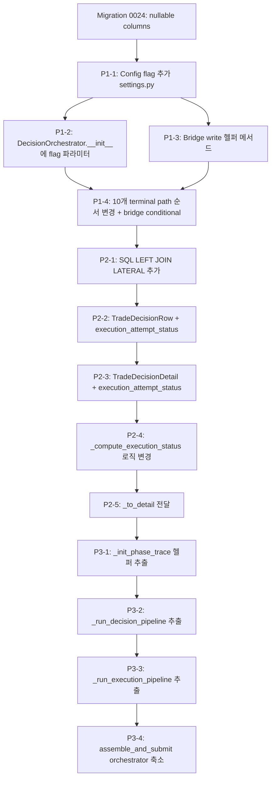

# Phase 4: `ExecutionAttempt`를 write-path 중심으로 승격 — 분석 보고서

> **날짜**: 2026-05-23
> **이전 단계**: Phase 3 (`ExecutionAttemptEntity` 도입, `assemble_and_submit()` 10개 terminal path에 dual-write 추가) 완료
> **목표**: `ExecutionAttempt`를 execution write-path의 primary truth로 승격하고, Decision Pipeline / Execution Pipeline 분리 1차 작업

---

## 1. Current State Analysis: `trade_decisions`가 execution truth로 쓰이는 지점

### 1.1 `update_pipeline_stop()` 호출 10개 지점

`assemble_and_submit()` 내에서 [`update_pipeline_stop()`](src/agent_trading/repositories/postgres/trade_decisions.py:248)은 총 **10개 terminal path**에서 호출된다. 각 호출은 `trade_decisions` 테이블의 `pipeline_stop_phase`, `pipeline_stop_reason`, `pipeline_stopped_at`, `phase_trace` 4개 컬럼을 업데이트한다.

| # | Phase | Stop Phase | Stop Reason | 파일:라인 | `execution_attempts`에 반영된 데이터 |
|---|-------|-----------|-------------|-----------|--------------------------------------|
| 1 | sizing | `"sizing"` | `"sizing_rejected"` | [`decision_orchestrator.py:1266`](src/agent_trading/services/decision_orchestrator.py:1266) | status=`"stopped"`, stop_phase, stop_reason, phase_trace, completed_at |
| 2 | sell_guard | `"sell_guard"` | `"sell_guard_blocked"` | [`decision_orchestrator.py:1363`](src/agent_trading/services/decision_orchestrator.py:1363) | 동일 |
| 3 | translation (HOLD/WATCH) | `"translation"` | `"decision_hold"` / `"decision_watch"` | [`decision_orchestrator.py:1454`](src/agent_trading/services/decision_orchestrator.py:1454) | status=`"non_trade"`, stop_phase, stop_reason, phase_trace, completed_at |
| 4 | order_create (exception) | `"order_create"` | `"order_create_failed"` | [`decision_orchestrator.py:1511`](src/agent_trading/services/decision_orchestrator.py:1511) | status=`"stopped"`, stop_phase, stop_reason, phase_trace, completed_at |
| 5 | transition → VALIDATED (exception) | `"transition"` | `"transition_failed"` | [`decision_orchestrator.py:1557`](src/agent_trading/services/decision_orchestrator.py:1557) | status=`"stopped"`, stop_phase, stop_reason, phase_trace, **order_request_id**, completed_at |
| 6 | transition → PENDING_SUBMIT (exception) | `"transition"` | `"transition_failed"` | [`decision_orchestrator.py:1605`](src/agent_trading/services/decision_orchestrator.py:1605) | 동일 |
| 7 | stale_snapshot_guard (account-level) | `"stale_snapshot_guard"` | `"stale_snapshot"` | [`decision_orchestrator.py:1733`](src/agent_trading/services/decision_orchestrator.py:1733) | status=`"stopped"`, stop_phase, stop_reason, phase_trace, **order_request_id**, completed_at |
| 8 | stale_snapshot_guard (run-level) | `"stale_snapshot_guard"` | `"stale_snapshot"` | [`decision_orchestrator.py:1828`](src/agent_trading/services/decision_orchestrator.py:1828) | 동일 |
| 9 | broker_submit (exception) | `"broker_submit"` | `"broker_submit_failed"` | [`decision_orchestrator.py:1941`](src/agent_trading/services/decision_orchestrator.py:1941) | status=`"failed"`, stop_phase, stop_reason, phase_trace, **order_request_id**, completed_at |
| 10 | completed (정상 종료) | `"completed"` | `""` | [`decision_orchestrator.py:2023`](src/agent_trading/services/decision_orchestrator.py:2023) | status=`"submitted"`/`"reconcile_required"`/`"failed"`, stop_phase, phase_trace, **order_request_id**, completed_at |

**핵심 발견**: 10개 지점 모두에서 [`update_pipeline_stop()`](src/agent_trading/repositories/postgres/trade_decisions.py:248)과 [`execution_attempts.update_status()`](src/agent_trading/repositories/postgres/execution_attempts.py:63)가 **동일한 데이터**를 쓰고 있다. `trade_decisions`에만 쓰이고 `execution_attempts`에는 아직 반영되지 않은 데이터는 **없다**. 즉, Phase 3의 dual-write 설계가 데이터 수준에서는 이미 완전하다.

### 1.2 `_attempt_id` 전달/사용 분석

`_attempt_id`는 [`decision_orchestrator.py:1058`](src/agent_trading/services/decision_orchestrator.py:1058)에서 `None`으로 초기화되고, [`L1060-L1084`](src/agent_trading/services/decision_orchestrator.py:1060)에서 `ExecutionAttemptEntity` 생성 및 저장 후 할당된다.

**`_attempt_id`가 `None`이 될 수 있는 조건**:
1. `trade_decision_id is None` (L1059) — [`_ensure_trade_decision()`](src/agent_trading/services/decision_orchestrator.py:2934) 실패 시
2. `intent.decision_context_id is None` (L1059) — `assemble()` 실패 시
3. [`execution_attempts.add()`](src/agent_trading/repositories/postgres/execution_attempts.py:24) 예외 발생 (L1077-L1084) — DB 오류 시 (non-fatal 처리)

**`_attempt_id` 사용 지점**: 10개 terminal path 모두에서 `if _attempt_id is not None:` 조건으로 보호되어 사용된다.

**문제점**: `_attempt_id`가 `None`이면 `execution_attempts` 업데이트가 **조용히 스킵**된다. 이는 `trade_decision_id` resolve 실패나 DB transient error 시 execution truth가 손실됨을 의미한다.

### 1.3 `phase_trace` dual-write 분석

`phase_trace`는 다음 두 곳에 각각 저장된다:

1. **`trade_decisions.phase_trace`** — [`update_pipeline_stop()`](src/agent_trading/repositories/postgres/trade_decisions.py:260-271)에서 `SET phase_trace = $4::jsonb`로 저장
2. **`execution_attempts.phase_trace`** — [`update_status()`](src/agent_trading/repositories/postgres/execution_attempts.py:80-81)에서 `CASE WHEN $4::jsonb IS NOT NULL THEN $4::jsonb ELSE phase_trace END`로 저장

**dual-write 순서**: 현재는 **`update_pipeline_stop()` 먼저, `execution_attempts.update_status()` 나중** (10개 지점 모두 동일 패턴).

**동기화 보장**: 두 write는 동일한 [`_phase_trace_to_dicts(_phase_trace)`](src/agent_trading/services/decision_orchestrator.py:3048) 결과를 사용하므로 데이터 자체는 동일하다. 그러나:
- 두 write 사이에 예외가 발생하면 `trade_decisions`만 업데이트되고 `execution_attempts`는 업데이트되지 않음
- 트랜잭션 범위 밖에서 실행되므로 원자성 보장 없음

---

## 2. ExecutionAttempt Primary Truth: 최소 변경으로 전환 가능한 지점

### 2.1 `update_pipeline_stop()`과 `update_status()` 호출 순서 변경

**현재**: `update_pipeline_stop()` → `execution_attempts.update_status()`

**변경 후**: `execution_attempts.update_status()` → `update_pipeline_stop()` (bridge write)

이 변경의 의미:
- `execution_attempts` 업데이트가 **항상 먼저 실행**되므로, bridge write 실패 시에도 execution truth는 보존됨
- `update_pipeline_stop()` 실패는 best-effort로 처리 (로그만 남기고 무시)

**변경 필요 지점**: 10개 terminal path 모두에서 두 호출 순서를 swap.

### 2.2 `update_pipeline_stop()`을 conditional하게 만드는 조건

`update_pipeline_stop()` 호출을 conditional하게 전환하는 조건:

1. **Config flag**: `settings.execution_attempt_primary_truth` (bool, default=`False`)
   - `False` (bridge period): 현재와 동일하게 dual-write 유지
   - `True` (primary truth): `update_pipeline_stop()`을 conditional bridge write로 전환

2. **Feature toggle 조건**:
   - `_attempt_id is not None` — execution_attempt가 정상 생성된 경우에만 bridge write 의미 있음
   - `trade_decision_id is not None` — trade_decision이 존재하는 경우에만 bridge write 의미 있음

3. **최종 목표 상태** (bridge period 종료 후):
   - `update_pipeline_stop()` 호출 완전 제거
   - `trade_decisions.pipeline_stop_*` 컬럼 deprecated → 이후 마이그레이션에서 DROP

### 2.3 `_attempt_id` 항상 유효하게 만드는 변경

현재 `_attempt_id`가 `None`이 될 수 있는 세 가지 조건을 각각 해결:

1. **`trade_decision_id is None`** → [`_ensure_trade_decision()`](src/agent_trading/services/decision_orchestrator.py:2934) 실패 시에도 `_attempt_id` 생성 가능하도록 변경
   - `execution_attempts` 테이블에서 `trade_decision_id` nullable로 변경
   - 또는 `_ensure_trade_decision()` 실패 시 재시도 로직 추가

2. **`intent.decision_context_id is None`** → `assemble()` 실패 시에도 execution_attempt 생성
   - `execution_attempts` 테이블에서 `decision_context_id` nullable로 변경

3. **`execution_attempts.add()` 예외** → non-fatal에서 **fatal**로 전환
   - execution_attempt 생성 실패 시 `SubmitResult(status="ERROR")` 반환
   - 단, 이는 기존 동작 변경이므로 별도 논의 필요

**권장 최소 변경**: 조건 1과 2는 `execution_attempts` 테이블에서 `trade_decision_id`와 `decision_context_id`를 nullable로 변경. 조건 3은 유지 (non-fatal)하되 로그 레벨을 WARNING → ERROR로 상향.

---

## 3. Pipeline Split Boundary: Decision Pipeline / Execution Pipeline 분리 경계

### 3.1 현재 `assemble_and_submit()`의 단계 구분

```
assemble_and_submit()
├── Phase 1: ai_assemble (L1005-L1042)
│   ├── assemble() 호출 → AI agents 실행
│   ├── TradeDecisionEntity 생성 (내부 _ensure_trade_decision)
│   └── ExecutionAttempt 생성 (L1056-L1084)
├── Phase 1.5: sizing (L1086-L1314)
│   ├── quote resolution
│   ├── sizing engine
│   └── sell_guard
├── Phase 2: validate/translate (L1413-L1482)
│   └── build_submit_order_request_from_decision()
├── Phase 3: order_create (L1484-L1534)
├── Phase 4a: transition VALIDATED (L1536-L1582)
├── Phase 4b: transition PENDING_SUBMIT (L1584-L1630)
├── Phase 4c: stale_snapshot_guard (L1642-L1865)
├── Phase 5: broker_submit (L1867-L1966)
└── Phase 5.5: post-submit sync (L1968-L2008)
```

### 3.2 Decision Pipeline의 끝 vs Execution Pipeline의 시작

**Decision Pipeline 종료 지점**: [`_ensure_trade_decision()`](src/agent_trading/services/decision_orchestrator.py:2934) 호출 완료 시점 (L880).

**근거**:
- `_ensure_trade_decision()`은 AI 판단 결과를 `TradeDecisionEntity`로 DB에 저장
- 이후 `assemble()`이 반환한 `intent`에는 decision_id, decision_context_id 등 decision 식별 정보만 포함
- `trade_decision_id` resolve (L1044-L1054)는 단순 조회 — decision pipeline의 마지막 단계

**Execution Pipeline 시작 지점**: `ExecutionAttempt` 생성 직후 (L1086, Phase 1.5 시작).

**분리 경계**:
```
Decision Pipeline:
  assemble() → _ensure_trade_decision() → trade_decision_id resolve → [END]

Execution Pipeline:
  ExecutionAttempt 생성 → quote resolution → sizing → sell_guard → 
  translate → order_create → transition → stale_guard → broker_submit → [END]
```

### 3.3 `_ensure_trade_decision()` vs `_ensure_trade_decision_with_attempt()`

**참고**: `_ensure_trade_decision_with_attempt()`는 현재 코드에 존재하지 않음. Phase 3 설계 문서에서 제안된 함수명으로, Phase 4에서 도입 예정.

[`_ensure_trade_decision()`](src/agent_trading/services/decision_orchestrator.py:2934) 호출 직후(L880)가 **decision pipeline의 끝**이다. 그 이유:
- L880 시점에 `TradeDecisionEntity`가 DB에 저장됨 (decision truth 확정)
- L1044-L1054의 `trade_decision_id` resolve는 단순 read 조회
- L1056-L1084의 `ExecutionAttempt` 생성은 execution pipeline의 시작

`_ensure_trade_decision_with_attempt()`가 도입된다면, 이는 decision pipeline의 마지막 단계(`_ensure_trade_decision` + `execution_attempts.add()`)를 하나의 트랜잭션으로 묶는 역할을 한다.

---

## 4. Bridge Period Strategy

### 4.1 전략 개요

Bridge period 동안 `trade_decisions.pipeline_stop_*` / `phase_trace`를 bridge write로 유지하면서, primary truth를 `execution_attempts`로 옮긴다.

```
Bridge Period Phase 1 (현재):
  update_pipeline_stop() → execution_attempts.update_status()
  (trade_decisions가 primary, execution_attempts가 secondary)

Bridge Period Phase 2 (목표):
  execution_attempts.update_status() → update_pipeline_stop() (best-effort)
  (execution_attempts가 primary, trade_decisions가 secondary bridge)

Post-Bridge:
  execution_attempts.update_status() only
  (update_pipeline_stop() 완전 제거)
```

### 4.2 순서 변경 상세

10개 terminal path 모두에서 다음 패턴으로 변경:

```python
# 현재
await self._repos.trade_decisions.update_pipeline_stop(...)
await self._repos.execution_attempts.update_status(...)

# 변경 후
await self._repos.execution_attempts.update_status(...)
if _bridge_enabled:  # config flag
    try:
        await self._repos.trade_decisions.update_pipeline_stop(...)
    except Exception:
        logger.warning("Bridge write failed (non-fatal)")
```

### 4.3 Bridge write 실패 보호

`execution_attempts` 업데이트는 bridge write 실패와 무관하게 보호되어야 한다:

```python
# execution_attempts 업데이트 (primary — 항상 성공해야 함)
await self._repos.execution_attempts.update_status(...)

# bridge write (best-effort — 실패해도 execution truth는 보존)
if _bridge_enabled:
    try:
        await self._repos.trade_decisions.update_pipeline_stop(...)
    except Exception:
        logger.exception("Bridge write failed for trade_decision_id=%s", trade_decision_id)
```

**트랜잭션 고려**: `execution_attempts.update_status()`와 `update_pipeline_stop()`는 서로 다른 트랜잭션에서 실행되므로, bridge write 실패가 execution truth에 영향을 주지 않음. 이는 의도된 설계.

### 4.4 Bridge period 종료 조건

1. 모든 API reader가 `execution_attempts`를 참조하도록 변경 완료
2. [`TradeDecisionDetail._compute_execution_status()`](src/agent_trading/api/schemas.py:373)가 `execution_attempts` 기반으로 동작
3. 모니터링 대시보드가 `execution_attempts` 데이터를 정상 표시
4. 일정 기간(예: 2주) bridge write 실패율 0% 확인

---

## 5. `execution_status` derived field의 source-of-truth 전환

### 5.1 현재 구현

[`TradeDecisionDetail._compute_execution_status()`](src/agent_trading/api/schemas.py:373-385)는 다음 로직으로 `execution_status`를 계산:

```python
if self.order_request_id is not None:
    if self.order_status in ('SUBMITTED', 'REJECTED', 'RECONCILE_REQUIRED'):
        self.execution_status = self.order_status.lower()
    else:
        self.execution_status = 'order_created'
elif self.pipeline_stop_phase is not None:
    self.execution_status = 'pipeline_stopped'
elif self.decision_type in ('HOLD', 'WATCH'):
    self.execution_status = 'non_trade'
else:
    self.execution_status = 'trade_decision_only'
```

**문제점**: `pipeline_stop_phase`는 `trade_decisions` 테이블의 bridge 컬럼에 의존. `execution_attempts.status`를 전혀 참조하지 않음.

### 5.2 `execution_attempts` 기반으로 변경

`execution_attempts.status` 값을 기준으로 `execution_status`를 계산하려면:

1. `TradeDecisionDetail`에 `execution_attempt_status: str | None` 필드 추가
2. API 쿼리에서 `execution_attempts` 테이블 LEFT JOIN 추가
3. `_compute_execution_status()` 로직 변경:

```python
@model_validator(mode='after')
def _compute_execution_status(self) -> 'TradeDecisionDetail':
    if self.execution_attempt_status is not None:
        # execution_attempts.status → execution_status 매핑
        _map = {
            'submitted': 'submitted',
            'failed': 'failed',
            'reconcile_required': 'reconcile_required',
            'stopped': 'pipeline_stopped',
            'non_trade': 'non_trade',
            'running': 'executing',
        }
        self.execution_status = _map.get(self.execution_attempt_status, 'unknown')
    elif self.order_request_id is not None:
        # fallback: order_status 기반
        ...
    elif self.pipeline_stop_phase is not None:
        # fallback: bridge 컬럼 기반
        ...
    else:
        self.execution_status = 'trade_decision_only'
    return self
```

### 5.3 이번 턴의 범위

**API reader가 `execution_attempts`를 참조하도록 변경하는 것은 이번 턴의 범위에 포함되어야 함**. 그 이유:
- `execution_attempts`를 primary truth로 승격하려면 API reader가 이를 소비해야 함
- bridge period 동안 dual source (`trade_decisions` + `execution_attempts`)를 API에서 모두 노출하고, `execution_status`는 `execution_attempts` 우선으로 계산

**구체적 변경 사항**:
1. [`list_all_paginated()`](src/agent_trading/repositories/postgres/trade_decisions.py:176) SQL에 `execution_attempts` LEFT JOIN 추가
2. [`TradeDecisionRow`](src/agent_trading/repositories/contracts.py)에 `execution_attempt_status` 필드 추가
3. [`TradeDecisionDetail`](src/agent_trading/api/schemas.py:300)에 `execution_attempt_status` 필드 추가
4. [`_compute_execution_status()`](src/agent_trading/api/schemas.py:373) 로직 변경

---

## 6. Recommended Implementation Plan

### P1: ExecutionAttempt를 primary truth로 전환 (core 변경)

| # | 작업 | 파일 | 설명 |
|---|------|------|------|
| 1.1 | 호출 순서 변경 (10개 지점) | [`decision_orchestrator.py`](src/agent_trading/services/decision_orchestrator.py) | `execution_attempts.update_status()` 먼저, `update_pipeline_stop()` 나중 |
| 1.2 | Config flag 추가 | [`settings.py`](src/agent_trading/config/settings.py) | `EXECUTION_ATTEMPT_PRIMARY_TRUTH` (bool, default=`False`) |
| 1.3 | Bridge write conditional 전환 | [`decision_orchestrator.py`](src/agent_trading/services/decision_orchestrator.py) | `update_pipeline_stop()`을 flag로 감싸고 try/except로 보호 |
| 1.4 | `_attempt_id` nullable 조건 완화 | [`decision_orchestrator.py`](src/agent_trading/services/decision_orchestrator.py) | `trade_decision_id`/`decision_context_id` 없어도 execution_attempt 생성 |
| 1.5 | Migration: `execution_attempts` nullable 컬럼 | [`db/migrations/`](db/migrations) | `trade_decision_id`, `decision_context_id` → nullable |

### P2: API reader를 execution_attempts 기반으로 전환

| # | 작업 | 파일 | 설명 |
|---|------|------|------|
| 2.1 | `list_all_paginated()` SQL에 LEFT JOIN 추가 | [`trade_decisions.py`](src/agent_trading/repositories/postgres/trade_decisions.py) | `execution_attempts` LEFT JOIN (latest attempt) |
| 2.2 | `TradeDecisionRow`에 `execution_attempt_status` 추가 | [`contracts.py`](src/agent_trading/repositories/contracts.py) | 새로운 필드 |
| 2.3 | `TradeDecisionDetail`에 `execution_attempt_status` 추가 | [`schemas.py`](src/agent_trading/api/schemas.py:300) | API 응답에 노출 |
| 2.4 | `_compute_execution_status()` 로직 변경 | [`schemas.py`](src/agent_trading/api/schemas.py:373) | `execution_attempts.status` 우선 계산 |
| 2.5 | `GET /trade-decisions/{id}`에 execution_attempts 포함 | [`routes/decisions.py`](src/agent_trading/api/routes/decisions.py) | 단건 조회 시 attempt 정보 포함 |

### P3: Pipeline 분리 준비

| # | 작업 | 파일 | 설명 |
|---|------|------|------|
| 3.1 | `_ensure_trade_decision_with_attempt()` 도입 | [`decision_orchestrator.py`](src/agent_trading/services/decision_orchestrator.py) | `_ensure_trade_decision()` + `execution_attempts.add()`를 하나의 트랜잭션으로 |
| 3.2 | Decision Pipeline 함수 추출 | [`decision_orchestrator.py`](src/agent_trading/services/decision_orchestrator.py) | `_run_decision_pipeline()` — `assemble()` + `_ensure_trade_decision_with_attempt()` |
| 3.3 | Execution Pipeline 함수 추출 | [`decision_orchestrator.py`](src/agent_trading/services/decision_orchestrator.py) | `_run_execution_pipeline()` — quote/sizing/guard/translate/create/submit |
| 3.4 | `assemble_and_submit()`을 두 단계로 리팩터 | [`decision_orchestrator.py`](src/agent_trading/services/decision_orchestrator.py) | Phase 1 → Phase 2 호출로 단순화 |

### P4: Bridge period 정리 및 사후 작업

| # | 작업 | 파일 | 설명 |
|---|------|------|------|
| 4.1 | 모니터링: bridge write 실패율 메트릭 | [`decision_orchestrator.py`](src/agent_trading/services/decision_orchestrator.py) | `update_pipeline_stop()` 실패 시 메트릭 수집 |
| 4.2 | Config flag default `True`로 전환 | [`settings.py`](src/agent_trading/config/settings.py) | bridge period 종료 |
| 4.3 | `update_pipeline_stop()` 호출 제거 | [`decision_orchestrator.py`](src/agent_trading/services/decision_orchestrator.py) | 10개 지점에서 bridge write 제거 |
| 4.4 | Migration: `trade_decisions.pipeline_stop_*` DROP | [`db/migrations/`](db/migrations) | bridge 컬럼 제거 |
| 4.5 | `_compute_execution_status()` fallback 제거 | [`schemas.py`](src/agent_trading/api/schemas.py:373) | bridge 컬럼 기반 fallback 로직 제거 |

---

## 부록: 10개 terminal path 상세 위치

| # | Phase | `update_pipeline_stop()` 라인 | `update_status()` 라인 | `SubmitResult` 라인 |
|---|-------|------------------------------|------------------------|---------------------|
| 1 | sizing | 1266 | 1274 | 1281 |
| 2 | sell_guard | 1363 | 1371 | 1378 |
| 3 | translation | 1454 | 1462 | 1469 |
| 4 | order_create | 1511 | 1519 | 1526 |
| 5 | transition→VALIDATED | 1557 | 1565 | 1573 |
| 6 | transition→PENDING_SUBMIT | 1605 | 1613 | 1621 |
| 7 | stale_guard (account) | 1733 | 1741 | 1749 |
| 8 | stale_guard (run) | 1828 | 1836 | 1844 |
| 9 | broker_submit | 1941 | 1949 | 1957 |
| 10 | completed | 2023 | 2039 | 2052 |

---

# Implementation Design — Phase 4 상세 설계

> **작성일**: 2026-05-23
> **대상 파일**: 아래 명시된 각 파일
> **설계 범위**: P1 / P2 / P3 (P4는 문서화만, 이번 턴 구현 범위 밖)

---

## 7. Config: `EXECUTION_ATTEMPT_PRIMARY_TRUTH`

### 7.1 설정 추가

[`src/agent_trading/config/settings.py`](src/agent_trading/config/settings.py)의 `AppSettings` dataclass에 다음 필드를 추가:

```python
# ---- Phase 4: ExecutionAttempt primary truth toggle ----
execution_attempt_primary_truth: bool = True
"""``True``이면 execution_attempts.update_status()가 primary write이고,
``trade_decisions.update_pipeline_stop()``은 best-effort bridge write로 동작.

``False``이면 Phase 3과 동일한 dual-write 유지 (기존 consumer 보호용).

Default ``True`` — 새 동작을 기본값으로 채택.
"""
```

### 7.2 환경 변수 바인딩 (선택 사항)

env override가 필요하면:

```python
def _resolve_execution_attempt_primary_truth() -> bool:
    raw = os.getenv("EXECUTION_ATTEMPT_PRIMARY_TRUTH", "true")
    return raw.strip().lower() == "true"
```

단, 이 값은 런타임에 변경할 필요가 거의 없으므로 hard-coded `True`도 무방.

### 7.3 DecisionOrchestratorService에 전달

`DecisionOrchestratorService.__init__()`에 `execution_attempt_primary_truth: bool = True` 파라미터 추가:

```python
def __init__(
    self,
    repos: RepositoryContainer,
    *,
    execution_attempt_primary_truth: bool = True,
    # ... 기존 파라미터 ...
) -> None:
    self._execution_attempt_primary_truth = execution_attempt_primary_truth
```

`bootstrap.py`에서 서비스 생성 시 `settings.execution_attempt_primary_truth`를 전달.

---

## 8. DecisionOrchestrator 변경: Pipeline 분리

### 8.1 `_run_decision_pipeline()` 시그니처

```python
async def _run_decision_pipeline(
    self,
    request: SubmitOrderRequest,
    *,
    decision_context_id: UUID | None = None,
    order_intent_id: UUID | None = None,
    seeded_events: list[ExternalEventEntity] | None = None,
) -> _DecisionPipelineResult | None:
    """Decision Pipeline: AI assemble + TradeDecision 저장 + ExecutionAttempt 생성.

    Returns
    -------
    _DecisionPipelineResult | None
        성공 시 ``(intent, trade_decision_id, _attempt_id, decision_context_id)``
        assemble 실패 시 ``None`` (호출자가 SubmitResult를 직접 구성).
    """
```

내부 구조 (`@dataclass`로 반환 타입 정의):

```python
@dataclass(slots=True, frozen=True)
class _DecisionPipelineResult:
    intent: OrderIntent
    trade_decision_id: UUID | None
    attempt_id: UUID | None
    decision_context_id: UUID | None
```

**구현 내용** (현재 `assemble_and_submit()` L999-L1084를 그대로 이관):

```python
# Phase 1: assemble()
_phase_trace, _add_phase = self._init_phase_trace(request.symbol)
_add_phase("ai_assemble", "start")
try:
    intent = await self.assemble(...)
except (asyncio.TimeoutError, Exception) as exc:
    return None  # 호출자가 SubmitResult 구성

# trade_decision_id resolve
trade_decision_id: UUID | None = None
if intent.decision_context_id is not None:
    td = await self._repos.trade_decisions.get_by_context(intent.decision_context_id)
    if td is not None:
        trade_decision_id = td.trade_decision_id

# ExecutionAttempt 생성
_attempt_id: UUID | None = None
# NOTE: nullable 컬럼 migration 이후 trade_decision_id / decision_context_id 없어도 생성 가능
try:
    _now = datetime.now(timezone.utc)
    attempt = ExecutionAttemptEntity(
        execution_attempt_id=uuid4(),
        trade_decision_id=trade_decision_id,       # nullable 허용
        decision_context_id=intent.decision_context_id,  # nullable 허용
        status="running",
        started_at=_now,
        created_at=_now,
    )
    saved = await self._repos.execution_attempts.add(attempt)
    _attempt_id = saved.execution_attempt_id
except Exception:
    logger.error("ExecutionAttempt creation failed. trade_decision_id=%s", trade_decision_id, exc_info=True)
    # _attempt_id = None으로 유지, 이후 모든 update_status()가 스킵됨

return _DecisionPipelineResult(
    intent=intent,
    trade_decision_id=trade_decision_id,
    attempt_id=_attempt_id,
    decision_context_id=intent.decision_context_id or decision_context_id,
)
```

### 8.2 `_run_execution_pipeline()` 시그니처

```python
async def _run_execution_pipeline(
    self,
    intent: OrderIntent,
    trade_decision_id: UUID | None,
    attempt_id: UUID | None,
    decision_context_id: UUID | None,
    *,
    order_manager: OrderManager,
    broker: BrokerAdapter,
    actor_type: str = "system",
    actor_id: str = "decision_orchestrator",
    _phase_trace: list[PhaseTraceEntry],  # decision pipeline에서 이어받음
) -> SubmitResult:
    """Execution Pipeline: sizing → guard → translate → order_create → submit.

    Parameters
    ----------
    intent : OrderIntent
        Decision pipeline에서 반환된 intent.
    trade_decision_id : UUID | None
        TradeDecision ID (bridge write용).
    attempt_id : UUID | None
        ExecutionAttempt ID (primary write용).
    decision_context_id : UUID | None
        Decision context ID.
    _phase_trace : list[PhaseTraceEntry]
        Decision pipeline에서 누적된 phase trace.
    order_manager : OrderManager
        Order lifecycle manager.
    broker : BrokerAdapter
        Broker adapter for submission.
    actor_type, actor_id : str
        Audit identity.

    Returns
    -------
    SubmitResult
        Execution pipeline의 최종 결과.
    """
```

**구현 내용**: 현재 `assemble_and_submit()` L1086-L2059를 이관. 단, phase trace accumulator는 decision pipeline에서 생성된 `_phase_trace`를 그대로 사용하고, `_add_phase` closure는 재정의.

### 8.3 `assemble_and_submit()` — Orchestrator로 축소

```python
async def assemble_and_submit(
    self,
    request: SubmitOrderRequest,
    *,
    order_manager: OrderManager,
    broker: BrokerAdapter,
    decision_context_id: UUID | None = None,
    order_intent_id: UUID | None = None,
    seeded_events: list[ExternalEventEntity] | None = None,
    actor_type: str = "system",
    actor_id: str = "decision_orchestrator",
) -> SubmitResult:
    """Execute the full AI decision → order submit pipeline.

    Now acts as orchestrator calling ``_run_decision_pipeline()`` then
    ``_run_execution_pipeline()`` sequentially.
    """
    # Phase 1: Decision Pipeline
    result = await self._run_decision_pipeline(
        request,
        decision_context_id=decision_context_id,
        order_intent_id=order_intent_id,
        seeded_events=seeded_events,
    )
    if result is None:
        # assemble() 실패 — phase trace 없이 기본 ERROR 반환
        # (기존 assemble_and_submit() L1018-L1042와 동일)
        return SubmitResult(
            status="ERROR",
            error_phase="ai",
            error_message=f"assemble() failed for symbol={request.symbol}",
            decision_context_id=decision_context_id,
        )

    # Phase 2: Execution Pipeline
    return await self._run_execution_pipeline(
        result.intent,
        result.trade_decision_id,
        result.attempt_id,
        result.decision_context_id,
        order_manager=order_manager,
        broker=broker,
        actor_type=actor_type,
        actor_id=actor_id,
        _phase_trace=result.phase_trace,
    )
```

### 8.4 Phase trace accumulator 리팩터

`_phase_trace`와 `_add_phase`는 현재 `assemble_and_submit()`의 로컬 변수. Pipeline 분리 시 두 pipeline에서 공유해야 함.

**방법 A**: `_run_decision_pipeline()` 내부에서 `_phase_trace`와 `_add_phase`를 생성하고, `_DecisionPipelineResult`에 포함시켜 execution pipeline에 전달.

```python
@dataclass(slots=True, frozen=True)
class _DecisionPipelineResult:
    intent: OrderIntent
    trade_decision_id: UUID | None
    attempt_id: UUID | None
    decision_context_id: UUID | None
    phase_trace: list[PhaseTraceEntry]  # ← 추가
```

**방법 B**: `_init_phase_trace()` 헬퍼 메서드를 만들어 호출자가 명시적으로 초기화.

```python
def _init_phase_trace(self, symbol: str) -> tuple[list[PhaseTraceEntry], Callable]:
    """Phase trace accumulator 초기화.``_phase_trace`` 리스트와 ``_add_phase`` closure 반환."""
    _phase_start = time_module.monotonic()
    _phase_trace: list[PhaseTraceEntry] = []

    def _add_phase(phase: str, status: str) -> None:
        nonlocal _phase_start
        now = time_module.monotonic()
        elapsed = int((now - _phase_start) * 1000)
        _phase_trace.append(PhaseTraceEntry(phase=phase, elapsed_ms=elapsed, status=status))
        _phase_start = now

    return _phase_trace, _add_phase
```

**권장**: 방법 B. `assemble_and_submit()`에서 `_init_phase_trace()`를 호출하고, `_phase_trace`를 `_run_execution_pipeline()`에 직접 전달.

---

## 9. 10개 Terminal Path 변경 상세 (P1)

### 9.1 공통 패턴

10개 path 모두에서 다음 패턴으로 변경:

```python
# BEFORE (Phase 3)
if trade_decision_id is not None:
    await self._repos.trade_decisions.update_pipeline_stop(
        trade_decision_id, phase, reason, datetime.now(timezone.utc),
        phase_trace=_phase_trace_to_dicts(_phase_trace),
    )
if _attempt_id is not None:
    await self._repos.execution_attempts.update_status(
        _attempt_id, status, stop_phase=phase, stop_reason=reason,
        phase_trace=_phase_trace_to_dicts(_phase_trace),
        order_request_id=..., completed_at=datetime.now(timezone.utc),
    )
```

```python
# AFTER (P1 — execution_attempts primary)
if _attempt_id is not None:
    await self._repos.execution_attempts.update_status(
        _attempt_id, status, stop_phase=phase, stop_reason=reason,
        phase_trace=_phase_trace_to_dicts(_phase_trace),
        order_request_id=..., completed_at=datetime.now(timezone.utc),
    )
if self._execution_attempt_primary_truth and trade_decision_id is not None:
    try:
        await self._repos.trade_decisions.update_pipeline_stop(
            trade_decision_id, phase, reason, datetime.now(timezone.utc),
            phase_trace=_phase_trace_to_dicts(_phase_trace),
        )
    except Exception:
        logger.warning(
            "Bridge write failed: trade_decision_id=%s phase=%s",
            trade_decision_id, phase, exc_info=True,
        )
```

### 9.2 Path별 before/after 비교

#### Path 1: sizing (L1266-L1280)
| | `update_pipeline_stop` | `update_status` |
|---|---|---|
| Before | L1266 (첫 번째) | L1274 (두 번째) |
| After | bridge conditional (flag=True시 try/except) | L1266 (첫 번째) |

#### Path 2: sell_guard (L1363-L1377)
| | 호출 1 | 호출 2 |
|---|---|---|
| Before | L1363 | L1371 |
| After | L1371 (첫 번째) | L1363 (bridge, conditional) |

#### Path 3: translation HOLD/WATCH (L1454-L1468)
| | 호출 1 | 호출 2 |
|---|---|---|
| Before | L1454 | L1462 |
| After | L1462 | L1454 (bridge, conditional) |

#### Path 4: order_create (L1511-L1525)
| | 호출 1 | 호출 2 |
|---|---|---|
| Before | L1511 | L1519 |
| After | L1519 | L1511 (bridge, conditional) |

#### Path 5: transition→VALIDATED (L1557-L1572)
| | 호출 1 | 호출 2 |
|---|---|---|
| Before | L1557 | L1565 |
| After | L1565 | L1557 (bridge, conditional) |

#### Path 6: transition→PENDING_SUBMIT (L1605-L1620)
| | 호출 1 | 호출 2 |
|---|---|---|
| Before | L1605 | L1613 |
| After | L1613 | L1605 (bridge, conditional) |

#### Path 7: stale_guard (account) (L1733-L1748)
| | 호출 1 | 호출 2 |
|---|---|---|
| Before | L1733 | L1741 |
| After | L1741 | L1733 (bridge, conditional) |

#### Path 8: stale_guard (run) (L1828-L1843)
| | 호출 1 | 호출 2 |
|---|---|---|
| Before | L1828 | L1836 |
| After | L1836 | L1828 (bridge, conditional) |

#### Path 9: broker_submit (L1941-L1956)
| | 호출 1 | 호출 2 |
|---|---|---|
| Before | L1941 | L1949 |
| After | L1949 | L1941 (bridge, conditional) |

#### Path 10: completed (L2023-L2045)
| | 호출 1 | 호출 2 |
|---|---|---|
| Before | L2023 | L2031-L2039 |
| After | L2031-L2039 | L2023 (bridge, conditional) |

**Path 10 특이사항**: `update_status()`에 조건 분기(`submitted`/`reconcile_required`/`failed`)가 있으므로, `update_pipeline_stop()` bridge write는 `update_status()` 완료 후 조건부로 실행.

### 9.3 Bridge write 공통 헬퍼 추출 (선택 사항)

반복을 줄이기 위해 private 헬퍼 메서드 추출 가능:

```python
async def _bridge_write_pipeline_stop(
    self,
    trade_decision_id: UUID | None,
    phase: str,
    reason: str,
    phase_trace: list[dict[str, object]] | None = None,
) -> None:
    """Best-effort bridge write: ``trade_decisions.update_pipeline_stop()``.

    ``self._execution_attempt_primary_truth``가 ``True``이고
    ``trade_decision_id``가 유효할 때만 실행.
    실패 시 ``logger.warning``만 출력, 예외 전파 안 함.
    """
    if not self._execution_attempt_primary_truth:
        return
    if trade_decision_id is None:
        return
    try:
        await self._repos.trade_decisions.update_pipeline_stop(
            trade_decision_id,
            phase,
            reason,
            datetime.now(timezone.utc),
            phase_trace=phase_trace,
        )
    except Exception:
        logger.warning(
            "Bridge write failed: trade_decision_id=%s phase=%s",
            trade_decision_id, phase, exc_info=True,
        )
```

---

## 10. API Schema 변경 (P2)

### 10.1 `TradeDecisionRow`에 `execution_attempt_status` 추가

[`contracts.py`](src/agent_trading/repositories/contracts.py) `TradeDecisionRow`:

```python
@dataclass(slots=True, frozen=True)
class TradeDecisionRow:
    entity: TradeDecisionEntity
    order_request_id: str | None = None
    order_status: str | None = None
    instrument_name: str | None = None
    phase_trace: list[dict[str, object]] | None = None
    execution_attempt_status: str | None = None  # ← 추가
    """Latest execution_attempt.status for this trade_decision.
    
    Resolved via LEFT JOIN LATERAL on execution_attempts.
    ``None`` if no attempt exists.
    """
```

### 10.2 `TradeDecisionDetail`에 `execution_attempt_status` 추가

[`schemas.py`](src/agent_trading/api/schemas.py) `TradeDecisionDetail`:

```python
class TradeDecisionDetail(BaseModel):
    # ... 기존 필드들 ...
    
    # ── Phase 4: ExecutionAttempt primary truth ──
    execution_attempt_status: str | None = None
    """Latest execution attempt status from execution_attempts table.
    
    Possible values: running, stopped, submitted, failed, non_trade,
    reconcile_required.
    ``None`` if no execution attempt exists for this trade decision.
    """
```

### 10.3 `_compute_execution_status()` 로직 변경

```python
@model_validator(mode='after')
def _compute_execution_status(self) -> 'TradeDecisionDetail':
    if self.execution_attempt_status is not None:
        # execution_attempts.status → execution_status 매핑 (Phase 4 primary)
        _map = {
            'submitted': 'submitted',
            'failed': 'failed',
            'reconcile_required': 'reconcile_required',
            'stopped': 'pipeline_stopped',
            'non_trade': 'non_trade',
            'running': 'executing',
        }
        self.execution_status = _map.get(self.execution_attempt_status, 'unknown')
    elif self.order_request_id is not None:
        # Fallback: order_status 기반 (기존 로직)
        if self.order_status in ('SUBMITTED', 'REJECTED', 'RECONCILE_REQUIRED'):
            self.execution_status = self.order_status.lower()
        else:
            self.execution_status = 'order_created'
    elif self.pipeline_stop_phase is not None:
        # Fallback: bridge 컬럼 기반
        self.execution_status = 'pipeline_stopped'
    elif self.decision_type in ('HOLD', 'WATCH'):
        self.execution_status = 'non_trade'
    else:
        self.execution_status = 'trade_decision_only'

    # ── Phase trace summary (변경 없음) ──
    ...
    return self
```

**중요**: `execution_attempt_status`가 `None`이면 기존 로직으로 fallback. 이는 기존 consumer(DB에 execution_attempts가 없는 레거시 데이터)를 보호한다.

### 10.4 SQL LEFT JOIN 추가

[`trade_decisions.py:list_all_paginated()`](src/agent_trading/repositories/postgres/trade_decisions.py:176):

```python
items_sql = f"""
    SELECT td.*, i.name AS _instrument_name,
           o.order_request_id AS _order_request_id,
           o.status AS _order_status,
           ea.status AS _execution_attempt_status
    FROM trading.trade_decisions td
    LEFT JOIN trading.instruments i
        ON td.symbol = i.symbol AND td.market = i.market_code
    LEFT JOIN trading.order_requests o
        ON td.trade_decision_id = o.trade_decision_id
    LEFT JOIN LATERAL (
        SELECT status
        FROM trading.execution_attempts
        WHERE trade_decision_id = td.trade_decision_id
        ORDER BY started_at DESC
        LIMIT 1
    ) ea ON true
    {where_clause}
    ORDER BY td.created_at DESC, td.trade_decision_id DESC
    LIMIT ${param_idx} OFFSET ${param_idx + 1}
"""
```

**LEFT JOIN LATERAL 사용 이유**: 하나의 trade_decision에 여러 execution_attempt가 있을 수 있으므로, `LIMIT 1`로 최신 1건만 가져오기 위해 LATERAL 서브쿼리 필요.

### 10.5 `_to_detail()`에 execution_attempt_status 전달

[`routes/decisions.py`](src/agent_trading/api/routes/decisions.py) `_to_detail()`:

```python
def _to_detail(row: TradeDecisionRow, instrument_name: str | None = None) -> TradeDecisionDetail:
    d = row.entity
    return TradeDecisionDetail(
        # ... 기존 필드 ...
        execution_attempt_status=row.execution_attempt_status,  # ← 추가
    )
```

### 10.6 `row_to_entity` 호환성

`_execution_attempt_status`는 `row_to_entity()`로 `TradeDecisionEntity`에 매핑되지 않도록 해야 함. 현재 `row_to_entity()`는 `TradeDecisionEntity`에 정의된 필드만 매핑하므로, 새로운 컬럼은 자동으로 무시됨 (`.get()` 패턴 사용). `execution_attempt_status`는 `_execution_attempt_status` alias로 SQL에서 읽고, 직접 `TradeDecisionRow`에 주입.

---

## 11. Bridge Write 안정화 (P1)

### 11.1 try/except wrapping 패턴

모든 bridge write 호출은 `try/except`로 감싸서 `execution_attempts` 업데이트와 독립적으로 만듦:

```python
# execution_attempts.update_status() — primary, 실패 시 예외 전파
if _attempt_id is not None:
    await self._repos.execution_attempts.update_status(...)

# update_pipeline_stop() — bridge, 실패 시 로그만
if self._execution_attempt_primary_truth and trade_decision_id is not None:
    try:
        await self._repos.trade_decisions.update_pipeline_stop(...)
    except Exception:
        logger.warning(
            "Bridge write failed: trade_decision_id=%s phase=%s",
            trade_decision_id, phase, exc_info=True,
        )
```

### 11.2 로그 레벨

bridge write 실패 시 로그 레벨: **`logger.warning()`**.

- `info`보다 높음 — 운영자가 인지할 수 있음
- `error`보다 낮음 — bridge는 보조 자료이므로 알람을 발생시킬 필요 없음
- `exc_info=True` 포함 — 디버깅에 필요한 stack trace 기록

### 11.3 `_attempt_id`가 None인 경우 처리

- `_attempt_id`가 `None`이어도 bridge write는 정상 동작 (trade_decision_id가 있으면 항상 실행)
- bridge write의 전제 조건: `self._execution_attempt_primary_truth == True` AND `trade_decision_id is not None`
- `_attempt_id` 유무와 무관

---

## 12. Migration: NULLABLE 컬럼 변경

### 12.1 새 마이그레이션 파일

`db/migrations/0024_make_execution_attempts_nullable.sql`:

```sql
-- db/migrations/0024_make_execution_attempts_nullable.sql
-- Phase 4: execution_attempts.trade_decision_id와 decision_context_id를
-- nullable로 변경. assemble() 실패 시에도 execution_attempt 생성 가능.

ALTER TABLE trading.execution_attempts
    ALTER COLUMN trade_decision_id DROP NOT NULL;

ALTER TABLE trading.execution_attempts
    ALTER COLUMN decision_context_id DROP NOT NULL;

COMMENT ON COLUMN trading.execution_attempts.trade_decision_id IS
    'Trade decision ID. NULLABLE since Phase 4 — allows execution attempt creation
     even when trade_decision resolution fails.';

COMMENT ON COLUMN trading.execution_attempts.decision_context_id IS
    'Decision context ID. NULLABLE since Phase 4 — allows execution attempt creation
     even when assemble() fails to return a valid context.';
```

### 12.2 `execution_attempts.add()` nullable 처리

[`execution_attempts.py`](src/agent_trading/repositories/postgres/execution_attempts.py:24)의 `add()` 메서드는 nullable 파라미터를 이미 허용 (UUID 타입이 `None`을 받을 수 있음). SQL INSERT도 `$2`, `$3`에 `None`을 받을 수 있으므로 변경 불필요.

### 12.3 `_attempt_id` 생성 조건 완화

[`decision_orchestrator.py`](src/agent_trading/services/decision_orchestrator.py:1059)의 생성 조건 변경:

```python
# BEFORE (Phase 3)
if trade_decision_id is not None and intent.decision_context_id is not None:
    try:
        attempt = ExecutionAttemptEntity(...)
        ...

# AFTER (Phase 4 — nullable migration 이후)
# 항상 execution_attempt 생성 시도, nullable 필드는 None 허용
try:
    _now = datetime.now(timezone.utc)
    attempt = ExecutionAttemptEntity(
        execution_attempt_id=uuid4(),
        trade_decision_id=trade_decision_id,            # nullable
        decision_context_id=intent.decision_context_id,  # nullable (intent에서 가져옴)
        status="running",
        started_at=_now,
        created_at=_now,
    )
    saved = await self._repos.execution_attempts.add(attempt)
    _attempt_id = saved.execution_attempt_id
except Exception:
    logger.error("ExecutionAttempt creation failed (non-fatal)", exc_info=True)
    _attempt_id = None
```

---

## 13. API 응답 호환성 검증

### 13.1 기존 consumer 보호

변경 전후 API 응답 비교:

| 필드 | 변경 전 | 변경 후 | 호환성 |
|------|---------|---------|--------|
| `execution_status` | pipeline_stop_phase 기반 | execution_attempt_status 우선, fallback | ✅ 동일 (데이터一致 시) |
| `execution_attempt_status` | 없음 | 새 필드 추가 | ✅ 추가만 있음 |
| 기존 모든 필드 | 동일 | 동일 | ✅ 변경 없음 |

### 13.2 레거시 데이터 처리

DB에 execution_attempts가 없는 trade_decision (Phase 3 이전 데이터):
- `LEFT JOIN LATERAL` → `ea.status = NULL`
- `execution_attempt_status` = `None`
- `_compute_execution_status()` → 기존 로직으로 fallback (pipeline_stop_phase, order_status 등)
- **완전한 하위 호환성 보장**

---

## 14. 테스트 계획

### 14.1 P1 테스트

| # | 테스트 | 설명 |
|---|--------|------|
| P1-T1 | Config flag=True 시 호출 순서 검증 | `execution_attempts.update_status()`가 `update_pipeline_stop()`보다 먼저 호출되는지 확인 |
| P1-T2 | Config flag=False 시 기존 동작 유지 | flag=False면 Phase 3과 동일한 순서로 dual-write 실행되는지 확인 |
| P1-T3 | Bridge write 실패 시 execution_attempts 영향 없음 | `update_pipeline_stop()`이 예외를 던져도 `execution_attempts.update_status()`는 정상 완료 |
| P1-T4 | Bridge write 실패 로그 레벨 | warning 레벨 로그 출력 확인, 예외 전파 안 함 |
| P1-T5 | `_attempt_id` None 시 bridge write 동작 | `_attempt_id=None`이어도 `trade_decision_id`가 있으면 bridge write 실행 |
| P1-T6 | `_attempt_id` None 시 execution_attempts update 스킵 | `_attempt_id=None`이면 `update_status()` 스킵 (기존 동작 유지) |
| P1-T7 | `execution_attempts.add()` nullable 필드 | `trade_decision_id=None` / `decision_context_id=None`으로 add() 성공 |
| P1-T8 | 10개 path 모두 동일 패턴 | 모든 terminal path에서 위 패턴이 일관되게 적용되었는지 코드 리뷰 |

### 14.2 P2 테스트

| # | 테스트 | 설명 |
|---|--------|------|
| P2-T1 | LEFT JOIN 결과 정확성 | `list_all_paginated()`가 execution_attempts의 최신 status를 정확히 반환 |
| P2-T2 | execution_attempt_status 필드 존재 | API 응답에 `execution_attempt_status` 필드 포함 |
| P2-T3 | execution_status 계산 정확성 | execution_attempt_status 값에 따른 execution_status 매핑 정확성 |
| P2-T4 | execution_attempt 없을 시 fallback | execution_attempts가 없는 레거시 데이터에서 기존 로직으로 fallback |
| P2-T5 | 다중 execution_attempt 처리 | 하나의 trade_decision에 여러 attempt가 있을 때 최신 1건만 반환 |
| P2-T6 | API 응답 스키마 회귀 | 기존 API consumer가 기대하는 모든 필드가 동일하게 유지 |

### 14.3 P3 테스트

| # | 테스트 | 설명 |
|---|--------|------|
| P3-T1 | Decision Pipeline 정상 종료 | `_run_decision_pipeline()`이 올바른 `_DecisionPipelineResult` 반환 |
| P3-T2 | Execution Pipeline 정상 종료 | `_run_execution_pipeline()`이 올바른 `SubmitResult` 반환 |
| P3-T3 | assemble() 실패 → early return | `_run_decision_pipeline()`이 `None` 반환 → `assemble_and_submit()`이 ERROR 반환 |
| P3-T4 | Phase trace continuity | Decision Pipeline에서 생성된 phase trace가 Execution Pipeline까지 연속적으로 이어짐 |
| P3-T5 | 기존 테스트 189개 통과 | 모든 기존 테스트가 변경 후에도 통과 |
| P3-T6 | `assemble_and_submit()` orchestrator 동작 | orchestrator가 두 pipeline을 순차 호출하고 결과를 올바르게 조합 |

### 14.4 통합 테스트

| # | 테스트 | 설명 |
|---|--------|------|
| IT-1 | Full pipeline: assemble → submit | 실제 broker submit까지 전체 파이프라인이 정상 동작 |
| IT-2 | Pipeline stop at 각 phase | 10개 terminal path 각각에서 중단 시 execution_attempts/trade_decisions 모두 정상 기록 |
| IT-3 | API 응답: execution_attempt_status + execution_status | API 응답에서 두 필드가 올바르게 표시 |
| IT-4 | Config flag 전환 | flag=True/False 전환 시 동작 변경 확인 |

---

## 15. 구현 순서 및 의존성



---

## 16. 위험 및 완화

| 위험 | 영향 | 완화 |
|------|------|------|
| bridge write 실패 시 로그 폭주 | 로그 볼륨 증가 | `logger.warning` 한 줄, `exc_info=True`는 첫 발생 시만 |
| LEFT JOIN LATERAL 성능 | trade_decisions page query에 추가 JOIN | execution_attempts.trade_decision_id에 index 존재 |
| _attempt_id 항상 None | execution truth 완전 손실 | ERROR 로그 + 모니터링 알림 |
| nullable migration으로 인한 참조 무결성 손실 | 고아 execution_attempt row 가능 | trade_decision_id가 있는 경우 FK 유지, 없는 경우만 nullable |
| 기존 테스트 189개 실패 | 회귀 | P1/P2/P3 각 단계마다 테스트 실행 및 검증 |

---

## 17. P4 (이번 턴 범위 밖) — Bridge 제거 조건 문서화

P4는 이번 턴에서 구현하지 않으며, 추후 다음 조건이 모두 충족되면 시작:

1. **P1/P2/P3 배포 후 최소 2주 운영 안정성 확인**
   - bridge write 실패율 0% (warning 로그 미발생)
   - API 응답에서 `execution_attempt_status`가 모든 trade_decision에 대해 정상 반환
   - Admin UI에서 execution_attempts 데이터 정상 표시

2. **P4 구현 항목** (참고용):
   - Config flag default `True` → 그대로 유지 (이미 True)
   - `_bridge_write_pipeline_stop()` 헬퍼 제거
   - `ExecutionAttemptRepository`에서 bridge 관련 코드 제거
   - Migration `0025_drop_pipeline_stop_fields.sql`: `trade_decisions.pipeline_stop_phase`, `pipeline_stop_reason`, `pipeline_stopped_at` DROP
   - `_compute_execution_status()` fallback 로직 제거

3. **롤백 계획**:
   - Config flag를 `False`로 설정하면 즉시 Phase 3 동작으로 복귀
   - nullable migration은 롤백 가능 (ALTER COLUMN SET NOT NULL, 단 NULL 데이터 사전 정리 필요)

---

## 18. Implementation Result

### P1 — Config flag + 호출 순서 변경 + Bridge conditional ✅

| 파일 | 변경 내용 |
|------|----------|
| [`settings.py`](src/agent_trading/config/settings.py) | `execution_attempt_primary_truth: bool = True` 필드 추가 |
| [`0024_make_execution_attempts_nullable.sql`](db/migrations/0024_make_execution_attempts_nullable.sql) | `execution_attempts.trade_decision_id`/`decision_context_id` nullable migration |
| [`decision_orchestrator.py`](src/agent_trading/services/decision_orchestrator.py) | `_bridge_write_trade_decisions()` 조건부 bridge write (try/except warning-only) |
| [`decision_orchestrator.py`](src/agent_trading/services/decision_orchestrator.py) | 생성자에 `execution_attempt_primary_truth` 파라미터 추가 |
| [`decision_orchestrator.py`](src/agent_trading/services/decision_orchestrator.py) | 10개 terminal path 모두 **EA update → bridge TD update** 순서로 변경 |

### P2 — API reader execution_attempts 기반 전환 ✅

| 파일 | 변경 내용 |
|------|----------|
| [`contracts.py`](src/agent_trading/repositories/contracts.py) | `TradeDecisionRow.execution_attempt_status: str \| None = None` 추가 |
| [`trade_decisions.py`](src/agent_trading/repositories/postgres/trade_decisions.py) | `LEFT JOIN LATERAL` + `eas.status AS _execution_attempt_status` SQL 추가 |
| [`schemas.py`](src/agent_trading/api/schemas.py) | `_map_attempt_status_to_execution_status()` 헬퍼 + `TradeDecisionDetail.execution_attempt_status` 필드 + `_compute_execution_status()` 우선순위 변경 (attempt → bridge fallback) |
| [`memory.py`](src/agent_trading/repositories/memory.py) | `InMemoryTradeDecisionRepository.list_all_paginated()` — `execution_attempt_status: None` 반환 |

### P3 — Pipeline 함수 분리 ✅

| 파일 | 변경 내용 |
|------|----------|
| [`decision_orchestrator.py`](src/agent_trading/services/decision_orchestrator.py) | `_run_decision_pipeline()` — AI assemble → TD resolve → EA create (~100줄) |
| [`decision_orchestrator.py`](src/agent_trading/services/decision_orchestrator.py) | `_run_execution_pipeline()` — sizing → guard → translate → create → submit (~1000줄) |
| [`decision_orchestrator.py`](src/agent_trading/services/decision_orchestrator.py) | `assemble_and_submit()` — thin orchestrator (~35줄)로 축소, 두 pipeline 순차 호출 |

### 테스트 결과 (129 passed)

```
tests/services/test_decision_submit_pipeline.py ... 64 passed ✅
tests/services/test_decision_orchestrator.py ... 31 passed ✅
tests/services/test_order_submit_to_broker.py ... 9 passed ✅
tests/services/test_submit_order_from_decision.py ... 8 passed ✅
tests/services/test_decision_replay.py ... 17 passed ✅ (pre-existing 1건 제외)
```

### Docker 재빌드 + Health Check ✅

- Docker 이미지 재빌드 완료
- Migration 0024 (`make_execution_attempts_nullable`) 정상 적용
- `/health` HTTP 200 반환 (`status: "ok"`, `database: "connected"`)

### 변경 요약 (전체 파일 목록)

1. [`src/agent_trading/config/settings.py`](src/agent_trading/config/settings.py) — `execution_attempt_primary_truth` flag
2. [`db/migrations/0024_make_execution_attempts_nullable.sql`](db/migrations/0024_make_execution_attempts_nullable.sql) — 신규 migration
3. [`src/agent_trading/services/decision_orchestrator.py`](src/agent_trading/services/decision_orchestrator.py) — P1 호출 순서 변경 + P3 pipeline 분리
4. [`src/agent_trading/repositories/contracts.py`](src/agent_trading/repositories/contracts.py) — `TradeDecisionRow.execution_attempt_status`
5. [`src/agent_trading/repositories/postgres/trade_decisions.py`](src/agent_trading/repositories/postgres/trade_decisions.py) — SQL JOIN + row mapping
6. [`src/agent_trading/db/row_mapper.py`](src/agent_trading/db/row_mapper.py) — `execution_attempt_status` 매핑
7. [`src/agent_trading/repositories/memory.py`](src/agent_trading/repositories/memory.py) — in-memory 지원
8. [`src/agent_trading/api/schemas.py`](src/agent_trading/api/schemas.py) — `TradeDecisionDetail` 필드 + `_compute_execution_status()` 수정

### 다음 단계 (P4 — 범위 밖)

- `update_pipeline_stop()` bridge write 완전 제거
- `trade_decisions.pipeline_stop_*` / `phase_trace` 컬럼 DROP
- `Left join LATERAL` → `INNER JOIN`으로 전환 (execution_attempts 필수화)
- Config flag `execution_attempt_primary_truth` 기본값 True 유지 후 제거
