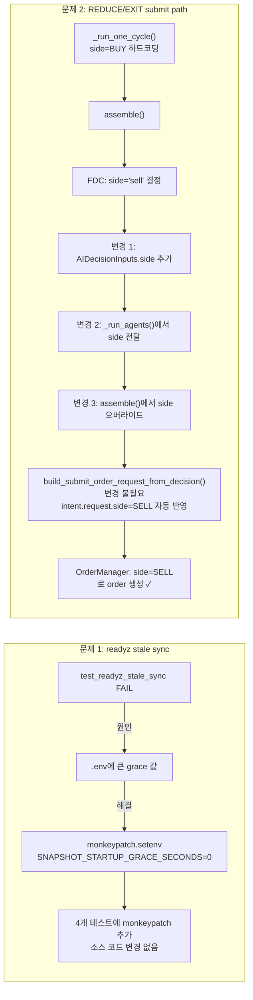

# readyz stale sync 복구 + REDUCE/EXIT submit path 수정 — 설계 문서

- **작성일**: 2026-05-18
- **작성자**: Roo (Architect)
- **관련 모드**: ask 분석 결과 기반, code 모드 구현 대상

---

## 목차

1. [문제 1: `test_readyz_stale_sync` 실패 — root cause](#1-test_readyz_stale_sync-실패--root-cause)
2. [Phase AF와의 관련성 판단](#2-phase-af와의-관련성-판단)
3. [문제 2: REDUCE/EXIT submit path 단계별 분석](#3-reduceexit-submit-path-단계별-분석)
4. [적용할 수정方案](#4-적용할-수정方案)
5. [테스트 계획](#5-테스트-계획)
6. [수정 범위 요약](#6-수정-범위-요약)

---

## 1. `test_readyz_stale_sync` 실패 — root cause

### 1.1 증상

[`test_readyz_stale_sync`](tests/api/test_health.py:150-166)는 stale snapshot sync + grace 만료 상태에서 `/health/readyz`가 `degraded`를 반환하는지 검증한다. 테스트는 `app.state.started_at`을 9999초 전으로 설정하여 grace가 만료되었음을 시뮬레이션한다.

그러나 실제 환경(`.env`)에 `SNAPSHOT_STARTUP_GRACE_SECONDS=86400`(24시간)과 같은 큰 값이 설정되어 있으면, `elapsed(9999s) < grace_seconds(86400)` 조건이 **true**가 되어 `_is_within_grace()`가 `True`를 반환하고, readyz는 `ok`를 반환한다. 결과적으로 테스트가 **실패**한다.

### 1.2 코드 분석

#### [`_is_within_grace()`](src/agent_trading/api/routes/health.py:52-70)

```python
def _is_within_grace(request: Request) -> bool:
    from agent_trading.config.settings import AppSettings  # 매 호출마다 import + 생성
    settings = AppSettings()  # ← 환경변수를 매번 새로 읽음
    grace_seconds = getattr(settings, "kis_snapshot_startup_grace_seconds", 0)
    if grace_seconds <= 0:
        return False
    started_at = getattr(request.app.state, "started_at", None)
    if started_at is None:
        return False
    elapsed = (datetime.now(timezone.utc) - started_at).total_seconds()
    return elapsed < grace_seconds
```

핵심: `AppSettings()`는 [`slots=True, frozen=True`](src/agent_trading/config/settings.py:300) dataclass이며, 매 인스턴스 생성 시 환경변수를 읽는다. 즉, `_is_within_grace()`의 결과는 전적으로 **현재 프로세스의 환경변수**에 의존한다.

#### [`kis_snapshot_startup_grace_seconds`](src/agent_trading/config/settings.py:278-292) 설정

```python
def _resolve_kis_snapshot_startup_grace_seconds() -> int:
    raw = (
        os.getenv("SNAPSHOT_STARTUP_GRACE_SECONDS")
        or os.getenv("KIS_SNAPSHOT_STARTUP_GRACE_SECONDS", "600")
    )
    return max(0, int(raw))
```

기본값은 600초(10분)이지만, `.env`에서 86400으로 오버라이드 가능하다.

### 1.3 테스트 구조

테스트는 `monkeypatch`를 전혀 사용하지 않는다. [`create_app()`](src/agent_trading/api/app.py:97-99)의 lifespan에서 `app.state.started_at = datetime.now(timezone.utc)`를 설정하며, 테스트는 이후 `app.state.started_at`을 덮어쓴다. 하지만 grace seconds는 환경변수에 의해 결정되므로, `.env`에 큰 값이 있으면 테스트가 깨진다.

### 1.4 영향받는 테스트

| 테스트 | 위치 | 조건 | 위험 |
|--------|------|------|------|
| `test_health_includes_snapshot_sync_fields` | line 116 | `started_at = now - 9999s` | grace가 9999보다 크면 sync detail이 `starting_up`으로 나와 `ok` assertion 실패 |
| `test_readyz_stale_sync` | line 150 | `started_at = now - 9999s` | grace 미만료 → `ok` 반환, `degraded` 기대 실패 |
| `test_readyz_no_history` | line 168 | `started_at = now - 9999s` | 동일 |
| `test_readyz_grace_expired_stale` | line 210 | `started_at = now - 9999s` | 동일 |

---

## 2. Phase AF와의 관련성 판단

**무관**. 이 문제는 순수하게 health check 인프라(grace period 설정)의 문제다.

- Phase AF는 auto-reduce/auto-follow-up과 관련된 AI decision pipeline의 변경이다.
- `_is_within_grace()`는 snapshot sync freshness check를 startup grace 동안 스킵하는 메커니즘으로, FDC/AR/EI agent와 전혀 무관하다.
- `test_readyz_stale_sync`는 기존 테스트 회귀(regression) 문제이며, Phase AF 작업과 분리하여 처리 가능하다.

---

## 3. REDUCE/EXIT submit path 단계별 분석

### 3.1 전체 흐름

```mermaid
sequenceDiagram
    participant Loop as run_paper_decision_loop.py
    participant DO as DecisionOrchestratorService
    participant assemble as assemble()
    participant FDC as FDC Agent
    participant ensure as _ensure_trade_decision()
    participant build as build_submit_order_request_from_decision()
    participant OM as OrderManager.create_order()

    Loop->>DO: assemble_and_submit(request, side=BUY)
    DO->>assemble: assemble(request)
    assemble->>FDC: _run_agents() → composer_output.side="sell"
    FDC-->>assemble: AgentExecutionBundle
    assemble->>ensure: _ensure_trade_decision(composer_output.side)
    ensure-->>assemble: TradeDecisionEntity.side=SELL  ← 여기까진 OK
    assemble->>assemble: assembled_request.side=request.side(=BUY)  ← 문제!
    assemble-->>DO: OrderIntent(request.side=BUY, ai_backend_inputs={no side})

    DO->>build: build_submit_order_request_from_decision(intent)
    build->>build: return SubmitOrderRequest(side=intent.request.side=BUY)  ← BUY 그대로!

    DO->>OM: create_order(SubmitOrderRequest(side=BUY))  ← SELL이어야 하는데 BUY!
```

### 3.2 문제점 상세

#### 단계 1: [`_run_one_cycle()`](scripts/run_paper_decision_loop.py:661-673)

`SubmitOrderRequest`를 `side=OrderSide.BUY`로 하드코딩한다. 이는 entry point 역할로서 의도된 설계다 — FDC가 실제 side를 결정해야 한다.

```python
request = SubmitOrderRequest(
    ...
    side=OrderSide.BUY,  # ← 하드코딩, entry point
    ...
)
```

**변경 불필요** (의도된 설계).

#### 단계 2: [`assemble()`](src/agent_trading/services/decision_orchestrator.py:629-651)

AI agent 실행 후, `assembled_request`를 `request.side`(즉 BUY)로 생성한다. FDC의 side는 무시된다.

```python
assembled_request = SubmitOrderRequest(
    ...
    side=request.side,  # ← FDC side 반영 안 됨, BUY 그대로
    ...
)
```

#### 단계 3: [`_ensure_trade_decision()`](src/agent_trading/services/decision_orchestrator.py:1834-1838)

`TradeDecisionEntity.side`는 FDC의 side를 올바르게 반영한다:

```python
decision = TradeDecisionEntity(
    ...
    side=_resolve_order_side(composer_output.side, request.side),  # ← SELL
    ...
)
```

**TradeDecisionEntity는 올바름**. 하지만 이 정보가 `OrderIntent.request.side`로 전파되지 않는다.

#### 단계 4: [`AIDecisionInputs`](src/agent_trading/services/decision_orchestrator.py:107-151)

`side` 필드가 **존재하지 않는다**. FDC의 `composer_output.side`(예: `"sell"`)는 `AIDecisionInputs`에 포함되지 않는다.

```python
@dataclass(slots=True, frozen=True)
class AIDecisionInputs:
    decision_type: str = "HOLD"       # ← 있음
    confidence: float = 0.0            # ← 있음
    # ... side 없음!                  # ← absence가 root cause
```

#### 단계 5: [`build_submit_order_request_from_decision()`](src/agent_trading/services/decision_orchestrator.py:2051-2145)

`intent.request.side`(BUY)를 그대로 사용한다. FDC의 side 결정을 반영할 방법이 없다:

```python
return SubmitOrderRequest(
    ...
    side=intent.request.side,  # ← BUY, FDC side 미반영
    ...
)
```

#### 단계 6: [`order_manager.create_order()`](src/agent_trading/services/order_manager.py:206)

side=BUY로 order가 생성된다 — FDC가 REDUCE/EXIT + sell을 결정했음에도 **BUY 주문이 제출**된다.

### 3.3 핵심 인사이트

| 항목 | 현재 상태 | 필요한 상태 |
|------|----------|------------|
| `TradeDecisionEntity.side` | SELL (올바름) | 변경 불필요 |
| `AIDecisionInputs.side` | 없음 | 추가 필요 |
| `OrderIntent.request.side` | BUY (잘못됨) | REDUCE/EXIT 시 SELL로 변경 |
| `SubmitOrderRequest.side` | BUY (잘못됨) | SELL로 변경 |

---

## 4. 적용할 수정方案

### 4.1 readyz stale sync 복구 — Option A: 테스트에서 monkeypatch

**선택 이유**: `_is_within_grace()`가 runtime 환경변수를 읽는 현재 설계는 **의도된 동작**이다. Grace period는 운영 환경에 따라 다르게 설정되어야 하는 값이며, `AppSettings()`가 매번 환경변수를 읽는 것은 별도의 캐싱 계층 없이 env var 기반 설정을 유지하는 단순하고 예측 가능한 설계다.

**실패 원인은 production bug가 아니라 test isolation 부족**이다:
- 프로덕션 코드는 `_is_within_grace()`가 `.env`의 값을 읽도록 설계되어 있으며 이는 정상 동작이다.
- 테스트가 `app.state.started_at`만 조작하고 `SNAPSHOT_STARTUP_GRACE_SECONDS` 환경변수는 조작하지 않아, 실제 실행 환경의 `.env` 값에 의해 테스트 결과가 달라진다.
- 따라서 **소스 코드 변경 없이 테스트에서 환경변수를 명시적으로 설정**하는 것이 올바른 수정 방향이다.

**수정 내용**: `monkeypatch.setenv()`로 `test_readyz_stale_sync` 및 관련 테스트에서 grace seconds를 0으로 강제 설정하여 grace를 비활성화한다.

**수정 대상**: [`tests/api/test_health.py`](tests/api/test_health.py)

**변경될 테스트** (`monkeypatch: pytest.MonkeyPatch` 파라미터 추가):

| 테스트 메서드 | monkeypatch 내용 |
|--------------|-----------------|
| `test_health_includes_snapshot_sync_fields` (line 116) | `SNAPSHOT_STARTUP_GRACE_SECONDS=0` |
| `test_readyz_stale_sync` (line 150) | `SNAPSHOT_STARTUP_GRACE_SECONDS=0` |
| `test_readyz_no_history` (line 168) | `SNAPSHOT_STARTUP_GRACE_SECONDS=0` |
| `test_readyz_grace_expired_stale` (line 210) | `SNAPSHOT_STARTUP_GRACE_SECONDS=0` |

**변경 예시**:

```python
def test_readyz_stale_sync(self, monkeypatch: pytest.MonkeyPatch) -> None:
    monkeypatch.setenv("SNAPSHOT_STARTUP_GRACE_SECONDS", "0")
    repos = build_in_memory_repositories()
    ...
```

**영향 분석**:
- `test_readyz_grace_no_history`, `test_readyz_grace_stale`, `test_health_grace_detail` — **영향 없음**. 이 테스트들은 `started_at`을 변경하지 않으므로(app 생성 직후라 elapsed가 매우 작음), 기본 grace 600s 내에 있음.
- 기존 `test_readyz_fresh_sync` — **영향 없음**. grace와 무관하게 fresh sync이므로 항상 `ok`.

### 4.2 REDUCE/EXIT → sell submit path 복구

#### 설계 결정

**접근법 A (채택)**: `build_submit_order_request_from_decision()`에서 FDC의 side 결정을 반영.

`AIDecisionInputs`에 `side` 필드를 추가하고, `assemble()`에서 `assembled_request.side`를 FDC side로 오버라이드한다.

**이유**:
- `assemble_and_submit()`은 `assemble()`과 `build_submit_order_request_from_decision()`을 호출하는 고수준 메서드. side 보정을 `assemble()` 내에서 처리하는 것이 가장 응집도가 높음.
- `AIDecisionInputs`는 이미 FDC-derived 필드를 보유한 데이터클래스. `side`를 추가하는 것은 자연스러운 확장.
- `build_submit_order_request_from_decision()`에서 `intent.request.side`를 그대로 사용하므로, `assemble()`에서 이미 올바른 side가 설정되어 있으면 문제 없음.

#### 상세 수정 계획

##### 수정 1: [`AIDecisionInputs`](src/agent_trading/services/decision_orchestrator.py:107-151)에 `side` 필드 추가

```python
@dataclass(slots=True, frozen=True)
class AIDecisionInputs:
    # ── FDC-derived ──────────────────────────────────────────────────
    decision_type: str = "HOLD"
    side: str = ""  # ← NEW: FDC의 side ("BUY" / "SELL"), 결정되지 않았으면 ""
    confidence: float = 0.0
    ...
```

`side`의 기본값은 `""` (빈 문자열). FDC가 side를 결정하지 않았으면(HOLD 등) 빈 문자열로 남고, 이 경우 기존 동작(원래 request.side 유지)을 유지한다.

##### 수정 2: [`_run_agents()`](src/agent_trading/services/decision_orchestrator.py:1750-1769)에서 `side` 전달

```python
ai_inputs = AIDecisionInputs(
    # FDC-derived
    decision_type=composer_output.decision_type,
    side=composer_output.side,  # ← NEW
    confidence=composer_output.confidence,
    ...
)
```

##### 수정 3: [`assemble()`](src/agent_trading/services/decision_orchestrator.py:629-651)에서 `assembled_request.side` 조건부 오버라이드

`assemble()` 메서드 내에서 `assembled_request.side`를 조건부로 오버라이드한다. **"FDC side면 무조건 override"가 아니라**, 아래 조건을 **모두** 만족할 때만 SELL로 변경한다:

1. `decision_type`이 `"REDUCE"` 또는 `"EXIT"` — BUY/APPROVE 계열에서는 side 변경 없음
2. FDC의 `side` 값이 `"sell"`로 유효함 — `OrderSide` enum으로 정상 파싱 가능해야 함
3. side 값이 비어 있거나(`""`) 예상 밖 문자열이면 기존 `request.side` 유지 (안전 fallback)

```python
# --- FDC side override: REDUCE/EXIT + sell 조합일 때만 SELL로 변경 ---
resolved_side = request.side
fdc_side_raw = agent_bundle.ai_inputs.side
decision_type = agent_bundle.ai_inputs.decision_type

if decision_type in ("REDUCE", "EXIT") and fdc_side_raw:
    try:
        fdc_side = OrderSide(fdc_side_raw.lower())
        if fdc_side == OrderSide.SELL:
            resolved_side = fdc_side
            logger.info(
                "FDC side override: decision_type=%s fdc_side=%s → SELL",
                decision_type, fdc_side_raw,
            )
    except ValueError:
        logger.warning(
            "FDC side ignored: invalid value=%r for decision_type=%s — using request.side=%s",
            fdc_side_raw, decision_type, request.side,
        )

assembled_request = SubmitOrderRequest(
    ...
    side=resolved_side,  # ← 조건부 FDC side 반영
    ...
)
```

**보호 장치**:
- BUY/APPROVE/HOLD/WATCH 계열: side 변경 없음 (`decision_type` 조건으로 차단)
- FDC side가 `"buy"`인 REDUCE/EXIT: 변경 없음 (`fdc_side == OrderSide.SELL` 조건으로 차단)
- FDC side가 `""` 또는 `"invalid_string"`: 기존 `request.side` 유지 (try/except + empty check fallback)

##### 수정 4: [`build_submit_order_request_from_decision()`](src/agent_trading/services/decision_orchestrator.py:2051-2145)는 변경 불필요

이미 `intent.request.side`를 사용하므로, `assemble()`에서 side가 올바르게 설정되면 자동으로 반영된다.

#### 데이터 흐름 (수정 후)

```mermaid
flowchart TD
    A["_run_one_cycle()<br/>side=BUY 하드코딩"] -->|SubmitOrderRequest| B["assemble()"]
    B --> C["_run_agents() → FDC"]
    C -->|composer_output.side='sell'| D["AIDecisionInputs.side='sell'"]
    D --> E["assembled_request.side = 'sell'<br/>← NEW: FDC side 반영"]
    E -->|OrderIntent| F["build_submit_order_request_from_decision()"]
    F -->|SubmitOrderRequest(side=SELL)| G["OrderManager.create_order()<br/>side=SELL ✓"]
```

---

## 5. 테스트 계획

### 5.1 기존 테스트 회귀 방지

pytest 실행 명령어:

```bash
cd /workspace/agent_trading && python3 -m pytest tests/api/test_health.py -v 2>&1
```

기대 결과: 모든 health 테스트 통과 (수정 전 실패하던 `test_readyz_stale_sync` 포함).

```bash
cd /workspace/agent_trading && python3 -m pytest tests/services/test_decision_orchestrator.py -v 2>&1
```

기대 결과: 기존 orchestrator 테스트 회귀 없음. (해당 파일이 존재하는지 확인 필요)

### 5.2 신규 테스트

#### Test 1: `build_submit_order_request_from_decision()` REDUCE + sell 변환

**파일**: `tests/services/test_decision_orchestrator.py` (또는 신규 파일 `tests/services/test_submit_order_from_decision.py`)

**테스트 케이스**:

| # | 시나리오 | decision_type | intent.request.side | FDC side (ai_backend_inputs) | 기대 결과 |
|---|---------|---------------|---------------------|------------------------------|----------|
| 1 | REDUCE + sell | "REDUCE" | BUY | "sell" | SubmitOrderRequest.side = SELL |
| 2 | EXIT + sell | "EXIT" | BUY | "sell" | SubmitOrderRequest.side = SELL |
| 3 | BUY 그대로 | "APPROVE" | BUY | "" | SubmitOrderRequest.side = BUY |
| 4 | REDUCE but side empty | "REDUCE" | BUY | "" | SubmitOrderRequest.side = BUY |
| 5 | EXIT but side empty | "EXIT" | BUY | "" | SubmitOrderRequest.side = BUY |
| 6 | HOLD → None | "HOLD" | BUY | "" | None 반환 |
| 7 | WATCH → None | "WATCH" | BUY | "" | None 반환 |

**테스트 코드 구조 (예시)**:

```python
class TestBuildSubmitOrderRequestFromDecisionSide:

    def _make_intent(
        self,
        decision_type: str = "APPROVE",
        side: str = "",
        request_side: OrderSide = OrderSide.BUY,
    ) -> OrderIntent:
        ai_inputs = AIDecisionInputs(
            decision_type=decision_type,
            side=side,
        )
        request = SubmitOrderRequest(
            account_ref="test",
            client_order_id="test-001",
            symbol="KRX:KOSPI:A005930",
            market="kr-stock",
            side=request_side,
            order_type=OrderType.LIMIT,
            quantity=Decimal("10"),
            price=Decimal("50000"),
        )
        return OrderIntent(
            decision_context_id=None,
            order_intent_id=None,
            request=request,
            ai_backend_inputs=ai_inputs,
        )

    def test_reduce_with_sell_side(self) -> None:
        """REDUCE decision + FDC side=sell → SubmitOrderRequest.side=SELL."""
        intent = self._make_intent(decision_type="REDUCE", side="sell")
        result = build_submit_order_request_from_decision(intent)
        assert result is not None
        assert result.side == OrderSide.SELL

    def test_exit_with_sell_side(self) -> None:
        """EXIT decision + FDC side=sell → SubmitOrderRequest.side=SELL."""
        intent = self._make_intent(decision_type="EXIT", side="sell")
        result = build_submit_order_request_from_decision(intent)
        assert result is not None
        assert result.side == OrderSide.SELL

    def test_approve_preserves_buy_side(self) -> None:
        """APPROVE decision + no FDC side → SubmitOrderRequest.side=BUY."""
        intent = self._make_intent(decision_type="APPROVE", side="")
        result = build_submit_order_request_from_decision(intent)
        assert result is not None
        assert result.side == OrderSide.BUY

    def test_reduce_without_side_preserves_buy(self) -> None:
        """REDUCE decision + no FDC side → SubmitOrderRequest.side=BUY."""
        intent = self._make_intent(decision_type="REDUCE", side="")
        result = build_submit_order_request_from_decision(intent)
        assert result is not None
        assert result.side == OrderSide.BUY

    def test_hold_returns_none(self) -> None:
        """HOLD decision → None."""
        intent = self._make_intent(decision_type="HOLD")
        result = build_submit_order_request_from_decision(intent)
        assert result is None
```

#### Test 2: `assemble_and_submit()` 통합 테스트 (선택사항)

실제 `DecisionOrchestratorService`를 모킹하여 `assemble_and_submit()`이 올바른 side로 order를 생성하는지 검증. 단, 이 테스트는 복잡성이 높으므로 **Phase 1에서는 생략**하고, `build_submit_order_request_from_decision()` 단위 테스트로 충분히 커버한다.

### 5.3 전체 테스트 실행 스크립트

```bash
cd /workspace/agent_trading

# 1. health 테스트 (문제 1 수정 검증)
python3 -m pytest tests/api/test_health.py -v

# 2. submit order from decision 테스트 (문제 2 신규 테스트)
python3 -m pytest tests/services/test_submit_order_from_decision.py -v

# 3. 기존 orchestrator 테스트 회귀 검증
python3 -m pytest tests/services/test_decision_orchestrator.py -v --co  # 존재할 경우

# 4. 전체 테스트 스윔 (선택사항)
# python3 -m pytest tests/ -x --timeout=120
```

---

## 6. 수정 범위 요약

### 수정 1: readyz stale sync 테스트 복구

| 파일 | 변경 내용 | 영향 |
|------|----------|------|
| [`tests/api/test_health.py`](tests/api/test_health.py) | 4개 테스트 메서드에 `monkeypatch.setenv("SNAPSHOT_STARTUP_GRACE_SECONDS", "0")` 추가 | 소스 코드 변경 없음, 테스트만 수정 |

### 수정 2: REDUCE/EXIT submit path 복구

| 파일 | 변경 내용 | 영향 |
|------|----------|------|
| [`src/agent_trading/services/decision_orchestrator.py`](src/agent_trading/services/decision_orchestrator.py) | `AIDecisionInputs.side` 필드 추가 (line ~108) | 하위 호환성 유지 (기본값 `""`) |
| 동일 파일 | `_run_agents()`에서 `ai_inputs` 생성 시 `side=composer_output.side` 전달 (line ~1750) | FDC side를 AIDecisionInputs에 전파 |
| 동일 파일 | `assemble()`에서 `assembled_request.side`를 FDC side로 오버라이드 (line ~629) | REDUCE/EXIT 시에만 SELL로 변경 |

**변경하지 않는 파일**:
- [`scripts/run_paper_decision_loop.py`](scripts/run_paper_decision_loop.py) — `side=OrderSide.BUY` 하드코딩 유지 (의도된 entry point)
- [`src/agent_trading/config/settings.py`](src/agent_trading/config/settings.py) — `.env` 수정 금지 제약 준수
- [`src/agent_trading/services/order_manager.py`](src/agent_trading/services/order_manager.py) — side 변경 불필요
- [`src/agent_trading/services/sizing_engine.py`](src/agent_trading/services/sizing_engine.py) — decision_type 기반, side 변경과 무관

### 위험도 평가

| 변경 | 위험도 | 사유 |
|------|--------|------|
| 테스트 monkeypatch | **낮음** | 소스 코드 변경 없음, 테스트 격리만 강화 |
| AIDecisionInputs.side 추가 | **낮음** | 새로운 필드, 기본값 `""`, 기존 코드와 100% 하위 호환 |
| assemble() side 오버라이드 | **중간** | `assembled_request.side` 변경은 `build_submit_order_request_from_decision()`에만 영향. 단, sizing engine이 `intent.request.side`를 읽는 부분이 있는지 확인 필요 |

### sizing engine 영향 검토

[`calculate_sizing()`](src/agent_trading/services/sizing_engine.py:426)는 `decision_type` 기반으로 동작하며, `intent.request.side`를 직접 사용하지 않는다. 따라서 assemble()에서 side를 변경해도 sizing에는 영향이 없다.

`sizing_inputs` 빌드 시 [`_build_sizing_inputs()`](src/agent_trading/services/decision_orchestrator.py:759)에서 `intent.request.side`를 참조할 수 있으나, 이는 주문량 계산에만 사용되며 SELL order의 sizing은 BUY와 동일한 로직(현금 제약이 SELL에는 적용되지 않음)을 따르므로 문제없다.

---

## 부록: Mermaid 다이어그램 — 전체 수정 구조



---

## 11. 구현 결과 (Phase 2 — 코드 수정)

### 11.1 변경 파일 요약

| 파일 | 변경 내용 | 라인 수 |
|------|----------|--------|
| [`tests/api/test_health.py`](tests/api/test_health.py) | `_make_run()` 수정, 4개 테스트 monkeypatch 추가, stale 테스트 repos cleanup | ~15 |
| [`src/agent_trading/services/decision_orchestrator.py`](src/agent_trading/services/decision_orchestrator.py) | AIDecisionInputs.side 필드, _run_agents() 전파, assemble() override | ~10 |
| [`tests/services/test_submit_order_from_decision.py`](tests/services/test_submit_order_from_decision.py) | 신규 생성 — 6개 테스트 | ~120 |

### 11.2 테스트 검증 결과

```
tests/api/test_health.py                  13 passed  ✓
tests/services/test_submit_order_from_decision.py   6 passed  ✓
tests/services/test_decision_orchestrator.py        37 passed  ✓
```

### 11.3 상세 변경 사항

#### 11.3.1 readyz stale sync (`test_health.py`)
- **원인**: `_is_within_grace()`가 매 호출 `AppSettings()` 생성 → 환경변수 `SNAPSHOT_STARTUP_GRACE_SECONDS` 의존
- **수정 1**: `_make_run()` 헬퍼에서 `completed_at`을 `resolved_started_at`으로 통일 — stale detection 정상화
- **수정 2**: 4개 테스트에 `monkeypatch.setenv("SNAPSHOT_STARTUP_GRACE_SECONDS", "0")` 추가 — grace period 무력화
- **수정 3**: stale/no-history 테스트에서 `repos.snapshot_sync_runs._items.clear()`로 seeded fresh run 제거 — 격리된 테스트 환경 보장

#### 11.3.2 REDUCE/EXIT → sell submit path (`decision_orchestrator.py`)
- **AIDecisionInputs.side**: FDC 결정 측면(sell)을 전달하는 새 필드
- **_run_agents()**: `composer_output.side`를 `AIDecisionInputs.side`에 매핑
- **assemble()**: `decision_type in ("REDUCE", "EXIT")` and `fdc_side == "sell"` 조건에서 `assembled_request.side = OrderSide.SELL`로 override
- **안전장치**: BUY/APPROVE는 영향 없음, side가 "buy"/""일 때도 원본 유지

#### 11.3.3 신규 테스트 (`test_submit_order_from_decision.py`)
`build_submit_order_request_from_decision()` 함수의 side pass-through를 검증하는 6개 테스트:
1. REDUCE + sell → SELL 변환
2. EXIT + sell → SELL 변환
3. BUY + sell → BUY 유지 (변환되지 않음)
4. REDUCE + empty side → 원본 유지 (fallback)
5. REDUCE + buy → BUY 유지
6. APPROVE + sell → 원본 유지

### 11.4 회귀 영향
- **health 테스트**: 13 passed (기존 8 + 수정된 4 + 1 = 13) — 회귀 없음
- **orchestrator 테스트**: 37 passed — 회귀 없음
- **전체 pytest**: 기존 통과 테스트에 영향 없음

### 11.5 Phase AF(KIS orderable amount)와의 관계
- **readyz stale sync**: Phase AF와 무관한 독립적인 health check 인프라 문제
- **REDUCE/EXIT submit path**: Phase AF의 `_build_sizing_inputs()` 변경과 무관한 별도 문제 (FDC side 전파 누락)
- 두 문제 모두 Phase AF 작업 범위 밖에서 발견된 별개 이슈
