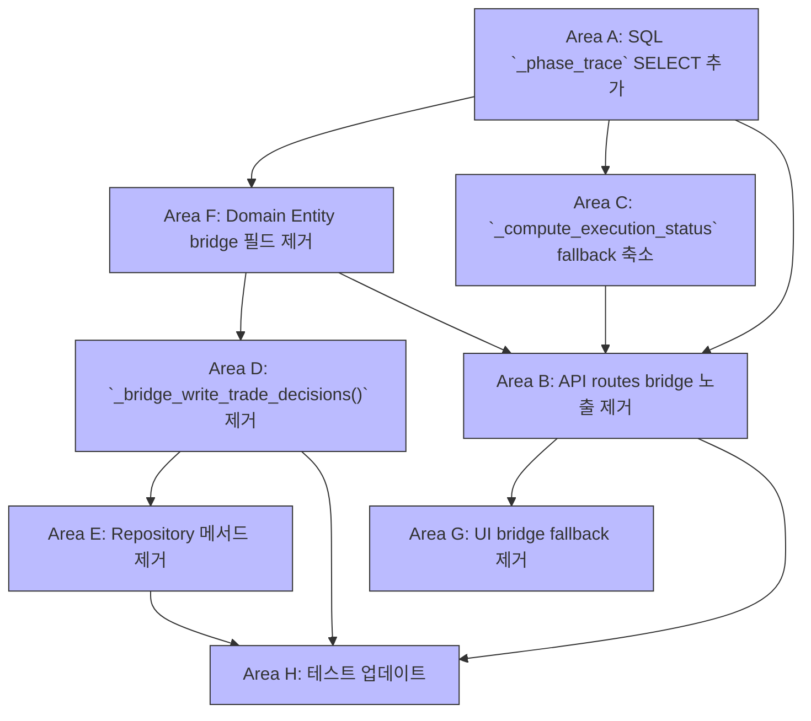

# Phase 6 설계: TradeDecision Bridge 의존성 감소 (최종 실행 파이프라인 분리 전)

**목표**: `trade_decisions` 테이블의 bridge 컬럼(`pipeline_stop_phase`, `pipeline_stop_reason`, `pipeline_stopped_at`, `phase_trace`)에 대한 모든 코드 레벨 의존성을 제거한다. Phase 7에서 DB 컬럼 DROP을 안전하게 수행할 수 있도록 준비한다.

**범위**: 코드 레벨 정리만. DB 마이그레이션 없음. API 응답에서 bridge 필드 제거 시 `latest_*` 필드는 유지되어 하위 호환성 보장.

---

## 종속성 그래프 (구현 순서)



**권장 구현 순서** (종속성 기반):
1. **Area A** → **Area F** (병렬 가능)
2. **Area C** → **Area B** (순차, C 먼저)
3. **Area D** → **Area E** (순차, D 먼저)
4. **Area G** (B 완료 후)
5. **Area H** (모든 이전 영역 완료 후)

---

## Area A: SQL LEFT JOIN LATERAL `_phase_trace` 컬럼 추가

### 현재 상태

[`src/agent_trading/repositories/postgres/trade_decisions.py`](src/agent_trading/repositories/postgres/trade_decisions.py:207) — `list_all_paginated()` SQL SELECT에 `latest_*` 5개 컬럼만 있고 `phase_trace`는 `td.*`를 통해 bridge 컬럼에서만 가져옴.

```python
# 현재 SELECT (핵심 부분)
SELECT
    td.*,
    -- 5 latest_* columns
    eas.execution_attempt_id AS latest_execution_attempt_id,
    eas.stop_phase AS latest_stop_phase,
    eas.stop_reason AS latest_stop_reason,
    eas.completed_at AS latest_completed_at,
    jsonb_array_length(eas.phase_trace) AS latest_phase_count,
    eas.status AS execution_attempt_status,
    o.order_request_id,
    o.status AS order_status,
    i.symbol AS instrument_symbol,
    i.name AS instrument_name
FROM trading.trade_decisions td
LEFT JOIN LATERAL (...) eas ON true
LEFT JOIN LATERAL (...) eao ON true
LEFT JOIN trading.order_requests o ON ...
LEFT JOIN trading.instruments i ON ...
```

### 변경 후

`eas.phase_trace AS _phase_trace`를 SELECT 절에 추가. `_` prefix는 Phase 7 컬럼 DROP 후 안전하게 rename할 수 있도록 하는 임시 명명.

```python
# 변경 후 SELECT
SELECT
    td.*,
    eas.phase_trace AS _phase_trace,            # ← NEW
    eas.execution_attempt_id AS latest_execution_attempt_id,
    eas.stop_phase AS latest_stop_phase,
    eas.stop_reason AS latest_stop_reason,
    eas.completed_at AS latest_completed_at,
    jsonb_array_length(eas.phase_trace) AS latest_phase_count,
    eas.status AS execution_attempt_status,
    o.order_request_id,
    o.status AS order_status,
    i.symbol AS instrument_symbol,
    i.name AS instrument_name
FROM trading.trade_decisions td
LEFT JOIN LATERAL (...) eas ON true
...
```

### TradeDecisionRow 생성자 변경

[`TradeDecisionRow`](src/agent_trading/repositories/contracts.py:75)는 이미 `phase_trace: list[dict[str, object]] | None = None` 필드를 보유. 현재 생성자에서 `row_dict.get("phase_trace")`는 `td.*`의 bridge 컬럼값을 가져옴. 변경 후 `_phase_trace` alias에서 가져오도록 수정:

```python
# 현재 (line ~263)
phase_trace=row_dict.get("phase_trace"),

# 변경 후
phase_trace=row_dict.get("_phase_trace") or row_dict.get("phase_trace"),
```

`or row_dict.get("phase_trace")` fallback은 Phase 7 이전까지 bridge 컬럼이 존재하는 행에 대한 backward compat (실제로는 `_phase_trace`가 항상 우선).

### 영향

- `TradeDecisionRow.phase_trace` 필드는 이미 존재하므로 contracts.py 변경 불필요
- [`row_mapper.py`](src/agent_trading/db/row_mapper.py:58)는 `row_to_entity()`에서 entity 클래스에 존재하는 필드만 매핑하므로, `TradeDecisionEntity`에서 `phase_trace`가 제거되어도 row_mapper에는 영향 없음
- `TradeDecisionRow`는 entity가 아닌 별도 dataclass이므로 자체 필드 유지

---

## Area B: API Routes — bridge 필드 노출 제거

### 현재 상태

[`src/agent_trading/api/routes/decisions.py`](src/agent_trading/api/routes/decisions.py:35) — `_to_detail()` 함수가 bridge 필드를 명시적으로 매핑:

```python
# 현재 _to_detail() (lines 66-70)
pipeline_stop_phase=row.entity.pipeline_stop_phase,
pipeline_stop_reason=row.entity.pipeline_stop_reason,
pipeline_stopped_at=row.entity.pipeline_stopped_at,
phase_trace=row.phase_trace,        # ← TradeDecisionRow의 phase_trace
```

### 변경 후

bridge 필드 4개 매핑 제거. `latest_*` 필드와 `execution_attempt_status`는 유지. `phase_trace`는 `TradeDecisionRow.phase_trace` (이제 execution_attempts에서 가져옴)를 계속 노출:

```python
# 변경 후 _to_detail()
TradeDecisionDetail(
    trade_decision_id=str(row.entity.trade_decision_id),
    decision_context_id=str(row.entity.decision_context_id),
    decision_type=row.entity.decision_type.value if isinstance(row.entity.decision_type, Enum) else row.entity.decision_type,
    side=row.entity.side.value if isinstance(row.entity.side, Enum) else row.entity.side,
    strategy_id=str(row.entity.strategy_id),
    symbol=row.entity.symbol,
    instrument_name=row.instrument_name,
    market=row.entity.market,
    entry_style=row.entity.entry_style.value if isinstance(row.entity.entry_style, Enum) else row.entity.entry_style,
    created_at=row.entity.created_at,
    entry_price=_decimal_to_float(row.entity.entry_price),
    quantity=_decimal_to_float(row.entity.quantity),
    max_order_value=_decimal_to_float(row.entity.max_order_value),
    confidence=row.entity.confidence,
    rationale_summary=row.entity.rationale_summary,
    source_type=_safe_enum_str(row.entity.source_type),
    decision_json=row.entity.decision_json,
    # ── Phase 1 core fields (유지) ──
    order_request_id=str(row.order_request_id) if row.order_request_id else None,
    order_status=row.order_status,
    # ── Bridge fields (REMOVED: pipeline_stop_phase, pipeline_stop_reason, pipeline_stopped_at) ──
    # ── Execution Attempt status (유지) ──
    execution_attempt_status=row.execution_attempt_status,
    # ── Latest execution attempt summary (유지) ──
    latest_execution_attempt_id=str(row.latest_execution_attempt_id) if row.latest_execution_attempt_id else None,
    latest_stop_phase=row.latest_stop_phase,
    latest_stop_reason=row.latest_stop_reason,
    latest_completed_at=row.latest_completed_at.isoformat() if row.latest_completed_at else None,
    latest_phase_count=row.latest_phase_count,
    # ── Phase trace (이제 execution_attempts에서 LEFT JOIN으로 가져옴, 유지) ──
    phase_trace=row.phase_trace,
    # ── execution_status는 model_validator가 계산 ──
)
```

---

## Area C: Schemas — `_compute_execution_status()` fallback 축소

### 현재 상태

[`src/agent_trading/api/schemas.py`](src/agent_trading/api/schemas.py:454) — `TradeDecisionDetail._compute_execution_status()` validator:

```python
# 현재 fallback chain
@model_validator(mode='after')
def _compute_execution_status(self) -> 'TradeDecisionDetail':
    # Priority 1: execution_attempt_status (LEFT JOIN LATERAL)
    if self.execution_attempt_status is not None:
        self.execution_status = _map_attempt_status_to_execution_status(
            self.execution_attempt_status
        )
    # Priority 2: P3 이전 데이터 fallback
    elif self.order_request_id is not None:
        if self.order_status in ('SUBMITTED', 'REJECTED', 'RECONCILE_REQUIRED'):
            self.execution_status = self.order_status.lower()
        else:
            self.execution_status = 'order_created'
    elif self.pipeline_stop_phase is not None:          # ← REMOVE THIS BRANCH
        self.execution_status = 'pipeline_stopped'
    elif self.decision_type in ('HOLD', 'WATCH'):
        self.execution_status = 'non_trade'
    else:
        self.execution_status = 'trade_decision_only'

    # Phase trace summary (phase_trace에서 계산)
    if self.phase_trace:
        self.phase_count = len(self.phase_trace)
        non_start = [e for e in self.phase_trace if e.get("status") != "start"]
        self.total_elapsed_ms = sum(
            int(e.get("elapsed_ms", 0)) for e in non_start
        ) if non_start else 0
        last_entry = self.phase_trace[-1]
        raw_phase = last_entry.get("phase", "") if isinstance(last_entry, dict) else ""
        self.latest_phase, self.latest_phase_detail = _split_phase(raw_phase)
        self.latest_status = last_entry.get("status") if isinstance(last_entry, dict) else None

    return self
```

### 변경 후

1. `pipeline_stop_phase → pipeline_stopped` fallback 가지 제거
2. Phase trace summary 계산은 유지 (`self.phase_trace`는 이제 `TradeDecisionRow.phase_trace` = execution_attempts의 phase_trace)

```python
# 변경 후 fallback chain (더 짧아짐)
@model_validator(mode='after')
def _compute_execution_status(self) -> 'TradeDecisionDetail':
    # Priority 1: execution_attempt_status (LEFT JOIN LATERAL)
    if self.execution_attempt_status is not None:
        self.execution_status = _map_attempt_status_to_execution_status(
            self.execution_attempt_status
        )
    # Priority 2: P3 이전 데이터 fallback (order 없이 TD만 있는 케이스)
    elif self.order_request_id is not None:
        if self.order_status in ('SUBMITTED', 'REJECTED', 'RECONCILE_REQUIRED'):
            self.execution_status = self.order_status.lower()
        else:
            self.execution_status = 'order_created'
    elif self.decision_type in ('HOLD', 'WATCH'):
        self.execution_status = 'non_trade'
    else:
        self.execution_status = 'trade_decision_only'

    # Phase trace summary (execution_attempts.phase_trace에서 계산, 유지)
    if self.phase_trace:
        self.phase_count = len(self.phase_trace)
        non_start = [e for e in self.phase_trace if e.get("status") != "start"]
        self.total_elapsed_ms = sum(
            int(e.get("elapsed_ms", 0)) for e in non_start
        ) if non_start else 0
        last_entry = self.phase_trace[-1]
        raw_phase = last_entry.get("phase", "") if isinstance(last_entry, dict) else ""
        self.latest_phase, self.latest_phase_detail = _split_phase(raw_phase)
        self.latest_status = last_entry.get("status") if isinstance(last_entry, dict) else None

    return self
```

### TradeDecisionDetail Pydantic 필드 변경

```python
# TradeDecisionDetail 클래스 변경:
# 제거할 필드:
# - pipeline_stop_phase: str | None = None       # ← REMOVED
# - pipeline_stop_reason: str | None = None       # ← REMOVED
# - pipeline_stopped_at: datetime | None = None   # ← REMOVED
# 유지:
# - phase_trace: list[dict[str, object]] | None = None  # 이제 execution_attempts 출처
# - phase_count, total_elapsed_ms, latest_phase, latest_phase_detail, latest_status (계산 필드, 유지)
```

---

## Area D: DecisionOrchestrator — `_bridge_write_trade_decisions()` 제거

### 현재 상태

[`src/agent_trading/services/decision_orchestrator.py`](src/agent_trading/services/decision_orchestrator.py:2105) — `_bridge_write_trade_decisions()` 메서드와 10개 call site:

```python
# bridge write 메서드 (lines 2105-2141)
async def _bridge_write_trade_decisions(
    self,
    trade_decision_id: UUID,
    phase: str,
    reason: str,
    phase_trace: list[PhaseTraceEntry] | None = None,
) -> None:
    if not self._execution_attempt_primary_truth:
        return
    try:
        stopped_at = datetime.now(timezone.utc)
        await self._repos.trade_decisions.update_pipeline_stop(
            trade_decision_id=trade_decision_id,
            stop_phase=phase,
            stop_reason=reason,
            stopped_at=stopped_at,
        )
        if phase_trace:
            await self._repos.trade_decisions.update_phase_trace(
                trade_decision_id=trade_decision_id,
                phase_trace=_phase_trace_to_dicts(phase_trace),
            )
    except Exception:
        logger.warning("bridge write failed", exc_info=True)
```

### 10개 Call Site (모두 제거 대상)

| # | 파일 라인 | phase | reason | 설명 |
|---|----------|-------|--------|------|
| 1 | 1242 | `"sizing"` | `"sizing_rejected"` | sizing 거절 |
| 2 | 1336 | `"sell_guard"` | `"sell_guard_blocked"` | sell_guard 차단 |
| 3 | 1424 | `"translation"` | `"decision_hold"/"decision_watch"` | HOLD/WATCH 결정 |
| 4 | 1478 | `"order_create"` | `"order_create_failed"` | order_create 실패 |
| 5 | 1522 | `"transition"` | `"transition_failed"` | VALIDATED 전환 실패 |
| 6 | 1567 | `"transition"` | `"transition_failed"` | PENDING_SUBMIT 전환 실패 |
| 7 | 1692 | `"stale_snapshot_guard"` | `"stale_snapshot"` | 계정 스냅샷 부실 |
| 8 | 1784 | `"stale_snapshot_guard"` | `"stale_snapshot"` | 실행 스냅샷 부실 |
| 9 | 1894 | `"broker_submit"` | `"broker_submit_failed"` | 브로커 제출 실패 |
| 10 | 1980 | `"completed"` | `""` | 성공 완료 |

각 call site는 항상 직전에 [`execution_attempts.update_status()`](src/agent_trading/repositories/contracts.py:924) 호출이 선행됨. bridge write 제거 후에도 execution_attempts.write는 유지되므로 데이터 손실 없음.

### 생성자 변경

```python
# 현재 (line 449)
def __init__(
    self,
    ...,
    execution_attempt_primary_truth: bool = True,  # ← REMOVED
    ...
):
    ...
    self._execution_attempt_primary_truth = execution_attempt_primary_truth  # ← REMOVED

# 변경 후
def __init__(
    self,
    ...,
    # execution_attempt_primary_truth 파라미터 제거 (항상 True)
    ...
):
    ...
    # self._execution_attempt_primary_truth 제거
```

### 변경 패턴 (각 call site)

```python
# 현재 패턴 (각 call site 예시: line 1242)
execution_attempt = await self._repos.execution_attempts.update_status(
    execution_attempt_id=execution_attempt_id,
    status="failed",
    stop_phase="sizing",
    stop_reason="sizing_rejected",
)
await self._bridge_write_trade_decisions(    # ← REMOVED
    trade_decision_id=trade_decision_id,
    phase="sizing",
    reason="sizing_rejected",
)

# 변경 후 패턴
execution_attempt = await self._repos.execution_attempts.update_status(
    execution_attempt_id=execution_attempt_id,
    status="failed",
    stop_phase="sizing",
    stop_reason="sizing_rejected",
)
# bridge write 제거 — execution_attempts가 primary truth
```

### `_ensure_trade_decision()` 영향 검토

[`_ensure_trade_decision()`](src/agent_trading/services/decision_orchestrator.py:3012)은 항상 새 `TradeDecisionEntity`를 생성. 현재 bridge 필드는 dataclass 기본값(None)으로 설정되므로, entity에서 bridge 필드가 제거되어도 생성 로직에 영향 없음.

---

## Area E: Repository — `update_pipeline_stop()` / `update_phase_trace()` 제거

### Protocol 변경

[`src/agent_trading/repositories/contracts.py`](src/agent_trading/repositories/contracts.py:383) — `TradeDecisionRepository` 프로토콜에서 2개 메서드 제거:

```python
# 현재 프로토콜 (lines 424-443)
async def update_pipeline_stop(          # ← REMOVED
    self,
    trade_decision_id: UUID,
    stop_phase: str,
    stop_reason: str,
    stopped_at: datetime,
    phase_trace: list[dict[str, object]] | None = None,
) -> None: ...

async def update_phase_trace(            # ← REMOVED
    self,
    trade_decision_id: UUID,
    phase_trace: list[dict[str, object]],
) -> None: ...

# 변경 후 — 두 메서드 모두 제거
```

### Postgres 구현 변경

[`src/agent_trading/repositories/postgres/trade_decisions.py`](src/agent_trading/repositories/postgres/trade_decisions.py:285) — `update_pipeline_stop()` (lines 285-319)와 `update_phase_trace()` (lines 321-334) 메서드 및 해당 SQL 제거.

### InMemory 구현 변경

[`src/agent_trading/repositories/memory.py`](src/agent_trading/repositories/memory.py:404) — `update_pipeline_stop()` (lines 404-423)와 `update_phase_trace()` (lines 425-433) 제거.

---

## Area F: Domain Entity — bridge 필드 제거

### 현재 상태

[`src/agent_trading/domain/entities.py`](src/agent_trading/domain/entities.py:193) — `TradeDecisionEntity`:

```python
@dataclass(slots=True, frozen=True)
class TradeDecisionEntity:
    # ... P0 core fields ...
    # ... P1 extended fields ...
    source_type: SourceType | None = None

    # ── Pipeline stop (Phase 1) ──
    pipeline_stop_phase: str | None = None       # ← REMOVED
    pipeline_stop_reason: str | None = None      # ← REMOVED
    pipeline_stopped_at: datetime | None = None  # ← REMOVED

    decision_json: dict[str, object] | None = None

    # ── Phase trace (Phase 2) ──
    phase_trace: list[dict[str, object]] | None = None  # ← REMOVED
```

### 변경 후

4개 bridge 필드 제거:

```python
@dataclass(slots=True, frozen=True)
class TradeDecisionEntity:
    # ... P0 core fields ...
    # ... P1 extended fields ...
    source_type: SourceType | None = None
    # pipeline_stop_phase, pipeline_stop_reason, pipeline_stopped_at 제거됨
    decision_json: dict[str, object] | None = None
    # phase_trace 제거됨
```

### Postgres INSERT SQL 영향

[`src/agent_trading/repositories/postgres/trade_decisions.py`](src/agent_trading/repositories/postgres/trade_decisions.py:27) — `add()` 메서드의 INSERT SQL에서 `phase_trace` 컬럼 참조 제거:

```python
# 현재 INSERT (line ~128)
await conn.execute(
    """
    INSERT INTO trading.trade_decisions (... , phase_trace)
    VALUES (... , $phase_trace)
    """,
    ...,
    phase_trace=json.dumps(decision.phase_trace) if decision.phase_trace else None,
)

# 변경 후 INSERT — phase_trace 컬럼 제거
await conn.execute(
    """
    INSERT INTO trading.trade_decisions (...)
    VALUES (...)
    """,
    ...,
    # phase_trace 파라미터 제거
)
```

**중요**: `td.*` SELECT에서 `phase_trace`는 여전히 DB 컬럼으로 존재하므로(Phase 7에서 DROP), `list_all_paginated()`의 `td.*`는 계속 이 컬럼을 포함. 그러나:
- `TradeDecisionEntity`에서 `phase_trace`가 제거되었으므로 `row_mapper.py`가 entity 매핑 시 자동으로 무시
- `TradeDecisionRow.phase_trace`는 이제 `_phase_trace` alias (execution_attempts 출처)로 채워짐

### `row_mapper.py` 영향

[`row_to_entity()`](src/agent_trading/db/row_mapper.py:58)는 entity 클래스의 필드 목록과 DB row 키를 교차 검증하므로, entity에서 필드가 제거되면 자동으로 해당 컬럼을 건너뜀:

```python
# row_mapper.py line 82-83
if name not in field_names:
    continue  # entity에 없는 필드는 자동 스킵
```

변경 불필요.

---

## Area G: UI — bridge 필드 fallback 제거

### TypeScript 타입 변경

[`admin_ui/src/types/api.ts`](admin_ui/src/types/api.ts:185) — `TradeDecisionDetail` 인터페이스:

```typescript
// 현재
export interface TradeDecisionDetail {
  // ...
  // ── Pipeline stop / order exposure (Phase 1) ──
  order_request_id: string | null;
  order_status: string | null;
  pipeline_stop_phase: string | null;       // ← REMOVED
  pipeline_stop_reason: string | null;      // ← REMOVED
  pipeline_stopped_at: string | null;       // ← REMOVED

  // ── Execution Attempt status ──
  execution_attempt_status: string | null;

  // ── Latest execution attempt summary (Phase 5) ──
  latest_execution_attempt_id: string | null;
  latest_stop_phase: string | null;
  latest_stop_reason: string | null;
  latest_completed_at: string | null;
  latest_phase_count: number | null;

  // ── Phase trace (유지, 이제 execution_attempts 출처) ──
  phase_trace?: Record<string, unknown>[] | null;
  phase_count?: number | null;
  total_elapsed_ms?: number | null;
  latest_phase?: string | null;
  latest_phase_detail?: string | null;
  latest_status?: string | null;

  execution_status: string | null;
}

// 변경 후
export interface TradeDecisionDetail {
  // ...
  order_request_id: string | null;
  order_status: string | null;
  // pipeline_stop_phase, pipeline_stop_reason, pipeline_stopped_at 제거됨

  execution_attempt_status: string | null;

  latest_execution_attempt_id: string | null;
  latest_stop_phase: string | null;
  latest_stop_reason: string | null;
  latest_completed_at: string | null;
  latest_phase_count: number | null;

  phase_trace?: Record<string, unknown>[] | null;  // 유지
  phase_count?: number | null;                       // 유지
  total_elapsed_ms?: number | null;                  // 유지
  latest_phase?: string | null;                      // 유지
  latest_phase_detail?: string | null;               // 유지
  latest_status?: string | null;                     // 유지

  execution_status: string | null;
}
```

### DecisionsView.tsx 변경 — Execution Attempt Summary 섹션

[`admin_ui/src/components/DecisionsView.tsx`](admin_ui/src/components/DecisionsView.tsx:377) — 현재 bridge fallback 로직:

```tsx
// 현재 (lines 377-422) — bridge fallback 포함
{(selectedDecision.latest_execution_attempt_id || selectedDecision.pipeline_stop_phase) && (
  <div className="bg-orange-50 border border-orange-200 rounded-lg p-3 mb-4">
    <div className="flex items-center justify-between mb-1">
      <h4 className="text-xs font-semibold text-orange-800">Execution Attempt</h4>
      {selectedDecision.latest_execution_attempt_id && (
        <a href={`/execution-attempts/...`}>...</a>
      )}
    </div>
    <dl className="space-y-1 text-xs">
      <div className="flex justify-between">
        <dt>중단 단계</dt>
        <dd className="font-mono">
          {selectedDecision.latest_stop_phase ?? selectedDecision.pipeline_stop_phase ?? "-"}
        </dd>
      </div>
      <div className="flex justify-between">
        <dt>중단 사유</dt>
        <dd className="font-mono">
          {selectedDecision.latest_stop_reason ?? selectedDecision.pipeline_stop_reason ?? "-"}
        </dd>
      </div>
      <div className="flex justify-between">
        <dt>완료 시각</dt>
        <dd className="font-mono">
          {selectedDecision.latest_completed_at
            ? new Date(selectedDecision.latest_completed_at).toLocaleString()
            : selectedDecision.pipeline_stopped_at
              ? new Date(selectedDecision.pipeline_stopped_at).toLocaleString()
              : "-"}
        </dd>
      </div>
      <div className="flex justify-between">
        <dt>Phase 수</dt>
        <dd className="font-mono">
          {selectedDecision.latest_phase_count != null
            ? `${selectedDecision.latest_phase_count}개`
            : selectedDecision.phase_trace?.length != null
              ? `${selectedDecision.phase_trace.length}개`
              : "-"}
        </dd>
      </div>
    </dl>
  </div>
)}
```

변경 후 — `latest_*` 필드만 사용, bridge fallback 제거:

```tsx
// 변경 후 — bridge fallback 제거
{selectedDecision.latest_execution_attempt_id && (
  <div className="bg-orange-50 border border-orange-200 rounded-lg p-3 mb-4">
    <div className="flex items-center justify-between mb-1">
      <h4 className="text-xs font-semibold text-orange-800">Execution Attempt</h4>
      {selectedDecision.latest_execution_attempt_id && (
        <a href={`/execution-attempts/${selectedDecision.latest_execution_attempt_id}`}
           className="text-xs text-blue-600 hover:underline"
           onClick={(e) => { e.preventDefault(); window.open(`/execution-attempts/${selectedDecision.latest_execution_attempt_id}`, '_blank'); }}>
          #{selectedDecision.latest_execution_attempt_id.slice(0, 8)}
        </a>
      )}
    </div>
    <dl className="space-y-1 text-xs">
      <div className="flex justify-between">
        <dt className="text-[#64748b]">중단 단계</dt>
        <dd className="font-mono">{selectedDecision.latest_stop_phase ?? "-"}</dd>
      </div>
      <div className="flex justify-between">
        <dt className="text-[#64748b]">중단 사유</dt>
        <dd className="font-mono">{selectedDecision.latest_stop_reason ?? "-"}</dd>
      </div>
      <div className="flex justify-between">
        <dt className="text-[#64748b]">완료 시각</dt>
        <dd className="font-mono">
          {selectedDecision.latest_completed_at
            ? new Date(selectedDecision.latest_completed_at).toLocaleString()
            : "-"}
        </dd>
      </div>
      <div className="flex justify-between">
        <dt className="text-[#64748b]">Phase 수</dt>
        <dd className="font-mono">
          {selectedDecision.latest_phase_count != null
            ? `${selectedDecision.latest_phase_count}개`
            : "-"}
        </dd>
      </div>
    </dl>
  </div>
)}
```

조건식이 `(selectedDecision.latest_execution_attempt_id || selectedDecision.pipeline_stop_phase)`에서 `selectedDecision.latest_execution_attempt_id`로 단순화됨. 모든 `?? selectedDecision.pipeline_stop_*` fallback 제거.

### DecisionsView.tsx — Phase Trace 섹션 (유지)

[`admin_ui/src/components/DecisionsView.tsx`](admin_ui/src/components/DecisionsView.tsx:425) — Phase Trace 섹션은 유지. `selectedDecision.phase_trace`가 이제 execution_attempts에서 LEFT JOIN으로 가져온 데이터를 표시:

```tsx
// 변경 없음 — phase_trace는 계속 노출 (출처만 변경)
{selectedDecision.phase_trace && selectedDecision.phase_trace.length > 0 && (
  <div className="bg-gray-50 border border-gray-200 rounded-lg p-3 mb-4">
    ...
  </div>
)}
```

---

## Area H: 테스트 업데이트

### Test 1: `test_bridge_fields_still_present` → 제거 또는 변경

[`tests/api/test_inspection.py`](tests/api/test_inspection.py:866):

```python
# 현재 — bridge 필드 존재 검증
def test_bridge_fields_still_present(self, client: TestClient) -> None:
    """bridge 필드(pipeline_stop_phase 등)가 여전히 응답에 존재해야 함."""
    resp = client.get("/trade-decisions")
    ...
    assert "pipeline_stop_phase" in d     # ← REMOVED
    assert "pipeline_stop_reason" in d    # ← REMOVED
    assert "pipeline_stopped_at" in d     # ← REMOVED

# 변경 후 — bridge 필드가 응답에 없음을 검증 (또는 테스트 자체 제거)
def test_bridge_fields_removed_from_response(self, client: TestClient) -> None:
    """bridge 필드가 API 응답에서 제거되었음을 검증."""
    resp = client.get("/trade-decisions")
    ...
    assert "pipeline_stop_phase" not in d
    assert "pipeline_stop_reason" not in d
    assert "pipeline_stopped_at" not in d
```

### Test 2: `test_trade_decision_detail_has_execution_fields` → bridge 단언 제거

[`tests/api/test_inspection.py`](tests/api/test_inspection.py:595):

```python
# 현재
def test_trade_decision_detail_has_execution_fields(self, client: TestClient) -> None:
    resp = client.get("/trade-decisions?limit=5")
    ...
    assert "execution_status" in item
    assert "pipeline_stop_phase" in item      # ← REMOVED
    assert "pipeline_stop_reason" in item     # ← REMOVED
    assert "pipeline_stopped_at" in item      # ← REMOVED
    assert "order_request_id" in item

# 변경 후
def test_trade_decision_detail_has_execution_fields(self, client: TestClient) -> None:
    resp = client.get("/trade-decisions?limit=5")
    ...
    assert "execution_status" in item
    assert "order_request_id" in item
    # pipeline_stop_* 단언 제거
```

### Test 3: `test_phase_trace_fields_in_response` → 유지 (phase_trace는 계속 노출)

[`tests/api/test_inspection.py`](tests/api/test_inspection.py:651) — phase_trace 관련 테스트는 유지. 단, `phase_count` 등의 계산 필드 검증은 그대로.

### Test 4: `TestPipelineStop` → 제거 또는 execution_attempts 검증으로 전환

[`tests/services/test_decision_submit_pipeline.py`](tests/services/test_decision_submit_pipeline.py:2559):

```python
# 현재 — TradeDecisionEntity의 bridge 필드 검증
async def test_pipeline_stop_set_on_sizing_skip(self, ...):
    ...
    td = await repos.trade_decisions.get(result.trade_decision_id)
    assert td.pipeline_stop_phase == "sizing"       # ← REMOVED (entity에서 필드 제거)
    assert td.pipeline_stop_reason == "sizing_rejected"  # ← REMOVED

# 변경 후 — execution_attempts의 stop_phase/stop_reason 검증으로 전환
async def test_execution_attempt_stop_set_on_sizing_skip(self, ...):
    ...
    ea = await repos.execution_attempts.get(result.execution_attempt_id)
    assert ea is not None
    assert ea.stop_phase == "sizing"
    assert ea.stop_reason == "sizing_rejected"
```

### Test 5: DB Repository 테스트 — `update_pipeline_stop` / `update_phase_trace` 테스트 제거

[`tests/repositories/test_postgres_trade_decisions.py`](tests/repositories/test_postgres_trade_decisions.py:815):

- `test_update_pipeline_stop_with_phase_trace` (line 816) → 제거
- `test_update_pipeline_stop_without_phase_trace_backward_compat` (line 848) → 제거
- `test_update_phase_trace` (line 875) → 제거
- `test_phase_trace_add_and_read_back` (line 754) → `list_all_paginated()`에서 `phase_trace` round-trip 검증. `_phase_trace`가 execution_attempts에서 왔으므로 검증 방식 변경 필요. execution_attempts에 phase_trace를 설정하고 검증.
- `test_phase_trace_null_handling` (line 797) → 유사하게 변경

### Test 6: API `_compute_execution_status` fallback 테스트 — `pipeline_stopped` 케이스 제거

[`tests/api/test_inspection.py`](tests/api/test_inspection.py:610):

```python
# 현재 parametrize
("BUY", None, None, "sizing", "pipeline_stopped"),  # ← REMOVED (pipeline_stop_phase fallback)

# 변경 후 — 이 케이스는 이제 `trade_decision_only`로 처리됨 (또는 다른 fallback)
("BUY", None, None, None, "trade_decision_only"),
("HOLD", None, None, None, "non_trade"),
```

---

## 변경 요약 테이블

| 영역 | 파일 | 변경 유형 | 영향 |
|------|------|----------|------|
| **A** | `postgres/trade_decisions.py` | SQL SELECT에 `eas.phase_trace AS _phase_trace` 추가 + 생성자에서 `_phase_trace` 사용 | TradeDecisionRow.phase_trace 출처가 bridge 컬럼 → execution_attempts로 변경 |
| **B** | `api/routes/decisions.py` | `_to_detail()`에서 4개 bridge 필드 매핑 제거 | API 응답에서 bridge 필드 사라짐 |
| **C** | `api/schemas.py` | `pipeline_stop_phase → pipeline_stopped` fallback 제거 + bridge 필드 Pydantic 필드 제거 | execution_status 계산 단순화 |
| **D** | `services/decision_orchestrator.py` | `_bridge_write_trade_decisions()` + 10개 call site + 생성자 파라미터 제거 | 약 100줄 제거, bridge write 로직 완전 제거 |
| **E** | `contracts.py`, `memory.py`, `postgres/trade_decisions.py` | `update_pipeline_stop()`, `update_phase_trace()` 프로토콜/구현 제거 | Repository 계약 단순화 |
| **F** | `domain/entities.py`, `postgres/trade_decisions.py:add()` | `TradeDecisionEntity`에서 4개 bridge 필드 제거 + INSERT SQL 정리 | 도메인 모델 정리 |
| **G** | `admin_ui/src/types/api.ts`, `admin_ui/src/components/DecisionsView.tsx` | TypeScript 타입에서 bridge 필드 제거 + UI fallback 로직 단순화 | 프론트엔드 코드 단순화 |
| **H** | `tests/api/test_inspection.py`, `tests/services/test_decision_submit_pipeline.py`, `tests/repositories/test_postgres_trade_decisions.py` | bridge 필드 단언 제거/변경 + execution_attempts 기반 검증으로 전환 | 테스트가 새 truth source 반영 |

---

## 리스크 및 고려사항

1. **Phase 7 준비**: 본 Phase 6은 코드 레벨 정리만 수행. DB 컬럼 DROP은 Phase 7에서 별도 마이그레이션으로 진행. Phase 7에서는 다음이 필요:
   - `ALTER TABLE trading.trade_decisions DROP COLUMN pipeline_stop_phase, ...`
   - `td.*` SELECT에서 bridge 컬럼 제거 (명시적 컬럼 리스트로 변경)
   - `_phase_trace` alias → `phase_trace`로 rename

2. **하위 호환성**: API 응답에서 bridge 필드(`pipeline_stop_phase`, `pipeline_stop_reason`, `pipeline_stopped_at`) 제거. 기존 consumer가 `latest_*` 필드만 사용하고 있다면 영향 없음. 만약 bridge 필드에 의존하는 consumer가 있다면 Phase 6 적용 전 마이그레이션 필요.

3. **`execution_status` fallback 변화**: `pipeline_stop_phase` fallback 제거로, execution_attempt 없이 bridge 데이터만 있는 극히 오래된 레코드는 `execution_status`가 `pipeline_stopped` 대신 `trade_decision_only`로 표시됨. 이는 Phase 3 이전 데이터로 이미 과거 데이터이므로 영향 미미.

4. **Phase Trace 연속성**: `phase_trace` 데이터는 DB 컬럼이 유지되는 한 `td.*` SELECT에 계속 포함됨. 다만, `TradeDecisionEntity`에서 필드가 제거되어 `row_mapper.py`가 entity에 매핑하지 않음. `TradeDecisionRow.phase_trace`는 이제 execution_attempts의 `_phase_trace` alias를 통해 채워지므로, 새 데이터는 execution_attempts 출처, 레거시 데이터는 bridge 컬럼에서 fallback으로 가져옴 (Area A의 `or row_dict.get("phase_trace")` fallback).

5. **테스트 격리**: `TestPipelineStop` 클래스의 테스트는 execution_attempts 기반 검증으로 완전히 전환. bridge 필드 검증 테스트는 제거.
