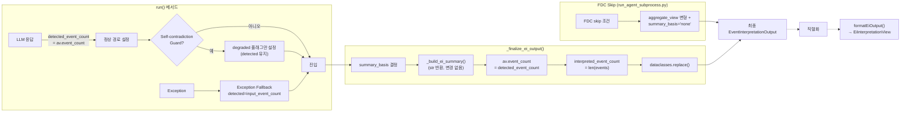

# EI Output Contract Phase 1 리팩토링 설계

> **목적**: `EventInterpretationOutput`에서 `detected_event_count`(LLM raw / system-detected)와 `interpreted_event_count`(derived from `events`)를 분리하고, `summary_basis`를 도입하여 현재 contract의 모호성을 해소한다.

---

## 1. 기존 Contract의 모호성 (Q1 분석 기반)

### 1.1 `aggregate_view.event_count`의 이중 의미

현재 [`EventInterpretationOutput`](src/agent_trading/services/ai_agents/schemas.py:249)에서 `event_count`는 단 하나의 필드이지만, 컨텍스트에 따라 두 가지 의미로 사용됨:

| 컨텍스트 | 실제 의미 | 문제점 |
|----------|----------|--------|
| 정상 경로 | LLM이 응답한 `event_count` (`= len(events)`와 같아야 함) | 동일 |
| Self-contradiction guard | LLM raw 값 (0) — 입력 events는 있지만 LLM이 무시 | `len(events)=0`과 충돌 |
| Exception fallback | LLM 응답 없음 → 0 | 실제로는 LLM raw 값이 아님 |
| FDC skip | 변형되지 않음 (LLM raw 유지) | `interpreted_event_count`와 혼동 |

### 1.2 Summary 생성이 Output 객체를 변형하지 못함

현재 [`_build_ei_summary()`](src/agent_trading/services/ai_agents/event_interpretation.py:46)는 `str`만 반환하고, 호출부에서 `object.__setattr__`로 summary를 설정한다. 이 구조에서는 `summary_basis` 같은 메타데이터를 함께 설정할 수 없다.

### 1.3 Frontend에서 `aggregate_view`만 참조

현재 [`formatEiOutput()`](admin_ui/src/lib/utils.ts:368)은 `aggregate_view` 서브 객체에서만 데이터를 읽는다. Phase 1에서 최상위에 추가될 `detected_event_count`, `interpreted_event_count`, `summary_basis`는 읽지 못함.

---

## 2. 새 Schema 정의

### 2.1 `EventInterpretationOutput` 변경

[`EventInterpretationOutput`](src/agent_trading/services/ai_agents/schemas.py:249)에 3개 필드를 추가:

| 필드 | 타입 | 기본값 | 의미 | 변경 규칙 |
|------|------|--------|------|----------|
| `detected_event_count` | `int` | `0` | 시스템이 감지하거나 LLM이 응답한 총 이벤트 수. **절대 감소 금지**. | 정상 경로: LLM raw `aggregate_view.event_count` 값 유지. Exception fallback: `input_event_count` 보존. Self-contradiction: LLM raw 값(0) 유지. |
| `interpreted_event_count` | `int` | `0` | `len(events)`와 항상 일치하는 derived field. | `_finalize_ei_output()`에서 `len(events)`로 설정. 직접 할당 금지. |
| `summary_basis` | `str` | `"none"` | summary 생성 기준. | `_finalize_ei_output()`에서 설정. |

**JSON serialization 구조**:
```json
{
  "detected_event_count": 3,
  "events": [...],
  "interpreted_event_count": 2,
  "summary_basis": "interpreted_degraded",
  "aggregate_view": {
    "event_count": 3,
    "no_material_events": false,
    "interpretation_incomplete": true,
    "degraded_reason": "partial_failure"
  },
  "summary": "..."
}
```

### 2.2 `AggregateEventView` 변경 없음 (Phase 1 의미 고정)

[`AggregateEventView`](src/agent_trading/services/ai_agents/schemas.py:198)는 변경하지 않는다. 대신 Phase 1에서 `aggregate_view.event_count`의 의미를 다음과 같이 **강하게 고정**한다:

```
Phase 1 불변 규칙:
  aggregate_view.event_count == detected_event_count
  interpreted_event_count == len(events)
```

| 경로 | `aggregate_view.event_count` | `detected_event_count` | `interpreted_event_count` |
|------|------------------------------|------------------------|---------------------------|
| 정상 (events=3) | 3 (LLM raw) | 3 (= av.event_count) | 3 (= len(events)) |
| Self-contradiction (input=3, LLM=0) | 0 (LLM raw) | 0 (= av.event_count) | 0 (= len(events)=0) |
| Exception fallback (input=2) | 2 (input 보존) | 2 (= input_event_count) | 0 (= len(events)=0) |
| Exception fallback (input=0) | 0 | 0 | 0 |
| FDC skip (LLM=3) | 3 (변경 없음) | 3 (= av.event_count, 유지) | 3 (= len(events), 유지) |

**핵심**: Phase 1에서 `aggregate_view.event_count`는 더 이상 이중 의미를 가지지 않는다. 항상 `detected_event_count`와 동일하며, 이는 "시스템이 감지한 총 이벤트 수"라는 단일 의미를 가진다. Phase 2에서 `interpreted_event_count`의 alias로 전환할 때까지 이 규칙을 유지한다.

### 2.3 `__post_init__` 변경 불필요

현재 [`__post_init__`](src/agent_trading/services/ai_agents/schemas.py:288)는 `aggregate_view`와 `events`의 타입 안전성만 검증한다. 새 필드 3개(`detected_event_count`, `interpreted_event_count`, `summary_basis`)는 기본값이 있는 단순 scalar 필드이므로 `__post_init__`에서 추가 처리 불필요.

---

## 3. `summary_basis` 규칙 (경계 명확화)

### 3.1 값과 의미

| `summary_basis` 값 | 의미 | 조건 |
|--------------------|------|------|
| `"interpreted"` | **정상 해석 완료** — 모든 입력 이벤트가 해석되어 `events`에 포함됨. | `has_events == True`, `degraded == False` |
| `"interpreted_degraded"` | **해석 결과 존재하나 불완전** — `events`에 해석된 이벤트가 있지만 일부 누락/변질. | `has_events == True`, `degraded == True` |
| `"detected_only"` | **이벤트 감지됨, 해석 실패** — 입력 이벤트는 존재(`detected_event_count > 0`)하지만 LLM이 해석하지 못함. `events`는 비어 있음. | `has_events == False`, `detected_event_count > 0` (input_event_count > 0) |
| `"none"` | **해석 대상 없음** — 시스템에 입력 이벤트가 없어 해석할 대상이 없음. | `input_event_count == 0` 또는 `no_material_events == True` |

### 3.2 `interpreted_degraded` vs `detected_only` 경계

```
┌──────────────────────────────────────────────────────────┐
│                  events != ()                            │
│  ┌──────────────────────────────────────────────────┐   │
│  │  interpreted_degraded                            │   │
│  │  (events 있음 + degraded)                        │   │
│  └──────────────────────────────────────────────────┘   │
└──────────────────────────────────────────────────────────┘

┌──────────────────────────────────────────────────────────┐
│                  events == ()                            │
│  ┌───────────────────────────┬──────────────────────────┐│
│  │   detected_only           │   none                   ││
│  │   (detected > 0,          │   (no detection,         ││
│  │    해석 불가)              │    해석 대상 없음)        ││
│  └───────────────────────────┴──────────────────────────┘│
└──────────────────────────────────────────────────────────┘
```

### 3.3 Case별 매핑 (현재 6개 Case)

| Case | 현재 설명 | `summary_basis` | 조건 요약 |
|------|----------|-----------------|----------|
| 1 | 정상 + events 있음 | `"interpreted"` | `events=True`, `degraded=False` |
| 2 | Degraded + events 있음 | `"interpreted_degraded"` | `events=True`, `degraded=True` |
| 3 | Self-contradiction | `"detected_only"` | `events=False`, `input>0`, `reason=self_contradiction` |
| 4 | Provider failure | `"detected_only"` | `events=False`, `input>0`, `reason=provider_error` |
| 5 | 진짜 no-event | `"none"` | `no_material=True` 또는 `input=0` |
| 6 | Fallback default | `"none"` | 위 조건에 해당하지 않음 |

### 3.4 FDC skip 경로

| FDC Skip 사유 | `summary_basis` | 이유 |
|---------------|-----------------|------|
| 모든 FDC skip | `"none"` | FDC skip은 해석 결과가 없으므로 `"none"` |

---

## 4. 함수 책임 분리 (피드백 #3 반영)

### 4.1 결정: `_build_ei_summary()` 단일 함수 분할 안 함

**대신 `_finalize_ei_output()` + `_build_ei_summary()` 2단계로 분리**

`_build_ei_summary()`를 `str` → `EventInterpretationOutput`으로 바꾸는 것은 영향 범위가 크다. 대신:

1. **`_finalize_ei_output()`** (신규): Output의 정합성을 보정하고 derived field를 설정
   - `interpreted_event_count = len(events)`
   - `summary_basis` 결정 (Case 분기)
   - `aggregate_view.event_count == detected_event_count` 유지 확인
   - `EventInterpretationOutput` 반환

2. **`_build_ei_summary()`** (기존 유지): `str` 반환. Case 분기 로직은 여기에 그대로 두되, `summary_basis`는 받지 않음.

**호출 순서**:
```python
# run() 정상 경로 (현재 line 352)
result = _finalize_ei_output(result, input_event_count=input_event_count)
# _finalize_ei_output() 내부에서 _build_ei_summary() 호출
```

### 4.2 `_finalize_ei_output()` 설계

```python
def _finalize_ei_output(
    output: EventInterpretationOutput,
    input_event_count: int = 0,
) -> EventInterpretationOutput:
    """EI output의 derived field를 설정하고 summary를 생성.
    
    1. interpreted_event_count = len(events)
    2. summary_basis 결정 (Case 분기)
    3. aggregate_view.event_count == detected_event_count 유지 확인
    4. summary 생성 (기존 _build_ei_summary 호출)
    """
    av = output.aggregate_view
    has_events = bool(output.events)
    degraded = av.interpretation_incomplete
    detected = output.detected_event_count  # ★ LLM raw / system-detected
    no_material = av.no_material_events
    reason = av.degraded_reason
    
    # ── summary_basis 결정 ──
    if has_events and not degraded:
        summary_basis = "interpreted"
    elif has_events and degraded:
        summary_basis = "interpreted_degraded"
    elif input_event_count > 0 and detected == 0 and reason == "self_contradiction_corrected":
        summary_basis = "detected_only"
    elif input_event_count > 0 and detected == 0 and reason == "provider_error":
        summary_basis = "detected_only"
    elif no_material or input_event_count == 0:
        summary_basis = "none"
    else:
        summary_basis = "none"
    
    # ── summary 생성 (기존 함수 유지) ──
    summary = _build_ei_summary(output, input_event_count=input_event_count)
    
    # ── aggregate_view.event_count 동기화 (Phase 1 규칙) ──
    synced_av = replace(
        av,
        event_count=output.detected_event_count,  # == detected_event_count
    )
    
    return replace(
        output,
        summary=summary,
        summary_basis=summary_basis,
        interpreted_event_count=len(output.events),
        aggregate_view=synced_av,
    )
```

**`_build_ei_summary()`는 변경 없음** — `str` 반환, Case 분기 로직 유지.

### 4.3 `run()` 메서드 내 호출 변경

```python
# 정상 경로 (현재 line 352)
# 현재:
object.__setattr__(result, "summary", _build_ei_summary(result, input_event_count=input_event_count))
# 변경:
result = _finalize_ei_output(result, input_event_count=input_event_count)

# Exception fallback (현재 line 424)
# 현재:
object.__setattr__(fallback, "summary", _build_ei_summary(fallback, input_event_count=input_event_count))
# 변경:
fallback = _finalize_ei_output(fallback, input_event_count=input_event_count)

# Exception fallback no-input (현재 line 438)
# 현재:
object.__setattr__(fallback, "summary", _build_ei_summary(fallback))
# 변경:
fallback = _finalize_ei_output(fallback)
```

**모듈 최상단에 `_finalize_ei_output`과 `_build_ei_summary`를 함께 배치** (`_build_ei_summary` 아래에 `_finalize_ei_output` 추가).

---

## 5. `detected_event_count` 설정 로직 (피드백 #1 반영)

### 5.1 정상 경로 (LLM 응답 직후)

```python
# run() 메서드 내, LLM 응답 직후 (현재 line 299-316)
result: EventInterpretationOutput = raw_response.parsed

result = EventInterpretationOutput(
    schema_version=self._schema_version,
    agent_name=result.agent_name or self.agent_name,
    decision_context_id=...,
    symbol=result.symbol or request_symbol,
    issuer_code=result.issuer_code,
    events=result.events,
    aggregate_view=result.aggregate_view,
    # ★ 신규: LLM raw event_count를 detected_event_count에 보존
    detected_event_count=result.aggregate_view.event_count,
)
```

### 5.2 Self-contradiction guard (변경 없음)

```python
# 현재 (line 330-349): 이미 LLM 응답 유지 중
# LLM raw 값(result.aggregate_view.event_count=0)은 step 5.1에서
# 이미 detected_event_count=0으로 설정됨.
# 별도 변경 불필요. guard는 degraded 플래그만 설정.
```

### 5.3 Exception fallback — input > 0 (변경)

```python
# Exception fallback (line 409-425)
# ★ 변경: detected_event_count는 input_event_count 보존
if input_event_count > 0:
    fallback_av = AggregateEventView(
        overall_bias="neutral",
        event_conflict=False,
        top_reason_codes=(),
        opposing_evidence=(),
        evidence_strength="weak",
        event_count=input_event_count,           # ★ input_event_count 보존
        no_material_events=False,                # ★ input이 있으므로 False
        interpretation_incomplete=True,
        degraded_reason="provider_error",
    )
    fallback = EventInterpretationOutput(
        symbol=request_symbol,
        aggregate_view=fallback_av,
        # ★ 신규: 시스템이 감지한 이벤트 수 보존
        detected_event_count=input_event_count,
    )
    fallback = _finalize_ei_output(fallback, input_event_count=input_event_count)
    return fallback
```

### 5.4 Exception fallback — input = 0 (변경 최소)

```python
# Exception fallback, input=0
# LLM 응답 없음 + 입력 없음 → detected_event_count=0 (기본값)
fallback = EventInterpretationOutput(
    symbol=request_symbol,
    aggregate_view=AggregateEventView(
        interpretation_incomplete=True,
        degraded_reason="provider_error",
    ),
    # detected_event_count는 기본값 0
)
fallback = _finalize_ei_output(fallback)
return fallback
```

### 5.5 `detected_event_count` 설정 요약

| 경로 | `detected_event_count` | 근거 |
|------|------------------------|------|
| 정상 (LLM 응답) | `av.event_count` (LLM raw) | LLM이 응답한 값을 그대로 보존 |
| Self-contradiction | `0` (LLM raw) | 이미 step 5.1에서 설정된 값, guard는 변경 안 함 |
| Exception fallback (input>0) | `input_event_count` | 시스템이 입력 이벤트를 알고 있으므로 보존 |
| Exception fallback (input=0) | `0` (기본값) | LLM 응답 없음, 입력도 없음 |
| FDC skip | 변경 없음 (step 5.1 값 유지) | FDC skip은 detected count에 영향 없음 |

---

## 6. FDC skip 경로 변경

[`run_agent_subprocess.py`](scripts/run_agent_subprocess.py:630-646)의 FDC skip 경로에서 `summary_basis` 설정 추가:

```python
if skip_fdc:
    composer_output = skip_output
    from dataclasses import replace
    degraded_av = replace(
        event_output.aggregate_view,
        interpretation_incomplete=True,
        degraded_reason=f"fdc_skipped:{skip_reason}",
    )
    object.__setattr__(event_output, "aggregate_view", degraded_av)
    
    # ★ 신규: summary_basis 설정
    object.__setattr__(event_output, "summary_basis", "none")
    
    # ★ 신규: interpreted_event_count 동기화
    object.__setattr__(
        event_output,
        "interpreted_event_count",
        len(event_output.events),
    )
```

**참고**: `run_agent_subprocess.py`는 `dataclasses`의 `replace()` + `object.__setattr__()` 조합을 사용하므로 새 필드도 동일한 패턴으로 설정.

---

## 7. Frontend `formatEiOutput()` 변경

### 7.1 `EiInterpretationView` 인터페이스 확장

[`utils.ts`](admin_ui/src/lib/utils.ts:355)의 인터페이스에 3개 필드 추가:

```typescript
export interface EiInterpretationView {
  biasLabel: string;
  conflictLabel: string;
  reasonCodeLabels: string[];
  reasonCodes: string[];
  evidenceStrengthLabel: string;
  eventCount: number;            // interpreted_event_count로 재정의
  hasMaterialEvents: boolean;
  operatorSummary: string;
  isDegraded: boolean;
  degradedReason: string | null;
  // ★ 신규
  detectedEventCount: number;    // detected_event_count (LLM raw / system-detected)
  interpretedEventCount: number;  // interpreted_event_count (derived from events)
  summaryBasis: string;          // summary_basis
}
```

### 7.2 `formatEiOutput()` 로직 변경

```typescript
export function formatEiOutput(so: Record<string, unknown> | null | undefined): EiInterpretationView | null {
  if (!so) return null;
  const av = so.aggregate_view as Record<string, unknown> | undefined;
  if (!av) return null;

  // ... 기존 bias, conflict, reasonCodes, evidenceStrength 로직 유지 ...

  const eventCount = (av.event_count as number) ?? 0;
  const noMaterialEvents = av.no_material_events as boolean | undefined;
  const events = (so.events as Array<Record<string, unknown>>) ?? [];

  // ★ 신규: 최상위 필드 우선, 없으면 aggregate_view에서 fallback
  const detectedEventCount = (so.detected_event_count as number) ?? eventCount;
  const interpretedEventCount = (so.interpreted_event_count as number) ?? events.length;
  const summaryBasis = (so.summary_basis as string) ?? "none";

  // ... 기존 operatorSummary 로직 유지 (eventCount는 interpretedEventCount 사용) ...

  return {
    biasLabel,
    conflictLabel,
    reasonCodeLabels,
    reasonCodes: rawReasonCodes,
    evidenceStrengthLabel,
    eventCount: interpretedEventCount,  // eventCount는 interpreted count로 재정의
    hasMaterialEvents: !noMaterialEvents,
    operatorSummary,
    isDegraded: interpretationIncomplete === true,
    degradedReason: degradedReason ?? null,
    // ★ 신규
    detectedEventCount,
    interpretedEventCount,
    summaryBasis,
  };
}
```

**중요**: `eventCount` 필드는 기존 소비자와의 호환성을 위해 유지하되, 값은 `interpretedEventCount`로 설정. Phase 2/3에서 필요시 다른 필드로 대체.

---

## 8. 호환성 전략 (3단계 이행)

### Phase 1 (지금): 새 필드 추가 + 의미 고정

| 항목 | 변경 |
|------|------|
| `EventInterpretationOutput` | `detected_event_count`, `interpreted_event_count`, `summary_basis` 추가 |
| `AggregateEventView.event_count` | 유지, **`== detected_event_count`로 의미 고정** |
| `_finalize_ei_output()` | 신규 함수. derived field 설정 + summary 생성. |
| `_build_ei_summary()` | 변경 없음. `str` 반환 유지. |
| JSON 직렬화 | 새 필드 포함. 기존 `aggregate_view.event_count`도 계속 포함 |
| Frontend | 새 필드 읽기. `eventCount`는 `interpretedEventCount`로 재정의 |
| DB/저장소 | 변경 없음 (EI 출력은 JSON blob으로 저장) |

### Phase 2 (다음 스프린트): `aggregate_view.event_count` → alias

- `aggregate_view.event_count`를 `interpreted_event_count`의 파생값(during serialization)으로 전환
- 기존 consumer가 모두 Phase 1 필드를 읽는지 확인 후 전환

### Phase 3 (향후): `AggregateEventView.event_count` 제거

- 모든 consumer가 `interpreted_event_count`와 `detected_event_count`를 사용함을 확인
- `AggregateEventView.event_count` 필드 제거 (breaking change)

---

## 9. 적용할 수정 사항 (파일별 요약)

| # | 파일 | 변경 내용 | 영향 범위 |
|---|------|----------|----------|
| 1 | [`schemas.py`](src/agent_trading/services/ai_agents/schemas.py) | `EventInterpretationOutput`에 3개 필드 추가 (`detected_event_count: int = 0`, `interpreted_event_count: int = 0`, `summary_basis: str = "none"`) | Schema만 |
| 2 | [`event_interpretation.py`](src/agent_trading/services/ai_agents/event_interpretation.py) | ① `_finalize_ei_output()` 신규 함수 추가 (derived field + summary_basis + summary). ② `_build_ei_summary()` 변경 없음 (str 반환 유지). ③ `run()` 정상 경로에서 `detected_event_count=av.event_count` 설정. ④ Exception fallback(input>0)에서 `detected_event_count=input_event_count` + `aggregate_view.event_count=input_event_count`. ⑤ `run()` 내 모든 `object.__setattr__` → `_finalize_ei_output()` 호출로 변경. | `_finalize_ei_output()` 신규, `run()` 호출부 3곳, 2개 AggregateEventView 생성부 |
| 3 | [`run_agent_subprocess.py`](scripts/run_agent_subprocess.py) | FDC skip 경로에서 `summary_basis="none"` + `interpreted_event_count=len(events)` 설정 | L630-646 |
| 4 | [`utils.ts`](admin_ui/src/lib/utils.ts) | `EiInterpretationView` 인터페이스에 3개 필드 추가. `formatEiOutput()`에서 새 필드 읽기 로직 추가. `eventCount` → `interpretedEventCount`로 재정의 | 인터페이스 + 함수 |
| 5 | [`test_decision_submit_pipeline.py`](tests/services/test_decision_submit_pipeline.py) | 6개 새 테스트 추가 (아래 §10 참조) | `TestEIPostProcessingGuard` 클래스 |
| 6 | [`utils.test.ts`](admin_ui/src/__tests__/utils.test.ts) | 2개 새 테스트 추가 (아래 §10 참조) | `formatEiOutput` describe 블록 |

---

## 10. 테스트 설계

### 10.1 `_finalize_ei_output()` 단위 테스트 (신규)

`_finalize_ei_output()`이 독립적으로 `summary_basis`, `interpreted_event_count`, `aggregate_view.event_count`를 올바르게 설정하는지 검증:

#### T1: `test_finalize_normal_path_interpreted`
- **Setup**: `events=(1개)`, `degraded=False`, `detected_event_count=2`
- **Expected**: `summary_basis="interpreted"`, `interpreted_event_count=1`, `av.event_count=2`

#### T2: `test_finalize_degraded_with_events_interpreted_degraded`
- **Setup**: `events=(1개)`, `degraded=True`, `detected_event_count=2`
- **Expected**: `summary_basis="interpreted_degraded"`, `interpreted_event_count=1`

#### T3: `test_finalize_self_contradiction_detected_only`
- **Setup**: `events=()`, `input=3`, `detected_event_count=0`, `degraded_reason="self_contradiction_corrected"`
- **Expected**: `summary_basis="detected_only"`, `interpreted_event_count=0`

#### T4: `test_finalize_exception_fallback_detected_only`
- **Setup**: `events=()`, `input=2`, `detected_event_count=2`, `degraded_reason="provider_error"`
- **Expected**: `summary_basis="detected_only"`, `interpreted_event_count=0`

#### T5: `test_finalize_no_event_none`
- **Setup**: `events=()`, `input=0`, `detected_event_count=0`, `no_material_events=True`
- **Expected**: `summary_basis="none"`, `interpreted_event_count=0`

#### T6: `test_finalize_aggregate_view_event_count_synced`
- **Setup**: `detected_event_count=3`, `av.event_count` 초기값 1 (비정상)
- **Expected**: `av.event_count == 3` (동기화됨)

### 10.2 `_build_ei_summary()` 기존 테스트 (변경 불필요)

현재 6개 `test_summary_*` 테스트는 `_build_ei_summary()`가 `str`을 반환하는 것을 검증. 함수 시그니처가 변경되지 않았으므로 기존 테스트는 그대로 통과해야 함.

| 테스트 | Case | 변경 |
|--------|------|------|
| `test_summary_case2_degraded_with_events` | 2 | 없음 |
| `test_summary_case3_self_contradiction` | 3 | 없음 |
| `test_summary_preserves_no_events_when_no_material_events_true` | 5 | 없음 |
| `test_summary_normal_path_with_events` | 1 | 없음 |
| `test_summary_case4_provider_failure` | 4 | 없음 |
| `test_summary_case5_true_no_event` | 5 | 없음 |

### 10.3 `run()` 통합 테스트 (어설션 추가)

기존 `TestEIPostProcessingGuard` 테스트에 `detected_event_count`, `interpreted_event_count`, `summary_basis` 어설션을 추가:

| 기존 테스트 | 추가할 어설션 |
|------------|--------------|
| `test_self_contradiction_guard_preserves_llm_output` | `detected_event_count==0`, `interpreted_event_count==0`, `summary_basis=="detected_only"` |
| `test_guard_does_not_correct_when_input_events_zero` | `detected_event_count==0`, `summary_basis=="none"` |
| `test_exception_fallback_sets_degraded_flags_with_input` | `detected_event_count==1` (input=1 보존), `interpreted_event_count==0`, `summary_basis=="detected_only"` |
| `test_exception_fallback_sets_degraded_flags_no_input` | `detected_event_count==0`, `summary_basis=="none"` |

### 10.4 Frontend 테스트

#### T7: `test_formatted_ei_output_new_fields`
```typescript
it('includes new fields detectedEventCount, interpretedEventCount, summaryBasis', () => {
  const result = formatEiOutput({
    detected_event_count: 5,
    interpreted_event_count: 3,
    summary_basis: 'interpreted_degraded',
    aggregate_view: {
      event_count: 5,
      overall_bias: 'neutral',
      no_material_events: false,
      interpretation_incomplete: true,
      degraded_reason: 'partial_failure',
    },
    events: [{}, {}, {}],
  });
  expect(result!.detectedEventCount).toBe(5);
  expect(result!.interpretedEventCount).toBe(3);
  expect(result!.summaryBasis).toBe('interpreted_degraded');
  expect(result!.eventCount).toBe(3); // eventCount는 interpretedEventCount로 재정의
});
```

#### T8: `test_formatted_ei_output_fallback_when_new_fields_missing`
```typescript
it('falls back to aggregate_view.event_count when new fields are missing', () => {
  const result = formatEiOutput({
    aggregate_view: {
      event_count: 3,
      overall_bias: 'positive',
      no_material_events: false,
    },
    events: [{}, {}],
  });
  expect(result!.detectedEventCount).toBe(3);   // av.event_count fallback
  expect(result!.interpretedEventCount).toBe(2); // events.length fallback
  expect(result!.summaryBasis).toBe('none');     // 기본값
});
```

---

## 11. 영향 분석

### 11.1 기존 consumer 변경 불필요 목록

다음 consumer는 `aggregate_view.event_count`를 그대로 읽으므로 Phase 1 변경에 영향 없음 (값 의미만 `detected_event_count`와 동일해짐):

| Consumer | 파일 | 사용 패턴 | 영향 |
|----------|------|----------|------|
| Decision Orchestrator | `decision_orchestrator.py` | `output.aggregate_view.event_count` | 없음 (값 의미 변경만 있음) |
| AR Agent | `ai_risk_agent.py` | EI output을 context로 전달 | 없음 |
| FDC Agent | `final_decision_agent.py` | EI output을 context로 전달 | 없음 |
| DB 저장 | `run_agent_subprocess.py` | `_dataclass_to_dict()`로 직렬화 | 새 필드 자동 포함 |
| API 응답 | `agent_runs.py` | JSON serialization | 새 필드 자동 포함 |

### 11.2 주의사항

1. **`_finalize_ei_output()` 호출 타이밍**: Self-contradiction guard → `_finalize_ei_output()` 순서. `detected_event_count`는 guard 이전에 설정되어야 함.
2. **Exception fallback에서 `aggregate_view`와 `detected_event_count` 일관성**: 둘 다 `input_event_count`로 설정. `_finalize_ei_output()`에서 `av.event_count == detected_event_count`를 재확인.
3. **Frontend null safety**: `formatEiOutput()`이 `aggregate_view` 없을 때 null 반환하는 기존 동작 유지.
4. **`run_agent_subprocess.py`의 `object.__setattr__`**: FDC skip 경로에서 frozen dataclass 필드를 설정할 때 이 패턴 유지.
5. **기존 `_build_ei_summary()` 단위 테스트**: 함수 시그니처가 변경되지 않았으므로 기존 테스트는 모두 통과해야 함.

---

## 12. 데이터 흐름 다이어그램



---

## 13. 구현 순서

1. **`schemas.py`**: `EventInterpretationOutput`에 3개 필드 추가 (`detected_event_count`, `interpreted_event_count`, `summary_basis`)
2. **`event_interpretation.py`**:
   a. `_finalize_ei_output()` 신규 함수 추가 (derived field + summary_basis + summary)
   b. `_build_ei_summary()` 변경 없음 (기존 `str` 반환 유지)
   c. `run()` 정상 경로에서 `detected_event_count=av.event_count` 설정 (LLM 응답 직후 `EventInterpretationOutput()` 생성자에 전달)
   d. Exception fallback(input>0): `detected_event_count=input_event_count`, `aggregate_view.event_count=input_event_count`
   e. `run()` 내 모든 3개 `object.__setattr__` → `_finalize_ei_output()` 호출로 변경
3. **`run_agent_subprocess.py`**: FDC skip 경로에 `summary_basis="none"` + `interpreted_event_count=len(events)` 설정 추가
4. **`utils.ts`**: `EiInterpretationView` 인터페이스 + `formatEiOutput()` 변경
5. **`test_decision_submit_pipeline.py`**:
   - T1-T6: `_finalize_ei_output()` 단위 테스트 6개 추가
   - 기존 4개 테스트에 `detected_event_count`/`interpreted_event_count`/`summary_basis` 어설션 추가
6. **`utils.test.ts`**: T7-T8 추가
7. **기존 테스트 검증**: 변경 후 기존 테스트(`_build_ei_summary()` 6개 + self-contradiction guard 5개)가 모두 통과하는지 확인
