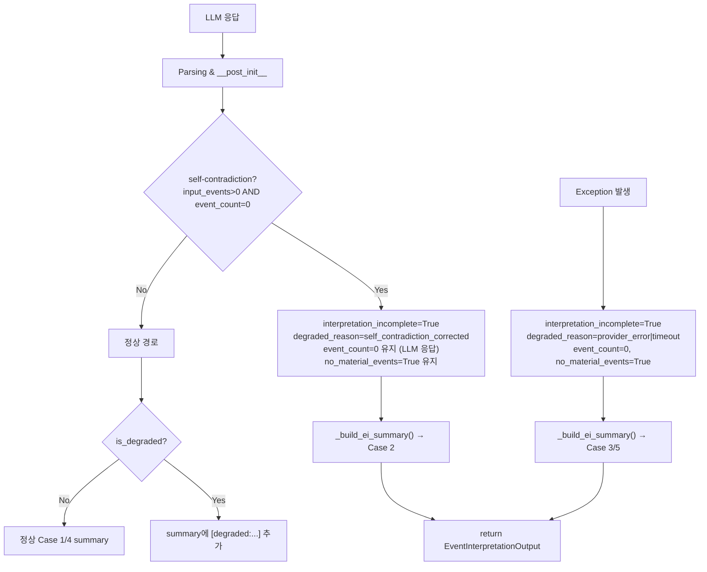
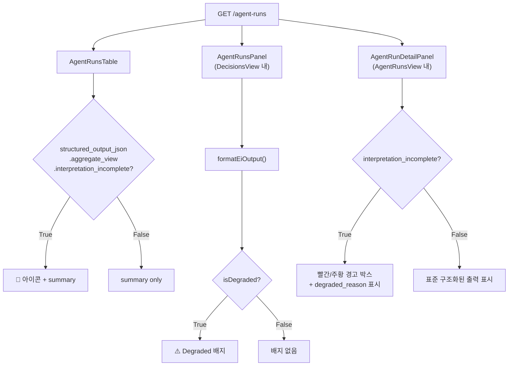
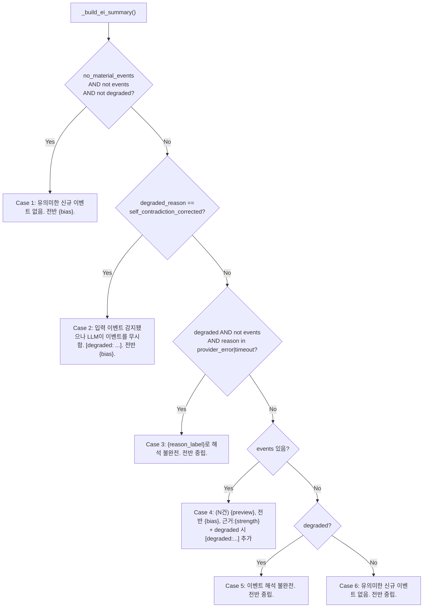

# EI Output Contract 리팩토링 — 설계 문서

**작성일**: 2026-05-23  
**작성자**: Architect mode  
**상태**: 설계 완료 (Code subtask 실행 대기)

---

## 목차

1. [Schema Contract 최종안](#1-schema-contract-최종안)
2. [Degraded Mode Semantics 테이블](#2-degraded-mode-semantics-테이블)
3. [Summary 생성 알고리즘](#3-summary-생성-알고리즘)
4. [Exception Fallback 수정 명세](#4-exception-fallback-수정-명세)
5. [Admin UI Degraded Indicator 디자인](#5-admin-ui-degraded-indicator-디자인)
6. [Field Responsibility Matrix](#6-field-responsibility-matrix)
7. [Test 설계](#7-test-설계)
8. [Migration 경로](#8-migration-경로)

---

## 1. Schema Contract 최종안

### 후보 평가

| 후보 | 장점 | 단점 | 결정 |
|------|------|------|------|
| **A** `detected_event_count` + `interpreted_events[]` 분리 | 의미 혼란 해소, 명확한 구분 | DB/API/UI 전면 수정, `structured_output_json`에 저장된 기존 데이터와 비호환, 변경 범위 과대 | ❌ |
| **B** `EIStatus` enum 추가 | 단일 enum으로 상태 명확, consumer 판단 단순화 | 기존 boolean 필드와 중복, schema migration 필요 | ⚠️ 부분 채택 |
| **C** `summary` 생성을 consumer 책임으로 분리 | Case 2 근본 해결 | API 응답마다 summary 재생성 필요, 속도 영향, `structured_output_json` 불일치 | ❌ |

### 최종안: Hybrid A⁻ + B⁻ (기존 필드 의미 정립 + derived status)

**원칙: 기존 `structured_output_json`에 저장된 데이터와의 **완전한 하위 호환성** 유지. 새로운 필드 추가 없이 기존 필드의 의미를 명확히 하고, derived property로 상태 노출.**

#### 1.1 기존 필드 의미 재정의

| 필드 | 현재 (모호) | 재정의 (명확) |
|------|------------|---------------|
| `event_count` | "Number of material events actually grounded" — but self-contradiction guard가 `input_event_count`로 override | **"LLM이 판단한 material events 수"** (LLM 원본 응답 그대로. self-contradiction guard에서도 override하지 않음) |
| `no_material_events` | "True when there are no material events" | **"LLM이 판단한 material events 부재 여부"** (LLM 원본 응답 그대로. guard에서 override하지 않음) |
| `events[]` | LLM이 반환한 interpreted events | **"LLM이 반환한 interpreted events 목록"** (변경 없음) |
| `interpretation_incomplete` | "Agent could not complete interpretation" | **"시스템이 개입하여 결과를 보정했음"** (guard/fallback 개입 시 True) |
| `degraded_reason` | Machine-readable reason | **변경 없음** (`None` \| `"timeout"` \| `"provider_error"` \| `"self_contradiction_corrected"` \| `"fdc_skipped"`) |
| `summary` | Deterministic Korean summary | **summary만 보고 degraded 여부를 구분 가능해야 함** (아래 §3 참조) |

#### 1.2 Self-contradiction guard 동작 변경 (핵심)

**AS-IS** (`event_interpretation.py:278-306`):
```python
# input_event_count > 0인데 LLM이 event_count=0 반환
corrected_av = AggregateEventView(
    ...
    event_count=input_event_count,    # ❌ LLM 응답 override
    no_material_events=False,         # ❌ LLM 응답 override
    interpretation_incomplete=True,
    degraded_reason="self_contradiction_corrected",
)
```

**TO-BE**:
```python
# input_event_count > 0인데 LLM이 event_count=0 반환
# → LLM의 판단은 존중하되, 시스템이 개입했음을 표시
corrected_av = AggregateEventView(
    ...
    event_count=0,                     # ✅ LLM 원본 응답 유지
    no_material_events=True,           # ✅ LLM 원본 응답 유지
    interpretation_incomplete=True,    # 시스템 개입
    degraded_reason="self_contradiction_corrected",
)
# 단, input_event_count는 별도 저장/로깅용으로 활용
```

**이 변경이 미치는 영향:**
- [`event_interpretation.py:69`](src/agent_trading/services/ai_agents/event_interpretation.py:69): Case 2 (`event_count > 0 AND no_material_events == False AND events == []`) — 더 이상 self-contradiction guard에서 이 경로로 진입하지 않음. **새로운 Case 2a 필요** (아래 §3 참조)
- [`scripts/run_agent_subprocess.py:481-484`](scripts/run_agent_subprocess.py:481): FDC skip 조건 2 (`no_material_events + not has_position`) — self-contradiction guard에서 `no_material_events=True`로 유지되므로 **조건 충족 → FDC skip됨**. 그러나 이는 올바른 동작: LLM이 "no material events"라고 판단했으므로 FDC skip이 타당함. 다만 `is_degraded`가 True이면 skip하지 않도록 보호 필요.

#### 1.3 새로운 derived property: `EIStatus`

`AggregateEventView`에 저장 필드로 추가하지 않고, consumer가 `interpretation_incomplete` + `degraded_reason` 조합으로 판단:

| 상태 | `interpretation_incomplete` | `degraded_reason` | `event_count` | `events[]` |
|------|---------------------------|-------------------|---------------|------------|
| `NORMAL` | `False` | `None` | LLM 응답 | LLM 응답 |
| `SELF_CONTRADICTION_CORRECTED` | `True` | `"self_contradiction_corrected"` | 0 (LLM 응답) | `[]` |
| `PROVIDER_FAILURE` | `True` | `"provider_error"` | 0 | `[]` |
| `TIMEOUT` | `True` | `"timeout"` | 0 | `[]` |
| `FDC_SKIPPED` | `True` | `"fdc_skipped"` | 0 (또는 LLM 응답) | `[]` |

#### 1.4 `is_degraded` property 개선

현재 [`schemas.py:349-351`](src/agent_trading/services/ai_agents/schemas.py:349):
```python
@property
def is_degraded(self) -> bool:
    return self.aggregate_view.interpretation_incomplete
```

TO-BE (변경 없음, 동일 유지):
```python
@property
def is_degraded(self) -> bool:
    """True when interpretation was incomplete or degraded."""
    return self.aggregate_view.interpretation_incomplete
```

---

## 2. Degraded Mode Semantics 테이블

### 5개 시나리오 × 6개 필드

| 시나리오 | `event_count` | `events[]` | `no_material_events` | `interpretation_incomplete` | `degraded_reason` | `summary` |
|----------|--------------|------------|---------------------|----------------------------|-------------------|-----------|
| **a. LLM call 실패** (exception/HTTP error) | `0` (default) | `[]` (default) | `True` (default) | `True` ✅ **현재 미설정 → 수정 필요** | `"provider_error"` ✅ **현재 미설정 → 수정 필요** | 새 Case 4a: `"(N건) 이벤트 감지됨. Provider 오류로 해석 불완전. 전반 중립."` |
| **b. JSON parse failure** | `0` (fallback) | `[]` (fallback) | `True` (fallback) | `True` ✅ **현재 미설정 → 수정 필요** | `"provider_error"` ✅ **현재 미설정 → 수정 필요** | 새 Case 4b: `"(N건) 이벤트 감지됨. 응답 파싱 실패로 해석 불완전. 전반 중립."` |
| **c. LLM이 `events=[]` 반환** (self-contradiction) | `0` (**변경: LLM 응답 유지**) | `[]` | `True` (**변경: LLM 응답 유지**) | `True` | `"self_contradiction_corrected"` | 새 Case 2a: `"(N건) 입력 이벤트 감지됐으나 LLM이 이벤트를 무시함. [degraded: self_contradiction_corrected]. 전반 {bias}."` |
| **d. FDC skip 경로** | `0` (EI 기본값) | `[]` | `True` | `True` (EI 관점) | `"fdc_skipped"` | (EI summary는 기존과 동일. FDC skip은 별도 처리는 안 함 — FDC skip 자체는 EI 문제 아님) |
| **e. LLM timeout** | `0` (fallback) | `[]` (fallback) | `True` (fallback) | `True` ✅ **현재 미설정 → 수정 필요** | `"timeout"` ✅ **현재 미설정 → 수정 필요** | 새 Case 4c: `"(N건) 이벤트 감지됨. LLM 응답 시간 초과로 해석 불완전. 전반 중립."` |

### 참고: 현재 fallback 경로 문제점

현재 [`event_interpretation.py:346-384`](src/agent_trading/services/ai_agents/event_interpretation.py:346)의 `except` 블록:

```python
except Exception:
    # ...
    if input_event_count > 0:
        fallback_av = AggregateEventView(
            ...
            event_count=input_event_count,  # input count로 설정
            no_material_events=False,        # "이벤트 있음"으로 표시
            # ❌ interpretation_incomplete 미설정 (default False)
            # ❌ degraded_reason 미설정 (default None)
        )
        return EventInterpretationOutput(
            symbol=request_symbol,
            aggregate_view=fallback_av,
        )
```

**수정 필수**: `interpretation_incomplete=True` + 적절한 `degraded_reason` 설정

---

## 3. Summary 생성 알고리즘

### 3.1 새로운 `_build_ei_summary()` 의사코드

```python
def _build_ei_summary(output: EventInterpretationOutput) -> str:
    """EI 출력에서 deterministic 한국어 요약 문자열 생성.
    
    모든 Case에서 summary만 보고 consumer가 정상/degraded/fallback 상태를
    구분할 수 있어야 함.
    """
    av = output.aggregate_view
    is_degraded = output.is_degraded
    degraded_reason = av.degraded_reason
    has_events = bool(output.events)
    event_count = av.event_count  # LLM 응답 (신뢰)
    
    # ── 편의 변수 ──
    bias_kor = {"positive": "긍정", "negative": "부정", "neutral": "중립"}
    bias_str = bias_kor.get(av.overall_bias, av.overall_bias)
    strength = av.evidence_strength or "weak"
    
    # ── Case 1: 진정한 "이벤트 없음" (정상, LLM 판단) ──
    # 조건: no_material_events=True, events=[], event_count=0, not degraded
    if av.no_material_events and not has_events and not is_degraded:
        if av.overall_bias == "negative":
            return "유의미한 신규 이벤트 없음. 전반 부정적."
        elif av.overall_bias == "positive":
            return "유의미한 신규 이벤트 없음. 전반 긍정."
        else:
            return "유의미한 신규 이벤트 없음. 전반 중립."
    
    # ── Case 2: Self-contradiction corrected ──
    # 조건: degraded, degraded_reason="self_contradiction_corrected"
    #   no_material_events=True (LLM 판단), events=[], event_count=0
    # 특징: LLM이 입력 이벤트를 무시했으나 시스템이 개입
    if is_degraded and degraded_reason == "self_contradiction_corrected":
        return (
            f"입력 이벤트 감지됐으나 LLM이 이벤트를 무시함. "
            f"[degraded: self_contradiction_corrected]. 전반 {bias_str}."
        )
    
    # ── Case 3: Provider error / Timeout (complete degradation) ──
    # 조건: degraded, (provider_error|timeout), events=[], event_count=0
    if is_degraded and not has_events and degraded_reason in ("provider_error", "timeout"):
        reason_label = {
            "provider_error": "Provider 오류",
            "timeout": "LLM 응답 시간 초과",
        }.get(degraded_reason, "오류")
        return (
            f"{reason_label}로 해석 불완전. 전반 중립."
        )
    
    # ── Case 4: 정상 events 존재 ──
    # 조건: has_events=True (events에 실제 interpreted event 있음)
    if has_events:
        event_count_display = len(output.events)
        parts = [f"전반 {bias_str}"]
        
        # 대표 이벤트 1건 요약
        first = output.events[0]
        if first.summary:
            preview = first.summary.split(".")[0] if "." in first.summary else first.summary
            if len(preview) > 80:
                preview = preview[:77] + "..."
            parts.insert(0, preview)
        
        # evidence strength
        if av.evidence_strength and av.evidence_strength not in ("none", ""):
            parts.append(f"근거:{av.evidence_strength}")
        
        # degraded 정보 추가 (partial degradation: events는 있지만 불완전)
        if is_degraded:
            parts.append(f"[degraded:{degraded_reason}]")
        
        return f"({event_count_display}건) " + ", ".join(parts)
    
    # ── Case 5: Fallback (bare minimum) ──
    # 조건: degraded, events=[], 위 모든 Case에 해당하지 않음
    if is_degraded:
        return (
            f"이벤트 해석 불완전. 전반 {bias_str}."
        )
    
    # ── Case 6: No events, not degraded ── (최종 fallback)
    return "유의미한 신규 이벤트 없음. 전반 중립."
```

### 3.2 Case 매트릭스

| Case | 조건 | 출력 예시 | 비고 |
|------|------|-----------|------|
| **1** 정상 no-event | `no_material_events=True`, `events=[]`, `not degraded` | `"유의미한 신규 이벤트 없음. 전반 중립."` | 기존 Case 1 유지 |
| **2** Self-contradiction | `degraded_reason="self_contradiction_corrected"` | `"입력 이벤트 감지됐으나 LLM이 이벤트를 무시함. [degraded: self_contradiction_corrected]. 전반 중립."` | **신규** — 기존 Case 2 대체 |
| **3** 완전 degraded | `degraded` + `events=[]` + (provider_error\|timeout) | `"Provider 오류로 해석 불완전. 전반 중립."` | **신규** — 기존 Case 3/4 대체 |
| **4** 정상 events | `events` 있음 (1건 이상) | `"(3건) 삼성전자 2분기 실적 발표, 전반 긍정, 근거:strong"` | 기존 Case 3 유지 + degraded 시 `[degraded:...]` 추가 |
| **5** Fallback | `degraded` + `events=[]` + 다른 Case 미해당 | `"이벤트 해석 불완전. 전반 중립."` | **신규** 안전장치 |
| **6** 최종 fallback | 위 모든 Case 미해당 | `"유의미한 신규 이벤트 없음. 전반 중립."` | 기존 Case 2.5 유지 |

### 3.3 기존 Case 2 삭제

**현재 Case 2** ([`event_interpretation.py:69-76`](src/agent_trading/services/ai_agents/event_interpretation.py:69)):
```python
# ── Case 2: event_count > 0 이지만 events=[] (exception fallback 등) ──
if av.event_count > 0 and not av.no_material_events and not output.events:
    return f"({av.event_count}건) 입력 이벤트 {av.event_count}건 감지됨. 세부 이벤트 추출 누락. ..."
```

**삭제 사유:**
- `event_count`를 더 이상 self-contradiction guard가 override하지 않으므로 (`event_count=0` 유지), 이 조건 (`event_count > 0 AND not no_material_events AND events=[]`)이 발생하지 않음
- 대신, exception fallback 경로에서도 `interpretation_incomplete=True` + `degraded_reason`을 설정하므로, 위 새로운 Case 3/5로 처리됨

---

## 4. Exception Fallback 수정 명세

### 4.1 수정 대상: [`event_interpretation.py:346-384`](src/agent_trading/services/ai_agents/event_interpretation.py:346)

**변경 사항:**

1. Exception 종류별 `degraded_reason` 설정
2. 항상 `interpretation_incomplete=True` 설정
3. input_event_count가 있더라도 `event_count`는 LLM 응답이 없으므로 0 유지 (변경 없음)

```python
except Exception:
    logger.warning(
        "EventInterpretationAgent failed — returning fallback output. ...",
        exc_info=True,
    )
    
    # ★ 수정: exception 종류에 따라 적절한 degraded_reason 설정
    import http
    # (실제로는 더 세밀한 분류 필요 — 아래는 개념 코드)
    degraded_reason = "provider_error"  # 대부분 provider error
    
    if input_event_count > 0:
        logger.warning(
            "EI diagnostic: fallback_applied — symbol=%s input_events=%d "
            "aggregate_view is degraded",
            request_symbol, input_event_count,
        )
        fallback_av = AggregateEventView(
            overall_bias="neutral",
            event_conflict=False,
            top_reason_codes=(),
            opposing_evidence=(),
            evidence_strength="weak",
            event_count=0,                    # LLM 응답 없음 → 0
            no_material_events=True,          # LLM 판단 없음 → True (fallback-safe)
            interpretation_incomplete=True,   # ✅ 추가
            degraded_reason=degraded_reason,   # ✅ 추가
        )
        fallback = EventInterpretationOutput(
            symbol=request_symbol,
            aggregate_view=fallback_av,
        )
        object.__setattr__(fallback, "summary", _build_ei_summary(fallback))
        return fallback
    
    logger.warning(
        "EI diagnostic: unknown_zero — symbol=%s input_events=0 exception",
        request_symbol,
    )
    fallback = EventInterpretationOutput(
        symbol=request_symbol,
        aggregate_view=AggregateEventView(
            interpretation_incomplete=True,    # ✅ 추가
            degraded_reason=degraded_reason,    # ✅ 추가
        ),
    )
    object.__setattr__(fallback, "summary", _build_ei_summary(fallback))
    return fallback
```

### 4.2 Stub agent fallback도 동일하게 수정

[`event_interpretation.py:157-163`](src/agent_trading/services/ai_agents/event_interpretation.py:157):

```python
except Exception:
    logger.warning(
        "StubEventInterpretationAgent.run() failed — returning default output.",
        exc_info=True,
    )
    return EventInterpretationOutput(
        aggregate_view=AggregateEventView(
            interpretation_incomplete=True,
            degraded_reason="provider_error",
        ),
    )
```

### 4.3 `_build_ei_summary()` 호출 누락 방지

**모든 return 경로에서 `summary` 생성 보장:**

| 경로 | 현재 summary 설정 | 수정 |
|------|------------------|------|
| 정상 (Line 308-309) | ✅ `object.__setattr__(result, "summary", ...)` | 변경 없음 |
| Self-contradiction guard (Line 298-306) | ❌`summary` 미설정 (바로 return) | `object.__setattr__` 추가 |
| Exception fallback (Line 375-378) | ❌`summary` 미설정 | `object.__setattr__` 추가 |
| Exception fallback zero input (Line 384) | ❌`summary` 미설정 | `object.__setattr__` 추가 |

---

## 5. Admin UI Degraded Indicator 디자인

### 5.1 변경할 컴포넌트와 위치

#### 5.1.1 [`AgentRunsPanel.tsx`](admin_ui/src/components/AgentRunsPanel.tsx) — EI run card에 degraded badge

**AS-IS**: EI run 카드에서 `formatEiOutput()`으로 summary만 표시, `interpretation_incomplete` 확인 안 함

**TO-BE**: 
- EI run 카드 header에 `interpretation_incomplete`일 경우 주황색 경고 배지 `⚠️ Degraded` 추가
- `formatEiOutput()`에 `isDegraded` / `degradedReason` 필드 추가 (아래 §5.2)

**변경 위치**:
- [`AgentRunsPanel.tsx:147-159`](admin_ui/src/components/AgentRunsPanel.tsx:147): header row에 degraded badge 추가
- [`AgentRunsPanel.tsx:165-201`](admin_ui/src/components/AgentRunsPanel.tsx:165): summary 아래에 degraded reason 표시

#### 5.1.2 [`AgentRunsTable.tsx`](admin_ui/src/components/AgentRunsTable.tsx) — summary 컬럼에 degraded 아이콘

**AS-IS**: summary 텍스트만 표시

**TO-BE**: 
- EI run의 summary 앞에 degraded 아이콘 (🔶) 추가
- 단, `structured_output_json.aggregate_view.interpretation_incomplete`가 True일 때만

**변경 위치**:
- [`AgentRunsTable.tsx:61`](admin_ui/src/components/AgentRunsTable.tsx:61): summary 렌더링 로직에 degraded 체크 추가

#### 5.1.3 [`AgentRunDetailPanel.tsx`](admin_ui/src/components/AgentRunDetailPanel.tsx) — detail panel에 degraded 경고

**AS-IS**: 구조화된 출력 섹션에 summary만 표시

**TO-BE**:
- EI 또는 AR run일 때 `aggregate_view.interpretation_incomplete`가 True면 빨간색/주황색 경고 박스 표시
- "⚠️ 해석 불완전 (degraded_reason: provider_error)" 같은 메시지
- `degraded_reason`에 따라 다른 아이콘/색상:
  - `"provider_error"` → 빨간색
  - `"self_contradiction_corrected"` → 주황색
  - `"timeout"` → 빨간색

**변경 위치**:
- [`AgentRunDetailPanel.tsx:69-96`](admin_ui/src/components/AgentRunDetailPanel.tsx:69): 구조화된 출력 섹션 시작 부분에 degraded warning 추가

#### 5.1.4 [`DecisionsView.tsx`](admin_ui/src/components/DecisionsView.tsx) — EI run card에 degraded 상태

**AS-IS**: `AgentRunsPanel`을 통해 EI run 카드 표시 (이미 위 5.1.1에서 처리)

**TO-BE**: 위 5.1.1 변경사항으로 자동 반영됨

### 5.2 `formatEiOutput()` 확장

[`admin_ui/src/lib/utils.ts:366-404`](admin_ui/src/lib/utils.ts:366):

```typescript
export interface EiInterpretationView {
  biasLabel: string;
  conflictLabel: string;
  reasonCodeLabels: string[];
  reasonCodes: string[];
  evidenceStrengthLabel: string;
  eventCount: number;
  hasMaterialEvents: boolean;
  operatorSummary: string;
  // ★ 추가 필드
  isDegraded: boolean;
  degradedReason: string | null;
}

export function formatEiOutput(so: Record<string, unknown> | null | undefined): EiInterpretationView | null {
  if (!so) return null;
  const av = so.aggregate_view as Record<string, unknown> | undefined;
  if (!av) return null;

  // ... 기존 로직 유지 ...
  
  // ★ 추가: degraded 정보
  const isDegraded = !!(av.interpretation_incomplete as boolean | undefined);
  const degradedReason = (av.degraded_reason as string | null | undefined) ?? null;

  return {
    // ... 기존 필드 유지 ...
    isDegraded,
    degradedReason,
  };
}
```

### 5.3 Degraded 배지 렌더링 예시

```tsx
// AgentRunsPanel.tsx — header row
{eiView?.isDegraded && (
  <span className="inline-flex items-center gap-1 px-1.5 py-0.5 rounded text-xs font-medium bg-amber-100 text-amber-700 border border-amber-200">
    ⚠️ Degraded
  </span>
)}

// AgentRunsTable.tsx — summary cell
{summary && (
  <span className="flex items-center gap-1">
    {isDegraded && <span className="text-amber-500">🔶</span>}
    <span className="text-[#0f172a]">{summary}</span>
  </span>
)}

// AgentRunDetailPanel.tsx — warning box
{isDegraded && (
  <div className={`rounded-lg p-3 ${
    degradedReason === 'provider_error' || degradedReason === 'timeout'
      ? 'bg-red-50 border border-red-200'
      : 'bg-amber-50 border border-amber-200'
  }`}>
    <p className="text-xs font-medium text-red-700">
      ⚠️ 해석 불완전
    </p>
    <p className="text-xs text-red-600 mt-1">
      {degradedReasonLabel(degradedReason)}
    </p>
  </div>
)}
```

---

## 6. Field Responsibility Matrix

### 최종 Field Responsibility Matrix

| 필드 | Truth Source | 설정 위치 | Consumer | 규칙 |
|------|-------------|-----------|----------|------|
| `event_count` | **LLM 응답** (self-contradiction guard에서 override 금지) | [`event_interpretation.py:261-273`](src/agent_trading/services/ai_agents/event_interpretation.py:261) (LLM 파싱 결과) | FDC skip 조건, Admin UI 표시 | LLM이 반환한 값 그대로. fallback 시 `0` |
| `events[]` | **LLM 응답** | [`event_interpretation.py:271`](src/agent_trading/services/ai_agents/event_interpretation.py:271) (LLM 파싱 결과) | FDC (decision context), Admin UI 표시 | LLM이 반환한 tuple. fallback 시 `()` |
| `no_material_events` | **LLM 응답** (self-contradiction guard에서 override 금지) | [`event_interpretation.py:272`](src/agent_trading/services/ai_agents/event_interpretation.py:272) (LLM 파싱 결과) | FDC skip 조건 2, `_build_ei_summary` Case 1 | LLM이 반환한 값 그대로. fallback 시 `True` |
| `interpretation_incomplete` | **시스템 판단** | [`event_interpretation.py:295`](src/agent_trading/services/ai_agents/event_interpretation.py:295) (self-contradiction guard), fallback 경로, timeout handler | Admin UI degraded indicator, FDC skip 보호 | self-contradiction guard 개입 시 `True`, fallback 시 `True`, 정상 시 `False` |
| `degraded_reason` | **시스템 할당** | 동일 (`"self_contradiction_corrected"` / `"provider_error"` / `"timeout"` / `None`) | Admin UI degraded detail, FDC skip 보호 | degraded cause를 정확히 반영. 정상 시 `None` |
| `summary` | **시스템 생성** (deterministic) | [`event_interpretation.py:308-309`](src/agent_trading/services/ai_agents/event_interpretation.py:308) (`_build_ei_summary()`) | Admin UI (table, detail panel), FDC skip 결정 | **모든 return 경로에서 호출 보장**. summary만 보고 degraded 여부 식별 가능해야 함 |

### FDC skip 조건 영향 분석

| 조건 | 파일:라인 | 현재 | 변경 후 |
|------|----------|------|---------|
| 1. Risk "reject" | `run_agent_subprocess.py:471` | 영향 없음 | 영향 없음 |
| 2. `no_material_events` + 미보유 | `run_agent_subprocess.py:481-492` | self-contradiction guard가 `no_material_events=False`로 override하여 skip 방지 | self-contradiction guard가 `no_material_events=True` 유지 → 조건 충족 → FDC skip. **그러나 `is_degraded`면 skip하지 않도록 보호 필요** |
| 3. 최근 이벤트 0건 + 미보유 | `run_agent_subprocess.py:495-502` | 영향 없음 | 영향 없음 |
| 4. 주문 가능 잔고 부족 + 미보유 | `run_agent_subprocess.py:504-518` | 영향 없음 | 영향 없음 |

**FDC skip 조건 2 보호 로직 추가**:

```python
# Condition 2: 유의미한 이벤트 없음 + 미보유 → 결정론적 HOLD
no_material = (
    hasattr(event_output, "aggregate_view")
    and event_output.aggregate_view.no_material_events
    and not event_output.is_degraded  # ★ 추가: degraded 상태에서는 skip하지 않음
)
```

---

## 7. Test 설계

### 7.1 테스트 시나리오 상세

#### TC1: detected > 0, interpreted = [] (self-contradiction guard)

**목적**: Self-contradiction guard 보정 후 `degraded_reason`과 `no_material_events` 검증

**조건**:
- `input_event_count=5`
- LLM 응답: `aggregate_view.event_count=0`, `no_material_events=True`, `events=[]`
- Self-contradiction guard 개입

**Assert**:
```python
# 변경 후 (LLM 응답 유지)
assert output.aggregate_view.event_count == 0          # LLM 응답 유지
assert output.aggregate_view.no_material_events == True # LLM 응답 유지
assert output.aggregate_view.interpretation_incomplete == True
assert output.aggregate_view.degraded_reason == "self_contradiction_corrected"
assert output.is_degraded == True
assert "self_contradiction_corrected" in output.summary  # summary에 degraded 명시
```

#### TC2: degraded summary 출력

**목적**: 새로운 Case 2 summary 텍스트 검증

**조건**: TC1과 동일

**Assert**:
```python
# Case 2: self-contradiction corrected summary
assert "self_contradiction_corrected" in output.summary
assert "degraded" in output.summary.lower()
assert not "감지됨. 세부 이벤트 추출 누락" in output.summary  # 이전 Case 2 문구 제거 확인
```

#### TC3: 진짜 events=0 (정상) vs fallback events=0 (degraded) 구분

**목적**: no-event regression 방지 — 정상 no-event와 fallback no-event가 다른 summary 생성

**TC3a — 정상 no-event**:
- `input_event_count=0`, LLM 응답 정상, `events=[]`, `event_count=0`, `no_material_events=True`
- `interpretation_incomplete=False`, `degraded_reason=None`
- **Assert**: `output.summary` == `"유의미한 신규 이벤트 없음. 전반 중립."`

**TC3b — Fallback no-event (provider error)**:
- `input_event_count=0`, LLM exception, fallback output
- `interpretation_incomplete=True`, `degraded_reason="provider_error"`
- **Assert**: `output.summary`에 `"Provider 오류"` 또는 `"해석 불완전"` 포함

#### TC4: 정상 케이스 summary 비파괴 검증

**목적**: 정상 케이스 summary 포맷이 리팩토링 후에도 동일한지 검증

**조건**:
- `events`에 3건의 `InterpretedEvent` (첫 번째 이벤트에 `summary="삼성전자 2분기 실적 발표. 매출 10% 증가."`)
- `aggregate_view`: `event_count=3`, `no_material_events=False`, `overall_bias="positive"`, `evidence_strength="strong"`
- `interpretation_incomplete=False`, `degraded_reason=None`

**Assert**:
```python
assert output.summary.startswith("(3건)")
assert "전반 긍정" in output.summary
assert "근거:strong" in output.summary
assert "[degraded" not in output.summary  # 정상이므로 degraded 정보 없음
```

#### TC5: Exception fallback paths

**목적**: LLM exception 발생 시 degraded flags가 올바르게 설정되는지 검증

**TC5a — Exception with input_events > 0**:
```python
# mock provider_client.generate_structured()가 Exception 발생
assert output.aggregate_view.interpretation_incomplete == True
assert output.aggregate_view.degraded_reason == "provider_error"
assert output.aggregate_view.event_count == 0
assert output.aggregate_view.no_material_events == True
assert output.summary is not None and len(output.summary) > 0  # summary 설정 확인
```

**TC5b — Exception with input_events = 0**:
```python
assert output.aggregate_view.interpretation_incomplete == True
assert output.aggregate_view.degraded_reason == "provider_error"
assert output.aggregate_view.event_count == 0
# summary 설정 확인 (Case 3 또는 Case 5)
assert "해석 불완전" in output.summary or "오류" in output.summary
```

#### TC6: FDC skip path regression

**목적**: Self-contradiction guard 변경 후 FDC skip 조건 2가 올바르게 동작하는지 검증

**TC6a — Self-contradiction corrected + 미보유 → FDC skip 안 함**:
```python
# event_output: is_degraded=True, degraded_reason="self_contradiction_corrected"
# has_position=False
skip, reason, _ = _check_fdc_skip(inp, request, event_output, risk_output)
assert skip == False  # degraded 상태이므로 skip하지 않음
```

**TC6b — 정상 no_material_events + 미보유 → FDC skip 함**:
```python
# event_output: no_material_events=True, is_degraded=False
# has_position=False
skip, reason, _ = _check_fdc_skip(inp, request, event_output, risk_output)
assert skip == True
assert reason == "no_material_events_no_position"
```

### 7.2 테스트 파일 위치

| TC | 테스트 함수명 | 위치 |
|----|-------------|------|
| TC1 | `test_self_contradiction_guard_llm_response_preserved` | [`tests/scripts/test_fdc_skip.py`](tests/scripts/test_fdc_skip.py) 또는 신규 `tests/services/test_event_interpretation_contract.py` |
| TC2 | `test_degraded_summary_contains_self_contradiction` | 동일 |
| TC3a | `test_normal_no_event_summary` | 동일 |
| TC3b | `test_fallback_no_event_summary_degraded` | 동일 |
| TC4 | `test_normal_summary_format_preserved` | 동일 |
| TC5a | `test_exception_fallback_sets_degraded_flags_with_input` | 동일 |
| TC5b | `test_exception_fallback_sets_degraded_flags_no_input` | 동일 |
| TC6a | `test_fdc_skip_does_not_skip_when_degraded` | [`tests/scripts/test_fdc_skip.py`](tests/scripts/test_fdc_skip.py) |
| TC6b | `test_fdc_skip_normal_no_material_events` | 동일 |

---

## 8. Migration 경로

### 8.1 기존 DB 데이터와의 호환성

**원칙**: 기존 `structured_output_json`에 저장된 EIOutput 데이터는 절대 변경하지 않음. 리팩토링은 **신규 생성 데이터에만 적용**.

#### 8.1.1 하위 호환성 분석

| 변경 사항 | 기존 데이터 영향 | 대응 |
|----------|----------------|------|
| `event_count` 의미 재정의 (LLM 응답 유지) | 기존 데이터는 이미 다양한 값 혼재 (일부는 LLM 응답, 일부는 guard override). 리팩토링 후 신규 데이터는 일관된 의미 | 기존 데이터는 그대로 유지. Admin UI에서 `interpretation_incomplete=True`인 경우만 degraded로 표시 |
| `no_material_events` 의미 재정의 | 기존 self-contradiction guard가 `False`로 override한 데이터 존재 → `interpretation_incomplete=True`와 함께 보면 degraded 상태 식별 가능 | 영향 없음 (기존 데이터는 `True`/`False` 혼재지만 `degraded_reason` 필드로 보완 가능) |
| `interpretation_incomplete` + `degraded_reason` fallback 설정 | 기존 fallback 데이터는 이 두 필드가 `False`/`None` → 정상 데이터로 오인될 수 있음 | Admin UI fallback: `structured_output_json`에 `aggregate_view`가 있고 `event_count==0 && events==[]`이면 잠재적 degraded로 간주할 수 있으나, 확실하지 않으므로 **기존 데이터는 기존대로 표시** |
| Summary 생성 알고리즘 변경 | 기존 summary가 DB에 저장되어 있으므로 영향 없음 | 신규 생성 summary만 새 알고리즘 적용 |

#### 8.1.2 Admin UI fallback display rule

기존 데이터(리팩토링 전 생성)의 경우:
- `interpretation_incomplete`가 `True` → **Degraded 표시** ✅
- `interpretation_incomplete`가 `False` 또는 없음 (`None`) → 정상으로 간주
- 단, `degraded_reason`이 설정되어 있으면 degraded 표시

### 8.2 `schema_version` 변경

현재 `schema_version = "v1"`. 이번 변경은 schema 구조 자체는 바뀌지 않으므로(필드 추가/삭제 없음) **버전 변경 불필요**. 대신 `__post_init__`에 validation 로직 추가 가능:

```python
# 선택적: self-contradiction 방지 validation (post_init에서 경고)
def __post_init__(self) -> None:
    # ... 기존 validation ...
    
    # self-contradiction 감지: event_count==0 && no_material_events==False
    if (self.aggregate_view.event_count == 0 
        and not self.aggregate_view.no_material_events
        and not self.aggregate_view.interpretation_incomplete):
        logger.warning(
            "Self-contradictory state: event_count=0 but no_material_events=False "
            "and not degraded. Consider setting interpretation_incomplete=True."
        )
```

### 8.3 변경 순서 (권장 실행 순서)

| 단계 | 변경 내용 | 영향 범위 | 위험도 |
|------|----------|----------|--------|
| **1** | Exception fallback에 `interpretation_incomplete`/`degraded_reason` 추가 ([§4](#4-exception-fallback-수정-명세)) | `event_interpretation.py` only | 🔴 낮음 (기존 동작과 추가 필드만 설정) |
| **2** | Self-contradiction guard에서 `event_count`/`no_material_events` override 제거 ([§1.2](#12-self-contradiction-guard-동작-변경-핵심)) | `event_interpretation.py` + FDC skip | 🟡 중간 (FDC skip 조건 영향) |
| **3** | FDC skip 조건 2에 `is_degraded` 보호 추가 ([§6](#fdc-skip-조건-영향-분석)) | `run_agent_subprocess.py` | 🟡 중간 |
| **4** | `_build_ei_summary()` 새로운 Case 추가 + 기존 Case 2 삭제 ([§3](#3-summary-생성-알고리즘)) | `event_interpretation.py` | 🔴 낮음 (summary 텍스트만 변경) |
| **5** | 모든 return 경로에서 `_build_ei_summary()` 호출 보장 ([§4.3](#43-_build_ei_summary-호출-누락-방지)) | `event_interpretation.py` | 🟢 매우 낮음 |
| **6** | `formatEiOutput()` 확장 + `EiInterpretationView`에 degraded 필드 추가 ([§5.2](#52-formateioutput-확장)) | `admin_ui/src/lib/utils.ts` | 🟢 매우 낮음 |
| **7** | `AgentRunsPanel`, `AgentRunsTable`, `AgentRunDetailPanel`에 degraded indicator 추가 ([§5.1](#51-변경할-컴포넌트와-위치)) | Admin UI 3개 파일 | 🟢 매우 낮음 |
| **8** | 테스트 추가 (TC1~TC6) ([§7](#7-test-설계)) | 신규/기존 테스트 파일 | 🟢 매우 낮음 |

---

## Appendix: Mermaid Diagrams

### A. Data Flow: EI Output Contract (변경 후)



### B. Admin UI Degraded Indicator Flow



### C. Summary Case Decision Tree



---

*이 문서는 설계 단계 문서입니다. 코드 변경은 Code subtask에서 수행됩니다.*
