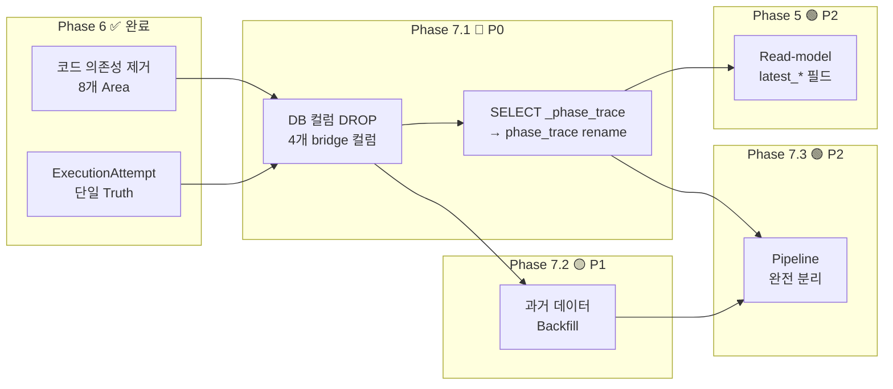
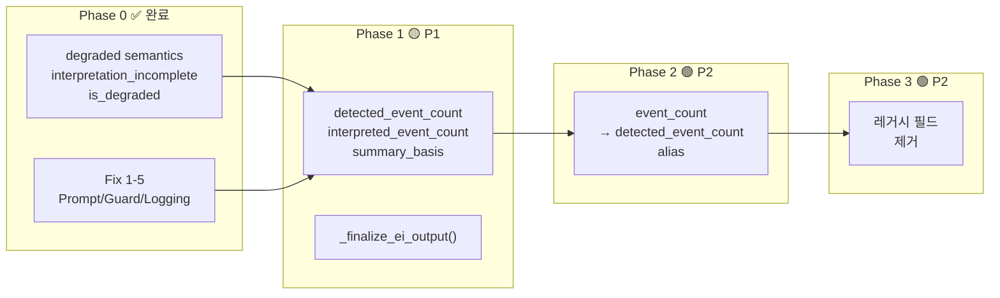
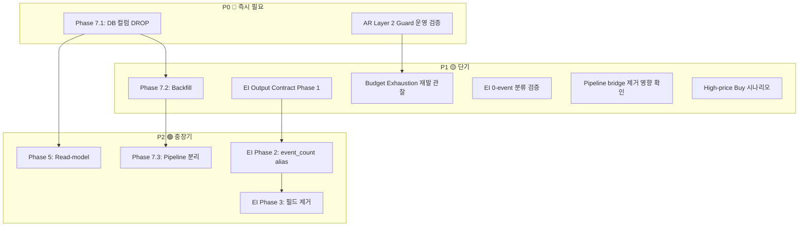
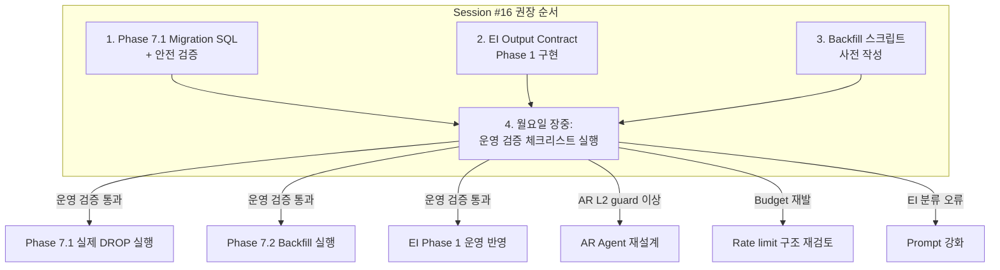

# 전체 리팩토링 남은 과제 통합 체크리스트

> **기준 시점**: 2026-05-23 (토)  
> **마지막 세션**: Session #15 (Phase 6 Bridge Dependency Reduction 완료)  
> **작성 목적**: 다음 세션 시작 시 이 문서 하나만 보면 전체 상황 파악 및 즉시 작업 시작 가능

---

## 목차

1. [이미 완료된 핵심 축 요약 (3개 축)](#1-이미-완료된-핵심-축-요약-3개-축)
2. [남은 과제 목록 — Execution 축](#2-남은-과제-목록--execution-축)
3. [남은 과제 목록 — KIS Sync 축](#3-남은-과제-목록--kis-sync-축)
4. [남은 과제 목록 — EI 축](#4-남은-과제-목록--ei-축)
5. [남은 과제 목록 — 운영 검증 대기](#5-남은-과제-목록--운영-검증-대기)
6. [우선순위 / 선행조건 / 완료 기준 종합](#6-우선순위--선행조건--완료-기준-종합)
7. [지금 바로 할 일 vs 운영 검증 후 할 일](#7-지금-바로-할-일-vs-운영-검증-후-할-일)
8. [다음 세션 추천 시작점](#8-다음-세션-추천-시작점)

---

## 1. 이미 완료된 핵심 축 요약 (3개 축)

### 1.1 Execution 축 — ✅ 완료 항목

| 작업 | 상태 | 비고 |
|------|------|------|
| `ExecutionAttemptEntity` 승격 및 API reader 전환 | ✅ 완료 | [`TradeDecisionEntity`](src/agent_trading/domain/entities.py:194) → [`ExecutionAttemptEntity`](src/agent_trading/domain/entities.py:520) truth 전환 |
| Pipeline 분리 준비 (Phase 6: 8개 Area bridge 의존성 제거) | ✅ 완료 | [`phase6_bridge_dependency_reduction_report`](plans/phase6_bridge_dependency_reduction_report_2026-05-23.md) |
| `pipeline_stop` 필드 Migration 0021 적용 | ✅ 완료 | [`db/migrations/0021_add_pipeline_stop_fields.sql`](db/migrations/0021_add_pipeline_stop_fields.sql) |
| PHASE_TRACE 로깅 표준화 | ✅ 완료 | [`decision_orchestrator.py`](src/agent_trading/services/decision_orchestrator.py) key-value 로깅 |
| Quote Resolution 캐싱/회로차단기 | ✅ 완료 | [`refactor_execution_phase_boundaries`](plans/refactor_execution_phase_boundaries_and_quote_resolution_observability_2026-05-22.md) |
| Budget Exhaustion 구조 개선 (cash 우선) | ✅ 완료 | [`fix_intraday_cash_snapshot_sync_budget_exhaustion`](plans/fix_intraday_cash_snapshot_sync_budget_exhaustion_2026-05-22.md) |

### 1.2 KIS Sync 축 — ✅ 완료 항목

| 작업 | 상태 | 비고 |
|------|------|------|
| Zero-out 방지 Gate + `fetch_status` 필드 | ✅ 완료 | [`kis_snapshot_sync.py`](src/agent_trading/services/kis_snapshot_sync.py) |
| Cadence 결합 감소 (Snapshot 분리, ScheduledTask 리팩토링, timeout 600s→300s) | ✅ 완료 | [`cadence_refactoring_plan`](plans/refactor_kis_snapshot_sync_cadence_to_reduce_scheduler_coupling_2026-05-22.md) |
| Cadence Trace 보정 (completed_at 실제 시간 반영, 4개 call site) | ✅ 완료 | [`cadence_trace_semantics`](plans/refine_cadence_trace_and_last_run_at_semantics_for_snapshot_and_decision_tasks_2026-05-22.md) |
| `decision_submit_gate` 들여쓰기 버그 수정 | ✅ 완료 | [`fix_decision_submit_gate`](plans/fix_decision_submit_gate_complete_scope_bug_in_cadence_trace_semantics_2026-05-22.md) |
| Budget Exhaustion 구조 개선 (cash positions 우선 처리) | ✅ 완료 | [`fix_intraday_cash_snapshot_sync_budget_exhaustion`](plans/fix_intraday_cash_snapshot_sync_budget_exhaustion_2026-05-22.md) |

### 1.3 EI 축 — ✅ 완료 항목

| 작업 | 상태 | 비고 |
|------|------|------|
| Fix 1-3: Prompt 강화 + Post-processing guard + Raw response 로깅 | ✅ 완료 | [`event_interpretation.py`](src/agent_trading/services/ai_agents/event_interpretation.py) |
| Fix 4: Exception fallback `input_event_count` 보존 | ✅ 완료 | 동일 파일 |
| Fix 5: `_build_ei_summary()` 3-way 분기 | ✅ 완료 | [`decision_orchestrator.py`](src/agent_trading/services/decision_orchestrator.py) |
| P0 degraded semantics (`AggregateEventView.degraded`) | ✅ 완료 | [`ai_agents/schemas.py`](src/agent_trading/services/ai_agents/schemas.py) |

---

## 2. 남은 과제 목록 — Execution 축

### Phase 7.1: DB 컬럼 DROP Migration

| 항목 | 내용 |
|------|------|
| **상태** | ❌ 미착수 |
| **우선순위** | 🔴 **P0** |
| **선행조건** | Phase 6 코드 프로덕션 배포 완료 + 최소 1회 이상 정상 동작 확인 |
| **완료 기준** | 4개 bridge 컬럼이 DB에서 실제로 DROP되고, API/tests 정상 통과 |
| **운영 검증 필요** | **Y** — DROP 후 롤백 불가, 장중보다는 장 마감 후 실행 권장 |
| **관련 문서/파일** | [`phase6_bridge_dependency_reduction_report`](plans/phase6_bridge_dependency_reduction_report_2026-05-23.md#71-db-컬럼-drop-migration) |

**상세**:

```sql
-- 예정 migration: db/migrations/0026_drop_bridge_columns_from_trade_decisions.sql
ALTER TABLE trading.trade_decisions
    DROP COLUMN IF EXISTS pipeline_stop_phase,
    DROP COLUMN IF EXISTS pipeline_stop_reason,
    DROP COLUMN IF EXISTS pipeline_stopped_at,
    DROP COLUMN IF EXISTS phase_trace;
```

**DQ 체크리스트**:
- [ ] Phase 6 코드가 운영에 배포되었는가? (`docker compose ps`로 컨테이너 재시작 확인)
- [ ] `GET /trade-decisions` 응답에서 bridge 필드 3개가 없는가?
- [ ] `GET /trade-decisions` 응답에서 `phase_trace`가 `execution_attempts` 출처로 정상 노출되는가?
- [ ] DB `execution_attempts` 테이블에 최근 레코드가 존재하는가? (backfill 필요 여부 판단)
- [ ] DROP SQL dry-run (SELECT만으로 컬럼 존재 확인)
- [ ] DROP 실행 후 API 응답 재검증

---

### Phase 7.2: 과거 데이터 Backfill (execution_attempts)

| 항목 | 내용 |
|------|------|
| **상태** | ❌ 미착수 |
| **우선순위** | 🟡 **P1** |
| **선행조건** | Phase 7.1 컬럼 DROP **이전**에 실행해야 함 (DROP 후 bridge 데이터 소실) |
| **완료 기준** | P3 이전 `trade_decisions` 레코드에 대응하는 `execution_attempts` 레코드가 존재 |
| **운영 검증 필요** | Y — backfill 후 phase_trace/execution_status 정상 표시 확인 |
| **관련 문서/파일** | [`phase6_bridge_dependency_reduction_report`](plans/phase6_bridge_dependency_reduction_report_2026-05-23.md#72-과거-데이터-backfill) |

**상세**:
- 대상: `execution_attempts` 테이블 생성 전(P3 이전)의 `trade_decisions` 행
- 기존 `trade_decisions.phase_trace` (bridge) 데이터를 읽어 `ExecutionAttemptEntity` 생성
- backfill 스크립트 위치: `scripts/backfill_execution_attempts_from_bridge.py` (신규 생성 필요)
- backfill 후에도 `latest_*` 필드가 정상 조회되는지 검증

---

### Phase 7.3: Pipeline 완전 분리 (Execution 독립 모듈)

| 항목 | 내용 |
|------|------|
| **상태** | ⚠️ 설계 완료, 미구현 |
| **우선순위** | 🟢 **P2** |
| **선행조건** | Phase 7.1 + 7.2 완료 |
| **완료 기준** | `TradeDecisionEntity`에서 execution 관련 참조 완전 제거, execution pipeline이 독립 서비스/모듈로 분리 |
| **운영 검증 필요** | N (단, 분리 후 E2E 테스트 필요) |
| **관련 문서/파일** | [`reduce_trade_decision_bridge_dependency`](plans/reduce_trade_decision_bridge_dependency_before_final_execution_pipeline_separation_2026-05-23.md) |

**상세**:
- 현재 `trade_decisions`와 `execution_attempts`는 `trade_decision_id` FK로 연결
- 장기적으로 execution pipeline을 완전히 독립된 서비스로 분리
- `ExecutionAttemptEntity`가 execution의 단일 진리 Source of Truth로 완전히 자리잡음
- Phase 5 Read-model과 연계 필요

---

### Phase 5: Read-model (5개 `latest_*` 필드 + LEFT JOIN LATERAL)

| 항목 | 내용 |
|------|------|
| **상태** | ⚠️ 설계 완료, 미구현 |
| **우선순위** | 🟢 **P2** |
| **선행조건** | Phase 7.1 완료 (컬럼 DROP 후 `_phase_trace` alias → `phase_trace` rename) |
| **완료 기준** | Phase 5 read-model이 정식 도입되어 API 응답의 execution 필드가 read-model 기반으로 변경 |
| **운영 검증 필요** | N |
| **관련 문서/파일** | [`refactor_p0_starter_pack`](plans/refactor_p0_starter_pack_for_execution_sync_and_ei_contract_2026-05-22.md) |

---

**Execution 축 전체 의존성 흐름**:



---

## 3. 남은 과제 목록 — KIS Sync 축

### AR Layer 2 Guard 운영 검증

| 항목 | 내용 |
|------|------|
| **상태** | ⚠️ 운영 검증 대기 (코드 배포 완료, 실제 AR run 미실행) |
| **우선순위** | 🔴 **P0** |
| **선행조건** | 장중 AR Agent 정상 기동 상태여야 함 |
| **완료 기준** | 아래 검증 항목 3가지가 모두 통과 |
| **운영 검증 필요** | **Y** — 운영 환경에서만 검증 가능 (AR run 존재 필요) |
| **관련 문서/파일** | [`session_15_briefing.md`](plans/session_15_briefing.md#-priority-0-ar-layer-2-guard-운영-검증-pending) |

**검증 항목**:
1. AR이 `opinion=reject` 또는 `size_adjustment_factor < 1`을 정상 출력하는가
2. AR output이 `RiskLevel.L2` 분기 ([`decision_orchestrator.py`](src/agent_trading/services/decision_orchestrator.py) Guardrail Phase 2)를 정상 타는가
3. AR reject 시에도 `FDC decision != REJECT`인 경우 backend가 정상 차단하는가 (backend가 최종 차단)

**검증 방법**:
- `logs/` 디렉토리 또는 DB `agent_run` 테이블에서 실제 AR run 확인
- AR output에 `size_adjustment_factor` 필드 존재 여부 확인
- `decision_orchestrator.py` Guardrail Phase 2 로그 확인

---

### High-price Buy 시나리오 (sub-10 quantity)

| 항목 | 내용 |
|------|------|
| **상태** | ⚠️ 미검증 (코드 구현 완료, 실제 고가주 매수 미발생) |
| **우선순위** | 🟡 **P1** |
| **선행조건** | 장중 고가주 매수 결정 발생 필요 |
| **완료 기준** | 고가 `reference_price`가 `orderable_amount` 대비 과도한 케이스에서 MARKET order 정상 체결 확인 |
| **운영 검증 필요** | **Y** |
| **관련 문서/파일** | [`session_15_briefing.md`](plans/session_15_briefing.md#-priority-0-ar-layer-2-guard-운영-검증-pending) |

**상세**:
- `reference_price` 기반 MARKET order sizing (`_ALLOCATION_PCT = 0.2`)
- BUY 수량 공식: `floor(orderable_amount * 20% / effective_price)`
- `orderable_amount=500,000원`, `reference_price=1,200,000원` → `0주` → 1주 보정 시나리오 검증 필요
- 최소 1주 보정 로직이 MARKET order에서 실제 체결 가능한지 확인

---

## 4. 남은 과제 목록 — EI 축

### EI Output Contract Phase 1: `detected_event_count` / `interpreted_event_count` / `summary_basis` + `_finalize_ei_output()`

| 항목 | 내용 |
|------|------|
| **상태** | ⚠️ 설계 완료, 미구현 |
| **우선순위** | 🟡 **P1** |
| **선행조건** | 없음 (Phase 1은 현재 EI 구조 위에 추가 필드만 도입) |
| **완료 기준** | `AggregateEventView`에 `detected_event_count`, `interpreted_event_count`, `summary_basis` 필드 추가 + `_finalize_ei_output()` 메서드 구현 완료 |
| **운영 검증 필요** | Y — 실제 EI run에서 필드 정상 출력 확인 |
| **관련 문서/파일** | [`refactor_p0_starter_pack`](plans/refactor_p0_starter_pack_for_execution_sync_and_ei_contract_2026-05-22.md#4-ei-output-contract-1차-변경-내용) |

**상세 변경 사항**:

```python
# ai_agents/schemas.py - AggregateEventView 확장
detected_event_count: int = 0
"""LLM이 입력으로 받은 raw event 수 (input_event_count와 동일)"""
interpreted_event_count: int = 0
"""LLM이 실제로 해석/요약한 event 수 (0일 경우 interpretation_incomplete)"""
summary_basis: str = "full"
"""'full' | 'partial' | 'degraded' — 요약 기준"""
```

```python
# _finalize_ei_output() 메서드 (신규)
def _finalize_ei_output(output: EventInterpretationOutput) -> EventInterpretationOutput:
    """EI output의 일관성을 검증하고 summary_basis를 설정."""
    if output.is_degraded:
        output.summary_basis = "degraded"
    elif output.interpreted_event_count < output.detected_event_count:
        output.summary_basis = "partial"
    else:
        output.summary_basis = "full"
    return output
```

---

### EI Output Contract Phase 2: `event_count` → Alias

| 항목 | 내용 |
|------|------|
| **상태** | ❌ 미착수 |
| **우선순위** | 🟢 **P2** |
| **선행조건** | Phase 1 완료 |
| **완료 기준** | 기존 `event_count` 필드가 `detected_event_count`의 alias로 전환되고, 모든 consumer가 새 필드 사용 |
| **운영 검증 필요** | N |
| **관련 문서/파일** | [`refactor_p0_starter_pack`](plans/refactor_p0_starter_pack_for_execution_sync_and_ei_contract_2026-05-22.md) |

---

### EI Output Contract Phase 3: 필드 제거

| 항목 | 내용 |
|------|------|
| **상태** | ❌ 미착수 |
| **우선순위** | 🟢 **P2** |
| **선행조건** | Phase 2 완료 |
| **완료 기준** | 레거시 필드 `event_count`가 제거되고 Clean API 제공 |
| **운영 검증 필요** | N |
| **관련 문서/파일** | [`refactor_p0_starter_pack`](plans/refactor_p0_starter_pack_for_execution_sync_and_ei_contract_2026-05-22.md) |

---

**EI Output Contract 전체 로드맵**:



---

## 5. 남은 과제 목록 — 운영 검증 대기

> 주말 후(2026-05-25 월요일 장중) 반드시 확인해야 할 항목들.

### 5.1 AR Layer 2 Guard 운영 검증

| 항목 | 내용 |
|------|------|
| **검증 방법** | 장중 `logs/` 및 DB `agent_run` 테이블에서 AR run 확인 |
| **통과 기준** | (1) AR이 `opinion=reject` 또는 `size_adjustment_factor < 1` 출력 (2) `RiskLevel.L2` 분기 정상 동작 (3) backend 최종 차단 정상 |
| **실패 시 대응** | AR Agent 재설계 또는 Layer 2 guard 로직 점검 |
| **우선순위** | 🔴 **P0** |

### 5.2 High-price Buy 시나리오 검증

| 항목 | 내용 |
|------|------|
| **검증 방법** | 고가주 매수 결정 발생 시 MARKET order 체결 내역 확인 |
| **통과 기준** | sub-10 quantity MARKET order가 정상 체결 (또는 정상 거절) |
| **실패 시 대응** | `_resolve_buy_target_quantity()` 보정 로직 점검 |
| **우선순위** | 🟡 **P1** |

### 5.3 Budget Exhaustion 재발 여부 관찰

| 항목 | 내용 |
|------|------|
| **검증 방법** | 장중 scheduler 로그에서 `BudgetExhaustedError` 발생 여부 확인 |
| **통과 기준** | Budget exhaustion으로 인한 cash=0 저장 없음 |
| **실패 시 대응** | cash 우선 순서 + orderable_cash fallback 로직 재점검 |
| **우선순위** | 🟡 **P1** |

### 5.4 EI 0-event 분류 정확도 검증

| 항목 | 내용 |
|------|------|
| **검증 방법** | EI run 로그에서 `event_count=0` 케이스의 `interpretation_incomplete` 플래그 확인 |
| **통과 기준** | 실제 0-event와 self-contradiction(입력 이벤트 있음에도 0 반환)이 올바르게 구분됨 |
| **실패 시 대응** | EI prompt 보강 또는 post-processing guard 강화 |
| **우선순위** | 🟡 **P1** |

### 5.5 Pipeline Stop Bridge 필드 제거 후 영향 확인

| 항목 | 내용 |
|------|------|
| **검증 방법** | `GET /trade-decisions` 응답 확인 + API consumer 동작 확인 |
| **통과 기준** | bridge 필드 3개(`pipeline_stop_phase`, `pipeline_stop_reason`, `pipeline_stopped_at`)가 응답에 없고, `latest_*` 필드로 대체되어 정상 동작 |
| **실패 시 대응** | Admin UI consumer 업데이트 또는 `latest_*` fallback 추가 |
| **우선순위** | 🟡 **P1** |

---

## 6. 우선순위 / 선행조건 / 완료 기준 종합



### 종합 표

| 순위 | 작업 | 축 | 선행조건 | 운영 검증 | 예상 리스크 |
|------|------|-----|---------|-----------|-----------|
| **P0** | Phase 7.1: DB 컬럼 DROP | Execution | Phase 6 배포 완료 | Y | DROP 후 롤백 불가 |
| **P0** | AR Layer 2 Guard 운영 검증 | KIS Sync | 장중 AR run 존재 | Y | AR 미기동 시 검증 불가 |
| **P1** | Phase 7.2: Backfill | Execution | Phase 7.1 **선행** (DROP 전) | Y | 데이터 소실 위험 |
| **P1** | EI Output Contract Phase 1 | EI | 없음 | Y | 출력 계약 변경 |
| **P1** | Budget Exhaustion 재발 관찰 | KIS Sync | 장중 운영 | Y | 운영 데이터 필요 |
| **P1** | EI 0-event 분류 검증 | EI | 장중 EI run | Y | 실제 데이터 필요 |
| **P1** | Pipeline bridge 제거 영향 확인 | Execution | Phase 6 배포 완료 | Y | UI/API consumer 영향 |
| **P1** | High-price Buy 시나리오 | KIS Sync | 장중 고가주 매수 | Y | 조건부 발생 |
| **P2** | Phase 7.3: Pipeline 분리 | Execution | Phase 7.1+7.2 | N | 대규모 아키텍처 변경 |
| **P2** | Phase 5: Read-model | Execution | Phase 7.1 | N | 설계 변경 필요 |
| **P2** | EI Phase 2: event_count alias | EI | Phase 1 | N | 점진적 전환 |
| **P2** | EI Phase 3: 필드 제거 | EI | Phase 2 | N | Breaking change |

---

## 7. 지금 바로 할 일 vs 운영 검증 후 할 일

### 🟢 지금 바로 할 수 있는 일 (코드 작업, 주말 중 가능)

| 작업 | 이유 |
|------|------|
| **Phase 7.1: DB 컬럼 DROP Migration 파일 작성** | Migration SQL 파일(`0026_drop_bridge_columns.sql`) 작성, Dry-run 가능, 단 실제 DROP은 운영 검증 후 |
| **EI Output Contract Phase 1 구현** | `AggregateEventView` 필드 추가, `_finalize_ei_output()` 구현 — 현재 EI 구조 위에 추가만 하면 되므로 독립적 |
| **Backfill 스크립트 작성** | Phase 7.2 대비 스크립트(`scripts/backfill_execution_attempts_from_bridge.py`) 사전 작성 |
| **Phase 7.3 설계 구체화** | Pipeline 분리 아키텍처 설계 문서 작성 |

### 🔴 운영 검증 후에만 가능한 일 (월요일 장중 필요)

| 작업 | 이유 |
|------|------|
| **Phase 7.1 실제 DROP 실행** | DROP 전 Phase 6 코드가 운영에서 정상 동작 확인 필요 |
| **AR Layer 2 Guard 운영 검증** | AR run이 실제로 발생해야 검증 가능 |
| **High-price Buy 시나리오 검증** | 고가주 매수 결정이 실제로 발생해야 검증 가능 |
| **Budget Exhaustion 재발 관찰** | 장중 rate limit 동작 확인 필요 |
| **Phase 7.2 Backfill 실행** | DROP 전에 backfill 실행 필요, 실제 DB 데이터 대상 |

---

## 8. 다음 세션 추천 시작점

### 1순위: Phase 7.1 — DB 컬럼 DROP Migration 파일 작성 + 안전 검증

```bash
# 1. Migration SQL 파일 생성
touch db/migrations/0026_drop_bridge_columns_from_trade_decisions.sql

# 2. 내용 작성
# ALTER TABLE trading.trade_decisions
#     DROP COLUMN IF EXISTS pipeline_stop_phase,
#     DROP COLUMN IF EXISTS pipeline_stop_reason,
#     DROP COLUMN IF EXISTS pipeline_stopped_at,
#     DROP COLUMN IF EXISTS phase_trace;

# 3. Phase 6 운영 배포 확인
docker compose ps
docker compose logs app | grep "Phase 6"

# 4. API 응답 검증
curl -s http://localhost:8000/trade-decisions?limit=1 | python3 -m json.tool

# 5. DB dry-run (SELECT로 컬럼 존재 확인 후 DROP)
docker compose exec db psql -U trading -d trading -c "
SELECT column_name FROM information_schema.columns
WHERE table_schema='trading' AND table_name='trade_decisions'
AND column_name IN ('pipeline_stop_phase','pipeline_stop_reason','pipeline_stopped_at','phase_trace');
"
```

**참조 파일**:
- [`db/migrations/0021_add_pipeline_stop_fields.sql`](db/migrations/0021_add_pipeline_stop_fields.sql) — bridge 컬럼 생성 (역참조)
- [`db/migrations/0023_add_execution_attempts.sql`](db/migrations/0023_add_execution_attempts.sql) — execution_attempts 테이블 (truth)
- [`src/agent_trading/repositories/postgres/trade_decisions.py`](src/agent_trading/repositories/postgres/trade_decisions.py) — `_phase_trace` alias 사용 확인
- [`plans/phase6_bridge_dependency_reduction_report_2026-05-23.md`](plans/phase6_bridge_dependency_reduction_report_2026-05-23.md) — Phase 6 상세 보고서

---

### 2순위: EI Output Contract Phase 1 구현

**작업 파일**:
- [`src/agent_trading/services/ai_agents/schemas.py`](src/agent_trading/services/ai_agents/schemas.py) — `AggregateEventView` 필드 추가
- [`src/agent_trading/services/ai_agents/event_interpretation.py`](src/agent_trading/services/ai_agents/event_interpretation.py) — `_finalize_ei_output()` 구현
- [`tests/services/ai_agents/test_event_interpretation.py`](tests/services/ai_agents/test_event_interpretation.py) — 신규 테스트 추가

**참조 설계 문서**:
- [`plans/refactor_p0_starter_pack_for_execution_sync_and_ei_contract_2026-05-22.md`](plans/refactor_p0_starter_pack_for_execution_sync_and_ei_contract_2026-05-22.md)

---

### 3순위: AR Layer 2 Guard 운영 검증 (월요일 장중)

**확인 명령어**:
```bash
# DB agent_run에서 AR run 확인
docker compose exec db psql -U trading -d trading -c "
SELECT ar.agent_run_id, ar.created_at, ar.output->>'opinion' as opinion,
       ar.output->>'size_adjustment_factor' as saf
FROM trading.agent_run ar
WHERE ar.agent_type = 'AR'
ORDER BY ar.created_at DESC
LIMIT 10;
"

# 로그에서 Layer 2 guard 확인
grep -i "L2\|layer_2\|size_adjustment" logs/near_real_scheduler_*.log | tail -20
```

**참조 파일**:
- [`src/agent_trading/services/decision_orchestrator.py`](src/agent_trading/services/decision_orchestrator.py) — Guardrail Phase 2 로직
- [`src/agent_trading/services/ai_agents/schemas.py`](src/agent_trading/services/ai_agents/schemas.py) — `RiskLevel` enum

---

### 전체 작업 관계도



---

> **문서 변경 이력**
> - 2026-05-23: 최초 작성, Phase 6 완료 기준
> - 다음 업데이트: Session #16 시작 시점
