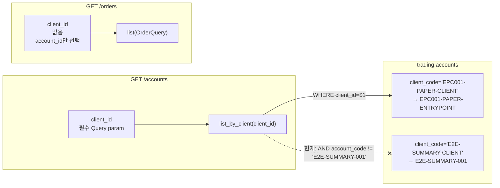
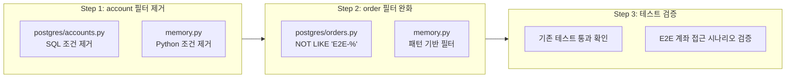

# 운영 계좌 자동 세팅: E2E 하드코딩 필터 제거 설계

## 1. 현황 분석

### E2E 하드코딩 필터 위치 (총 5곳)

| # | 파일 | 위치 | 내용 | 계층 |
|---|------|------|------|------|
| 1 | [`postgres/accounts.py:89`](src/agent_trading/repositories/postgres/accounts.py:89) | `list_by_client()` SQL | `AND account_code != 'E2E-SUMMARY-001'` | account |
| 2 | [`memory.py:107`](src/agent_trading/repositories/memory.py:107) | `list_by_client()` Python | `item.account_code != 'E2E-SUMMARY-001'` | account |
| 3 | [`postgres/orders.py:142`](src/agent_trading/repositories/postgres/orders.py:142) | `list()` SQL JOIN | `a.account_code != 'E2E-SUMMARY-001'` | order |
| 4 | [`memory.py:467`](src/agent_trading/repositories/memory.py:467) | `InMemoryOrderRepository.__init__()` | `_excluded_account_ids` 초기화 | order |
| 5 | [`memory.py:487`](src/agent_trading/repositories/memory.py:487) | `InMemoryOrderRepository.list()` | `item.account_id in self._excluded_account_ids` | order |

### API 호출 구조



### 핵심 발견

1. **`GET /accounts`는 `client_id`가 필수** → 운영 client_id로 호출 시 E2E 계좌는 절대 반환되지 않음
2. E2E(`E2E-SUMMARY-001`)와 운영(`EPC001-PAPER-ENTRYPOINT`)은 **서로 다른 client**에 속함
3. 따라서 `accounts.py`의 `list_by_client()` E2E 필터는 **완전히 중복 (redundant)**
4. **`GET /orders`는 `client_id`를 받지 않음** → `OrderQuery`에도 `client_id` 필드 없음 → E2E 주문이 운영 목록에 섞일 수 있어 orders.py의 E2E 필터는 **여전히 필요**

---

## 2. 방안 비교

### 방안 A: account E2E 필터 제거 + order E2E 필터 유지 (추천)

| 항목 | 내용 |
|------|------|
| **변경 파일** | 2곳 (postgres/accounts.py, memory.py — list_by_client만) |
| **위험도** | 🔵 매우 낮음 |
| **설명** | accounts.py의 list_by_client()에서 E2E 필터는 client_id 조건으로 이미 분리되므로 완전 중복. 제거해도 기능에 영향 없음. orders.py의 E2E 필터는 유지. |

### 방안 B: E2E 하드코딩 → 패턴 기반 필터 (E2E-%)

| 항목 | 내용 |
|------|------|
| **변경 파일** | 5곳 모두 |
| **위험도** | 🟢 낮음 |
| **설명** | `'E2E-SUMMARY-001'` → `'E2E-%'`로 변경. 새 E2E 계좌 추가 시 누락 위험 해소. |

### 방안 C: bootstrap 시 settings 기반 active 계좌 보정

| 항목 | 내용 |
|------|------|
| **변경 파일** | runtime/bootstrap.py, postgres/bootstrap.py 가능 |
| **위험도** | 🟡 중간 |
| **설명** | DB에 운영 계좌가 이미 존재하므로 자동 생성 불필요. bootstrap에서 할 일이 없음. |

### 방안 D: account_code를 settings 기반으로 필터링

| 항목 | 내용 |
|------|------|
| **변경 파일** | contracts.py, postgres/accounts.py, memory.py, filters.py, routes |
| **위험도** | 🔴 높음 |
| **설명** | repository가 settings에 의존하게 되어 DI 구조 변경 필요. 현재 문제를 해결하기에는 과도한 변경. |

---

## 3. 최종 선택: 방안 A + 방안 B 조합

### 결정 이유

1. **accounts.py의 E2E 필터는 완전히 중복**이므로 제거 (방안 A — 변경 0~2건)
2. **orders.py의 E2E 필터**는 client_id 기반 보호가 없으므로 유지하되 **패턴 기반으로 완화** (방안 B)
3. 방안 C는 운영 계좌가 이미 DB에 존재하므로 불필요
4. 방안 D는 과도한 구조 변경

### 상세 변경 명세

#### 3.1 [`repositories/postgres/accounts.py:89`](src/agent_trading/repositories/postgres/accounts.py:89) — list_by_client SQL 조건 제거

```python
# 변경 전
rows = await self._tx.connection.fetch(
    "SELECT * FROM trading.accounts WHERE client_id = $1 AND account_code != 'E2E-SUMMARY-001' ORDER BY account_alias",
    client_id,
)

# 변경 후
rows = await self._tx.connection.fetch(
    "SELECT * FROM trading.accounts WHERE client_id = $1 ORDER BY account_alias",
    client_id,
)
```

#### 3.2 [`repositories/memory.py:107`](src/agent_trading/repositories/memory.py:107) — list_by_client Python 조건 제거

```python
# 변경 전
return tuple(
    item for item in self._items.values()
    if item.client_id == client_id and item.account_code != 'E2E-SUMMARY-001'
)

# 변경 후
return tuple(
    item for item in self._items.values()
    if item.client_id == client_id
)
```

#### 3.3 [`repositories/postgres/orders.py:142`](src/agent_trading/repositories/postgres/orders.py:142) — 패턴 기반 필터로 변경

```python
# 변경 전
conditions.append("a.account_code != 'E2E-SUMMARY-001'")

# 변경 후
conditions.append("a.account_code NOT LIKE 'E2E-%'")
```

#### 3.4 [`repositories/memory.py:467,487`](src/agent_trading/repositories/memory.py:467) — 패턴 기반 필터로 변경

```python
# 변경 전 (__init__)
self._excluded_account_ids: set[UUID] = set()

# list() 내부
if item.account_id in self._excluded_account_ids:
    continue

# 변경 후 (__init__ — 제거, 불필요)
# self._excluded_account_ids 제거

# list() 내부 — account_code 직접 확인
# InMemoryOrderRepository에 account_code 저장 필요 또는
# 호출부에서 account_id → account_code 매핑 전달
```

**memory.py의 경우 더 복잡함** — `InMemoryOrderRepository`는 현재 `account_code`를 저장하지 않고 `account_id` 기반으로 필터링함. 따라서:

- `InMemoryOrderRepository`에 `_excluded_account_codes: set[str]` 도입
- `exclude_account()` 대신 `exclude_account_code(pattern)` 도입
- 실제 필터는 `account_code`가 아니라 `account_id` → `account_code` 매핑 필요

**간소화 방안**: `InMemoryOrderRepository`에 `_excluded_account_code_patterns: list[str]` 필드를 추가하고, `list()`에서 각 order의 account_id로 AccountEntity를 조회하여 account_code를 확인한 후 필터링. 또는 더 단순하게 `exclude_account()`에 account_code를 함께 저장.

### 변경 요약

| 파일 | 변경 전 | 변경 후 | 비고 |
|------|---------|---------|------|
| `postgres/accounts.py:89` | `AND account_code != 'E2E-SUMMARY-001'` | 조건 제거 | 중복 필터 |
| `memory.py:107` | `and item.account_code != 'E2E-SUMMARY-001'` | 조건 제거 | 중복 필터 |
| `postgres/orders.py:142` | `!= 'E2E-SUMMARY-001'` | `NOT LIKE 'E2E-%'` | 패턴 기반 |
| `memory.py:467,487` | `_excluded_account_ids` set | 패턴 기반 필터로 대체 | 상세 설계 필요 |

---

## 4. 테스트 영향

### 영향 받는 테스트

1. **`tests/repositories/test_accounts.py`** — `list_by_client()`에서 E2E 필터 제거로 인한 기대값 변화 확인 필요
   - E2E 계좌를 추가하고 `list_by_client(operating_client_id)` 호출 시 E2E 계좌가 제외되는지 검증하던 테스트가 있다면 제거 필요
   - 반대로, E2E client_id로 조회 시 E2E 계좌가 반환되는지 확인하는 테스트가 있다면 그대로 통과

2. **`tests/repositories/test_postgres_broker_accounts.py`** — 영향 없음

3. **E2E 통합 테스트** (`tests/integration/test_long_path_e2e.py`, `test_orchestrator_entrypoint.py`)
   - E2E 테스트가 하드코딩 필터에 의존하고 있다면 영향 받을 수 있음
   - 단, E2E 테스트는 자체 client_id로 조회하므로 영향 없음

### 테스트 변경 없이 통과 가능
- `list_by_client()`에 client_id를 전달하므로, E2E client_id가 아닌 운영 client_id로 조회하면 E2E 계좌가 반환되지 않음 (DB 레벨 분리)
- orders.py의 패턴 기반 필터는 기존과 동등한 결과 (`E2E-SUMMARY-001`만 존재하는 상황)

---

## 5. 마이그레이션 순서



---

## 6. 리스크 및 고려사항

### 저위험 항목
- ✅ `GET /accounts?client_id=<운영 client_id>` — E2E 계좌 절대 미포함 (DB상 다른 client)
- ✅ `GET /accounts/{E2E_UUID}` — 단일 계좌 조회는 E2E 필터가 없었으므로 영향 없음
- ✅ `GET /orders?account_id=<운영 account_id>` — E2E 주문 미포함

### 주의사항
- ⚠️ `POST /orders` 또는 다른 쓰기 작업이 E2E 계좌를 참조하는지 확인 필요 (설계 범위 외)
- ⚠️ `InMemoryOrderRepository`의 변경은 테스트 코드에도 영향 줄 수 있으므로, 테스트 픽스처에서 `exclude_account()` 호출을 `exclude_account_code()`로 변경 필요

### 제외된 방안
- **방안 C (bootstrap 계좌 생성)** — 운영 계좌가 이미 DB에 존재하므로 불필요
- **방안 D (settings 기반 필터링)** — repository와 settings의 결합도 증가로 인한 유지보수 비용 > 이점
