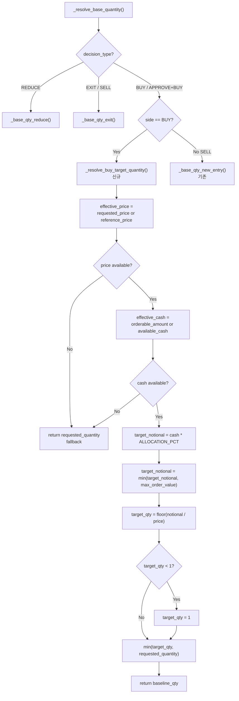
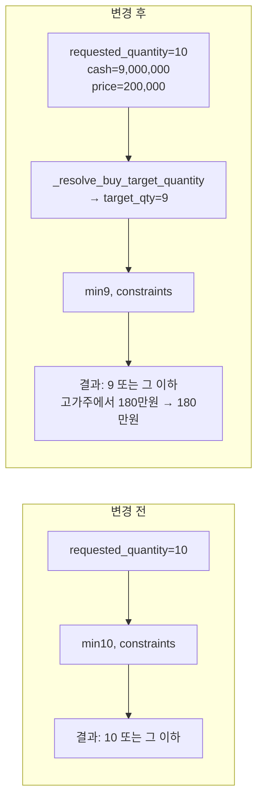

# BUY Baseline 계산 방식 설계 — `_resolve_buy_target_quantity()` 도입

> **작성일**: 2026-05-21  
> **관련 분석**: [`analyze_buy_baseline_10_share_hardcoding_and_sub_10_quantities_2026-05-21.md`](plans/analyze_buy_baseline_10_share_hardcoding_and_sub_10_quantities_2026-05-21.md)  
> **이전 설계 (User Request 13)**: [`remove_fixed_10_share_order_quantity_and_enable_reference_price_based_market_order_sizing_2026-05-21.md`](plans/remove_fixed_10_share_order_quantity_and_enable_reference_price_based_market_order_sizing_2026-05-21.md)  
> **수정 대상**: [`sizing_engine.py`](src/agent_trading/services/sizing_engine.py)  
> **수정 불필요**: [`run_paper_decision_loop.py`](scripts/run_paper_decision_loop.py), [`decision_orchestrator.py`](src/agent_trading/services/decision_orchestrator.py)  
> **테스트 파일**: [`test_sizing_engine.py`](tests/services/test_sizing_engine.py)

---

## 1. 현재 동작 분석

### 1.1 문제: `_resolve_base_quantity()`가 `requested_quantity`를 그대로 반환

현재 [`_resolve_base_quantity()`](src/agent_trading/services/sizing_engine.py:243)는 BUY 경로에서 [`_base_qty_new_entry()`](src/agent_trading/services/sizing_engine.py:200)를 호출한다:

```python
def _base_qty_new_entry(inputs: SizingInputs) -> Decimal:
    base = inputs.requested_quantity   # ← caller가 정한 값(10)을 그대로 사용
    return _apply_ai_size_hint(base, inputs.sizing_hint)
```

`inputs.requested_quantity`는 [`run_paper_decision_loop.py:738`](scripts/run_paper_decision_loop.py:738)에서 `quantity=Decimal("10")`으로 하드코딩되어 전달된다. AI sizing hint가 없으면 `requested_quantity`가 그대로 baseline이 된다.

### 1.2 Constraint 체인이 "시작 수량"을 계산하지 못하는 이유

[`calculate_sizing()`](src/agent_trading/services/sizing_engine.py:461)의 모든 constraint 함수는 `min(qty, limit)` 형태로 **기존 수량을 줄이기만** 한다:

```python
# Step 1 & 2: base qty
qty = _resolve_base_quantity(inputs)   # ← 10 (고정)

# Step 3: max order value
qty = _apply_max_order_value(qty, ...)  # min(10, max_value/price)

# Step 4: qty bounds
qty = _apply_qty_bounds(qty, ...)       # min(10, max_order_qty)

# Step 5: cash availability (BUY only)
qty = _apply_cash_constraint(qty, ...)  # min(10, cash/price)

# Step 6: position concentration
qty = _apply_concentration_constraint(...)  # min(10, remaining/price)
```

**핵심 통찰**: `_apply_cash_constraint()`는 `cash/price`가 `requested_quantity`보다 작을 때만 수량을 줄인다. 고가주(SK하이닉스 200,000원)에서 10주 = 200만원이고, orderable_amount=900만원이면 `max_qty_by_cash = 9,000,000 * 0.95 / 200,000 = 42`이므로 `min(10, 42) = 10` — cash constraint를 통과해버린다.

### 1.3 User Request 13 이후 현재 상태

User Request 13 ([`remove_fixed_10_share_order_quantity_and_enable_reference_price_based_market_order_sizing_2026-05-21.md`](plans/remove_fixed_10_share_order_quantity_and_enable_reference_price_based_market_order_sizing_2026-05-21.md))에서 다음이 이미 구현됨:

- [`SizingInputs.reference_price`](src/agent_trading/services/sizing_engine.py:66) 필드 — MARKET 주문용 sizing 기준 가격
- [`_apply_cash_constraint()`](src/agent_trading/services/sizing_engine.py:276) — `reference_price` 파라미터 + fallback + safety_factor 0.95
- [`_apply_concentration_constraint()`](src/agent_trading/services/sizing_engine.py:340) — `reference_price` 파라미터 + fallback
- [`_apply_max_order_value()`](src/agent_trading/services/sizing_engine.py:423) — `reference_price` 파라미터 + fallback
- [`calculate_sizing()`](src/agent_trading/services/sizing_engine.py:461) — 모든 constraint 호출에 `reference_price` 전달

**하지만 `_resolve_base_quantity()`의 BUY baseline 계산은 여전히 `requested_quantity`를 그대로 반환한다.** 즉, constraint 함수들은 MARKET 주문에서도 동작하게 되었지만, 시작 수량 자체가 10으로 고정된 문제는 해결되지 않았다.

---

## 2. Option C 상세 설계

### 2.1 변경 개요

[`_resolve_buy_target_quantity()`](src/agent_trading/services/sizing_engine.py) 신규 메서드를 추가하고, [`_resolve_base_quantity()`](src/agent_trading/services/sizing_engine.py:243)의 BUY 분기를 이 메서드로 연결한다.

### 2.2 `_resolve_base_quantity()` 분기 수정

```python
def _resolve_base_quantity(inputs: SizingInputs) -> Decimal:
    dt = inputs.decision_type
    side = inputs.side

    # Non-actionable → zero
    if dt in _SKIP_DECISION_TYPES:
        return Decimal("0")

    if dt == "REDUCE":
        return _base_qty_reduce(inputs)

    if dt == "EXIT":
        return _base_qty_exit(inputs)

    # SELL without REDUCE/EXIT → treat as full exit
    if dt == "SELL" or (dt == "APPROVE" and side == OrderSide.SELL):
        return _base_qty_exit(inputs)

    # ── BUY or APPROVE + BUY → new entry ──
    if side == OrderSide.BUY:
        return _resolve_buy_target_quantity(inputs)  # ← NEW: BUY 전용 baseline 계산

    return _base_qty_new_entry(inputs)
```

**변경점**: 기존 `return _base_qty_new_entry(inputs)` 대신 `side == OrderSide.BUY` 조건 분기 추가. SELL 경로는 기존과 동일하게 `_base_qty_exit()` 유지.

### 2.3 `_resolve_buy_target_quantity()` 신규 메서드

```python
def _resolve_buy_target_quantity(inputs: SizingInputs) -> Decimal:
    """BUY 주문의 합리적인 시작 수량을 계산한다.

    전략:
    1. effective_price 결정: requested_price → reference_price 순서
    2. effective_cash 결정: orderable_amount → available_cash 순서
    3. target_notional = effective_cash * ALLOCATION_PCT
    4. max_order_value가 있으면 target_notional 상한 적용
    5. target_qty = floor(target_notional / effective_price)
    6. 최소 1주 보장
    7. requested_quantity를 절대 상한으로 사용

    price/cash 정보가 없으면 requested_quantity 그대로 반환 (fallback).
    """
```

#### 2.3.1 `ALLOCATION_PCT` 상수 정의 위치

모듈 수준 상수로 [`sizing_engine.py`](src/agent_trading/services/sizing_engine.py)에 추가:

```python
# 모듈 상수 영역 (기존 _SKIP_DECISION_TYPES 근처, line 156)
_ALLOCATION_PCT: Decimal = Decimal("0.2")  # 20% — 1회 BUY 주문에 할당할 현금 비율
```

**이유**:
- config-driven으로 전환할 수 있도록 모듈 상수로 정의
- 향후 `SizingInputs`에 `allocation_pct` 필드를 추가하거나 config에서 읽도록 확장 가능
- 20% 기본값은 실전 경험에 기반: 고가주에서 10주를 넘지 않으면서 저가주에서 충분한 수량 확보 가능

#### 2.3.2 `effective_price` 결정 로직

```python
# requested_price 우선, 없으면 reference_price fallback
effective_price = inputs.requested_price if (
    inputs.requested_price is not None and inputs.requested_price > 0
) else inputs.reference_price

# 가격 정보가 전혀 없으면 fallback
if effective_price is None or effective_price <= 0:
    return inputs.requested_quantity
```

**우선순위**:
1. `inputs.requested_price` — LIMIT 주문의 지정가
2. `inputs.reference_price` — MARKET 주문의 live quote 기준가
3. 둘 다 `None` → `requested_quantity` 그대로 반환 (fallback)

#### 2.3.3 `effective_cash` 결정 로직

```python
# orderable_amount 우선, 없으면 available_cash fallback
effective_cash: Decimal | None = None
if inputs.orderable_amount is not None:
    effective_cash = inputs.orderable_amount
elif inputs.available_cash is not None:
    effective_cash = inputs.available_cash

# 현금 정보가 전혀 없으면 fallback
if effective_cash is None or effective_cash <= 0:
    return inputs.requested_quantity
```

**우선순위**:
1. `inputs.orderable_amount` (KIS `ord_psbl_amt`) — broker의 실제 주문 가능 금액
2. `inputs.available_cash` (KIS `dnca_tot_amt`) — fallback
3. 둘 다 `None` → `requested_quantity` 그대로 반환 (fallback)

**`orderable_amount=0` 처리**: `effective_cash <= 0` 조건으로 0을 걸러내며, 이 경우 `_apply_cash_constraint()`에서 다시 한번 `orderable_amount=0 → 0주` 처리됨.

#### 2.3.4 Target notional 계산 및 최종 수량 결정

```python
ALLOCATION_PCT = _ALLOCATION_PCT  # Decimal("0.2")
target_notional = effective_cash * ALLOCATION_PCT

# max_order_value가 있으면 상한 적용
if inputs.max_order_value is not None and inputs.max_order_value > 0:
    target_notional = min(target_notional, inputs.max_order_value)

# target_qty 계산 (floor)
target_qty = (target_notional / effective_price).to_integral_value(rounding=ROUND_DOWN)

# 최소 1주 보장
if target_qty < 1:
    target_qty = Decimal("1")

# requested_quantity를 절대 상한으로 사용
return min(target_qty, inputs.requested_quantity)
```

**설계 의사결정**:

| 항목 | 결정 | 이유 |
|------|------|------|
| `target_notional = cash * ALLOCATION_PCT` | 할당 비율 기반 | 현금 대비 적정 비율로 1회 주문 크기 제한 |
| `floor(target_notional / price)` | 절삭(floor) | ceiling 사용 시 예산 초과 가능 |
| `min(target_qty, requested_quantity)` | requested_quantity 상한 유지 | AI/caller 의도 존중 |
| 최소 1주 보장 | `target_qty < 1 → 1` | 고가주에서 1주라도 매수 가능하도록 |
| `min_cash_buffer_pct` 미적용 | `_apply_cash_constraint()`에서 처리 | 역할 중복 방지, baseline은 순수 할당 비율만 |
| `safety_factor 0.95` 미적용 | `_apply_cash_constraint()`에서 처리 | MARKET 주문 slippage buffer는 최종 제약에서 처리 |

### 2.4 전체 pseudocode

```python
# ── 모듈 상수 영역 (기존 _SKIP_DECISION_TYPES 근처, line 156) ──
_ALLOCATION_PCT: Decimal = Decimal("0.2")  # 20% — 1회 BUY 주문 할당 비율


# ── 신규 메서드 (기존 _base_qty_new_entry 근처, line 200 이후) ──
def _resolve_buy_target_quantity(inputs: SizingInputs) -> Decimal:
    """BUY 주문의 합리적인 시작 수량을 계산한다.

    cash * ALLOCATION_PCT를 1회 주문의 target notional으로 설정하고,
    price로 나누어 target_qty를 산출한다. requested_quantity를 절대
    상한으로 유지한다.
    """
    # 1. effective_price 결정
    effective_price = inputs.requested_price if (
        inputs.requested_price is not None and inputs.requested_price > 0
    ) else inputs.reference_price
    if effective_price is None or effective_price <= 0:
        return inputs.requested_quantity  # fallback

    # 2. effective_cash 결정
    effective_cash: Decimal | None = None
    if inputs.orderable_amount is not None:
        effective_cash = inputs.orderable_amount
    elif inputs.available_cash is not None:
        effective_cash = inputs.available_cash
    if effective_cash is None or effective_cash <= 0:
        return inputs.requested_quantity  # fallback

    # 3. target notional 계산
    target_notional = effective_cash * _ALLOCATION_PCT

    # 4. max_order_value 상한 적용
    if inputs.max_order_value is not None and inputs.max_order_value > 0:
        target_notional = min(target_notional, inputs.max_order_value)

    # 5. target_qty 산출 (floor)
    target_qty = (target_notional / effective_price).to_integral_value(rounding=ROUND_DOWN)

    # 6. 최소 1주 보장
    if target_qty < 1:
        target_qty = Decimal("1")

    # 7. requested_quantity 상한 적용
    return min(target_qty, inputs.requested_quantity)
```

### 2.5 예시 계산표

가정: `orderable_amount = 9,000,000`, `ALLOCATION_PCT = 0.2`, `requested_quantity = 10`

| 종목 | 가격 | target_notional | target_qty | 최종 (min) | 주문금액 |
|------|------|----------------|-----------|-----------|---------|
| SK하이닉스 | 200,000 | 1,800,000 | 1,800,000/200,000 = **9** | min(9, 10) = **9** | 1,800,000 |
| 두산 | 150,000 | 1,800,000 | 1,800,000/150,000 = **12** | min(12, 10) = **10** | 1,500,000 |
| 삼성전자 | 80,000 | 1,800,000 | 1,800,000/80,000 = **22** | min(22, 10) = **10** | 800,000 |
| 저가주A | 5,000 | 1,800,000 | 1,800,000/5,000 = **360** | min(360, 10) = **10** | 50,000 |
| 저가주B | 1,000 | 1,800,000 | 1,800,000/1,000 = **1800** | min(1800, 10) = **10** | 10,000 |

**관찰**:
- 고가주(200,000원): 9주로 줄어듦 (10주 → 9주, 180만원)
- 중가주(150,000원): target_qty=12지만 requested_quantity=10으로 cap → 10주 유지
- 저가주: target_qty가 매우 크지만 requested_quantity=10으로 cap → 10주 유지
- **`requested_quantity`가 자연스러운 상한으로 작용**

---

## 3. 변경 범위

### 3.1 수정 파일

| 파일 | 변경 내용 | 라인 수 |
|------|---------|---------|
| [`sizing_engine.py`](src/agent_trading/services/sizing_engine.py) | `_ALLOCATION_PCT` 상수 추가 (line 156 근처) | +1 |
| [`sizing_engine.py`](src/agent_trading/services/sizing_engine.py) | `_resolve_buy_target_quantity()` 신규 메서드 추가 | ~+30 |
| [`sizing_engine.py`](src/agent_trading/services/sizing_engine.py) | `_resolve_base_quantity()` BUY 분기 수정 (line 267-268) | ~+4 |
| [`test_sizing_engine.py`](tests/services/test_sizing_engine.py) | BUY baseline 테스트 케이스 추가 | ~+100 |

### 3.2 변경하지 않는 파일

| 파일 | 이유 |
|------|------|
| [`run_paper_decision_loop.py`](scripts/run_paper_decision_loop.py) | `quantity=Decimal("10")` 하드코딩은 그대로 둠. sizing engine이 baseline을 계산하므로 영향 없음 |
| [`decision_orchestrator.py`](src/agent_trading/services/decision_orchestrator.py) | `_build_sizing_inputs()`는 `requested_quantity` 전달만 함. 신규 메서드는 `SizingInputs` 필드만 사용하므로 수정 불필요 |
| [`_apply_cash_constraint()`](src/agent_trading/services/sizing_engine.py:276) | 이미 `reference_price` fallback 구현됨. 추가 수정 불필요 |
| [`_apply_concentration_constraint()`](src/agent_trading/services/sizing_engine.py:340) | 이미 `reference_price` fallback 구현됨. 추가 수정 불필요 |
| [`_apply_max_order_value()`](src/agent_trading/services/sizing_engine.py:423) | 이미 `reference_price` fallback 구현됨. 추가 수정 불필요 |

### 3.3 Calculate_sizing() 영향도

[`calculate_sizing()`](src/agent_trading/services/sizing_engine.py:461) 파이프라인 자체는 변경되지 않는다. `_resolve_base_quantity()`의 반환값만 달라질 뿐, 이후 constraint 체인은 동일하게 적용된다.

```
변경 전: _resolve_base_quantity() → 10 → min(10, constraints) → 결과
변경 후: _resolve_base_quantity() → target_qty → min(target_qty, constraints) → 결과
```

따라서 `_apply_cash_constraint()`와 `_resolve_buy_target_quantity()`가 중복되는 것처럼 보일 수 있지만, 역할이 다르다:
- `_resolve_buy_target_quantity()`: **시작 수량**을 합리적인 값으로 설정
- `_apply_cash_constraint()`: **최종 제약** — 현금 부족 시 추가로 cap

---

## 4. SELL 경로 영향도 분석

**변경 없음. Position-aware 기존 로직 유지.**

| SELL 경로 | 현재 구현 | 변경 후 | 영향 |
|-----------|---------|---------|------|
| `_resolve_base_quantity()` SELL 분기 | `_base_qty_exit(inputs)` → `current_position_qty` or `requested_quantity` | **동일** | 없음 |
| `_apply_cash_constraint()` | `inputs.side == OrderSide.BUY` 조건으로 SELL skip | **동일** | 없음 |
| `_apply_concentration_constraint()` | 포지션 집중도 계산 | **동일** | 없음 |
| `_apply_max_order_value()` | max_order_value cap | **동일** | 없음 |

**이유**: SELL은 포지션 기반으로 수량이 결정된다. `EXIT`는 전량 매도, `REDUCE`는 현재 포지션의 일부 감소. 현금이 필요하지 않으므로 cash 기반 할당 로직이 필요 없다.

---

## 5. LIMIT 주문 영향도 분석

LIMIT 주문은 `inputs.requested_price`가 설정되어 있다. `_resolve_buy_target_quantity()`의 `effective_price` 로직:

```python
effective_price = inputs.requested_price if (
    inputs.requested_price is not None and inputs.requested_price > 0
) else inputs.reference_price
```

LIMIT 주문에서는 `requested_price`가 우선 사용되므로, `reference_price`와 무관하게 동작한다.

**예시**: LIMIT BUY, `requested_price=195,000`, `reference_price=200,000`, `orderable_amount=9,000,000`
- `effective_price = 195,000` (requested_price 우선)
- `target_notional = 9,000,000 * 0.2 = 1,800,000`
- `target_qty = floor(1,800,000 / 195,000) = 9`
- 최종 = `min(9, 10) = 9`

**결론**: LIMIT 주문에서도 동일한 할당 로직이 적용되며, `requested_price`가 기준 가격으로 사용된다.

---

## 6. MARKET 주문 + reference_price 영향도 분석

MARKET 주문은 `inputs.requested_price = None`이므로, `_resolve_buy_target_quantity()`는 `inputs.reference_price`를 사용한다.

```python
# requested_price가 None이므로 reference_price가 effective_price가 됨
effective_price = inputs.reference_price  # (requested_price is None → False 조건)
```

**예시**: MARKET BUY, `requested_price=None`, `reference_price=200,000`, `orderable_amount=9,000,000`
- `effective_price = 200,000` (reference_price fallback)
- `target_notional = 9,000,000 * 0.2 = 1,800,000`
- `target_qty = floor(1,800,000 / 200,000) = 9`
- 최종 = `min(9, 10) = 9`

**reference_price fallback 흐름**:
```
reference_price=None인 경우 (quote 조회 실패 등):
  → _resolve_buy_target_quantity()에서 effective_price=None 감지
  → inputs.requested_quantity 반환 (기존 동작 유지)
```

**safety_factor 0.95는 어디서 적용되나?**
- `_resolve_buy_target_quantity()`에서는 적용하지 않음 (baseline 계산이므로)
- `_apply_cash_constraint()`에서 MARKET 주문 한정으로 `effective_cash * 0.95` 적용
- 즉, baseline은 순수 할당 비율 기반, 최종 cash constraint에서 slippage buffer 적용

---

## 7. 예외 케이스

### 7.1 price=None, reference_price=None

```python
# effective_price = None (both None)
# → return inputs.requested_quantity (fallback)
```

**결과**: `requested_quantity = 10` 그대로 반환. 기존 동작과 동일.

**영향**: 가격 정보가 전혀 없는 MARKET 주문에서 baseline은 10주. 이후 `_apply_cash_constraint()`도 `effective_price=None`으로 skip되므로, constraint 없이 10주 전달됨. **User Request 13 이전과 동일한 동작.**

### 7.2 orderable_amount=None, available_cash=None

```python
# effective_cash = None (both None)
# → return inputs.requested_quantity (fallback)
```

**결과**: `requested_quantity = 10` 그대로 반환. 기존 동작과 동일.

**영향**: 현금 정보가 없으면 할당 로직을 건너뛰고 `requested_quantity`를 그대로 사용.

### 7.3 target_qty < 1

```python
# target_qty = 0 (very high price, small cash)
# → target_qty = Decimal("1")
```

**예시**: `orderable_amount=1,000,000`, `reference_price=2,000,000,000` (20억원)
- `target_notional = 1,000,000 * 0.2 = 200,000`
- `target_qty = floor(200,000 / 2,000,000,000) = 0`
- → `target_qty = 1`
- 최종 = `min(1, 10) = 1`

**결과**: 1주 주문. 이후 `_apply_cash_constraint()`에서 현금 부족 시 0으로 줄어들 수 있음.

### 7.4 orderable_amount=0

```python
# effective_cash = 0
# effective_cash <= 0 → return inputs.requested_quantity
```

**결과**: `requested_quantity = 10` 반환. 하지만 이후 `_apply_cash_constraint()`에서 `orderable_amount=0` 감지 → `return Decimal("0")`.

**영향**: `_resolve_buy_target_quantity()`는 fallback하고, 최종 cash constraint에서 0으로 처리. 안전하게 동작.

### 7.5 예외 케이스 요약

| 시나리오 | `_resolve_buy_target_quantity()` | 이후 constraint | 최종 결과 |
|----------|--------------------------------|----------------|-----------|
| price=None, ref_price=None | fallback → requested_qty | cash constraint skip (effective_price=None) | requested_qty |
| orderable=None, cash=None | fallback → requested_qty | cash constraint skip (cash=None) | requested_qty |
| target_qty < 1 | 1주 보장 | cash constraint에서 줄어들 수 있음 | ≥ 0 |
| orderable_amount=0 | fallback → requested_qty | cash constraint → 0 | 0 |
| 정상 (price+cash 모두 있음) | target_qty 계산 | cash constraint에서 추가 cap 가능 | target_qty 또는 그 이하 |

---

## 8. 테스트 계획

### 8.1 신규 테스트 케이스 (`test_sizing_engine.py`에 추가)

#### Test 1: BUY + cash + price → 합리적인 target_qty 계산 (고가주)

```python
def test_buy_baseline_high_price_capped_by_allocation(self) -> None:
    """BUY: orderable_amount=9,000,000, reference_price=200,000
    → target_notional = 9M * 0.2 = 1.8M
    → target_qty = floor(1.8M / 200K) = 9
    → min(9, 10) = 9"""
    result = calculate_sizing(_inputs(
        decision_type="BUY",
        side=OrderSide.BUY,
        requested_quantity="10",
        requested_price=None,
        reference_price="200000",
        orderable_amount="9000000",
    ))
    assert result.quantity == Decimal("9")
```

#### Test 2: BUY + cash + price → target_qty > requested_quantity → capped

```python
def test_buy_baseline_low_price_capped_by_requested(self) -> None:
    """BUY: orderable_amount=9,000,000, reference_price=5,000
    → target_notional = 9M * 0.2 = 1.8M
    → target_qty = floor(1.8M / 5K) = 360
    → min(360, 10) = 10 (requested_quantity 상한)"""
    result = calculate_sizing(_inputs(
        decision_type="BUY",
        side=OrderSide.BUY,
        requested_quantity="10",
        requested_price=None,
        reference_price="5000",
        orderable_amount="9000000",
    ))
    assert result.quantity == Decimal("10")
```

#### Test 3: BUY + cash 없음 → fallback to requested_quantity

```python
def test_buy_baseline_no_cash_fallback(self) -> None:
    """BUY: orderable_amount=None, available_cash=None
    → fallback → requested_quantity 그대로"""
    result = calculate_sizing(_inputs(
        decision_type="BUY",
        side=OrderSide.BUY,
        requested_quantity="10",
        requested_price=None,
        reference_price="200000",
        orderable_amount=None,
        available_cash=None,
    ))
    assert result.quantity == Decimal("10")
```

#### Test 4: BUY + price 없음 → fallback to requested_quantity

```python
def test_buy_baseline_no_price_fallback(self) -> None:
    """BUY: requested_price=None, reference_price=None
    → fallback → requested_quantity 그대로"""
    result = calculate_sizing(_inputs(
        decision_type="BUY",
        side=OrderSide.BUY,
        requested_quantity="10",
        requested_price=None,
        reference_price=None,
        orderable_amount="9000000",
    ))
    assert result.quantity == Decimal("10")
```

#### Test 5: BUY + LIMIT price → requested_price 기준 계산

```python
def test_buy_baseline_limit_price_used(self) -> None:
    """BUY LIMIT: requested_price=195000, reference_price=200000
    → effective_price = 195000 (requested_price 우선)
    → target_qty = floor(1.8M / 195K) = 9"""
    result = calculate_sizing(_inputs(
        decision_type="BUY",
        side=OrderSide.BUY,
        requested_quantity="10",
        requested_price="195000",
        reference_price="200000",
        orderable_amount="9000000",
    ))
    assert result.quantity == Decimal("9")
```

#### Test 6: BUY + max_order_value 적용

```python
def test_buy_baseline_max_order_value(self) -> None:
    """BUY: orderable_amount=9,000,000, max_order_value=1,000,000
    → target_notional = min(1.8M, 1M) = 1M
    → target_qty = floor(1M / 200K) = 5"""
    result = calculate_sizing(_inputs(
        decision_type="BUY",
        side=OrderSide.BUY,
        requested_quantity="10",
        requested_price=None,
        reference_price="200000",
        orderable_amount="9000000",
        max_order_value="1000000",
    ))
    assert result.quantity == Decimal("5")
```

#### Test 7: BUY + target_qty < 1 → 최소 1주 보장

```python
def test_buy_baseline_min_one_share(self) -> None:
    """BUY: target_qty < 1 → 최소 1주 보장"""
    result = calculate_sizing(_inputs(
        decision_type="BUY",
        side=OrderSide.BUY,
        requested_quantity="10",
        requested_price=None,
        reference_price="200000",
        orderable_amount="10000",  # 매우 작은 현금
    ))
    # target_notional = 10000 * 0.2 = 2000
    # target_qty = floor(2000 / 200000) = 0 → 1
    # min(1, 10) = 1
    assert result.quantity == Decimal("1")
```

#### Test 8: BUY + orderable_amount=0 → cash constraint가 0으로 처리

```python
def test_buy_baseline_zero_orderable_amount(self) -> None:
    """BUY: orderable_amount=0
    → _resolve_buy_target_quantity() fallback to requested_qty=10
    → _apply_cash_constraint() → orderable_amount=0 → 0"""
    result = calculate_sizing(_inputs(
        decision_type="BUY",
        side=OrderSide.BUY,
        requested_quantity="10",
        requested_price=None,
        reference_price="200000",
        orderable_amount="0",
    ))
    assert result.quantity == Decimal("0")
    assert "orderable_amount_zero" in result.applied_constraints
```

### 8.2 테스트 케이스 요약

| # | 테스트명 | 시나리오 | 예상 결과 |
|---|---------|---------|----------|
| 1 | `test_buy_baseline_high_price_capped_by_allocation` | 고가주 20만원, 현금 900만 | **9** |
| 2 | `test_buy_baseline_low_price_capped_by_requested` | 저가주 5천원, 현금 900만 | **10** (requested 상한) |
| 3 | `test_buy_baseline_no_cash_fallback` | 현금 정보 없음 | **10** (fallback) |
| 4 | `test_buy_baseline_no_price_fallback` | 가격 정보 없음 | **10** (fallback) |
| 5 | `test_buy_baseline_limit_price_used` | LIMIT 지정가 195,000 | **9** |
| 6 | `test_buy_baseline_max_order_value` | max_order_value=100만 | **5** |
| 7 | `test_buy_baseline_min_one_share` | target_qty < 1 | **1** (최소 보장) |
| 8 | `test_buy_baseline_zero_orderable_amount` | orderable_amount=0 | **0** (cash constraint) |

### 8.3 회귀 테스트

기존 테스트 70+개가 모두 통과해야 함:

```bash
pytest tests/services/test_sizing_engine.py -v
```

**영향 받을 수 있는 기존 테스트**:

| 테스트 | 현재 | 변경 후 예상 | 영향 |
|--------|------|-------------|------|
| [`test_buy_pass_through`](tests/services/test_sizing_engine.py:108) | requested=100 → qty=100 | cash=None → fallback → qty=100 | **없음** |
| [`test_cash_shortage_caps_qty`](tests/services/test_sizing_engine.py:132) | cash=500, price=10 → qty=50 | cash=500, alloc=20%→ target=100, cash constr.=50 → **50** | **없음** |
| [`test_market_buy_cash_constraint_with_reference_price`](tests/services/test_sizing_engine.py:1151) | ref_price=60000, cash=9M → qty=142 | alloc=20%→ target_qty=30, cash constr.=142 → **30** | **변경** (baseline 30) |

**`test_market_buy_cash_constraint_with_reference_price`** 테스트는 기대값을 142에서 30으로 변경해야 함. 이유: `_resolve_buy_target_quantity()`가 target_qty=30(`9M * 0.2 / 60,000 = 30`)을 baseline으로 설정하고, `_apply_cash_constraint()`에서 `min(30, 142) = 30`이 되므로 최종 수량이 30으로 줄어듦.

---

## 9. 운영 검증 계획

### 9.1 Docker smoke test 시나리오

#### 사전 조건
- paper trading 환경에서 실행
- `run_paper_decision_loop.py`가 `quantity=Decimal("10")`으로 호출
- sizing engine이 BUY 주문의 baseline을 계산

#### 시나리오 1: 고가주 BUY MARKET 주문

```
1. 에이전트가 SK하이닉스(200,000원) BUY 결정
2. SubmitOrderRequest(quantity=10, price=None)
3. assemble_and_submit() Phase 1.5:
   - quote 조회 → reference_price=200,000
   - calculate_sizing():
     a. _resolve_base_quantity() → _resolve_buy_target_quantity()
        → target_notional = orderable_amount * 0.2
        → target_qty = floor(notional / 200,000)
        → min(target_qty, 10)
     b. _apply_cash_constraint() → slippage buffer 0.95 적용
     c. 기타 constraint 적용
4. SizingResult.quantity 확인 (9주 예상)
```

**검증 항목**:
- [ ] BUY MARKET 주문에서 10주가 아닌 9주로 줄어드는지 확인
- [ ] `applied_constraints`에 `"buy_target_quantity"`와 같은 신규 constraint 레이블이 없음 (기존 constraint만)
- [ ] `_apply_cash_constraint()`가 여전히 최종 안전장치로 동작

#### 시나리오 2: 저가주 BUY MARKET 주문

```
1. 에이전트가 저가주(5,000원) BUY 결정
2. SubmitOrderRequest(quantity=10, price=None)
3. calculate_sizing():
   → target_qty = floor(1.8M / 5,000) = 360
   → min(360, 10) = 10 (requested_quantity 상한)
4. 최종 수량 = 10주 (변경 없음)
```

**검증 항목**:
- [ ] 저가주에서 requested_quantity=10이 상한으로 작용하여 10주 유지

#### 시나리오 3: quote 조회 실패 시 fallback

```
1. broker.get_quote() 실패 → reference_price=None
2. calculate_sizing():
   → effective_price=None → fallback to requested_quantity=10
3. cash constraint도 effective_price=None으로 skip
4. 최종 수량 = 10주 (기존 동작)
```

**검증 항목**:
- [ ] 가격 정보 없을 때 requested_quantity 그대로 사용
- [ ] 로그에 fallback 메시지 출력

#### 시나리오 4: LIMIT BUY 주문

```
1. 에이전트가 LIMIT BUY, requested_price=195,000
2. calculate_sizing():
   → effective_price = 195,000 (requested_price 우선)
   → target_qty = floor(1.8M / 195,000) = 9
   → min(9, 10) = 9
3. 최종 수량 = 9주 (또는 cash constraint에 따라 더 줄어듦)
```

**검증 항목**:
- [ ] LIMIT 주문에서도 할당 로직이 적용됨
- [ ] `requested_price`가 기준 가격으로 사용됨

### 9.2 Pre-flight 체크리스트

- [ ] 기존 테스트 전부 통과 (`make test`)
- [ ] 신규 8개 테스트 통과
- [ ] SELL 주문에서 `_resolve_buy_target_quantity()` 미호출 확인
- [ ] `requested_price`가 있는 LIMIT 주문에서 `reference_price`가 아닌 `requested_price` 기준 계산
- [ ] price/cash 정보 없을 때 fallback 동작 확인
- [ ] dry-run 로그에서 BUY baseline 계산 결과 확인

### 9.3 Dry-run 명령어

```bash
python3 -m scripts.run_paper_decision_loop --count 1 --dry-run
```

로그에서 확인할 패턴:
```
Sizing Phase 1.5: request_qty=10 sizing_qty=9 applied_constraints=("cash_limit",) skip_reason=none
```

---

## 10. Mermaid 다이어그램

### 10.1 변경된 `_resolve_base_quantity()` 데이터 흐름



### 10.2 변경 전/후 비교



---

## 11. 제약 조건 및 주의사항

1. **`ALLOCATION_PCT=0.2`는 기본값**: 향후 config-driven으로 전환 가능. 예를 들어 `SizingInputs.allocation_pct` 필드를 추가하거나 `execution.allocation_pct` config 값을 읽도록 확장 가능.
2. **`_resolve_buy_target_quantity()`와 `_apply_cash_constraint()` 중복**: 의도적임. baseline 계산과 최종 제약의 역할이 다르며, 중복되어도 안전함 (둘 다 `min()` 연산이므로).
3. **`min_cash_buffer_pct` 미적용**: baseline 계산에서는 cash buffer를 적용하지 않음. 최종 `_apply_cash_constraint()`에서 buffer가 적용되므로, buffer가 필요한 경우 최종 수량이 더 줄어들 수 있음.
4. **`safety_factor=0.95` 미적용**: baseline 계산에서는 safety factor를 적용하지 않음. 최종 `_apply_cash_constraint()`에서 MARKET 주문 한정으로 적용.
5. **`_apply_cash_constraint()`와의 상호작용**: `_resolve_buy_target_quantity()`가 cash * 0.2로 baseline을 낮추고, `_apply_cash_constraint()`가 cash * 0.95 * (1-buffer)로 최종 cap을 적용. 두 constraint가 순차적으로 적용되어 안전하게 동작.

---

## 12. 변경 요약

### 수정 1: [`_ALLOCATION_PCT`](src/agent_trading/services/sizing_engine.py) 모듈 상수 추가

```python
# 기존 _SKIP_DECISION_TYPES 근처 (line 156)
_ALLOCATION_PCT: Decimal = Decimal("0.2")
```

### 수정 2: [`_resolve_buy_target_quantity()`](src/agent_trading/services/sizing_engine.py) 신규 메서드 추가

`_base_qty_new_entry()` 근처 (line 200 이후)에 추가.

### 수정 3: [`_resolve_base_quantity()`](src/agent_trading/services/sizing_engine.py:267-268) BUY 분기 수정

```python
# 변경 전
return _base_qty_new_entry(inputs)

# 변경 후
if side == OrderSide.BUY:
    return _resolve_buy_target_quantity(inputs)
return _base_qty_new_entry(inputs)
```

### 총 변경 라인 수: ~35라인 (sizing_engine.py)
