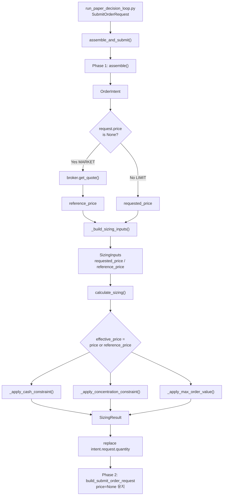
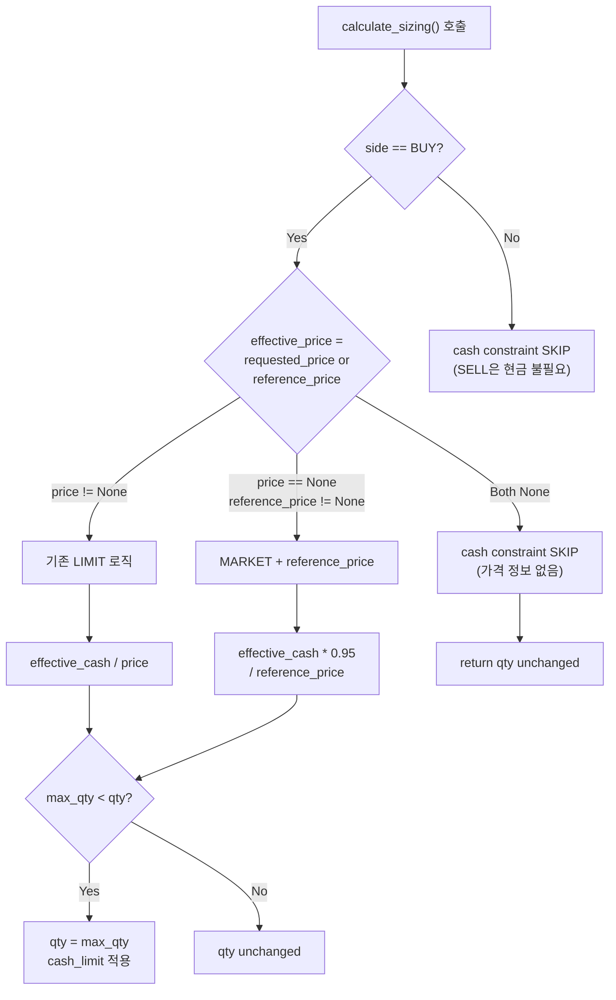

# Reference Price 기반 MARKET 주문 Sizing 설계

> **작성일**: 2026-05-21  
> **관련 분석**: [`analyze_fixed_10_share_market_order_sizing_root_cause_2026-05-21.md`](/workspace/agent_trading/plans/analyze_fixed_10_share_market_order_sizing_root_cause_2026-05-21.md)  
> **수정 대상**: [`sizing_engine.py`](/workspace/agent_trading/src/agent_trading/services/sizing_engine.py), [`decision_orchestrator.py`](/workspace/agent_trading/src/agent_trading/services/decision_orchestrator.py)  
> **테스트 파일**: [`test_sizing_engine.py`](/workspace/agent_trading/tests/services/test_sizing_engine.py), [`test_decision_orchestrator.py`](/workspace/agent_trading/tests/services/test_decision_orchestrator.py)

---

## 1. 문제 정의

### 1.1 Root Cause Chain

```
run_paper_decision_loop.py:738
  └─ SubmitOrderRequest(quantity=Decimal("10"), price=None)  ← 하드코딩
       └─ decision_orchestrator.py assemble_and_submit() Phase 1.5
            └─ _build_sizing_inputs(intent) → SizingInputs(requested_price=None)
                 └─ calculate_sizing(sizing_inputs)
                      ├─ _apply_cash_constraint()      → price=None → SKIP (line 289)
                      ├─ _apply_concentration_constraint() → price=None → SKIP (line 336)
                      └─ _apply_max_order_value()      → price=None → SKIP (line 411)
                           └─ 결과: _resolve_base_quantity()가 requested_quantity=10을 그대로 반환 → 항상 10주
```

### 1.2 영향

- **BUY MARKET 주문**: 예수금(`orderable_amount`/`available_cash`)과 무관하게 항상 10주 제출
- **Concentration limit**: 포트폴리오 집중도 제한이 MARKET 주문에서 무력화됨
- **Max order value**: MARKET 주문에서 주문 가치 상한이 적용되지 않음
- **실제 위험**: 예수금이 100만원인데 1억원짜리 종목을 10주 매수 시도 가능

---

## 2. 변경 설계

### 2.1 변경 원칙

1. **제출 가격과 수량 계산용 가격 분리**: 주문은 계속 MARKET + `price=None`으로 제출, sizing에만 `reference_price` 사용
2. **최소 변경**: [`sizing_engine.py`](/workspace/agent_trading/src/agent_trading/services/sizing_engine.py)와 [`decision_orchestrator.py`](/workspace/agent_trading/src/agent_trading/services/decision_orchestrator.py)만 수정
3. **BUY/SELL 분리**: BUY만 cash constraint 적용, SELL은 position 기반 유지
4. **회귀 금지**: 기존 테스트 전부 통과 (`make test`)

### 2.2 변경 상세

#### Change 1: [`SizingInputs`](/workspace/agent_trading/src/agent_trading/services/sizing_engine.py:43)에 `reference_price` 필드 추가

```python
@dataclass(slots=True, frozen=True)
class SizingInputs:
    ...
    requested_price: Decimal | None = None
    reference_price: Decimal | None = None  # NEW: MARKET 주문용 sizing 기준 가격
    ...
```

- 기본값 `None` → 기존 호출자(LIMIT 주문, SELL 등)에 영향 없음
- [`_inputs()`](/workspace/agent_trading/tests/services/test_sizing_engine.py:43) 헬퍼에도 `reference_price` 파라미터 추가

#### Change 2: [`calculate_sizing()`](/workspace/agent_trading/src/agent_trading/services/sizing_engine.py:433)에서 constraint 호출 시 `reference_price` 전달

```python
# ── Step 3: max order value ──
qty = _apply_max_order_value(
    qty, inputs.requested_price, inputs.max_order_value, constraints,
    reference_price=inputs.reference_price,  # NEW
)

# ── Step 5: cash availability (BUY only) ──
if inputs.side == OrderSide.BUY:
    qty = _apply_cash_constraint(
        qty,
        inputs.requested_price,
        inputs.available_cash,
        inputs.min_cash_buffer_pct,
        constraints,
        orderable_amount=inputs.orderable_amount,
        reference_price=inputs.reference_price,  # NEW
    )

# ── Step 6: position concentration ──
qty = _apply_concentration_constraint(
    qty,
    inputs.requested_price,
    inputs.current_position_qty,
    inputs.current_position_avg_price,
    inputs.nav,
    inputs.max_single_position_pct,
    constraints,
    reference_price=inputs.reference_price,  # NEW
)
```

#### Change 3: [`_apply_cash_constraint()`](/workspace/agent_trading/src/agent_trading/services/sizing_engine.py:270) 수정

```python
def _apply_cash_constraint(
    qty: Decimal,
    price: Decimal | None,
    available_cash: Decimal | None,
    min_cash_buffer_pct: Decimal | None,
    constraints: list[str],
    orderable_amount: Decimal | None = None,
    reference_price: Decimal | None = None,  # NEW
) -> Decimal:
    # Use reference_price as fallback when price is None (MARKET orders)
    effective_price = price if (price is not None and price > 0) else reference_price
    if effective_price is None or effective_price <= 0:
        return qty

    # ── Determine effective cash source ──
    if orderable_amount is not None:
        if orderable_amount <= 0:
            constraints.append("orderable_amount_zero")
            logger.info("BUY blocked: orderable_amount=%s <= 0", orderable_amount)
            return Decimal("0")
        effective_cash = orderable_amount
    elif available_cash is not None:
        logger.info(
            "orderable_amount=None, falling back to available_cash=%s",
            available_cash,
        )
        effective_cash = available_cash
    else:
        return qty

    # Apply min_cash_buffer_pct
    if min_cash_buffer_pct is not None and min_cash_buffer_pct > 0:
        effective_cash = effective_cash * (Decimal("1") - min_cash_buffer_pct / Decimal("100"))

    # Apply safety factor for reference_price-based sizing (MARKET orders)
    # 5% buffer for price slippage between quote and execution
    if price is None and reference_price is not None and reference_price > 0:
        effective_cash = (effective_cash * Decimal("0.95")).to_integral_value(rounding=ROUND_DOWN)

    max_qty_by_cash = (effective_cash / effective_price).to_integral_value(rounding=ROUND_DOWN)
    if max_qty_by_cash < qty:
        constraints.append("cash_limit")
        return max_qty_by_cash
    return qty
```

**변경 요점**:
- 시그니처에 `reference_price: Decimal | None = None` 추가
- `effective_price = price or reference_price` fallback
- MARKET 주문(`price is None and reference_price is not None`)에 한해 `safety_factor=0.95` 추가 적용
- 나머지 로직(소스 우선순위, buffer pct, max 계산)은 동일

#### Change 4: [`_apply_concentration_constraint()`](/workspace/agent_trading/src/agent_trading/services/sizing_engine.py:322) 수정

```python
def _apply_concentration_constraint(
    qty: Decimal,
    price: Decimal | None,
    current_position_qty: Decimal | None,
    current_position_avg_price: Decimal | None,
    nav: Decimal | None,
    max_single_position_pct: Decimal | None,
    constraints: list[str],
    reference_price: Decimal | None = None,  # NEW
) -> Decimal:
    effective_price = price if (price is not None and price > 0) else reference_price
    if (
        nav is None
        or nav <= 0
        or max_single_position_pct is None
        or max_single_position_pct <= 0
        or effective_price is None
        or effective_price <= 0
    ):
        return qty

    max_position_value = nav * max_single_position_pct / Decimal("100")

    current_value = Decimal("0")
    if current_position_qty is not None and current_position_avg_price is not None:
        current_value = current_position_qty * current_position_avg_price

    remaining_capacity = max_position_value - current_value
    if remaining_capacity <= 0:
        constraints.append("position_concentration")
        logger.info(
            "Sizing concentration constraint activated: "
            "nav=%s max_pct=%s max_position_value=%s "
            "current_value=%s remaining_capacity=%s "
            "price=%s req_qty=%s max_addl_qty=0 final_qty=0",
            nav, max_single_position_pct, max_position_value,
            current_value, remaining_capacity,
            effective_price, qty,
        )
        return Decimal("0")

    max_additional_qty = (remaining_capacity / effective_price).to_integral_value(rounding=ROUND_DOWN)
    # ... (나머지 동일)
```

**변경 요점**: 
- 시그니처에 `reference_price` 추가
- `effective_price = price or reference_price` fallback
- 로깅 메시지에 `effective_price` 사용 (price가 None일 수 있으므로)

#### Change 5: [`_apply_max_order_value()`](/workspace/agent_trading/src/agent_trading/services/sizing_engine.py:400) 수정

```python
def _apply_max_order_value(
    qty: Decimal,
    price: Decimal | None,
    max_order_value: Decimal | None,
    constraints: list[str],
    reference_price: Decimal | None = None,  # NEW
) -> Decimal:
    effective_price = price if (price is not None and price > 0) else reference_price
    if max_order_value is None or max_order_value <= 0 or effective_price is None or effective_price <= 0:
        return qty

    current_value = effective_price * qty
    if current_value > max_order_value:
        constraints.append("max_order_value")
        return (max_order_value / effective_price).to_integral_value(rounding=ROUND_DOWN)
    return qty
```

#### Change 6: [`SizingResult.max_order_value`](/workspace/agent_trading/src/agent_trading/services/sizing_engine.py:521-524) 계산에 `reference_price` fallback

```python
# ── Calculate max order value ──
max_order_value: Decimal | None = None
effective_price = inputs.requested_price or inputs.reference_price
if effective_price is not None and qty > 0:
    max_order_value = effective_price * qty
```

#### Change 7: [`_build_sizing_inputs()`](/workspace/agent_trading/src/agent_trading/services/decision_orchestrator.py:1456)에 `reference_price` 파라미터 추가

```python
def _build_sizing_inputs(
    self,
    intent: OrderIntent,
    reference_price: Decimal | None = None,  # NEW
) -> SizingInputs:
    ...
    return SizingInputs(
        decision_type=ai.decision_type,
        side=req.side,
        requested_quantity=req.quantity,
        requested_price=req.price,
        reference_price=reference_price,  # NEW
        sizing_hint=ai.sizing_hint,
        current_position_qty=pos_qty,
        current_position_avg_price=pos_avg_price,
        available_cash=available_cash,
        orderable_amount=orderable_amount,
        nav=nav,
        max_single_position_pct=max_single_position_pct,
        min_cash_buffer_pct=min_cash_buffer_pct,
        max_order_value=max_order_value,
        min_order_qty=_decimal_or_none(execution.get("min_order_qty")),
        max_order_qty=_decimal_or_none(execution.get("max_order_qty")),
    )
```

#### Change 8: [`assemble_and_submit()`](/workspace/agent_trading/src/agent_trading/services/decision_orchestrator.py:880) Phase 1.5에서 quote 기반 `reference_price` 해석

```python
# ── Phase 1.5: deterministic sizing engine ──
logger.info(
    "Phase 1.5: sizing engine — decision_type=%s side=%s quantity=%s",
    intent.ai_backend_inputs.decision_type,
    intent.request.side,
    intent.request.quantity,
)

# Resolve reference_price for MARKET orders from live quote
reference_price: Decimal | None = None
if intent.request.price is None:
    try:
        quote = await broker.get_quote(intent.request.symbol, intent.request.market)
        # Priority: last > ask > bid
        if quote.last is not None and quote.last > 0:
            reference_price = quote.last
        elif quote.ask is not None and quote.ask > 0:
            reference_price = quote.ask
        elif quote.bid is not None and quote.bid > 0:
            reference_price = quote.bid
        if reference_price is not None:
            logger.info(
                "Phase 1.5: resolved reference_price=%s from quote "
                "(last=%s ask=%s bid=%s) for symbol=%s MARKET order",
                reference_price, quote.last, quote.ask, quote.bid,
                intent.request.symbol,
            )
    except Exception:
        logger.warning(
            "Phase 1.5: failed to resolve reference_price from broker quote "
            "for symbol=%s — cash constraint will be skipped",
            intent.request.symbol,
            exc_info=True,
        )

sizing_inputs = self._build_sizing_inputs(intent, reference_price=reference_price)
sizing_result = calculate_sizing(sizing_inputs)
```

---

## 3. BUY/SELL 수량 계산 정책

### 3.1 BUY (신규 진입)

| 단계 | 정책 | 구현 |
|------|------|------|
| Base quantity | `requested_quantity` (AI hint 적용) | `_base_qty_new_entry()` |
| Cash constraint | `effective_cash = orderable_amount or available_cash` | `_apply_cash_constraint()` |
| Cash buffer | `min_cash_buffer_pct` 적용 (config) | 동일 |
| Slippage buffer | `safety_factor = 0.95` (MARKET only) | `price is None and reference_price is not None` 조건 |
| Max quantity | `floor(effective_cash / effective_price)` | `(effective_cash / effective_price).to_integral_value(ROUND_DOWN)` |
| Concentration | `(NAV × max_pct - current_value) / price` | `_apply_concentration_constraint()` |
| Max order value | `max_order_value / price`로 cap | `_apply_max_order_value()` |
| 최소 보장 | `min_order_qty` 미만이면 skip | `_apply_qty_bounds()` |

**수식**:
```
effective_cash = orderable_amount ?? available_cash
if min_cash_buffer_pct: effective_cash *= (1 - min_cash_buffer_pct/100)
if MARKET: effective_cash *= 0.95
max_qty = floor(effective_cash / effective_price)
final_qty = min(requested_qty, max_qty, concentration_limit, max_order_qty)
if final_qty < min_order_qty: skip
```

### 3.2 SELL (포지션 기반)

| 단계 | 정책 | 구현 |
|------|------|------|
| EXIT | 전량 매도 = `current_position_qty` | `_base_qty_exit()` |
| REDUCE | `current_position_qty × (1 - factor)` or `requested_quantity` | `_base_qty_reduce()` |
| Cash constraint | **미적용** (SELL은 현금 불필요) | `inputs.side == OrderSide.BUY` 조건 |
| Concentration | SELL에도 적용 (매도 후 집중도 감소) | `_apply_concentration_constraint()` |
| Position unknown | `requested_quantity` fallback | `_base_qty_exit()` / `_base_qty_reduce()` |
| Fallback (0 qty) | `assemble_and_submit()`에서 `intent.request.quantity` fallback | line 988-998 |

---

## 4. 변경 파일 목록과 영향도

### 4.1 수정 파일

| # | 파일 | 변경 사항 | 라인 수 |
|---|------|----------|---------|
| 1 | [`sizing_engine.py`](/workspace/agent_trading/src/agent_trading/services/sizing_engine.py) | `SizingInputs.reference_price` 필드 추가 | +1 |
| 2 | [`sizing_engine.py`](/workspace/agent_trading/src/agent_trading/services/sizing_engine.py) | `_apply_cash_constraint()` `reference_price` 파라미터 + fallback + safety_factor | ~+10 |
| 3 | [`sizing_engine.py`](/workspace/agent_trading/src/agent_trading/services/sizing_engine.py) | `_apply_concentration_constraint()` `reference_price` 파라미터 + fallback | ~+5 |
| 4 | [`sizing_engine.py`](/workspace/agent_trading/src/agent_trading/services/sizing_engine.py) | `_apply_max_order_value()` `reference_price` 파라미터 + fallback | ~+5 |
| 5 | [`sizing_engine.py`](/workspace/agent_trading/src/agent_trading/services/sizing_engine.py) | `calculate_sizing()`에서 3개 constraint 호출 시 `reference_price` 전달 | ~+5 |
| 6 | [`sizing_engine.py`](/workspace/agent_trading/src/agent_trading/services/sizing_engine.py) | `SizingResult.max_order_value` 계산에 `reference_price` fallback | ~+2 |
| 7 | [`decision_orchestrator.py`](/workspace/agent_trading/src/agent_trading/services/decision_orchestrator.py) | `_build_sizing_inputs()` `reference_price` 파라미터 추가 및 전달 | ~+3 |
| 8 | [`decision_orchestrator.py`](/workspace/agent_trading/src/agent_trading/services/decision_orchestrator.py) | `assemble_and_submit()` Phase 1.5에서 quote 조회 + `reference_price` 전달 | ~+25 |

### 4.2 영향 받는 호출자

| 호출자 | 영향 | 비고 |
|--------|------|------|
| `assemble_and_submit()` | `_build_sizing_inputs()`에 `reference_price` 전달 | 직접 수정 |
| `assemble()` | 영향 없음 (호출 안 함) | `_build_sizing_inputs()` 호출 안 함 |
| `test_sizing_engine.py` | `_inputs()` 헬퍼에 `reference_price` 추가 | 테스트만 추가 |
| `test_decision_orchestrator.py` | `_build_sizing_inputs()` 테스트에 영향 없음 | 기본값 None 유지 |
| `test_decision_submit_pipeline.py` | 영향 없음 | 기본값 None 유지 |

### 4.3 회귀 위험 없는 이유

1. `reference_price` 기본값 `None` → 기존 호출과 완전히 동일한 동작
2. 모든 constraint 함수의 fallback 로직 (`effective_price = price or reference_price`)은 `price`가 `None`이 아니면 기존과 동일
3. `safety_factor=0.95`는 `price is None and reference_price is not None`일 때만 적용

---

## 5. 테스트 계획

### 5.1 기존 테스트 회귀 검증

```bash
make test  # 또는
pytest tests/services/test_sizing_engine.py -v
```

기존 70+개 테스트가 모두 통과해야 함.

### 5.2 신규 테스트 (`test_sizing_engine.py`에 추가)

#### Test 1: BUY MARKET + reference_price로 cash constraint 적용

```python
def test_market_buy_cash_constraint_with_reference_price(self) -> None:
    """BUY MARKET: requested_price=None, reference_price=10000,
    available_cash=500000 → max_qty = floor(500000*0.95/10000) = 47
    Requested 100 → capped to 47."""
    result = calculate_sizing(_inputs(
        decision_type="BUY",
        side=OrderSide.BUY,
        requested_quantity="100",
        requested_price=None,
        reference_price="10000",  # NEW
        available_cash="500000",
    ))
    assert result.quantity == Decimal("47")  # 500000*0.95/10000 = 47.5 → floor 47
    assert "cash_limit" in result.applied_constraints
```

#### Test 2: BUY MARKET + reference_price 없음 → 기존 동작 유지

```python
def test_market_buy_no_reference_price_skips_constraint(self) -> None:
    """BUY MARKET: requested_price=None, reference_price=None
    → cash constraint skip → quantity unchanged."""
    result = calculate_sizing(_inputs(
        decision_type="BUY",
        side=OrderSide.BUY,
        requested_quantity="100",
        requested_price=None,
        reference_price=None,
        available_cash="500",
    ))
    assert result.quantity == Decimal("100")  # unchanged
    assert "cash_limit" not in result.applied_constraints
```

#### Test 3: BUY MARKET + orderable_amount 기반

```python
def test_market_buy_cash_constraint_with_orderable_amount(self) -> None:
    """BUY MARKET: orderable_amount=9000000, reference_price=60000,
    → max_qty = floor(9000000*0.95/60000) = 142
    Requested 200 → capped to 142."""
    result = calculate_sizing(_inputs(
        decision_type="BUY",
        side=OrderSide.BUY,
        requested_quantity="200",
        requested_price=None,
        reference_price="60000",
        orderable_amount="9000000",
        available_cash="10000000",
    ))
    assert result.quantity == Decimal("142")  # 9000000*0.95/60000 = 142.5 → floor 142
    assert "cash_limit" in result.applied_constraints
```

#### Test 4: SELL MARKET + reference_price → cash constraint 미적용

```python
def test_market_sell_no_cash_constraint(self) -> None:
    """SELL MARKET: reference_price가 있어도 SELL이므로 cash constraint skip."""
    result = calculate_sizing(_inputs(
        decision_type="SELL",
        side=OrderSide.SELL,
        requested_quantity="100",
        requested_price=None,
        reference_price="60000",
        available_cash="500",  # 의도적으로 부족하게 설정
    ))
    assert result.quantity == Decimal("100")  # cash constraint 미적용
```

#### Test 5: Concentration constraint with reference_price

```python
def test_market_buy_concentration_with_reference_price(self) -> None:
    """BUY MARKET: NAV=10000000, max_single=10%, reference_price=50000
    → max position value = 10000000*0.1 = 1000000
    → max qty = 1000000/50000 = 20
    Requested 50 → capped to 20."""
    result = calculate_sizing(_inputs(
        decision_type="BUY",
        side=OrderSide.BUY,
        requested_quantity="50",
        requested_price=None,
        reference_price="50000",
        nav="10000000",
        max_single_position_pct="10",
    ))
    assert result.quantity == Decimal("20")
    assert "position_concentration" in result.applied_constraints
```

#### Test 6: Max order value with reference_price

```python
def test_market_buy_max_order_value_with_reference_price(self) -> None:
    """BUY MARKET: reference_price=50000, max_order_value=500000
    → max qty = 500000/50000 = 10
    Requested 50 → capped to 10."""
    result = calculate_sizing(_inputs(
        decision_type="BUY",
        side=OrderSide.BUY,
        requested_quantity="50",
        requested_price=None,
        reference_price="50000",
        max_order_value="500000",
    ))
    assert result.quantity == Decimal("10")
    assert "max_order_value" in result.applied_constraints
```

#### Test 7: SizingResult.max_order_value with reference_price

```python
def test_max_order_value_with_reference_price(self) -> None:
    """reference_price=50000, qty=10 → max_order_value=500000."""
    result = calculate_sizing(_inputs(
        decision_type="BUY",
        side=OrderSide.BUY,
        requested_quantity="10",
        requested_price=None,
        reference_price="50000",
    ))
    assert result.max_order_value == Decimal("500000")
```

#### Test 8: min_cash_buffer_pct + safety_factor compounding

```python
def test_market_buy_cash_buffer_and_safety_factor(self) -> None:
    """BUY MARKET: available_cash=1000000, min_cash_buffer=10%,
    reference_price=50000, safety_factor=0.95
    → effective_cash = 1000000 * 0.9 * 0.95 = 855000
    → max_qty = floor(855000/50000) = 17
    Requested 100 → capped to 17."""
    result = calculate_sizing(_inputs(
        decision_type="BUY",
        side=OrderSide.BUY,
        requested_quantity="100",
        requested_price=None,
        reference_price="50000",
        available_cash="1000000",
        min_cash_buffer_pct="10",
    ))
    assert result.quantity == Decimal("17")
    assert "cash_limit" in result.applied_constraints
```

### 5.3 `test_decision_orchestrator.py`에 추가

#### Test: `_build_sizing_inputs()` with `reference_price`

```python
def test_build_sizing_inputs_with_reference_price(
    self,
    service: DecisionOrchestratorService,
) -> None:
    """_build_sizing_inputs에 reference_price를 전달하면 SizingInputs에 반영됨."""
    intent = self._make_buy_intent(price=None)  # MARKET order
    sizing_inputs = service._build_sizing_inputs(intent, reference_price=Decimal("50000"))
    assert sizing_inputs.reference_price == Decimal("50000")
    assert sizing_inputs.requested_price is None  # MARKET order 유지
```

---

## 6. 운영 검증 계획

### 6.1 단위 테스트

```bash
# sizing engine 단위 테스트
pytest tests/services/test_sizing_engine.py -v -k "reference_price or market_buy" --tb=short

# orchestrator integration 테스트
pytest tests/services/test_decision_orchestrator.py -v -k "sizing" --tb=short

# submit pipeline 테스트
pytest tests/services/test_decision_submit_pipeline.py -v -k "sizing" --tb=short
```

### 6.2 통합 검증 (dry-run)

운영 스케줄러를 dry-run 모드로 실행하여 sizing 결과 로그 확인:

```bash
python3 -m scripts.run_paper_decision_loop --count 1 --dry-run
```

로그에서 다음을 확인:
```
Phase 1.5: resolved reference_price=50000 from quote ...
Sizing Phase 1.5: request_qty=100 sizing_qty=47 applied_constraints=("cash_limit",) skip_reason=none
```

### 6.3 Pre-flight 체크리스트

- [ ] 기존 테스트 전부 통과 (`make test`)
- [ ] 신규 8개 테스트 통과
- [ ] `reference_price=None`에서 기존 동작과 동일한 결과
- [ ] `requested_price`가 있는 LIMIT 주문에서 `reference_price` 무시됨
- [ ] SELL 주문에서 cash constraint skip 유지
- [ ] `safety_factor=0.95`가 BUY MARKET에만 적용됨
- [ ] `orderable_amount` → `available_cash` 우선순위 유지
- [ ] dry-run 로그에서 `reference_price` 해석 확인

---

## 7. Mermaid 다이어그램

### 7.1 변경된 데이터 흐름



### 7.2 Constraint 적용 의사결정



---

## 8. 제약 조건 및 주의사항

1. **Quote 실패 시**: `broker.get_quote()`가 실패하면 `reference_price=None`으로 fallback → cash constraint skip (기존 동작 유지). 이는 안전(safe)보다는 관용(permissive)적이나, quote 장애 상황에서 주문 자체를 막지는 않음.
2. **Lot size rounding**: `lot_size`가 설정된 경우 `_apply_lot_size()`가 최종 수량을 라운딩함. `reference_price` 기반 계산 후에도 적용됨.
3. **`safety_factor=0.95` overridability**: 현재 하드코딩. 향후 config-driven으로 전환 가능 (`execution.safety_factor` 등).
4. **`run_paper_decision_loop.py` 미수정**: `quantity=Decimal("10")` 하드코딩은 그대로 두되, sizing engine이 이 값을 override하므로 영향 없음.
5. **`_build_sizing_inputs()` 동기 유지**: quote 조회는 `assemble_and_submit()`에서 비동기로 처리하고 결과만 전달.

---

## 9. 타임라인 및 작업 순서

| 순서 | 작업 | 예상 소요 |
|------|------|----------|
| 1 | `SizingInputs.reference_price` 필드 추가 | 1분 |
| 2 | `_apply_cash_constraint()` 수정 (reference_price + safety_factor) | 5분 |
| 3 | `_apply_concentration_constraint()` 수정 | 3분 |
| 4 | `_apply_max_order_value()` 수정 | 3분 |
| 5 | `calculate_sizing()`에서 3개 constraint 호출에 `reference_price` 전달 | 3분 |
| 6 | `SizingResult.max_order_value` 계산에 `reference_price` fallback | 2분 |
| 7 | `_build_sizing_inputs()`에 `reference_price` 파라미터 추가 | 2분 |
| 8 | `assemble_and_submit()` Phase 1.5에서 quote 조회 + `reference_price` 해석 | 10분 |
| 9 | `_inputs()` 헬퍼에 `reference_price` 추가 | 1분 |
| 10 | 신규 테스트 8개 작성 | 15분 |
| 11 | 기존 테스트 회귀 검증 | 5분 |
| 12 | 코드 리뷰 및 최종 검증 | 5분 |
