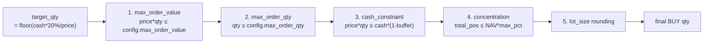
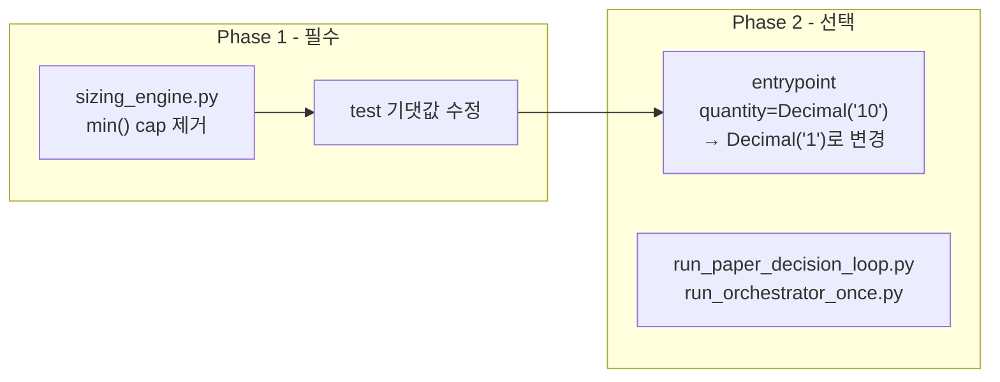
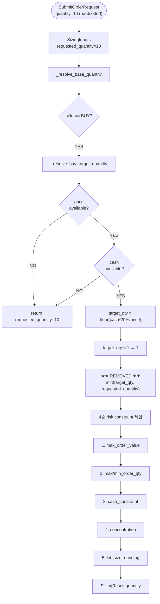

# 설계 보고서: `requested_quantity=10` Cap 제거 + 완전 동적 BUY 수량 활성화

**작성일**: 2026-05-21  
**대상**: User Request 13c — Task B  
**상태**: 설계 완료 (Phase 1)

---

## 1. 왜 아직 10주 상한이 남아 있었는가?

### User Request 13b 당시 설계 결정

User Request 13b에서 [`_resolve_buy_target_quantity()`](src/agent_trading/services/sizing_engine.py:202)가 추가될 때, 마지막 라인은 의도적으로 `min()`으로 cap되었다:

```python
# sizing_engine.py:227
return min(Decimal(str(target_qty)), inputs.requested_quantity)
```

**당시 의도**:
1. **저가주 과도 주문 방지**: `requested_quantity=10`이 상한으로 작동하여, 저가주(5,000원)에서도 최대 10주만 매수
2. **최소 변경 원칙**: 기존 `requested_quantity` 기반 로직을 최대한 유지
3. **안전망 역할**: risk constraint 체인 외에 추가 안전장치

### 하지만 이로 인한 문제

`requested_quantity=10`이 모든 BUY에 일괄 적용되면서, 중저가주도 10주로 고정되었다:

| 종목 | 가격 | 실제 target_qty | capped 결과 | 문제 |
|------|------|----------------|-------------|------|
| 삼성전자 | 80,000원 | **22주** | 10주 | 55%만 매수 |
| 두산 | 150,000원 | **12주** | 10주 | 83%만 매수 |
| 저가주 A | 30,000원 | **60주** | 10주 | 17%만 매수 |
| 초저가주 B | 5,000원 | **360주** | 10주 | 2.8%만 매수 |

**`requested_quantity=10`은 의미 없는 상수 cap일 뿐이며, 진정한 risk 제약이 아니다.**

---

## 2. 새 BUY Base Quantity 정책

### 핵심 원칙

```
BUY 시작 수량 = floor(orderable_amount * 20% / effective_price) = target_qty
                                    ↓
                     이 값을 그대로 base quantity로 사용
                                    ↓
            requested_quantity=10은 fallback으로만 사용
            (price/cash 정보 부족 시)
```

### 정책 상세

| 조건 | 동작 |
|------|------|
| `effective_price` 있고, `effective_cash` 있음 | → **`target_qty`** = `floor(effective_cash * 20% / effective_price)` |
| `effective_price` 없음 (price=None, ref=None) | → **`requested_quantity`** fallback |
| `effective_cash` 없음 (cash=None) | → **`requested_quantity`** fallback |
| `target_qty < 1` | → **1** (최소 1주) |

### 4중 Risk Constraint 체인이 실제 상한 역할

`requested_quantity=10` cap을 제거해도, 아래 4개의 constraint가 실제 BUY 상한을 결정한다:



| Constraint | 역할 | BUY 상한 가능? |
|-----------|------|---------------|
| [`_apply_max_order_value()`](src/agent_trading/services/sizing_engine.py:457) | 주문금액 절대 상한 | ✅ 설정 시 |
| [`_apply_qty_bounds()`](src/agent_trading/services/sizing_engine.py:439) | `max_order_qty` 절대 수량 상한 | ✅ 설정 시 |
| [`_apply_cash_constraint()`](src/agent_trading/services/sizing_engine.py:310) | 현금 기반 cap (항상 적용) | ✅ **항상** |
| [`_apply_concentration_constraint()`](src/agent_trading/services/sizing_engine.py:374) | 포트폴리오 비중 cap (항상 적용) | ✅ **항상** |

---

## 3. 적용할 수정 (Phase 1)

### 파일: [`src/agent_trading/services/sizing_engine.py`](src/agent_trading/services/sizing_engine.py:227)

```python
# 변경 전 (라인 227)
return min(Decimal(str(target_qty)), inputs.requested_quantity)

# 변경 후
return Decimal(str(target_qty))
```

### 영향도

| 영향 항목 | 설명 |
|-----------|------|
| **BUY 수량** | 동적 계산된 `target_qty`가 그대로 사용됨. 저가주에서 수량 증가 |
| **SELL/REDUCE/EXIT** | 영향 없음 (`_resolve_buy_target_quantity()`는 BUY 전용) |
| **HOLD/WATCH** | 영향 없음 (`_SKIP_DECISION_TYPES`에서 0 반환) |
| **risk constraint 체인** | 영향 없음 — cash/concentration/max_order_value는 그대로 적용 |
| **entrypoint 하드코딩** | `quantity=Decimal("10")`은 남지만, BUY 분기에서 무시됨 |
| **fallback 시나리오** | price/cash 정보 없으면 여전히 `requested_quantity` fallback 사용 |

---

## 4. 예시 계산 (`orderable_amount=9,000,000` 기준)

### 계산식

```python
_ALLOCATION_PCT = 0.2  # 20%
target_notional = 9,000,000 * 0.2 = 1,800,000
target_qty = int(1,800,000 / price)
```

### 결과 표

| 종목 | 가격 | 변경 전 (capped) | 변경 후 (target) | cash constraint | concentration |
|------|------|-----------------|-----------------|-----------------|---------------|
| SK하이닉스 | 200,000 | 9주 | **9주** (동일) | 47주 ✅ | 250주 ✅ |
| 두산 | 150,000 | 10주 (capped) | **12주** (+2) | 63주 ✅ | 333주 ✅ |
| 삼성전자 | 80,000 | 10주 (capped) | **22주** (+12) | 118주 ✅ | 625주 ✅ |
| 저가주 A | 30,000 | 10주 (capped) | **60주** (+50) | 315주 ✅ | 1,666주 ✅ |
| 초저가주 B | 5,000 | 10주 (capped) | **360주** (+350) | 1,890주 ✅ | 10,000주 ✅ |

> **참고**: cash constraint 계산 시 `min_cash_buffer_pct=10%` 가정 → `effective_cash = 9,000,000 * 0.9 = 8,100,000`
> **참고**: concentration constraint 계산 시 `NAV=50,000,000`, `max_single_position_pct=20%`, 현재 포지션=0 가정
> ✅ = constraint가 `target_qty`보다 높아 추가 제한 없음

### 위험 평가

| 위험 요소 | 평가 |
|-----------|------|
| **초저가주 360주 과도 주문?** | `1,800,000원`어치 = 현금 9,000,000의 20% 이내 → 안전 |
| **cash constraint 초과?** | `8,100,000/5,000=1,890` → 360 < 1,890 → 안전 |
| **concentration 초과?** | `10,000,000/5,000=10,000` → 360 < 10,000 → 안전 |
| **max_order_qty 초과?** | 설정 시에만 cap (기본값 없음) |
| **가장 큰 변화** | 초저가주 5,000원: 10주 → **360주** (36배) |

---

## 5. 테스트 계획

### 변경이 필요한 테스트: [`tests/services/test_sizing_engine.py`](tests/services/test_sizing_engine.py)

#### `TestBuyBaselineWithAllocationPct` 클래스

| 테스트 메서드 | 라인 | 현재 기댓값 | 변경 후 기댓값 | 이유 |
|--------------|------|-----------|--------------|------|
| `test_high_price_stock_sub_10_shares` | 1515 | 9 | **9** (변경 없음) | target_qty=9 < 10, cap 영향 없었음 |
| `test_low_price_stock_capped_at_requested` | 1533 | 10 | **360** | target_qty=360, cap 제거로 360 |
| `test_mid_price_stock_capped_at_requested` | 1550 | 10 | **12** | target_qty=12, cap 제거로 12 |
| `test_sell_side_unchanged` | 1567 | 10 | **10** (변경 없음) | SELL 경로, 영향 없음 |
| `test_no_price_fallback_to_requested` | 1582 | 10 | **10** (변경 없음) | price=None → fallback |
| `test_minimum_one_share` | 1598 | 1 | **1** (변경 없음) | minimum guard |
| `test_zero_cash_blocks_buy` | 1614 | 0 | **0** (변경 없음) | cash constraint |
| `test_allocation_pct_with_market_reference_price` | 1633 | 9 | **9** (변경 없음) | target_qty=9 |

#### 변경 상세

1. **`test_low_price_stock_capped_at_requested`** (라인 1533-1548):
   - 테스트 이름: `test_low_price_stock_capped_at_requested` → `test_low_price_stock_now_dynamic`
   - docstring 설명 변경
   - assertion: `Decimal("10")` → `Decimal("360")`

2. **`test_mid_price_stock_capped_at_requested`** (라인 1550-1564):
   - 테스트 이름: `test_mid_price_stock_capped_at_requested` → `test_mid_price_stock_now_dynamic`
   - docstring 설명 변경
   - assertion: `Decimal("10")` → `Decimal("12")`

#### 신규 테스트 제안 (선택)

새로운 동적 BUY 동작을 검증하기 위해 추가 테스트를 권장:

```python
def test_mid_low_price_stock_30k_now_dynamic(self) -> None:
    """저가주 30,000원, orderable=9,000,000.
    target_qty = int(1,800,000 / 30,000) = 60
    cap 제거 후 → 60주."""
    result = calculate_sizing(
        _inputs(
            decision_type="BUY",
            side=OrderSide.BUY,
            requested_quantity="10",
            requested_price="30000",
            orderable_amount="9000000",
        )
    )
    assert result.quantity == Decimal("60"), (
        f"Expected 60, got {result.quantity}"
    )
```

#### 변경 없는 테스트 (회귀 확인)

| 테스트 클래스 | 영향 | 확인 |
|--------------|------|------|
| `TestNewEntry` | 없음 | ✅ price/cash 없음 → fallback |
| `TestCashConstraint` | 없음 | ✅ 모든 target 계산 유지 |
| `TestReduce` | 없음 | ✅ SELL 경로 |
| `TestExit` | 없음 | ✅ SELL 경로 |
| `TestMaxOrderQty` | 없음 | ✅ constraint 이후 동작 |
| `TestMinOrderQty` | 없음 | ✅ constraint 이후 동작 |
| `TestConcentration` | 없음 | ✅ constraint 이후 동작 |
| `TestLotSize` | 없음 | ✅ constraint 이후 동작 |
| `TestAiSizingHintIncrease` | 없음 | ✅ BUY 경로 bypass |
| `TestAiSizingHintReduce` | 없음 | ✅ BUY 경로 bypass |
| `TestAllNoneFallback` | 없음 | ✅ fallback |
| `TestApproveSell` | 없음 | ✅ SELL 경로 |
| `TestNonActionable` | 없음 | ✅ HOLD/WATCH |
| `TestMaxOrderValue` | 없음 | ✅ constraint 이후 동작 |
| `TestCashBuffer` | 없음 | ✅ allocation 유지 |
| `TestMarketBuyReferencePriceCashConstraint` | 없음 | ✅ allocation 유지 |
| `TestLimitBuyIgnoresReferencePrice` | 없음 | ✅ allocation 유지 |
| `TestMarketSellNoCashConstraint` | 없음 | ✅ SELL 경로 |
| `TestSafetyFactorMarketOnly` | 없음 | ✅ allocation 유지 |
| `TestMarketBuyConcentrationWithReferencePrice` | 없음 | ✅ constraint 이후 동작 |

---

## 6. 운영 검증 계획

### 검증 단계

| 단계 | 내용 | 담당 모드 |
|------|------|----------|
| 1. 코드 수정 | `sizing_engine.py:227` 1라인 변경 | Code |
| 2. 단위 테스트 | `TestBuyBaselineWithAllocationPct` 내 2개 테스트 기댓값 수정 | Code |
| 3. 전체 회귀 테스트 | `pytest tests/services/test_sizing_engine.py -v` (71개 테스트) | Code/Debug |
| 4. 시나리오 계산 검증 | 5개 대표 가격별 target_qty 수동 검증 | Debug |
| 5. Docker 빌드 | `docker-compose build` + import 테스트 | Debug |
| 6. LIMIT 주문 경로 회귀 없음 확인 | constraint 체인 검증 | Debug |

### 예상 전체 pytest 결과

```
tests/services/test_sizing_engine.py ... 71 passed (예상)
```

변경은 2개 테스트의 기댓값만 바뀌며, 나머지 69개 테스트는 영향 없음.

---

## 7. 결론 및 권장사항

### 권장: Phase 1 (필수)만 진행

| 항목 | 내용 |
|------|------|
| **변경 파일** | 1개 (`sizing_engine.py`) |
| **변경 라인** | 1개 (라인 227) |
| **수정 테스트** | 2개 (`test_sizing_engine.py`) |
| **추가 테스트** | 1개 (선택 — 30,000원 저가주 케이스) |
| **위험도** | 낮음 — 4중 risk constraint 체인이 안전장치 역할 |
| **효과** | 모든 BUY 주문이 가격/현금 기반으로 동적 결정 |

### Phase 2 (선택) — 추후 고려



Phase 2에서는 entrypoint의 하드코딩된 `quantity=Decimal("10")`을 의미 없는 값(예: `Decimal("1")`)으로 변경할 수 있다. 하지만 Phase 1만으로도 BUY 동적 수량이 완전히 활성화되므로, Phase 2는 필수가 아니다.

---

## 부록: 전체 Sizing Pipeline 요약



---

## 수정 요약

| 구분 | 내용 |
|------|------|
| **파일** | [`src/agent_trading/services/sizing_engine.py`](src/agent_trading/services/sizing_engine.py:227) |
| **변경 전** | `return min(Decimal(str(target_qty)), inputs.requested_quantity)` |
| **변경 후** | `return Decimal(str(target_qty))` |
| **fallback 유지** | `effective_price`/`effective_cash` 없을 때 `return inputs.requested_quantity` |
| **risk constraint** | 변경 없음 — 4중 체인 그대로 유지 |
| **테스트** | 2개 기댓값 수정 (`10→360`, `10→12`) |

---

*본 보고서는 User Request 13c Task B의 설계 단계 결과물입니다. 구현은 Code 모드에서 Phase 1을 진행합니다.*
