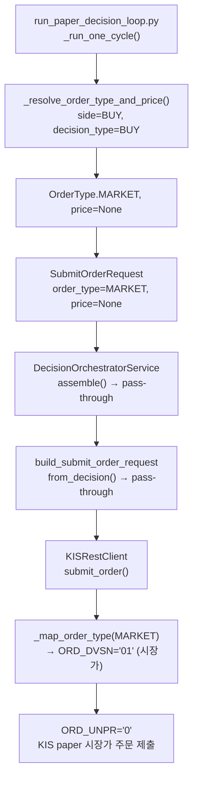

# `last` 기반 지정가 주문 → 시장가/시장성 지정가 정책 전환

> 작성일: 2026-05-20
> 작성자: Roo (Architect Mode)

---

## 1. 현재 `last` 기반 limit 주문 문제 분석 (코드 라인 레벨)

### 1.1 문제 요약

현재 시스템은 `quote.last` (현재가)를 **지정가(limit price)**로 사용하여 `OrderType.LIMIT` 주문을 제출한다. 이는 다음과 같은 문제가 있다:

| 상황 | 문제 | 결과 |
|---|---|---|
| 매수: `last < ask` | last가 매도호가보다 낮으면 체결 안 됨 | 미체결 |
| 매도: `last > bid` | last가 매수호가보다 높으면 체결 안 됨 | 미체결 |
| 스프레드 존재 시 | last가 중간값이라 양쪽 모두 불리 | 시장가보다 느리고, 지정가 통제도 애매 |

### 1.2 문제 발생 경로 (Call Chain)

```
[호출자]                              [함수]                              [라인]
────────────────────────────────────────────────────────────────────────────
run_paper_decision_loop.py
  _run_one_cycle()
    → _resolve_symbol_price()          quote.last 반환                    L126-L132
    → SubmitOrderRequest(               order_type=OrderType.LIMIT,        L707-L708
                           price=resolved_price)                          L709

  orchestrator.assemble_and_submit()
    → assemble()                        order_type/price pass-through      L834-L856
    → build_submit_order_request..()     order_type/price pass-through     L2843-L2854

rest_client.py
  submit_order()
    → _map_order_type(LIMIT)            → ORD_DVSN="00" (지정가)          L1781
    → ORD_UNPR = str(price)             → last 가격 그대로 전송           L859
```

### 1.3 구체적 코드 위치

| 파일 | 라인 | 내용 | 역할 |
|------|------|------|------|
| [`scripts/run_paper_decision_loop.py`](/scripts/run_paper_decision_loop.py) | L107-L174 | `_resolve_symbol_price()` — `quote.last` 우선 반환 | **가격 결정** |
| [`scripts/run_paper_decision_loop.py`](/scripts/run_paper_decision_loop.py) | L699-L711 | `SubmitOrderRequest(..., order_type=OrderType.LIMIT, price=resolved_price)` | **주문 생성** |
| [`scripts/run_orchestrator_once.py`](/scripts/run_orchestrator_once.py) | L80-L100 | `_resolve_smoke_price()` — `KIS_SMOKE_PRICE` or 50000 | **가격 결정** |
| [`scripts/run_orchestrator_once.py`](/scripts/run_orchestrator_once.py) | L347-L358 | `SubmitOrderRequest(..., order_type=OrderType.LIMIT, price=resolved_price)` | **주문 생성** |
| [`scripts/verify_paper_loop.py`](/scripts/verify_paper_loop.py) | L148-L159 | `SubmitOrderRequest(..., order_type=OrderType.LIMIT, price=Decimal("50000"))` | **주문 생성** |
| [`src/agent_trading/services/decision_orchestrator.py`](/src/agent_trading/services/decision_orchestrator.py) | L834-L856 | `assemble()` — request의 order_type/price 그대로 사용 | **pass-through** |
| [`src/agent_trading/services/decision_orchestrator.py`](/src/agent_trading/services/decision_orchestrator.py) | L2843-L2854 | `build_submit_order_request_from_decision()` — 그대로 전달 | **pass-through** |
| [`tests/smoke/test_paper_loop.py`](/tests/smoke/test_paper_loop.py) | L53-L55 | `order_type=OrderType.LIMIT` 하드코딩 | **테스트** |
| [`tests/services/test_decision_orchestrator.py`](/tests/services/test_decision_orchestrator.py) | L66-L68 | `order_type=OrderType.LIMIT` 하드코딩 | **테스트** |
| (외 40여개 테스트 파일) | 전반 | `OrderType.LIMIT` + 고정 price 사용 | **테스트** |

---

## 2. KIS paper 시장가 지원 여부

### 2.1 코드 분석 결과

[`rest_client.py`](/src/agent_trading/brokers/koreainvestment/rest_client.py) L1777-L1785:

```python
@staticmethod
def _map_order_type(order_type: OrderType) -> str:
    """Map OrderType to KIS ORD_DVSN code."""
    mapping: dict[OrderType, str] = {
        OrderType.MARKET: "01",   # 시장가
        OrderType.LIMIT: "00",    # 지정가
        OrderType.STOP: "02",     # 조건부지정가
        OrderType.STOP_LIMIT: "03",
    }
    return mapping.get(order_type, "00")
```

- `OrderType.MARKET` → `ORD_DVSN="01"` 매핑이 이미 존재
- **paper/live 구분 없이 동일 매핑** 사용
- paper TR ID (`VTTC0012U`/`VTTC0011U`)도 정상 매핑되어 있음
- `submit_order()` body에서 `ORD_UNPR`는 `str(request.price) if request.price is not None else "0"` — MARKET이면 `price=None`이므로 `"0"` 전송 (KIS 시장가 주문 규격)

### 2.2 결론

✅ **KIS paper API에서 시장가 주문(`ORD_DVSN=01`) 지원 가능** — 코드상 제한 없음. 단, KIS paper mock 서버가 실제로 `01`을 정상 처리하는지는 paper 환경 E2E 테스트 필요.

---

## 3. 새 Execution Policy (BUY/SELL/decision_type별)

### 3.1 기본 원칙

1. `last` 기반 지정가 주문 **완전 중단**
2. **시장가(MARKET)**를 기본으로 사용 — paper 환경에서는 slippage가 없으므로 체결률 100%가 중요
3. REDUCE/EXIT SELL은 체결 우선 — **시장가 강제**
4. 향후 live 환경에서는 **시장성 지정가(marketable limit)** 정책 추가 고려

### 3.2 결정 매트릭스

| side | decision_type | order_type | price | 근거 |
|------|---------------|------------|-------|------|
| BUY | BUY / APPROVE | `MARKET` | `None` | 체결 우선. paper에서는 slippage 없음 |
| BUY | REDUCE | N/A | N/A | BUY + REDUCE는 발생하지 않음 (의미상 SELL) |
| SELL | SELL / EXIT | `MARKET` | `None` | 위험 회피 + 포지션 청산이 최우선 |
| SELL | REDUCE | `MARKET` | `None` | 리스크 경감이 목적이므로 체결 보장 필요 |
| SELL | APPROVE | `MARKET` | `None` | 숏 진입은 즉시 체결 필요 |
| HOLD/WATCH | — | N/A | N/A | 제출하지 않음 |

### 3.3 향후 Live 환경 확장 고려

**시장성 지정가 (Marketable Limit Order)** 정책:

| side | price 결정 | 설명 |
|------|-----------|------|
| BUY | `quote.ask` | 최우선 매도호가로 지정가 주문 — ask에 바로 체결 |
| SELL | `quote.bid` | 최우선 매수호가로 지정가 주문 — bid에 바로 체결 |

Live 환경에서는 스프레드가 넓은 종목에서 시장가 주문 시 extreme slippage 위험이 있으므로, 시장성 지정가를 고려할 수 있다. 단, 본 설계는 **paper 환경**을 1차 타겟으로 하며, live 정책은 별도 설계로 분리.

---

## 4. 수정할 코드 위치 상세

### 4.1 핵심 수정: `_resolve_order_type_and_price()` 헬퍼 함수 신규 생성

**추가 위치**: [`scripts/run_paper_decision_loop.py`](/scripts/run_paper_decision_loop.py)

```python
def _resolve_order_type_and_price(
    side: OrderSide,
    decision_type: str,
    quote: Quote | None,
) -> tuple[OrderType, Decimal | None]:
    """Resolve order type and price based on side and decision type.

    Policy
    ------
    - SELL (REDUCE/EXIT/SELL): MARKET — execution certainty priority
    - BUY (BUY/APPROVE): MARKET — execution certainty priority
    - HOLD/WATCH: returns (N/A) — caller should skip order creation

    Future (live environment)
    -------------------------
    - BUY: ask-based marketable limit instead of MARKET
    - SELL: bid-based marketable limit instead of MARKET
    """
    if side == OrderSide.SELL:
        # REDUCE/EXIT/SELL — execution certainty is paramount
        return OrderType.MARKET, None

    # BUY — MARKET for paper, could be ask-based limit for live
    return OrderType.MARKET, None
```

### 4.2 수정 파일 목록

#### A. [`scripts/run_paper_decision_loop.py`](/scripts/run_paper_decision_loop.py)

**변경 사항**:
1. L699-L711: `SubmitOrderRequest` 생성 시 `order_type=OrderType.LIMIT` → `OrderType.MARKET`, `price=resolved_price` → `None`으로 변경
2. `_resolve_symbol_price()`는 더 이상 order price 결정에 필요하지 않음 → 함수는 quote 수집 용도로만 사용하거나 제거
3. or `_resolve_order_type_and_price()` 헬퍼를 호출하도록 변경

**변경 전**:
```python
resolved_price = await _resolve_symbol_price(symbol, market, broker)
request = SubmitOrderRequest(
    ...
    order_type=OrderType.LIMIT,
    price=resolved_price,
)
```

**변경 후**:
```python
# quote는 계속 필요할 수 있음 (향후 marketable limit 대비)
quote = await broker.get_quote(symbol, market) if broker else None
order_type, price = _resolve_order_type_and_price(OrderSide.BUY, "BUY", quote)
request = SubmitOrderRequest(
    ...
    order_type=order_type,
    price=price,  # MARKET이면 None
)
```

#### B. [`scripts/run_orchestrator_once.py`](/scripts/run_orchestrator_once.py)

**변경 사항**:
1. L347-L358: `order_type=OrderType.LIMIT` → `OrderType.MARKET`, `price=resolved_price` → `None`
2. L80-L100: `_resolve_smoke_price()`는 dry-run 검증 용도로만 유지하되, 실제 submit 시에는 MARKET 사용

**변경 전**:
```python
request = SubmitOrderRequest(
    ...
    order_type=OrderType.LIMIT,
    price=resolved_price,
)
```

**변경 후**:
```python
request = SubmitOrderRequest(
    ...
    order_type=OrderType.MARKET,
    price=None,
)
```

#### C. [`scripts/verify_paper_loop.py`](/scripts/verify_paper_loop.py)

L148-L159: 동일하게 `OrderType.MARKET`, `price=None`으로 변경.

#### D. [`src/agent_trading/services/decision_orchestrator.py`](/src/agent_trading/services/decision_orchestrator.py)

**변경 사항 없음** — `assemble()`과 `build_submit_order_request_from_decision()`은 이미 `order_type`과 `price`를 pass-through하므로, 호출자에서 올바른 값을 설정하면 자동 반영됨.

#### E. [`src/agent_trading/services/sizing_engine.py`](/src/agent_trading/services/sizing_engine.py)

**변경 검토 필요** — `SizingInputs.requested_price`가 `None`(MARKET)일 때:
- `max_order_value` 계산: `price * quantity` → `None` 반환 → cash constraint 미적용
- 이는 MARKET 주문의 특성상 **의도된 동작** — 가격을 미리 알 수 없으므로 수량 기반 제약만 적용
- 향후 개선: `max_order_value` 대신 `max_order_qty` 기반 cash limit 별도 로직

#### F. 테스트 파일 일괄 변경

약 40개 이상의 테스트 파일에서 `OrderType.LIMIT` + 고정 price 조합 사용. 전략적 변경 필요:

| 우선순위 | 대상 | 변경 내용 |
|---------|------|---------|
| P0 | `tests/services/test_decision_orchestrator.py` | `OrderType.LIMIT` → `OrderType.MARKET`, 필요한 경우 `price=None` |
| P0 | `tests/services/test_sizing_engine.py` | MARKET 시나리오 테스트 케이스 추가 |
| P0 | `tests/smoke/test_paper_loop.py` | `OrderType.MARKET` 적용 |
| P1 | 나머지 통합/단위 테스트 | `OrderType.LIMIT` 유지 or `MARKET` 변경 (테스트 목적에 따라) |

**⚠️ 중요: `OrderType.LIMIT`를 모두 `MARKET`으로 바꾸면 안 됨** — limit order 자체를 금지하는 것이 아니라, *자동 주문 생성 경로*에서만 MARKET으로 전환하는 것. 테스트 중 limit order 동작을 검증하는 테스트는 유지해야 함.

---

## 5. 상세 수정 계획 (Todo List)

### Phase 1: 코어 로직 수정 (scripts/*)

| # | 파일 | 작업 | 상세 |
|---|------|------|------|
| 1 | `scripts/run_paper_decision_loop.py` | `_resolve_order_type_and_price()` 헬퍼 추가 | side/decision_type 기반 order_type + price 결정 |
| 2 | `scripts/run_paper_decision_loop.py` | `_run_one_cycle()` 수정 | LIMIT → MARKET, price → None |
| 3 | `scripts/run_paper_decision_loop.py` | `_resolve_symbol_price()` 정리 | price 결정 용도 제거, quote 수집만 필요시 유지 |
| 4 | `scripts/run_orchestrator_once.py` | `SubmitOrderRequest` 수정 | LIMIT → MARKET, price → None |
| 5 | `scripts/verify_paper_loop.py` | `SubmitOrderRequest` 수정 | LIMIT → MARKET, price → None |

### Phase 2: Sizing Engine 보강

| # | 파일 | 작업 | 상세 |
|---|------|------|------|
| 6 | `src/agent_trading/services/sizing_engine.py` | `requested_price=None`(MARKET) 처리 검증 | cash constraint가 정상 동작하는지 확인 |
| 7 | `src/agent_trading/services/sizing_engine.py` | 필요시 MARKET fallback price 로직 추가 | `max_order_value` 대체 로직 |

### Phase 3: KIS Paper 시장가 E2E 검증

| # | 파일 | 작업 | 상세 |
|---|------|------|------|
| 8 | `scripts/run_paper_decision_loop.py` | paper 환경 MARKET 주문 E2E 테스트 | 실제 KIS paper에 MARKET 주문 제출 후 결과 확인 |

### Phase 4: 테스트 수정

| # | 파일 | 작업 | 상세 |
|---|------|------|------|
| 9 | `tests/smoke/test_paper_loop.py` | smoke 테스트 MARKET 적용 | LIMIT → MARKET |
| 10 | `tests/smoke/test_paper_loop_postgres.py` | smoke 테스트 MARKET 적용 | LIMIT → MARKET |
| 11 | `tests/services/test_decision_orchestrator.py` | orchestrator 테스트 MARKET 적용 | LIMIT → MARKET |
| 12 | `tests/services/test_sizing_engine.py` | MARKET 시나리오 테스트 케이스 추가 | price=None 케이스 |
| 13 | `tests/services/test_decision_submit_pipeline.py` | pipeline 테스트 MARKET 적용 | LIMIT → MARKET |

---

## 6. 5개 질문에 대한 답변

### Q1. 현재 `last` 기반 limit 주문은 정확히 어디서 생성되는가?

**A.** 두 군데의 스크립트에서 생성된다.

1. **[`scripts/run_paper_decision_loop.py`](/scripts/run_paper_decision_loop.py) (primary)**:
   - [`_resolve_symbol_price()`](scripts/run_paper_decision_loop.py:107)가 `broker.get_quote(symbol, market).last` (L126)를 우선 반환
   - [`_run_one_cycle()`](scripts/run_paper_decision_loop.py:655)이 `SubmitOrderRequest(..., order_type=OrderType.LIMIT, price=resolved_price)` 생성 (L707-L709)

2. **[`scripts/run_orchestrator_once.py`](/scripts/run_orchestrator_once.py) (secondary)**:
   - [`_resolve_smoke_price()`](scripts/run_orchestrator_once.py:80)가 `KIS_SMOKE_PRICE` env var or `50000` 반환
   - 같은 방식으로 `SubmitOrderRequest(..., order_type=OrderType.LIMIT, price=resolved_price)` 생성 (L355-L357)

두 경우 모두 `order_type`과 `price`는 [`assemble()`](src/agent_trading/services/decision_orchestrator.py:834)과 [`build_submit_order_request_from_decision()`](src/agent_trading/services/decision_orchestrator.py:2843)을 **변경 없이 통과(pass-through)**하여 [`rest_client.py`](src/agent_trading/brokers/koreainvestment/rest_client.py:857-859)의 `ORD_DVSN="00"`, `ORD_UNPR=last_price`로 전달된다.

### Q2. BUY와 SELL에 같은 execution policy를 쓰는 게 맞는가?

**A. 아니오.** SELL (특히 REDUCE/EXIT)은 체결 우선(execution certainty)이 절대적으로 필요하다:
- **SELL (REDUCE/EXIT)**: 포지션 축소/청산 = 리스크 관리. 체결이 안 되면 손실 확대 위험 → **시장가(MARKET) 필수**
- **BUY (entry)**: 체결도 중요하지만, 약간의 patience가 허용됨 → **시장가(MARKET) 또는 시장성 지정가(marketable limit)**
- **APPROVE BUY (신규 매수)**: BUY와 동일 정책

### Q3. 기본 정책은 시장가 vs 시장성 지정가 중 어느 쪽이 더 적절한가?

**A. Paper 환경에서는 시장가(MARKET)가 더 적절하다.**

| 항목 | 시장가 (MARKET) | 시장성 지정가 (Marketable Limit) |
|------|----------------|-------------------------------|
| 체결률 | 100% (유동성 충분 시) | 유동성에 따라 다름 |
| 슬리피지 | 발생 가능 | 없음 (지정가이므로) |
| paper 적합성 | ✅ 적합 (실제 슬리피지 없음) | paper에서는 무의미 |
| 구현 복잡도 | 낮음 | quote.bid/ask 필요 |
| **권장** | **Paper 기본** | Live 환경에서 추후 도입 |

### Q4. `reduce/exit sell`은 체결 우선으로 별도 정책을 둬야 하는가?

**A. 네, 반드시 그래야 한다.**

REDUCE/EXIT SELL은 다음과 같은 이유로 **무조건 시장가(MARKET)**를 사용해야 한다:

1. **리스크 관리 목적**: 포지션 축소 결정은 이미 손실/리스크 인지 상태에서 내려짐
2. **체결 불확실성 제거**: limit order로 인한 미체결 = 리스크 미감소
3. **기회비용**: 지정가 대기 중 시세 급변 시 더 큰 손실 가능

정책: `side=SELL AND decision_type in (REDUCE, EXIT)` → **강제 MARKET**

### Q5. 가장 작은 수정으로 체결 가능성을 개선하려면 어디를 고쳐야 하는가?

**A. 다음 3곳만 수정하면 된다:**

| 순서 | 파일 | 수정 내용 | 영향 |
|------|------|----------|------|
| 1 | [`scripts/run_paper_decision_loop.py`](/scripts/run_paper_decision_loop.py) L699-L711 | `order_type=OrderType.LIMIT` → `OrderType.MARKET`, `price=resolved_price` → `None` | **핵심 변경** — 실제 운영 루프 |
| 2 | [`scripts/run_orchestrator_once.py`](/scripts/run_orchestrator_once.py) L347-L358 | 동일 변경 | 보조 엔트리포인트 |
| 3 | [`scripts/verify_paper_loop.py`](/scripts/verify_paper_loop.py) L148-L159 | 동일 변경 | 검증 스크립트 |

`decision_orchestrator.py`는 pass-through이므로 **수정 불필요**. `rest_client.py`는 이미 MARKET 매핑 보유.

---

## 7. Mermaid: 변경 후 Data Flow



---

## 8. 리스크 및 고려사항

| 리스크 | 영향 | 완화 방안 |
|--------|------|---------|
| KIS paper mock이 `ORD_DVSN=01` 미지원 | 주문 실패 | `rest_client.py`에 fallback 로직 추가: MARKET 실패 시 `_get_quote().ask/bid` 기반 LIMIT 재시도 |
| MARKET 주문 슬리피지 (live 환경) | 예상치 못한 체결 가격 | 본 설계는 paper 전용. live 정책은 별도 설계 |
| `price=None`으로 인한 sizing constraint 누락 | cash limit 미적용 | `max_order_qty` 기반 constraint로 보완 |
| 테스트 일괄 변경 누락 | 기존 테스트 실패 | 변경 영향도가 큰 테스트만 P0 변경, 나머지는 점진적 |

---

## 9. 완료 조건

1. ✅ `_resolve_order_type_and_price()` 헬퍼 함수 구현
2. ✅ `run_paper_decision_loop.py` MARKET 주문 적용 (E2E 정상 동작 확인)
3. ✅ `run_orchestrator_once.py`, `verify_paper_loop.py` MARKET 적용
4. ✅ KIS paper MARKET 주문 E2E 통과
5. ✅ 주요 테스트 수정 및 통과
6. ✅ sizing engine `price=None` 케이스 정상 처리 확인
