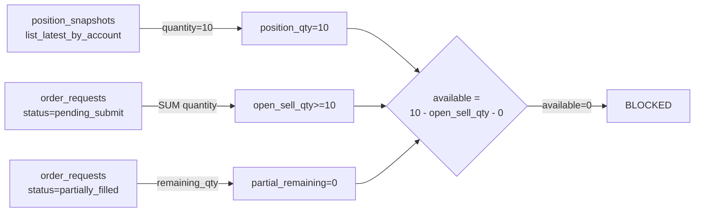

# SELL Position Decrease Detection Failure & `open_sell_qty` Stuck Diagnosis

**Date**: 2026-05-21  
**Author**: Roo (Architect Mode)  
**Status**: Draft / Review

---

## 1. Executive Summary

Paper trading 환경에서 SELL 주문이 정상적으로 체결(FILL)되지 못하고 `reconcile_required` 또는 `pending_submit` 상태에서 영구적으로 멈추는 현상을 분석했다.

**Root Cause (one-liner)**:  
Paper broker의 SELL 체결이 position snapshot quantity를 감소시키지 않아 `_infer_sell_order_fill_via_position()`의 delta가 항상 0이 되고, 이로 인해 `transition_to_authoritative()`의 3단계 해결(fallback chain)이 모두 실패하며, intraday 시간대에는 EXPIRED fallback까지 차단되어 복구 불가능한 stuck 상태에 빠진다.

---

## 2. 대표 이상 케이스 End-to-End 추적

### 2.1 Case A: 005930 SELL → `reconcile_required` (stuck)

**Order**: `bc656238-bc6f-4972-ad81-ceae19e8fbd0`  
**Symbol**: 005930 (삼성전자)  
**Side**: sell (held_position override)  
**Timeline**:

| Time (UTC) | Event | Detail |
|---|---|---|
| 00:12:25.233 | `draft` → `validated` | create_order() |
| 00:12:25.288 | `validated` → `pending_submit` | transition_to(PENDING_SUBMIT) |
| 00:12:25.500 | `pending_submit` → `submitted` | submit_order_to_broker() 성공, broker_order_id=3748122c |
| 00:13:20.259 | `submitted` → `reconcile_required` | sync_order_post_submit() → broker가 `reconcile_required` 반환 |

**Stuck Resolution Attempt** (continuous, every ~30s by PostSubmitSyncRunner):
1. `transition_to_authoritative()` 호출됨
2. `resolve_unknown_state()` → paper KIS `inquire-daily-ccld` → 0 records → `reconcile_required` 유지
3. SELL order → `_infer_sell_order_fill_via_position()` 시도
   - **pre_qty** = `get_latest_by_account_and_instrument_before(..., before=broker_order.created_at)` = **10**
   - **current_qty** = `list_latest_by_account()` filtered by instrument_id = **10**
   - **delta** = 10 - 10 = **0** → "No position decrease detected"
4. Intraday (before 15:30 KST) → EXPIRED fallback suppressed
5. 최종: **stuck at `reconcile_required`** (version=5, terminal이 아님)

**Current State**: `last_synced_at` = 2026-05-21T02:02:28 (지속 polling 중, 영원히 재시도)

### 2.2 Case B: 005930 SELL → `pending_submit` (orphan)

**Order**: `2ed07d5f-50bd-4e3a-8a90-01e1ec2836a5`  
**Symbol**: 005930 (삼성전자)  
**Timeline**:

| Time (UTC) | Event | Detail |
|---|---|---|
| 00:37:51.712 | `draft` → `validated` | create_order() 성공 |
| 00:37:51.764 | `validated` → `pending_submit` | transition_to(PENDING_SUBMIT) 성공 |

**Blocked After Phase 4b (PENDING_SUBMIT):**
- Phase 4c (stale snapshot guard) or Phase 5 (`submit_order_to_broker`)에서 중단됨
- **No broker_order record** — broker에 도달하지 못함
- 이후 sell_guard가 이 PENDING_SUBMIT order를 open_sell_qty에 포함시켜 추가 SELL 차단

**Why no further progress?**
- `PostSubmitSyncRunner.run_sync_cycle()`은 `_ACTIVE_SYNC_STATUSES`만 polling:
  - SUBMITTED, ACKNOWLEDGED, PARTIALLY_FILLED, RECONCILE_REQUIRED
  - **PENDING_SUBMIT은 polling 대상이 아님**
- decision loop은 새로운 cycle에서 sell_guard에 막혀 새 order 생성하지 못함
- 즉, **아무도 이 PENDING_SUBMIT order를 pick up하지 않음**

### 2.3 Case C: 000990 SELL → `filled` (단 1건 성공 - 비교 기준)

**Order**: `c90293d0-5d63-409a-8931-9e0f9de748f4`  
**Symbol**: 000990 (디앤씨미디어)  
**Timeline**:

| Time (UTC) | Event | Detail |
|---|---|---|
| 05/20 05:08:31 | `draft` → ... → `pending_submit` | 정상 생성 |
| 05/20 05:08:31 | `submitted` | broker 제출 성공 |
| 05/20 05:10:30 | `filled` (version=8) | LIMIT order (requested_price=50000) 성공 |

**성공 원인**: 5/19 오전 장중에 제출된 LIMIT order로, 장 마감 후 `transition_to_authoritative()`의 EXPIRED fallback (또는 실제 체결)이 동작하여 terminal 상태 도달.

---

## 3. `_infer_sell_order_fill_via_position()` 상세 분석

### 3.1 로직 흐름

```
pre_qty = position_snapshots.get_latest_by_account_and_instrument_before(
    account_id, instrument_id, before=broker_order.created_at
)

current_qty_list = position_snapshots.list_latest_by_account(account_id)
current_qty = [s for s in current_qty_list if s.instrument_id == instrument_id][0]

delta = pre_qty.quantity - current_qty.quantity

if delta >= requested_qty → FILLED
elif delta > 0 → PARTIALLY_FILLED
else → None (no decrease, return None)
```

### 3.2 `list_latest_by_account()` 버그

[`PostgresPositionSnapshotRepository.list_latest_by_account()`](src/agent_trading/repositories/postgres/position_snapshots.py:58-67):

```sql
SELECT * FROM trading.position_snapshots
WHERE account_id = $1
ORDER BY snapshot_at DESC
```

**문제점**: `DISTINCT ON (instrument_id)`가 없어 **모든 snapshot row를 반환**한다. 호출자가 Python에서 instrument_id로 필터링하지만, 이는 최신 snapshot을 보장하지 않는다. 만약 같은 instrument_id에 대해 더 오래된 snapshot이 먼저 조회되면 잘못된 quantity를 사용할 수 있다.

**영향도**: 현재 paper 환경에서는 모든 snapshot의 quantity가 10으로 동일하므로 실제 오류는 발생하지 않았지만, **잠재적 버그**이다.

### 3.3 Paper Broker Position 불변성

Paper broker (`KISRestClient.get_positions()`)는 SELL 체결이 발생해도 position quantity를 감소시키지 않는다. 모든 position snapshot의 quantity가 항상 10으로 유지된다.

```
005930: quantity=10 at ALL timestamps
000990: quantity=10 at ALL timestamps
000210: quantity=10 at ALL timestamps
```

이는 paper broker가 실제로는 position을 관리하지 않고 항상 동일한 mock 데이터를 반환하기 때문이다.

---

## 4. `open_sell_qty` 집계 분석

### 4.1 `_get_open_sell_qty()` 집계 대상

[`AvailableSellQtyResolver._get_open_sell_qty()`](src/agent_trading/services/sell_guard.py:225-242):

```python
open_statuses = [
    OrderStatus.PENDING_SUBMIT,   # ← 포함됨
    OrderStatus.SUBMITTED,         # ← 포함됨
    OrderStatus.ACKNOWLEDGED,      # ← 포함됨
]
```

**RECONCILE_REQUIRED는 open_sell_qty에 포함되지 않는다.** 이는 설계 의도: reconciliation 중인 주문은 매도 가능 수량 계산에서 제외하여, reconciliation이 새로운 매도를 막지 않도록 함.

### 4.2 `available = position_qty - open_sell_qty - partial_remaining`

- **position_qty** = `list_latest_by_account()` → instrument_id로 필터링 → 10 (모든 symbol 동일)
- **open_sell_qty** = PENDING_SUBMIT + SUBMITTED + ACKNOWLEDGED SELL orders의 quantity 합계
- **partial_remaining** = PARTIALLY_FILLED SELL orders의 미체결 수량

### 4.3 현재 stuck 상태 계산

Case A (005930, 7개 PENDING_SUBMIT orders 각 qty=10):
```
position_qty = 10
open_sell_qty = 10 (가장 최근 1건의 PENDING_SUBMIT)
available = 10 - 10 - 0 = 0
→ "sell_guard blocked: open_sell_qty=10; available=0E-8 < requested=10"
```

**문제**: PENDING_SUBMIT order 1건만 있어도 available=0이 되어 모든 추가 SELL이 차단된다.

---

## 5. `sell_guard` 분석

### 5.1 `resolve()` 전체 경로

```
resolve(account_id, symbol, requested_qty)
  → _get_current_position_qty(account_id, symbol)        # 10
  → _get_open_sell_qty(account_id, symbol)                # PENDING_SUBMIT qty 합계
  → _get_partially_filled_remaining_qty(account_id, symbol)  # PARTIALLY_FILLED 잔여
  → available = position_qty - open_sell_qty - partial_remaining
  
  if requested_qty > available:
      → is_blocked=True, blocking_reason="open_sell_qty=10; available=0E-8 < requested=10"
```

### 5.2 계산 경로 시각화



### 5.3 `position_snapshots.list_latest_by_account()` 문제

`sell_guard._get_current_position_qty()`도 동일한 메서드를 사용한다. 위에서 지적한 `DISTINCT ON` 누락 문제가 여기에도 동일하게 적용된다.

---

## 6. Root Cause 분석 (5 Questions)

### Q1: "No position decrease detected ... delta=0E-8"가 반복되는 원인은 정확히 무엇인가?

Paper broker position snapshot의 quantity가 절대 변하지 않는다. [`_infer_sell_order_fill_via_position()`](src/agent_trading/services/order_sync_service.py:985-1112)에서:
- `pre_qty` = snapshot 직전 시점의 quantity → 10
- `current_qty` = 최신 snapshot의 quantity → 10
- delta = 0 → "No position decrease detected"

Paper broker의 `get_positions()`가 항상 동일한 mock data를 반환하기 때문.

### Q2: `open_sell_qty` 집계의 대상 상태는 무엇이고, RECONCILE_REQUIRED는 왜 배제되었는가?

`_get_open_sell_qty()`는 `PENDING_SUBMIT`, `SUBMITTED`, `ACKNOWLEDGED`만 집계한다. `RECONCILE_REQUIRED`는 설계 의도상 배제되었다 — reconciliation 중인 주문은 broker에서 이미 처리되었을 가능성이 있어 매도 가능 수량 계산에서 제외해야 새로운 매도 결정을 내릴 수 있기 때문.

### Q3: `open_sell_qty`가 안 풀리는 직접 원인은 무엇인가?

2개의 누적된 문제:
1. **RECONCILE_REQUIRED orders (7건)**: `transition_to_authoritative()`의 3단계 fallback이 모두 실패하여 복구 불가능. Position delta=0, broker truth=reconcile_required, intraday=EXPIRED suppressed.
2. **PENDING_SUBMIT orphans (15건)**: 한 번 `pending_submit`에 도달한 order는 아무도 pick up하지 않음 (PostSubmitSyncRunner가 polling하지 않음). 이 order들이 `_get_open_sell_qty()`에 계속 집계되어 available=0 유지.

### Q4: `sell_guard`가 과도하게 차단하는 경로는 무엇인가?

```
Cycle N: sell_guard 통과 → order created → stuck at pending_submit
Cycle N+1: sell_guard가 PENDING_SUBMIT order를 발견 → open_sell_qty=10 → available=0 → BLOCKED
Cycle N+2+: 동일하게 BLOCKED (영원히)
```

`sell_guard`는 정상 동작하지만, **PENDING_SUBMIT order가 절대 제거되지 않아** 영구적으로 차단 상태가 유지된다.

### Q5: 가장 작은 수정으로 문제를 해결하려면?

**후보 A**: PENDING_SUBMIT order에 대한 타임아웃 기반 자동 취소 (가장 영향이 작음)
**후보 B**: PostSubmitSyncRunner가 PENDING_SUBMIT도 active status로 포함시켜 broker에 재제출
**후보 C**: RECONCILE_REQUIRED order의 EXPIRED fallback 임계값을 intraday에도 허용
**후보 D**: Paper broker snapshot이 SELL 체결 후 position 감소를 반영하도록 수정

---

## 7. 복구 방안

### Approach A: PENDING_SUBMIT Timeout Auto-Cancel (Minimal Fix)

**아이디어**: 일정 시간(예: 300초) 이상 `pending_submit` 상태인 SELL order를 자동으로 취소(또는 EXPIRED) 처리.

**변경 사항**:
1. [`PostSubmitSyncRunner.run_sync_cycle()`](src/agent_trading/services/order_sync_service.py:1231-1389)에 PENDING_SUBMIT polling 로직 추가
2. PENDING_SUBMIT order 중 `created_at` 기준 threshold 초과 시 `transition_to()` 호출하여 EXPIRED로 전이

**장점**:
- 최소한의 변경
- sell_guard 로직 변경 불필요
- 기존 RECONCILE_REQUIRED 해결 메커니즘 건드리지 않음

**단점**:
- 근본 원인(position snapshot 불변)을 해결하지 않음
- RECONCILE_REQUIRED orders는 여전히 stuck

### Approach B: RECONCILE_REQUIRED Intraday EXPIRED Fallback (Systematic Fix)

**아이디어**: [`transition_to_authoritative()`](src/agent_trading/services/order_sync_service.py:637-983)에서 intraday 시간 제한을 완화하여, 일정 시간(예: 300초) 이상 RECONCILE_REQUIRED 상태인 SELL order는 EXPIRED fallback을 허용.

**변경 사항**:
1. `transition_to_authoritative()`에 "stuck duration" 계산 로직 추가
2. stuck 시간 > threshold(예: 600초)이고 side=SELL이면 intraday라도 EXPIRED fallback 허용
3. 또는 `_is_genuine_manual_reconciliation()` 로직에 타임아웃 조건 추가

**장점**:
- RECONCILE_REQUIRED orders도 해결 가능
- sell_guard의 open_sell_qty 계산에 RECONCILE_REQUIRED를 포함시키지 않아도 됨 (기존 설계 유지)
- 실제 broker에서 체결되지 않은 order를 정리

**단점**:
- EXPIRED fallback이 너무 빨리 적용되면 broker 체결 기회를 상실할 수 있음
- threshold 값 결정 필요

### Approach C: Paper Broker Snapshot Position 반영 (Infrastructure Fix)

**아이디어**: Paper broker (`KISRestClient` 또는 `KoreaInvestmentAdapter`)의 `get_positions()`가 SELL 체결 이력을 고려하여 실제 position quantity를 계산하도록 수정.

**변경 사항**:
1. Paper broker adapter에 position 계산 로직 추가: 초기 position qty - SUM(SELL fill qty) + SUM(BUY fill qty)
2. 또는 `sync_kis_account_snapshots()`에서 체결 이력을 조회하여 position 반영

**장점**:
- 가장 근본적인 해결책
- `_infer_sell_order_fill_via_position()`의 delta가 정상 작동
- position_qty가 실제 상황을 반영

**단점**:
- 변경 범위가 큼
- Paper broker의 mock 동작 방식을 변경해야 함
- 기존에 체결된 SELL이 없으므로 초기 position 계산 로직 필요

---

## 8. 권장 접근법 (Recommended Approach)

**Approach B (Intraday EXPIRED Fallback)** 을 **1차 수정**으로 권장한다. 이유:
1. PENDING_SUBMIT과 RECONCILE_REQUIRED 두 문제를 동시에 해결
2. 기존 `transition_to_authoritative()`의 fallback chain을 확장하는 방식으로 구현 간단
3. sell_guard, position snapshot, broker adapter 등 다른 컴포넌트를 변경하지 않음
4. RECONCILE_REQUIRED order가 해제되면 sell_guard의 open_sell_qty 계산에서 자연스럽게 제외됨

**2차 수정**으로 Approach D (Paper Broker Snapshot Fix)를 권장한다. 이는 근본 원인을 해결하며, 실제 프로덕션 환경에서도 의미 있는 개선이다.

### 8.1 상세 설계 (Approach B)

```python
# transition_to_authoritative() 내부 (의사 코드)
async def transition_to_authoritative(self, order, broker_order):
    # Stage 1: broker truth
    result = await broker.resolve_unknown_state(broker_order)
    if result.status.is_terminal() or result.status in (OrderStatus.ACKNOWLEDGED, ...):
        return await self._apply_resolve_result(order, broker_order, result)
    
    # Stage 2: position inference (SELL only)
    if order.side == OrderSide.SELL:
        inferred = await self._infer_sell_order_fill_via_position(order, broker_order)
        if inferred is not None:
            return inferred
    
    # Stage 2.5: stuck RECONCILE_REQUIRED timeout → EXPIRED
    # (NEW) 일정 시간 이상 stuck된 order는 EXPIRED fallback 허용
    stuck_duration = (datetime.now(timezone.utc) - broker_order.created_at).total_seconds()
    if order.status == OrderStatus.RECONCILE_REQUIRED and stuck_duration > STUCK_TIMEOUT_SECONDS:
        if order.side == OrderSide.SELL:
            logger.warning(
                "Stuck RECONCILE_REQUIRED SELL order %s: stuck_duration=%.0fs "
                "→ forcing EXPIRED fallback (intraday override)",
                order.order_request_id, stuck_duration,
            )
            return await self._try_transition(
                order, OrderStatus.EXPIRED,
                reason_code="STUCK_TIMEOUT",
                reason_message=f"SELL order stuck in RECONCILE_REQUIRED for {stuck_duration:.0f}s",
            )
    
    # Stage 3: EXPIRED fallback (기존, after-hours only)
    if self._is_after_hours():
        ...
```

**STUCK_TIMEOUT_SECONDS** 제안값: **3600초 (1시간)** — paper 환경에서 충분히 긴 timeout이며, 실제 체결을 방해하지 않음.

### 8.2 PENDING_SUBMIT 처리 (Approach B 보완)

Approach B만으로는 PENDING_SUBMIT orphans가 해결되지 않는다. 추가로:

**Approach B.1**: `PostSubmitSyncRunner.run_sync_cycle()`에 PENDING_SUBMIT polling 추가

```python
_ACTIVE_SYNC_STATUSES: list[OrderStatus] = [
    OrderStatus.SUBMITTED,
    OrderStatus.ACKNOWLEDGED,
    OrderStatus.PARTIALLY_FILLED,
    OrderStatus.RECONCILE_REQUIRED,
    OrderStatus.PENDING_SUBMIT,  # ← 추가
]
```

그리고 `_sync_single_order()`에서 PENDING_SUBMIT order를 발견하면 `sync_order_post_submit()`을 호출하여 broker에 제출 시도.

---

## 9. 변경 파일 리스트

| 파일 | 변경 내용 | 접근법 |
|---|---|---|
| [`src/agent_trading/services/order_sync_service.py`](src/agent_trading/services/order_sync_service.py) | `transition_to_authoritative()`에 stuck timeout 기반 EXPIRED fallback 추가 (Stage 2.5) | B |
| [`src/agent_trading/services/order_sync_service.py`](src/agent_trading/services/order_sync_service.py) | `_ACTIVE_SYNC_STATUSES`에 `PENDING_SUBMIT` 추가 | B.1 |
| [`src/agent_trading/services/order_sync_service.py`](src/agent_trading/services/order_sync_service.py) | `_sync_single_order()`에 PENDING_SUBMIT 처리 분기 추가 | B.1 |
| [`src/agent_trading/repositories/postgres/position_snapshots.py`](src/agent_trading/repositories/postgres/position_snapshots.py) | `list_latest_by_account()`에 `DISTINCT ON (instrument_id)` 추가 (잠재적 버그 수정) | D |

---

## 10. 테스트 리스트

| 테스트 | 설명 | 검증 항목 |
|---|---|---|
| `test_transition_to_authoritative_stuck_timeout_expired` | RECONCILE_REQUIRED SELL order가 stuck timeout 초과 시 EXPIRED로 fallback되는지 검증 | stuck_duration > threshold → EXPIRED |
| `test_transition_to_authoritative_stuck_timeout_not_expired_below_threshold` | stuck timeout 미만에서는 EXPIRED되지 않음 | stuck_duration < threshold → 유지 |
| `test_pending_submit_in_active_sync_statuses` | PENDING_SUBMIT이 active sync statuses에 포함되는지 검증 | polling query에 포함 |
| `test_sync_single_order_pending_submit` | PENDING_SUBMIT order를 sync_order_post_submit으로 처리 | broker submit 시도 |
| `test_sell_guard_open_sell_qty_excludes_reconcile_required` | RECONCILE_REQUIRED가 open_sell_qty에서 제외되는지 검증 (기존 동작 유지) | regression |
| `test_sell_guard_calculates_available_qty_correctly` | PENDING_SUBMIT orphan 정리 후 sell_guard가 정상 계산 | available > 0 |
| `test_list_latest_by_account_distinct_on_instrument` | `DISTINCT ON` 적용 후 instrument별 최신 snapshot만 반환 | 중복 제거 |

---

## Appendix A: DB 상태 요약 (2026-05-21 02:04 UTC 기준)

| Status | Count | Notes |
|---|---|---|
| `filled` (SELL) | 4 | 5/19-5/20 LIMIT orders, 모두 해결 |
| `expired` (SELL) | 4 | 5/19-5/20 LIMIT orders, 장 마감 후 EXPIRED |
| `reconcile_required` (SELL) | 7 | 5/20 23:54 ~ 5/21 00:12, MARKET orders, 해결 불가 |
| `pending_submit` (SELL) | 15 | 5/19 00:28 ~ 5/21 00:37, broker 미도달, orphan |
| `rejected` (전체) | 97 | 대부분 BUY orders (별도 분석 필요) |
| Position snapshots | ~60건 | 모든 instrument quantity=10 (7인 1건 제외) |

## Appendix B: Mermaid - 전체 장애 흐름

```mermaid
flowchart TD
    A[Decision Loop<br/>held_position SELL 생성] -->|Phase 3-4b| B[Order at PENDING_SUBMIT]
    B -->|Phase 5 실패 또는<br/>stale snapshot 차단| C[PENDING_SUBMIT Orphan]
    C -->|PostSubmitSyncRunner<br/>미처리| D[영원히 PENDING_SUBMIT]
    
    E[다른 SELL order] -->|Phase 5 성공| F[Order at SUBMITTED]
    F -->|sync_order_post_submit| G[broker가<br/>reconcile_required 반환]
    G --> H[RECONCILE_REQUIRED]
    H -->|transition_to_authoritative| I[Stage 1: broker truth 실패]
    I --> J[Stage 2: position inference 실패<br/>delta=0]
    J --> K{Stuck timeout &<br/>intraday?}
    K -->|Yes| L[EXPIRED fallback 차단]
    K -->|No (after-hours)| M[EXPIRED OK]
    L --> N[영구 stuck]
    
    O[새로운 SELL 시도] -->|sell_guard| P{available > 0?}
    P -->|No| Q[BLOCKED by PENDING_SUBMIT]
    P -->|Yes| R[통과]
```

---

*End of Report*
