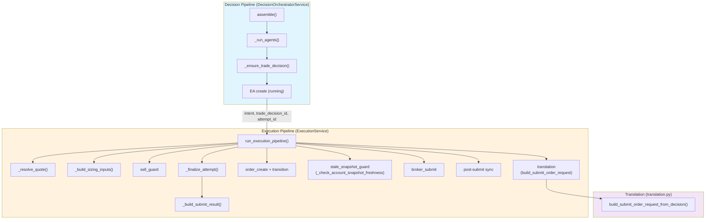
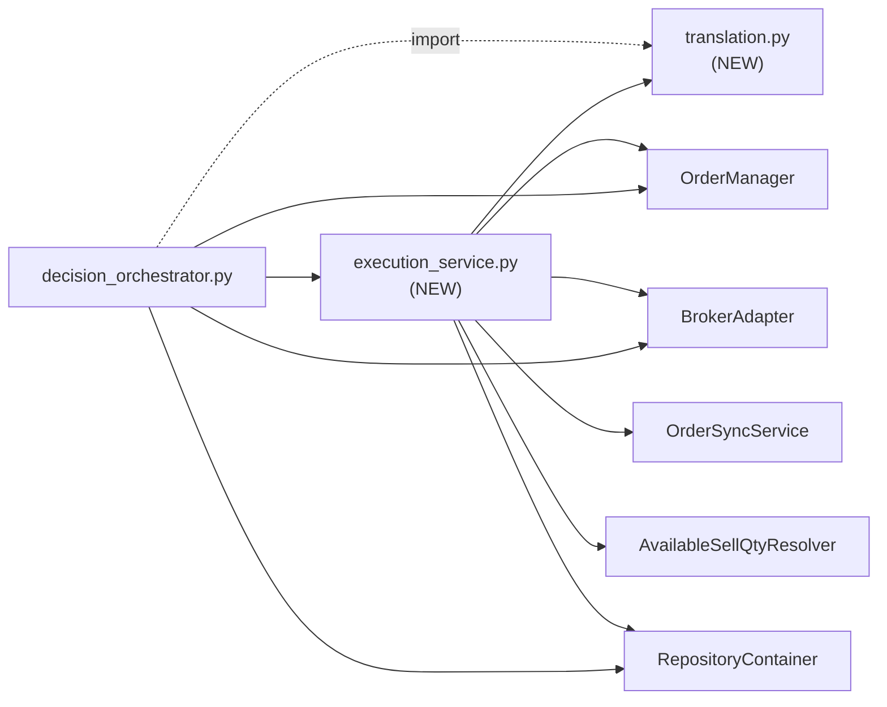

# Phase 7.3: Decision/Execution Pipeline Separation — Priority 1 + 2 Design

**Date**: 2026-05-23 (v2 — review clarifications applied)
**Author**: Architect
**Status**: Design Final (Approved for Code implementation)
**Supersedes**: N/A (Phase 7.3 after bridge column DROP)

---

## Table of Contents

1. [Executive Summary](#1-executive-summary)
2. [Current Architecture Analysis](#2-current-architecture-analysis)
3. [Target Architecture Overview](#3-target-architecture-overview)
4. [Service State Ownership & Boundary Contract](#4-service-state-ownership--boundary-contract)
5. [Priority 1 — Immediate Low-Risk Extraction](#5-priority-1--immediate-low-risk-extraction)
6. [Priority 2 — Execution Status Consolidation](#6-priority-2--execution-status-consolidation)
7. [`_finalize_attempt()` Responsibility Boundary](#7-_finalize_attempt-responsibility-boundary)
8. [Phase Trace Passing Convention](#8-phase-trace-passing-convention)
9. [translation.py Domain Leakage Guard](#9-translationpy-domain-leakage-guard)
10. [File Change Plan](#10-file-change-plan)
11. [Testing Strategy](#11-testing-strategy)
12. [Verification Checklist](#12-verification-checklist)

---

## 1. Executive Summary

### Objective

Bridge period (Phase 6 → 7.1)가 종료됨에 따라 `trade_decisions` 테이블에서 execution bridge 컬럼이 제거되었다. 이제 코드 구조상 `DecisionOrchestratorService` 내에 혼재되어 있는 **decision 생성 책임**과 **execution 진행 책임**을 분리한다. Phase 7.3의 목표는:

1. **`DecisionOrchestratorService`** — decision 생성 전담 (assemble, AI agents, TradeDecision persist)
2. **`ExecutionService`** (신규) — execution pipeline 전담 (sizing → guard → translate → create → submit + EA lifecycle)
3. **함수/서비스 경계 재정렬** — cheap rename이 아닌 책임 기반 분리
4. **향후 Priority 3/4**에서 thin orchestrator + 독립 pipeline으로 분리할 수 있는 기반 마련

### Scope: Priority 1 + 2

| Priority | Items | Risk | Lines affected |
|----------|-------|------|----------------|
| P1 | 3 extractions | Low | ~150 lines move |
| P2 | 3 consolidations | Medium | ~200 lines refactor |
| **Total** | **6 items** | Low-Med | ~350 lines |

**비범위 (Priority 3/4)**: P3 (thin orchestrator), P4 (독립 pipeline → 별도 `run_execution_pipeline()` 함수)

### Key Design Decisions

1. **in-process 분리, 별도 프로세스 아님** — `ExecutionService`는 같은 프로세스 내 새 클래스
2. **DecisionOrchestratorService가 ExecutionService를 composition** — `assemble_and_submit()`에서 두 서비스를 순차 호출
3. **모든 execution 상태 read는 `ExecutionService`를 통해서만** — 더 이상 `_repos.execution_attempts.*` 직접 호출 금지
4. **테스트는 기존 `_run_execution_pipeline()`의 행동을 그대로 보존** — 리팩토링 = 구조 변경, 행동 변경 아님
5. **`phase_trace`는 명시적 인자 전달 (instance state 금지)** — `_finalize_attempt()`, `_build_submit_result()` 모두 `phase_trace`를 매개변수로 받음
6. **`_finalize_attempt()`는 EA persist만 담당, `SubmitResult` 생성은 `_build_submit_result()`에 위임** — 두 책임 분리
7. **`translation.py`는 순수 변환 함수만 포함** — repo 조회, logger, settings 참조 금지

---

## 2. Current Architecture Analysis

### 2.1 DecisionOrchestratorService (3,521 lines) 구조

```
DecisionOrchestratorService
├── __init__()                          # lines 449-500
├── assemble()                          # lines 562-930 — DECISION
├── assemble_and_submit()               # lines 936-1023 — ORCHESTRATOR
│   ├── _run_decision_pipeline()        # lines 1935-2039 — DECISION
│   └── _run_execution_pipeline()       # lines 1029-1933 — EXECUTION (~900 lines)
├── _run_execution_pipeline()           # *** THE MAIN TARGET ***
├── _run_decision_pipeline()            # EA creation (lines 2010-2037) — MIXED
├── _build_sizing_inputs()              # lines 2041-2164 — EXECUTION
├── _check_account_snapshot_freshness() # lines 2166-2236 — EXECUTION
├── _ensure_or_create_decision_context()# lines 2238-2394 — DECISION
├── _resolve_active_context()           # lines 2396-2409 — DECISION
├── _resolve_decision_context()         # lines 2411-2422 — DECISION
├── _run_agents()                       # lines 2428-2737 — DECISION
├── _run_agents_in_subprocess()         # lines 2743-2908 — DECISION
├── _ensure_trade_decision()            # lines 2910-3016 — DECISION
└── (instance state)                    # quote circuit breaker — EXECUTION
```

### 2.2 Identified Duplication Patterns

#### Pattern A: EA `update_status()` — 11 identical call sites

모든 execution phase exit point에서 동일한 패턴:

```python
if _attempt_id is not None:
    await self._repos.execution_attempts.update_status(
        _attempt_id, "<status>",
        stop_phase="<phase>",
        stop_reason="<reason>",
        phase_trace=_phase_trace_to_dicts(_phase_trace),
        order_request_id=...,        # optional, 4/11 sites
        completed_at=datetime.now(timezone.utc),
    )
```

| # | Phase | Line | Status | stop_phase | stop_reason | order_request_id |
|---|-------|------|--------|------------|-------------|-----------------|
| 1 | sizing skip | 1228-1235 | `stopped` | `sizing` | `sizing_rejected` | ❌ |
| 2 | sell_guard skip | 1316-1323 | `stopped` | `sell_guard` | `sell_guard_blocked` | ❌ |
| 3 | translation skip | 1398-1405 | `non_trade` | `translation` | `decision_hold/watch` | ❌ |
| 4 | order_create error | 1446-1453 | `stopped` | `order_create` | `order_create_failed` | ❌ |
| 5 | transition error | 1483-1491 | `stopped` | `transition` | `transition_failed` | ✅ |
| 6 | stale_guard (account) | 1641-1649 | `stopped` | `stale_snapshot_guard` | `stale_snapshot` | ✅ |
| 7 | stale_guard (run) | 1727-1735 | `stopped` | `stale_snapshot_guard` | `stale_snapshot` | ✅ |
| 8 | broker_submit error | 1831-1839 | `failed` | `broker_submit` | `broker_submit_failed` | ✅ |
| 9 | post-submit (completed) | 1904-1919 | `submitted/reconcile_required/failed` | `completed` | ❌ | ✅ |

→ **9 EA `update_status()` sites** (counting distinct, some have 2 calls per site = ~11 total in trace)

#### Pattern B: `SubmitResult` creation — 10 identical call sites

```python
return SubmitResult(
    status="SKIPPED"/"ERROR",
    intent=intent,
    order=...,                    # optional
    error_phase="<phase>",
    error_message="<message>",
    trade_decision_id=trade_decision_id,
    decision_context_id=intent.decision_context_id,
    phase_trace=tuple(_phase_trace),
)
```

→ **`tuple(_phase_trace)` coercion**이 10곳에서 중복

#### Pattern C: `_phase_trace_to_dicts()` — called 11 times

```python
_phase_trace_to_dicts(_phase_trace)
```

→ 간단한 helper지만 모든 phase exit에서 호출됨 → `_finalize_attempt()` 내부로 이동

### 2.3 Mixed Responsibility Points

| Location | Current | Target |
|----------|---------|--------|
| `_run_decision_pipeline()` lines 2010-2037 | EA `ExecutionAttemptEntity` 생성 | ✅ Decision pipeline에 EA 생성은 적절함 (decision 완료 후 실행 시작을 기록) |
| `_check_account_snapshot_freshness()` | Orchestrator method | → ExecutionService로 이동 |
| `build_submit_order_request_from_decision()` | Module-level function in orchestrator.py | → `translation.py` 별도 모듈 |
| `_phase_trace_to_dicts()` | Module-level function in orchestrator.py | → ExecutionService internal helper |
| Quote circuit breaker state | `self._quote_*` in orchestrator | → ExecutionService instance state |

---

## 3. Target Architecture Overview

### 3.1 New Service: `ExecutionService`

**File**: [`src/agent_trading/services/execution_service.py`](src/agent_trading/services/execution_service.py) (new)

**Responsibility**: All execution-phase logic — sizing → guard → translate → create → submit → EA lifecycle

```python
class ExecutionService:
    """Execution pipeline service: sizing → guard → translate → create → submit.

    Owns all execution-phase state (quote circuit breaker) and encapsulates
    ``ExecutionAttempt`` lifecycle management.  Called by
    ``DecisionOrchestratorService.assemble_and_submit()`` after the decision
    pipeline completes.
    """

    def __init__(
        self,
        repos: RepositoryContainer,
        *,
        stale_threshold_seconds: int = 900,
        sync_service: OrderSyncService | None = None,
        snapshot_refresh_cb: Callable[[UUID], Awaitable[None]] | None = None,
    ) -> None:
        self._repos = repos
        self._stale_threshold_seconds = stale_threshold_seconds
        self._sync_service = sync_service
        self._snapshot_refresh_cb = snapshot_refresh_cb
        self._sell_guard_resolver = AvailableSellQtyResolver(repos=repos)
        # EXE-002: quote circuit breaker + cache state
        self._quote_failures: dict[str, int] = {}
        self._quote_skip_until: dict[str, datetime] = {}
        self._quote_cache: dict[str, tuple[Quote, datetime]] = {}

    async def run_execution_pipeline(
        self,
        intent: OrderIntent,
        trade_decision_id: UUID | None,
        attempt_id: UUID | None,
        request: SubmitOrderRequest,
        order_manager: OrderManager,
        broker: BrokerAdapter,
        *,
        actor_type: str = "system",
        actor_id: str = "decision_orchestrator",
        _add_phase: Callable[[str, str], None],
        _phase_trace: list[PhaseTraceEntry],
    ) -> SubmitResult:
        """Execution pipeline entry point — moved from DecisionOrchestratorService."""
        ...
```

### 3.2 Updated `DecisionOrchestratorService`

```python
class DecisionOrchestratorService:
    """Decision-only orchestrator: AI assembly → TradeDecision persist → EA create.

    Execution pipeline is delegated to ``ExecutionService``.
    """

    def __init__(
        self,
        repos: RepositoryContainer,
        *,
        execution_service: ExecutionService,  # NEW
        stale_threshold_seconds: int = 900,
        score_calculator: ScoreCalculator | None = None,
        event_interpretation_agent: ProviderAIAgent | None = None,
        ai_risk_agent: ProviderAIAgent | None = None,
        final_decision_agent: ProviderAIAgent | None = None,
        agent_recorder: AgentRunRecorder | None = None,
        sync_service: OrderSyncService | None = None,
        snapshot_refresh_cb: Callable[[UUID], Awaitable[None]] | None = None,
        use_subprocess_isolation: bool | None = None,
        llm_provider: str = "deepseek",
        provider_api_key: str = "",
        provider_base_url: str = "",
        provider_model_id: str = "",
        provider_timeout_seconds: int = 120,
    ) -> None:
        ...
        self._execution_service = execution_service  # NEW
        # REMOVED from orchestrator: _quote_failures, _quote_skip_until, _quote_cache
        # REMOVED from orchestrator: _sell_guard_resolver
        # REMOVED from orchestrator: _sync_service, _snapshot_refresh_cb

    async def assemble_and_submit(self, ...) -> SubmitResult:
        """Decision pipeline → execution pipeline (via ExecutionService)."""
        ...
        intent, trade_decision_id, _attempt_id, error = await self._run_decision_pipeline(...)
        if error is not None:
            return error
        return await self._execution_service.run_execution_pipeline(
            intent=intent,
            trade_decision_id=trade_decision_id,
            attempt_id=_attempt_id,
            request=request,
            order_manager=order_manager,
            broker=broker,
            actor_type=actor_type,
            actor_id=actor_id,
            _add_phase=_add_phase,
            _phase_trace=_phase_trace,
        )
```

### 3.3 New Module: `translation.py`

**File**: [`src/agent_trading/services/translation.py`](src/agent_trading/services/translation.py) (new)

```python
"""Deterministic translation layer: ``OrderIntent`` → ``SubmitOrderRequest``.

This module contains the pure translation logic that was previously in
``decision_orchestrator.build_submit_order_request_from_decision()``.
It has no dependencies on ``DecisionOrchestratorService`` or ``ExecutionService``.
"""


def build_submit_order_request_from_decision(
    intent: OrderIntent,
    client_order_id: str | None = None,
) -> SubmitOrderRequest | None:
    """Translate an ``OrderIntent`` into a ``SubmitOrderRequest``.

    (identical implementation, moved from decision_orchestrator.py)
    """
    ...
```

### 3.4 Architecture Diagram



---

## 4. Service State Ownership & Boundary Contract

### 4.1 `ExecutionService` Owns (Instance State)

| State Variable | Type | Scope | Purpose |
|----------------|------|-------|---------|
| `_repos` | `RepositoryContainer` | Constructor → read/write | All DB access (EA, TD, positions, cash, guardrails, sync runs) |
| `_stale_threshold_seconds` | `int` | Constructor → read-only | Stale snapshot threshold |
| `_sync_service` | `OrderSyncService | None` | Constructor → optional | Phase 5.5 post-submit sync |
| `_snapshot_refresh_cb` | `Callable | None` | Constructor → optional | Snapshot refresh callback |
| `_sell_guard_resolver` | `AvailableSellQtyResolver` | Constructor → read | Sell guard dependency |
| `_quote_failures` | `dict[str, int]` | Instance → mutable | Symbol → consecutive failure count |
| `_quote_skip_until` | `dict[str, datetime]` | Instance → mutable | Symbol → circuit breaker deadline |
| `_quote_cache` | `dict[str, tuple[Quote, datetime]]` | Instance → mutable | Symbol → (cached quote, timestamp) |

### 4.2 `ExecutionService` Does NOT Own

| Item | Why excluded |
|------|--------------|
| AI agent instances (EI/AR/FDC) | Decision-only concern |
| `AgentRunRecorder` | Decision-only concern |
| `ScoreCalculator` | Decision-only concern |
| Subprocess isolation state | Decision-only concern |
| Provider config (api_key, base_url, etc.) | Decision-only concern |
| `execution_attempts` repo **directly** | Accessed only via `_finalize_attempt()` |
| `_phase_trace` | **Never stored as instance state** — always passed as parameter |

### 4.3 `ExecutionService` State Access Rules

- **Mutable state**: Only quote circuit breaker (`_quote_*`). All other state is read-only after constructor.
- **No concurrent execution**: `run_execution_pipeline()` is called sequentially from `assemble_and_submit()`. There is **no parallel execution** of multiple pipelines on the same `ExecutionService` instance. This is safe because:
  - The scheduler runs one `assemble_and_submit()` per symbol per cycle
  - Quote circuit breaker is symbol-keyed, so concurrent calls for different symbols are safe
  - If concurrent execution is ever needed, quote circuit breaker remains safe (per-symbol keys)
- **No external state mutation**: `ExecutionService` never mutates `DecisionOrchestratorService` state or global state.

### 4.4 `DecisionOrchestratorService` State After Removal

| Kept | Removed (moved to ExecutionService) |
|------|--------------------------------------|
| `_repos` (shared) | `_quote_failures` |
| `_score_calculator` | `_quote_skip_until` |
| `_event_interpretation_agent` | `_quote_cache` |
| `_ai_risk_agent` | `_sell_guard_resolver` |
| `_final_decision_agent` | `_sync_service` |
| `_agent_recorder` | `_snapshot_refresh_cb` |
| `_use_subprocess_isolation` | |
| Provider config (llm, api_key, etc.) | |
| **NEW**: `_execution_service` | |

---

## 5. Priority 1 — Immediate Low-Risk Extraction

### P1.1: `_phase_trace_to_dicts()` → ExecutionService internal helper

**Current**: Module-level function at [`src/agent_trading/services/decision_orchestrator.py:3024`](src/agent_trading/services/decision_orchestrator.py:3024)

```python
def _phase_trace_to_dicts(phase_trace: list[PhaseTraceEntry]) -> list[dict[str, object]]:
    return [
        {"phase": e.phase, "elapsed_ms": e.elapsed_ms, "status": e.status}
        for e in phase_trace
    ]
```

**Target**: Move to [`src/agent_trading/services/execution_service.py`](src/agent_trading/services/execution_service.py) as module-level private function (or `@staticmethod` on `ExecutionService`). Same implementation.

**Rationale**: This is only used inside `_run_execution_pipeline()` for EA `update_status()`. Decision pipeline does not use it.

**Steps**:
1. Copy function to `execution_service.py`
2. Update imports in `decision_orchestrator.py` (remove `_phase_trace_to_dicts` reference)
3. Verify all callers are inside `_run_execution_pipeline()` → all will be in `ExecutionService`

---

### P1.2: `build_submit_order_request_from_decision()` → `translation.py`

**Current**: Module-level function at [`src/agent_trading/services/decision_orchestrator.py:3426`](src/agent_trading/services/decision_orchestrator.py:3426)

```python
def build_submit_order_request_from_decision(
    intent: OrderIntent,
    client_order_id: str | None = None,
) -> SubmitOrderRequest | None:
```

**Target**: Move to [`src/agent_trading/services/translation.py`](src/agent_trading/services/translation.py) (new file).

**Rationale**:
- Pure transformation function (OrderIntent → SubmitOrderRequest)
- No dependencies on `DecisionOrchestratorService` or `ExecutionService` state
- Used by both `_run_execution_pipeline()` and potentially by future standalone services
- `SubmitOrderRequest` needs import (already in `decision_orchestrator.py`)

**Dependencies**:
- `from agent_trading.services.decision_orchestrator import OrderIntent`
- `from agent_trading.domain.entities import SubmitOrderRequest` (or wherever it's defined)
- `from agent_trading.config.settings import ...` (if logger needed)

**Steps**:
1. Create `src/agent_trading/services/translation.py`
2. Move function + its direct dependencies (imports)
3. Update `decision_orchestrator.py` → `from agent_trading.services.translation import build_submit_order_request_from_decision`
4. Update `execution_service.py` → same import

---

### P1.3: `_check_account_snapshot_freshness()` → ExecutionService

**Current**: Method on `DecisionOrchestratorService` at [`src/agent_trading/services/decision_orchestrator.py:2166`](src/agent_trading/services/decision_orchestrator.py:2166)

```python
async def _check_account_snapshot_freshness(
    self, account_id: UUID
) -> AccountSnapshotFreshness:
```

**Target**: Move to `ExecutionService` as-is. Only uses `self._repos.*` and `self._stale_threshold_seconds`, both available in `ExecutionService`.

**Rationale**: Only called from `_run_execution_pipeline()` stale snapshot guard phase. No decision pipeline dependency.

**Steps**:
1. Copy method to `ExecutionService`
2. Verify `AccountSnapshotFreshness` import is available
3. Update call site in `_run_execution_pipeline()` → `await self._check_account_snapshot_freshness(...)`

---

## 5. Priority 2 — Execution Status Consolidation

### P2.1: EA `update_status()` → `_finalize_attempt()` single method

**Current**: 9 call sites with ~15 lines each → ~135 lines of duplicated code

```python
# Current pattern (9 repetitions)
if _attempt_id is not None:
    await self._repos.execution_attempts.update_status(
        _attempt_id, "<status>",
        stop_phase="<phase>",
        stop_reason="<reason>",
        phase_trace=_phase_trace_to_dicts(_phase_trace),
        order_request_id=...,        # optional
        completed_at=datetime.now(timezone.utc),
    )
```

**Target**: Single method on `ExecutionService`:

```python
async def _finalize_attempt(
    self,
    attempt_id: UUID | None,
    status: str,
    *,
    stop_phase: str | None = None,
    stop_reason: str | None = None,
    order_request_id: UUID | None = None,
    phase_trace: list[PhaseTraceEntry] | None = None,
) -> None:
    """Update ExecutionAttempt status with phase_trace and completed_at.

    Safe no-op when ``attempt_id`` is ``None``.
    ``phase_trace`` is serialized to dicts internally; ``completed_at`` is
    always set to the current UTC timestamp.

    This method handles **only EA persist concerns**:
    - ``execution_attempts.update_status()``
    - ``phase_trace`` JSONB serialization
    - ``completed_at`` timestamp
    - terminal metadata (``stop_phase``, ``stop_reason``, ``order_request_id``)

    It does **not** create ``SubmitResult`` — that is the responsibility
    of ``_build_submit_result()``.
    """
    if attempt_id is None:
        return
    await self._repos.execution_attempts.update_status(
        attempt_id,
        status,
        stop_phase=stop_phase,
        stop_reason=stop_reason,
        phase_trace=_phase_trace_to_dicts(phase_trace) if phase_trace else None,
        order_request_id=order_request_id,
        completed_at=datetime.now(timezone.utc),
    )
```

**Call site transformation** (example from sizing skip, line 1228):

```python
# BEFORE (15 lines)
if _attempt_id is not None:
    await self._repos.execution_attempts.update_status(
        _attempt_id, "stopped",
        stop_phase="sizing",
        stop_reason="sizing_rejected",
        phase_trace=_phase_trace_to_dicts(_phase_trace),
        completed_at=datetime.now(timezone.utc),
    )

# AFTER (1 line)
await self._finalize_attempt(
    _attempt_id, "stopped",
    stop_phase="sizing",
    stop_reason="sizing_rejected",
    phase_trace=_phase_trace,
)
```

**Total savings**: ~135 lines → ~9 lines (126 lines removed)

**Phase trace passing convention**: `_phase_trace` is **always passed as an explicit parameter** to `_finalize_attempt()`. It is never stored as instance state on `ExecutionService`. The `_phase_trace` list is already a parameter of `run_execution_pipeline()` (passed in from `assemble_and_submit()`), so it's in scope at every call site.

---

### P2.2: `SubmitResult` creation → `_build_submit_result()` factory method

**Current**: 10 call sites with ~8 lines each → ~80 lines of duplicated code

```python
# Current pattern (10 repetitions)
return SubmitResult(
    status="SKIPPED"/"ERROR",
    intent=intent,
    order=...,                    # optional
    error_phase="<phase>",
    error_message="<message>",
    trade_decision_id=trade_decision_id,
    decision_context_id=intent.decision_context_id,
    phase_trace=tuple(_phase_trace),
)
```

**Target**: Factory method on `ExecutionService`:

```python
def _build_submit_result(
    self,
    status: str,
    *,
    intent: OrderIntent,
    error_phase: str | None = None,
    error_message: str | None = None,
    order: OrderRequestEntity | None = None,
    trade_decision_id: UUID | None = None,
    decision_context_id: UUID | None = None,
    phase_trace: list[PhaseTraceEntry] | None = None,
) -> SubmitResult:
    """Build a ``SubmitResult`` with consistent phase_trace coercion.

    ``phase_trace`` is explicitly passed (never read from instance state).
    Returns a tuple copy to guarantee immutability on the result object.
    """
    return SubmitResult(
        status=status,
        intent=intent,
        order=order,
        error_phase=error_phase,
        error_message=error_message,
        trade_decision_id=trade_decision_id,
        decision_context_id=decision_context_id or intent.decision_context_id,
        phase_trace=tuple(phase_trace) if phase_trace else (),
    )
```

**Call site transformation** (example from sizing skip, line 1236):

```python
# BEFORE
return SubmitResult(
    status="SKIPPED",
    intent=intent,
    trade_decision_id=trade_decision_id,
    decision_context_id=intent.decision_context_id,
    error_phase="sizing",
    error_message=sizing_result.skip_reason or "Sizing rejected order",
    phase_trace=tuple(_phase_trace),
)

# AFTER
return self._build_submit_result(
    "SKIPPED",
    intent=intent,
    trade_decision_id=trade_decision_id,
    error_phase="sizing",
    error_message=sizing_result.skip_reason or "Sizing rejected order",
    phase_trace=_phase_trace,
)
```

**Total savings**: ~80 lines → ~10 lines (70 lines removed)

---

### P2.3: Quote resolution → `_resolve_quote()` method extraction

**Current**: Inline quote resolution logic at [`src/agent_trading/services/decision_orchestrator.py:1058-1166`](src/agent_trading/services/decision_orchestrator.py:1058-1166) (~110 lines)

The current code has:
1. HP sell bypass check (lines 1067-1078)
2. Circuit breaker check (lines 1087-1093)
3. Cache check (lines 1095-1108)
4. Live quote fetch with timeout (lines 1109-1116)
5. Cache save + failure reset (lines 1118-1120)
6. Failure tracking + circuit breaker open (lines 1126-1131)
7. Error fallback + phase trace update

**Target**: Extract into clean method on `ExecutionService`:

```python
async def _resolve_quote(
    self,
    symbol: str,
    market: str,
    intent: OrderIntent,
    *,
    _add_phase: Callable[[str, str], None],
) -> Quote | dict:
    """Resolve a quote for the given symbol with circuit breaker and caching.

    Returns a ``Quote`` on success, or an empty ``dict`` when:
    - HP sell bypass (REDUCE/EXIT SELL)
    - Circuit breaker open
    - Quote fetch timeout/error
    """
    # HP sell bypass
    _is_hp_sell = (
        intent.request.side == OrderSide.SELL
        and intent.ai_backend_inputs.decision_type in ("REDUCE", "EXIT")
    )
    if _is_hp_sell:
        logger.info("HP_SELL_QUOTE_BYPASS: symbol=%s", symbol)
        return {}

    if intent.request.price is not None:
        return {}  # limit order, no quote needed

    # Circuit breaker check
    skip_until = self._quote_skip_until.get(symbol)
    if skip_until and datetime.now(timezone.utc) < skip_until:
        logger.info("Quote circuit breaker open for %s", symbol)
        _add_phase(f"quote_resolution/{symbol}", "circuit_breaker_skip")
        return {}

    # Cache check
    cached = self._quote_cache.get(symbol)
    if cached is not None:
        cached_quote, cached_at = cached
        if (datetime.now(timezone.utc) - cached_at).total_seconds() < _QUOTE_CACHE_TTL:
            _add_phase(f"quote_resolution/{symbol}", "cache_hit")
            return cached_quote
        del self._quote_cache[symbol]

    # Live fetch
    try:
        quote = await asyncio.wait_for(
            broker.get_quote(symbol, market),
            timeout=10.0,
        )
        self._quote_cache[symbol] = (quote, datetime.now(timezone.utc))
        self._quote_failures.pop(symbol, None)
        _add_phase(f"quote_resolution/{symbol}", "ok")
        return quote
    except (asyncio.TimeoutError, Exception):
        failures = self._quote_failures.get(symbol, 0) + 1
        self._quote_failures[symbol] = failures
        if failures >= _CIRCUIT_BREAKER_THRESHOLD:
            self._quote_skip_until[symbol] = datetime.now(timezone.utc) + timedelta(
                seconds=_CIRCUIT_BREAKER_COOLDOWN
            )
        logger.warning("Quote fetch failed for %s", symbol, exc_info=True)
        return Quote(symbol=symbol, market=market, bid=None, ..., ask=None)
```

**Call site transformation** (from lines 1058-1166):

```python
# BEFORE (~110 lines inline)
reference_price = None
if _is_hp_sell:
    ...
elif intent.request.price is None:
    # circuit breaker, cache, fetch logic...

# AFTER (~10 lines)
_quote = await self._resolve_quote(
    intent.request.symbol, intent.request.market, intent,
    _add_phase=_add_phase,
)
reference_price = _quote.ask if isinstance(_quote, Quote) else None
```

---

## 7. `_finalize_attempt()` Responsibility Boundary

### 7.1 Exact Scope

| Responsibility | Included | Rationale |
|---------------|----------|-----------|
| `execution_attempts.update_status()` | ✅ Yes | Core purpose |
| `phase_trace` JSONB serialization | ✅ Yes | Always needed with status update |
| `completed_at` timestamp | ✅ Yes | Always needed with status update |
| Terminal metadata (`stop_phase`, `stop_reason`) | ✅ Yes | Part of status update |
| `order_request_id` linkage | ✅ Yes | Optional, part of status update |
| `SubmitResult` creation | ❌ **No** | Delegate to `_build_submit_result()` |
| Any other side effect (logging, guardrail eval) | ❌ **No** | Each phase handles its own side effects |

### 7.2 Why This Boundary Matters

- `_finalize_attempt()` = **EA persist concern only**
- `_build_submit_result()` = **return value construction only**
- They are called **together** at each phase exit, but they are **separate concerns**:

```python
# At each phase exit — two calls, two responsibilities:
await self._finalize_attempt(
    _attempt_id, "stopped",
    stop_phase="sizing",
    stop_reason="sizing_rejected",
    phase_trace=_phase_trace,
)
return self._build_submit_result(
    "SKIPPED",
    intent=intent,
    trade_decision_id=trade_decision_id,
    error_phase="sizing",
    error_message=sizing_result.skip_reason or "Sizing rejected order",
    phase_trace=_phase_trace,
)
```

**Rationale**: If `_finalize_attempt()` also created `SubmitResult`, it would need to return it, which conflates DB write with return value construction. Keeping them separate allows:
- Testing EA persistence independently from result construction
- Future changes to `SubmitResult` shape without touching EA persist logic
- Clear single-responsibility in each method

---

## 8. Phase Trace Passing Convention

### 8.1 Rule: Explicit Parameter, Never Instance State

`_phase_trace` is **never stored as `self._phase_trace`** on `ExecutionService`. It is always passed as an explicit parameter.

| Method | How it receives `phase_trace` |
|--------|-------------------------------|
| `run_execution_pipeline()` | Parameter from `assemble_and_submit()` caller |
| `_finalize_attempt()` | Explicit `phase_trace` parameter |
| `_build_submit_result()` | Explicit `phase_trace` parameter |
| `_resolve_quote()` | Does not need phase_trace (uses `_add_phase` callback) |

### 8.2 Rationale

1. **Avoids mutable instance state** — The `_phase_trace` list is mutated by `_add_phase()` throughout the pipeline. Storing it as `self._phase_trace` would make it look like shared mutable state, even though `ExecutionService` is not used concurrently.

2. **Explicit dependency** — Method signatures clearly declare their dependency on `phase_trace`. This makes testing easier (no implicit setup) and reading easier (data flow is visible).

3. **No cleanup ceremony** — No need for `try/finally: self._phase_trace = None`.

### 8.3 Call Site Pattern

```python
# Inside run_execution_pipeline():
# _phase_trace is already a parameter — pass it through
await self._finalize_attempt(
    _attempt_id, "stopped",
    stop_phase="sizing",
    stop_reason="sizing_rejected",
    phase_trace=_phase_trace,
)
return self._build_submit_result(
    "SKIPPED",
    intent=intent,
    ...
    phase_trace=_phase_trace,
)
```

---

## 9. `translation.py` Domain Leakage Guard

### 9.1 What `translation.py` MUST NOT Contain

| Leakage Type | Example | Consequence |
|-------------|---------|-------------|
| Repository access | `self._repos.*` | Violates purity, creates DB dependency |
| Logger side effects | `logger.info(...)` | Violates purity, couples to logging |
| Settings/config | `settings.*` | Violates determinism |
| Domain entity creation beyond `SubmitOrderRequest` | `TradeDecisionEntity(...)` | Scope creep |
| AI agent references | EI/AR/FDC imports | Architectural leak |

### 9.2 What `translation.py` MAY Contain

- Pure type definitions (if needed, but prefer importing)
- Pure transformation logic
- `SubmitOrderRequest` construction
- `OrderIntent` → `SubmitOrderRequest` mapping

### 9.3 Current State Audit of `build_submit_order_request_from_decision()`

| Line | Content | Leakage? |
|------|---------|----------|
| 3464-3469 | `decision_type in actionable_types` check | ✅ Pure logic |
| 3472-3477 | `if decision_type == "WATCH": logger.info(...)` | ❌ **Remove logger** |
| 3480-3481 | `if intent.request.quantity <= 0` | ✅ Pure logic |
| 3484-3493 | `client_order_id` generation | ✅ Pure logic |
| 3498-3520 | `SubmitOrderRequest(...)` construction | ✅ Pure construction |

**Action**: Remove the `logger.info()` call from the WATCH check in `build_submit_order_request_from_decision()` when moving to `translation.py`. The WATCH skip is silent — logging is the caller's responsibility.

### 9.4 Final `translation.py` Signature

```python
"""Deterministic translation: OrderIntent → SubmitOrderRequest.

This module contains ONLY pure transformation functions.
No repository access, no logging, no settings.
"""

from agent_trading.services.decision_orchestrator import OrderIntent
from agent_trading.domain.entities import SubmitOrderRequest


def build_submit_order_request_from_decision(
    intent: OrderIntent,
    client_order_id: str | None = None,
) -> SubmitOrderRequest | None:
    # Pure logic only — no logger, no repos, no settings
    ...
```

---

## 10. File Change Plan

### 10.1 Files to Create

| File | Content | From |
|------|---------|------|
| [`src/agent_trading/services/execution_service.py`](src/agent_trading/services/execution_service.py) | `ExecutionService` class + `_phase_trace_to_dicts()` | New |
| [`src/agent_trading/services/translation.py`](src/agent_trading/services/translation.py) | `build_submit_order_request_from_decision()` | New |

### 6.2 Files to Modify

| File | Change |
|------|--------|
| [`src/agent_trading/services/decision_orchestrator.py`](src/agent_trading/services/decision_orchestrator.py) | Remove: `_run_execution_pipeline()`, `_build_sizing_inputs()`, `_check_account_snapshot_freshness()`, `_phase_trace_to_dicts()`, `build_submit_order_request_from_decision()`, quote circuit breaker state, `_sell_guard_resolver`, `_sync_service`, `_snapshot_refresh_cb`; Add: `_execution_service` composition; Update: `assemble_and_submit()` to delegate to `ExecutionService` |
| [`src/agent_trading/services/__init__.py`](src/agent_trading/services/__init__.py) | Add exports for `ExecutionService`, `build_submit_order_request_from_decision` |
| [`src/agent_trading/runtime/bootstrap.py`](src/agent_trading/runtime/bootstrap.py) | Wire `ExecutionService` creation; pass to `DecisionOrchestratorService` |
| [`tests/api/test_inspection.py`](tests/api/test_inspection.py) | No changes expected (API responses unchanged) |
| [`tests/services/test_decision_orchestrator.py`](tests/services/test_decision_orchestrator.py) | Update `DecisionOrchestratorService` instantiation to include `execution_service`; add `ExecutionService` tests |

### 6.3 Inline `_run_execution_pipeline()` Code Layout in `ExecutionService`

```
execution_service.py (~350 lines)
├── _QUOTE_CACHE_TTL constant              (from orchestrator module scope)
├── _CIRCUIT_BREAKER_THRESHOLD constant    (from orchestrator module scope)
├── _CIRCUIT_BREAKER_COOLDOWN constant     (from orchestrator module scope)
├── _phase_trace_to_dicts()                (P1.1)
├── class ExecutionService:
│   ├── __init__()
│   ├── run_execution_pipeline()
│   │   └── self._phase_trace = _phase_trace
│   │   ├── self._resolve_quote()          (P2.3)
│   │   ├── self._build_sizing_inputs()    (moved from orchestrator)
│   │   ├── sell_guard logic
│   │   ├── build_submit_order_request_from_decision()  (import from translation.py)
│   │   ├── order_manager.create_order()
│   │   ├── transition_to(VALIDATED/PENDING_SUBMIT)
│   │   ├── self._check_account_snapshot_freshness()  (P1.3)
│   │   ├── order_manager.submit_order_to_broker()
│   │   ├── post-submit sync
│   │   ├── self._finalize_attempt()       (P2.1)
│   │   └── self._build_submit_result()    (P2.2)
│   ├── _resolve_quote()                   (P2.3)
│   ├── _build_sizing_inputs()
│   ├── _check_account_snapshot_freshness()(P1.3)
│   ├── _finalize_attempt()                (P2.1)
│   └── _build_submit_result()             (P2.2)
```

### 6.4 Module Dependency Graph



### 6.5 Bootstrap Wiring Change

**Current** ([`src/agent_trading/runtime/bootstrap.py`](src/agent_trading/runtime/bootstrap.py)):

```python
orchestrator = DecisionOrchestratorService(
    repos=repos,
    sync_service=sync_service,
    snapshot_refresh_cb=snapshot_refresh_cb,
    ...
)
```

**Target**:

```python
execution_service = ExecutionService(
    repos=repos,
    stale_threshold_seconds=900,
    sync_service=sync_service,
    snapshot_refresh_cb=snapshot_refresh_cb,
)
orchestrator = DecisionOrchestratorService(
    repos=repos,
    execution_service=execution_service,
    stale_threshold_seconds=900,
    sync_service=sync_service,        # retained for decision pipeline
    snapshot_refresh_cb=snapshot_refresh_cb,
    ...
)
```

### 6.6 Test Changes

**Current test instantiation** (e.g., [`tests/api/test_inspection.py`](tests/api/test_inspection.py) or conftest):

```python
orchestrator = DecisionOrchestratorService(
    repos=repos,
    sync_service=Mock(),
    snapshot_refresh_cb=Mock(),
    ...
)
```

**Target**:

```python
execution_service = ExecutionService(
    repos=repos,
    stale_threshold_seconds=900,
    sync_service=Mock(),
    snapshot_refresh_cb=Mock(),
)
orchestrator = DecisionOrchestratorService(
    repos=repos,
    execution_service=execution_service,
    sync_service=Mock(),
    ...
)
```

---

## 7. Testing Strategy

### 7.1 Existing Tests — No Behavioral Change

All existing tests must pass with zero behavioral change:

| Test suite | Expected | Notes |
|-----------|----------|-------|
| `test_inspection.py` | ✅ Pass | API responses unchanged |
| `test_execution_attempts.py` | ✅ Pass | EA endpoints unchanged |
| `test_postgres_execution_attempts.py` | ✅ Pass | Repository unchanged |
| `test_postgres_trade_decisions.py` | ✅ Pass | TD repository unchanged |
| `tests/scripts/test_run_paper_decision_loop.py` | ✅ Pass | Script wiring unchanged |

### 7.2 New Tests for `ExecutionService`

| Test | What it verifies |
|------|-----------------|
| `test_execution_service_init.py` | Constructor sets up quote circuit breaker state correctly |
| `test_execution_service_resolve_quote.py` | Quote resolution with cache hit/miss, circuit breaker open/close, HP sell bypass |
| `test_execution_service_finalize_attempt.py` | `_finalize_attempt()` with/without `attempt_id`, with/without `order_request_id`, phase trace serialization |
| `test_execution_service_build_submit_result.py` | `_build_submit_result()` produces correct tuple coercion for phase_trace |
| `test_execution_service_check_snapshot_freshness.py` | Same behavior as before, moved method |
| `test_execution_service_full_pipeline.py` | Full `run_execution_pipeline()` with mocked dependencies — matches current `_run_execution_pipeline()` behavior |

### 7.3 Updated Tests for `DecisionOrchestratorService`

| Test | What it verifies |
|------|-----------------|
| `test_orchestrator_delegates_to_execution_service.py` | `assemble_and_submit()` calls `ExecutionService.run_execution_pipeline()` with correct args |
| `test_orchestrator_removed_execution_state.py` | Orchestrator no longer has `_quote_*`, `_sell_guard_resolver`, `_sync_service` |
| `test_orchestrator_init_with_execution_service.py` | Constructor accepts and stores `ExecutionService` |

### 7.4 Translation Module Test

| Test | What it verifies |
|------|-----------------|
| `test_translation_build_submit_order_request.py` | (moved from existing test) Same behavior, new module path |

---

## 8. Verification Checklist

### Code Review

- [ ] `ExecutionService` does not import or reference any AI agent logic (EI/AR/FDC)
- [ ] `DecisionOrchestratorService` does not have `_quote_*`, `_sell_guard_resolver`, `_sync_service` state
- [ ] `assemble_and_submit()` delegates to `ExecutionService.run_execution_pipeline()` after decision pipeline
- [ ] `_finalize_attempt()` handles `attempt_id is None` gracefully (safe no-op)
- [ ] `_build_submit_result()` produces correct `tuple(_phase_trace)` coercion
- [ ] `translation.py` has zero dependency on `DecisionOrchestratorService` or `ExecutionService`
- [ ] All constants (`_QUOTE_CACHE_TTL`, `_CIRCUIT_BREAKER_THRESHOLD`, `_CIRCUIT_BREAKER_COOLDOWN`) moved to `execution_service.py`
- [ ] `_phase_trace_to_dicts()` removed from `decision_orchestrator.py`

### Test Verification

- [ ] `147 passed` across 5 core test files (existing tests)
- [ ] New `ExecutionService` tests pass
- [ ] Coverage of `run_execution_pipeline()` in new location matches old `_run_execution_pipeline()` coverage

### Integration Verification

- [ ] Docker rebuild succeeds
- [ ] `/health` endpoint returns 200
- [ ] POST `/paper/decide-and-submit` with BUY/HOLD/WATCH returns correct `SubmitResult`
- [ ] `ExecutionAttempt` rows have correct `status`, `stop_phase`, `stop_reason`, `phase_trace`
- [ ] `TradeDecisionDetail` API response unchanged (phase_trace/latest_* still present from `execution_attempts` LEFT JOIN LATERAL)

### Deployment Note

- **No DB migration required** — this is purely code restructuring
- **No new dependencies** — all imports already exist in the project
- **Backward compatible** — `DecisionOrchestratorService` public API unchanged

---

## Appendix A: Summary of P1 + P2 Line Counts

| Item | Lines removed from orchestrator.py | Lines added to new files |
|------|-----------------------------------|-------------------------|
| P1.1: `_phase_trace_to_dicts()` | -11 | +11 (execution_service.py) |
| P1.2: `build_submit_order_request_from_decision()` | -95 | +95 (translation.py) |
| P1.3: `_check_account_snapshot_freshness()` | -70 | +70 (execution_service.py) |
| P2.1: `_finalize_attempt()` | -126 | +20 (execution_service.py) |
| P2.2: `_build_submit_result()` | -70 | +18 (execution_service.py) |
| P2.3: `_resolve_quote()` | -110 | +80 (execution_service.py) |
| `run_execution_pipeline()` body | -900 | +900 (execution_service.py) |
| Bootstrap wiring | 0 | +10 (bootstrap.py) |
| **Total** | **~1,382 removed** | **~1,204 added** |

**Net reduction**: ~178 lines (from duplication elimination)

**Net line count change in orchestrator.py**: ~1,382 removed + ~10 (composition) = **~3,521 → ~2,150 lines** (39% reduction)

---

## Appendix B: Implementation Order

The recommended implementation order minimizes risk and allows incremental testing:

```mermaid
flowchart LR
    subgraph Step1["Step 1: translation.py"]
        A1["Create translation.py<br/>+ move function"]
        A2["Update import in orchestrator.py"]
    end

    subgraph Step2["Step 2: ExecutionService skeleton"]
        B1["Create execution_service.py<br/>+ class + __init__"]
        B2["Move: _phase_trace_to_dicts"]
        B3["Move: _check_account_snapshot_freshness"]
    end

    subgraph Step3["Step 3: Move _run_execution_pipeline"]
        C1["Move pipeline body<br/>+ _build_sizing_inputs"]
        C2["Update assemble_and_submit()"]
    end

    subgraph Step4["Step 4: P2 consolidation"]
        D1["Add _finalize_attempt()"]
        D2["Add _build_submit_result()"]
        D3["Add _resolve_quote()"]
        D4["Replace 9+10 call sites"]
    end

    subgraph Step5["Step 5: Bootstrap + Tests"]
        E1["Wire in bootstrap.py"]
        E2["Update test conftest"]
        E3["Add new tests"]
        E4["Run all 147 tests"]
    end

    Step1 --> Step2 --> Step3 --> Step4 --> Step5
```



**Step 1** (translation.py, P1.2) — zero risk, pure move  
**Step 2** (execution_service.py skeleton, P1.1+P1.3) — still no behavioral change  
**Step 3** (move pipeline, P1 complete) — at this point the pipeline runs in new location  
**Step 4** (P2 consolidation) — refactor within `ExecutionService`, easily testable  
**Step 5** (integration) — verify everything works end-to-end
