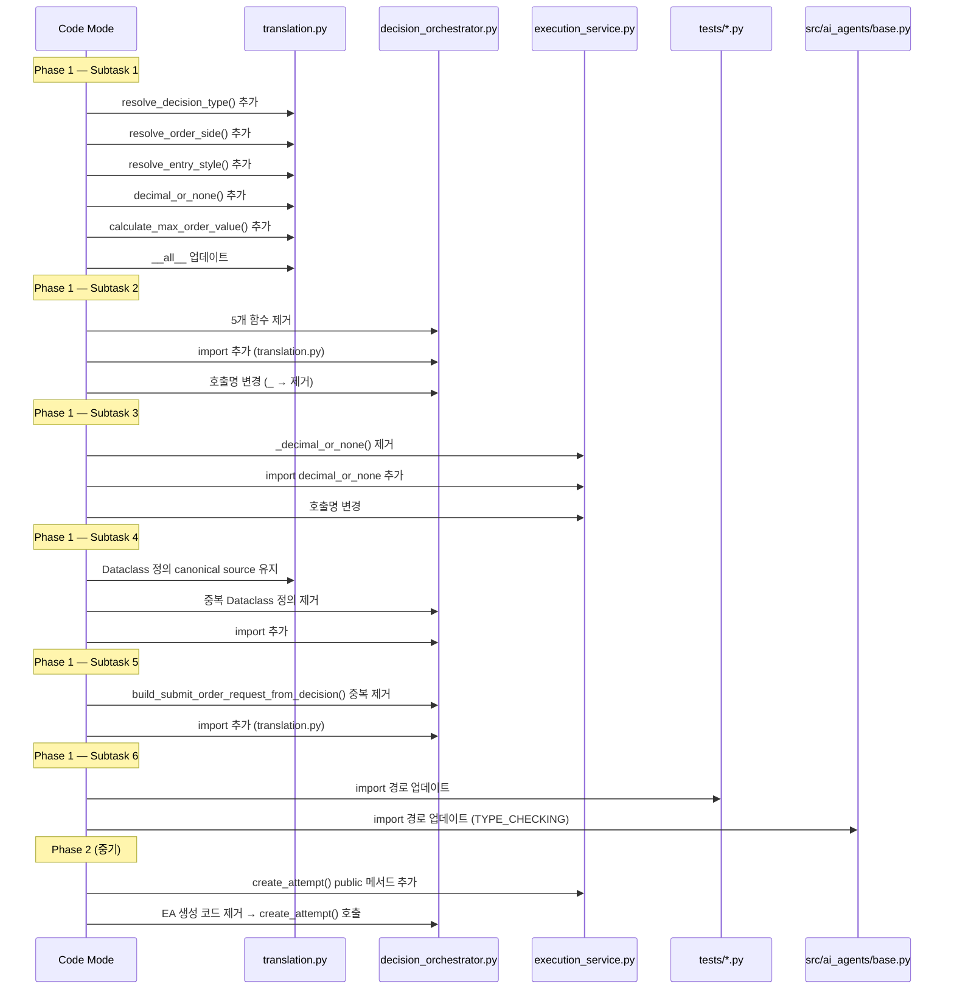
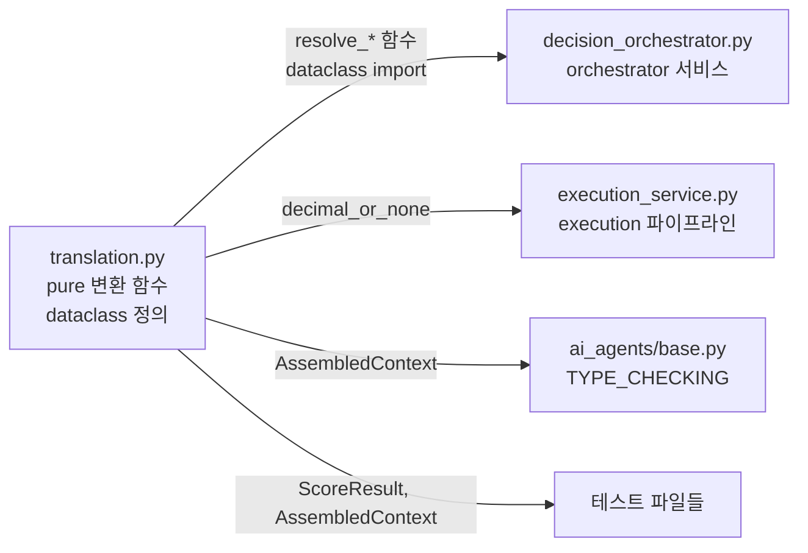

# Execution Pipeline Separation — Refactoring Design Document

## 1. 네 가지 질문에 대한 답변

### Q1. 아직 orchestrator에 남아 있는 execution 책임은 무엇인가?

분석 결과, [`DecisionOrchestratorService`](../src/agent_trading/services/decision_orchestrator.py)에 남아있는 execution/변환 책임은 다음과 같습니다:

#### 1-A. Pure 변환 헬퍼 함수 (모듈 레벨, side-effect 없음)

| 함수 | Lines | 설명 | 사용처 |
|------|-------|------|--------|
| `_resolve_decision_type()` | 2197-2203 | `str` → `DecisionType` enum 변환 | `_ensure_trade_decision()` (1778, 1841) |
| `_resolve_order_side()` | 2206-2212 | `str` → `OrderSide` enum 변환 (fallback) | `_ensure_trade_decision()` (1779, 1842) |
| `_resolve_entry_style()` | 2215-2229 | `str` → `EntryStyle` enum 변환 | `_ensure_trade_decision()` (1783-1785) |
| `_decimal_or_none()` | 2232-2237 | `object` → `Decimal\|None` 변환 | `_ensure_trade_decision()` (1791, 1792) |
| `_calculate_max_order_value()` | 2240-2246 | `price × quantity` 계산 | `_ensure_trade_decision()` (1793-1795) |

이 5개 함수는 **모두** [`_ensure_trade_decision()`](../src/agent_trading/services/decision_orchestrator.py:1774) 메서드 내에서만 사용됩니다. 순수 변환 함수이며, side-effect가 없고, DB/로깅/AI 참조가 없습니다.

#### 1-B. `build_submit_order_request_from_decision()` 중복 정의

이 함수가 **두 파일에 중복**되어 있습니다:
- [`translation.py:193`](../src/agent_trading/services/translation.py:193) — 순수 버전 (로깅 없음)
- [`decision_orchestrator.py:2254`](../src/agent_trading/services/decision_orchestrator.py:2254) — 로깅이 포함된 버전 (`logger.info` for WATCH)

차이점: orchestrator 버전만 WATCH decision 시 `logger.info(...)`를 호출합니다. translation.py 버전은 silent하게 `None`을 반환합니다.

#### 1-C. ExecutionAttemptEntity 생성 로직

[`_run_decision_pipeline()`](../src/agent_trading/services/decision_orchestrator.py:944-1048)의 lines 1019-1046에서 `ExecutionAttemptEntity`를 생성하고 있습니다:

```python
# decision_orchestrator.py:1019-1046
_attempt_id: UUID | None = None
if trade_decision_id is not None and intent.decision_context_id is not None:
    try:
        _now = datetime.now(timezone.utc)
        attempt = ExecutionAttemptEntity(
            execution_attempt_id=uuid4(),
            trade_decision_id=trade_decision_id,
            decision_context_id=intent.decision_context_id,
            status="running",
            started_at=_now,
            created_at=_now,
        )
        saved = await self._repos.execution_attempts.add(attempt)
        _attempt_id = saved.execution_attempt_id
    except Exception:
        ...
```

이 로직은 `self._repos.execution_attempts`에 접근하며, 결정 파이프라인이 완료된 후에만 실행되어야 합니다.

#### 1-D. Dataclass 중복 정의

4개의 dataclass가 두 파일에 중복 정의되어 있습니다:

| Dataclass | decision_orchestrator.py | translation.py |
|-----------|------------------------|----------------|
| `ScoreResult` | line 103-114 | line 56-67 |
| `AIDecisionInputs` | line 117-162 | line 75-120 |
| `AssembledContext` | line 216-245 | line 128-157 |
| `OrderIntent` | line 253-273 | line 165-185 |

`AgentExecutionBundle` (line 165-183)은 orchestrator 전용 내부 타입이므로 중복 대상이 아닙니다.

---

### Q2. 가장 안전하게 다음으로 이동할 경계는 어디인가?

**Phase 1 (즉시 이동 가능): Pure 변환 헬퍼 + Dataclass 통합 + `build_submit_order_request_from_decision` 중복 제거**

이것이 가장 안전한 경계인 이유:
1. **Pure transformation**: 5개 함수 모두 입력→출력이 결정론적이며 side-effect가 없음
2. **이미 translation.py가 동일한 성격의 함수 보유**: `build_submit_order_request_from_decision()`가 이미 translation.py에 존재
3. **중복 제거 효과**: `_decimal_or_none()`은 execution_service.py에도 중복 → 3중 중복
4. **Dataclass 통합**: circular import 문제 해결 (현재 translation.py가 `from agent_trading.services.decision_orchestrator import ...` 없이도 자체 정의 보유)
5. **`build_submit_order_request_from_decision()` 중복**: orchestrator 버전은 logger 호출만 추가 — 이 차이는 caller(execution_service.py)에서 처리 가능

**Phase 2 (중기): EA 생성 이동** — `_run_decision_pipeline()`에서 EA 생성을 `ExecutionService.create_attempt()`로 위임

---

### Q3. Behavior regression 없이 옮길 수 있는 최소 단위는 무엇인가?

#### 최소 단위: Subtask 단위

**Subtask 1**: `translation.py`에 5개 pure 변환 함수 추가 + `__all__` 업데이트
- 새로운 함수만 추가, 기존 함수 제거 없음
- Zero regression risk — 추가만 하므로

**Subtask 2**: `decision_orchestrator.py`에서 5개 함수 제거 + import로 대체
- `from agent_trading.services.translation import resolve_decision_type, ...`
- 함수 시그니처가 동일하므로 `_ensure_trade_decision()` 코드 변경 불필요
- 단, 함수 이름 변경이 필요: `_resolve_decision_type` → `resolve_decision_type` (내부 프라이빗 네이밍 → public 네이밍)

**Subtask 3**: `execution_service.py`에서 `_decimal_or_none` 중복 제거
- `from agent_trading.services.translation import decimal_or_none`
- execution_service.py 내 `_decimal_or_none()` 호출을 `decimal_or_none()`으로 대체

**Subtask 4**: Dataclass 통합
- `translation.py`의 정의를 canonical source로 선정
- `decision_orchestrator.py`에서 중복 정의 제거 + import 추가
- 모든 테스트 import 경로 업데이트

**Subtask 5**: `build_submit_order_request_from_decision` 중복 제거
- orchestrator 버전 제거 (line 2254-2348)
- `from agent_trading.services.translation import build_submit_order_request_from_decision`

**Subtask 6 (Phase 2)**: EA 생성 이동
- `ExecutionService.create_attempt()` public 메서드 추가
- `_run_decision_pipeline()`에서 호출로 대체

---

### Q4. Replay/sizing path에 영향을 주지 않게 하려면 무엇을 고정해야 하는가?

#### 고정해야 할 것들

1. **함수 시그니처 고정**: 새 함수들은 동일한 파라미터와 반환 타입을 유지
   ```python
   # 현재 (decision_orchestrator.py)
   def _resolve_decision_type(value: str | None) -> DecisionType:
   
   # 이동 후 (translation.py)
   def resolve_decision_type(value: str | None) -> DecisionType:  # 동일
   ```

2. **Enum 값 고정**: `DecisionType`, `OrderSide`, `EntryStyle` enum 값이 변경되지 않음

3. **`_ensure_trade_decision()` 메서드 시그니처 고정**: `assemble()` → `_ensure_trade_decision()` 호출 체인 불변

4. **TradeDecisionEntity 생성 로직 고정**: `_ensure_trade_decision()` 내부에서 `TradeDecisionEntity(...)` 생성 시 필드 매핑 불변

5. **replay path**: replay는 `assemble()` → `_run_decision_pipeline()` → `run_execution_pipeline()`을 호출합니다. Phase 1은 `_ensure_trade_decision()` 내부의 import만 변경되므로 replay에 영향 없음.

6. **sizing path**: sizing은 `execution_service.py`의 `run_execution_pipeline()` 내에서 호출됩니다. `run_execution_pipeline()`은 `decimal_or_none()`을 이미 사용 중이므로, import 경로만 변경됩니다.

---

## 2. 상세 설계

### 2.1 Phase 1: Pure 변환 헬퍼 + Dataclass 통합 + 중복 제거

#### 변경 사항 상세

##### A. [`translation.py`](../src/agent_trading/services/translation.py)

**추가할 함수들** (기존 `__all__`에 추가):

```python
__all__ = [
    "AIDecisionInputs",
    "AssembledContext",
    "OrderIntent",
    "ScoreResult",
    "build_submit_order_request_from_decision",
    "resolve_decision_type",      # NEW
    "resolve_order_side",         # NEW
    "resolve_entry_style",        # NEW
    "decimal_or_none",            # NEW
    "calculate_max_order_value",  # NEW
]
```

**필요한 import 추가**:
```python
from agent_trading.domain.enums import DecisionType, EntryStyle, OrderSide, OrderType
from decimal import Decimal
```

**한국어 독스트링/주석은 불필요** — translation.py는 이미 영문 독스트링 컨벤션을 따름.

##### B. [`decision_orchestrator.py`](../src/agent_trading/services/decision_orchestrator.py)

**제거할 항목**:
1. Dataclass 정의 4개 (`ScoreResult`, `AIDecisionInputs`, `AssembledContext`, `OrderIntent`)
2. Module-level helper 함수 5개 (`_resolve_decision_type`, `_resolve_order_side`, `_resolve_entry_style`, `_decimal_or_none`, `_calculate_max_order_value`)
3. `build_submit_order_request_from_decision()` 중복 정의 (line 2254-2348)

**추가할 import**:
```python
from agent_trading.services.translation import (
    AIDecisionInputs,
    AssembledContext,
    OrderIntent,
    ScoreResult,
    build_submit_order_request_from_decision,
    resolve_decision_type,
    resolve_order_side,
    resolve_entry_style,
    decimal_or_none,
    calculate_max_order_value,
)
```

**함수 호출 변경**: `_ensure_trade_decision()` 내에서:
```python
# AS-IS
decision_type=_resolve_decision_type(composer_output.decision_type),
side=_resolve_order_side(composer_output.side, request.side),
entry_style=_resolve_entry_style(composer_output.entry_style, request.order_type),
entry_price=_decimal_or_none(request.price),
quantity=_decimal_or_none(request.quantity),
max_order_value=_calculate_max_order_value(request.price, request.quantity),

# TO-BE (import만 변경, 호출부 변경 없음 - 단 _ 접두사 제거)
decision_type=resolve_decision_type(composer_output.decision_type),
side=resolve_order_side(composer_output.side, request.side),
entry_style=resolve_entry_style(composer_output.entry_style, request.order_type),
entry_price=decimal_or_none(request.price),
quantity=decimal_or_none(request.quantity),
max_order_value=calculate_max_order_value(request.price, request.quantity),
```

다만, `_ensure_trade_decision()`은 `DecisionOrchestratorService`의 인스턴스 메서드이므로, 이미 번역 함수들을 import해서 내부에서 사용 가능하게 됩니다.

함수 시그니처가 동일하므로 (단, 이름에서 `_` 접두사만 제거), 호출부의 파라미터 전달 방식은 완전히 동일합니다.

**빼야 할 import** (더 이상 필요 없는 항목):
- `from agent_trading.domain.enums import DecisionType, EntryStyle, OrderSide, OrderType` — 여전히 필요 (`_check_held_position_sell_override` 등에서 `OrderSide.SELL` 참조)
- `from agent_trading.domain.models import Quote, SubmitOrderRequest` — 여전히 필요

**변경되지 않는 것**: `AgentExecutionBundle`, `ScoreCalculator`, `StubScoreCalculator`, `_event_sort_key`, `_dataclass_to_dict`, `_dict_to_dataclass`, `_check_held_position_sell_override` — orchestrator에 남음.

##### C. [`execution_service.py`](../src/agent_trading/services/execution_service.py)

**제거**: `_decimal_or_none()` (line 1422-1429)

**추가할 import**:
```python
from agent_trading.services.translation import (
    OrderIntent,
    build_submit_order_request_from_decision,
    decimal_or_none,  # NEW
)
```

**변경할 호출**: `_decimal_or_none(` → `decimal_or_none(` (lines 544, 548, 552, 612, 613)

---

### 2.2 Phase 2: ExecutionAttemptEntity 생성 이동 (중기)

#### 변경 사항 상세

##### A. [`execution_service.py`](../src/agent_trading/services/execution_service.py)

**추가할 public 메서드**:
```python
async def create_attempt(
    self,
    trade_decision_id: UUID,
    decision_context_id: UUID,
) -> UUID | None:
    """Create an ExecutionAttemptEntity in RUNNING status.
    
    This is called by the decision pipeline after a TradeDecision is created
    and before the execution pipeline runs. Returns the attempt ID or None
    on failure (non-fatal).
    """
    try:
        _now = datetime.now(timezone.utc)
        attempt = ExecutionAttemptEntity(
            execution_attempt_id=uuid4(),
            trade_decision_id=trade_decision_id,
            decision_context_id=decision_context_id,
            status="running",
            started_at=_now,
            created_at=_now,
        )
        saved = await self._repos.execution_attempts.add(attempt)
        logger.info(
            "[ATTEMPT_CREATED] execution_attempt_id=%s trade_decision_id=%s",
            saved.execution_attempt_id,
            trade_decision_id,
        )
        return saved.execution_attempt_id
    except Exception:
        logger.warning(
            "ExecutionAttempt creation failed (non-fatal). "
            "trade_decision_id=%s",
            trade_decision_id,
            exc_info=True,
        )
        return None
```

**필요한 추가 import**:
```python
from agent_trading.domain.entities import (
    ExecutionAttemptEntity,  # 이미 TYPE_CHECKING에 있음 → runtime import로 변경
    GuardrailEvaluationEntity,
    OrderRequestEntity,
)
```

**`run_execution_pipeline()` 시그니처 변경** (선택 사항):
```python
async def run_execution_pipeline(
    self,
    intent: OrderIntent | None,
    trade_decision_id: UUID | None,
    _attempt_id: UUID | None,          # 현재: orchestrator가 생성한 attempt_id
    request: SubmitOrderRequest,
    ...
) -> SubmitResult:
```

Phase 2에서는 orchestrator가 `_attempt_id` 대신 `trade_decision_id`와 `decision_context_id`를 넘기고, `execution_service.run_execution_pipeline()` 내부에서 `create_attempt()`를 호출.

```python
# TO-BE 시그니처
async def run_execution_pipeline(
    self,
    intent: OrderIntent | None,
    trade_decision_id: UUID | None,
    decision_context_id: UUID | None,  # NEW: EA 생성을 위해 필요
    request: SubmitOrderRequest,
    ...
) -> SubmitResult:
```

##### B. [`decision_orchestrator.py`](../src/agent_trading/services/decision_orchestrator.py)

**`_run_decision_pipeline()` 변경**: lines 1019-1046 EA 생성 코드를 제거하고 `execution_service.create_attempt()` 호출로 대체 (또는 `run_execution_pipeline()`에 위임).

**`assemble_and_submit()` 변경**: `_attempt_id` 전달을 `decision_context_id` 전달로 변경.

---

### 2.3 실행 순서 (Implementation Order)



---

### 2.4 Import 영향 맵

#### Phase 1 적용 후 Import Graph



#### Phase 1 + Phase 2 적용 후 Import Graph

```mermaid
flowchart LR
    trans[translation.py<br/>pure 변환 함수<br/>dataclass 정의]
    orch[decision_orchestrator.py<br/>orchestrator 서비스]
    exec[execution_service.py<br/>execution 파이프라인<br/>+ create_attempt()]
    ai[ai_agents/base.py<br/>TYPE_CHECKING]
    tests[테스트 파일들]
    
    trans -->|resolve_* 함수<br/>dataclass import| orch
    trans -->|decimal_or_none| exec
    trans -->|AssembledContext| ai
    trans -->|ScoreResult, AssembledContext| tests
    orch -.->|run_execution_pipeline 호출| exec
    orch -.->|매개변수로 trade_decision_id,<br/>decision_context_id 전달| exec
```

---

### 2.5 회귀 방지 전략 (Regression Prevention)

#### 전략 1: 점진적 적용 (Subtask 단위)
- 각 subtask는 독립적으로 배포 가능
- 각 subtask 후 pytest 실행으로 회귀 검증
- Subtask 1은 새로운 함수만 추가 — Zero regression

#### 전략 2: 동일 시그니처 유지
- 모든 pure 함수는 동일한 파라미터 타입과 반환 타입 유지
- `_decimal_or_none()` in execution_service.py vs translation.py: execution_service 버전이 더 견고함 (try/except 있음)
  - translation.py 버전은 orchestrator 버전을 기준으로 (simpler)
  - execution_service.py의 `_decimal_or_none()`을 제거할 때는 translation.py 버전이 더 견고해야 함
  - **해결**: translation.py에 추가할 `decimal_or_none()`은 execution_service.py의 try/except 버전을 채택

#### 전략 3: Replay path 영향 없음
- Replay path (`_run_one_cycle` → `assemble_and_submit()`)는 Phase 1에서 변경되지 않음
- `_ensure_trade_decision()` 내부에서 import 경로만 변경됨

#### 전략 4: Sizing path 영향 없음
- Sizing은 `execution_service.py`에서만 호출됨
- `decimal_or_none()` import 경로만 변경됨

#### 전략 5: 동등성 검증
- 각 함수의 이전/이후 동작 비교:
  - `_resolve_decision_type(None)` → `DecisionType.HOLD` (동일)
  - `_resolve_decision_type("buy")` → `DecisionType.BUY` (동일)
  - `_resolve_order_side(None, OrderSide.BUY)` → `OrderSide.BUY` (동일)
  - `decimal_or_none(None)` → `None` (동일)
  - `calculate_max_order_value(Decimal("100"), Decimal("10"))` → `Decimal("1000")` (동일)

---

### 2.6 테스트 파일 영향 범위

Phase 1에서 변경이 필요한 파일들:

| 파일 | 변경 사항 |
|------|----------|
| [`tests/services/test_hold_bias_mitigation.py`](../tests/services/test_hold_bias_mitigation.py:36) | `from agent_trading.services.decision_orchestrator import AssembledContext` → `from agent_trading.services.translation import AssembledContext` |
| [`tests/scripts/test_t1_t3_interaction_analysis.py`](../tests/scripts/test_t1_t3_interaction_analysis.py:48) | 동일 |
| [`tests/scripts/test_fdc_skip.py`](../tests/scripts/test_fdc_skip.py:36) | 동일 |
| [`tests/services/ai_agents/test_base.py`](../tests/services/ai_agents/test_base.py:17) | 동일 |
| [`tests/services/ai_agents/test_agents.py`](../tests/services/ai_agents/test_agents.py:571) | 동일 |
| [`tests/services/test_decision_submit_pipeline.py`](../tests/services/test_decision_submit_pipeline.py:1444, 1547, 1612, 1715, 1810) | `from agent_trading.services.decision_orchestrator import ScoreResult` → `from agent_trading.services.translation import ScoreResult` |
| [`src/agent_trading/services/ai_agents/base.py`](../src/agent_trading/services/ai_agents/base.py:19) | `from agent_trading.services.decision_orchestrator import AssembledContext` → `from agent_trading.services.translation import AssembledContext` (TYPE_CHECKING) |

---

### 2.7 실행 예상 결과

#### Phase 1 완료 후 orchestrator 책임 분포

| 책임 영역 | 현재 | Phase 1 후 |
|-----------|------|------------|
| AI agent orchestration (assemble) | orchestrator | orchestrator |
| TradeDecision persistence | orchestrator | orchestrator |
| Decision context 관리 | orchestrator | orchestrator |
| Held position sell override | orchestrator | orchestrator |
| Scoring | orchestrator | orchestrator |
| Pure 변환 함수 | orchestrator (중복) | translation.py (단일) |
| Dataclass 정의 | 양쪽 (중복) | translation.py (단일) |
| EA 생성 | orchestrator | orchestrator (Phase 2 대상) |
| Execution pipeline | execution_service | execution_service |

#### Phase 2 완료 후 orchestrator 책임 분포

| 책임 영역 | Phase 1 후 | Phase 2 후 |
|-----------|------------|------------|
| AI agent orchestration (assemble) | orchestrator | orchestrator |
| TradeDecision persistence | orchestrator | orchestrator |
| Decision context 관리 | orchestrator | orchestrator |
| Held position sell override | orchestrator | orchestrator |
| Scoring | orchestrator | orchestrator |
| Pure 변환 함수 | translation.py | translation.py |
| Dataclass 정의 | translation.py | translation.py |
| EA 생성 | orchestrator | execution_service |
| Execution pipeline | execution_service | execution_service |

---

## 3. Subtask 상세 명세

### Subtask 1: translation.py에 pure 변환 함수 추가

**변경 파일**: [`src/agent_trading/services/translation.py`](../src/agent_trading/services/translation.py)

**작업**:
1. `__all__`에 새 함수 5개 추가
2. `from agent_trading.domain.enums import DecisionType, EntryStyle, OrderSide, OrderType` import 추가
3. `from decimal import Decimal` import 추가 (이미 있을 수 있음)
4. 함수 5개 추가 (execution_service.py의 try/except 버전 채택한 `decimal_or_none()` 포함)

**회귀 검증**: `pytest tests/ -x -q` (함수 추가만 있으므로 항상 통과)

### Subtask 2: decision_orchestrator.py에서 중복 함수 제거

**변경 파일**: [`src/agent_trading/services/decision_orchestrator.py`](../src/agent_trading/services/decision_orchestrator.py)

**작업**:
1. import block에 `from agent_trading.services.translation import (...)` 추가
2. Module-level helper 함수 5개 제거 (lines 2197-2246)
3. `_ensure_trade_decision()` 내 호출명 변경 (`_resolve_decision_type` → `resolve_decision_type`)
4. `build_submit_order_request_from_decision()` 중복 제거 (lines 2254-2348)

### Subtask 3: execution_service.py에서 중복 _decimal_or_none() 제거

**변경 파일**: [`src/agent_trading/services/execution_service.py`](../src/agent_trading/services/execution_service.py)

**작업**:
1. import에 `decimal_or_none` 추가
2. `_decimal_or_none()` 함수 제거 (lines 1422-1429)
3. 호출 5개 변경 (`_decimal_or_none(` → `decimal_or_none(`)

### Subtask 4: Dataclass 통합

**변경 파일**: [`src/agent_trading/services/decision_orchestrator.py`](../src/agent_trading/services/decision_orchestrator.py), 모든 테스트 파일

**작업**:
1. `decision_orchestrator.py`에서 `ScoreResult`, `AIDecisionInputs`, `AssembledContext`, `OrderIntent` 정의 제거
2. `translation.py`에서 import
3. 모든 테스트 import 경로 업데이트
4. `ai_agents/base.py` import 경로 업데이트

### Subtask 5 (Phase 2): EA 생성 이동

**변경 파일**: [`src/agent_trading/services/execution_service.py`](../src/agent_trading/services/execution_service.py), [`src/agent_trading/services/decision_orchestrator.py`](../src/agent_trading/services/decision_orchestrator.py)

**작업**:
1. `execution_service.py`에 `create_attempt()` public 메서드 추가
2. `_run_decision_pipeline()`에서 EA 생성 코드 제거 → `execution_service.create_attempt()` 호출
3. `assemble_and_submit()`에서 호출 순서 조정
4. `run_execution_pipeline()` 시그니처 변경 (선택 사항)
