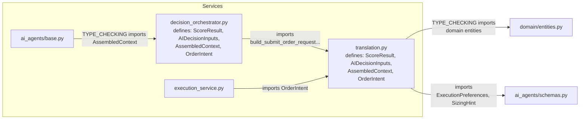
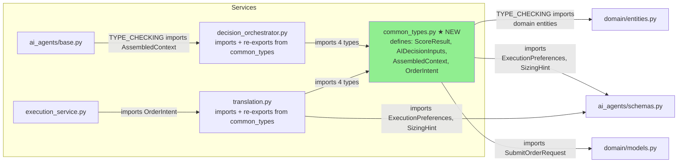

# Execution Pipeline Separation — Phase 2: 공통 타입 통합 및 ExecutionAttemptEntity 책임 이동

- **작성일**: 2026-05-24
- **대상 파일**:
  - `src/agent_trading/services/common_types.py` (신규)
  - `src/agent_trading/services/decision_orchestrator.py` (변경)
  - `src/agent_trading/services/translation.py` (변경)
  - `src/agent_trading/services/execution_service.py` (변경)

---

## 1. 현재 아키텍처 분석

### 1.1 타입 중복 현황

4개의 dataclass 타입이 [`decision_orchestrator.py`](/src/agent_trading/services/decision_orchestrator.py:111)와 [`translation.py`](/src/agent_trading/services/translation.py:58)에 **완전 동일하게 중복 정의**되어 있음:

| 타입 | `decision_orchestrator.py` 라인 | `translation.py` 라인 | 필드 완전 일치 |
|------|------|------|------|
| `ScoreResult` | 111-122 | 58-69 | ✅ |
| `AIDecisionInputs` | 125-170 | 77-122 | ✅ |
| `AssembledContext` | 224-253 | 130-159 | ✅ |
| `OrderIntent` | 261-281 | 167-187 | ✅ |

**비교**: `AgentExecutionBundle`([`decision_orchestrator.py`](/src/agent_trading/services/decision_orchestrator.py:173))은 orchestrator 전용 타입이므로 이동 불필요.

### 1.2 실행 책임 분포

| 책임 | 현재 위치 | 성격 |
|------|----------|------|
| AI agent assemble (EI/AR/FDC) | `DecisionOrchestratorService.assemble()` | decision |
| TradeDecisionEntity 생성 | `DecisionOrchestratorService._ensure_trade_decision()` (assemble 내) | decision |
| **ExecutionAttemptEntity 생성** | **`_run_decision_pipeline()` lines 1027-1054** | **execution ← 이동 대상** |
| `get_by_context()` 중복 조회 | `_run_decision_pipeline()` lines 1016-1025 | 불필요 ← 제거 대상 |
| Sizing / Sell Guard / Submit | `ExecutionService.run_execution_pipeline()` | execution |
| EA finalize (`_finalize_attempt`) | `ExecutionService.run_execution_pipeline()` (9개 호출 지점) | execution |

### 1.3 Import 그래프 (현재)



**문제점**:
- 동일 타입이 2개 파일에 중복되어 유지보수 시 불일치 위험
- `execution_service.py`는 `translation.py`에서 `OrderIntent` import
- 모든 테스트 파일은 `decision_orchestrator.py`에서 타입 import (총 38개 참조 지점)
- `ai_agents/base.py`는 `decision_orchestrator`에서 `AssembledContext` import (TYPE_CHECKING)

---

## 2. Step 1 상세 설계: `common_types.py` 생성

### 2.1 신규 파일: `src/agent_trading/services/common_types.py`

**설계 원칙**:
1. 순수 dataclass만 포함, 비즈니스 로직 없음
2. `domain/models.py`와 `ai_agents/schemas.py`만 import (현재와 동일)
3. `slots=True, frozen=True` 유지
4. 모든 필드와 docstring을 기존 정의에서 그대로 복사

**전체 인터페이스**:

```python
"""공통 데이터 타입 — decision pipeline과 execution pipeline 간 계약.

이 모듈은 ``DecisionOrchestratorService``와 ``ExecutionService`` 및
``translation`` 모듈이 공유하는 데이터 타입을 정의한다.

Design rules
------------
1. Pure dataclass only — no business logic, no repository access.
2. No AI agent references — only ``SubmitOrderRequest`` (API model) and
   ``ExecutionPreferences`` / ``SizingHint`` (agent schemas).
3. ``slots=True, frozen=True`` — immutable, memory-efficient.
"""

from __future__ import annotations

from dataclasses import dataclass, field
from typing import TYPE_CHECKING
from uuid import UUID

from agent_trading.domain.models import SubmitOrderRequest
from agent_trading.services.ai_agents.schemas import (
    ExecutionPreferences,
    SizingHint,
)

if TYPE_CHECKING:
    from agent_trading.domain.entities import (
        CashBalanceSnapshotEntity,
        ConfigVersionEntity,
        DecisionContextEntity,
        ExternalEventEntity,
        PositionSnapshotEntity,
        RiskLimitSnapshotEntity,
    )


@dataclass(slots=True, frozen=True)
class ScoreResult:
    """Deterministic scoring result from a ``ScoreCalculator``.

    This is a **stub** — actual scoring logic is deferred. The structure
    is defined now so that downstream consumers (``OrderIntent``,
    ``AssembledContext``) can reference it.
    """

    score: float = 0.0
    threshold: float = 0.0
    reason_codes: tuple[str, ...] = ()


@dataclass(slots=True, frozen=True)
class AIDecisionInputs:
    """Normalised backend contract carrying v1 Provider AI Agent outputs.

    This is the **only** channel through which EI / AR / FDC agent outputs
    reach the deterministic backend (``OrderIntent`` → ``OrderManager``).

    Design rules
    ------------
    1. Raw agent outputs are **not** carried — only normalised fields
       that the deterministic backend can consume.
    2. Every field has a deterministic default — safe fallback guaranteed
       even when every agent fails.
    3. This contract does **not** modify ``SubmitOrderRequest``.
    4. ``OrderManager``, ``BrokerAdapter``, ``ReconciliationService``
       boundaries are unchanged.
    """

    # ── FDC-derived ──────────────────────────────────────────────────
    decision_type: str = "HOLD"
    confidence: float = 0.0
    conviction: float = 0.0
    reason_codes: tuple[str, ...] = ()
    opposing_evidence: tuple[str, ...] = ()
    execution_preferences: ExecutionPreferences = field(
        default_factory=ExecutionPreferences
    )
    sizing_hint: SizingHint = field(default_factory=SizingHint)
    side: str = ""

    # ── AR-derived ───────────────────────────────────────────────────
    risk_opinion: str = "allow"
    risk_score: float = 0.0
    risk_confidence: float = 0.0
    size_adjustment_factor: float = 0.0
    risk_reason_codes: tuple[str, ...] = ()
    risk_flags: tuple[str, ...] = ()

    # ── EI-derived ───────────────────────────────────────────────────
    event_bias: str = "neutral"
    event_conflict: bool = False
    event_reason_codes: tuple[str, ...] = ()

    # ── Metadata ─────────────────────────────────────────────────────
    source_agent_names: tuple[str, ...] = ()
    schema_versions: tuple[tuple[str, str], ...] = ()


@dataclass(slots=True, frozen=True)
class AssembledContext:
    """Fully assembled context for a single order intent.

    This aggregates all available information at decision time:
    the active decision context, the governing config version,
    recent external events, a deterministic score, and richer
    deterministic account / risk data (position, cash, risk limits).

    All fields are optional — the service assembles what it can and
    leaves missing pieces as ``None`` or empty.

    Parameters
    ----------
    source_type
        Origin of this symbol in the trading universe:
        ``"core"`` | ``"held_position"`` | ``"event_overlay"`` | ``"market_overlay"``.
        Used by FDC to differentiate no-event policy per source type.
    """

    decision_context: DecisionContextEntity | None = None
    config_version: ConfigVersionEntity | None = None
    recent_events: tuple[ExternalEventEntity, ...] = ()
    score: ScoreResult = field(default_factory=ScoreResult)
    position_snapshot: PositionSnapshotEntity | None = None
    cash_balance_snapshot: CashBalanceSnapshotEntity | None = None
    risk_limit_snapshot: RiskLimitSnapshotEntity | None = None
    source_type: str = "core"


@dataclass(slots=True, frozen=True)
class OrderIntent:
    """Structured order intent assembled by the DecisionOrchestratorService.

    This is a **deterministic stub** — it does not perform any LLM
    orchestration. Its sole responsibility is to assemble P1 fields
    (``decision_context_id``, ``order_intent_id``) into a
    ``SubmitOrderRequest``.

    Full LLM-based orchestration is deferred to a later milestone.
    """

    decision_context_id: UUID | None
    order_intent_id: UUID | None
    request: SubmitOrderRequest
    context: AssembledContext = field(default_factory=AssembledContext)
    config_version_id: UUID | None = None
    reason_codes: tuple[str, ...] = ()
    ai_backend_inputs: AIDecisionInputs = field(default_factory=AIDecisionInputs)
```

> **참고**: `OrderIntent`에 `trade_decision_id` 필드를 추가하는 것은 Step 3에서 설명.

### 2.2 `translation.py` 변경 사항

기존 중복 타입 정의 4개 삭제 → `common_types`에서 import + re-export:

```python
# translation.py 변경 후
from agent_trading.services.common_types import (
    AIDecisionInputs,
    AssembledContext,
    OrderIntent,
    ScoreResult,
)

__all__ = [
    "AIDecisionInputs",
    "AssembledContext",
    "OrderIntent",
    "ScoreResult",
    "build_submit_order_request_from_decision",
    # ... 기타 함수들
]
```

### 2.3 `decision_orchestrator.py` 변경 사항

기존 중복 타입 정의 4개 삭제 → `common_types`에서 import:

```python
# decision_orchestrator.py 변경 후 — 기존 타입 정의 블록 제거 (lines 111-281)
# 대신 import로 대체:
from agent_trading.services.common_types import (
    AIDecisionInputs,
    AssembledContext,
    OrderIntent,
    ScoreResult,
)
```

**중요**: `ai_agents/base.py`에서 `TYPE_CHECKING` 하에 `decision_orchestrator.AssembledContext`를 import하므로, 이 re-export가 유지되어야 함.

---

## 3. Step 2 상세 설계: `ExecutionAttemptEntity` 생성 이동

### 3.1 현재 코드 (orchestrator → execution_service 이동)

**삭제 대상**: [`_run_decision_pipeline()`](/src/agent_trading/services/decision_orchestrator.py:1027-1054)

```python
# decision_orchestrator.py - _run_decision_pipeline() 내부 (삭제)
# ── ExecutionAttempt 생성 (running) ──
_attempt_id: UUID | None = None
if trade_decision_id is not None and intent.decision_context_id is not None:
    try:
        _now = datetime.now(timezone.utc)
        attempt = ExecutionAttemptEntity(
            execution_attempt_id=uuid4(),
            trade_decision_id=trade_decision_id,
            decision_context_id=intent.decision_context_id,
            status="running",
            started_at=_now,
            created_at=_now,
        )
        saved = await self._repos.execution_attempts.add(attempt)
        _attempt_id = saved.execution_attempt_id
        logger.info(
            "[ATTEMPT_CREATED] execution_attempt_id=%s trade_decision_id=%s",
            _attempt_id, trade_decision_id,
        )
    except Exception:
        logger.warning(
            "ExecutionAttempt creation failed (non-fatal). trade_decision_id=%s",
            trade_decision_id, exc_info=True,
        )
        _attempt_id = None
```

**이동 대상**: [`run_execution_pipeline()`](/src/agent_trading/services/execution_service.py:621) 시작 부분에 추가

```python
# execution_service.py - run_execution_pipeline() 시작 부분 (추가)
async def run_execution_pipeline(
    self,
    intent: OrderIntent,
    trade_decision_id: UUID | None,
    attempt_id: UUID | None,     # ← 기존: orchestrator가 생성한 ID를 받음
    request: SubmitOrderRequest,
    ...
) -> SubmitResult:
    """Execution pipeline: EA create → sizing → guard → translate → create → submit."""
    
    # ── Phase 1.4: ExecutionAttemptEntity 생성 (orchestrator에서 이동) ──
    _attempt_id: UUID | None = attempt_id  # fallback: 외부에서 전달된 값
    if _attempt_id is None and trade_decision_id is not None and intent.decision_context_id is not None:
        try:
            _now = datetime.now(timezone.utc)
            attempt = ExecutionAttemptEntity(
                execution_attempt_id=uuid4(),
                trade_decision_id=trade_decision_id,
                decision_context_id=intent.decision_context_id,
                status="running",
                started_at=_now,
                created_at=_now,
            )
            saved = await self._repos.execution_attempts.add(attempt)
            _attempt_id = saved.execution_attempt_id
            logger.info(
                "[ATTEMPT_CREATED] execution_attempt_id=%s trade_decision_id=%s",
                _attempt_id, trade_decision_id,
            )
        except Exception:
            logger.warning(
                "ExecutionAttempt creation failed (non-fatal). trade_decision_id=%s",
                trade_decision_id, exc_info=True,
            )
            _attempt_id = None
    
    # 이후 기존 Phase 1.5 sizing 로직... (기존 _attempt_id 참조를 _attempt_id로 변경)
```

### 3.2 시그니처 변경

**`_run_decision_pipeline()` 반환값 변경**:
- 현재: `tuple[OrderIntent | None, UUID | None, UUID | None, SubmitResult | None]`
  - 두 번째 요소: `trade_decision_id`
  - 세 번째 요소: `_attempt_id` (ExecutionAttemptEntity ID)
- 변경 후: `tuple[OrderIntent | None, UUID | None, SubmitResult | None]`
  - 세 번째 요소 제거 (attempt_id를 여기서 생성하지 않음)

**`run_execution_pipeline()` 시그니처**:
- 현재: `attempt_id: UUID | None` (orchestrator가 생성한 ID 수신)
- 변경 후: optional 유지 (외부에서 전달 가능하나, 내부 생성 로직이 기본)

### 3.3 `assemble_and_submit()` 조정

```python
# 변경 전
intent, trade_decision_id, _attempt_id, pipeline_result = await self._run_decision_pipeline(...)
return await self._execution_service.run_execution_pipeline(
    intent, trade_decision_id, _attempt_id, request, ...

# 변경 후
intent, trade_decision_id, pipeline_result = await self._run_decision_pipeline(...)
return await self._execution_service.run_execution_pipeline(
    intent, trade_decision_id, None, request, ...
    # attempt_id=None → execution_service 내부에서 생성
)
```

---

## 4. Step 3 상세 설계: 중복 `get_by_context()` 제거

### 4.1 문제 분석

`_run_decision_pipeline()`에서 (via `assemble()`):
1. [`assemble()`](/src/agent_trading/services/decision_orchestrator.py:796)에서 `_ensure_trade_decision()` 호출 → `trade_decision_id` 반환
2. `assemble()`은 `OrderIntent`만 반환하고 `trade_decision_id`는 폐기
3. [`_run_decision_pipeline()`](/src/agent_trading/services/decision_orchestrator.py:1016-1025)에서 `get_by_context()`로 다시 조회

```python
# 불필요한 중복 조회 (lines 1016-1025)
trade_decision_id: UUID | None = None
if intent.decision_context_id is not None:
    try:
        td = await self._repos.trade_decisions.get_by_context(
            intent.decision_context_id
        )
        if td is not None:
            trade_decision_id = td.trade_decision_id
    except Exception:
        pass
```

### 4.2 해결: `OrderIntent`에 `trade_decision_id` 필드 추가

**`common_types.py`의 `OrderIntent`** 에 새 필드 추가:

```python
@dataclass(slots=True, frozen=True)
class OrderIntent:
    decision_context_id: UUID | None
    order_intent_id: UUID | None
    request: SubmitOrderRequest
    context: AssembledContext = field(default_factory=AssembledContext)
    config_version_id: UUID | None = None
    reason_codes: tuple[str, ...] = ()
    ai_backend_inputs: AIDecisionInputs = field(default_factory=AIDecisionInputs)
    # ★ 신규: Step 3 - get_by_context() 중복 조회 제거를 위해 assemble()에서 직접 설정
    trade_decision_id: UUID | None = None
```

**`assemble()` 변경** — 반환 시 `trade_decision_id` 포함:

```python
# assemble() return 문 (line 844-852)
return OrderIntent(
    decision_context_id=resolved_context_id,
    order_intent_id=resolved_intent_id,
    request=assembled_request,
    context=assembled_context,
    config_version_id=config_version_id,
    reason_codes=score_result.reason_codes,
    ai_backend_inputs=agent_bundle.ai_inputs,
    trade_decision_id=trade_decision_id,  # ★ 추가
)
```

**`_run_decision_pipeline()` 변경** — `get_by_context()` 제거:

```python
# get_by_context() 블록 전체 제거 (lines 1016-1025)
# 대신 intent에서 직접 추출:
trade_decision_id = intent.trade_decision_id
```

### 4.3 영향도

- `OrderIntent`에 새로운 optional 필드(`trade_decision_id`) 추가 → **이전 코드와 100% 호환** (기본값 `None`)
- 기존 `OrderIntent(...)` 생성 코드는 변경 불필요
- Step 2에서 EA 생성 로직이 execution_service로 이동하면, `trade_decision_id`를 intent에서 추출하여 EA 생성에 사용

---

## 5. Re-export 전략

### 5.1 원칙

기존 import 경로를 유지하여 **테스트 호환성 100% 보장**. 모든 변경은 `decision_orchestrator.py`와 `translation.py`에서 re-export를 통해 이루어짐.

### 5.2 각 파일별 re-export

| 모듈 | 현재 타입 정의 방식 | 변경 후 방식 |
|------|-------------------|-------------|
| `common_types.py` | (신규) | 타입 정의 (단일 진실 공급원) |
| `translation.py` | 자체 정의 | `from common_types import ...` (re-export) |
| `decision_orchestrator.py` | 자체 정의 | `from common_types import ...` (re-export) |

### 5.3 `__all__` 관리

`translation.py`의 `__all__` 유지 (`AIDecisionInputs`, `AssembledContext`, `OrderIntent`, `ScoreResult` 포함).

`decision_orchestrator.py`는 `__all__`이 없으므로 module-level import로 모든 이름이 자동 노출됨.

### 5.4 `build_submit_order_request_from_decision` re-export 현황

이 함수는 이미 `translation.py`에서 정의되고 `decision_orchestrator.py`로 module-level import됨. 테스트에서 `from agent_trading.services.decision_orchestrator import build_submit_order_request_from_decision`로 접근 가능. **변경 불필요**.

### 5.5 `TYPE_CHECKING` import 처리

[`ai_agents/base.py`](/src/agent_trading/services/ai_agents/base.py:19):
```python
if TYPE_CHECKING:
    from agent_trading.services.decision_orchestrator import AssembledContext
```
`decision_orchestrator.py`가 `common_types`에서 `AssembledContext`를 re-export하므로, **변경 불필요**.

---

## 6. 예상 Import 그래프 (변경 후)



**주요 개선점**:
- 단일 진실 공급원(Single Source of Truth): `common_types.py`
- 기존 import 경로 유지 (테스트 영향 0)
- Import cycle 없음 (누구도 `common_types.py`를 import하지 않음)

---

## 7. 리스크 평가 및 롤백 계획

### 7.1 리스크 매트릭스

| Step | 리스크 | 영향 | 발생 가능성 | 완화 전략 |
|------|--------|------|-----------|----------|
| Step 1 | 타입 필드 누락/오차 | 컴파일 타입 에러 | 낮음 | `common_types.py`를 기존 코드에서 그대로 복사 후 diff 검증 |
| Step 1 | re-export 누락 | ImportError | 낮음 | `grep -r "from.*decision_orchestrator.*import"`로 테스트 import 경로 사전 검증 |
| Step 2 | EA 생성 실패 시 `_attempt_id` None 전파 | `_finalize_attempt` no-op | 낮음 | execution_service 내부 try/except 유지, 기존 로직과 동일 |
| Step 2 | `_run_decision_pipeline()` 반환 타입 변경 | `assemble_and_submit()` unpack 오류 | 중간 | 반환 타입 변경을 `assemble_and_submit()`과 동시에 적용 |
| Step 3 | `OrderIntent`에 `trade_decision_id` 추가 | 누락 시 `None` (기존 get_by_context 미발견과 동일) | 낮음 | 기본값 `None`으로 하위 호환 |

### 7.2 롤백 계획

**Step 1 (common_types)** — 롤백 난이도: **낮음**
- 롤백: `common_types.py` 삭제
- `translation.py`와 `decision_orchestrator.py`에서 import 제거하고 기존 타입 정의 복원
- `git checkout -- src/agent_trading/services/translation.py src/agent_trading/services/decision_orchestrator.py`

**Step 2 (EA 이동)** — 롤백 난이도: **중간**
- 롤백: `execution_service.py`에서 EA 생성 코드 제거
- `_run_decision_pipeline()`에 EA 생성 코드 복원
- `assemble_and_submit()`에서 unpack 복원
- `git checkout`으로 3개 파일 복원

**Step 3 (get_by_context 제거)** — 롤백 난이도: **낮음**
- 롤백: `_run_decision_pipeline()`에 `get_by_context()` 블록 복원
- `OrderIntent`에서 `trade_decision_id` 필드 제거 (또는 유지해도 무해)
- 별도 commit으로 관리하여 부분 롤백 가능

### 7.3 실행 순서 및 안전 장치

```
Step 1 (common_types 신규 생성)
  → 테스트: pytest (변경 없음, re-export만)
  → lint: mypy / pyright 타입 검사
  ↓
Step 2 (EA 생성 이동)
  → 테스트: 기존 pipeline 테스트 전면 통과
  → 로그 기반 검증: [ATTEMPT_CREATED] 로그 동일 출력 확인
  ↓
Step 3 (get_by_context 제거)
  → 테스트: pipeline 테스트 + 1회 extra DB call 감소 확인
  → 계측: 불필요한 쿼리 제거로 latency 소폭 감소 기대
```

### 7.4 테스트 범위

| 테스트 영역 | 파일 | 영향도 |
|------------|------|-------|
| decision pipeline 단위 테스트 | `tests/services/test_decision_submit_pipeline.py` | Step 1, 2, 3 |
| order submit pipeline 테스트 | `tests/services/test_submit_order_from_decision.py` | Step 1 |
| orchestrator 단위 테스트 | `tests/services/test_decision_orchestrator.py` | Step 1, 2, 3 |
| e2e pipeline 테스트 | `tests/services/test_safe_order_path_e2e.py` | Step 2, 3 |
| agent subprocess 테스트 | `tests/services/ai_agents/test_agent_subprocess.py` | Step 1 |
| agent 단위 테스트 | `tests/services/ai_agents/test_agents.py` | Step 1 |
| agent orchestrator 테스트 | `tests/services/ai_agents/test_orchestrator_agents.py` | Step 1 |
| paper trading 시나리오 | `tests/services/test_paper_trading_scenarios.py` | Step 1 |
| smoke 테스트 | `tests/smoke/*.py` | Step 1 |

---

## 8. 작업 항목 요약 (Todo List)

### Step 1: `common_types.py` 생성 및 타입 통합
- [ ] `src/agent_trading/services/common_types.py` 파일 생성
- [ ] 4개 타입 정의 (`ScoreResult`, `AIDecisionInputs`, `AssembledContext`, `OrderIntent`) 이전
- [ ] `translation.py` — 중복 타입 정의 삭제, `common_types` import로 대체
- [ ] `decision_orchestrator.py` — 중복 타입 정의 삭제, `common_types` import로 대체
- [ ] `pytest` 및 `mypy` 실행하여 회귀 없음 확인

### Step 2: `ExecutionAttemptEntity` 생성 이동
- [ ] `_run_decision_pipeline()`에서 EA 생성 코드 블록(lines 1027-1054) 삭제
- [ ] `run_execution_pipeline()` 시작 부분에 EA 생성 코드 추가
- [ ] `_run_decision_pipeline()` 반환 타입 변경 (3-tuple → 3-tuple에서 attempt_id 제거)
- [ ] `assemble_and_submit()`에서 unpack 조정
- [ ] `pytest` 실행하여 pipeline 통과 확인

### Step 3: 불필요 `get_by_context()` 제거
- [ ] `OrderIntent`에 `trade_decision_id: UUID | None = None` 필드 추가
- [ ] `assemble()` 반환 시 `trade_decision_id` 누락 없이 전달
- [ ] `_run_decision_pipeline()`에서 `get_by_context()` 블록(lines 1016-1025) 삭제
- [ ] intent에서 직접 `trade_decision_id` 추출
- [ ] `pytest` 실행 확인
