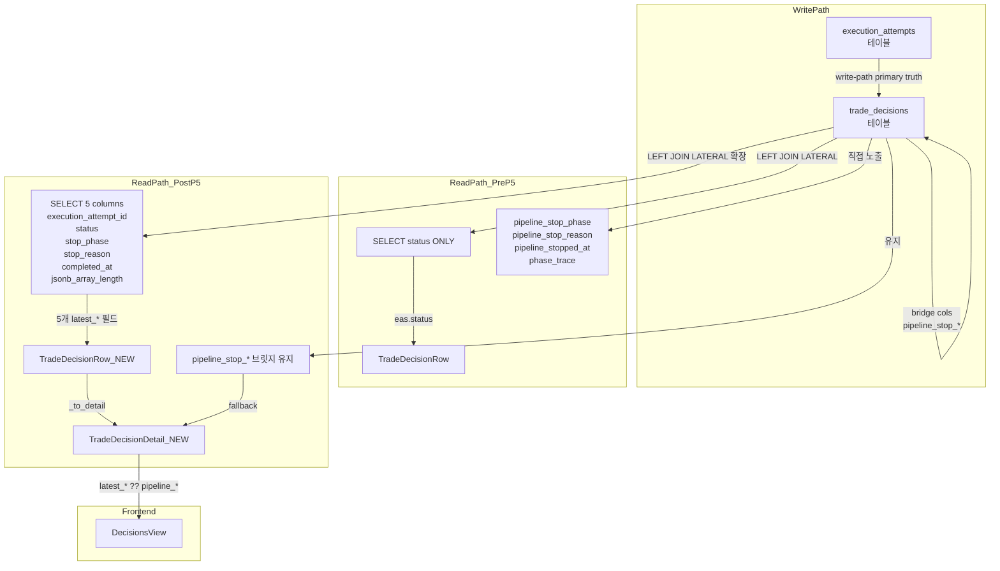

# Phase 5 설계: Read-path ExecutionAttempt 중심 정식화

> **날짜**: 2026-05-23  
> **목적**: `TradeDecisionDetail` read-path에서 `execution_attempts`를 primary truth로 전환  
> **중요**: Bridge period 유지 — bridge 컬럼(`pipeline_stop_phase`, `pipeline_stop_reason`, `pipeline_stopped_at`, `phase_trace`)은 **제거하지 않음**

---

## 상태 흐름 다이어그램



---

## 1. `TradeDecisionRow` (`contracts.py`) — 5개 필드 추가

**현재 상태** ([`contracts.py:75-102`](../../src/agent_trading/repositories/contracts.py:75)):
- `execution_attempt_status: str | None = None` — 1개 필드만 존재

**변경 사항** — [`contracts.py`](../../src/agent_trading/repositories/contracts.py)의 `TradeDecisionRow` dataclass에 5개 필드 추가:

```python
@dataclass(slots=True, frozen=True)
class TradeDecisionRow:
    entity: TradeDecisionEntity
    order_request_id: str | None = None
    order_status: str | None = None
    instrument_name: str | None = None
    phase_trace: list[dict[str, object]] | None = None
    execution_attempt_status: str | None = None

    # ── Phase 5: ExecutionAttempt summary (LEFT JOIN LATERAL 확장) ──
    latest_execution_attempt_id: str | None = None
    """최신 execution attempt의 ID (UI 링크용)."""
    latest_stop_phase: str | None = None
    """ea.stop_phase — execution attempt에서의 중단 단계."""
    latest_stop_reason: str | None = None
    """ea.stop_reason — execution attempt에서의 중단 사유."""
    latest_completed_at: datetime | None = None
    """ea.completed_at — execution attempt 완료 시각."""
    latest_phase_count: int | None = None
    """jsonb_array_length(ea.phase_trace) — phase trace 길이 (SQL 레벨 계산)."""
```

**설계 판단**:
- 기본값 `None`으로 설정 → execution attempt가 없을 때도 `TradeDecisionRow` 생성 가능
- `frozen=True` 유지 (불변성 보장)
- `slots=True` 유지 (메모리 효율성)
- `datetime` 타입의 `latest_completed_at`은 `pipeline_stopped_at`과 타입 일치

---

## 2. SQL LEFT JOIN LATERAL 확장 (`postgres/trade_decisions.py`)

**현재 SQL** ([`trade_decisions.py:217-222`](../../src/agent_trading/repositories/postgres/trade_decisions.py:217)):
```sql
LEFT JOIN LATERAL (
    SELECT status FROM trading.execution_attempts ea
    WHERE ea.trade_decision_id = td.trade_decision_id
    ORDER BY ea.started_at DESC
    LIMIT 1
) eas ON TRUE
```
→ `eas.status AS _execution_attempt_status`만 SELECT

**변경 SQL** — 5개 컬럼으로 확장:
```sql
LEFT JOIN LATERAL (
    SELECT
        ea.execution_attempt_id,
        ea.status,
        ea.stop_phase,
        ea.stop_reason,
        ea.completed_at,
        jsonb_array_length(ea.phase_trace) AS phase_count
    FROM trading.execution_attempts ea
    WHERE ea.trade_decision_id = td.trade_decision_id
    ORDER BY ea.started_at DESC
    LIMIT 1
) eas ON TRUE
```

**매핑 변경** ([`trade_decisions.py:231-256`](../../src/agent_trading/repositories/postgres/trade_decisions.py:231)):

SQL SELECT 절도 함께 확장:
```sql
SELECT td.*, i.name AS _instrument_name,
       o.order_request_id AS _order_request_id,
       o.status AS _order_status,
       eas.status AS _execution_attempt_status,
       eas.execution_attempt_id AS _latest_execution_attempt_id,
       eas.stop_phase AS _latest_stop_phase,
       eas.stop_reason AS _latest_stop_reason,
       eas.completed_at AS _latest_completed_at,
       eas.phase_count AS _latest_phase_count
```

Python `TradeDecisionRow` 생성 시 매핑:
```python
items.append(TradeDecisionRow(
    entity=entity,
    order_request_id=order_request_id,
    order_status=order_status,
    instrument_name=instrument_name,
    phase_trace=raw_phase_trace,
    execution_attempt_status=execution_attempt_status,
    # Phase 5: ExecutionAttempt summary
    latest_execution_attempt_id=_to_str_or_none(row.get("_latest_execution_attempt_id")),
    latest_stop_phase=row.get("_latest_stop_phase"),
    latest_stop_reason=row.get("_latest_stop_reason"),
    latest_completed_at=row.get("_latest_completed_at"),
    latest_phase_count=row.get("_latest_phase_count"),
))
```

**참고**: `_to_str_or_none()` 헬퍼가 필요합니다 (UUID → str 변환용). 현재 `order_request_id` 변환 로직과 동일한 패턴.

---

## 3. `row_mapper.py` — 변경 불필요

**이유**: [`row_mapper.py`](../../src/agent_trading/db/row_mapper.py)의 `row_to_entity()`는 `TradeDecisionEntity` dataclass를 대상으로 함. Phase 5에서 변경되는 것은 `TradeDecisionRow` dataclass이므로 `row_mapper.py`는 영향을 받지 않음.

`TradeDecisionRow`는 `row_to_entity()`로 생성하지 않고, [`trade_decisions.py:249-256`](../../src/agent_trading/repositories/postgres/trade_decisions.py:249)에서 직접 생성자 호출로 만듦.

---

## 4. `TradeDecisionDetail` (`schemas.py`) — 5개 필드 추가

### 4.1 필드 추가

[`schemas.py:339-452`](../../src/agent_trading/api/schemas.py:339)의 `TradeDecisionDetail` 클래스에 5개 필드 추가:

```python
class TradeDecisionDetail(BaseModel):
    # ... 기존 필드 ...

    # ── Phase 5: ExecutionAttempt summary (LEFT JOIN LATERAL 확장) ──
    latest_execution_attempt_id: str | None = None
    """최신 execution attempt의 ID (UI 링크용)."""
    latest_stop_phase: str | None = None
    """ea.stop_phase — execution attempt에서의 중단 단계."""
    latest_stop_reason: str | None = None
    """ea.stop_reason — execution attempt에서의 중단 사유."""
    latest_completed_at: datetime | None = None
    """ea.completed_at — execution attempt 완료 시각."""
    latest_phase_count: int | None = None
    """jsonb_array_length(ea.phase_trace) — phase trace 길이 (SQL 레벨 계산)."""
```

### 4.2 `_compute_execution_status()` 재정리

현재 fallback chain ([`schemas.py:418-436`](../../src/agent_trading/api/schemas.py:418))은 **변경 불필요**. 이유:
- 이미 `execution_attempt_status`를 primary source로 사용 중
- bridge 필드는 fallback으로만 사용
- Phase 5의 목적은 추가 필드 노출이지 fallback 로직 변경이 아님

**현재 fallback chain (유지)**:
```
execution_attempt_status 존재 → _map_attempt_status_to_execution_status()
  ↓ (없으면)
order_request_id + order_status 존재 → submitted / rejected / order_created
  ↓ (없으면)
pipeline_stop_phase 존재 → pipeline_stopped
  ↓ (없으면)
decision_type HOLD/WATCH → non_trade
  ↓ (없으면)
trade_decision_only
```

### 4.3 `_to_detail()` 함수 확장

[`routes/decisions.py:35-71`](../../src/agent_trading/api/routes/decisions.py:35)의 `_to_detail()` 함수에 5개 필드 매핑 추가:

```python
def _to_detail(row: TradeDecisionRow, instrument_name: str | None = None) -> TradeDecisionDetail:
    d = row.entity
    return TradeDecisionDetail(
        # ... 기존 매핑 유지 ...
        order_request_id=str(row.order_request_id) if row.order_request_id else None,
        order_status=row.order_status,
        pipeline_stop_phase=d.pipeline_stop_phase,
        pipeline_stop_reason=d.pipeline_stop_reason,
        pipeline_stopped_at=d.pipeline_stopped_at,
        phase_trace=row.phase_trace if row.phase_trace is not None else d.phase_trace,
        # Phase 5: ExecutionAttempt summary
        latest_execution_attempt_id=row.latest_execution_attempt_id,
        latest_stop_phase=row.latest_stop_phase,
        latest_stop_reason=row.latest_stop_reason,
        latest_completed_at=row.latest_completed_at,
        latest_phase_count=row.latest_phase_count,
    )
```

---

## 5. `InMemoryTradeDecisionRepository` (`memory.py`) — 변경 불필요

**이유**: [`memory.py:401-402`](../../src/agent_trading/repositories/memory.py:401):

```python
return [TradeDecisionRow(entity=item) for item in paged], total_count
```

새 5개 필드는 모두 기본값 `None`이므로 명시적으로 전달하지 않아도 자동으로 `None` 처리됨. In-memory 저장소는 execution_attempts를 조회하지 않으므로 이 동작이 올바름.

---

## 6. TypeScript 타입 (`api.ts`) — 5개 필드 추가

[`api.ts:185-219`](../../admin_ui/src/types/api.ts:185)의 `TradeDecisionDetail` 인터페이스에 5개 필드 추가:

```typescript
export interface TradeDecisionDetail {
  // ... 기존 필드 유지 ...
  execution_status: string | null;

  // ── Phase 5: ExecutionAttempt summary ──
  latest_execution_attempt_id?: string | null;
  latest_stop_phase?: string | null;
  latest_stop_reason?: string | null;
  latest_completed_at?: string | null;
  latest_phase_count?: number | null;
}
```

설계 판단:
- `?:` (optional)로 선언 → 이전 API 버전과의 하위 호환성 유지
- `null` 허용 → execution attempt가 없을 때 명시적 null

---

## 7. `DecisionsView.tsx` UI 변경

### 7.1 Pipeline Stop Detail 섹션

현재 ([`DecisionsView.tsx:377-398`](../../admin_ui/src/components/DecisionsView.tsx:377)):

```typescript
{selectedDecision.pipeline_stop_phase && (
  // pipeline_stop_phase, pipeline_stop_reason, pipeline_stopped_at 직접 사용
)}
```

변경:

```typescript
// execution attempt 우선, bridge 필드 fallback
const stopPhase = selectedDecision.latest_stop_phase ?? selectedDecision.pipeline_stop_phase;
const stopReason = selectedDecision.latest_stop_reason ?? selectedDecision.pipeline_stop_reason;
const stoppedAt = selectedDecision.latest_completed_at ?? selectedDecision.pipeline_stopped_at;

{stopPhase && (
  <div className="bg-orange-50 border border-orange-200 rounded-lg p-3 mb-4">
    <h4 className="text-xs font-semibold text-orange-800 mb-1">파이프라인 중단</h4>
    <dl className="space-y-1 text-xs">
      <div className="flex justify-between">
        <dt className="text-gray-500">단계</dt>
        <dd className="font-mono">{stopPhase}</dd>
      </div>
      <div className="flex justify-between">
        <dt className="text-gray-500">사유</dt>
        <dd className="text-right max-w-xs">{stopReason}</dd>
      </div>
      {stoppedAt && (
        <div className="flex justify-between">
          <dt className="text-gray-500">중단 시각</dt>
          <dd className="font-mono">{new Date(stoppedAt).toLocaleString()}</dd>
        </div>
      )}
    </dl>
  </div>
)}
```

### 7.2 Phase Trace 섹션

현재 ([`DecisionsView.tsx:400-450`](../../admin_ui/src/components/DecisionsView.tsx:400)) — Phase trace는 `phase_trace` 배열을 그대로 사용. `latest_phase_count`는 phase count 표시에 fallback으로 사용.

변경:

```typescript
{/* Phase count 표시에 latest_phase_count 우선, phase_count fallback */}
<dt className="text-gray-500">Phase 수</dt>
<dd>{selectedDecision.latest_phase_count ?? selectedDecision.phase_count ?? "—"}</dd>
```

### 7.3 Execution Attempt 링크 추가

`latest_execution_attempt_id`가 있을 때 execution attempt 상세로 가는 링크 추가:

```typescript
{selectedDecision.latest_execution_attempt_id && (
  <div className="mt-4 pt-4 border-t border-[#e2e8f0]">
    <div className="flex justify-between">
      <dt className="text-sm text-[#64748b]">실행 이력</dt>
      <dd className="text-sm font-mono text-[#3b82f6] cursor-pointer hover:underline"
          onClick={() => window.open(`/execution-attempts/${selectedDecision.latest_execution_attempt_id}`, '_blank')}>
        {selectedDecision.latest_execution_attempt_id.slice(0, 12)}…
      </dd>
    </div>
  </div>
)}
```

### 7.4 조건부 렌더링 로직

Pipeline Stop Detail 섹션의 조건부 렌더링을 `pipeline_stop_phase` 대신 `stopPhase`로 변경:
- `{selectedDecision.pipeline_stop_phase && (` → `{stopPhase && (`
- 내부 참조를 `latest_* ?? pipeline_*` 패턴으로 변경

---

## 8. API 응답 예시

```json
{
  "trade_decision_id": "uuid",
  "pipeline_stop_phase": "sizing",           // ← 유지 (deprecated, bridge)
  "pipeline_stop_reason": "sizing_rejected",  // ← 유지 (deprecated, bridge)
  "pipeline_stopped_at": "2026-05-23T...",   // ← 유지 (deprecated, bridge)
  "phase_trace": [...],                       // ← 유지 (deprecated, bridge)
  "execution_attempt_status": "stopped",
  "latest_execution_attempt_id": "uuid",
  "latest_stop_phase": "sizing",
  "latest_stop_reason": "sizing_rejected",
  "latest_completed_at": "2026-05-23T...",
  "latest_phase_count": 5
}
```

---

## 9. 테스트 계획

### 9.1 기존 테스트 업데이트

[`test_inspection.py:595-607`](../../tests/api/test_inspection.py:595) — `test_trade_decision_detail_has_execution_fields`에 신규 필드 assert 추가:
```python
def test_trade_decision_detail_has_execution_fields(self, client: TestClient) -> None:
    resp = client.get("/trade-decisions?limit=5")
    assert resp.status_code == 200
    data = resp.json()
    if data["items"]:
        item = data["items"][0]
        # 기존 assert 유지
        assert "execution_status" in item
        assert "pipeline_stop_phase" in item
        assert "pipeline_stop_reason" in item
        assert "pipeline_stopped_at" in item
        assert "order_request_id" in item
        assert "order_status" in item
        # Phase 5 신규 필드
        assert "latest_execution_attempt_id" in item
        assert "latest_stop_phase" in item
        assert "latest_stop_reason" in item
        assert "latest_completed_at" in item
        assert "latest_phase_count" in item
```

### 9.2 신규 테스트

#### 테스트 1: `test_execution_attempt_summary_fields_in_response`
- 신규 `latest_*` 필드가 API 응답에 포함되는지 검증
- execution attempt가 있는 trade decision에서 실제 값이 채워지는지 확인
- execution attempt가 없는 경우 `null`인지 확인

#### 테스트 2: `test_execution_attempt_summary_source_of_truth_priority`
- execution_attempts 데이터가 존재할 때 `latest_*` 값이 bridge 필드보다 우선 사용되는지 검증
- `_compute_execution_status()`의 execution_attempt_status 우선 로직 회귀 검증

#### 테스트 3: `test_execution_attempt_summary_bridge_fallback`
- execution attempt가 없을 때 bridge 필드(`pipeline_stop_*`)로 fallback되는지 검증
- `latest_*` 필드는 `null`, bridge 필드는 값이 있는 상태 확인

#### 테스트 4: `test_existing_execution_attempts_api_no_regression`
- 기존 `GET /execution-attempts` API에 회귀가 없는지 검증

### 9.3 테스트 행렬

| 테스트 | 시나리오 | execution_attempts | bridge 컬럼 | 기대값 |
|--------|---------|-------------------|-------------|--------|
| 1a | attempt 있음 | 값 있음 | 값 있음 | `latest_*` = attempt 값 |
| 1b | attempt 없음 | 없음 | 값 있음 | `latest_*` = null, bridge 유지 |
| 2 | attempt 우선순위 | 값 있음 | 다른 값 | `latest_stop_phase` = attempt 값 |
| 3 | bridge fallback | 없음 | 값 있음 | bridge 필드만 표시 |
| 4 | 회귀 검증 | - | - | 기존 API 정상 동작 |

---

## 10. 변경 요약 테이블

| # | 파일 | 변경 유형 | 상세 |
|---|------|----------|------|
| 1 | [`contracts.py`](../../src/agent_trading/repositories/contracts.py) | 필드 추가 | `TradeDecisionRow`에 5개 필드 (`latest_execution_attempt_id`, `latest_stop_phase`, `latest_stop_reason`, `latest_completed_at`, `latest_phase_count`) |
| 2 | [`trade_decisions.py`](../../src/agent_trading/repositories/postgres/trade_decisions.py) | SQL 확장 | LEFT JOIN LATERAL에 5개 컬럼 추가, `TradeDecisionRow` 매핑 확장 |
| 3 | [`row_mapper.py`](../../src/agent_trading/db/row_mapper.py) | 변경 없음 | `row_to_entity()`는 `TradeDecisionEntity` 대상, `TradeDecisionRow`는 직접 생성 |
| 4 | [`schemas.py`](../../src/agent_trading/api/schemas.py) | 필드 추가 | `TradeDecisionDetail`에 5개 필드 추가. `_compute_execution_status()`는 변경 없음 |
| 5 | [`routes/decisions.py`](../../src/agent_trading/api/routes/decisions.py) | 매핑 확장 | `_to_detail()`에 5개 필드 매핑 추가 |
| 6 | [`memory.py`](../../src/agent_trading/repositories/memory.py) | 변경 없음 | 기본값 `None`으로 자동 처리 |
| 7 | [`api.ts`](../../admin_ui/src/types/api.ts) | 타입 추가 | `TradeDecisionDetail` 인터페이스에 5개 필드 |
| 8 | [`DecisionsView.tsx`](../../admin_ui/src/components/DecisionsView.tsx) | UI 로직 변경 | `latest_*` 우선, `pipeline_*` fallback. execution attempt 링크 추가 |
| 9 | [`test_inspection.py`](../../tests/api/test_inspection.py) | 테스트 추가 | 신규 필드 응답 포함 검증, source-of-truth 우선순위 검증, bridge fallback 검증 |

---

## 11. 단계별 로드맵

| Phase | 변경 사항 | 상태 |
|-------|----------|------|
| P2 (완료) | `execution_attempt_status` LEFT JOIN LATERAL 추가 | ✅ |
| **P5 (현재)** | **execution attempt summary 필드 추가, UI 전환** | **🔄** |
| P6 (예정) | bridge 필드 API 응답에서 제거 (deprecate) | 📅 |
| P7 (예정) | DB migration으로 bridge 컬럼 드롭 | 📅 |

---

## 12. 리스크 및 고려사항

1. **하위 호환성**: 5개 `latest_*` 필드는 API 응답에 추가되므로 기존 클라이언트에 영향 없음
2. **SQL 성능**: `jsonb_array_length()`는 인덱스 없이 O(n) 스캔이지만, execution_attempts 테이블의 phase_trace는 일반적으로 수십 개 이하이므로 성능 영향 미미
3. **UUID → str 변환**: `latest_execution_attempt_id`는 `asyncpg.Record`에서 `UUID` 객체로 반환되므로 `str()` 변환 필요. `_to_str_or_none()` 헬퍼 함수 필요
4. **null safety**: `latest_completed_at`이 `None`일 때 UI에서 `pipeline_stopped_at` fallback이 정상 동작하는지 확인
5. **회귀 방지**: 기존 `test_execution_status_derivation` 테스트는 fallback 로직 변경이 없으므로 영향 없음
