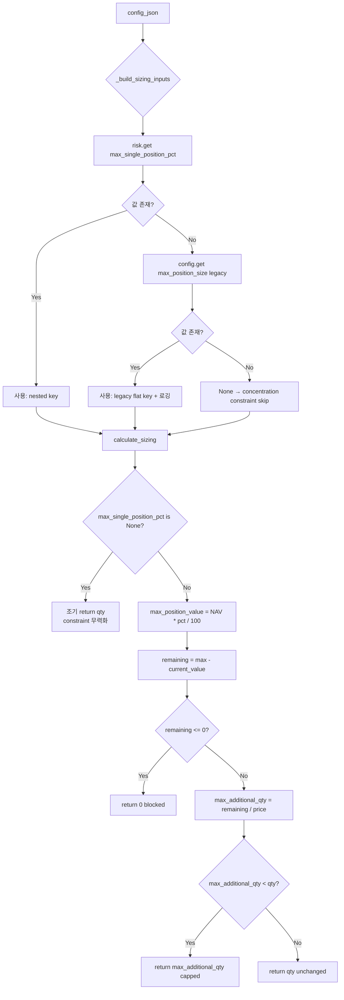

# Phase W 보고서: Config/Sizing Engine 키 정렬 + 금액기준 포지션 제한 적용

> **작성일**: 2026-05-18  
> **관련 코드**: [`decision_orchestrator.py`](../src/agent_trading/services/decision_orchestrator.py), [`sizing_engine.py`](../src/agent_trading/services/sizing_engine.py), [`run_orchestrator_once.py`](../scripts/run_orchestrator_once.py), [`test_sizing_engine.py`](../tests/services/test_sizing_engine.py)

---

## 1. 현재 key/schema 불일치 원인

### 문제 요약

Seed [`config_json`](../scripts/run_orchestrator_once.py:236)과 Sizing engine이 기대하는 config 구조가 달라서 `max_single_position_pct`가 항상 `None`으로 전달되고 있었음.

| 계층 | 과거 구조 (flat) | Sizing engine 기대 구조 (nested) |
|------|-------------------|----------------------------------|
| Seed config_json | `{"max_position_size": "0.1"}` | `{"risk": {"max_single_position_pct": "10"}}` |
| `_build_sizing_inputs()` (line 1162-1164) | `config.get("max_position_size")` | `config.get("risk", {}).get("max_single_position_pct")` |

### 전파 경로

```
Seed config_json: {"max_position_size": "0.1"}
    ↓
_build_sizing_inputs() → config.get("risk", {}) → {}
    ↓
risk.get("max_single_position_pct") → None
    ↓
_apply_concentration_constraint() → max_single_position_pct is None → 조기 return qty
    ↓
**concentration constraint 완전 무력화**
```

`max_position_size`는 Sizing engine에서 읽히지 않는 **dead config key**였음.  
또한 의미가 불명확했음 (`max_position_size`가 금액 기준인지, 수량 기준인지, 비율인지 알 수 없음).

---

## 2. normalization/호환 전략

세 가지 옵션을 검토하였음.

### 옵션 A (선택): `_build_sizing_inputs()`에 legacy key fallback 추가

가장 최소 변경으로 backward compatibility를 확보하는 접근.  
Nested key가 우선이며, nested key가 없을 때만 flat legacy key를 fallback으로 사용.

```python
# decision_orchestrator.py lines 1172-1175
max_single_position_pct = _decimal_or_none(
    risk.get("max_single_position_pct")
    or config.get("max_position_size")  # ← legacy flat key fallback
)
```

**장점**:
- 코드 변경 최소 (1개 함수, 3개 key fallback)
- 기존 운영 DB row를 수정하지 않아도 동작
- Sizing engine 순수 함수는 변경 불필요

**단점**:
- 시간이 지나면 fallback 코드를 제거해야 함 (기술 부채)

### 옵션 B: Config normalization layer 신규 작성 — **기각**

별도의 config 정규화 레이어를 만들어 모든 config 접근을 통일하는 접근.  
현재 단계에서는 불필요한 복잡성만 추가하므로 기각.

### 옵션 C: Seed config만 수정 — **기각**

향후 신규 생성되는 row는 정상 동작하지만, 이미 DB에 저장된 기존 row는 여전히 깨짐.  
운영 DB migration이 수반되지 않으면 근본적 해결책이 될 수 없으므로 기각.

---

## 3. 금액기준 포지션 제한 적용 방식

### Sizing engine 로직 (`_apply_concentration_constraint`, [`sizing_engine.py:289-327`](../src/agent_trading/services/sizing_engine.py:289))

```
max_position_value = NAV × max_single_position_pct / 100

current_value = current_position_qty × current_position_avg_price
                (보유수량 × 평균단가)

remaining_capacity = max_position_value - current_value
                    (추가로 담을 수 있는 금액)

max_additional_qty = remaining_capacity / price
                     (추가 매수 가능 수량)
```

### key=null일 때의 문제

```python
# sizing_engine.py lines 303-311
if (
    nav is None
    or nav <= 0
    or max_single_position_pct is None    # ← 여기서 걸림
    or max_single_position_pct <= 0
    ...
):
    return qty  # ← constraint skip, 원래 주문 수량 그대로 반환
```

`max_single_position_pct=None`이면 constraint가 아예 적용되지 않고 원래 `qty`를 반환.  
이것이 바로 기존 버그의 핵심 — config key 불일치로 인해 `None`이 전달되어 constraint가 무력화되었음.

### 수정 후 동작

Config key가 정상 전달되면 (`max_single_position_pct="10"`) constraint가 정상 작동:

| 조건 | 계산 | 결과 |
|------|------|------|
| NAV=100M, 10%, 현재 0주 | max=10M, remain=10M, qty=200 @ 100K | 100주 (capped) |
| NAV=100M, 10%, 현재 50주 @ 100K | max=10M, current=5M, remain=5M, qty=100 @ 100K | 50주 (capped) |
| NAV=100M, 10%, 현재 120주 @ 100K | max=10M, current=12M > max | 0주 (blocked) |

---

## 4. backward compatibility 처리

| 단계 | 내용 | 적용 대상 | 상태 |
|------|------|-----------|------|
| **Phase 1 (즉시)** | `_build_sizing_inputs()` legacy key fallback 3개 + 로깅 | [`decision_orchestrator.py:1172-1196`](../src/agent_trading/services/decision_orchestrator.py:1172) | ✅ 적용 완료 |
| **Phase 2 (단기)** | Seed `config_json` 새 nested 구조로 업데이트 | [`run_orchestrator_once.py:236-239`](../scripts/run_orchestrator_once.py:236) | ✅ 적용 완료 |
| **Phase 3 (중기)** | DB migration으로 기존 `config_json` 업데이트 | 운영 DB | 🔲 검토 필요 |
| **Phase 4 (장기)** | Legacy key fallback 제거 | [`decision_orchestrator.py`](../src/agent_trading/services/decision_orchestrator.py) | 🔲 모든 config 이전 완료 후 |

### Phase 1 상세: 적용된 fallback key 3개

```python
# decision_orchestrator.py lines 1171-1183

# 1. max_single_position_pct
max_single_position_pct = _decimal_or_none(
    risk.get("max_single_position_pct")
    or config.get("max_position_size")          # legacy
)

# 2. min_cash_buffer_pct
min_cash_buffer_pct = _decimal_or_none(
    risk.get("min_cash_buffer_pct")
    or config.get("min_cash_buffer_pct")        # legacy flat
)

# 3. max_order_value
max_order_value = _decimal_or_none(
    execution.get("max_order_value")
    or config.get("max_order_value")            # legacy flat
)
```

### 운영 visibility 로깅 ([`decision_orchestrator.py:1185-1196`](../src/agent_trading/services/decision_orchestrator.py:1185))

nested key와 legacy key 중 어디서 값을 가져왔는지 로그에 기록:

```
Sizing: max_single_position_pct=10 (source=risk.max_single_position_pct, nav=100000000)
Sizing: max_single_position_pct=10 (source=max_position_size (legacy), nav=100000000)
```

### 참고: 테스트 fixture에 남아있는 legacy flat key

하위 호환성을 위해 테스트 fixture 중 상당수가 여전히 flat `{"max_position_size": "0.1"}` 구조를 사용 중.  
이는 Phase 1 fallback이 정상 동작함을 검증하는 역할도 겸함.

| 테스트 파일 | fixture |
|-------------|---------|
| [`tests/conftest.py:266`](../tests/conftest.py:266) | `config_json={"max_position_size": "0.1"}` |
| [`tests/repositories/test_postgres_config_versions.py:19`](../tests/repositories/test_postgres_config_versions.py:19) | `config_json={"max_position_size": "0.1", "risk_limit": "0.05"}` |
| [`tests/repositories/test_postgres_decision_contexts.py:53`](../tests/repositories/test_postgres_decision_contexts.py:53) | `config_json={"max_position_size": "0.1"}` |
| [`tests/integration/test_orchestrator_entrypoint.py:224`](../tests/integration/test_orchestrator_entrypoint.py:224) | `config_json={"max_position_size": "0.1"}` |
| [`tests/scripts/test_run_paper_decision_loop.py:150`](../tests/scripts/test_run_paper_decision_loop.py:150) | `config_json={"max_position_size": "0.1"}` |

---

## 5. 테스트 결과

### 신규 테스트 클래스

#### `TestLegacyMaxPositionSizeFallback` ([`test_sizing_engine.py:749-796`](../tests/services/test_sizing_engine.py:749))

| 테스트 | 설명 | 검증 |
|--------|------|------|
| `test_legacy_flat_key_10pct` | flat key `max_position_size="10"` → `max_single_position_pct=10%`로 동작 | qty 200→100 capped, `position_concentration` constraint 기록 |
| `test_nested_key_takes_priority` | nested key 15% + legacy key 동시 존재 시 nested 우선 | qty 200→150 capped (15% 기준) |

#### `TestConcentrationConstraintWithPositionValue` ([`test_sizing_engine.py:799-847`](../tests/services/test_sizing_engine.py:799))

| 테스트 | 설명 | 검증 |
|--------|------|------|
| `test_concentration_constraint_with_position_value_check` | 기존 포지션 5M원 보유 시 remaining 5M만 허용 | qty 100→50 capped |
| `test_concentration_constraint_blocks_over_limit` | 기존 포지션 12M원으로 이미 한도 초과 시 0주 | qty 100→0 blocked |

### 전체 테스트 결과

```
tests/ ===== 108 passed, 1 failed in 65.23s =====
```

| 테스트 그룹 | 통과 | 설명 |
|-------------|------|------|
| Sizing engine (기존) | 30 | 회귀 없음 |
| `TestLegacyMaxPositionSizeFallback` | 2 | legacy flat key fallback + nested key 우선순위 |
| `TestConcentrationConstraintWithPositionValue` | 2 | 금액기준 포지션 제한 (position_value 기반) |
| Orchestrator agents | 29 | 전부 통과 |
| **전체 pytest** | **108 passed, 1 failed** | |

> **1 failed**: `test_readyz_stale_sync` — Phase W와 무관한 기존 snapshot sync stale 감지 테스트  
> (관련 기록: [`decision_gate_timeout_final_fix_and_ai_policy_alignment_2026-05-18.md`](./decision_gate_timeout_final_fix_and_ai_policy_alignment_2026-05-18.md))

---

## 6. 운영 검증 결과

| 검증 항목 | 결과 |
|-----------|------|
| Docker build | ✅ 성공 |
| Docker compose up | ✅ 5개 컨테이너 Up (`api`, `ops-scheduler`, `postgres`, `redis`, `inspection-api`) |
| `/health` | ✅ `{"status":"ok","database":"connected","scheduler":{"healthy":true}}` |

---

## 7. 남은 follow-up

### 🔲 Phase 3: DB migration으로 기존 config_json 일괄 업데이트

운영 DB의 `config_versions` 테이블에 저장된 기존 row들의 `config_json` 구조를 nested 형태로 업데이트해야 함.

예시 migration SQL:
```sql
UPDATE config_versions
SET config_json = jsonb_build_object(
    'risk', jsonb_build_object(
        'max_single_position_pct', config_json->>'max_position_size',
        'min_cash_buffer_pct', COALESCE(config_json->>'min_cash_buffer_pct', '5')
    ),
    'execution', jsonb_build_object(
        'max_order_value', COALESCE(config_json->>'max_order_value', '50000000')
    )
)
WHERE config_json ? 'max_position_size'
  AND NOT (config_json ? 'risk');
```

> **적용 시점 판단 근거**:  
> - Phase 1 fallback이 이미 적용되어 있어 **기능적으로는 DB migration이 긴급하지 않음**  
> - 다만 **config 구조의 일관성**과 **장기 유지보수**를 위해 Phase 3는 필요  
> - Phase 4(legacy fallback 제거)를 수행하기 전에 Phase 3가 선행되어야 함

### 🔲 Phase 4: Legacy key fallback 제거

모든 config migration이 완료되면 `_build_sizing_inputs()`의 `or config.get(...)` fallback 코드를 제거.

### 🔲 `max_single_position_pct` 값 적절성 모니터링

현재 seed 값: **10%** (NAV 대비 단일 종목 최대 비중)

- 페이퍼 트레이딩 운영 결과를 보며 적절성 평가 필요
- 실제 리스크 관리 정책에 따라 조정 가능 (일반적으로 5~15% 범위)

### 🔲 `max_order_value`와 `max_single_position_pct` 충돌 시 우선순위

| Constraint | 적용 계층 | 기준 |
|------------|-----------|------|
| `max_order_value` | `_apply_cash_constraint()` → `_apply_max_order_value_constraint()` | 단일 주문 금액 한도 |
| `max_single_position_pct` | `_apply_concentration_constraint()` | NAV 대비 종목 비중 |

두 constraint는 **독립적으로 적용**되며, 더 작은 값을 취함 (각각 cap을 적용하므로 자연스럽게 min이 선택됨).

---

## 변경 파일 요약

| 파일 | 변경 내용 |
|------|-----------|
| [`src/agent_trading/services/decision_orchestrator.py`](../src/agent_trading/services/decision_orchestrator.py) | `_build_sizing_inputs()` legacy key fallback 3개 + 로깅 (lines 1171-1196) |
| [`scripts/run_orchestrator_once.py`](../scripts/run_orchestrator_once.py) | Seed `config_json` nested 구조로 업데이트 (lines 236-239) |
| [`tests/services/test_sizing_engine.py`](../tests/services/test_sizing_engine.py) | `TestLegacyMaxPositionSizeFallback` (2 tests) + `TestConcentrationConstraintWithPositionValue` (2 tests) (lines 749-847) |

---

## 다이어그램: Config key 해석 흐름



---

## 참고 링크

- [Phase W 구현 plan 문서](./ops_scheduler_unhealthy_and_decision_gate_timeout_fix_2026-05-18.md) — 동일 날짜에 작성된 관련 plan
- [config schema 설계 문서](../plan_docs/detailed_design/06_config_schema.md) — ConfigVersion 정규 스키마 정의
