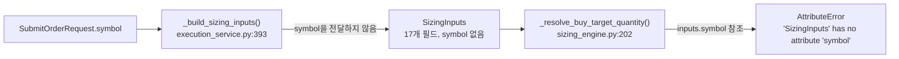
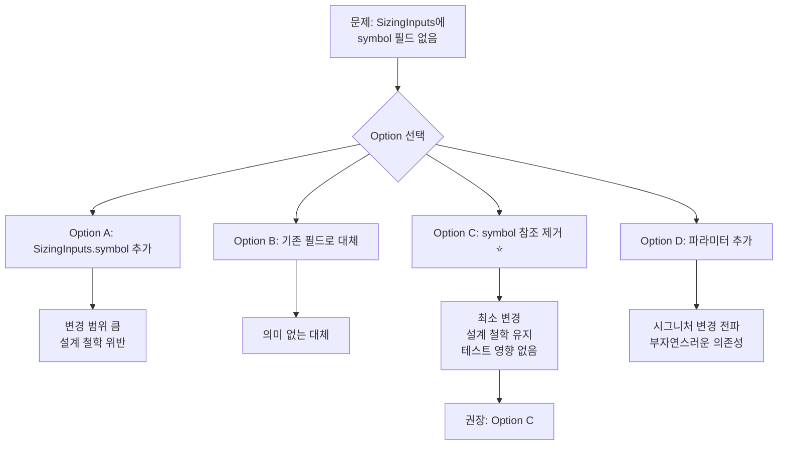

# `SizingInputs` `symbol` 참조 버그 수정안

## 발견된 문제

Phase 16 P3 로깅 강화 과정에서 [`_resolve_buy_target_quantity()`](src/agent_trading/services/sizing_engine.py:202)에
`inputs.symbol` 참조가 3개 추가되었으나, [`SizingInputs`](src/agent_trading/services/sizing_engine.py:43) dataclass에는
`symbol` 필드가 없어 런타임 `AttributeError`가 발생합니다.

### 참조 지점 (3개)

| # | 라인 | 로그 레벨 | 코드 |
|---|------|-----------|------|
| 1 | [222-224](src/agent_trading/services/sizing_engine.py:222) | DEBUG | `logger.debug("effective_cash=%s (source=orderable_amount, symbol=%s)", effective_cash, inputs.symbol)` |
| 2 | [229-231](src/agent_trading/services/sizing_engine.py:229) | WARNING | `logger.warning("...orderable_amount is None, symbol=%s)", effective_cash, inputs.symbol)` |
| 3 | [235-237](src/agent_trading/services/sizing_engine.py:235) | WARNING | `logger.warning("...are None (symbol=%s)", inputs.symbol)` |

### 데이터 흐름



---

## 질문 1: `SizingInputs`에 `symbol`을 추가할 것인가?

### 찬성 (Option A)
- 로깅에 symbol이 있으면 디버깅이 편리함. 특히 멀티 심볼 환경에서 어떤 심볼의 sizing이 실행 중인지 즉시 파악 가능
- `SizingInputs`는 이미 결정 컨텍스트(decision_type, side 등)를 담고 있어 symbol도 자연스러운 확장

### 반대
- **`SizingInputs`의 설계 철학**: pure input. 계산에 필요한 필드만 포함해야 함 ([docstring](src/agent_trading/services/sizing_engine.py:1): "Deterministic sizing engine — pure function, no side effects.")
- symbol은 어떤 sizing 계산에도 사용되지 않음. 순수히 로깅용
- 단순 로깅용 필드를 추가하면 책임 범위가 흐려짐 (scope creep)
- `SizingInputs`는 `slots=True, frozen=True` dataclass로, 필드 추가는 생성부(`_build_sizing_inputs()`)와 모든 테스트 팩토리 수정 필요

### 판단
→ **추가하지 않음.** sizing engine의 pure-function 책임을 유지해야 함.

---

## 질문 2: 로깅을 유지할 것인가, 제거할 것인가?

### 유지
- cash source(orderable_amount vs available_cash) 추적 자체는 유효한 operational 로깅
- WARNING 레벨 로그는 실제 문제 발생 시 유용할 수 있음

### 제거
- cash source 추적은 [`execution_service.py:467-477`](src/agent_trading/services/execution_service.py:467)에서 이미 상위 로깅으로 수행 중
- P3 로깅은 "있으면 좋은" 기능. 버그를 유발하는 로깅은 유지할 가치가 낮음
- sizing engine은 pure function이므로 사이드 이펙트(로깅)를 최소화하는 것이 설계에 부합

### 판단
→ **로깅 자체는 유지하되, symbol 참조만 제거.** cash source 추적은 operational traceability 측면에서 유효.  
단, `_build_sizing_inputs()`의 상위 로깅에서 이미 동일 정보를 제공하므로 필요하다면 추후 중복 로깅 정리 가능.

---

## 질문 3: 대안 분석

### Option A: `SizingInputs.symbol` 추가

**변경 사항**:
1. [`SizingInputs`](src/agent_trading/services/sizing_engine.py:43)에 `symbol: str` 필드 추가
2. [`_build_sizing_inputs()`](src/agent_trading/services/execution_service.py:489)에서 `symbol=intent.request.symbol` 전달
3. 모든 테스트 팩토리( [`_inputs()`](tests/services/test_sizing_engine.py:62), [`_make_sizing_inputs()`](tests/services/replay_test_harness.py:111) )에 `symbol` 추가

**영향 범위**:
- `SizingInputs` dataclass: +1 필드
- `_build_sizing_inputs()`: +1 인자
- 테스트 파일 2개: 팩토리 함수 수정 (테스트 케이스 30+개)
- `SizingInputs`의 pure-function 설계 철학 훼손

**장점**: symbol 로깅 유지, 향후 extension에 대비
**단점**: 설계 철학 위반, 변경 범위 큼, symbol 정보는 이미 상위 레이어에서 보유

### Option B: `inputs.symbol` → 기존 필드로 대체

**변경 사항**: `inputs.symbol` → `inputs.decision_type` 등 기존 필드로 대체

**평가**: `decision_type`은 symbol과 무관한 정보. 대체 의미 없음.  
→ **부적합.**

### Option C: 3개 로그 라인에서 `symbol=` 부분만 제거 (권장)

**변경 사항**: 로그 메시지에서 `symbol=%s` 인자와 `inputs.symbol` 참조만 제거

**영향 범위**:
- [`sizing_engine.py:222-224`](src/agent_trading/services/sizing_engine.py:222): `"effective_cash=%s (source=orderable_amount, symbol=%s)"` → `"effective_cash=%s (source=orderable_amount)"`
- [`sizing_engine.py:229-231`](src/agent_trading/services/sizing_engine.py:229): `"orderable_amount is None, symbol=%s"` → `"orderable_amount is None"`
- [`sizing_engine.py:235-237`](src/agent_trading/services/sizing_engine.py:235): `"are None (symbol=%s)"` → `"are None"`
- **테스트 수정 불필요** (테스트는 로그 메시지 포맷에 의존하지 않음)

**장점**: 최소 변경, 설계 철학 유지, 테스트 영향 없음, 런타임 버그 해결
**단점**: 로깅에서 symbol 정보 손실

### Option D: `_resolve_buy_target_quantity()`에 `symbol` 파라미터 추가

**변경 사항**: 메서드 시그니처 변경 `_resolve_buy_target_quantity(inputs: SizingInputs, symbol: str | None = None)`

**평가**: 
- `calculate_sizing()`(공개 API)까지 시그니처 변경이 전파되어야 함
- pure function에 symbol을 인자로 받는 것은 로깅용 부자연스러운 의존성
- → **부적합.** Option C에 비해 변경 범위 대비 이점 없음.

---

## 권장 결정: Option C

### 선택 이유

| 기준 | Option A | Option B | **Option C** | Option D |
|------|----------|----------|-------------|----------|
| 변경 최소화 | ❌ 3개 파일 | ✅ 1개 파일 | ✅ **1개 파일** | ❌ 2개 파일 |
| 설계 철학 유지 | ❌ 위반 | ✅ 유지 | ✅ **유지** | ❌ 위반 |
| 테스트 영향 | ❌ 많음 | ✅ 없음 | ✅ **없음** | ❌ 있음 |
| symbol 정보 유지 | ✅ 유지 | ❌ 손실 | ❌ 손실 | ✅ 유지 |
| 런타임 버그 해결 | ✅ 해결 | ✅ 해결 | ✅ **해결** | ✅ 해결 |

**Option C**는 sizing engine의 pure-function 책임을 유지하면서 최소한의 변경으로 런타임 버그를 해결합니다.  
Symbol 정보는 [`execution_service.py`](src/agent_trading/services/execution_service.py)의 상위 로깅(`Cash source:`, `SizingInputs:` 로그)에서 이미 추적 가능합니다.

---

## 변경할 코드

### 파일: [`src/agent_trading/services/sizing_engine.py`](src/agent_trading/services/sizing_engine.py)

#### 변경 1: 라인 221-224 — DEBUG log
**변경 전**:
```python
        logger.debug(
            "effective_cash=%s (source=orderable_amount, symbol=%s)",
            effective_cash, inputs.symbol,
        )
```
**변경 후**:
```python
        logger.debug(
            "effective_cash=%s (source=orderable_amount)",
            effective_cash,
        )
```

#### 변경 2: 라인 227-231 — WARNING log (orderable_amount is None)
**변경 전**:
```python
        logger.warning(
            "effective_cash=%s (source=available_cash fallback, "
            "orderable_amount is None, symbol=%s)",
            effective_cash, inputs.symbol,
        )
```
**변경 후**:
```python
        logger.warning(
            "effective_cash=%s (source=available_cash fallback, "
            "orderable_amount is None)",
            effective_cash,
        )
```

#### 변경 3: 라인 233-237 — WARNING log (both are None)
**변경 전**:
```python
        logger.warning(
            "cash constraint skipped: both orderable_amount and available_cash "
            "are None (symbol=%s)",
            inputs.symbol,
        )
```
**변경 후**:
```python
        logger.warning(
            "cash constraint skipped: both orderable_amount and available_cash "
            "are None",
        )
```

---

## 검증 계획

1. **단위 테스트 실행** (`symbol` 참조 제거로 인한 영향 없음):
   ```bash
   cd /workspace/agent_trading && python -m pytest tests/services/test_sizing_engine.py -v
   ```
2. **관련 파이프라인 테스트** (sizing engine을 호출하는 상위 테스트):
   ```bash
   cd /workspace/agent_trading && python -m pytest tests/services/test_decision_orchestrator.py -v -k "sizing"
   ```
3. **리플레이 테스트**:
   ```bash
   cd /workspace/agent_trading && python -m pytest tests/services/test_decision_replay.py -v
   ```
4. **Symbol 정보가 필요한 경우** [`execution_service.py`](src/agent_trading/services/execution_service.py)의 상위 로깅 활용:
   - `_build_sizing_inputs()` 내 `Cash source:` 로그 (라인 467-477)
   - `_build_sizing_inputs()` 내 `SizingInputs:` 로그 (라인 479-487)
   - `DecisionOrchestratorService`의 메인 파이프라인 로깅

---

## 결정 다이어그램


