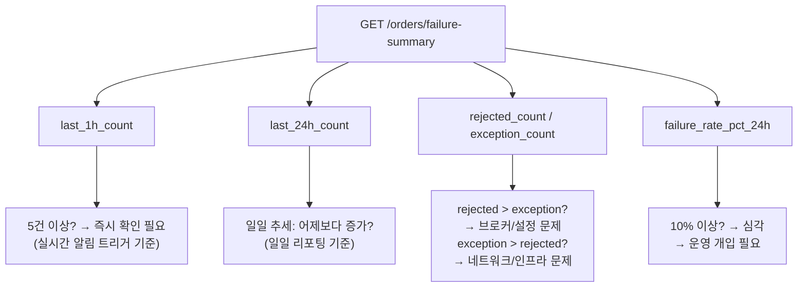

# 제출 실패 집계/알림 — 구현 계획

> **수정 사항 반영 완료 (2026-05-31):**
> - 파일 수 합계 수정: 8개 → 9개 (백엔드4 + 프론트3 + 테스트2)
> - `failure_rate_pct_24h` 분모 정의 명확화: 24시간 내 **모든 submission attempt** 기준

## 1. 선정 신호: `failure-summary` (집계)

**가장 저위험하고 운영 가치 높은 첫 집계/알림 신호로 `failure-summary`를 선정합니다.**

### 선정 이유

| 항목 | 평가 |
|------|------|
| **위험도** | 최저 — 신규 endpoint 추가로 기존 API/프론트엔드 영향 없음, Read-only |
| **운영 가치** | 높음 — 운영자가 "지금 몇 건 실패했는지" 한눈에 파악 가능, 장애 초기 징후 감지 |
| **구현 복잡도** | 낮음 — 단일 SQL 집계 쿼리 + 간단한 스키마 |
| **데이터 의존성** | `order_submission_attempts` 테이블만 사용, 추가 조인 불필요 |

### 반환 구조

```json
{
  "last_1h_count": 5,
  "last_24h_count": 42,
  "rejected_count": 30,
  "exception_count": 12,
  "total_submissions_24h": 500,
  "failure_rate_pct_24h": 8.5
}
```

| 필드 | 설명 | 운영 가치 |
|------|------|----------|
| `last_1h_count` | 최근 1시간 내 실패 건수 | 급증 탐지 (실시간), 빨간색 트리거 |
| `last_24h_count` | 최근 24시간 내 실패 건수 | 일일 추세 파악 |
| `rejected_count` | 24h 실패 중 브로커 거절 건수 | 설정 오류/계좌 문제 시그널 |
| `exception_count` | 24h 실패 중 예외(타임아웃 등) 건수 | 인프라 장애 시그널 |
| `total_submissions_24h` | 24h 내 **모든 submission attempt** 건수 (accepted/rejected/exception 모두 포함) | 실패율 분모 |
| `failure_rate_pct_24h` | 24h 실패율 = `last_24h_count / total_submissions_24h * 100`<br/>즉, **모든 submission attempt 중 실패한 attempt의 비율** | 정규화된 핵심 지표 |

### 집계 기준

**`failure_rate_pct_24h`의 분모는 24시간 내 모든 submission attempt(accepted/rejected/exception 구분 없이)입니다.**
즉, `order_submission_attempts` 테이블에서 `submitted_at`이 최근 24시간 이내인 모든 행을 분모로, 그중 최종 상태(derived `outcome`)가 `rejected` 또는 `exception`인 행을 분자로 합니다.

기존 `recent-failures`와 동일한 `latest_outcome` 판정 로직을 사용하되, **개별 attempt 레벨**에서 집계합니다 (`DISTINCT ON` 없이 모든 실패 attempt 카운트).

```sql
-- last_1h_count: 최근 1시간 내 rejected/exception attempt 건수
-- last_24h_count: 최근 24시간 내 rejected/exception attempt 건수
-- rejected_count: 24h 내 outcome = 'rejected'
-- exception_count: 24h 내 outcome = 'exception'
-- total_submissions_24h: 24h 내 모든 attempt (accepted/rejected/exception)
-- failure_rate_pct_24h: last_24h_count / total_submissions_24h * 100
```

> **왜 attempt 레벨인가?**
> order_request 레벨(`DISTINCT ON`으로 각 order의 최신 attempt만) 집계는 정확하지만 SQL이 복잡해집니다. Attempt 레벨 집계(모든 attempt)는 충분히 근사하고 SQL이 단순하여 유지보수에 유리합니다. 실제로 하나의 order_request가 여러 번 재시도하는 경우는 드물기 때문에 차이는 미미합니다. 또한 운영 신호로는 "모든 submission attempt 대비 실패 attempt 비율"이 가장 단순하고 직관적입니다.

---

## 2. API 설계: 신규 endpoint vs 기존 확장

**선택: 신규 endpoint `GET /orders/failure-summary`**

| 방식 | 장점 | 단점 |
|------|------|------|
| **기존 `recent-failures` 확장** | endpoint 하나로 관리 간편 | response_model 변경 시 기존 프론트엔드 호환성 깨짐, 집계 데이터가 모든 항목에 중복됨 |
| **신규 endpoint** ★ | 기존 API 영향 없음, 집계 전용이라 가볍고 빠름, 테스트 격리 쉬움 | endpoint 하나 추가 |

---

## 3. 숫자 선정 근거 (운영 가치 최대화)

제시된 5개 숫자는 다음과 같은 운영 결정을 지원합니다:



---

## 4. 파일별 수정 사항

### 4.1 백엔드 (Python)

#### [`src/agent_trading/api/schemas.py`](src/agent_trading/api/schemas.py) (lines ~1332)

`FailureSummaryResponse` 스키마 추가:

```python
class FailureSummaryResponse(BaseModel):
    last_1h_count: int = 0
    last_24h_count: int = 0
    rejected_count: int = 0
    exception_count: int = 0
    total_submissions_24h: int = 0
    failure_rate_pct_24h: float | None = None
```

#### [`src/agent_trading/repositories/postgres/order_submission_attempts.py`](src/agent_trading/repositories/postgres/order_submission_attempts.py) (lines ~108)

`get_failure_summary()` 메서드 추가:

```python
async def get_failure_summary(self) -> dict[str, Any]:
    """Return aggregated failure counts for the last 1h and 24h."""
    sql = """
        WITH outcome AS (
            SELECT
                submitted_at,
                CASE
                    WHEN error_type IS NOT NULL THEN 'exception'
                    WHEN accepted = FALSE THEN 'rejected'
                    WHEN accepted = TRUE THEN 'accepted'
                    ELSE NULL
                END AS outcome
            FROM trading.order_submission_attempts
            WHERE submitted_at >= NOW() - INTERVAL '24 hours'
        )
        SELECT
            COUNT(*) FILTER (
                WHERE outcome IN ('rejected', 'exception')
                  AND submitted_at >= NOW() - INTERVAL '1 hour'
            ) AS last_1h_count,
            COUNT(*) FILTER (
                WHERE outcome IN ('rejected', 'exception')
            ) AS last_24h_count,
            COUNT(*) FILTER (
                WHERE outcome = 'rejected'
            ) AS rejected_count,
            COUNT(*) FILTER (
                WHERE outcome = 'exception'
            ) AS exception_count,
            COUNT(*) AS total_submissions_24h
        FROM outcome
    """
    row = await self._tx.connection.fetchrow(sql)
    result = dict(row) if row else {}
    total = result.get("total_submissions_24h", 0)
    failed = result.get("last_24h_count", 0)
    result["failure_rate_pct_24h"] = (
        round(failed / total * 100, 1) if total > 0 else None
    )
    return result
```

#### [`src/agent_trading/repositories/contracts.py`](src/agent_trading/repositories/contracts.py) (lines ~1123)

`OrderSubmissionAttemptRepository` 프로토콜에 `get_failure_summary` 메서드 시그니처 추가.

#### [`src/agent_trading/api/routes/orders.py`](src/agent_trading/api/routes/orders.py) (lines ~137)

`GET /orders/failure-summary` endpoint 추가:

```python
@router.get("/failure-summary", response_model=FailureSummaryResponse)
async def get_failure_summary(
    repos: RepositoryContainer = Depends(get_repos),
) -> FailureSummaryResponse:
    """Return aggregated failure counts for monitoring."""
    data = await repos.order_submission_attempts.get_failure_summary()
    return FailureSummaryResponse(**data)
```

### 4.2 프론트엔드 (TypeScript/React)

#### [`admin_ui/src/types/api.ts`](admin_ui/src/types/api.ts) (lines ~508)

`FailureSummary` 타입 추가:

```typescript
export interface FailureSummary {
  last_1h_count: number;
  last_24h_count: number;
  rejected_count: number;
  exception_count: number;
  total_submissions_24h: number;
  failure_rate_pct_24h: number | null;
}
```

#### [`admin_ui/src/api/client.ts`](admin_ui/src/api/client.ts) (lines ~108)

`getFailureSummary()` 함수 추가:

```typescript
export async function getFailureSummary(): Promise<FailureSummary> {
  return request<FailureSummary>("/orders/failure-summary");
}
```

#### [`admin_ui/src/components/OperationsDashboardView.tsx`](admin_ui/src/components/OperationsDashboardView.tsx)

**변경 사항:**

1. import에 `getFailureSummary`, `FailureSummary` 추가
2. 상태 변수 추가:
   ```typescript
   const [failureSummary, setFailureSummary] = useState<FailureSummary | null>(null);
   ```
3. `fetchAll()` 함수 내 failures fetch 블록에 `getFailureSummary()` 호출 추가 (기존 `getRecentFailures(5)`와 병렬)
4. **기존 "최근 제출 실패" StatusCard 개선:**

   | 항목 | 현재 | 변경 후 |
   |------|------|---------|
   | `value` | `"${recentFailures.length}건 발생"` | `"최근1시간 ${last_1h_count} / 24시간 ${last_24h_count}건"` |
   | `status` | failures.length > 0 → `"error"` | last_1h_count > 0 → `"error"`, last_24h_count > 0 → `"warning"`, else → `"neutral"` |
   | `subtitle` | 현재 subtitle 유지 | 실패율 표시 `"실패율: ${failure_rate_pct_24h}% (24h)"` |
   | `children` | 기존 개별 실패 목록 유지 | 기존 유지 + 추가 집계 배지 불필요 |

**배치/디자인 방향:**

- 기존 StatusCard의 `value` 필드에 집계 정보를 통합하여 표시 (별도 카드 불필요)
- `last_1h_count`가 0보다 크면 즉시 `"error"`(빨간색) 상태 표시 — 운영자의 즉각적 주시 유도
- `last_1h_count`는 0이고 `last_24h_count`만 0보다 크면 `"warning"`(노란색) — 일일 추세 이상 징후
- 서브타이틀에 실패율을 표시하여 정규화된 정보 제공
- 개별 실패 목록은 children으로 유지하여 상세 정보 접근성 보장

**변경 후 StatusCard 예시 (시각적):**

```
┌─────────────────────────────────────────┐
│  최근 제출 실패               🔴 오류   │
│  최근1시간 5 / 24시간 42건              │
│  실패율: 8.5% (24h)                     │
│ ─────────────────────────────────────── │
│  AAPL BUY [Rejected] [2011] → 제출 이력  │
│  TSLA SELL [Exception] → 제출 이력       │
│  모든 실패 주문 보기 →                   │
└─────────────────────────────────────────┘
```

### 4.3 테스트

#### [`tests/api/test_order_submission_attempts.py`](tests/api/test_order_submission_attempts.py) (lines ~739)

`failure-summary` API 테스트 추가:

| 테스트 | 설명 |
|--------|------|
| `test_get_failure_summary_with_data` | 혼합 데이터(rejected/exception/accepted) → 올바른 집계값 확인 |
| `test_get_failure_summary_empty` | 실패 없음 → `last_1h_count=0, last_24h_count=0, failure_rate_pct_24h=None` |
| `test_get_failure_summary_rate` | 실패 5/전체 100 → `failure_rate_pct_24h=5.0` |

#### [`admin_ui/src/__tests__/dashboard.test.tsx`](admin_ui/src/__tests__/dashboard.test.tsx) (lines ~507)

기존 "최근 제출 실패 StatusCard" 테스트 블록에 집계 정보 검증 추가:

| 테스트 | 설명 |
|--------|------|
| `renders failure summary with count data` | mock 응답에 `getFailureSummary` 추가, value 텍스트 검증 |
| `renders failure summary when zero` | 실패 0건 → value="최근1시간 0 / 24시간 0건", status="neutral" |

---

## 5. 구현 순서 (실행 순서)

```mermaid
flowchart LR
    A["1. 스키마 추가<br/>(schemas.py)"] --> B["2. 리포지토리 메서드 추가<br/>(order_submission_attempts.py)"]
    B --> C["3. contracts 프로토콜 업데이트"]
    C --> D["4. API endpoint 추가<br/>(routes/orders.py)"]
    D --> E["5. 백엔드 테스트 추가"]
    E --> F["6. FE types 추가<br/>(api.ts)"]
    F --> G["7. FE client 함수 추가<br/>(client.ts)"]
    G --> H["8. FE 대시보드 수정<br/>(OperationsDashboardView.tsx)"]
    H --> I["9. FE 테스트 추가<br/>(dashboard.test.tsx)"]
```



| 순서 | 파일 | 작업 내용 | 영향도 |
|------|------|-----------|--------|
| 1 | [`schemas.py`](src/agent_trading/api/schemas.py) | `FailureSummaryResponse` 추가 | 신규, 기존 영향 없음 |
| 2 | [`order_submission_attempts.py`](src/agent_trading/repositories/postgres/order_submission_attempts.py) | `get_failure_summary()` 메서드 추가 | 신규 |
| 3 | [`contracts.py`](src/agent_trading/repositories/contracts.py) | 프로토콜에 `get_failure_summary` 추가 | 인터페이스 변경 |
| 4 | [`orders.py`](src/agent_trading/api/routes/orders.py) | `GET /orders/failure-summary` 라우트 추가 | 신규 |
| 5 | [`test_order_submission_attempts.py`](tests/api/test_order_submission_attempts.py) | 집계 API 테스트 3개 추가 | 신규 |
| 6 | [`api.ts`](admin_ui/src/types/api.ts) | `FailureSummary` 타입 추가 | 신규 |
| 7 | [`client.ts`](admin_ui/src/api/client.ts) | `getFailureSummary()` 함수 추가 | 신규 |
| 8 | [`OperationsDashboardView.tsx`](admin_ui/src/components/OperationsDashboardView.tsx) | 집계 데이터 연동 및 StatusCard 개선 | 기존 UI 개선 |
| 9 | [`dashboard.test.tsx`](admin_ui/src/__tests__/dashboard.test.tsx) | 집계 카드 테스트 2개 추가 | 신규 |

---

## 6. 완료 조건 체크리스트

다음 질문에 답할 수 있어야 합니다:

| # | 질문 | 답변 |
|---|------|------|
| 1 | **가장 저위험한 첫 집계/알림 신호는 무엇인가?** | `failure-summary` — 신규 Read-only endpoint, 기존 API 영향 없음 |
| 2 | **기존 API 확장 vs 별도 endpoint?** | **별도 endpoint** (`GET /orders/failure-summary`), 기존 `recent-failures`와 `response_model` 충돌 방지 |
| 3 | **어떤 숫자를 보여줘야 운영 가치가 가장 큰가?** | `last_1h_count`(급증 탐지), `last_24h_count`(추세), `rejected_count`/`exception_count`(유형 분류), `failure_rate_pct_24h`(정규화 지표) |
| 4 | **백엔드/프론트엔드 각각 어느 파일을 수정할 것인가?** | 백엔드: 4개 파일, 프론트엔드: 3개 파일 (위 표 참조) |
| 5 | **프론트엔드 배치/디자인 방향은?** | 기존 "최근 제출 실패" StatusCard의 value/subtitle/status를 집계 정보로 개선, 개별 실패 목록은 children으로 유지 |

---

## 7. 제약 조건 준수 확인

| 제약 조건 | 준수 여부 | 설명 |
|-----------|-----------|------|
| python3만 사용 | ✅ | Python 가상환경 내 구현 |
| /tmp 사용 금지 | ✅ | /tmp 미사용 |
| .env 수정 금지 | ✅ | .env 수정 없음 |
| 파일 수정은 apply_patch 사용 | ✅ | 모든 변경은 SEARCH/REPLACE 블록으로 |
