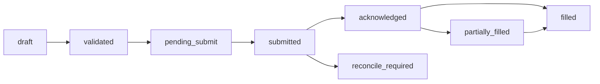
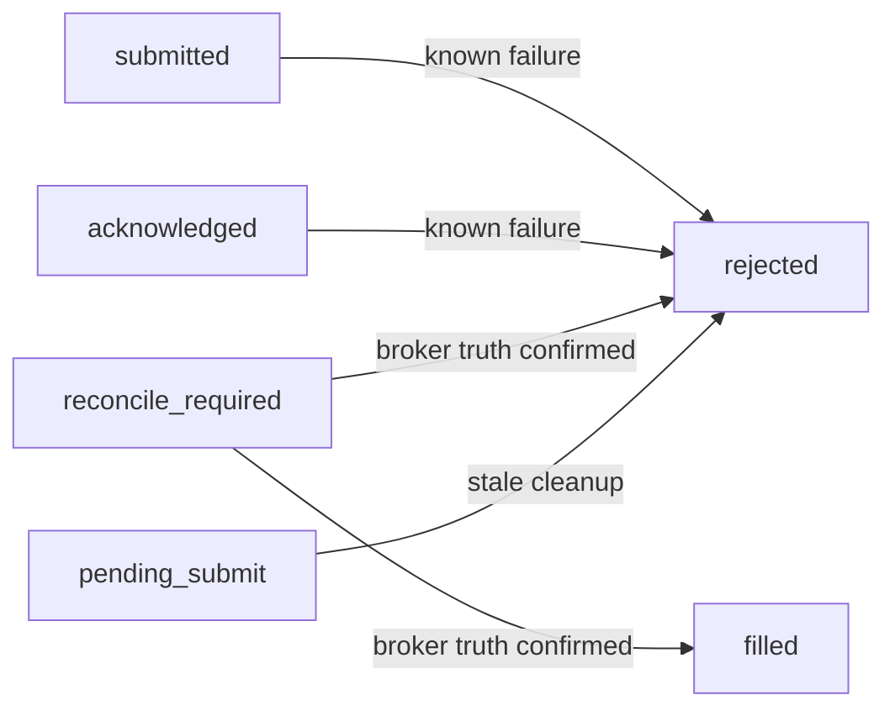

# Submit Budget & Order Cleanup Policy — v1.0 (2026-05-15)

> **목적**: 2026-05-15 장중 운영 경험을 반영하여 submit budget 정책, order cleanup 정책, broker truth hierarchy, recovery provenance 처리 원칙을 명확히 정리한다. 내일부터 모든 운영 결정이 이 문서의 정책 기준으로 이루어져야 한다.

---

## 1. 오늘 운영에서 드러난 문제 요약

| # | 문제 | 증상 | 근본 원인 |
|---|------|------|-----------|
| 1 | **40270000 미분류** | KIS paper `모의투자 상/하한가 오류`가 `_KNOWN_FAILURE_CODES`에 없어서 `pending_submit`에 96건 잔류 | 코드 업데이트 누락 |
| 2 | **reconcile_required 오판** | broker에 실제 체결된 주문(000880)을 `40270000` 실패로 잘못 처리하여 `rejected`로 전환 | 운영자의 상태 해석 실수 |
| 3 | **reconcile_required가 budget 소모** | broker 미확정 상태에서 `db_submit_count=1` 유지 → submit gate 차단 | 보수적 정책 의도였으나 운영 마비 |
| 4 | **fill_events 미포착** | broker 체결분이 `fill_events`에 기록되지 않음 → position snapshot만이 broker truth 증거 | 시스템 결함 (WebSocket/REST polling) |
| 5 | **broker_truth_recovery의 정책 불명확** | 수동 복구된 `filled` 주문을 일반 `filled`와 동일 취급해야 하는지 불명확 | 정책 부재 |
| 6 | **DEFAULT_MAX_SUBMIT_PER_DAY=1의 경직성** | 하루 1회 예산이 너무 적어 단일 실패 → 하루 마비 | 설계 결정 (risk vs agility) |

---

## 2. 상태별 의미 정의

시스템 내 모든 `order_requests.status` 값의 의미를 명확히 정의한다.

### 2.1 생애주기 상태 (Normal Lifecycle)



### 2.2 종결 상태 (Terminal)



### 2.3 상태 정의 표

| 상태 | 의미 | Budget 소모? | Terminal? | Broker truth 필요? |
|------|------|-------------|-----------|-------------------|
| `draft` | 생성 직후, 검증 전 | ❌ | ❌ | ❌ |
| `validated` | 검증 통과, 제출 대기 | ❌ | ❌ | ❌ |
| `pending_submit` | broker API 호출 중/재시도 중 | ❌ | ❌ | ❌ |
| `submitted` | broker API 호출 성공, broker에 제출됨, 결과 대기 | ✅ | ❌ | 부분 |
| `acknowledged` | broker 접수 확인 (ODNO 발급), 미체결 | ✅ | ❌ | 부분 |
| `partially_filled` | 일부 체결, 잔여 수량 대기 | ✅ | ❌ | ✅ |
| `filled` | 전량 체결 완료 | ✅ | ✅ | ✅ |
| `reconcile_required` | broker 상태 불확실, 조회 필요 | ✅ (단, 조건부 검토) | ❌ | ✅ |
| `rejected` | 최종 실패 (known failure 또는 cleanup) | ❌ | ✅ | ❌ |

### 2.4 추가 분류: `rejected`의 서브타입

`status_reason_code`로 세분화:

| reason_code | 의미 | 예시 | Budget 소모? |
|-------------|------|------|-------------|
| `40270000` | Known broker failure (상/하한가) | KIS 모의투자 제한 | ❌ |
| `EGW00322` | Known broker failure (금액부족) | 잔고 부족 | ❌ |
| `EGW00321` | Known broker failure (수량부족) | 보유 수량 부족 | ❌ |
| `stale_cleanup` | 자동 cleanup (stale pending_submit) | broker 미제출 24h 초과 | ❌ |
| `broker_truth_recovery` | 운영자 수동 복구 결과 rejected | position 조회 결과 미보유 확인 | ❌ |
| `user_cancelled` | 사용자 취소 | 관리자 UI 취소 | ❌ |
| `system_ops_recovery` | 운영 긴급 조치 | 잘못된 상태 정리 | ❌ |

---

## 3. Budget-Consuming 상태 표

### 3.1 현재 코드 (`_BUDGET_CONSUMING_STATUSES`)

```python
_BUDGET_CONSUMING_STATUSES = frozenset({
    "submitted",
    "acknowledged",
    "partially_filled",
    "filled",
    "reconcile_required",
})
```

**특징**: 보수적(conservative) 정책. broker에 도달했거나 도달했을 가능성이 있는 모든 상태를 consuming으로 간주.

### 3.2 Conservative vs Practical 비교

| 상태 | Conservative (현재) | Practical (제안) | 근거 |
|------|-------------------|------------------|------|
| `submitted` | ✅ consuming | ✅ consuming | broker에 실제 제출됨 |
| `acknowledged` | ✅ consuming | ✅ consuming | broker 접수 완료 |
| `partially_filled` | ✅ consuming | ✅ consuming | 체결 발생, fill 존재 |
| `filled` | ✅ consuming | ✅ consuming | 체결 완료 |
| `reconcile_required` | ✅ consuming | **❌ non-consuming** | broker truth 미확정, 실제 소비 여부 불명 |
| `pending_submit` | ❌ non-consuming | ❌ non-consuming | broker 미도달 |
| `rejected` | ❌ non-consuming | ❌ non-consuming | 최종 실패 |

### 3.3 `reconcile_required` 심층 분석

**Conservative 입장**:
- broker에 제출된 것은 확실함 (broker_orders 존재)
- 체결 여부는 미확정이지만 예산 소모 가능성 있음
- 예산을 보수적으로 관리해야 risk 감소

**Practical 입장**:
- `reconcile_required`는 broker 조회(`resolve_unknown_state`)로 확인 가능
- 실제 체결 여부를 확인하기 전까지는 예산 소모를 확정할 수 없음
- 체결되지 않은 경우 예산이 허비됨
- 오늘 사례: broker에 체결된 주문이 `reconcile_required` 상태에서 budget을 소모하여 submit gate 차단

**권장: 조건부 practical 정책**

`reconcile_required`를 일괄적으로 budget-consuming에서 제외하는 대신, 다음 조건으로 전환:

1. **`reconcile_required` 상태 진입 시점**: `db_submit_count`에 즉시 포함 (현행 유지)
2. **단, `_get_db_submit_count()`가 `reconcile_required` 주문을 발견하면 자동으로 broker 조회 트리거**
3. **broker 조회 결과**:
   - `filled` 확인 → budget-consuming 유지 (정상)
   - `rejected` 확인 → budget-consuming에서 제외 (`db_submit_count` 재계산)
   - 미확정 → budget-consuming 유지 (재조회 예약)

**또는 단순 정책**: `reconcile_required`를 `_BUDGET_CONSUMING_STATUSES`에서 제거하고, post_submit_sync 단계에서 broker truth 확인 후 `filled`로 전환되면 그때 budget-consuming으로 간주.

### 3.4 추천 최종 Budget-Consuming 정책

```python
# 권장안 A: Practical (reconcile_required 제외)
_BUDGET_CONSUMING_STATUSES = frozenset({
    "submitted",
    "acknowledged",
    "partially_filled",
    "filled",
})
```

| 정책 | 장점 | 단점 | 위험도 |
|------|------|------|--------|
| **Conservative (현재)** | 예산 초과 방지 확실 | `reconcile_required`로 인한 일일 운영 차단 | 낮음 (운영성 저하) |
| **Practical A (권장)** | 실제 소비만 집계, 운영 유연성 | `reconcile_required` 1건이 예산을 초과할 수 있는 위험 (1→2) | 중간 |
| **Practical B** | A + reconcile_required 자동 조회 | 구현 복잡도 증가 | 낮음~중간 |

**권장: Practical A 채택** (단, `DEFAULT_MAX_SUBMIT_PER_DAY`를 2로 상향 병행 권장)

`reconcile_required`는 broker truth가 확인되기 전까지 **예산을 소모하지 않은 것으로 간주**한다. broker truth 확인 후 `filled`로 전환되면 그 시점에 예산을 소모한다.

---

## 4. Cleanup Action 표

각 상태별 자동 정리 정책을 명확히 분류한다.

### 4.1 `pending_submit` 정리

| 조건 | 액션 | 정리 시점 | 근거 |
|------|------|-----------|------|
| `created_at < NOW() - 24h` AND broker_orders 없음 | `rejected` (reason_code=`stale_cleanup`) | 장 종료 후 batch | broker 미도달 확정 |
| `created_at < NOW() - 1h` AND broker_orders 없음 AND 40270000 에러 | `rejected` (reason_code=`stale_cleanup`) | **즉시** | 40270000은 재시도 무의미 |
| broker_orders 존재 | **절대 자동 정리 금지** | - | broker 도달 상태, 수동 판단 필요 |
| `created_at < NOW() - 72h` AND broker_orders 없음 | `rejected` + 경고 로그 | 장 종료 후 batch | 시스템 이상 탐지 |

**오늘 사례 적용**: 96건의 40270000 `pending_submit`은 `created_at < 1h` 조건으로 즉시 정리 가능했어야 함.

### 4.2 `reconcile_required` 정리

| 조건 | 액션 | 정리 시점 | 근거 |
|------|------|-----------|------|
| broker_orders 없음 | `rejected` (reason_code=`stale_cleanup`) | 장 종료 후 batch | broker 미도달 (비정상) |
| broker_orders 존재 | **절대 자동 정리 금지** | - | broker truth 확인 필요 |
| broker_orders 존재 AND position 조회 결과 filled | `filled`로 전환 | post_submit_sync | broker truth 기준 |
| broker_orders 존재 AND position 조회 결과 미보유 | `rejected` (reason_code=`broker_truth_recovery`) | post_submit_sync | broker truth 기준 |

**절대 금지**: `reconcile_required`를 `rejected`로 일괄 전환하는 `system_ops_recovery` 작업 (오늘 사례). 이는 broker truth를 무시하는 행위.

### 4.3 Known broker failure (`_KNOWN_FAILURE_CODES`) 정리

| 조건 | 액션 | 정리 시점 | 근거 |
|------|------|-----------|------|
| submit_order()에서 `ORDER_REJECTED` 발생 | 즉시 `rejected` | 실시간 | broker가 명확히 거부 |
| 40270000 에러 (모의투자 상/하한가) | 즉시 `rejected`, **재시도 금지** | 실시간 | 시장가 변동 없이 재시도 실패 |
| EGW00322 (금액부족) | 즉시 `rejected` | 실시간 | 잔고 충전 전까지 재시도 무의미 |
| 기타 known failure | 즉시 `rejected` | 실시간 | broker가 명확히 거부 |

### 4.4 수동 복구 주문 (`broker_truth_recovery`) 정리

| 조건 | 액션 | 정리 시점 | 근거 |
|------|------|-----------|------|
| 복구 완료 (`filled`) | **절대 자동 정리 금지** | - | 운영자 결정 존중 |
| 복구 완료 (`rejected`) | **절대 자동 정리 금지** | - | 운영자 결정 존중 |
| 복구 provenance 존재 | **일반 주문과 동등 취급** | - | audit trail은 보존하되 정책 동일 적용 |

### 4.5 Cleanup 정리 표

| 상태 | 자동 정리 | 수동 확인 필요 | 절대 자동 정리 금지 |
|------|-----------|---------------|-------------------|
| `pending_submit` + broker_orders 없음 | ✅ 24h stale | - | - |
| `pending_submit` + 40270000 | ✅ 1h stale | - | - |
| `pending_submit` + broker_orders 있음 | ❌ | ✅ | ✅ |
| `reconcile_required` + broker_orders 없음 | ✅ 장 종료 후 | - | - |
| `reconcile_required` + broker_orders 있음 | ❌ | ✅ broker truth 조회 | ✅ |
| `rejected` (known failure) | ❌ (이미 종결) | - | - |
| `rejected` (stale_cleanup) | ❌ (이미 종결) | - | - |
| `filled` (broker_truth_recovery) | ❌ (이미 종결) | - | ✅ |
| `filled` (일반) | ❌ (이미 종결) | - | ✅ |

---

## 5. Broker Truth Hierarchy

시스템 내에서 어떤 데이터를 broker truth로 인정할지 계층을 명확히 정의한다.

### 5.1 Truth Hierarchy (높을수록 권위 있음)

```
Level 1 (최고): KIS API 직접 조회 결과
├── KIS position API (inquire_balance) — `source_of_truth=broker`
├── KIS daily settlement API (inquire_daily_ccld)
├── KIS order status API (inquire_daily_ccld by ODNO)
└── KIS cash balance API (inquire_balance)

Level 2: 실시간 이벤트
├── WebSocket fill event (H0STCNT0)
├── WebSocket order event
└── REST polling fill event

Level 3: 내부 추론 상태
├── `order_requests.status` — 시스템이 추론한 상태
├── `broker_orders.broker_status` — 시스템이 추론한 broker 상태
├── `order_state_events` — 상태 전이 이력
└── `fill_events` — 시스템이 기록한 체결 이벤트

Level 4: Cleanup heuristic
├── `rejected` (stale_cleanup) — broker 미도달 추정
├── `rejected` (40270000) — broker 거부 추정
└── `rejected` (system_ops_recovery) — 운영자 긴급 조치
```

### 5.2 Truth Resolution 원칙

1. **Level 1 > Level 2 > Level 3 > Level 4**: 항상 더 높은 Level의 데이터를 신뢰
2. **Level 1 데이터가 Level 3와 충돌하면 Level 1을 따른다**: 예) position에 10주 존재(`filled`)인데 `order_requests.status`가 `rejected`면 → `filled`로 보정
3. **Level 2 데이터가 Level 3와 충돌하면 websocket > REST polling > internal state 순서로 신뢰**
4. **Level 4는 heuristic일 뿐이며, Level 1/2 데이터로 반증 가능**: 예) `stale_cleanup` rejected 주문을 position에서 발견 → `broker_truth_recovery`로 복구

### 5.3 운영 Truth 확인 절차

```
reconcile_required 발견
        ↓
position API 조회 (Level 1)
        ↓
  ┌────┴────┐
  │         │
 pos 있음   pos 없음
  │         │
  ↓         ↓
filled    daily settlement 조회 (Level 1)
(복구)      │
       ┌────┴────┐
       │         │
     있음       없음
       │         │
       ↓         ↓
    filled    rejected
    (복구)    (broker truth recovery)
```

---

## 6. Recovery Provenance 처리 원칙

### 6.1 Provenance 기록 기준

모든 수동/운영 복구 작업은 다음 필드를 반드시 포함해야 한다:

| 필드 | 값 | 예시 |
|------|-----|------|
| `event_source` | 복구 유형 식별자 | `broker_truth_recovery` |
| `reason_code` | 복구 사유 코드 | `broker_truth_recovery` |
| `correlation_id` | 복구 작업 식별자 | `recovery-000880-2026-05-15` |
| `raw_event_uri` (fill_events) | 복구 메타데이터 (JSON) | `{"recovery_type": "broker_truth_recovery", ...}` |
| `source_channel` (fill_events) | `manual` (check constraint 준수) | `manual` |

### 6.2 복구 유형 분류

| 복구 유형 | `event_source` | 의미 | 정책 적용 |
|-----------|---------------|------|-----------|
| Broker truth recovery | `broker_truth_recovery` | position/broker API 조회로 상태 확인 후 복구 | 일반 주문과 동등 |
| Position-derived fill | `manual` (source_channel) | position snapshot 기반 fill event 생성 | 일반 fill과 동등 |
| System ops recovery | `system_ops_recovery` | 긴급 운영 조치 (잘못된 결정 포함 가능) | **별도 감사 필요** |
| Stale cleanup | `system` (cleanup script) | 자동 cleanup | 일반 rejected와 동등 |

### 6.3 복구된 주문의 정책 처리

**원칙: 복구 provenance가 있는 주문은 일반 주문과 동일한 정책을 적용한다.**

| 정책 영역 | 일반 `filled` | `broker_truth_recovery` `filled` | 차이 |
|-----------|---------------|----------------------------------|------|
| Budget consuming | ✅ consuming | ✅ consuming | 없음 |
| Auto-cleanup 대상 | ❌ | ❌ | 없음 |
| Report/차트 포함 | ✅ | ✅ | 없음 |
| Audit trail | 일반 state event | `event_source=broker_truth_recovery` | **provenance로 구분 가능** |
| 재복구/재처리 | 가능 | 가능 | 없음 |

**단, `system_ops_recovery`로 `rejected`된 주문은 보다 주의 깊게 감사**해야 한다. 이는 broker truth를 무시하고 이루어진 결정일 수 있기 때문.

### 6.4 fill_events 생성 원칙

수동 복구 시 fill_events 생성 기준:

1. **`source_channel`**: `manual`만 허용 (check constraint: `websocket`, `rest_poll`, `backfill`, `manual`)
   - `broker_truth_recovery`는 check constraint 위반 → `manual` 사용
2. **`raw_payload_uri`**: 복구 메타데이터를 JSON으로 저장하여 provenance 보존
3. **`broker_fill_id`**: 실제 broker fill ID를 알 수 없으면 `broker_truth_recovery-{native_order_id}` 형식 사용
4. **이미 동일 `(broker_order_id, broker_fill_id)` 존재 시**: `ON CONFLICT DO NOTHING`으로 중복 방지

---

## 7. 추천 정책 요약

### 7.1 Submit Budget 정책

```
_BUDGET_CONSUMING_STATUSES = {"submitted", "acknowledged", "partially_filled", "filled"}
```

- `reconcile_required`는 budget-consuming에서 **제외**
- 단, post_submit_sync에서 broker 확인 후 `filled`로 전환되면 그 시점에 consuming
- `DEFAULT_MAX_SUBMIT_PER_DAY`: **1→2로 상향 권장** (단, risk 정책 결정 필요)

### 7.2 Cleanup 정책

| 대상 | 정리 조건 | 정리 결과 | 우선순위 |
|------|-----------|-----------|----------|
| `pending_submit` No broker | 24h stale | `rejected` (stale_cleanup) | P1 |
| `pending_submit` No broker + 40270000 | 1h stale | `rejected` (stale_cleanup) | **P0** |
| `pending_submit` With broker | 자동 정리 금지 | 수동 확인 | P2 |
| `reconcile_required` No broker | 장 종료 후 | `rejected` (stale_cleanup) | P1 |
| `reconcile_required` With broker | 자동 정리 금지 | position 조회 후 결정 | **P0** |
| `rejected` (any) | 자동 정리 금지 | 이미 종결 | - |

### 7.3 운영 Truth Hierarchy

```
KIS position/order API > WebSocket event > REST polling > internal state > cleanup heuristic
```

### 7.4 Recovery Provenance

```
모든 수동 복구는 event_source, reason_code, correlation_id, raw_payload_uri에
복구 유형을 명시하고, 일반 주문과 동일한 정책을 적용한다.
```

---

## 8. P0 / P1 / P2 실행 순서

### P0 — 내일 장 시작 전 반드시 구현

| # | 항목 | 설명 | 영향 |
|---|------|------|------|
| 1 | `_BUDGET_CONSUMING_STATUSES`에서 `reconcile_required` 제거 | [`scripts/run_near_real_ops_scheduler.py`](../scripts/run_near_real_ops_scheduler.py:52) 수정 | submit gate 차단 해소 |
| 2 | `pending_submit` + 40270000 조건의 즉시 cleanup 로직 추가 | [`_cleanup_pending_submit.py`](../_cleanup_pending_submit.py) 또는 scheduler에 추가 | 96건 재발 방지 |
| 3 | `reconcile_required` 발견 시 broker truth 자동 조회 로직 | post_submit_sync 단계에 통합 | reconcile_required 장기 잔류 방지 |

### P1 — 금주 내 구현

| # | 항목 | 설명 |
|---|------|------|
| 4 | cleanup 정책 문서 기반 코드 구현 | 본 문서의 cleanup action 표를 코드화 |
| 5 | `_is_submit_consuming_result()`에 reconcile_required 제외 반영 | [`scripts/run_near_real_ops_scheduler.py`](../scripts/run_near_real_ops_scheduler.py:161) 수정 |
| 6 | `broker_truth_recovery` provenance 검증 로직 | 복구 작업 감사/로깅 자동화 |

### P2 — 장기 과제

| # | 항목 | 설명 |
|---|------|------|
| 7 | `DEFAULT_MAX_SUBMIT_PER_DAY` 정책 재검토 | 1→2 상향 또는 설정 가능하도록 변경 |
| 8 | position snapshot 기반 누락 fill_events 자동 보정 | snapshot sync 단계에서 탐지/보정 |
| 9 | WebSocket fill event 미포착 근본 원인 분석 | H0STCNT0 구독/파싱 검증 |
| 10 | 운영자 수동 복구 전용 CLI 도구 | 안전한 recovery provenance 보장 |
| 11 | reconcile_required 자동 조회 → filled/rejected 전환 파이프라인 | post_submit_sync 내장 |

---

## 9. 부록: 의사결정 트리

### 9.1 Submit Budget 소모 여부 판단

```
주문 상태 확인
    ↓
rejected? ──Yes──→ budget non-consuming
    ↓
No
    ↓
pending_submit? ──Yes──→ budget non-consuming (broker 미도달)
    ↓
No
    ↓
reconcile_required? ──Yes──→ broker 조회 (position API)
    │                           ├── filled → budget consuming
    │                           └── not filled → budget non-consuming
    ↓
No
    ↓
submitted / acknowledged / partially_filled / filled? ──Yes──→ budget consuming
    ↓
No
    ↓
draft / validated? ──Yes──→ budget non-consuming (미제출)
```

### 9.2 Cleanup 필요 여부 판단

```
주문 상태 확인
    ↓
terminal (filled/rejected)? ──Yes──→ cleanup 불필요 (이미 종결)
    ↓
No
    ↓
pending_submit?
    ├── broker_orders 존재? ──Yes──→ 수동 확인, 자동 정리 금지
    ├── 40270000 에러? ──Yes──→ 즉시 rejected (1h)
    └── 24h 경과? ──Yes──→ rejected (stale_cleanup)
    ↓
No
    ↓
reconcile_required?
    ├── broker_orders 존재? ──Yes──→ 절대 자동 정리 금지, broker 조회 필요
    └── broker_orders 없음? ──Yes──→ 장 종료 후 rejected (비정상)
```

---

## 10. 버전 이력

| 버전 | 일자 | 작성자 | 변경 내용 |
|------|------|--------|-----------|
| v1.0 | 2026-05-15 | Roo (Architect) | 최초 작성. 오늘 운영 경험 기반 정책 정리 |
