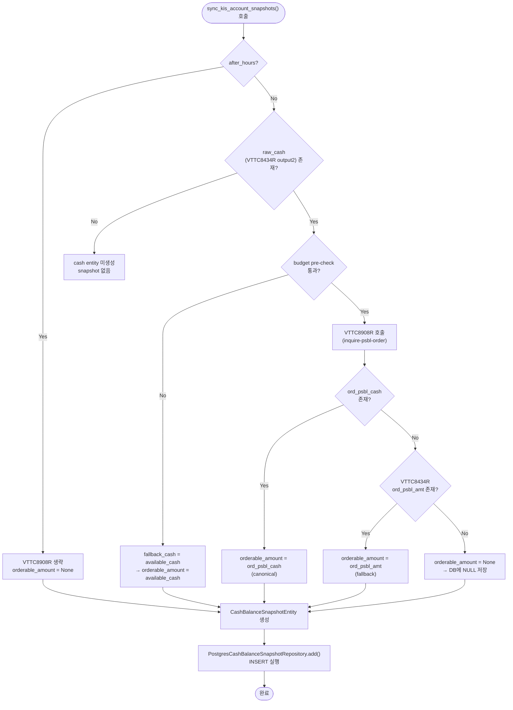

# `cash_balance_snapshots.orderable_amount` NULL 원인 데이터 흐름 분석 보고서

**작성일**: 2026-05-25  
**분석 범위**: KIS 응답 필드 → rest_client → snapshot service → entity → DB 저장

---

## 1. 전체 데이터 흐름 개요

```mermaid
flowchart TD
    KIS["KIS OpenAPI"] -->|VTTC8434R<br/>inquire-balance| RC1["rest_client.py<br/>get_cash_and_positions()"]
    KIS -->|VTTC8908R<br/>inquire-psbl-order| RC2["rest_client.py<br/>get_orderable_cash()"]
    
    RC1 -->|output2<br/>(cash summary)| KS["kis_snapshot_sync.py<br/>sync_kis_account_snapshots()"]
    RC2 -->|ord_psbl_cash| KS
    
    KS -->|CashBalanceSnapshotEntity<br/>orderable_amount=값| DB["PostgresCashBalanceSnapshotRepository<br/>cash_balance_snapshots 테이블"]
    
    subgraph "KIS 응답 구조"
        O2["VTTC8434R output2<br/>- dnca_tot_amt (예수금총액)<br/>- ord_psbl_amt (주문가능금액)<br/>- prvs_rcdl_excc_amt (가수도정산금액)"]
        O8908["VTTC8908R output<br/>- ord_psbl_cash (주문가능현금)"]
    end
    
    O2 -.->|fallback 경로| KS
    O8908 -->|primary 경로| KS
```

---

## 2. KIS 응답 필드 매핑 분석

### 2.1. 두 개의 KIS 엔드포인트, 두 개의 관련 필드

| KIS 엔드포인트 | TR ID | 관련 필드 | 의미 | Entity 매핑 |
|---|---|---|---|---|
| `inquire-balance` | VTTC8434R | `output2.ord_psbl_amt` | 주문가능금액 (output2 예수금 총괄) | `orderable_amount` (fallback) |
| `inquire-psbl-order` | VTTC8908R | `output.ord_psbl_cash` | 주문가능현금 (실제 주문 가능 현금) | `orderable_amount` (primary) |
| `inquire-balance` | VTTC8434R | `output2.dnca_tot_amt` | 예수금총액 | `available_cash` |
| `inquire-balance` | VTTC8434R | `output2.prvs_rcdl_excc_amt` | 가수도정산금액 (D+2 예수금 기준) | `settlement_amount` |

### 2.2. Canonical source field

**`orderable_amount`의 canonical source는 VTTC8908R (`inquire-psbl-order`) 응답의 `ord_psbl_cash` 필드다.**

코드 증거 ([`rest_client.py:1506`](src/agent_trading/brokers/koreainvestment/rest_client.py:1506)):
```python
ord_psbl_cash = output.get("ord_psbl_cash")
if ord_psbl_cash is not None and str(ord_psbl_cash).strip():
    return Decimal(str(ord_psbl_cash))
```

VTTC8434R의 `output2.ord_psbl_amt`는 fallback 경로로만 사용된다 ([`kis_snapshot_sync.py:486-488`](src/agent_trading/services/kis_snapshot_sync.py:486)):
```python
orderable_amount = _safe_optional_decimal(
    raw_cash.get(_KIS_ORD_PSBL_AMT)  # "ord_psbl_amt"
)
```

---

## 3. `orderable_amount`가 NULL이 되는 7가지 경로 (원인별 상세)

### 경로 A: after-hours 모드에서 VTTC8908R 완전 생략 (가장 빈번)

[`kis_snapshot_sync.py:447`](src/agent_trading/services/kis_snapshot_sync.py:447):
```python
if raw_cash and not after_hours:
    # ... VTTC8908R 호출 ...
elif after_hours and raw_cash:
    # orderable_amount remains None
    logger.info("after-hours skip; orderable_amount not needed after market close")
```

- **조건**: `after_hours=True`로 `sync_kis_account_snapshots()` 호출
- **결과**: `orderable_amount`는 `None`으로 남음 → entity에 `None` 전달 → DB에 `NULL` 저장
- **의도된 동작**: 장 마감 후(15:30 KST 이후) 매수 주문 불가 → `orderable_amount` 불필요
- **영향**: after-hours sync가 실행될 때마다 `orderable_amount = NULL`이 정상적으로 저장됨

### 경로 B: Budget pre-check 실패 → fallback_cash 반환 (available_cash로 fallback)

[`rest_client.py:1472-1480`](src/agent_trading/brokers/koreainvestment/rest_client.py:1472):
```python
if fallback_cash is not None and not self._has_budget_for_inquiry():
    return fallback_cash  # available_cash 값 반환
```

- **조건**: INQUIRY budget 소진, `fallback_cash=available_cash` 전달됨
- **결과**: `available_cash` 값이 `orderable_amount`로 저장됨 (NULL 아님)
- **영향**: NULL이 아닌 `available_cash` 값으로 저장되므로 문제 없음

### 경로 C: BudgetExhaustedError 발생 → available_cash fallback

[`kis_snapshot_sync.py:456-465`](src/agent_trading/services/kis_snapshot_sync.py:456):
```python
except BudgetExhaustedError:
    orderable_cash = available_cash  # fallback
```

- **조건**: budget pre-check 통과했으나 race condition으로 budget 소진
- **결과**: `available_cash` 값으로 fallback → NULL 아님
- **영향**: NULL이 아닌 값 저장

### 경로 D: VTTC8908R API 실패 (Exception) → available_cash fallback

[`kis_snapshot_sync.py:466-476`](src/agent_trading/services/kis_snapshot_sync.py:466):
```python
except Exception:
    orderable_cash = available_cash  # fallback
```

- **조건**: 네트워크 오류, 타임아웃, KIS 서버 오류 등
- **결과**: `available_cash` 값으로 fallback → NULL 아님
- **영향**: NULL이 아닌 값 저장

### 경로 E: VTTC8908R 응답에 `ord_psbl_cash` 필드 자체가 없음 → None 반환

[`rest_client.py:1506-1514`](src/agent_trading/brokers/koreainvestment/rest_client.py:1506):
```python
ord_psbl_cash = output.get("ord_psbl_cash")
if ord_psbl_cash is not None and str(ord_psbl_cash).strip():
    return Decimal(str(ord_psbl_cash))
# 필드가 없거나 빈 문자열 → None 반환
return None
```

- **조건**: KIS가 VTTC8908R 응답에서 `ord_psbl_cash`를 반환하지 않음
- **발생 가능 시나리오**:
  - 장중이지만 특정 계좌/환경에서 필드 미포함
  - paper 환경에서 특정 조건에서 필드 누락
  - KIS API 버전/변경으로 필드명 변경
- **결과**: `get_orderable_cash()`가 `None` 반환

### 경로 F: VTTC8908R None 반환 + VTTC8434R `ord_psbl_amt`도 없음 → orderable_amount = None

[`kis_snapshot_sync.py:478-498`](src/agent_trading/services/kis_snapshot_sync.py:478):
```python
if orderable_cash is not None:
    orderable_amount = Decimal(str(orderable_cash))
else:
    # Fallback: use ord_psbl_amt from VTTC8434R output2
    orderable_amount = _safe_optional_decimal(raw_cash.get(_KIS_ORD_PSBL_AMT))
    if orderable_amount is not None:
        # VTTC8434R fallback 성공
    else:
        # VTTC8434R ord_psbl_amt도 없음 → orderable_amount = None
```

- **조건**: 경로 E 발생 + VTTC8434R output2에도 `ord_psbl_amt` 필드 없음
- **결과**: `orderable_amount = None` → entity에 `None` 전달 → DB에 `NULL` 저장
- **영향**: **이 경로가 실제 NULL 저장의 핵심 원인 중 하나**

### 경로 G: `raw_cash` 자체가 없음 (VTTC8434R 실패)

[`kis_snapshot_sync.py:507-510`](src/agent_trading/services/kis_snapshot_sync.py:507):
```python
elif not raw_cash:
    logger.info("No cash balance data available — orderable_amount remains None")
```

- **조건**: `get_cash_and_positions()`가 `cash_balance=None` 반환
- **결과**: cash entity 자체가 생성되지 않음 → snapshot 없음
- **영향**: `orderable_amount` NULL 문제와는 무관 (snapshot 미생성)

---

## 4. 5개 질문에 대한 답변

### Q1. `orderable_amount`의 canonical source field는 KIS 응답의 무엇인가?

**VTTC8908R (`inquire-psbl-order`) 응답의 `ord_psbl_cash` 필드**가 canonical source다.

fallback 경로로 VTTC8434R (`inquire-balance`) output2의 `ord_psbl_amt` 필드가 사용되지만, 이는 2차 fallback이며 paper 환경에서는 `"0"`을 반환하거나 필드 자체가 누락될 수 있다 ([`rest_client.py:1437-1441`](src/agent_trading/brokers/koreainvestment/rest_client.py:1437)).

### Q2. 현재 NULL이 되는 케이스는 다음 중 어디인가?

**복합적 원인으로, 가장 빈번한 경로는 다음과 같다:**

1. **after-hours 모드 (경로 A)** — 가장 빈번하고 명확한 원인. `after_hours=True`로 호출 시 VTTC8908R을 아예 호출하지 않아 `orderable_amount`가 `None`으로 남음. 이는 **의도된 동작**이지만, after-hours snapshot을 조회하는 consumer가 `orderable_amount`가 NULL일 때 `available_cash`로 fallback해야 하는지 인지하지 못하면 문제가 됨.

2. **VTTC8908R 응답에 `ord_psbl_cash` 필드 부재 + VTTC8434R `ord_psbl_amt`도 부재 (경로 E+F)** — 장중이지만 KIS가 `ord_psbl_cash`를 반환하지 않는 경우. paper 환경에서 특히 발생 가능.

3. **Budget pre-check 실패 (경로 B)** — 이 경우는 `available_cash`로 fallback되므로 NULL이 저장되지는 않음. 단, `orderable_amount`가 `available_cash`와 동일한 값으로 저장되어 의미적으로는 "정확한 orderable_amount가 아님".

### Q3. `available_cash`와 `orderable_amount`가 다를 때 현재 어떤 경로로 저장되는가?

두 값이 다른 경우는 다음과 같이 처리된다:

| 상황 | `available_cash` | `orderable_amount` | 저장값 |
|---|---|---|---|
| 장중, VTTC8908R 성공 | `dnca_tot_amt` | `ord_psbl_cash` (VTTC8908R) | 각각 다른 값 |
| 장중, VTTC8908R 실패 → fallback | `dnca_tot_amt` | `available_cash`와 동일 | 동일한 값 |
| after-hours | `dnca_tot_amt` | `None` | `NULL` |
| budget pre-check fail | `dnca_tot_amt` | `available_cash`와 동일 | 동일한 값 |

**핵심**: `available_cash`(`dnca_tot_amt`)는 **항상** VTTC8434R output2에서 추출되며, `orderable_amount`는 별도 API(VTTC8908R)에서 가져온다. 두 값이 다른 경우는 VTTC8908R이 성공한 경우에만 발생하며, 이때 각각의 원래 값이 그대로 저장된다.

### Q4. after-hours / holiday에서도 `orderable_amount`가 기대 가능한 값인지?

**after-hours (15:30~16:30 KST): 기대 불가능. 현재 의도적으로 생략됨.**

코드에 명시적으로 `after_hours=True` 시 VTTC8908R을 생략하도록 설계되어 있다 ([`kis_snapshot_sync.py:447`](src/agent_trading/services/kis_snapshot_sync.py:447)):
```python
if raw_cash and not after_hours:
    # ... VTTC8908R 호출 ...
```

근거:
- 장 마감 후 매수 주문이 불가능하므로 `orderable_amount`가 의미 없음
- KIS after-hours API(`AFHR_FLPR_YN=Y`)는 잔고조회만 지원하며 매수가능조회는 장중 전용
- `orderable_amount`는 **장중에만 신뢰 가능**한 값

**holiday**: KIS API가 `OPR00001` (업무일이 아닙니다) 오류를 반환할 수 있음. 이 경우 `get_cash_and_positions()` 자체가 실패하여 cash snapshot이 생성되지 않음.

### Q5. `available_cash`(KIS: `prvs_rcdl_exc_amt`)는 항상 non-null인가?

**아니오. `available_cash`는 `dnca_tot_amt`(예수금총액)에서 추출되며, 이 값이 항상 존재한다고 보장할 수 없다.**

코드 분석 ([`kis_snapshot_sync.py:294`](src/agent_trading/services/kis_snapshot_sync.py:294)):
```python
available_cash = _safe_decimal(raw_cash.get(_KIS_DNCA_TOT_AMT, "0"))
```

`_safe_decimal()`는 변환 실패 시 `Decimal("0")`을 반환하므로, **`available_cash`는 최소한 `Decimal("0")`이 보장된다.** 하지만 이는 코드 레벨의 기본값이지 KIS 응답에 `dnca_tot_amt`가 항상 존재한다는 의미는 아니다.

**`prvs_rcdl_excc_amt`(가수도정산금액)는 `settlement_amount`에 매핑**되며, 이는 `_safe_optional_decimal()`을 통해 `None`이 허용된다 ([`kis_snapshot_sync.py:303`](src/agent_trading/services/kis_snapshot_sync.py:303)):
```python
settlement_amount = _safe_optional_decimal(raw_cash.get(_KIS_PRVS_RCDL_EXCC_AMT))
```

**결론**:
- `available_cash` (`dnca_tot_amt`): 코드 레벨에서 `Decimal("0")` 기본값 보장. DB 컬럼도 `NOT NULL`.
- `settlement_amount` (`prvs_rcdl_excc_amt`): `None` 가능. DB 컬럼도 nullable.
- `orderable_amount` (`ord_psbl_cash` / `ord_psbl_amt`): `None` 가능. DB 컬럼도 nullable.

---

## 5. 데이터 흐름 상세 경로도



---

## 6. NULL 저장 경로 요약 테이블

| # | 경로 | 조건 | `orderable_amount` 결과 | 빈도 | 심각도 |
|---|---|---|---|---|---|
| A | after-hours 생략 | `after_hours=True` | `None` (의도적) | **높음** (매일 장후) | 낮음 (의도된 동작) |
| B | Budget pre-check fail | INQUIRY budget 부족 | `available_cash` 값 (NULL 아님) | 중간 | 낮음 |
| C | BudgetExhaustedError | race condition | `available_cash` 값 (NULL 아님) | 낮음 | 낮음 |
| D | API Exception | 네트워크/서버 오류 | `available_cash` 값 (NULL 아님) | 낮음 | 낮음 |
| E | `ord_psbl_cash` 필드 부재 | KIS 응답에 필드 없음 | `None` (→ fallback 시도) | 중간 | 중간 |
| F | E + `ord_psbl_amt`도 부재 | 두 응답 모두 필드 없음 | **`None` (→ DB NULL)** | **중간** | **높음** |
| G | `raw_cash` 자체 없음 | VTTC8434R 실패 | snapshot 미생성 | 낮음 | 해당 없음 |

---

## 7. 결론 및 권장사항

### 핵심 원인

1. **after-hours sync (경로 A)**: `orderable_amount = NULL`이 가장 빈번하게 발생하는 경로. 의도된 동작이지만, consumer(주문 사이징 엔진)가 이 사실을 인지하고 `available_cash`로 fallback해야 함.

2. **VTTC8908R 응답缺失 + VTTC8434R fallback도 실패 (경로 E+F)**: 장중에 발생하는 진짜 문제. KIS가 `ord_psbl_cash`를 반환하지 않는 조건을 파악해야 함.

### 권장 조치

1. **after-hours consumer 가이드**: 주문 사이징 엔진이 `orderable_amount IS NULL`일 때 `available_cash`를 사용하도록 명시적 로직 추가
2. **VTTC8908R failure observability**: `ord_psbl_cash` 필드 부재 시 로그 레벨을 `WARNING`으로 상향
3. **fallback 체인 강화**: VTTC8908R 실패 → VTTC8434R `ord_psbl_amt` → `available_cash` 순으로 fallback하도록 개선 (현재는 VTTC8434R fallback 실패 시 `None`으로 종료)
4. **모니터링**: `fetch_status` 컬럼을 활용하여 `orderable_amount IS NULL`인 snapshot의 `fetch_status` 분포 추적

### 현재 fallback 체인의 문제점

현재 [`kis_snapshot_sync.py:478-498`](src/agent_trading/services/kis_snapshot_sync.py:478)에서 VTTC8908R이 `None`을 반환하면 VTTC8434R의 `ord_psbl_amt`를 fallback으로 시도하지만, 이것도 없으면 `orderable_amount = None`으로 최종 결정된다. **이 시점에서 `available_cash`로 한 번 더 fallback하지 않는다.** 이는 개선 여지가 있는 부분이다.

---

## 8. 참조 파일

| 파일 | 경로 | 주요 역할 |
|---|---|---|
| KIS REST client | [`src/agent_trading/brokers/koreainvestment/rest_client.py`](src/agent_trading/brokers/koreainvestment/rest_client.py) | VTTC8434R/VTTC8908R 호출, `ord_psbl_cash` 파싱 |
| Domain entities | [`src/agent_trading/domain/entities.py`](src/agent_trading/domain/entities.py) | `CashBalanceSnapshotEntity` 정의 (`orderable_amount: Decimal \| None`) |
| KIS snapshot sync | [`src/agent_trading/services/kis_snapshot_sync.py`](src/agent_trading/services/kis_snapshot_sync.py) | `sync_kis_account_snapshots()` — 전체 오케스트레이션 |
| Generic snapshot sync | [`src/agent_trading/services/snapshot_sync.py`](src/agent_trading/services/snapshot_sync.py) | `SnapshotFetchProvider` protocol, budget fallback counters |
| DB repository | [`src/agent_trading/repositories/postgres/cash_balance_snapshots.py`](src/agent_trading/repositories/postgres/cash_balance_snapshots.py) | `INSERT` 실행, `orderable_amount`를 `$12` 바인딩 |
| Migration 0018 | [`db/migrations/0018_add_orderable_amount.sql`](db/migrations/0018_add_orderable_amount.sql) | `orderable_amount NUMERIC(30, 6)` 컬럼 추가 (nullable) |
