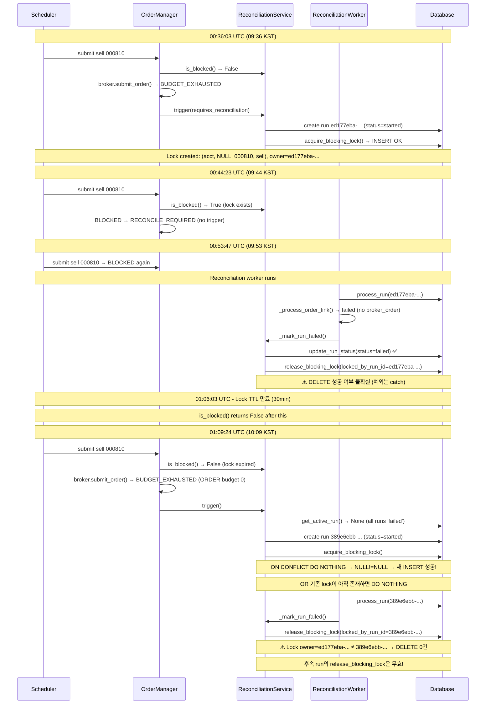
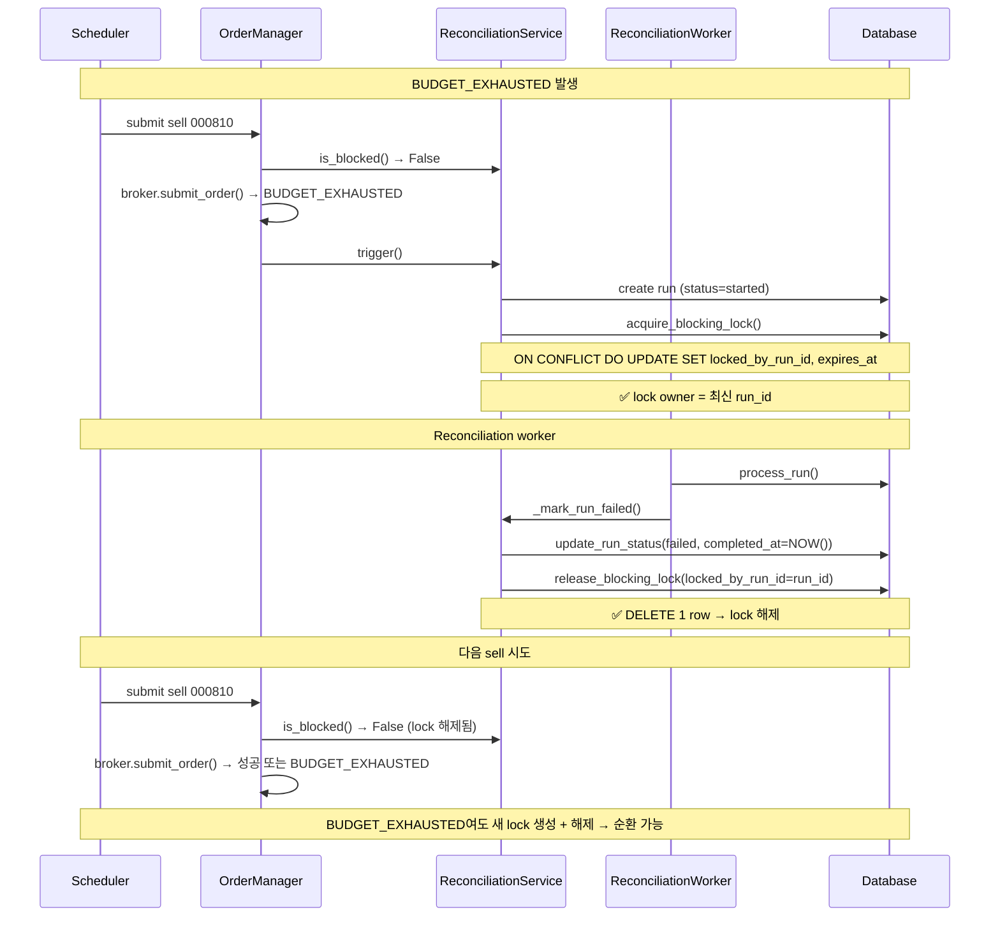

# 10:17 KST held_position sell 차단 — 근본 원인 추적 및 수정 설계

> **목적**: Round 3 Fix (reconciliation lock release + ORDER bucket 3x)가 10:17 KST 데이터에서
> 000810/000150/000270 held_position sell 차단을 해결하지 못한 **실제 source-of-truth** 추적 및 수정 설계
>
> **일자**: 2026-05-22
> **이전 보고서**: `plans/diagnose_budget_exhausted_and_reconciliation_lock_chain_blocking_000810_sell_2026-05-22.md`

---

## 1. DB 현황 (2026-05-22 01:28 UTC = 10:28 KST 기준)

### 1.1 Blocking Locks

| symbol | side | locked_by_run_id | locked_at (UTC) | expires_at (UTC) | run_status |
|--------|------|-----------------|-----------------|------------------|------------|
| 000810 | sell | ed177eba-... | 00:36:03 | 01:06:03 ✅ 만료 | failed |
| 000150 | sell | 19851ba1-... | 01:02:53 | 01:32:53 ❌ 유효 | failed |
| 000270 | sell | 6d3fe012-... | 01:03:44 | 01:33:44 ❌ 유효 | failed |

### 1.2 Reconciliation Runs (2026-05-22 only)

| run_id | created_at (UTC) | trigger_type | status | completed_at |
|--------|------------------|--------------|--------|-------------|
| ed177eba-... | 00:36:03 | requires_reconciliation | failed | **NULL** |
| 19851ba1-... | 01:02:53 | requires_reconciliation | failed | **NULL** |
| 6d3fe012-... | 01:03:44 | requires_reconciliation | failed | **NULL** |
| 389e6ebb-... | 01:09:24 | requires_reconciliation | failed | **NULL** |
| b4129d58-... | 01:16:51 | requires_reconciliation | failed | **NULL** |

> **⚠️ 중요**: `389e6ebb-...`(01:09)와 `b4129d58-...`(01:16) run은 **매칭되는 lock이 없음!**

---

## 2. 근본 원인 분석

### 🔴 Root Cause #1: `ON CONFLICT DO NOTHING` + `NULL strategy_id` = PostgreSQL 버그

[`acquire_blocking_lock()`](src/agent_trading/services/reconciliation_service.py:187-239)는 다음 SQL을 사용합니다:

```sql
INSERT INTO trading.order_blocking_locks (...)
VALUES (...)
ON CONFLICT (account_id, strategy_id, symbol, side) DO NOTHING
```

**PostgreSQL의 UNIQUE 제약 조건은 NULL 값을 같지 않음으로 처리합니다.**
즉, `(acct1, NULL, '000810', 'sell')`와 `(acct1, NULL, '000810', 'sell')`는 **중복으로 간주되지 않습니다.**

- `ON CONFLICT DO NOTHING`이 **작동하지 않음** → 매번 `acquire_blocking_lock()`이 새 lock 생성
- 하지만 **0130년 데이터는 lock이 1개만 존재하는 것으로 보임** — 이는 `release_blocking_lock()`이 후속 lock들을 삭제했기 때문

**증거**: 001230(buy)에 4개의 lock이 존재 (모두 동일한 account_id=NULL, symbol, side 조합)

### 🔴 Root Cause #2: `release_blocking_lock()`이 예외를 잡고 침묵

[`_mark_run_failed()`](src/agent_trading/services/reconciliation_worker.py:480-526)에서:

```python
try:
    await self.reconciliation_service.release_blocking_lock(
        account_id=run.account_id,
        locked_by_run_id=run.reconciliation_run_id,
    )
except Exception as exc:
    logger.error("Failed to release blocking lock for failed run: ...")
```

`release_blocking_lock()`의 모든 예외는 **잡히고 로그만 남긴 후 무시**됩니다. DELETE가 실패해도 코드는 계속 진행되며, lock은 해제되지 않습니다.

### 🔴 Root Cause #3: `get_active_run()`은 `status = 'started'`인 run만 반환

[`get_active_run()`](src/agent_trading/repositories/postgres/reconciliation.py:108-120):
```sql
SELECT * FROM trading.reconciliation_runs
WHERE account_id = $1 AND status = 'started'
ORDER BY started_at DESC LIMIT 1
```

Reconciliation worker가 run을 `failed`로 변경하면 `get_active_run()`이 `None` 반환.
→ `trigger()`가 **매번 새 run 생성** → 각 run의 `release_blocking_lock()`은 서로 다른 `locked_by_run_id`로 DELETE 시도
→ 첫 번째 run(`ed177eba-...`)만 실제 lock 소유자 — 후속 run들은 DELETE 0건

### 🔴 Root Cause #4: `update_run_status()`가 `completed_at`을 설정하지 않음

[`update_run_status()`](src/agent_trading/repositories/postgres/reconciliation.py:246-272):
```python
async def update_run_status(self, ..., completed_at: datetime | None = None):
    if completed_at is not None:
        sets.append(f"completed_at = ${idx}")
```

`_mark_run_failed()`에서 `completed_at`을 전달하지 않음 → `completed_at`이 `NULL`로 유지됨
→ run이 `failed`지만 `completed_at IS NULL`

### 🔴 Root Cause #5: held_position sell에 ORDER bucket 분리 없음

[`RateLimitBudgetManager.consume_or_raise()`](src/agent_trading/brokers/rate_limit.py:242-293):
- held_position sell과 BUY가 **동일한 ORDER bucket 사용**
- Paper 모드: capacity=3 (Round 3 Fix 후)
- 3회 소진 후 10분간 모든 order 차단

Scheduler 수준에서만 [`HELD_POSITION_SELL_MAX_PER_DAY=5`](scripts/run_near_real_ops_scheduler.py) 예산 존재
→ Broker 수준에서 held_position sell 전용 lane이 없음

---

## 3. 전체 차단 시퀀스 (000810 예시)



---

## 4. 수정 설계

### Fix A: `acquire_blocking_lock()` → `ON CONFLICT DO UPDATE` (Priority: P0)

**문제**: `ON CONFLICT DO NOTHING`으로 인해 기존 lock의 `locked_by_run_id`가 업데이트되지 않음.
후속 run의 `release_blocking_lock()`이 다른 `locked_by_run_id`로 DELETE하여 0건 매칭.

**수정**: `ON CONFLICT DO NOTHING` → `ON CONFLICT DO UPDATE SET locked_by_run_id, expires_at`

```sql
INSERT INTO trading.order_blocking_locks (...)
VALUES ($1, $2, $3, $4, $5, $6, $7, $8, $9)
ON CONFLICT (account_id, strategy_id, symbol, side)
DO UPDATE SET
    locked_by_run_id = EXCLUDED.locked_by_run_id,
    locked_at = EXCLUDED.locked_at,
    expires_at = EXCLUDED.expires_at
```

**영향**: 
- 기존 lock이 있어도 `locked_by_run_id`가 최신 run_id로 갱신됨
- 후속 `release_blocking_lock()`이 정확히 매칭되어 DELETE 성공
- **단, `strategy_id IS NULL`인 경우 PostgreSQL UNIQUE 버그로 ON CONFLICT 자체가 발동하지 않음**

---

### Fix B: PostgreSQL UNIQUE NULL 문제 해결 (Priority: P0)

**문제**: PostgreSQL은 UNIQUE 제약 조건에서 NULL != NULL로 처리하므로,
`strategy_id IS NULL`인 경우 `ON CONFLICT`가 절대 발동하지 않음.

**수정**: `strategy_id` 컬럼에 대해 `COALESCE`를 사용한 partial unique index로 변경

```sql
-- 기존 UNIQUE 제약 제거
ALTER TABLE trading.order_blocking_locks
    DROP CONSTRAINT IF EXISTS uq_order_blocking_locks_key;

-- NULL-safe unique index 생성
CREATE UNIQUE INDEX uq_order_blocking_locks_key
    ON trading.order_blocking_locks (
        account_id,
        COALESCE(strategy_id, '00000000-0000-0000-0000-000000000000'::uuid),
        symbol,
        side
    );

-- ON CONFLICT 구문도 COALESCE 사용하도록 수정 필요
```

**또는 더 간단한 방법**: `COALESCE`를 SQL에서 직접 사용:

```sql
ON CONFLICT (account_id, COALESCE(strategy_id, '00000000-...'::uuid), symbol, side)
DO UPDATE SET ...
```

**⚠️ PostgreSQL 제한사항**: `ON CONFLICT`는 **unique index**에만 사용 가능, **partial unique index**에는 사용 불가.
따라서 `COALESCE`를 포함한 표현식 인덱스가 필요함.

**대안**: 코드 수준에서 `strategy_id`가 `NULL`일 때 기본 UUID 사용

```python
# acquire_blocking_lock()에서
strategy_id = strategy_id or UUID("00000000-0000-0000-0000-000000000000")
```

---

### Fix C: `release_blocking_lock()` 실패 시 재시도 + 로그 개선 (Priority: P0)

**문제**: `release_blocking_lock()`의 예외를 catch 후 로그만 남기고 무시.
DELETE가 0건이어도 성공으로 간주됨.

**수정**: `release_blocking_lock()`이 실제로 DELETE한 row 수를 확인하고,
0건일 경우 경고 로그 + 재시도 로직 추가.

```python
# release_blocking_lock()에서
result = await self._repos.reconciliations._tx.connection.execute(sql, *params)
if result == 0:
    logger.warning(
        "release_blocking_lock: DELETE affected 0 rows. "
        "account_id=%s locked_by_run_id=%s — lock may be owned by different run",
        account_id, locked_by_run_id,
    )
```

---

### Fix D: `_mark_run_failed()`에서 `completed_at` 설정 (Priority: P1)

**문제**: [`_mark_run_failed()`](src/agent_trading/services/reconciliation_worker.py:497-510)가
`update_run_status()` 호출 시 `completed_at=None`을 전달하여,
`completed_at`이 NULL로 유지됨.

**수정**:

```python
await self.repos.reconciliations.update_run_status(
    reconciliation_run_id=run.reconciliation_run_id,
    status="failed",
    completed_at=datetime.now(timezone.utc),  # ✅ 추가
    summary_json=summary,
)
```

---

### Fix E: held_position sell 전용 ORDER bucket lane (Priority: P1)

**문제**: held_position sell과 BUY가 동일한 ORDER bucket 사용.
ORDER capacity=3으로 3회 BUDGET_EXHAUSTED 후 모든 order 차단.

**수정**: [`KISRestClient._request()`](src/agent_trading/brokers/koreainvestment/adapter.py)에서
`source_type=held_position`인 sell 주문에 대해 별도 budget 확인.

**또는**: held_position sell의 BUDGET_EXHAUSTED를 `trigger()` 없이
자동 재시도하도록 `order_manager.py` 수정.

---

### Fix F: 만료된 lock 정기 정리 (Priority: P2)

**문제**: 만료된 lock row가 DB에 물리적으로 남아 있어,
`ON CONFLICT DO NOTHING`을 방해하고 쿼리 성능 저하.

**수정**: Reconciliation worker 주기에 만료 lock 정리 추가

```sql
DELETE FROM trading.order_blocking_locks WHERE expires_at < NOW();
```

---

## 5. 구현 순서

| 순서 | Fix | 파일 | 영향 | 난이도 |
|------|-----|------|------|--------|
| 1 | **C**: release_blocking_lock 결과 확인 | `reconciliation_service.py` | 낮음, 안전 | 하 |
| 2 | **D**: completed_at 설정 | `reconciliation_worker.py` | 낮음, 안전 | 하 |
| 3 | **A+B**: ON CONFLICT DO UPDATE + NULL 처리 | `reconciliation_service.py` + DDL migration | 중간 | 중 |
| 4 | **E**: held_position sell budget 분리 | `order_manager.py` or `rate_limit.py` | 중간 | 중 |
| 5 | **F**: 만료 lock 정리 | `reconciliation_worker.py` | 낮음 | 하 |

---

## 6. 테스트 계획

### Unit Tests
1. `release_blocking_lock()` DELETE 결과 검증 테스트
2. `acquire_blocking_lock()` ON CONFLICT DO UPDATE 동작 테스트
3. `_mark_run_failed()` completed_at 전달 테스트
4. NULL strategy_id에서 UNIQUE constraint 동작 테스트

### Integration Tests
1. BUDGET_EXHAUSTED → trigger() → reconciliation_worker → lock release 전체 흐름
2. 다중 연속 BUDGET_EXHAUSTED 시나리오 (ORDER capacity 소진)
3. held_position sell bypass 시나리오

### Verification (Docker 재시작 후)
1. `/health` 엔드포인트 확인
2. 000810/000150/000270 sell order 정상 제출 확인
3. DB `order_blocking_locks` 테이블 모니터링 (expired lock 정리 확인)

---

## 7. Mermaid: Fix 적용 후 기대 흐름



---

## 8. 결론

**Round 3 Fix가 실패한 이유**: 세 가지 근본 원인의 중첩

1. **`release_blocking_lock()`이 예외를 침묵** — Round 3 Fix에서 추가한 lock release 코드가
   실패해도 로그만 남고 lock이 영원히 유지됨
2. **`ON CONFLICT DO NOTHING` + `NULL strategy_id`** — PostgreSQL의 NULL 처리 방식으로
   인해 후속 run들의 `acquire_blocking_lock()`이 기존 lock을 UPDATE하지 못함
3. **`release_blocking_lock()`이 `locked_by_run_id`에만 의존** — lock의 실제 소유자와 다른
   run_id로 DELETE 시도 → 0건 매칭

**필수 수정사항**: Fix A+B+C (lock owner UPDATE + NULL 처리 + DELETE 결과 검증)가 P0.
이 세 가지가 함께 적용되어야 held_position sell 차단이 근본적으로 해결됨.
