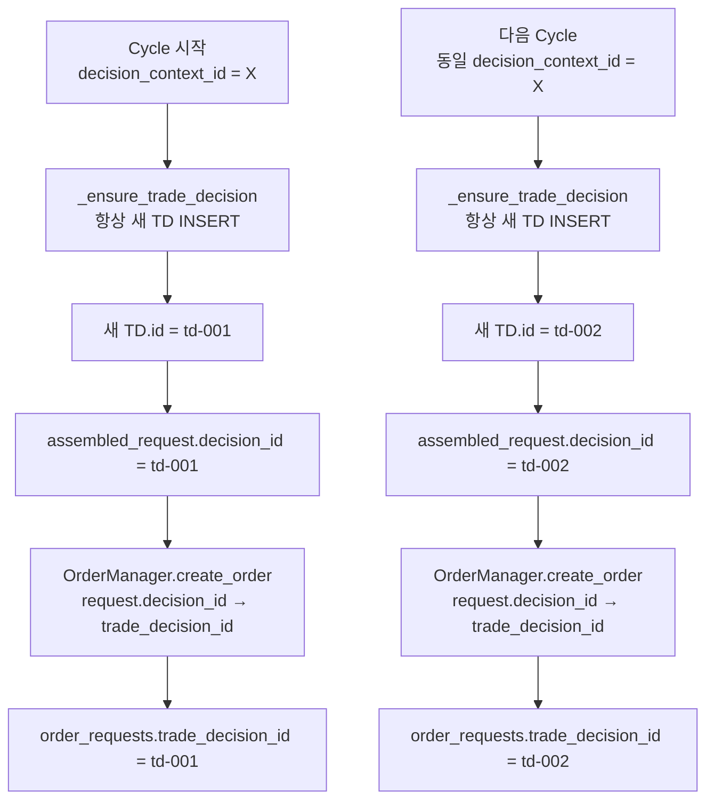
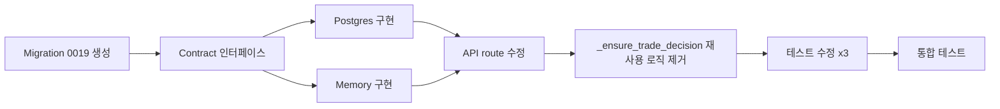

# Trade Decision 신규 INSERT 정책 재설계

**작성일**: 2026-05-20  
**상태**: 설계 초안  
**관련 이슈**: Phase 2 `_ensure_trade_decision()` 재설계 (기존 UPDATE 방식 폐기)

---

## 1. 배경 및 문제 정의

### 1.1 기존 설계 (폐기)

기존 Phase 2 설계는 [`_ensure_trade_decision()`](src/agent_trading/services/decision_orchestrator.py:2277)에서 `decision_context_id`로 기존 `TradeDecisionEntity`(이하 TD)를 조회하고, 존재하면 **무조건 재사용**했다. 이는 [`db/migrations/0001_initial_schema.sql`](db/migrations/0001_initial_schema.sql:271)의 `UNIQUE` 제약(`decision_context_id UUID NOT NULL UNIQUE`)에 의해 1 context = 1 row가 강제되었기 때문이다.

### 1.2 폐기 사유

| 문제 | 설명 |
|------|------|
| 과거 판단 이력 훼손 | 같은 context에서 AI 판단이 달라져도 기존 TD가 UPDATE되지 않아 이력이 소멸됨 |
| decision/order 정합성 왜곡 | HOLD decision에 order_request가 연결 (4건), order_at < decision_at (음수 lag, 7건), decision side ≠ order side (4건) |
| 근본 해결책 아님 | 단순 재사용 로직은 근본적으로 다중 판단 이력을 추적할 수 없음 |

### 1.3 새 방향

**원칙**: 현재 cycle의 actionable decision은 **항상 새 `trade_decision` row를 INSERT**한다.  
**효과**: 각 cycle의 AI 판단이 독립적인 row로 보존되어 감사(audit) 및 사후 분석이 가능해진다.

---

## 2. Schema 변경

### 2.1 현재 스키마

[`db/migrations/0001_initial_schema.sql`](db/migrations/0001_initial_schema.sql:269-284):
```sql
CREATE TABLE IF NOT EXISTS trading.trade_decisions (
    trade_decision_id UUID PRIMARY KEY DEFAULT gen_random_uuid(),
    decision_context_id UUID NOT NULL UNIQUE  -- ← 이 제약이 문제
        REFERENCES trading.decision_contexts (decision_context_id),
    ...
);
```

### 2.2 변경 후 스키마 (Migration 0019)

```sql
BEGIN;

-- ============================================================================
-- Migration 0019: Remove UNIQUE constraint on decision_context_id
--
-- Allow multiple trade_decisions per decision_context to support
-- INSERT-only policy. Each cycle creates a new row.
--
-- Rollback: Re-add UNIQUE constraint (will fail if duplicates exist)
-- ============================================================================

-- 1. Drop the UNIQUE constraint on decision_context_id
-- PostgreSQL auto-generates constraint name as {table}_{column}_key
-- (no schema prefix), so the name is trade_decisions_decision_context_id_key.
ALTER TABLE trading.trade_decisions
    DROP CONSTRAINT IF EXISTS trade_decisions_decision_context_id_key;

-- 2. Add a composite index for efficient "latest TD by context" lookup
-- Supports: ORDER BY created_at DESC, trade_decision_id DESC LIMIT 1
CREATE INDEX IF NOT EXISTS idx_trade_decisions_context_created
    ON trading.trade_decisions (decision_context_id, created_at DESC, trade_decision_id DESC);

-- 3. Add index for decision_context_id alone (for JOIN performance)
CREATE INDEX IF NOT EXISTS idx_trade_decisions_decision_context_id
    ON trading.trade_decisions (decision_context_id);

COMMIT;
```

### 2.3 Rollback SQL

```sql
BEGIN;

-- Rollback: Remove indexes
DROP INDEX IF EXISTS trading.idx_trade_decisions_context_created;
DROP INDEX IF EXISTS trading.idx_trade_decisions_decision_context_id;

-- Rollback: Re-add UNIQUE constraint
-- WARNING: Will fail if duplicate decision_context_id rows exist!
ALTER TABLE trading.trade_decisions
    ADD CONSTRAINT trade_decisions_decision_context_id_key
    UNIQUE (decision_context_id);

COMMIT;
```

> **주의**: Rollback 시 duplicate row가 존재하면 `ALTER TABLE ADD CONSTRAINT`가 실패한다.  
> Rollback 전에 중복 데이터 정리가 필요하다.

### 2.4 데이터 보존 정책

- 기존 TD 데이터는 **변경하지 않는다** (ALTER TABLE only)
- 중복 `decision_context_id`가 발생해도 기존 FK(`order_requests.trade_decision_id`)가 깨지지 않음
- 기존 order가 참조하는 TD는 그대로 유효

---

## 3. `_ensure_trade_decision()` 로직 변경

### 3.1 현재 로직 (폐기 대상)

[`src/agent_trading/services/decision_orchestrator.py`](src/agent_trading/services/decision_orchestrator.py:2277-2389):
```python
async def _ensure_trade_decision(self, ...):
    existing = await self._repos.trade_decisions.get_by_context(
        decision_context_id
    )
    if existing is not None:
        return existing.trade_decision_id  # ← 무조건 재사용
    # 없으면 INSERT
    ...
    saved = await self._repos.trade_decisions.add(decision)
    return saved.trade_decision_id
```

### 3.2 변경 후 로직

```python
async def _ensure_trade_decision(self, ...):
    """항상 새 TradeDecisionEntity를 INSERT한다.
    
    기존 get_by_context() 조회와 재사용 로직을 제거하고,
    항상 새로운 row를 생성한다. decision_context_id의 UNIQUE 제약이
    제거되었으므로 동일 context에 여러 TD가 존재할 수 있다.
    """
    if decision_context_id is None:
        return None

    decision_context = assembled_context.decision_context
    if decision_context is None:
        return None

    now = datetime.now(timezone.utc)
    composer_output = agent_bundle.composer_output
    ai_inputs = agent_bundle.ai_inputs

    try:
        decision = TradeDecisionEntity(
            trade_decision_id=uuid4(),
            decision_context_id=decision_context_id,
            decision_type=_resolve_decision_type(composer_output.decision_type),
            side=_resolve_order_side(composer_output.side, request.side),
            strategy_id=decision_context.strategy_id,
            symbol=request.symbol,
            market=request.market,
            entry_style=_resolve_entry_style(
                composer_output.entry_style,
                request.order_type,
            ),
            created_at=now,
            source_type=assembled_context.source_type,
            agent_run_id=fdc_run_id,
            entry_price=_decimal_or_none(request.price),
            quantity=_decimal_or_none(request.quantity),
            max_order_value=_calculate_max_order_value(
                request.price,
                request.quantity,
            ),
            confidence=Decimal(str(composer_output.confidence)),
            risk_check_passed=ai_inputs.risk_opinion in {"allow", "reduce"},
            reason_codes=list(composer_output.reason_codes) or None,
            opposing_evidence={...},
            exit_plan_json=_dataclass_to_dict(composer_output.exit_plan_hint),
            calculation_version="decision_orchestrator.v1",
            agent_version_json=dict(ai_inputs.schema_versions),
            rationale_summary=validate_or_normalize_korean(
                composer_output.summary or None
            ),
            decision_json={...},
        )
        saved = await self._repos.trade_decisions.add(decision)
        return saved.trade_decision_id
    except Exception:
        logger.warning(
            "Trade decision persistence failed. decision_context_id=%s",
            decision_context_id,
            exc_info=True,
        )
        return None
```

### 3.3 변경 요약

| 항목 | 변경 전 | 변경 후 |
|------|--------|--------|
| `get_by_context()` 호출 | 있음 (재사용 확인) | **제거** |
| 재사용 분기 | `if existing: return existing.id` | **제거** |
| INSERT 로직 | TD 없을 때만 실행 | **항상 실행** |
| `get_by_context()` 유지 | - | `TradeDecisionRepository` 인터페이스에 **유지** (order 연결 정책에서 사용) |

---

## 4. Order 연결 정책

### 4.1 현재 Order 연결 방식

[`src/agent_trading/services/decision_orchestrator.py`](src/agent_trading/services/decision_orchestrator.py:826-831):
```python
# _ensure_trade_decision()이 반환한 trade_decision_id를 decision_id로 사용
trade_decision_id = await self._ensure_trade_decision(...)
decision_id = str(trade_decision_id)  # SubmitOrderRequest.decision_id
```

[`src/agent_trading/services/order_manager.py`](src/agent_trading/services/order_manager.py:289-295):
```python
# SubmitOrderRequest.decision_id를 OrderRequestEntity.trade_decision_id로 변환
trade_decision_id: UUID | None = None
if request.decision_id is not None:
    trade_decision_id = UUID(request.decision_id)
```

### 4.2 변경 후 Order 연결 정책



**변경 사항 없음**: `_ensure_trade_decision()`이 항상 새 TD ID를 반환하므로,  
`assembled_request.decision_id` = `str(trade_decision_id)`의 흐름은 그대로 유지된다.

즉, **order 연결 정책 자체는 변경이 필요 없다.**  
_ensure_trade_decision()이 항상 새 ID를 반환하기만 하면, 자연스럽게 order는 가장 최신 TD에 연결된다.

### 4.3 `decision_context_id`로 최신 TD 조회 (Read Path)

#### 4.3.1 Read Path 용도

새로 추가되는 **read path** 용도:

1. **API `/trade-decisions?decision_context_id=...`**: [`src/agent_trading/api/routes/decisions.py`](src/agent_trading/api/routes/decisions.py:66)에서 현재 단일 TD 반환, **여러 TD 반환으로 변경 필요**
2. **Admin UI에서 TD 이력 표시**: `decision_context_id`로 여러 TD를 조회
3. **사후 분석/감사**: 동일 context의 TD 변화 추적

이를 위해 [`TradeDecisionRepository`](src/agent_trading/repositories/contracts.py:316-327)에 새 메서드 추가:

```python
class TradeDecisionRepository(Protocol):
    async def add(self, decision: TradeDecisionEntity) -> TradeDecisionEntity: ...
    async def get(self, trade_decision_id: UUID) -> TradeDecisionEntity | None: ...
    async def get_by_context(self, decision_context_id: UUID) -> TradeDecisionEntity | None:
        """Returns the **latest** TD for the given context, or None.
        
        Tie-break: created_at DESC, trade_decision_id DESC (UUID v4).
        """
        ...
    async def list_by_context(self, decision_context_id: UUID) -> Sequence[TradeDecisionEntity]:
        """Returns **all** TDs for the given context, ordered by
        created_at DESC, trade_decision_id DESC."""
        ...
    async def list_all(self) -> Sequence[TradeDecisionEntity]: ...
```

#### 4.3.2 최신 TD 조회 기준 (Tie-break)

`get_by_context()`의 SQL 쿼리:

```sql
SELECT * FROM trading.trade_decisions
WHERE decision_context_id = $1
ORDER BY created_at DESC, trade_decision_id DESC
LIMIT 1
```

**Tie-break 상세**:

| 정렬 기준 | 컬럼 | 타입 | 설명 |
|-----------|------|------|------|
| 1차 | `created_at DESC` | `TIMESTAMPTZ` (us precision) | 등록 시간 역순. microsecond 정밀도이므로 동률 가능성 극히 낮음 |
| 2차 | `trade_decision_id DESC` | `UUID` (v4, `gen_random_uuid()`) | time-order 보장되지 않으나 안전성 확보용 |

- `trade_decision_id`는 `gen_random_uuid()`로 생성 (UUID v4, time-order 미보장)
- `created_at`이 microsecond 정밀도이므로 실제 동률 가능성은 극히 낮지만, **안전성을 위해 2차 정렬 기준 추가**
- 복합 인덱스 `idx_trade_decisions_context_created (decision_context_id, created_at DESC, trade_decision_id DESC)`로 최적화

#### 4.3.3 `list_by_context()` 메서드 (API 대응)

`list_by_context()`는 동일 context의 **모든** TD를 반환한다 (API route에서 사용):

```python
async def list_by_context(
    self, decision_context_id: UUID
) -> Sequence[TradeDecisionEntity]:
    rows = await self._tx.connection.fetch(
        "SELECT * FROM trading.trade_decisions "
        "WHERE decision_context_id = $1 "
        "ORDER BY created_at DESC, trade_decision_id DESC",
        decision_context_id,
    )
    return [row_to_entity(row, TradeDecisionEntity) for row in rows]
```

> **변경 사항**: `get_by_context()`는 `ORDER BY created_at DESC, trade_decision_id DESC LIMIT 1`로
> **가장 최신 TD**를 반환하도록 변경한다. 기존 호출자(`assemble_and_submit()`의 diagnostics lookup,
> `test_assemble_persists_trade_decision`)는 항상 최신 TD를 원하므로 호환성을 유지할 수 있다.
> 단, **API route**는 `list_by_context()`로 변경하여 모든 TD를 반환해야 한다.

---

## 5. 영향 범위 분석 — `get_by_context()` 전수 점검 결과

### 5.1 개요

`grep -r "get_by_context"` 검증 결과, `get_by_context()`는 **10개 사용처**에서 호출된다:

| 구분 | 개수 | 상세 |
|------|------|------|
| **프로덕션 코드** | 3 | `decision_orchestrator.py:957` diagnostics, `decision_orchestrator.py:2297` 재사용 로직, `api/routes/decisions.py:66` API |
| **테스트 코드** | 7 | `test_postgres_trade_decisions.py` 5회, `test_decision_orchestrator.py` 2회 |

이 중 **4개는 파손** (변경 시 수정 필요), **6개는 무영향** (자연스럽게 호환).

> **참고**: 인터페이스 선언(`contracts.py:323`) 및 구현체 정의(`postgres/trade_decisions.py:137`, `memory.py:367`)는
> 호출 사용처에서 제외하고 별도 관리 항목으로 분류한다.

### 5.2 파손 예상 항목 (변경 시 반드시 수정 필요)

#### P1. `_ensure_trade_decision()` 재사용 로직

| 항목 | 내용 |
|------|------|
| **파일** | [`src/agent_trading/services/decision_orchestrator.py`](src/agent_trading/services/decision_orchestrator.py:2297) |
| **현재 동작** | `get_by_context()`로 기존 TD 조회 → 존재 시 `existing.trade_decision_id` 반환 (재사용) |
| **문제** | INSERT-only 정책에서는 재사용이 발생하면 안 됨. 항상 새 INSERT 필요 |
| **수정 방안** | `get_by_context()` 호출 및 `if existing: return existing.id` 로직 **전체 제거**. 항상 TradeDecisionEntity 생성 후 `add()` 호출 |

#### P2. API route — 단일 TD 반환 → list 반환

| 항목 | 내용 |
|------|------|
| **파일** | [`src/agent_trading/api/routes/decisions.py`](src/agent_trading/api/routes/decisions.py:66) |
| **현재 동작** | `GET /trade-decisions?decision_context_id=...` → `get_by_context()` → 단일 TD → `[decision]` 리스트 래핑 |
| **문제** | 동일 context에 여러 TD가 존재할 수 있으므로 **모든 TD**를 반환해야 함 |
| **수정 방안** | `get_by_context()` → `list_by_context()`로 변경. 반환 타입은 `list[TradeDecisionDetail]` 유지 |

```python
# 변경 전
decision = await repos.trade_decisions.get_by_context(ctx_id)
if decision is not None:
    return [await _enrich_decision_detail(_to_detail(decision), repos)]
return []

# 변경 후
decisions = await repos.trade_decisions.list_by_context(ctx_id)
return [await _enrich_decision_detail(_to_detail(d), repos) for d in decisions]
```

#### P3. 테스트: `test_assemble_reuses_existing_trade_decision_for_context`

| 항목 | 내용 |
|------|------|
| **파일** | [`tests/services/test_decision_orchestrator.py`](tests/services/test_decision_orchestrator.py:836) |
| **현재 동작** | 동일 context로 2회 `assemble()` 호출 → `list_all()`로 1건만 존재 확인 (`assert len(decisions) == 1`) |
| **문제** | INSERT-only 정책에서는 2회 호출 시 **2건의 TD**가 생성됨 |
| **수정 방안** | `assert len(decisions) == 2`로 변경. `first.request.decision_id ≠ second.request.decision_id` 검증으로 강화 |

```python
# 변경 전
decisions = await repos.trade_decisions.list_all()
assert len(decisions) == 1
assert first.request.decision_id == second.request.decision_id

# 변경 후
decisions = await repos.trade_decisions.list_all()
assert len(decisions) == 2
assert first.request.decision_id != second.request.decision_id
```

#### P4. 테스트: `test_decision_column_nullable` — UNIQUE 제약 가정 제거

| 항목 | 내용 |
|------|------|
| **파일** | [`tests/repositories/test_postgres_trade_decisions.py`](tests/repositories/test_postgres_trade_decisions.py:304) |
| **현재 동작** | 직접 INSERT로 2번째 row 생성 시 UNIQUE 제약으로 1건만 존재. `get_by_context()`가 단일 row 반환 |
| **문제** | UNIQUE 제약 제거 후 2건 모두 INSERT 성공. `get_by_context()`는 `ORDER BY ... LIMIT 1`로 **가장 최신** row 반환 |
| **수정 방안** | (1) `fetchrow` 결과 검증 강화: `assert fetched.trade_decision_id == trade_decision_id` (2번째 INSERT의 ID). (2) 테스트 주석 업데이트. (3) `seeded_decision_context`와 동일 context를 사용하므로 seeded 데이터 + 이 테스트 데이터 총 2건 존재 |

```python
# 변경 전
fetched = await repos.trade_decisions.get_by_context(seeded_decision_context)
assert fetched is not None
# The second insert created a new row, but get_by_context returns the first
# one by UNIQUE constraint (decision_context_id is UNIQUE).

# 변경 후
fetched = await repos.trade_decisions.get_by_context(seeded_decision_context)
assert fetched is not None
assert fetched.trade_decision_id == trade_decision_id  # 가장 최신 TD 반환 확인
```

#### P5. DB UNIQUE 제약 제거

| 항목 | 내용 |
|------|------|
| **파일** | [`db/migrations/0001_initial_schema.sql`](db/migrations/0001_initial_schema.sql:271) |
| **현재** | `decision_context_id UUID NOT NULL UNIQUE` — 1 context = 1 row 강제 |
| **수정 방안** | Migration 0019에서 `DROP CONSTRAINT trade_decisions_decision_context_id_key` 실행 |

### 5.3 무영향 항목 (변경 불필요)

다음 사용처는 `get_by_context()`가 **"가장 최신 1건"**을 반환하도록 변경되어도 문제없이 동작한다:

| # | 파일:라인 | 컨텍스트 | 사유 |
|---|-----------|----------|------|
| 1 | [`decision_orchestrator.py:957`](src/agent_trading/services/decision_orchestrator.py:957) | `assemble_and_submit()` diagnostics 로깅 | 단순 로깅용. **아무 TD나** 하나만 있으면 충분 |
| 2 | [`test_postgres_trade_decisions.py:168`](tests/repositories/test_postgres_trade_decisions.py:168) | `test_add_persists_full_entity` read-back 검증 | 각 테스트가 **유일한 ctx_id** 사용. 1건만 존재 |
| 3 | [`test_postgres_trade_decisions.py:238`](tests/repositories/test_postgres_trade_decisions.py:238) | 다른 read-back 검증 테스트 | 동일 — 유일한 ctx_id |
| 4 | [`test_postgres_trade_decisions.py:365`](tests/repositories/test_postgres_trade_decisions.py:365) | read-back 검증 | 동일 — 유일한 ctx_id |
| 5 | [`test_postgres_trade_decisions.py:444`](tests/repositories/test_postgres_trade_decisions.py:444) | read-back 검증 | 동일 — 유일한 ctx_id |
| 6 | [`test_decision_orchestrator.py:971`](tests/services/test_decision_orchestrator.py:971) | `test_create_order_after_assemble` read-back 검증 | 유일한 ctx_id로 1회 assemble → 1건만 존재 |

> **결론**: 위 6개 사용처는 각각 `decision_context_id`가 유일하므로 `get_by_context()`가 최신 1건을 반환해도
> 동일한 단일 결과를 얻는다. 별도 수정 불필요.

### 5.4 변경 필요 파일 (갱신)

| # | 파일 | 변경 내용 | 영향 라인 |
|---|------|----------|----------|
| 1 | [`db/migrations/0019_remove_td_context_unique.sql`](db/migrations/) | **신규 생성**: UNIQUE 제약 제거, 복합 인덱스 `(decision_context_id, created_at DESC, trade_decision_id DESC)` 추가 | 전체 |
| 2 | [`src/agent_trading/repositories/contracts.py`](src/agent_trading/repositories/contracts.py:316-327) | `list_by_context()` 메서드 시그니처 추가, `get_by_context()` docstring에 tie-break 명시 | ~320 |
| 3 | [`src/agent_trading/repositories/postgres/trade_decisions.py`](src/agent_trading/repositories/postgres/trade_decisions.py:137-147) | `get_by_context()` SQL → `ORDER BY created_at DESC, trade_decision_id DESC LIMIT 1` | 140-147 |
| 4 | [`src/agent_trading/repositories/postgres/trade_decisions.py`](src/agent_trading/repositories/postgres/trade_decisions.py) | `list_by_context()` 구현 추가 | ~149 |
| 5 | [`src/agent_trading/repositories/memory.py`](src/agent_trading/repositories/memory.py:367-371) | `get_by_context()` → `max(matches, key=lambda ...)`로 변경 | 367-371 |
| 6 | [`src/agent_trading/repositories/memory.py`](src/agent_trading/repositories/memory.py) | `list_by_context()` 구현 추가 | ~373 |
| 7 | [`src/agent_trading/services/decision_orchestrator.py`](src/agent_trading/services/decision_orchestrator.py:2277-2389) | `_ensure_trade_decision()`에서 `get_by_context()` 호출 + 재사용 로직 **전체 제거**, 항상 INSERT | 2296-2310 |
| 8 | [`src/agent_trading/api/routes/decisions.py`](src/agent_trading/api/routes/decisions.py:66) | `get_by_context()` → `list_by_context()`로 교체, 모든 TD 반환 | 66-69 |
| 9 | [`tests/services/test_decision_orchestrator.py`](tests/services/test_decision_orchestrator.py:836) | `test_assemble_reuses_existing_trade_decision_for_context`: `len(decisions) == 1` → `== 2`, `==` → `!=` | 863-864 |
| 10 | [`tests/repositories/test_postgres_trade_decisions.py`](tests/repositories/test_postgres_trade_decisions.py:304) | `test_decision_column_nullable`: `get_by_context()` 결과를 최신 TD ID로 검증, 주석 업데이트 | 304-308 |

> **이전 대비 변경 사항**:
> - **추가**: `api/routes/decisions.py` (파손 P2), `test_decision_orchestrator.py` (파손 P3), `test_postgres_trade_decisions.py` (파손 P4)
> - **제거**: `scripts/run_near_real_ops_scheduler.py` (budget query는 변경 불필요, 무영향으로 확인)
> - **8개 → 10개 파일**으로 확장

### 5.5 세부 구현 사항

#### 5.5.1 Postgres `get_by_context()` SQL 변경 (파일 3)

**변경 전** ([`src/agent_trading/repositories/postgres/trade_decisions.py`](src/agent_trading/repositories/postgres/trade_decisions.py:140-143)):
```python
row = await self._tx.connection.fetchrow(
    "SELECT * FROM trading.trade_decisions "
    "WHERE decision_context_id = $1",
    decision_context_id,
)
```

**변경 후**:
```python
row = await self._tx.connection.fetchrow(
    "SELECT * FROM trading.trade_decisions "
    "WHERE decision_context_id = $1 "
    "ORDER BY created_at DESC, trade_decision_id DESC "
    "LIMIT 1",  # ← 가장 최신 TD, tie-break: trade_decision_id DESC
    decision_context_id,
)
```

#### 5.5.2 Postgres `list_by_context()` 신규 구현 (파일 4)

```python
async def list_by_context(
    self, decision_context_id: UUID
) -> Sequence[TradeDecisionEntity]:
    rows = await self._tx.connection.fetch(
        "SELECT * FROM trading.trade_decisions "
        "WHERE decision_context_id = $1 "
        "ORDER BY created_at DESC, trade_decision_id DESC",
        decision_context_id,
    )
    return [row_to_entity(row, TradeDecisionEntity) for row in rows]
```

#### 5.5.3 Memory `get_by_context()` 변경 (파일 5)

**변경 전** ([`src/agent_trading/repositories/memory.py`](src/agent_trading/repositories/memory.py:367-371)):
```python
async def get_by_context(self, decision_context_id: UUID) -> TradeDecisionEntity | None:
    return next(
        (item for item in self._items.values() if item.decision_context_id == decision_context_id),
        None,
    )
```

**변경 후**:
```python
async def get_by_context(self, decision_context_id: UUID) -> TradeDecisionEntity | None:
    matches = [item for item in self._items.values() if item.decision_context_id == decision_context_id]
    if not matches:
        return None
    # 가장 최신 TD 반환 (created_at DESC, tie-break: trade_decision_id DESC)
    return max(matches, key=lambda item: (item.created_at, item.trade_decision_id))
```

#### 5.5.4 Scheduler Budget Query — 변경 불필요 확인

[`scripts/run_near_real_ops_scheduler.py`](scripts/run_near_real_ops_scheduler.py:456-466)의 budget 소비 SQL은
`o.trade_decision_id = td.trade_decision_id`로 JOIN하고 있다.

```sql
SELECT COUNT(*) AS cnt
FROM trading.order_requests o
JOIN trading.trade_decisions td ON o.trade_decision_id = td.trade_decision_id
WHERE o.created_at >= $1
  AND o.created_at < $2
  AND o.status = ANY($3::text[])
  AND td.source_type = 'held_position'
  AND td.decision_type IN ('reduce', 'exit')
  AND td.side = 'sell'
```

**변경 불필요 사유**:
- `order_requests.trade_decision_id`는 항상 **직접 생성된 TD**를 가리킴 (변경 전과 동일)
- `JOIN` 조건은 변경되지 않음
- 동일 조건 TD가 여러 개여도 order는 1개의 TD만 참조 → 중복 카운트 발생하지 않음

---

## 6. 장단점 분석

### 6.1 기존 UPDATE 방식 vs 신규 INSERT 방식

| 비교 항목 | UPDATE 방식 (폐기) | INSERT 방식 (신규) |
|-----------|-------------------|-------------------|
| **데이터 보존** | 마지막 상태만 유지, 이력 소멸 | **모든 cycle의 판단 보존** |
| **감사 가능성** | 제한적 (최종 결과만) | **전체 이력 추적 가능** |
| **성능** | 빠름 (1 row 유지) | INSERT + 인덱스 부담 증가 |
| **스토리지** | 최소 | cycle 수에 비례하여 증가 |
| **Order 연결** | 단순 (1:1) | 단순 (1:1, 항상 최신 TD에 연결) |
| **정합성 위험** | HOLD+order 연결, side 불일치 | **정합성 보장** (각 cycle 독립) |
| **Rollback 복잡도** | 낮음 | 중간 (UNIQUE 재추가 시 중복 처리 필요) |

### 6.2 INSERT 방식의 리스크

| 리스크 | 영향 | 완화 방안 |
|--------|------|----------|
| **TD 테이블 크기 증가** | disk 사용량 증가, 쿼리 성능 저하 | `(decision_context_id, created_at DESC)` 인덱스로 최신 조회 최적화 |
| **고아 TD 증가** | 오래된 TD가 참조되지 않음 | 향후 보관 정책(purge/archive) 별도 설계 |
| **order.trade_decision_id FK 유지** | FK 참조는 항상 단일 TD | 변경 없음, 항상 생성 직후 연결 |
| **budget query 중복** | 동일 조건 TD가 여러 개여도 order는 1개만 참조 | **영향 없음** (order 기준 COUNT) |

---

## 7. 리스크 평가 및 제약 조건

### 7.1 마이그레이션 리스크

| 리스크 | 심각도 | 설명 |
|--------|--------|------|
| UNIQUE 제약 제거 후 duplicate 발견 | **낮음** | 기존 DB에는 1 context = 1 row이므로 duplicate 없음. 제거 후 INSERT-only 정책에서 새로 생성됨 |
| Rollback 실패 | **중간** | UNIQUE 재추가 시 duplicate row 존재 시 실패. Rollback 전 중복 정리 스크립트 필요 |
| 운영 중 마이그레이션 | **낮음** | `DROP CONSTRAINT`는 짧은 lock만 발생. 인덱스 생성은 `CONCURRENTLY` 고려 가능 |

### 7.2 제약 조건

1. **이전 버전과의 하위 호환성**: 기존 `order_requests.trade_decision_id` FK는 그대로 유효
2. **`get_by_context()` 의미 변화**: "해당 context의 **유일한** TD" → "해당 context의 **최신** TD"
3. **API 변경**: `/trade-decisions?decision_context_id=...`는 **이제 모든 TD 목록**을 반환 (기존 단일 TD → `list_by_context()`로 교체)
4. **테스트 영향**: `InMemoryTradeDecisionRepository`도 동일하게 최신 TD 반환 로직으로 변경. 2개 테스트 수정 필요 (섹션 5.2 P3, P4)
5. **Tie-break 의존성**: `get_by_context()` 정렬 기준은 `created_at DESC, trade_decision_id DESC`. 동일 `created_at` 시 UUID v4로 순서 결정

### 7.3 Data Migration (별도 작업, 본 설계 범위 제외)

기존 이상 데이터 처리:
- TD-HOLD→order 연결 (4건)
- order_at < decision_at (음수 lag, 7건)
- decision side ≠ order side (4건)

이상 데이터는 **별도 보정 스크립트**(`scripts/fix_anomalous_td_links.py` 후보)로 처리하며,  
본 설계 범위에서는 제외한다.

---

## 8. 테스트 계획

| 테스트 항목 | 설명 | 관련 파일 |
|-----------|------|----------|
| **동일 context에 2회 연속 assemble** | 2개의 TD가 생성되는지 확인. 기존 `len(decisions)==1` → `==2` | [`test_decision_orchestrator.py:836`](tests/services/test_decision_orchestrator.py:836) |
| **get_by_context() 최신 TD 반환** | 3개 INSERT 후 `ORDER BY created_at DESC, trade_decision_id DESC LIMIT 1`로 최신 TD 반환 확인 | `test_postgres_trade_decisions.py` (신규) |
| **list_by_context() 전체 TD 반환** | 동일 context의 모든 TD를 `created_at DESC` 순으로 반환 확인 | `test_postgres_trade_decisions.py` (신규) |
| **test_decision_column_nullable 호환** | UNIQUE 제약 제거 후 `get_by_context()`가 최신 TD 반환 | [`test_postgres_trade_decisions.py:304`](tests/repositories/test_postgres_trade_decisions.py:304) |
| **API route 다중 TD 반환** | `list_by_context()` 교체 후 여러 TD 목록 반환 확인 | `test_api_decisions.py` (신규 또는 기존) |
| **Order 연결 검증** | order 생성 시 항상 가장 최신 TD에 연결되는지 확인 | `test_decision_orchestrator.py` |
| **Budget query 정합성** | scheduler budget SQL이 정확한 count 반환 확인 | 변경 불필요 |
| **Rollback 검증** | UNIQUE 재추가 시나리오 (중복 데이터 없을 때) | `test_migration_0019.py` (신규) |
| **기존 데이터 보존** | 마이그레이션 후 기존 FK 참조가 유효한지 확인 | `test_migration_0019.py` (신규) |

---

## 9. 변경 순서 (Implementation Order)



1. **Migration 0019** — `db/migrations/0019_remove_td_context_unique.sql` 신규 생성
2. **Contract** — `TradeDecisionRepository.list_by_context()` 추가, `get_by_context()` docstring에 tie-break 명시
3. **Postgres 구현** — `get_by_context()` SQL에 `ORDER BY created_at DESC, trade_decision_id DESC LIMIT 1`; `list_by_context()` 구현
4. **Memory 구현** — `get_by_context()`를 `max(matches, key=lambda ...)`로 변경; `list_by_context()` 구현
5. **API route 수정** — `api/routes/decisions.py`에서 `get_by_context()` → `list_by_context()` 교체
6. **`_ensure_trade_decision()` 리팩터** — 재사용 로직 전체 제거, 항상 새 INSERT
7. **테스트 수정 (3개)**:
   - `test_assemble_reuses_existing_trade_decision_for_context` (`len==1` → `len==2`, `==` → `!=`)
   - `test_decision_column_nullable` (`get_by_context()` 결과 검증 강화)
   - API route 테스트 (필요시)
8. **통합 테스트** — 동일 context 다중 TD 생성/조회/order 연결
