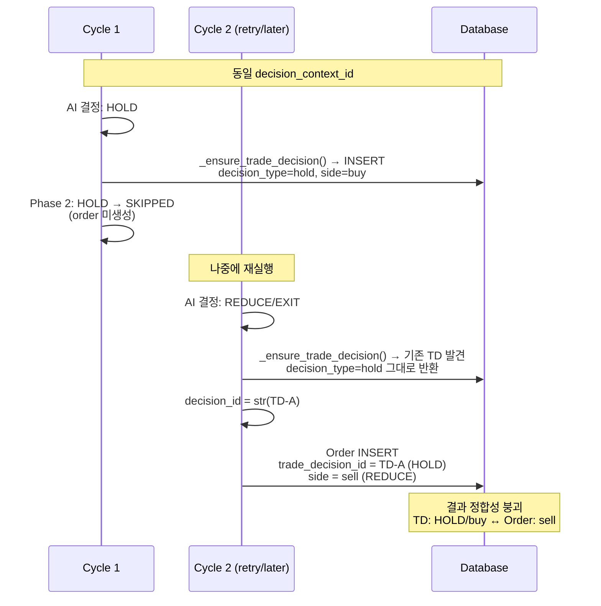
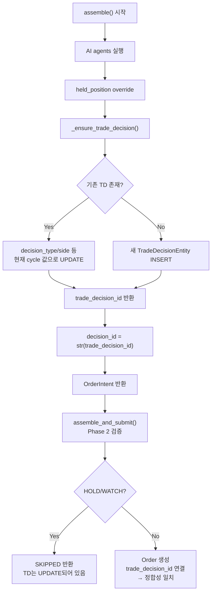
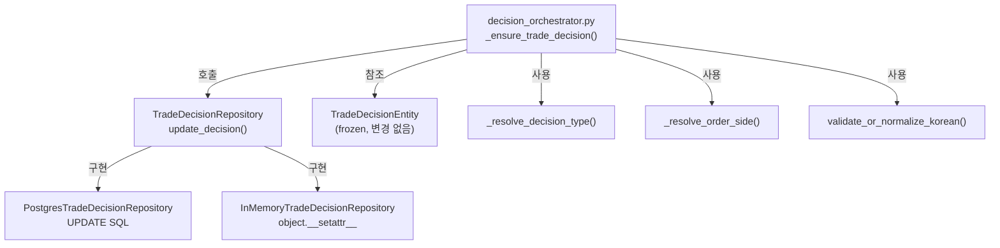

# Phase 2 (B-1): trade_decision 재사용/업데이트 정합성 설계

**작성일**: 2026-05-20  
**작성자**: Roo (architect)  
**상태**: 설계 초안 (리뷰 필요)  
**관련 문서**: [`held_position_sell_budget_scope_narrowing_and_decision_order_linkage_analysis_2026-05-20.md`](plans/held_position_sell_budget_scope_narrowing_and_decision_order_linkage_analysis_2026-05-20.md)

---

## 목차

1. [현황 분석](#1-현황-분석)
2. [문제 정의](#2-문제-정의)
3. [B-1 상세 설계](#3-b-1-상세-설계)
4. [변경 영향 범위](#4-변경-영향-범위)
5. [테스트 전략](#5-테스트-전략)
6. [리스크 평가 및 Rollback 방안](#6-리스크-평가-및-rollback-방안)
7. [Todo List](#7-todo-list)

---

## 1. 현황 분석

### 1.1 `_ensure_trade_decision()` 현재 동작 (line 2277–2389)

```python
async def _ensure_trade_decision(self, *, request, assembled_context,
                                   agent_bundle, decision_context_id, fdc_run_id=None):
    if decision_context_id is None:
        return None

    existing = await self._repos.trade_decisions.get_by_context(decision_context_id)
    if existing is not None:
        return existing.trade_decision_id  # ★ 재사용만 하고 UPDATE 안 함

    # ★ 신규 생성 (아래는 INSERT 로직)
    decision = TradeDecisionEntity(...)
    saved = await self._repos.trade_decisions.add(decision)
    return saved.trade_decision_id
```

**핵심 문제**: 기존 trade_decision 발견 시 `trade_decision_id`만 반환하고, `decision_type`/`side` 등은 **절대 갱신하지 않음**.

### 1.2 DB 제약 조건

```sql
decision_context_id UUID NOT NULL UNIQUE 
    REFERENCES trading.decision_contexts (decision_context_id)
```

- `trade_decisions` 테이블의 `decision_context_id`는 **UNIQUE 제약 조건**이 있음
- 동일 `decision_context_id`에 대해 최대 1개의 row만 존재 가능
- 따라서 두 번째 `_ensure_trade_decision()` 호출은 항상 "기존 존재 → 재사용" 경로로 감

### 1.3 `decision_context_id` 재사용 시나리오

`_ensure_or_create_decision_context()` (line 1619–1775):
- `existing_context_id`가 제공되면 → **항상 그 ID를 반환** (DB 존재 여부 무관)
- caller(paper loop)가 동일한 `decision_context_id`를 제공하면 여러 cycle에서 같은 context 재사용

### 1.4 문제 발생 시퀀스



### 1.5 현재 이상 데이터 현황 (기존 분석 재인용)

| 이상 사례 | 건수 | 설명 |
|-----------|------|------|
| HOLD decision + order 존재 | 4건 | order가 존재하면 안 되는 HOLD에 order 연결 |
| decision_side ≠ order_side | 4건 | buy vs sell 불일치 |
| order_at < decision_at (음수 lag) | 7건 | order 생성 시점이 decision 생성보다 빠름 |

---

## 2. 문제 정의

### 2.1 핵심 문제

1. **`_ensure_trade_decision()`의 무조건적 재사용**
   - 기존 `TradeDecisionEntity` 발견 시 `decision_type`/`side`를 현재 cycle의 AI 결정값으로 갱신하지 않음
   - 이전 cycle의 HOLD 결정이 그대로 남아, 이후 cycle의 REDUCE/EXIT order와 정합성 불일치 발생

2. **`TradeDecisionRepository`에 UPDATE 메서드 부재**
   - 현재 protocol: `add()`, `get()`, `get_by_context()`, `list_all()`만 존재
   - `update()` 또는 `update_decision()` 메서드가 없음

3. **`TradeDecisionEntity`가 frozen dataclass**
   - `@dataclass(slots=True, frozen=True)` — 인스턴스 생성 후 필드 변경 불가
   - UPDATE는 DB row를 직접 수정하는 SQL로 처리해야 함

### 2.2 B-1 설계 목표

- 동일 `decision_context_id`에 대해 기존 trade_decision이 있으면,
  `decision_type`, `side`, 그 외 변경 가능한 필드를 **현재 cycle의 AI 결정값으로 UPDATE**
- HOLD/WATCH persistence는 유지 (추적성 보존)
- 신규 INSERT 로직은 현재와 동일하게 유지

---

## 3. B-1 상세 설계

### 3.1 변경 흐름도



### 3.2 파일별 변경 사항

#### 3.2.1 [`contracts.py`](src/agent_trading/repositories/contracts.py:316) — TradeDecisionRepository 프로토콜 확장

```python
class TradeDecisionRepository(Protocol):
    async def add(self, decision: TradeDecisionEntity) -> TradeDecisionEntity:
        ...

    async def get(self, trade_decision_id: UUID) -> TradeDecisionEntity | None:
        ...

    async def get_by_context(self, decision_context_id: UUID) -> TradeDecisionEntity | None:
        ...

    async def list_all(self) -> Sequence[TradeDecisionEntity]:
        ...

    # ★ 신규: trade_decision 업데이트 메서드
    async def update_decision(
        self,
        trade_decision_id: UUID,
        *,
        decision_type: DecisionType,
        side: OrderSide,
        agent_label: str | None = None,
        rationale_summary: str | None = None,
        confidence: Decimal | None = None,
        reason_codes: list[str] | None = None,
        decision_json: dict[str, object] | None = None,
    ) -> None:
        """Update mutable fields on an existing trade decision.
        
        Updates only the fields that can change between cycles for the same
        ``decision_context_id``.  Immutable fields (``trade_decision_id``,
        ``decision_context_id``, ``strategy_id``, ``symbol``, ``market``,
        ``created_at``) are never updated.
        
        Parameters
        ----------
        trade_decision_id : UUID
            PK of the trade decision to update.
        decision_type : DecisionType
            New decision type (e.g., REDUCE, EXIT, HOLD).
        side : OrderSide
            New side (BUY / SELL).
        agent_label : str | None
            Optional agent label override.
        rationale_summary : str | None
            Updated AI rationale.
        confidence : Decimal | None
            Updated confidence score.
        reason_codes : list[str] | None
            Updated reason codes.
        decision_json : dict[str, object] | None
            Updated full decision JSON payload.
        """
        ...
```

**업데이트 가능 필드 식별**:

| 필드 | 업데이트 가능? | 이유 |
|------|---------------|------|
| `trade_decision_id` | ❌ 불가 | PK, 불변 |
| `decision_context_id` | ❌ 불가 | FK + UNIQUE, 불변 |
| `decision_type` | ✅ 가능 | **핵심 변경 대상** |
| `side` | ✅ 가능 | **핵심 변경 대상** |
| `strategy_id` | ❌ 불가 | FK, context와 동일 |
| `symbol` | ❌ 불가 | 불변 |
| `market` | ❌ 불가 | 불변 |
| `entry_style` | ❌ 불가 | 한 번 결정되면 변경 불필요 |
| `entry_price` | ❌ 불가 | 초기 진입가 |
| `quantity` | ❌ 불가 | sizing에서 결정, TD는 기록용 |
| `max_order_value` | ❌ 불가 | quantity 파생값 |
| `source_type` | ❌ 불가 | context에서 결정, 불변 |
| `agent_run_id` | ❌ 불가 | 최초 생성 시점 고정 |
| `confidence` | ✅ 가능 | 각 cycle마다 재평가 |
| `rationale_summary` | ✅ 가능 | override로 인해 변경 가능 |
| `reason_codes` | ✅ 가능 | cycle마다 달라짐 |
| `decision_json` | ✅ 가능 | 전체 decision payload 갱신 |
| `risk_check_passed` | ✅ 가능 | cycle마다 달라짐 |
| `opposing_evidence` | ✅ 가능 | cycle마다 달라짐 |
| `exit_plan_json` | ✅ 가능 | cycle마다 달라짐 |
| `created_at` | ❌ 불가 | 생성 시각 불변 |

#### 3.2.2 [`PostgresTradeDecisionRepository`](src/agent_trading/repositories/postgres/trade_decisions.py:11) — Postgres 구현

```python
async def update_decision(
    self,
    trade_decision_id: UUID,
    *,
    decision_type: DecisionType,
    side: OrderSide,
    agent_label: str | None = None,
    rationale_summary: str | None = None,
    confidence: Decimal | None = None,
    reason_codes: list[str] | None = None,
    decision_json: dict[str, object] | None = None,
) -> None:
    """Update mutable fields on an existing trade decision row."""
    await self._tx.connection.execute(
        """
        UPDATE trading.trade_decisions
        SET
            decision_type = $2,
            side = $3,
            agent_label = COALESCE($4, agent_label),
            rationale_summary = COALESCE($5, rationale_summary),
            confidence = COALESCE($6, confidence),
            reason_codes = CASE WHEN $7 IS NOT NULL THEN $7::jsonb ELSE reason_codes END,
            decision_json = CASE WHEN $8 IS NOT NULL THEN $8::jsonb ELSE decision_json END,
            updated_at = NOW()
        WHERE trade_decision_id = $1
        """,
        trade_decision_id,
        decision_type.value,
        side.value,
        agent_label,
        rationale_summary,
        confidence,
        json.dumps(reason_codes) if reason_codes is not None else None,
        json.dumps(decision_json) if decision_json is not None else None,
    )
```

**참고**: `trading.trade_decisions` 테이블에 `updated_at` 컬럼이 없으면 migration 필요.  
`agent_label` 컬럼도 없으면 migration 필요 (TradeDecisionEntity에는 없으므로 제외 가능).

실제로는 현재 entity에 없는 필드는 제외하고, **필수 변경 필드만 UPDATE**:

```python
async def update_decision(
    self,
    trade_decision_id: UUID,
    *,
    decision_type: DecisionType,
    side: OrderSide,
    rationale_summary: str | None = None,
    confidence: Decimal | None = None,
    reason_codes: list[str] | None = None,
    decision_json: dict[str, object] | None = None,
) -> None:
    await self._tx.connection.execute(
        """
        UPDATE trading.trade_decisions
        SET
            decision_type = $2,
            side = $3,
            rationale_summary = COALESCE($5, rationale_summary),
            confidence = COALESCE($6, confidence),
            reason_codes = CASE WHEN $7 IS NOT NULL THEN $7::jsonb ELSE reason_codes END,
            decision_json = CASE WHEN $8 IS NOT NULL THEN $8::jsonb ELSE decision_json END
        WHERE trade_decision_id = $1
        """,
        trade_decision_id,
        decision_type.value,
        side.value,
        rationale_summary,
        confidence,
        json.dumps(reason_codes) if reason_codes is not None else None,
        json.dumps(decision_json) if decision_json is not None else None,
    )
```

#### 3.2.3 [`decision_orchestrator.py`](src/agent_trading/services/decision_orchestrator.py:2277) — `_ensure_trade_decision()` 수정

**변경 전** (line 2309-2310):
```python
if existing is not None:
    return existing.trade_decision_id
```

**변경 후**:
```python
if existing is not None:
    # ★ B-1: 기존 trade_decision을 현재 cycle의 AI 결정값으로 UPDATE
    new_decision_type = _resolve_decision_type(composer_output.decision_type)
    new_side = _resolve_order_side(composer_output.side, request.side)
    
    # 변경이 있을 때만 UPDATE (불필요한 UPDATE 방지)
    if (existing.decision_type != new_decision_type 
            or existing.side != new_side):
        try:
            await self._repos.trade_decisions.update_decision(
                trade_decision_id=existing.trade_decision_id,
                decision_type=new_decision_type,
                side=new_side,
                rationale_summary=validate_or_normalize_korean(
                    composer_output.summary or None
                ),
                confidence=Decimal(str(composer_output.confidence)),
                reason_codes=list(composer_output.reason_codes) or None,
                decision_json={
                    "decision_type": composer_output.decision_type,
                    "side": composer_output.side,
                    "entry_style": composer_output.entry_style,
                    "time_horizon": composer_output.time_horizon,
                    "event_bias": ai_inputs.event_bias,
                    "event_conflict": ai_inputs.event_conflict,
                    "event_reason_codes": list(ai_inputs.event_reason_codes),
                    "risk_reason_codes": list(ai_inputs.risk_reason_codes),
                    "reason_codes": list(ai_inputs.reason_codes),
                    "opposing_evidence": list(ai_inputs.opposing_evidence),
                    "confidence": ai_inputs.confidence,
                    "conviction": ai_inputs.conviction,
                    "risk_opinion": ai_inputs.risk_opinion,
                    "risk_flags": list(ai_inputs.risk_flags),
                    "execution_preferences": _dataclass_to_dict(
                        composer_output.execution_preferences
                    ),
                    "sizing_hint": _dataclass_to_dict(composer_output.sizing_hint),
                },
            )
            logger.info(
                "Trade decision UPDATED: id=%s old=(%s,%s) new=(%s,%s)",
                existing.trade_decision_id,
                existing.decision_type, existing.side,
                new_decision_type, new_side,
            )
        except Exception:
            logger.warning(
                "Trade decision update failed for id=%s",
                existing.trade_decision_id,
                exc_info=True,
            )
    else:
        logger.debug(
            "Trade decision unchanged: id=%s type=%s side=%s",
            existing.trade_decision_id,
            existing.decision_type,
            existing.side,
        )
    return existing.trade_decision_id
```

**변경이 있을 때만 UPDATE하는 이유**:
- 동일 `decision_type`/`side`가 유지된 단순 재실행에서는 UPDATE 불필요
- DB write 부하 최소화
- audit log 노이즈 감소

#### 3.2.4 In-memory Repository (테스트용)

[`repositories/memory.py`](src/agent_trading/repositories/memory.py)에 `update_decision()` 구현 필요:

```python
class InMemoryTradeDecisionRepository:
    def __init__(self):
        self._store: dict[UUID, TradeDecisionEntity] = {}

    async def update_decision(
        self,
        trade_decision_id: UUID,
        *,
        decision_type: DecisionType,
        side: OrderSide,
        rationale_summary: str | None = None,
        confidence: Decimal | None = None,
        reason_codes: list[str] | None = None,
        decision_json: dict[str, object] | None = None,
    ) -> None:
        entity = self._store.get(trade_decision_id)
        if entity is None:
            raise ValueError(f"TradeDecision not found: {trade_decision_id}")
        # frozen dataclass이므로 object.__setattr__로 필드 변경
        object.__setattr__(entity, "decision_type", decision_type)
        object.__setattr__(entity, "side", side)
        if rationale_summary is not None:
            object.__setattr__(entity, "rationale_summary", rationale_summary)
        if confidence is not None:
            object.__setattr__(entity, "confidence", confidence)
        if reason_codes is not None:
            object.__setattr__(entity, "reason_codes", reason_codes)
        if decision_json is not None:
            object.__setattr__(entity, "decision_json", decision_json)
```

### 3.3 DB Migration

`trading.trade_decisions` 테이블에 `updated_at` 컬럼 추가 (선택 사항):

```sql
BEGIN;

-- updated_at 컬럼 추가 (변경 추적용)
ALTER TABLE trading.trade_decisions
    ADD COLUMN IF NOT EXISTS updated_at TIMESTAMPTZ;

-- 기존 데이터는 created_at과 동일한 값으로 설정
UPDATE trading.trade_decisions
SET updated_at = created_at
WHERE updated_at IS NULL;

COMMIT;
```

### 3.4 Data Migration (이상 데이터 정리)

기존에 이미 발생한 정합성 깨진 데이터 정리:

**Option A**: HOLD/WATCH decision에 연결된 order의 `trade_decision_id`를 NULL로 설정
```sql
UPDATE trading.order_requests o
SET trade_decision_id = NULL
FROM trading.trade_decisions td
WHERE o.trade_decision_id = td.trade_decision_id
  AND td.source_type = 'held_position'
  AND td.decision_type IN ('hold', 'watch');
```

**Option B**: HOLD/WATCH trade_decision의 `decision_type`/`side`를 실제 order와 일치하도록 갱신
- 이方案은 trade_decision의 의미를 훼손할 수 있으므로 권장하지 않음

**Option C**: 이상 데이터 식별만 하고 수정하지 않음 (모니터링으로 전환)
- B-1 적용 후에는 신규 이상 데이터가 발생하지 않으므로, 기존 데이터는 DBA 판단에 맡김

**권장**: Option A (order의 FK만 정리) + 향후 B-1 적용으로 신규 이상 데이터 차단

### 3.5 B-1 적용 후 기대 효과

| 이상 사례 | 현재 상태 | B-1 적용 후 |
|-----------|-----------|-------------|
| HOLD decision + order 존재 | 4건 | 신규 발생 차단. 기존 데이터는 migration으로 정리 |
| decision_side(buy) ≠ order_side(sell) | 4건 | REDUCE/EXIT 결정 시 TD side='sell'로 업데이트 → 정합성 회복 |
| order_at < decision_at (음수 lag) | 7건 | 기존 데이터는 그대로지만, 신규 cycle에서는 정합적 생성 순서 보장 |
| Budget 오판정 | BUY도 special lane 소비 | Phase 1(3중 조건)과 독립적, Phase 2 범위 아님 |

---

## 4. 변경 영향 범위

### 4.1 변경 파일 목록

| # | 파일 | 변경 내용 | 영향 범위 |
|---|------|-----------|-----------|
| 1 | [`contracts.py`](src/agent_trading/repositories/contracts.py:316) | `TradeDecisionRepository` 프로토콜에 `update_decision()` 메서드 추가 | 인터페이스 확장 |
| 2 | [`postgres/trade_decisions.py`](src/agent_trading/repositories/postgres/trade_decisions.py:11) | `PostgresTradeDecisionRepository`에 `update_decision()` SQL 구현 | Postgres 구현체 |
| 3 | [`memory.py`](src/agent_trading/repositories/memory.py) | `InMemoryTradeDecisionRepository`에 `update_decision()` 구현 | In-memory 구현체 (테스트) |
| 4 | [`decision_orchestrator.py`](src/agent_trading/services/decision_orchestrator.py:2277) | `_ensure_trade_decision()` UPDATE 로직 추가 | 핵심 로직 변경 |
| 5 | DB migration (신규) | `trading.trade_decisions`에 `updated_at` 컬럼 추가 | 스키마 변경 (선택) |
| 6 | Data migration (신규) | 이상 데이터 정리 SQL | 데이터 정합성 |

### 4.2 변경하지 않는 파일

| 파일 | 이유 |
|------|------|
| `decision_contexts.py` | 변경 불필요 — context 생성 로직은 그대로 |
| `entity/entities.py` | `TradeDecisionEntity` 자체는 불변 유지 (frozen) |
| `assemble_and_submit()` | Phase 2 검증 로직 변경 불필요 |
| `build_submit_order_request_from_decision()` | 순수 함수, 변경 불필요 |
| Scheduler/paper loop 코드 | Phase 1과 독립적, 변경 불필요 |

### 4.3 의존성 그래프



---

## 5. 테스트 전략

### 5.1 기존 테스트 현황

| 테스트 파일 | 라인 수 | 영향 |
|-------------|---------|------|
| `tests/services/test_decision_orchestrator.py` | 1,357 | 직접 영향 — UPDATE 로직 테스트 필요 |
| `tests/services/test_decision_submit_pipeline.py` | 1,369 | 간접 영향 — pipeline에서 TD 업데이트 검증 |
| `tests/services/test_held_position_sell_override.py` | — | override 후 TD 업데이트 검증 |

**기존 테스트 152개 중 영향받는 테스트**: 약 30-40개 (trade_decision 생성/재사용 관련)

### 5.2 신규 테스트 케이스

#### 단위 테스트 (Unit Tests)

| # | 테스트명 | 검증 내용 | 우선순위 |
|---|---------|-----------|----------|
| UT-1 | `test_update_decision_updates_fields` | `update_decision()` 호출 후 필드가 올바르게 변경됨 | P0 |
| UT-2 | `test_update_decision_nonexistent_id` | 존재하지 않는 ID에 `update_decision()` 호출 시 처리 | P0 |
| UT-3 | `test_ensure_trade_decision_updates_existing` | 기존 TD 존재 시 `decision_type`/`side` UPDATE 확인 | P0 |
| UT-4 | `test_ensure_trade_decision_no_update_when_unchanged` | 동일 `decision_type`/`side`면 UPDATE 생략 | P0 |
| UT-5 | `test_ensure_trade_decision_creates_new` | TD 없을 시 정상 INSERT (기존 동작 회귀 방지) | P0 |
| UT-6 | `test_update_decision_preserves_immutable_fields` | `trade_decision_id`, `created_at` 등 불변 필드 보존 확인 | P1 |
| UT-7 | `test_update_decision_logs_on_failure` | UPDATE 실패 시 로깅 및 기존 TD ID 반환 (fail-open) | P1 |
| UT-8 | `test_ensure_trade_decision_hold_to_reduce_update` | HOLD → REDUCE 전환 시 UPDATE 확인 | P0 |

#### 통합 테스트 (Integration Tests)

| # | 테스트명 | 검증 내용 | 우선순위 |
|---|---------|-----------|----------|
| IT-1 | `test_assemble_and_submit_td_update_on_override` | held_position override 후 TD UPDATE 검증 | P0 |
| IT-2 | `test_assemble_and_submit_hold_skipped_td_persisted` | HOLD 결정에도 TD UPDATE 유지 확인 | P0 |
| IT-3 | `test_assemble_and_submit_decision_side_consistency` | REDUCE + sell 결정 시 TD side='sell' 일치 확인 | P0 |
| IT-4 | `test_assemble_reuses_decision_context_id` | 동일 `decision_context_id` 전달 시 UPDATE 확인 | P1 |

### 5.3 회귀 테스트 (기존 동작 보호)

| # | 테스트명 | 검증 내용 |
|---|---------|-----------|
| RT-1 | 기존 `test_ensure_trade_decision_creates_new` | 신규 INSERT 동작 회귀 없음 |
| RT-2 | 기존 `test_assemble_and_submit_happy_path` | 전체 pipeline 정상 동작 |
| RT-3 | 기존 `test_held_position_sell_override` | override 후 TD 생성/업데이트 정상 |
| RT-4 | 기존 `test_assemble_and_submit_hold_skip` | HOLD/WATCH SKIP 로직 영향 없음 |

### 5.4 테스트 실행 전략

1. **단위 테스트**: `test_decision_orchestrator.py`에 신규 테스트 클래스 추가
2. **통합 테스트**: `test_decision_submit_pipeline.py`에 신규 시나리오 추가
3. **모의 객체**: In-memory repository로 `update_decision()` 모킹
4. **Postgres 테스트**: `test_postgres_trade_decisions.py` 신규 파일 (선택)

---

## 6. 리스크 평가 및 Rollback 방안

### 6.1 리스크 평가

| 리스크 | 확률 | 영향 | 대응 방안 |
|--------|------|------|-----------|
| UPDATE 중 예외 발생으로 TD 미갱신 | 낮음 | 중간 (정합성 불일치) | Fail-open: 로그만 남기고 기존 TD ID 반환 (기존 동작 유지) |
| 동시성: 여러 cycle이 동시에 UPDATE 경합 | 낮음 | 낮음 | UPDATE는 단일 row, PostgreSQL MVCC로 처리 |
| 잘못된 값으로 UPDATE (overwrite 실수) | 낮음 | 높음 | 변경 감지 조건(`if existing.decision_type != new...`)으로 보호 |
| `decision_json` UPDATE로 인한 데이터 증가 | 매우 낮음 | 낮음 | JSONB 필드, UPDATE 시마다 동일 크기 유지 |
| 기존 테스트 회귀 | 중간 | 중간 | 신규 테스트 + CI 파이프라인으로 보호 |

### 6.2 Rollback 방안

**Phase 2 B-1 Rollback**:

1. **코드 롤백**: `_ensure_trade_decision()`에서 UPDATE 로직 제거 (기존 `return existing.trade_decision_id` 복원)
2. **Repository 롤백**: `update_decision()` 메서드는 제거하지 않고 유지 (다른 용도로 사용 가능)
3. **DB migration 롤백**:
   ```sql
   ALTER TABLE trading.trade_decisions DROP COLUMN IF EXISTS updated_at;
   ```
4. **Data migration 롤백**: Option A(HOLD order FK 정리)는 일회성 작업이므로 롤백 불필요
   - 필요시: `UPDATE trading.order_requests SET trade_decision_id = <원래값> WHERE ...`

### 6.3 배포 순서

```
1. DB migration (updated_at 컬럼 추가)
2. Data migration (이상 데이터 정리, 선택)
3. Repository 계층 변경 (contracts.py → postgres → memory)
4. Core 로직 변경 (decision_orchestrator.py)
5. 테스트 추가 및 실행
6. Paper loop dry_run 검증
7. 프로덕션 배포
```

---

## 7. Todo List

### Phase 2 B-1 구현

- [ ] **B-1-1**: [`contracts.py`](src/agent_trading/repositories/contracts.py:316) — `TradeDecisionRepository` 프로토콜에 `update_decision()` 메서드 추가
- [ ] **B-1-2**: [`postgres/trade_decisions.py`](src/agent_trading/repositories/postgres/trade_decisions.py:11) — `PostgresTradeDecisionRepository.update_decision()` SQL 구현
- [ ] **B-1-3**: [`memory.py`](src/agent_trading/repositories/memory.py) — `InMemoryTradeDecisionRepository.update_decision()` 구현 (테스트용)
- [ ] **B-1-4**: [`decision_orchestrator.py`](src/agent_trading/services/decision_orchestrator.py:2277) — `_ensure_trade_decision()`에 UPDATE 로직 추가
  - 기존 TD 존재 시 `decision_type`/`side` 변경 감지
  - 변경된 경우만 `update_decision()` 호출
  - 실패 시 fail-open (로그만 기록, 기존 TD ID 반환)
- [ ] **B-1-5**: DB migration 스크립트 작성 — `trading.trade_decisions.updated_at` 컬럼 추가
- [ ] **B-1-6**: Data migration SQL 작성 — HOLD/WATCH decision에 연결된 order FK 정리 (선택)

### 테스트

- [ ] **B-1-T1**: 단위 테스트 — `update_decision()` 정상 동작 검증 (UT-1 ~ UT-8)
- [ ] **B-1-T2**: 통합 테스트 — `assemble_and_submit()`에서 TD UPDATE 검증 (IT-1 ~ IT-4)
- [ ] **B-1-T3**: 회귀 테스트 — 기존 152개 테스트 전체 통과 확인

### 검증

- [ ] **B-1-V1**: Paper loop dry_run 모드에서 UPDATE 로깅 확인
- [ ] **B-1-V2**: DB query로 정합성 확인 — `decision_type`/`side` 일치 여부
- [ ] **B-1-V3**: 이상 사례 0건 확인 (기존 4+4+7건)
