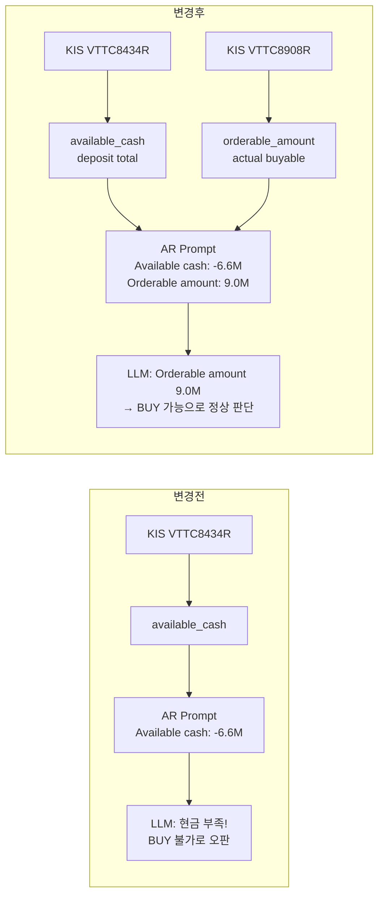

# 설계 보고서: AR 에이전트 현금 판단 기준을 `available_cash`에서 `orderable_amount` 우선으로 전환

**작성일:** 2026-05-21  
**상태:** 설계 초안 (리뷰 대기)

---

## 1. 기존 문제 분석

### 1.1 `available_cash` 단독 사용 시 LLM 오판 시나리오

AR(AI Risk) 에이전트는 현재 [`ai_risk.py:374`](../../src/agent_trading/services/ai_agents/ai_risk.py:374)에서 아래 코드로 Cash Balance 정보를 LLM 프롬프트에 전달합니다.

```python
# ai_risk.py line 374 (변경 전)
lines.append(f"  Available cash: {cash.available_cash}")
```

`available_cash`는 KIS `VTTC8434R.output2.dnca_tot_amt`(예수금총액) 기반입니다. 이 값은 D+2 결제 기준의 회계적 예수금 총액으로, 실제 주문 가능 현금과 다를 수 있습니다.

**문제 상황:**
- 미수금/대출금이 반영되면 `available_cash`가 **음수**로 표시됨
- 그러나 `orderable_amount`(KIS `ord_psbl_amt`, 실제 주문 가능 금액)는 **양수**일 수 있음
- LLM이 `available_cash` 음수만 보고 "현금 부족 → BUY 불가"로 잘못 판단할 위험

### 1.2 실제 데이터 예시

| 지표 | 값 | 의미 |
|------|------|------|
| `available_cash` | -6,629,580 KRW | 예수금총액 (미수/대출 반영으로 음수) |
| `orderable_amount` | 9,050,070 KRW | 실제 주문 가능 금액 (양수) |

→ AR 에이전트가 `available_cash` = -6.6M만 보고 "현금 부족 → BUY 불가"로 결론내릴 위험.  
→ 실제로는 `orderable_amount` = 9.05M으로 매수 여력이 충분함.

### 1.3 현황 요약

| 항목 | 상태 |
|------|------|
| AR가 `available_cash` 사용 위치 | [`ai_risk.py:374`](../../src/agent_trading/services/ai_agents/ai_risk.py:374) — Cash Balance 섹션에 단독 노출 |
| `orderable_amount`가 AR 프롬프트에 존재하는가? | **전혀 없음** |
| FDC 프롬프트에 Cash Balance 정보가 있는가? | 없음 (이번 변경 범위 제외) |
| `entities.py`에 `orderable_amount` 필드 존재? | **이미 존재** ([`entities.py:151`](../../src/agent_trading/domain/entities.py:151)) |
| `sizing_engine.py`는 `orderable_amount` 우선 사용? | 이미 적용됨 ([`sizing_engine.py:294`](../../src/agent_trading/services/sizing_engine.py:294)) |

---

## 2. 변경 설계 — `ai_risk.py` AR 프롬프트 Cash Balance 섹션

### 2.1 대상 파일 및 위치

- **파일:** [`src/agent_trading/services/ai_agents/ai_risk.py`](../../src/agent_trading/services/ai_agents/ai_risk.py)
- **변경 범위:** Lines 374–380 (Cash Balance 섹션)

### 2.2 변경 전/후 코드

```python
# ==================================================
# 변경 전 (lines 372-380):
# ==================================================
if cash is not None:
    lines.append("")
    lines.append("=== Cash Balance ===")
    lines.append(f"  Available cash: {cash.available_cash}")          # line 374
    lines.append(f"  Currency: {cash.currency}")
    if cash.settled_cash is not None:
        lines.append(f"  Settled cash: {cash.settled_cash}")
    if cash.unsettled_cash is not None:
        lines.append(f"  Unsettled cash: {cash.unsettled_cash}")

# ==================================================
# 변경 후 (lines 372-386):
# ==================================================
if cash is not None:
    lines.append("")
    lines.append("=== Cash Balance ===")
    lines.append(f"  Available cash (deposit total, reference): {cash.available_cash}")
    if cash.orderable_amount is not None:
        lines.append(f"  Orderable amount (actual buyable cash): {cash.orderable_amount}")
    lines.append(f"  Currency: {cash.currency}")
    if cash.settled_cash is not None:
        lines.append(f"  Settled cash: {cash.settled_cash}")
    if cash.unsettled_cash is not None:
        lines.append(f"  Unsettled cash: {cash.unsettled_cash}")
```

### 2.3 설계 상세

| 항목 | 내용 |
|------|------|
| `available_cash` 레이블 변경 | `Available cash` → `Available cash (deposit total, reference)` |
| `orderable_amount` 추가 | `if cash.orderable_amount is not None` 조건부로 추가 |
| `orderable_amount` 위치 | `available_cash` 직후, `Currency` 이전 |
| 조건부 처리 | `orderable_amount`는 `None`일 수 있으므로(`Optional[Decimal]`) `is not None` 검사 필요 |

### 2.4 LLM 프롬프트 출력 예시

```
=== Cash Balance ===
  Available cash (deposit total, reference): -6629580
  Orderable amount (actual buyable cash): 9050070
  Currency: KRW
  Settled cash: 3000000
  Unsettled cash: 2000000
```

---

## 3. 프롬프트 지침 보강

Cash Balance 섹션 **하단**에 다음 지침을 추가합니다. 이는 LLM이 `available_cash`와 `orderable_amount`를 올바르게 해석하도록 유도합니다.

### 3.1 변경 코드

```python
# Cash Balance 섹션 종료 후 (기존 line 380 이후, 변경 후 line 386 이후)
# 지침 블록 추가
lines.append("")
lines.append("  【현금 판단 지침】")
lines.append("  - BUY 가능성/현금 여력 판단은 'Orderable amount'를 우선 기준으로 사용할 것")
lines.append("  - 'Available cash'는 예수금 총액으로 D+2 결제 기준의 회계적 참고값")
lines.append("  - 'Available cash'가 음수여도 즉시 '매수 불가'로 결론내리지 말 것")
lines.append("  - 실제 BUY 가능 여부는 반드시 'Orderable amount'로 판단할 것")
```

### 3.2 LLM 프롬프트 출력 예시 (전체 Cash Balance 섹션)

```
=== Cash Balance ===
  Available cash (deposit total, reference): -6629580
  Orderable amount (actual buyable cash): 9050070
  Currency: KRW
  Settled cash: 3000000
  Unsettled cash: 2000000

  【현금 판단 지침】
  - BUY 가능성/현금 여력 판단은 'Orderable amount'를 우선 기준으로 사용할 것
  - 'Available cash'는 예수금 총액으로 D+2 결제 기준의 회계적 참고값
  - 'Available cash'가 음수여도 즉시 '매수 불가'로 결론내리지 말 것
  - 실제 BUY 가능 여부는 반드시 'Orderable amount'로 판단할 것
```

---

## 4. FDC (Final Decision Composer) 검토

### 4.1 현재 상태

FDC 프롬프트에는 **Cash Balance 섹션이 존재하지 않습니다.** FDC는 AR의 `AIRiskOutput`(특히 `risk_score`)과 `sizing_engine`이 결정한 BUY/SELL/HOLD 신호를 기반으로 최종 결정을 내립니다.

### 4.2 이번 변경 범위에서 제외

FDC 프롬프트에 Cash Balance 정보를 추가하는 것은 이번 변경 범위에서 **제외**합니다. 이유는:

1. FDC는 AR의 리스크 평가 결과(`AIRiskOutput`)를 입력으로 받아 최종 결정만 수행
2. FDC가 직접 현금 정보를 평가할 필요는 없음 (AR이 현금 리스크를 평가함)
3. 변경 영향 범위를 최소화하여 리스크를 줄이는 것이 우선

### 4.3 장기적 권장사항

향후 FDC 프롬프트에도 Cash Balance 정보를 추가하는 것을 고려할 수 있습니다. 이는 FDC가 AR의 판단과 별개로 현금 상황을 크로스체크할 수 있는 근거를 제공합니다. 단, 이는 별도 설계 검토 후 진행해야 합니다.

---

## 5. 변경 범위 요약

### 5.1 변경 파일

| # | 파일 | 라인 | 변경 내용 | 영향 |
|---|------|------|-----------|------|
| 1 | [`ai_risk.py`](../../src/agent_trading/services/ai_agents/ai_risk.py) | 374 | `available_cash` 레이블 변경 (`Available cash` → `Available cash (deposit total, reference)`) | LLM이 회계적 참고값임을 인지 |
| 2 | [`ai_risk.py`](../../src/agent_trading/services/ai_agents/ai_risk.py) | 375-376 | `orderable_amount` 조건부 추가 (`if cash.orderable_amount is not None`) | LLM이 실제 BUY 가능 현금 확인 가능 |
| 3 | [`ai_risk.py`](../../src/agent_trading/services/ai_agents/ai_risk.py) | 380-386 | 현금 판단 지침 4줄 추가 (주석 형태 프롬프트 지침) | LLM 오판 방지 |
| 4 | [`test_agents.py`](../../tests/services/ai_agents/test_agents.py) | 신규 | 3개 신규 테스트 케이스 추가 | 회귀 방지 |

### 5.2 변경 불필요 파일

| 파일 | 이유 |
|------|------|
| [`entities.py`](../../src/agent_trading/domain/entities.py) | `orderable_amount` 필드 이미 존재 ([line 151](../../src/agent_trading/domain/entities.py:151)) |
| [`snapshot.py`](../../src/agent_trading/brokers/koreainvestment/snapshot.py) | KIS 원천 매핑 정확, 변경 불필요 |
| [`sizing_engine.py`](../../src/agent_trading/services/sizing_engine.py) | 이미 `orderable_amount` 우선 사용 중 ([line 294](../../src/agent_trading/services/sizing_engine.py:294)) |
| [`run_agent_subprocess.py`](../../scripts/run_agent_subprocess.py) | FDC skip 로직이 `orderable_amount` 올바르게 사용 중 |
| [`final_decision_composer.py`](../../src/agent_trading/services/ai_agents/final_decision_composer.py) | 이번 범위 제외 (장기적 개선으로 메모) |

### 5.3 변경 전/후 Mermaid 흐름도



---

## 6. 테스트 계획

### 6.1 신규 테스트 케이스

**대상 파일:** [`tests/services/ai_agents/test_agents.py`](../../tests/services/ai_agents/test_agents.py)

기존 테스트 패턴을 따르며, `agent._build_user_prompt(request)` 메서드를 통해 생성된 프롬프트의 특정 문자열을 `assert` 검증합니다.

#### 테스트 1: `test_ar_prompt_cash_balance_includes_orderable_amount`

| 항목 | 내용 |
|------|------|
| **목적** | AR 프롬프트 Cash Balance 섹션에 `orderable_amount`가 포함되는지 검증 |
| **시나리오** | `orderable_amount=Decimal("9050070"), available_cash=Decimal("-6629580")`인 CashBalanceSnapshotEntity로 프롬프트 생성 |
| **검증** | `"Orderable amount (actual buyable cash): 9050070"`이 prompt에 포함됨 |
| **기존 테스트 참고** | [`test_run_with_full_context`](../../tests/services/ai_agents/test_agents.py:576) 패턴 (`_build_user_prompt` 호출 → assert 문자열) |

#### 테스트 2: `test_ar_prompt_cash_balance_orderable_amount_none`

| 항목 | 내용 |
|------|------|
| **목적** | `orderable_amount=None`일 때 `Orderable amount` 라인이 출력되지 않는지 검증 |
| **시나리오** | `orderable_amount=None, available_cash=Decimal("5000000")`인 CashBalanceSnapshotEntity로 프롬프트 생성 |
| **검증** | `"Orderable amount"` 문자열이 prompt에 **포함되지 않음** (None이므로 조건부 생략) |

#### 테스트 3: `test_ar_prompt_cash_balance_includes_judgment_guidelines`

| 항목 | 내용 |
|------|------|
| **목적** | Cash Balance 섹션 하단의 현금 판단 지침 4줄이 모두 포함되는지 검증 |
| **시나리오** | 일반적인 CashBalanceSnapshotEntity로 프롬프트 생성 |
| **검증** | `"【현금 판단 지침】"` 및 4개 bullet이 모두 포함됨 |
| **세부 검증 항목** | `"BUY 가능성/현금 여력 판단은 'Orderable amount'를 우선 기준"`, `"'Available cash'는 예수금 총액으로 D+2 결제 기준"`, `"'Available cash'가 음수여도 즉시 '매수 불가'로 결론내리지 말 것"`, `"실제 BUY 가능 여부는 반드시 'Orderable amount'로 판단할 것"` |

### 6.2 기존 테스트 영향 분석

| 기존 테스트 | 변경 영향 | 분석 |
|------------|-----------|------|
| [`test_run_with_full_context`](../../tests/services/ai_agents/test_agents.py:576) | **Assert 수정 필요** | `"Available cash: 5000000"` → `"Available cash (deposit total, reference): 5000000"` |
| [`test_run_without_position_cash_risk`](../../tests/services/ai_agents/test_agents.py:652) | 영향 없음 | Cash Balance 섹션 자체가 없음 |
| [`test_ai_risk_prompt_includes_request_symbol_without_events`](../../tests/services/ai_agents/test_agents.py:109) | 영향 없음 | symbol만 검증 |
| 모든 `StubAIRiskAgent` 테스트 | 영향 없음 | Stub은 프롬프트 빌드 로직 사용 안 함 |

**→ 기존 테스트 1개(`test_run_with_full_context`)만 assert 문자열 변경 필요.**

---

## 7. 기존 회귀 테스트 확인

### 7.1 관련 테스트 파일

| 파일 | 테스트 수 | 비고 |
|------|-----------|------|
| [`tests/services/ai_agents/test_agents.py`](../../tests/services/ai_agents/test_agents.py) | ~2000 lines | AR/FDC/Stub 테스트 포함 |
| [`tests/services/ai_agents/test_bootstrap.py`](../../tests/services/ai_agents/test_bootstrap.py) | 다수 | Runtime에 AR 에이전트 포함 확인 |
| [`tests/services/ai_agents/test_orchestrator_agents.py`](../../tests/services/ai_agents/test_orchestrator_agents.py) | 다수 | 오케스트레이터 AR 통합 테스트 |

### 7.2 실행 명령어

```bash
# AR 관련 테스트만 실행 (빠른 피드백)
python -m pytest tests/services/ai_agents/test_agents.py -v -k "ar" --no-header -q

# 전체 AR/Stub 테스트 실행
python -m pytest tests/services/ai_agents/test_agents.py -v --no-header -q

# AI Agents 전체 테스트 실행
python -m pytest tests/services/ai_agents/ -v --no-header -q
```

### 7.3 기대 결과

- `test_run_with_full_context`: **실패** (assert 문자열 변경 필요, 위 6.2절 참고)
- 나머지 모든 기존 테스트: **통과**

---

## 8. 운영 검증 계획

### 8.1 배포 절차

| 단계 | 작업 | 상세 |
|------|------|------|
| 1 | 코드 변경 | [`ai_risk.py`](../../src/agent_trading/services/ai_agents/ai_risk.py) 374-386줄 수정 |
| 2 | 기존 테스트 assert 수정 | [`test_agents.py`](../../tests/services/ai_agents/test_agents.py) `test_run_with_full_context` assert 업데이트 |
| 3 | 신규 테스트 추가 | 위 6.1절의 3개 테스트 케이스 추가 |
| 4 | 테스트 실행 | `python -m pytest tests/services/ai_agents/test_agents.py -v` |
| 5 | Docker 재빌드 | **불필요** (Python 코드 변경만으로 적용, 코드 핫 리로드 가능) |

### 8.2 검증 절차

| 단계 | 내용 | 명령어/방법 |
|------|------|-------------|
| 1 | `/health` 엔드포인트 확인 | `curl http://localhost:8000/health` |
| 2 | 샘플 AR prompt 출력 확인 | AR 에이전트의 `_build_user_prompt()`를 호출하여 실제 프롬프트 로그 확인 (LLM API 호출 없이도 가능) |
| 3 | 프롬프트에 `Orderable amount` 포함 확인 | 로그에서 `=== Cash Balance ===` 섹션 이후 `Orderable amount` 문자열 확인 |
| 4 | 현금 판단 지침 포함 확인 | 로그에서 `【현금 판단 지침】` 및 4개 bullet 확인 |
| 5 | 실전/Paper 환경에서 테스트 | 두 환경 모두에서 프롬프트 출력 비교 (KIS paper API는 `orderable_amount`를 `None`으로 반환할 수 있음 → 조건부 로직 정상 동작 확인) |

### 8.3 롤백 계획

변경 전 코드는 아래와 같습니다. 문제 발생 시 원복 가능:

```python
# 롤백 대상 (원본 코드)
lines.append(f"  Available cash: {cash.available_cash}")
```

변경 사항은 단일 파일 1개([`ai_risk.py`](../../src/agent_trading/services/ai_agents/ai_risk.py))에 국한되므로, 롤백이 간단합니다.

---

## 부록: 참고 자료

1. [`ai_risk.py` 현재 Cash Balance 섹션](../../src/agent_trading/services/ai_agents/ai_risk.py:369)
2. [`entities.py` `CashBalanceSnapshotEntity` 정의](../../src/agent_trading/domain/entities.py:140)
3. [`sizing_engine.py` 현금 우선순위 로직](../../src/agent_trading/services/sizing_engine.py:275)
4. [`test_agents.py` 기존 AR 테스트](../../tests/services/ai_agents/test_agents.py:576)
5. Ask 분석 결과: AR 에이전트 현금 판단 기준 설계 요청 (`ai_risk.py:374` → `orderable_amount` 우선 전환)
